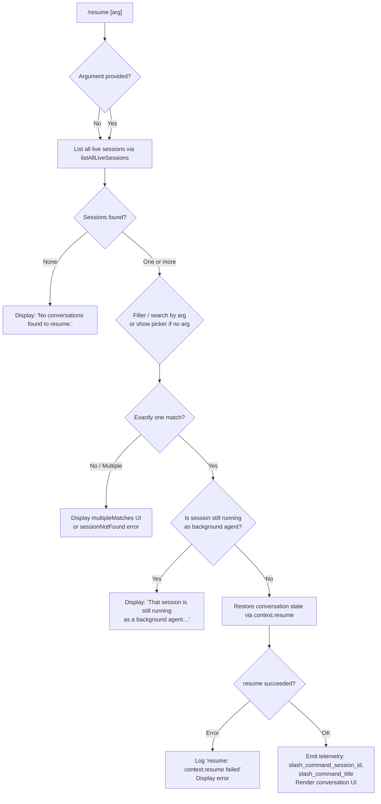

# `/resume`

> Analysis basis: CC v2.1.197 bundle.js (AST extraction + Claude interpretation)
> Minimum version: v2.1.197

---

## Overview

`/resume` (also aliased as `/continue`) allows the user to pick up a prior conversation by session ID or a search term. The handler resolves the target session from persisted transcripts and conversation metadata, validates that it is not still running as a background agent, then restores conversation state so the user can continue from where they left off.

---

## Registration

| Field | Value |
|---|---|
| type | `local-jsx` |
| name | `resume` |
| description | `Resume a previous conversation` |
| aliases | `["continue"]` |
| argumentHint | `[conversation id or search term]` |
| module_id | `Nzl` |
| load_inline | `true` |
| loc_byte | `12617678` |
| loc_byte_end | `12617875` |
| loc_line | `8488` |
| arbor_handler.name | `dqf` |
| arbor_handler.fqn | `claude-2.1.197::dqf` |
| arbor_handler.kind | `AsyncFunction` |
| arbor_handler.resolution_path | `module_id` |
| arbor_handler.n_hits | `0` |

Analysis basis: CC v2.1.197 bundle.js:+12617678

---

## Input Branching

There are 4+ distinct branches in the handler depending on argument presence, session-match results, and background-agent state.



Analysis basis: CC v2.1.197 bundle.js:+12616272, +12616282, +12616503, +12616515, +12616733, +12616834, +12616852, +12616960, +12616973, +12617101

---

## Behavioral Spec

### 1. Session Discovery (`nfe` — listLiveSessions)

The handler begins by calling the live-session enumeration function (`nfe`), which calls `n.listAllLiveSessions` and resolves a Promise with the current list of sessions. Sessions are marked as `"interactive"` or background based on their mode field.

```
async function listLiveSessions():
    sessions = await Promise.resolve(sessionStore.listAllLiveSessions())
    return sessions
```

Analysis basis: CC v2.1.197 bundle.js:+8870238, +8870268, +8870290, +8870381

---

### 2. Session Filtering and Search (`dqf` main body)

After retrieving sessions, the handler applies the user argument as a filter. If no argument is given, all sessions are presented in a picker. If an argument is supplied it is used to match against session IDs, titles, and timestamps.

```
async function resumeCommandHandler(userArg, context):
    sessions = await listLiveSessions()

    if sessions.length == 0:
        display("No conversations found to resume.")
        return

    if userArg is present:
        matches = sessions.filter(s => matchesTerm(s, userArg))
    else:
        matches = sessions   // present full picker

    if matches.length == 0:
        display(sessionNotFoundUI)
        return

    if matches.length > 1:
        display(multipleMatchesUI)
        return

    targetSession = matches[0]
```

Analysis basis: CC v2.1.197 bundle.js:+12616168, +12616198, +12616733, +12616834, +12616852, +12616866, +12616960, +12616973

The string `"No conversations found to resume."` is a literal message emitted when the filtered list is empty (bundle.js:+12616733).

---

### 3. Background-Agent Guard

Before restoring state, the handler checks whether the target session is currently executing as a background agent. If it is, the command is blocked with a specific warning message.

```
function checkNotRunningAsBackgroundAgent(session):
    if session.mode == "interactive" and session.isBackgroundAgent:
        display(
          "That session is still running as a background agent. " +
          "Open `claude agents` to attach to it, or stop it there first to resume here."
        )
        return BLOCKED
    return OK
```

The exact warning text is a string literal at bundle.js:+12616282. The role field `"user"` (bundle.js:+12616423) is consulted when constructing the initial restored message context, and the action `"skip"` (bundle.js:+12616485) is used when bypassing incompatible history entries during context reconstruction.

Analysis basis: CC v2.1.197 bundle.js:+12616282, +12616423, +12616485

---

### 4. Context Restoration (`ke` — contextResume)

If the session passes the guard, the handler calls the context-resume function (`ke`). This function internally uses `er` (error constructor helper), `ct` (string coercion), `zi`/`qbs` (state serializers), and `LNu` (a bounded history queue that shifts/pushes entries). Errors arising from context restoration are caught and logged with the message `"resume: context.resume failed"`.

```
async function contextResume(sessionId, context):
    try:
        state = buildStateFromSession(sessionId)   // via zi, qbs, ct
        historyQueue.enqueue(state)                // via LNu (shift + push)
        await context.resume(state)
    catch error:
        logError("resume: context.resume failed", error)
        displayError(error)
```

The error log string `"resume: context.resume failed"` is a literal at bundle.js:+12616515. The `LNu` bounded-queue helper shifts the oldest entry and pushes the new one (bundle.js:+1058921, +1058933).

Analysis basis: CC v2.1.197 bundle.js:+12616503, +12616509, +12616515, +1059246, +1059259, +1059505, +1059588

---

### 5. Conversation Listing UI (`_Z`, `GAe`, `xen` — conversation browser)

The conversation picker rendered when multiple sessions are available uses `_Z` (the picker coordinator), which in turn delegates to:

- `GAe`: Git worktree detection and session path resolution. It calls `git worktree list --porcelain` (literals `"worktree"`, `"list"`, `"--porcelain"` at bundle.js:+8858244, +8858255, +8858262), normalises paths (`NFC` at bundle.js:+66896), and emits telemetry event `tengu_worktree_detection` (bundle.js:+8858344).
- `xen`: Conversation title formatter, using `dr` (path helper `H0`), `$Ye` (transcript-file reader), and `_uc` (file-tree walker).
- `Dzl`: Renders bold labels via `It.bold` (bundle.js:+12613984).

```
function buildConversationPicker(sessions, filterTerm):
    worktrees = detectWorktrees()   // GAe → git worktree list --porcelain
    entries   = sessions
                  .map(s => formatTitle(s, worktrees))   // xen
                  .filter(e => matchesTerm(e, filterTerm))
                  .sort(localeCompare)
    return renderPicker(entries)    // Dzl bold labels
```

Analysis basis: CC v2.1.197 bundle.js:+12617120, +13669577, +13669595, +8858235, +8858425, +12613984

---

### 6. Session Metadata Hydration (`qAe`, `sfe`, `jAe`)

Once the target session is identified, full metadata is hydrated from the transcript store. The metadata layer (`sfe`) reads per-session keys including `"summary"`, `"last-prompt"`, `"custom-title"`, `"ai-title"`, `"tag"`, `"mode"`, `"permission-mode"`, `"agent-name"`, `"agent-color"`, and many others. These are retrieved via Map-based accessors (`n.get`, `s.get`, etc.) from the on-disk transcript database.

```
function hydrateSessionMetadata(sessionId):
    record = transcriptStore.get(sessionId)   // sfe Map lookups
    return {
        summary:        record.get("summary"),
        lastPrompt:     record.get("last-prompt"),
        customTitle:    record.get("custom-title"),
        aiTitle:        record.get("ai-title"),
        mode:           record.get("mode"),
        permissionMode: record.get("permission-mode"),
        agentName:      record.get("agent-name"),
        ...
    }
```

Analysis basis: CC v2.1.197 bundle.js:+13675560, +13675627, +13675831, +13675909, +13675979, +13676346, +13676409, +13676116

---

### 7. Telemetry Emission

After successful restoration the handler emits two telemetry-adjacent string values via the literal keys `"slash_command_session_id"` (bundle.js:+12616995) and `"slash_command_title"` (bundle.js:+12617220). These are passed to the telemetry subsystem (`ke` / `Ete.logError` path) as structured fields.

Analysis basis: CC v2.1.197 bundle.js:+12616995, +12617220

---

## State & Side Effects

| Item | Detail |
|---|---|
| Telemetry (worktree) | `tengu_worktree_detection` (bundle.js:+8858344) — fired during session-list building |
| Telemetry (daemon) | `tengu_daemon_control` (bundle.js:+18076516) — fired if daemon interaction occurs |
| Telemetry (transcript) | `tengu_transcript_phantom_parent` (bundle.js:+13674292), `tengu_transcript_parent_cycle` (bundle.js:+13678480), `tengu_chain_parent_cycle` (bundle.js:+13651906), `tengu_chain_timestamp_fallback` (bundle.js:+13652055), `tengu_chain_parallel_tr_recovered` (bundle.js:+13653921), `tengu_relink_walk_broken` (bundle.js:+13651412) — fired during transcript chain repair |
| Telemetry (background workers) | `tengu_bg_dispatch_sigkill_escalate`, `tengu_bg_dispatch_low_mem`, `tengu_bg_spare_enable`, `tengu_bg_spare_claim`, `tengu_bg_spare_claim_fail`, `tengu_bg_retire_pinned_low_mem`, `tengu_bg_prewarm_per_sweep` — background worker lifecycle events reachable via `GAe → Gr` |
| Telemetry (daemon lifecycle) | `tengu_daemon_idle_exit`, `tengu_daemon_yield`, `tengu_daemon_config_reload` |
| Conversation state | Restored via `context.resume`; history queue updated by `LNu` (bounded shift/push) |
| appState changes | Active session ID and title set from hydrated metadata; rendered UI switches to restored conversation |
| Error logging | `"resume: context.resume failed"` written to error log via `Ete.logError` (bundle.js:+1059647) |
| Sound | None detected in depth-2 traversal |
| Hook registration | None detected in depth-2 traversal |

---

## Version History

| Version | Change |
|---|---|
| v2.1.197 | Initial analysis |

---

## Common Mistakes

1. **Trying to resume an active background-agent session**: The command blocks with an explicit error message directing users to `claude agents` instead. You must stop the background session first.
2. **Ambiguous search terms**: If the supplied argument matches more than one session, a `multipleMatches` UI is shown rather than picking one automatically. Use a more specific term or the full session UUID.
3. **No argument when many sessions exist**: Without an argument the full session list is presented; in repositories with many worktrees this list can be long. Supplying a partial title or UUID narrows results immediately.
4. **Expecting instant state recovery on large transcripts**: The transcript hydration (`sfe`, `Sim`, `Eim`) performs file I/O including `readFile`, `stat`, and buffer parsing; on slow disks or very large conversation histories this may take a perceptible moment.
5. **Using `/resume` and `/continue` interchangeably in scripts**: Both are registered aliases and behave identically, but external tooling that inspects raw command names will see different strings.

---

## Appendix — Identifier Mapping

> For bundle debugging only. Identifiers change across versions.

| Identifier | Role |
|---|---|
| `dqf` | Main async handler for `/resume` command (arbor_handler) |
| `Ozl` | Session list filter / pre-handler shim |
| `Kg` | Conversation-picker renderer helper |
| `nfe` | Live-session enumeration (calls `listAllLiveSessions`) |
| `GAe` | Git worktree detection and session-path resolver |
| `Gr` | Child-process executor (runs git and other subprocesses) |
| `LBe` | Low-level process spawner with stdio wiring |
| `dvs` | Process argument builder (handles win32 `.exe`/`cmd` variants) |
| `_Z` | Conversation-picker coordinator |
| `xen` | Conversation-title formatter |
| `_uc` | File-tree walker / transcript file discoverer |
| `$Ye` | Transcript-file reader (Buffer-based JSONL parser) |
| `kim` | Per-file transcript entry deserializer |
| `UM` | UUID/session-ID validation (regex test via `qJc`) |
| `qAe` | Session metadata aggregator |
| `sfe` | Per-session metadata store (Map-based; reads all metadata keys) |
| `jAe` | Incremental metadata loader with file-stat freshness check |
| `Huc` | Metadata hydration entry point (calls `sfe` + `Object.assign`) |
| `bim` | Transcript file path resolver (joins paths, runs stat) |
| `OYe` | Timestamp parser helper (`Date.parse`) |
| `VAe` | Conversation-chain builder (deduplicates and sorts entries) |
| `lim` | Chain segment sorter and organizer |
| `sim` | Chain leaf-node extractor |
| `aim` | Chain NaN-guard and value iterator |
| `muc` | Chain map-entry merger |
| `Sim` | Binary transcript parser (reads JSONL with Buffer ops) |
| `Eim` | Incremental binary diff / patch reader |
| `Aim` | Atomic transcript reader (openSync / readSync / closeSync) |
| `huc` | Single-entry binary decoder |
| `yim` | Buffer compare helper for sort |
| `Wcc` | Conversation walk / tree-relink coordinator |
| `oim` | Walk-node reversal and dedup |
| `ke` | Context-resume orchestrator (calls `er`, `ct`, `zi`, `LNu`) |
| `er` | Error constructor normaliser |
| `ct` | String coercion utility |
| `zi` | State serializer (calls `qbs`) |
| `qbs` | State sub-serializer (calls `ct`) |
| `LNu` | Bounded history queue (shift oldest, push newest) |
| `Uo` | Object.assign-based state merger |
| `he` | String helper used in message construction |
| `dr` | Path utility wrapper (delegates to `H0`) |
| `H0` | Core path normalisation function |
| `nar` | Conversation-summary formatter (calls `xen`) |
| `Dzl` | Bold-label renderer (`It.bold`) |
| `OTe` | Additional conversation-option renderer |
| `ese` | Session-entry equality / dedup helper |
| `T` | Model/environment info builder |
| `doc` | Daemon status reader (`daemon.status.json`) |
| `Ks` | Async-store accessor (`jfd.getStore`) |
| `_Zt` | Daemon status file path builder |
| `o_` | Path normalisation (Unicode NFC) |
| `OS` | Path sanitiser / obfuscator |
| `bo` | <!-- TODO: not found in depth-2 traversal; needs --depth 4 --> |
| `BUe` | Transcript-entry slice and push helper |
| `vjo` | Directory-recursive transcript scanner |
| `yen` | Transcript entry cache (get/set/values) |
| `mFu` | String coercion for process args |
| `fFu` | Runner wrapper (calls `rn`) |
| `rn` | Low-level runner/executor |
| `Ed` | Environment descriptor |
| `V` | Void / no-op sentinel |
| `p` | Process-exit / abort handler |
| `rI` | Restart initiator |
| `u` | Abort-controller orchestrator |
| `deu` | Debug/env info collector |
| `Me` | JSON.stringify wrapper |
| `Pc` | Path cleaner / last-segment extractor |
| `KQe` | Path-to-display formatter |
| `geu` | File-size and buffer-length measurer |
| `FAe` | Feature-flag accessor |
| `JPe` | Project-path accessor |
| `uur` | Nested map getter/setter for session records |
| `dur` | Array-from-values converter |
| `CHt` | Map-to-array transformer |
| `Ujo` | Text replaceAll / slice helper |
| `UQt` | Structured content block builder |
| `Ol` | Markdown / text block parser |
| `Bjo` | Content-type discriminator (image/document guard) |
| `cim` | Content-block trim and array check |
| `uim` | Content array some-check |
| `Ijo` | Combined content-block pipeline (Ujo + CHt + Bjo) |
| `$jo` | Timestamp-based session sorter |
| `zo` | Runner error wrapper |
| `K` | Keypress / backspace interceptor |
| `le` | Input-focus handler with recording hooks |
| `ae` | Cancel-action handler |
| `re` | Voice recording state machine entry |
| `Z` | File cleanup coordinator (lstat / rm / readFile) |
| `eie` | Single-file cleanup executor |
| `e3l` | File unlink helper |
| `W` | Worker process pair holder |
| `Wcc` | Full conversation walk coordinator |
| `Mo` | Sentinel value factory |
| `Fn` | Simple function wrapper |
| `rwe` | BOM-aware stream reader |
| `n2u` | Stream concat reader |
| `o2u` | JSON-line extractor from stream |
| `r2u` | Binary-line-to-JSON reader |
| `t2u` | Stream reader entry point |
| `D` | Terminal write helper |
| `j` | Timer-based write flusher |
| `Y` | MCP update applier |
| `Ahe` | JSON.parse wrapper |
| `Gt` | JSON.parse wrapper (alternate) |
| `Aim` | Atomic file reader (openSync/readSync/closeSync) |
| `JL` | Directory listing helper (readdir + stat) |
| `t3` | Path builder sub-helper (uses `H0`) |
| `b2` | Project-path joiner (`sMe.join` + `Zn`) |
| `OTe` | Conversation result options renderer |
| `Dzl` | Bold-text label renderer |

---

Note: index built via Arbor fallback; some signals (telemetry, literals) may be missing — see arbor-fallback.js.