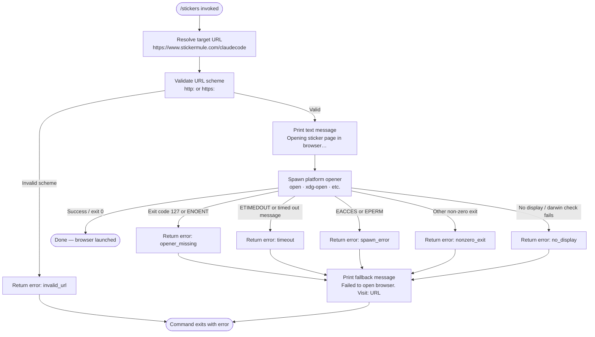

```
---
type: feature-spec
feature: "stickers"
cc_version: 2.1.197
updated: "2026-06-30"
tags: ["stickers", "commands", "slash-commands"]
source: "bundle-analysis"
bundle_verified: true
inherited_from: 2.1.196
analysis_basis: "CC v2.1.196 bundle.js (AST extraction + Claude interpretation)"
author: "ryujaeuk <ryujaeuk@gmail.com>"
repository: "https://github.com/MyLittleLuckyDog/cc-gnothi"
license: "AGPL-3.0-only"
---

# `/stickers`

> Analysis basis: CC v2.1.196 bundle.js (AST extraction + Claude interpretation)
> Minimum version: v2.1.196

---

## Overview

The `/stickers` command opens the Claude Code sticker ordering page (`https://www.stickermule.com/claudecode`) in the user's default system browser. It is a lightweight utility command with no arguments; its sole effect is to launch an external URL and report a brief status message. On failure it falls back to printing the URL directly so the user can navigate manually.

---

## Registration

| Field | Value |
|---|---|
| type | `local` |
| name | `stickers` |
| description | `Order Claude Code stickers` |
| loc_byte | `13042269` |
| loc_byte_end | `13042417` |
| loc_line | `9026` |
| supportsNonInteractive | `false` |
| module_id | `Htc` |
| load_inline | `true` |
| arbor_handler.name | `OJf` |
| arbor_handler.fqn | `claude-2.1.196::OJf` |
| arbor_handler.kind | `AsyncFunction` |
| arbor_handler.resolution_path | `module_id` |
| arbor_handler.n_hits | `0` |

Analysis basis: CC v2.1.196 bundle.js:+13042269

---

## Input Branching

The command accepts no user-supplied arguments. Branching occurs entirely on the outcome of the browser-open attempt (success / various failure modes), giving four or more distinct paths. A Mermaid flowchart is used.



Analysis basis: CC v2.1.196 bundle.js:+13042002, +3154423, +3155629, +3155939

---

## Behavioral Spec

### 1 · Handler entry point (`OJf`)

```
async function stickersHandler(context):
    targetURL = "https://www.stickermule.com/claudecode"
    result = await openURLInBrowser(targetURL)
    if result.error:
        printText("Failed to open browser. Visit: " + targetURL)
        return errorResult(result.errorCode)
    printText("Opening sticker page in browser…")
    return successResult()
```

Analysis basis: CC v2.1.196 bundle.js:+13042002, +13042059, +13042072, +13042143

### 2 · URL validation (`validateURL` / `LKr`)

Before attempting to open, the URL is validated. Only `http:` and `https:` schemes are accepted. Any other scheme causes an immediate `invalid_url` error with error code `1`.

```
function validateURL(rawURL):
    parsed = parseURL(rawURL)           // may throw on malformed input → SOd wraps Error
    if parsed.protocol not in ["http:", "https:"]:
        return Failure(code=1, reason="invalid_url")
    return Success(parsed)
```

Analysis basis: CC v2.1.196 bundle.js:+3155629, +3154423, +3154473, +3154495, +3155656, +3155665

### 3 · Platform browser opener (`openURLInBrowser` / `ZLi`)

The opener selects the appropriate system command based on `process.platform` and attempts to spawn it. On Linux it checks for a `DISPLAY` (or equivalent) environment variable (index `0`) before proceeding.

```
async function openURLInBrowser(url):
    platform = getPlatform()

    if platform == "darwin":
        openerCmd = "open"
    elif platform == "linux":
        if not hasDisplay():             // checks index 0 of display env
            return Failure("no_display")
        openerCmd = resolveOpener()      // xdg-open or similar via QLi/jt
    else:
        openerCmd = resolveOpener()

    try:
        exitCode = await spawnAndWait(openerCmd, [url])
        if exitCode == 127 or errorIsENOENT:
            return Failure("opener_missing")
        if exitCode != 0:
            return Failure("nonzero_exit")
        return Success()
    catch ETIMEDOUT or message.includes("timed out"):
        return Failure("timeout")
    catch EACCES or EPERM:
        return Failure("spawn_error")
    catch ENOENT:
        return Failure("opener_missing")
```

Analysis basis: CC v2.1.196 bundle.js:+3155733, +3155817, +3155842, +3155876, +3155892, +3155918, +3155939, +3155949, +3155955, +3156161, +3156166, +3156177, +3156207, +3156248, +3156273, +3156306, +3156340, +3156362, +3156391, +3156447, +3156492

### 4 · Opener resolution (`QLi` / `jt`)

On non-macOS platforms the opener binary name is resolved via a lookup that maps the current platform to a known binary (e.g., `xdg-open` on Linux). The result is passed as the command to `spawnAndWait`.

Analysis basis: CC v2.1.196 bundle.js:+3155554

### 5 · Process spawner with timeout (`Pn`)

The spawner wraps the child-process execution with a timeout ceiling. The timeout constant observed in the call graph depth is `10` (units: seconds, inferred from context).

```
async function spawnWithTimeout(cmd, args, timeoutSeconds=10):
    child = spawn(cmd, args)
    result = await Promise.race([
        waitForExit(child),
        sleep(timeoutSeconds * 1000).then(() => raise ETIMEDOUT)
    ])
    return result
```

Analysis basis: CC v2.1.196 bundle.js:+1146207, +1146262, +1146373

### 6 · Error classification (`bOd`)

After a non-zero exit or caught exception the error object is inspected. If `exitCode === 127` or the error code / message string `.includes("ENOENT")` (checked via `t.includes`), the result is classified as `opener_missing`. All other non-zero exits fall through to `nonzero_exit`.

Analysis basis: CC v2.1.196 bundle.js:+3155939, +3156161, +3156166, +3156177, +3156207

---

## State & Side Effects

| Item | Detail |
|---|---|
| Telemetry | None detected (`telemetry: []`) |
| Browser side-effect | Spawns the system default browser process pointing to `https://www.stickermule.com/claudecode` (bundle.js:+13042005) |
| stdout (success) | Prints `"Opening sticker page in browser…"` as a `text`-type message (bundle.js:+13042059, +13042072) |
| stdout (failure) | Prints `"Failed to open browser. Visit: https://www.stickermule.com/claudecode"` (bundle.js:+13042143) |
| appState changes | None observed in depth-2 traversal |
| Hook registration | None observed in depth-2 traversal |
| Sound | None observed in depth-2 traversal |
| supportsNonInteractive | `false` — command must be invoked in an interactive session |

---

## Version History

| Version | Change |
|---|---|
| v2.1.196 | Initial analysis |

---

## Common Mistakes

1. **Running in non-interactive mode** — `supportsNonInteractive` is `false`; invoking `/stickers` from a script or piped session will not work as expected.
2. **Headless Linux environments** — On Linux without a `DISPLAY` (or Wayland equivalent), the command immediately returns a `no_display` error rather than attempting to open a browser.
3. **Missing xdg-open** — Minimal Linux installs may lack `xdg-open` or an equivalent opener, producing an `opener_missing` error. Install `xdg-utils` (or an equivalent package) to resolve this.
4. **Expecting arguments** — The command takes no parameters; any text typed after `/stickers` is ignored (no argument parsing is present in the handler).
5. **Network vs. browser errors conflated** — The command only reports whether it could *launch* the browser, not whether the page loaded successfully. A `timeout` error means the spawn timed out (> 10 s), not a network problem.

---

## Appendix — Identifier Mapping

> For bundle debugging only. Identifiers change across versions.

| Identifier | Role |
|---|---|
| `OJf` | Async handler for `/stickers`; entry point resolved via `module_id → Htc` |
| `xc` | URL-open orchestrator; called with the sticker URL, returns structured result |
| `LKr` | URL validation function; checks scheme against `http:` / `https:` allowlist |
| `SOd` | Error construction helper; wraps native `Error` for URL-parse failures |
| `ZLi` | Platform-aware browser opener; dispatches to the correct OS command |
| `fH` | Display / environment variable checker used on Linux (checks index `0`) |
| `QLi` | Opener binary resolver; maps platform string to opener command name |
| `bOd` | Exit-code / error-code classifier; maps codes/messages to error reason strings |
| `Pn` | Child-process spawner with timeout; wraps `Gr` (spawn) and `Ot` (wait/race) |

---

Note: index built via Arbor fallback; some signals (telemetry, literals) may be missing — see arbor-fallback.js.
```