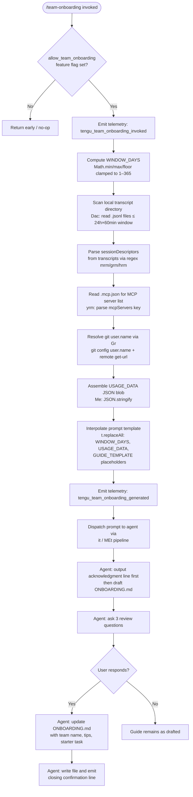

# `/team-onboarding`

> Analysis basis: CC v2.1.197 bundle.js (AST extraction + Claude interpretation)
> Minimum version: v2.1.197

---

## Overview

`/team-onboarding` is a `prompt`-type slash command that analyzes the invoking user's local Claude Code session transcripts (up to 365 days) and co-authors a personalized `ONBOARDING.md` guide with them. The guide is designed to be pasted directly into Claude Code by new teammates, giving them a guided, interactive onboarding tour grounded in the team's real usage patterns. The command is gated behind the `allow_team_onboarding` feature flag and follows a two-turn collaborative authoring loop: it emits a concrete draft first, then asks three targeted review questions before finalizing the file.

---

## Registration

| Field | Value |
|---|---|
| type | `prompt` |
| name | `team-onboarding` |
| description | `Help teammates ramp on Claude Code with a guide from your usage` |
| isHidden | `false` |
| loc_byte | `13413951` |
| loc_byte_end | `13415025` |
| loc_line | `9325` |
| handler_method | `getPromptForCommand` |
| handler_method_start | `13414314` |
| handler_method_end | `13415024` |
| prompt_body.length | `4539` |
| prompt_body.trace | `identifier→l (local→1 ext vars)` |
| arbor_handler.name | `getPromptForCommand` |
| arbor_handler.kind | `Method` |
| arbor_handler.resolution_path | `direct` |
| arbor_handler.fqn | `claude-2.1.197::getPromptForCommand` |
| arbor_handler.n_hits | `2` |

Analysis basis: CC v2.1.197 bundle.js:+13413951

---

## Input Branching

The handler has 3+ distinct paths: a feature-flag gate, a transcript-scan and data-assembly phase, a template interpolation step, and the final prompt dispatch. A Mermaid flowchart is used.



---

## Behavioral Spec

### 1. Feature-Flag Gate

Before any work begins, the handler checks whether `allow_team_onboarding` is enabled for the current session context.

```
function checkTeamOnboardingGate(sessionContext):
    flags = getFeatureFlags(sessionContext)   // Gs / MEt path
    if not flags.has("allow_team_onboarding"):
        return NO_OP
    emitTelemetry("tengu_team_onboarding_invoked")
    return PROCEED
```

Analysis basis: CC v2.1.197 bundle.js:+10516452

---

### 2. Window Days Computation

The look-back window is computed from the current timestamp using integer arithmetic, then clamped to the range [1, 365].

```
function computeWindowDays(nowMs):
    raw = Math.floor(nowMs / MS_PER_DAY)        // Date.now() / 86400000
    windowDays = Math.min(365, Math.max(1, raw mod 365 + 1))
    return windowDays
```

The literal value `365` (bundle.js:+13414563) and `1` (bundle.js:+13414560) bound the result. `Math.min`, `Math.max`, and `Math.floor` are all called inline in the handler.

Analysis basis: CC v2.1.197 bundle.js:+13414517–13414535

---

### 3. Transcript Scan (`transcriptScanner` / `Dac`)

The scanner reads the user's local Claude Code transcript directory, filtering for `.jsonl` files modified within the computed window, then extracts session metadata.

```
function transcriptScanner(transcriptDir, windowDays):
    cutoffMs = Date.now() - (windowDays * 24 * 60 * 60 * 1000)
    entries = fs.readdir(transcriptDir)
    jsonlFiles = entries.filter(e => extname(e) == ".jsonl")

    sessions = []
    for each file in jsonlFiles:
        stat = fs.stat(join(transcriptDir, file))
        if not stat.isFile():
            continue
        raw = fs.readFile(join(transcriptDir, file))
        lines = raw.split("\n").slice(0, 10)   // first 10 lines heuristic

        title = extractViaRegex(mrm, raw)       // session title pattern
        prNumbers = extractViaRegex(grm, raw)   // PR number pattern
        firstUserMsg = extractViaRegex(hrm, raw)
        mcpToolCount = countMatches('"name":"mcp__', raw)
        contentBlocks = countMatches('"content":[', raw)

        if firstUserMsg starts with known prefix and slice(0,3) chars match:
            sessions.push({title, prNumbers, firstUserMsg,
                           mcpToolCount, contentBlocks})
    return sessions
```

Key literals observed: `.jsonl` (bundle.js:+13402996), window arithmetic uses `24` and `60` (bundle.js:+13402881/13402884), MCP detection string `"name":"mcp__"` (bundle.js:+13403575), content-block marker `"content":["` (bundle.js:+13403925), first-line slice limit `10` (bundle.js:+13403392), and session prefix match threshold `3` (bundle.js:+13404028).

Analysis basis: CC v2.1.197 bundle.js:+13402868

---

### 4. MCP Server List Reader (`mcpConfigReader` / `yrm`)

```
function mcpConfigReader(workspaceRoot):
    configPath = join(workspaceRoot, ".mcp.json")   // literal ".mcp.json" +13405026
    raw = fs.readFile(configPath, "utf8")            // literal "utf8" +13405039
    parsed = jsonParse(raw)                          // Gt → JSON.parse
    servers = parsed["mcpServers"] ?? {}             // literal "mcpServers" +13405082
    return servers
```

If `.mcp.json` is absent or malformed, the function falls back gracefully (observed via `Sn` / error-suppression path at bundle.js:+13405178).

Analysis basis: CC v2.1.197 bundle.js:+13405002

---

### 5. Git Identity and Remote Resolution (`gitInfoResolver` / `Erm` + `Gr`)

```
function gitInfoResolver(workspaceRoot):
    userName = execGit(["config", "user.name"], cwd=workspaceRoot)
    remoteUrl = execGit(["remote", "get-url", "origin"], cwd=workspaceRoot)
    currentRepo = deriveRepoName(remoteUrl)   // sHe: trim, match, slice
    return { generatedBy: userName.trim(), currentRepo }
```

Literals: `"git"` (bundle.js:+13405649), `"config"` (bundle.js:+13405656), `"user.name"` (bundle.js:+13405665), `"remote"` (bundle.js:+13405721), `"get-url"` (bundle.js:+13405730). The `sHe` helper normalises git remote URLs (strips `git/` prefix, lowercases, handles `localhost` remotes).

Analysis basis: CC v2.1.197 bundle.js:+13405327

---

### 6. Prompt Template Interpolation

The handler assembles the final prompt string by replacing three mustache-style placeholders using `String.replaceAll`.

```
function interpolatePromptTemplate(promptBody, windowDays, usageData, guideTemplate):
    result = promptBody
        .replaceAll("{{WINDOW_DAYS}}", String(windowDays))
        .replaceAll("{{USAGE_DATA}}", JSON.stringify(usageData))
        .replaceAll("{{GUIDE_TEMPLATE}}", guideTemplate)
    return result
```

Placeholder literals: `"{{WINDOW_DAYS}}"` (bundle.js:+13414774), `"{{GUIDE_TEMPLATE}}"` (bundle.js:+13414814), `"{{USAGE_DATA}}"` (bundle.js:+13414849). The output type is `"text"` (bundle.js:+13415008).

Analysis basis: CC v2.1.197 bundle.js:+13414761

---

### 7. Agent Prompt Execution — Five-Step Authoring Protocol

The 4539-character prompt body instructs the agent to follow a strict five-step protocol:

**Step 1 — Immediate acknowledgment (before any reasoning).**
The agent must emit a fixed acknowledgment line referencing `WINDOW_DAYS` as its very first visible output. No chain-of-thought, no tool calls, no classification may precede this line. This is explicitly prioritized in the prompt to reduce perceived latency for the guide creator.

**Step 2 — Work-type classification.**
The agent reads the `sessionDescriptors` array (title, `prNumbers`, first user message) and classifies each session into one of seven canonical task categories: Build Feature, Debug Fix, Improve Quality, Analyze Data, Plan Design, Prototype, Write Docs. Review sessions are mapped to the type of artifact being reviewed (not a generic "review" category). The agent selects the top 3–5 categories with rough percentage estimates. If sessions are sparse (~0), the breakdown section is left as a TODO placeholder. Tool/MCP counts serve as weak signals only when first messages are uninformative.

**Step 3 — Supplemental data gathering.**
The agent uses `currentRepo` from the usage data as the primary repository reference, then inspects sibling workspace directories for additional repos. For each MCP server entry, it uses the `name` field (and `urlOrigin` if present) to describe the server's purpose and access method. The Team Tips and Get Started sections are intentionally left as TODO placeholders at this stage.

**Step 4 — Guide generation to `ONBOARDING.md`.**
The agent writes the guide following the embedded `{{GUIDE_TEMPLATE}}` structure. Real numeric values from the usage data replace all placeholders. ASCII bar charts use `█` (filled) and `░` (empty) characters at 20 characters wide. The `generatedBy` field provides the author name; if absent, the name is omitted. An HTML comment at the bottom of the template is preserved verbatim.

**Step 5 — Collaborative review loop.**
After rendering the guide in a fenced code block, the agent appends a horizontal rule and a `**Review**` heading, then poses exactly three numbered questions: (1) team name confirmation or request, (2) optional starter task link, (3) any team tips not already in `CLAUDE.md`. After the user responds, the agent updates `ONBOARDING.md` with the provided information and closes with a fixed confirmation sentence directing the guide creator to share the file. Subsequent edits from the user are applied directly to the file.

Analysis basis: CC v2.1.197 bundle.js:+13414314 (handler_method_start)

---

### 8. Session Dispatch Pipeline (`it` / `MEt`)

The assembled prompt is dispatched through the standard CC prompt pipeline, which resolves the active conversation context, checks deduplication state, allocates a conversation ID, and forwards the prompt to the agent runtime.

```
function dispatchPrompt(promptText, context):
    if conversationStateCache.has(context.id):
        existing = conversationStateCache.get(context.id)
        return routeToExisting(existing, promptText)
    newConvId = crypto.randomUUID()
    conversation = createConversation(newConvId, promptText, context)
    eventBus.emit("firstParty", conversation)
    emitTelemetry("tengu_flint_harbor_prompt")
    emitTelemetry("tengu_flint_harbor_share")
    activeConversations.add(newConvId)
    return conversation
```

Analysis basis: CC v2.1.197 bundle.js:+13414348 (call to `it`), +10516511 (call to `it` from `MEt`)

---

## State & Side Effects

| Item | Detail |
|---|---|
| Telemetry: `tengu_flint_harbor_prompt` | Fired on prompt dispatch into the agent pipeline (bundle.js:+13414351) |
| Telemetry: `tengu_team_onboarding_invoked` | Fired immediately after the feature-flag gate passes (bundle.js:+13414574) |
| Telemetry: `tengu_team_onboarding_generated` | Fired after the prompt template is fully assembled (bundle.js:+13414893) |
| Telemetry: `tengu_flint_harbor_share` | Fired in the dispatch pipeline alongside the harbor prompt event (bundle.js:+10516514) |
| Telemetry: `tengu_config_lock_contention` | Emitted if the config file lock is contested during any config save within the pipeline (bundle.js:+14161180) |
| Telemetry: `tengu_config_stale_write` | Emitted when a config write is detected as stale (bundle.js:+14161316) |
| Telemetry: `tengu_config_parse_error` | Emitted when config JSON cannot be parsed (bundle.js:+14164913) |
| Telemetry: `tengu_config_auto_repaired` | Emitted when the config is auto-repaired from cache under lock (bundle.js:+14161693) |
| Telemetry: `tengu_config_auth_loss_prevented` | Emitted when a write is refused to prevent wiping auth credentials (bundle.js:+14162023) |
| Telemetry: `tengu_config_fallback_write` | Emitted when the global config save falls back (bundle.js:+14160796) |
| Telemetry: `tengu_daemon_control` | Emitted by the daemon-control path reachable from the pipeline (bundle.js:+18076516) |
| File write | Agent writes `ONBOARDING.md` in the current working directory after guide is finalized |
| Feature flag read | `allow_team_onboarding` must be set; command silently no-ops if absent (bundle.js:+10516452) |
| Transcript read | Local `.jsonl` transcript files are read (not modified) from the CC data directory |
| Git subprocess | `git config user.name` and `git remote get-url origin` are executed as child processes (bundle.js:+13405649) |
| MCP config read | `.mcp.json` is read from the workspace root; absence is non-fatal (bundle.js:+13405026) |
| Config lock | The `saveConfigWithLock` path acquires an exclusive file lock; contention warning: "Lock acquisition took longer than expected - another Claude instance may be running" (bundle.js:+14161091) |
| Conversation state | New conversation UUID allocated via `crypto.randomUUID`; registered in the active-conversation set (bundle.js:+3376169) |
| Hook registration | None observed in depth-2 traversal |
| Sound | None observed in depth-2 traversal |

---

## Version History

| Version | Change |
|---|---|
| v2.1.197 | Initial analysis |

---

## Common Mistakes

1. **Invoking without `allow_team_onboarding` enabled.** The command silently exits if the feature flag is absent. There is no user-visible error message. Verify the flag is set in your team or organization's Claude Code configuration before invoking.

2. **No local transcripts present.** If the transcript directory is empty or contains no `.jsonl` files within the window, the `sessionDescriptors` array will be empty. The agent will leave the work-type breakdown as a TODO rather than hallucinating categories. This is expected behavior, not a bug.

3. **Missing `.mcp.json`.** The MCP server section of the guide will be omitted if `.mcp.json` is absent from the workspace root. Add the file before invoking if MCP server documentation is needed in the guide.

4. **Editing `ONBOARDING.md` before the review loop completes.** The agent overwrites `ONBOARDING.md` when it processes the review answers. Any manual edits made between the draft and the review response will be lost.

5. **Expecting the agent to wait before drafting.** The prompt explicitly instructs the agent to generate a draft *immediately* and ask questions afterward. Providing pre-answers in the invocation message or expecting an upfront Q&A is contrary to the designed flow and may produce unexpected behavior.

6. **Interpreting the window-days value incorrectly.** The window is computed from the current timestamp via `Math.min(365, Math.max(1, …))` — it is not a user-supplied parameter and cannot be overridden from the command line.

---

## Appendix — Identifier Mapping

> For bundle debugging only. Identifiers change across versions.

| Identifier | Role |
|---|---|
| `__handler_team-onboarding` | Synthetic BFS entry point for the command handler; wraps `getPromptForCommand` |
| `it` | Prompt dispatch / conversation routing function |
| `C$t` | Conversation state initializer (called from dispatch) |
| `v$t` | Conversation state validator (called from dispatch) |
| `P6` | Prompt pipeline stage — pre-dispatch preparation |
| `D6` | Prompt pipeline stage — downstream processor |
| `K3` | Feature-flag / experiment resolver |
| `akn` | Deduplication gate: checks if a prompt has already been enqueued |
| `Y7r` | New-conversation factory: allocates UUID, builds conversation object |
| `u5e` | Lexical/token utility used in conversation construction |
| `w6` | Random-bytes hex generator (32-byte, "hex" encoding) |
| `Me` | JSON serializer wrapper (`JSON.stringify`) |
| `w2d` | Conversation registration helper |
| `nYr` | Prompt normalization / sanitization function |
| `qLi` | Prompt content extractor |
| `Rr` | Text encoding utility |
| `_Fi` | Filter or redaction helper |
| `DP` | Permission / policy set membership checker |
| `Mg` | Telemetry event dispatcher |
| `Dt` | Config read/write controller (acquires file lock) |
| `V` | Logger / verbose output utility |
| `Hn` | Global config save orchestrator |
| `rtn` | `saveConfigWithLock` — atomic config file writer with lock and backup |
| `t` | Generic temp/utility variable (context-dependent) |
| `qt` | Path existence / access checker |
| `s` | File-system operation wrapper (context-dependent) |
| `r` | File-system operation wrapper (context-dependent) |
| `i` | Stream or iterator (context-dependent) |
| `nci` | Config object builder (`Object.assign` based) |
| `b4r` | Config schema parser |
| `T` | File path/content utility (context-dependent) |
| `deu` | CLAUDE.md / config file reader |
| `e` | String or event (context-dependent) |
| `Pc` | Path component extractor (last segment, `lastIndexOf`/`slice`) |
| `KQe` | Path normalizer (`zls`) |
| `geu` | CLAUDE.md aggregator: reads, measures byte length, merges |
| `rn` | Error logger / warning emitter |
| `lIt` | Per-project config reader with backup rotation |
| `Gt` | JSON.parse wrapper |
| `q5` | Prefix-stripper (`startsWith` / `slice`) |
| `mqo` | Backup directory enumerator for config rotation |
| `hqo` | Path joiner with `Zn` canonicalization |
| `m` | Array filter/map utility |
| `cIt` | Config integrity validator (auth-loss prevention) |
| `n` | String lowercase utility / generic iterator |
| `v` | File entry filter (startsWith check) |
| `y` | Transcript line / session record type |
| `lqe` | Session record parser (maps transcript lines to structured objects) |
| `I` | Pagination / slice utility |
| `M` | HTTP gateway route handler (OAuth, inference, device auth) |
| `A` | User-info fetcher (OIDC `userinfo` endpoint) |
| `mRt` | Atomic file writer (`writeFileSyncAndFlush` with temp-file + rename) |
| `Gd` | Real-path resolver (`realpathSync`) |
| `u` | Daemon control record |
| `Sn` | Silent error suppressor / log-and-continue |
| `rtt` | File-system error code normalizer (EINVAL, ENOTSUP, etc.) |
| `oRr` | Output record assembler |
| `nIs` | Property definer (`Object.defineProperty`) |
| `zUe` | Config directory resolver |
| `pqo` | Transcript directory enumerator (`Object.entries`) |
| `ttn` | Timestamp formatter (`Date.now`) |
| `etn` | Project config loader entry point |
| `vdr` | Global config save with fallback |
| `Oe` | App state emitter |
| `$Xe` | App state root |
| `Erm` | Usage-data assembler: orchestrates transcript scan, MCP read, git resolve |
| `dr` | Home-directory resolver (`H0`) |
| `H0` | OS home directory constant |
| `b3` | Project directory path builder |
| `oN` | Projects sub-path joiner |
| `OS` | Path relative-offset calculator |
| `EUu` | Absolute-value path distance helper |
| `Dac` | Transcript scanner: reads `.jsonl`, extracts session descriptors |
| `zo` | Warning logger for scan errors |
| `o` | Pad/map utility for display formatting |
| `c` | `isFile()` stat wrapper |
| `yn` | File type checker |
| `l` | Line splitter for transcript content |
| `doc` | Session document parser |
| `p` | Process-exit / abort signal handler |
| `rI` | Process reset utility |
| `yrm` | `.mcp.json` config reader |
| `_rm` | Unused / placeholder in Erm scope |
| `Gr` | Git command executor (`execFileNoThrow`) |
| `LBe` | Child-process spawn wrapper with timeout and kill support |
| `dvs` | Win32 command-line adapter (`.exe`, `cmd /q`) |
| `jRr` | stdin pipe helper |
| `VRr` | stdout pipe helper (`sFu`) |
| `KRr` | stderr accumulator (`lFu`) |
| `yCs` | Numeric argument validator (`Number.isFinite`) |
| `hRt` | Process-output buffer assembler |
| `WRr` | `Reflect.apply` / `Reflect.defineProperty` helper |
| `YCs` | Process `exit` event listener |
| `_Cs` | Timeout + `Promise.race` wrapper for process execution |
| `ECs` | Process kill helper (`e.kill`, `r.finally`) |
| `hCs` | stdout data handler |
| `HCs` | Force-kill handler (`e.kill`) |
| `KCs` | Parallel process drain (`Promise.all`) |
| `ERt` | Process error handler |
| `VCs` | stdout pipe connector |
| `qCs` | stderr line reader |
| `TCs` | `MRr.bind` — stream mode binder |
| `mFu` | Argument coercer (`String(...)`) |
| `Ed` | Error type discriminator |
| `fFu` | Exit-code formatter |
| `ke` | Command execution with queue management |
| `er` | Error constructor wrapper |
| `ct` | String coercer (`String(...)`) |
| `zi` | Essential-traffic queue checker |
| `LNu` | Command queue FIFO manager (`shift`/`push`) |
| `Uo` | Result object merger (`Object.assign`) |
| `sHe` | Git remote URL normalizer (trim, match, `git/` strip, lowercase) |
| `qmn` | URL fragment extractor (`indexOf`/`slice`) |
| `MEt` | Feature-flag + dispatch coordinator; calls `allow_team_onboarding` check then `it` |
| `Gs` | Feature-flag evaluator (checks `J2d`, `X2d` sets, routes to `GF`/`N6`) |
| `jFi` | Flag resolution entry point |
| `N6` | Flag result builder (`GF`, `O$t`, `uye`) |
| `GF` | Flag state constructor (`P$t`) |
| `P$t` | Auth-context classifier: `third_party_provider`, `custom_base_url`, `no_auth`, `oauth_no_inference_scope`, `enterprise`, `team`, `prosumer_oauth` |
| `Q_e` | Flag-override applier (`ct`) |
| `zS` | Feature-flag result serializer (`Vs`) |

---

Note: index built via Arbor fallback; some signals (telemetry, literals) may be missing — see arbor-fallback.js.