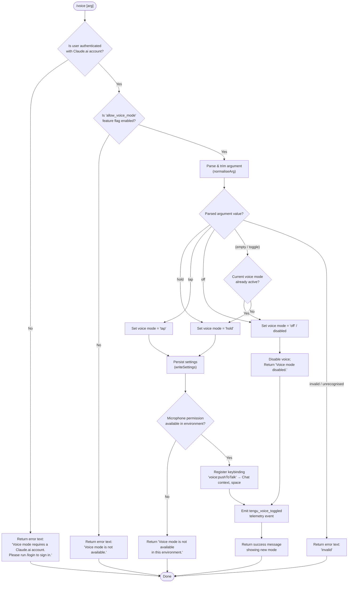

# `/voice`

> Analysis basis: CC v2.1.197 bundle.js (AST extraction + Claude interpretation)
> Minimum version: v2.1.197

---

## Overview

The `/voice` command toggles voice input mode in Claude Code, allowing users to switch between three interaction styles: hold-to-talk (`hold`), tap-to-talk (`tap`), and disabled (`off`). The handler validates authentication, checks platform availability of the `allow_voice_mode` feature flag, updates persistent settings, optionally configures a push-to-talk keybinding, and reports the outcome to the terminal.

---

## Registration

| Field | Value |
|---|---|
| type | `local` |
| name | `voice` |
| description | `Toggle voice mode` |
| argumentHint | `[hold\|tap\|off]` |
| supportsNonInteractive | `false` |
| isHidden | `null` |
| module_id | `tac` |
| load_inline | `true` |
| loc_byte | `13380309` |
| loc_byte_end | `13380551` |
| loc_line | `9183` |
| arbor_handler.name | `Cnm` |
| arbor_handler.fqn | `claude-2.1.197::Cnm` |
| arbor_handler.kind | `AsyncFunction` |
| arbor_handler.resolution_path | `module_id` |
| arbor_handler.n_hits | `1` |

Analysis basis: CC v2.1.197 bundle.js:+13380309

---

## Input Branching

The command has 6+ distinct branches across authentication checks, feature-availability checks, argument parsing, and final state transitions, so a Mermaid flowchart is used.



Analysis basis: CC v2.1.197 bundle.js:+13377626 (hold/tap/off literals), +13377670 (invalid literal), +13377750 (auth error string), +13377929 (availability error), +13378355 (disabled message), +13378599 (environment unavailable message)

---

## Behavioral Spec

### 1. Entry Point — `voiceCommandHandler` (`Cnm`)

The async handler function `Cnm` is the top-level entry point resolved by Arbor via the `module_id` path (`tac`).

```
async function voiceCommandHandler(args, context):
    authCheck     = checkAuthStatus(context)          // calls aE
    featureFlags  = loadSettings(context)             // calls O8 → xDr chain

    if authCheck.isNotLoggedIn:
        return textResult("Voice mode requires a Claude.ai account. …")

    featureEnabled = evaluateFeatureFlag("allow_voice_mode", featureFlags)
    if not featureEnabled:
        return textResult("Voice mode is not available.")

    parsedMode = normaliseArg(args)                   // calls Inm, e.trim
    if parsedMode == "invalid":
        return textResult("invalid")

    if parsedMode == "off" or (parsedMode is empty and currentModeIsActive(context)):
        writeVoiceSetting("off", context)             // calls no → writeSettings chain
        emitTelemetry("tengu_voice_toggled", {mode: "off"})
        return textResult("Voice mode disabled.")

    targetMode = parsedMode or "hold"                 // default when toggling on

    micPermission = checkMicrophonePermission(context) // calls uWo
    if not micPermission:
        return textResult("Voice mode is not available in this environment.")

    writeVoiceSetting(targetMode, context)

    registerKeybinding({                              // calls ov → keybinding subsystem
        action:  "voice:pushToTalk",
        context: "Chat",
        key:     "space"
    })

    emitTelemetry("tengu_voice_toggled", {mode: targetMode})
    return textResult("Voice mode enabled: " + targetMode)
```

Analysis basis: CC v2.1.197 bundle.js:+13377709 (Cnm→vTt call), +13377720 (Cnm→aE call), +13377830 (Cnm→O6 call), +13377967 (Cnm→Rr call), +13377983 (Cnm→Inm call), +13378050 (e.trim), +13378119 (Cnm→no call), +13378298 (V call / telemetry emit), +13378445 (Cnm→uWo call), +13378524 (Cnm→jZt call), +13379565 (Cnm→ov call), +13379699 (Cnm→aQe call), +13379717 (Cnm→Dt call), +13380026 (Cnm→Hn call)

---

### 2. Argument Normalisation — `normaliseArg` (`Inm`)

```
function normaliseArg(rawArg):
    trimmed = rawArg.trim()                // e.trim at +13378050
    lower   = trimmed.toLowerCase()        // via aQe at +13379699

    if lower == "hold":  return "hold"    // literal at +13377626
    if lower == "tap":   return "tap"     // literal at +13377638
    if lower == "off":   return "off"     // literal at +13377649
    if lower == "":      return ""        // empty → toggle logic
    return "invalid"                       // literal at +13377670
```

Analysis basis: CC v2.1.197 bundle.js:+13377579 (Inm → e.trim), +13377626–13377670 (mode literals)

---

### 3. Authentication Check — `checkAuthAndFeatureState` (`vTt` + `ccr` + `aE`)

The call chain `vTt → ccr → aE` resolves auth state and feature-flag availability.

```
function checkAuthAndFeatureState(context):
    settings = loadSettingsFromDisk()     // aE → ub (settings loader)
    authType = settings.authType          // "firstParty" literal at +2154351

    if authType not in {firstParty OAuth types}:
        return {authed: false}

    featureFlags = settings.featureFlags
    voiceAllowed = featureFlags["allow_voice_mode"]  // literal at +13366576
    return {authed: true, voiceAllowed: voiceAllowed}
```

The inner `aE` function is the general-purpose settings resolver; it reads `ANTHROPIC_API_KEY` (literal at +3096209) and related environment variables to determine the authentication path. When no auth credential is present it throws the error string `"ANTHROPIC_API_KEY, ANTHROPIC_AUTH_TOKEN, CLAUDE_CODE_OAUTH_TOKEN, or WIF env vars … required"` (literal at +3096678).

Analysis basis: CC v2.1.197 bundle.js:+13366618 (ccr→aE), +13366530 (ccr→zS), +13366576 (allow_voice_mode), +13377709 (vTt entry)

---

### 4. Feature-Flag Gate — `evaluateFeatureFlag` (`Gs` + `N6`)

```
function evaluateFeatureFlag(flagName, settings):
    // Gs checks a membership set J2d and X2d for known flags
    if flagName in policyDenySet:
        return false
    if flagName in policyAllowSet:
        return true
    // N6 evaluates the flag against allow_product_feedback and
    // product-specific allow lists
    return defaultValueForFlag(flagName)
```

Analysis basis: CC v2.1.197 bundle.js:+3396121 (Gs→jFi), +3396137 (J2d.has), +3396169 (X2d.has), +3396193 (allow_product_feedback literal), +3396219 (Q_e), +3396283 (Gs→N6), +13366573 (ucr→Gs)

---

### 5. Settings Persistence — `writeSettings` (`no` chain)

The `no` function is responsible for reading the on-disk settings file, merging the updated voice mode field, and writing back atomically using a lock.

```
async function writeSettings(key, value, context):
    acquire configLock()                  // rtn → lock acquisition, +14161085 ms threshold

    current = readSettingsFile()          // lIt → r.readFileSync at +14163555
    if readFailed:
        autoRepairFromCache()             // tengu_config_auto_repaired at +14161693

    current[key] = value
    writeAtomically(current)             // mRt → temp-file + rename strategy
    release configLock()

    emitIfStale()                        // tengu_config_stale_write at +14161316
```

If the settings file cannot be parsed or written, the command returns the string `"Failed to update settings. Check your settings file for syntax errors."` (literal at +13378217).

Analysis basis: CC v2.1.197 bundle.js:+13378119 (Cnm→no), +1350414 (no→OMr), +1350467 (no→mRt), +1350609 (no→n_), +14161469 (rtn→lIt), +14162724 (rtn→mRt)

---

### 6. Keybinding Registration — `registerKeybinding` (`ov` chain)

When voice mode is switched to `hold` or `tap`, the handler registers a push-to-talk keybinding:

```
function registerKeybinding(spec):
    existing = loadKeybindingsConfig()    // v2t → JVi.readFileSync at +4025651
    // Keybinding file: keybindings.json, key "bindings" at +4025723
    if spec.action not already in existing:
        insertBinding({
            action:  "voice:pushToTalk",  // literal at +13379568
            context: "Chat",              // literal at +13379587
            key:     "space"              // literal at +13379594
        })
        saveKeybindingsConfig(existing)
        emitTelemetry("tengu_custom_keybindings_loaded")
    else:
        emitTelemetry("tengu_keybinding_fallback_used")
```

On macOS, microphone permission guidance references `"System Settings → Privacy & Security → Microphone"` (literal at +13379106).

Analysis basis: CC v2.1.197 bundle.js:+13379565 (Cnm→ov), +4032576 (ov→BDn), +4032634 (iqi.has), +4032656 (V / telemetry), +4025538 (keybindings literal), +13379568 (voice:pushToTalk literal)

---

### 7. Settings Load — `loadSettingsFromDisk` (`O8` + `xDr`)

```
function loadSettingsFromDisk():
    mark("loadSettingsFromDisk_start")    // literal at +1347375
    settings = mergeSettingsSources({
        flagSettings:    loadFlagSettings(),     // gMt at +1335149
        policySettings:  loadPolicySettings(),
        userSettings:    readFile(".claude/settings.json"),    // literal at +1330175
        projectSettings: readFile(".claude/settings.local.json"), // literal at +1330237
        sdkInline:       "SDK inline settings"  // literal at +1328556
    })
    mark("loadSettingsFromDisk_end")     // literal at +1347431
    log("info", "settings_load_completed") // literal at +1335929
    return settings
```

Analysis basis: CC v2.1.197 bundle.js:+1347346 (O8→h0), +1347411 (O8→I3), +1347459 (O8→yin), +1335008 (xDr→Date.now), +1335149 (xDr→gMt)

---

## State & Side Effects

| Item | Detail |
|---|---|
| Telemetry: `tengu_voice_toggled` | Fired on every successful mode change (on or off). Analysis basis: +13378300 |
| Telemetry: `tengu_feature_ok` | Fired when a feature-flag check passes. Analysis basis: +1028779 |
| Telemetry: `tengu_feature_bad` | Fired when a feature-flag check fails hard. Analysis basis: +1028846 |
| Telemetry: `tengu_feature_sad` | Fired on soft/unavailable feature state. Analysis basis: +1028927 |
| Telemetry: `tengu_daemon_control` | Fired during daemon stop operations reached in the call graph. Analysis basis: +18076516 |
| Telemetry: `tengu_keybinding_customization_release` | Fired during keybinding subsystem init. Analysis basis: +4023139 |
| Telemetry: `tengu_custom_keybindings_loaded` | Fired after keybindings are successfully loaded/registered. Analysis basis: +4023559 |
| Telemetry: `tengu_keybinding_fallback_used` | Fired when push-to-talk action is not found and fallback is used. Analysis basis: +4032658 |
| Telemetry: `tengu_config_parse_error` | Fired when settings file cannot be parsed. Analysis basis: +14164913 |
| Telemetry: `tengu_config_lock_contention` | Fired when config lock takes longer than 100 ms. Analysis basis: +14161180 |
| Telemetry: `tengu_config_stale_write` | Fired when write would clobber a newer on-disk value. Analysis basis: +14161316 |
| Telemetry: `tengu_config_auto_repaired` | Fired when the config is auto-repaired from cache. Analysis basis: +14161693 |
| Telemetry: `tengu_config_auth_loss_prevented` | Fired when a write that would wipe auth fields is blocked. Analysis basis: +14162023 |
| Telemetry: `tengu_config_fallback_write` | Fired when the primary write path fails and a fallback write is used. Analysis basis: +14160796 |
| Settings file written | `~/.claude/settings.json` updated with the new voice mode value via atomic temp-file + rename. |
| Keybindings file written | `keybindings.json` updated to add `voice:pushToTalk` → `space` in the `Chat` context when enabling voice. |
| Microphone permission check | On macOS, the environment is queried for microphone access before enabling voice. |
| Lock file | A file-system lock (with a 100 ms contention threshold; literal at +14161085) guards concurrent config writes. |
| `allow_voice_mode` gate | Voice requires the `allow_voice_mode` feature flag to be active in the user's account policy. |
| Authentication requirement | The command requires a Claude.ai account (OAuth / `firstParty` auth); API-key-only sessions are rejected. |

---

## Version History

| Version | Change |
|---|---|
| v2.1.197 | Initial analysis |

---

## Common Mistakes

1. **Running `/voice` without a Claude.ai account** — Users authenticated only with `ANTHROPIC_API_KEY` will receive the error `"Voice mode requires a Claude.ai account. Please run /login to sign in."` The command strictly requires OAuth/Claude.ai authentication.
2. **Passing an unrecognised argument** — Any argument other than `hold`, `tap`, or `off` (case-insensitive after trimming) returns `"invalid"`. There is no fuzzy matching.
3. **Expecting voice to work in all environments** — The `allow_voice_mode` feature flag must be enabled server-side. Enterprise or managed accounts may have this flag disabled at the policy level, returning `"Voice mode is not available."` even for authenticated users.
4. **Ignoring the environment unavailability message** — On systems without microphone permission granted, the command returns `"Voice mode is not available in this environment."` The on-screen prompt on macOS references `System Settings → Privacy & Security → Microphone`.
5. **Running `/voice` in non-interactive mode** — `supportsNonInteractive` is `false`; the command will not execute in scripted / piped sessions.
6. **Corrupted settings file** — If `settings.json` has syntax errors, the write fails and the command returns `"Failed to update settings. Check your settings file for syntax errors."` The config subsystem will attempt auto-repair from cache and emit `tengu_config_auto_repaired`.

---

## Appendix — Identifier Mapping

> For bundle debugging only. Identifiers change across versions.

| Identifier | Role |
|---|---|
| `Cnm` | Top-level voice command handler (AsyncFunction; Arbor-resolved entry point) |
| `vTt` | Auth + feature state dispatcher called first by handler |
| `ccr` | Inner auth/feature resolution coordinator |
| `aE` | General settings + auth resolver (reads env vars, returns auth state) |
| `yd` | Low-level config helper (called from aE, TH) |
| `ub` | Settings source merger / loader |
| `Lc` | First-party auth type checker (`"firstParty"` literal) |
| `lI` | Auth token helper |
| `TH` | Auth validation and error-throwing function (checks ANTHROPIC_API_KEY) |
| `AUt` | Auth utility helper |
| `Jst` | Config/settings accessor utility |
| `zS` | Feature-flag set resolver |
| `$Zt` | Async step in auth dispatch |
| `ucr` | Feature-flag gate for voice; calls `Gs` |
| `Gs` | Feature-flag evaluator (checks policy allow/deny sets) |
| `jFi` | Flag membership check helper |
| `GF` | Policy allow-set checker |
| `zi` | Essential-traffic filter |
| `Q_e` | Flag evaluation fallback |
| `N6` | Secondary flag evaluator (allow_product_feedback path) |
| `O6` | Argument character-level parser (charAt / slice) |
| `Rr` | Settings-load orchestrator |
| `O8` | Settings load with performance marks |
| `h0` | Performance mark helper |
| `ga` | Memory / performance sampling helper |
| `C5` | perf_hooks require wrapper |
| `xDr` | Core settings-from-disk reader; merges flagSettings/policySettings/userSettings |
| `Ln` | File-append logger |
| `gMt` | Flag-settings set manager |
| `KLs` | WSL / platform detection helper used in settings load |
| `Hwe` | User settings file path resolver (.claude/settings.json) |
| `P8` | Project settings file path resolver |
| `VLs` | SDK-inline settings resolver |
| `I3` | Settings object builder |
| `dr` | Config directory resolver |
| `NFe` | Named settings field extractor |
| `vSr` | Settings validator |
| `kwt` | Key-whitelist transformer |
| `RFe` | Required field checker |
| `MFe` | Merge field helper |
| `Pwt` | Policy writer helper |
| `Ale` | Auth-loss guard |
| `Ewe` | Settings equality checker |
| `Ygn` | Settings serializer |
| `cxs` | Settings cache |
| `wte` | Write-throttle helper |
| `hMt` | Settings save coordinator |
| `yin` | Settings post-load hook |
| `FZt` | Feature flag toggle state |
| `Inm` | Argument normaliser (trims raw arg) |
| `no` | Settings write orchestrator |
| `Lg` | Logger factory |
| `qt` | Config path resolver |
| `LDr` | Settings multi-source loader |
| `nw` | File-system utility loader |
| `Ste` | Source-file reader with encoding detection |
| `Gd` | Real-path resolver |
| `T` | String/path utility (toUpperCase, trim, includes) |
| `TTs` | Stat-based file type checker |
| `rmn` | Config root resolver |
| `omn` | Config options normaliser |
| `Sn` | ENOENT error handler |
| `rn` | Error-code wrapper |
| `OMr` | Cache timestamp updater |
| `VBe` | Settings backup helper |
| `Fgn` | Settings file path builder |
| `mRt` | Atomic file writer (temp + rename + fsync) |
| `xe` | Daemon-stop helper |
| `Re` | Daemon-stop-failed helper |
| `$F` | Daemon control event emitter |
| `Wj` | Process-exit coordinator |
| `rtt` | Rename-error mapper |
| `oRr` | Atomics.wait wrapper |
| `ATs` | Atomic operation helper |
| `oUu` | Atomics wait call |
| `nIs` | Property descriptor setter |
| `he` | String coercion / defineProperty helper |
| `Me` | JSON.stringify wrapper |
| `n_` | Cache-clear helper |
| `zvs` | Git-ignore / gitconfig file checker |
| `Ot` | Async-local-storage store reader |
| `nmn` | Store getter |
| `_Mr` | Wu-based path helper |
| `zmn` | Git ignore rule executor |
| `Gr` | execFileNoThrow wrapper for git |
| `qFu` | Git global excludes-file resolver |
| `qvs` | Git ls-files tracker |
| `Kvs` | Gitignore-write helper |
| `Q5` | .claude directory path builder |
| `wt` | Feature-sad event emitter |
| `V` | tengu_feature_ok emitter |
| `Oe` | tengu_feature_bad emitter |
| `$Xe` | Base telemetry emit function |
| `ke` | Error logging utility |
| `er` | Error constructor helper |
| `ct` | String utility |
| `LNu` | Recent-error queue manager |
| `a` | HTTP spend-limit / billing response handler |
| `Pge` | JSON.stringify-based request builder |
| `l` | Daemon status file reader |
| `doc` | Daemon status JSON loader |
| `ene` | Status file entry normaliser |
| `ZHe` | Status line trimmer |
| `Ks` | AsyncLocalStorage store accessor |
| `_Zt` | daemon.status.json path builder |
| `ov` | Keybinding registration orchestrator |
| `BDn` | Keybinding config loader and merger |
| `v2t` | Keybindings.json file reader and parser |
| `Seo` | Keybinding schema validator (PDn path) |
| `zV` | Keybinding release-flag gate |
| `fc` | Keybinding platform resolver |
| `Wye` | Keybindings.json path builder |
| `Gt` | JSON.parse wrapper |
| `UDn` | Array shape validator |
| `PDn` | Keybinding block entry builder |
| `XVi` | Keybinding telemetry emitter |
| `yeo` | Keybinding key-sequence parser |
| `Eeo` | Keybinding action deduplicator |
| `GDn` | Default keybinding set builder |
| `Ceo` | Default binding context resolver |
| `Ieo` | xlt-based binding lookup |
| `WVi` | Platform-specific binding mapper |
| `geo` | Binding entry formatter |
| `qe` | action_not_found telemetry emitter |
| `aQe` | Locale/language normaliser (toLowerCase, Zss.has) |
| `Dt` | Global config file manager (reads ~/.claude.json) |
| `dqo` | Config path helper |
| `lIt` | Global config reader with backup/migration |
| `q5` | String prefix stripper |
| `mqo` | Backup directory scanner |
| `hqo` | Backup path builder |
| `e_r` | Path prefix replacer |
| `R` | File-watcher manager (chokidar / O.watch) |
| `Fdm` | Config file-watcher setup |
| `bRt` | watchFile registration helper |
| `rge` | Config-reload debounce |
| `vi` | Signal/process handler registrar |
| `Hn` | Global config save orchestrator |
| `rtn` | saveConfigWithLock implementation |
| `nci` | Config object assignment helper |
| `b4r` | tci-based config builder |
| `cIt` | Config integrity checker |
| `lqe` | TeammateMailbox markMessagesAsRead |
| `vdr` | saveGlobalConfig fallback writer |
| `zUe` | Config pre-write validator |
| `pqo` | Object.entries config iterator |
| `ttn` | Timestamp helper for config saves |
| `etn` | Config pre-read helper |