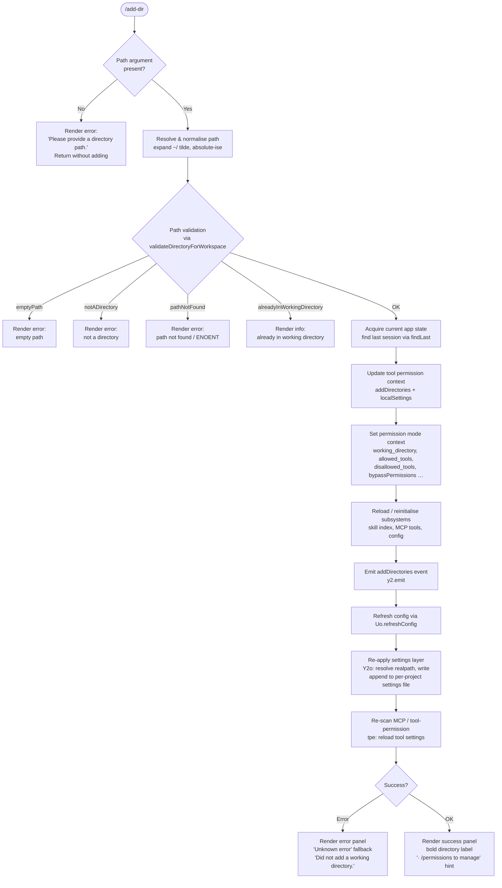

# `/add-dir`

> Analysis basis: CC v2.1.198 bundle.js (AST extraction + Claude interpretation)
> Minimum version: v2.1.198

---

## Overview

`/add-dir` registers an additional filesystem directory as a working directory for the current Claude Code session. It validates the supplied path, resolves it to a canonical real path, updates session and on-disk settings, refreshes the tool permission context, and re-initialises the skill-index and MCP tool sets so that the new directory is immediately visible to the agent.

---

## Registration

| Field | Value |
|---|---|
| type | `local-jsx` |
| name | `add-dir` |
| description | Add a new working directory |
| argumentHint | `<path>` |
| module_id | `c2l` |
| load_inline | `true` |
| loc_byte | 11638828 |
| loc_byte_end | 11638976 |
| loc_line | 7603 |
| arbor_handler.name | `N$f` |
| arbor_handler.fqn | `claude-2.1.198::N$f` |
| arbor_handler.kind | `AsyncFunction` |
| arbor_handler.resolution_path | `module_id` |
| arbor_handler.n_hits | 0 |

Analysis basis: CC v2.1.198 bundle.js:+11638828

---

## Input Branching

The handler has five distinct outcome branches based on path validation and directory state, so a flowchart is used.



Analysis basis: CC v2.1.198 bundle.js:+11637617 – +11638976

---

## Behavioral Spec

### 1 — Handler entry (`N$f`)

```
async function addDirHandler(context, args):
    rawPath = args[0]                        // argument after "/add-dir"

    if rawPath is absent or blank:
        render <ErrorPanel> "Please provide a directory path."
        return

    resolvedPath = resolveAndValidatePath(rawPath)   // vct / us
    validationResult = validateDirectoryForWorkspace(resolvedPath)

    match validationResult.code:
        "emptyPath"              -> render error, return
        "notADirectory"          -> render error, return
        "pathNotFound"           -> render error, return
        "alreadyInWorkingDirectory" -> render info, return
        OK                       -> continue

    appState   = getAppState()                       // Ur -> e.getAppState
    lastSession = appState.sessions.findLast(...)    // Ur -> n.findLast

    // Update permission context with the new directory
    context.setToolPermissionContext({
        addDirectories: [resolvedPath],
        localSettings:  ...,
        working_directory, allowed_tools, disallowed_tools,
        avoid_prompts, permission_mode, bypassPermissions,
        session, effort, model, max_thinking_tokens, flag_settings
    })

    // Guard: bypass-permissions mode checks
    checkBypassPermissionsPolicy()    // dR -> kQr
    // emits tengu_disable_bypass_permissions_mode if rejected

    // Reinitialise subsystems
    updatePermissionRules($H)         // add/replace/remove rules
    clearToolCache(c0)
    refreshSkillIndex(V0)             // LW -> C4o, clearSkillIndexCache
    reloadLocalSettings(Hj -> Cor)
    clearVJtCache($G -> vJt.clear)
    y2.emit("addDirectories", resolvedPath)
    Uo.refreshConfig()

    // Persist to settings files
    persistDirectoryToSettings(Y2o)  // realpath, mkdir, appendFile
    // file mode bits: 448 (0o700), 384 (0o600)

    // Reload MCP / tool permission layer
    reloadToolPermissions($ea)       // mE, Zi, ip, lm
    reloadMcpAndToolsets(tpe)        // Jgo, uMa, eo

    render <SuccessPanel>
        bold(resolvedPath)
        dim("· /permissions to manage")
```

Analysis basis: CC v2.1.198 bundle.js:+11637617

---

### 2 — Path resolution (`vct` / `us`)

```
function resolveAndValidatePath(rawInput):
    if rawInput is empty:
        return { code: "emptyPath" }

    trimmed = rawInput.trim()

    if trimmed contains null bytes:
        throw TypeError("Path contains null bytes")

    // Tilde expansion
    if trimmed.startsWith("~/"):
        home = os.homedir()
        trimmed = path.join(home, trimmed.slice(2))

    // Windows drive-letter normalisation (if platform == "windows")
    trimmed = path.normalize(trimmed)

    if not path.isAbsolute(trimmed):
        trimmed = path.resolve(trimmed)

    // Filesystem stat check
    try:
        stat = fs.stat(trimmed)
    catch ENOENT:
        return { code: "pathNotFound" }
    catch other:
        log "validateDirectoryForWorkspace: unexpected stat errno"
        return { code: "unexpectedError" }

    if stat is a file (not a directory):
        return { code: "notADirectory" }

    // Check against already-registered working directories
    currentDirs = getRegisteredWorkingDirs()
    if trimmed in currentDirs:
        return { code: "alreadyInWorkingDirectory" }

    return { code: "ok", resolvedPath: trimmed }
```

Analysis basis: CC v2.1.198 bundle.js:+11637774 (c0/d.includes), +4022718 (vct), +1104634 (us)

---

### 3 — Permission context update (`Ur` / `$H`)

```
function updateToolPermissionContext(session, resolvedPath, appState):
    // Extract last session that matches working_directory
    lastSession = appState.sessions.findLast(
        s => s.type.toLowerCase() == "working_directory"
    )

    // Build permission context delta
    delta = {
        working_directory:    resolvedPath,
        allowed_tools:        lastSession?.allowed_tools,
        disallowed_tools:     lastSession?.disallowed_tools,
        avoid_prompts:        lastSession?.avoid_prompts,
        permission_mode:      lastSession?.permission_mode,
        bypassPermissions:    lastSession?.bypassPermissions,
        session:              ...,
        effort:               ...,
        model:                ...,
        max_thinking_tokens:  ...,
        flag_settings:        ...
    }

    // Bypass-permissions guard
    if delta.permission_mode == "bypassPermissions":
        if organisationPolicyDisablesIt():
            log "Bypass permissions mode was disabled by your organization policy"
            emit tengu_disable_bypass_permissions_mode
            delta.permission_mode = "disable"
        else if settingsDisableIt():
            log "Bypass permissions mode was disabled by settings"
            emit tengu_disable_bypass_permissions_mode

    // Merge permission rules: allow / deny / alwaysAsk
    applyPermissionRules(delta, {
        addRules, replaceRules, removeRules,
        alwaysAllowRules, alwaysDenyRules, alwaysAskRules,
        removeDirectories
    })

    setPermissionContext(delta)
```

Analysis basis: CC v2.1.198 bundle.js:+11313870 (Ur), +11637727 (setToolPermissionContext), +11314248 (permission_mode), +3461875 (tengu_disable_bypass_permissions_mode)

---

### 4 — Settings persistence (`Y2o`)

```
async function persistDirectoryToSettings(resolvedPath):
    realPath = await fs.realpath(resolvedPath)

    // Locate or create per-project settings directory
    settingsDir  = path.join(projectRoot, ".claude")
    settingsFile = path.join(settingsDir, "settings.local.json")

    await fs.mkdir(settingsDir, { recursive: true, mode: 0o700 })   // 448 decimal

    existing = await fs.readFile(settingsFile, "utf-8")
              .catch(_ => null)

    updated = mergeSettingsJson(existing, { workingDirectories: [realPath] })

    await fs.appendFile(settingsFile, updated, { mode: 0o600 })     // 384 decimal
```

Analysis basis: CC v2.1.198 bundle.js:+13702154 (Ll.realpath), +13702506 (Ll.mkdir), +13702657 (Ll.appendFile), +13702548 (448), +13702685 (384)

---

### 5 — MCP / tool-set reload (`tpe`)

```
function reloadMcpAndToolsets(toolPermissionContext):
    // Reload user, project, and policy settings layers
    userSettings    = loadSettingsLayer("userSettings")
    projectSettings = loadSettingsLayer("projectSettings")
    policySettings  = loadSettingsLayer("policySettings")

    // Build the full tool list for the new directory set
    allTools = buildToolList(
        uMa(userSettings, projectSettings, policySettings)
    )

    // Apply path-normalisation and gitignore-aware filtering (eo)
    filteredTools = filterToolsByGitignore(allTools)

    // Register updated tool sets with permission engine
    for tool in filteredTools:
        if tool not in existingToolSet:
            registerTool(tool)
```

Analysis basis: CC v2.1.198 bundle.js:+6924612 (Jgo), +6924981 (uMa), +6925320 (eo), +6924554 (userSettings), +6924574 (projectSettings), +6919360 (policySettings)

---

### 6 — Success / error rendering

```
function renderResult(outcome, resolvedPath):
    if outcome is error:
        message = outcome.message ?? "Unknown error"
        render <ErrorBlock>
            dim(message)
            "Did not add a working directory."
        return

    // Success
    render <SuccessBlock>
        bold("the current working directory")   // if first
            or bold("the additional working directory")
        resolvedPath
        dim("· /permissions to manage")
```

String constants confirmed:
- `"Unknown error"` — CC v2.1.198 bundle.js:+11638099
- `"Did not add a working directory."` — CC v2.1.198 bundle.js:+11638325
- `"· /permissions to manage"` — CC v2.1.198 bundle.js:+11638207
- `"the current working directory"` — CC v2.1.198 bundle.js:+4023813
- `"the additional working directory"` — CC v2.1.198 bundle.js:+4023845
- `"Please provide a directory path."` — CC v2.1.198 bundle.js:+4023313

---

## State & Side Effects

| Item | Detail |
|---|---|
| Telemetry | `tengu_disable_bypass_permissions_mode` (emitted when bypass-permissions mode is blocked by org policy or settings, bundle.js:+3461875) |
| Telemetry (indirect, depth-2) | `tengu_feature_ok`, `tengu_feature_bad`, `tengu_feature_sad` (feature-flag subsystem reached via `xe`/`Le`/`St`); `tengu_bg_state_read_transient` (background state read via `Zi`); `tengu_daemon_config_reload`, `tengu_daemon_control` (daemon layer reached via `d`/`lQc`) |
| Hook registration | `sus.register` called during `$H → biu → Si` path (tool/process lifecycle hook) |
| process.on listener | `process.on("exit", ...)` registered inside `biu` (bundle.js:+217658) |
| appState changes | `addDirectories` event emitted via `y2.emit` (bundle.js:+11637826); config refreshed via `Uo.refreshConfig` (bundle.js:+11637836) |
| Filesystem writes | `settings.local.json` under `.claude/` in the project root — `mkdir` (mode `0o700` / 448) + `appendFile` (mode `0o600` / 384) |
| Cache invalidation | `vJt.clear()` (`$G`, bundle.js:+11637821); skill-index cache cleared (`LW → e.clearSkillIndexCache`, bundle.js:+13686404) |
| Tool permission context | Updated in-process via `context.setToolPermissionContext` (bundle.js:+11637727) |
| Sound | None detected |

---

## Version History

| Version | Change |
|---|---|
| v2.1.198 | Initial analysis |

---

## Common Mistakes

1. **Relative paths** — supplying a relative path (e.g. `../sibling`) is accepted and silently resolved to an absolute path via `path.resolve`. Users may be surprised that the stored path differs from what they typed.
2. **Tilde expansion** — `~/foo` is expanded using `os.homedir()` internally; shell quoting or escaping the tilde prevents expansion and results in a `pathNotFound` error.
3. **Duplicate registration** — if the path (after real-path resolution) already appears in the session's working-directory list the command returns silently with an `alreadyInWorkingDirectory` result instead of an error; no visible feedback indicates this in all UI states.
4. **Bypass-permissions mode** — if the session was not launched with `bypassPermissions` mode active, or if the org policy disables it, any attempt to add a directory while that mode is requested will silently demote the mode to `"disable"` and emit a telemetry event rather than failing loudly.
5. **File path instead of directory** — passing a file path (e.g. `/path/to/file.txt`) returns a `notADirectory` error and does not add anything.
6. **Symlinks** — the real path is resolved with `fs.realpath` before storage, so symlinks to valid directories are accepted but stored as their canonical target path.

---

## Appendix — Identifier Mapping

> For bundle debugging only. Identifiers change across versions.

| Identifier | Role |
|---|---|
| `N$f` | Main handler for `/add-dir` (AsyncFunction, arbor-resolved) |
| `Ur` | App-state accessor + session finder (getAppState, findLast) |
| `Mrr` | Allowed-tools context setter |
| `Drr` | Disallowed-tools context setter |
| `dR` | Bypass-permissions mode enforcer |
| `kQr` | Bypass-permissions policy check dispatcher |
| `nt` | Bypass-permissions mode validator (checks org policy, settings) |
| `$H` | Tool permission rule merge function (addRules, replaceRules, removeRules) |
| `Gp` | Permission rule normaliser (replaceAll escaping) |
| `kGu` | String escape helper used by rule normaliser |
| `biu` | Logging / process lifecycle initialiser (appendFile, process.on exit) |
| `AZe` | Batched log flush helper (setTimeout, setImmediate) |
| `Siu` | Log rotation / append-file writer (mkdir, appendFile) |
| `Si` | Hook registration caller (sus.register) |
| `jae` | Log-entry formatter |
| `Uae` | Error code categoriser (`en` wrapper) |
| `Jps` | Log-file path builder |
| `T` | Output stream writer (write, flush) |
| `Oc` | Path display formatter (redact, slice) |
| `Kps` | Platform path mapper |
| `YZe` | Ops/write stream helper |
| `c0` | Tool cache invalidator |
| `SXe` | Directory stat checker (ndc.stat, isFile, ENOENT guard, 1 MiB limit) |
| `Ys` | Async-local-store accessor |
| `JVo` | Directory listing helper |
| `rdc` | Directory summary renderer (Object.keys, Math.max) |
| `E` | Supervisor / MCP server process manager (stop/start/updateConfig) |
| `$Je` | MCP connection pool manager |
| `AVc` | MCP connection key enumerator |
| `lQc` | Heartbeat / daemon config reload trigger |
| `zce` | Heartbeat event emitter |
| `I` | Input event / key-press handler loop |
| `Re` | Error reporter (logError, telemetry push) |
| `sr` | Error string normaliser |
| `st` | String coercion helper |
| `qi` | Essential-traffic classifier |
| `jvu` | Error-log ring-buffer manager (shift/push) |
| `A` | MCP server process lifecycle (start, stop, updateConfig, userinfo) |
| `FEr` | Process argument formatter |
| `UEr` | Path prefix stripper / replacer |
| `H` | Active MCP process map (values, kill) |
| `V0` | Skill-index reload orchestrator |
| `LW` | Skill-index cache clear + rebuild |
| `Sor` | Skill-index sort helper |
| `EFl` | Skill-index filter helper |
| `cVe` | Skill-index state accessor |
| `_8t` | Skill-index store getter |
| `Hj` | Local-settings reloader |
| `Cor` | Local-settings read-from-disk function |
| `$G` | VJt tool-cache clearer |
| `Y2o` | Directory-settings persistence (realpath, mkdir, appendFile) |
| `S2` | Settings environment selector (production/test) |
| `L9e` | Settings path resolver |
| `_f` | Config path builder |
| `pTd` | Fallback path builder |
| `yH` | Path normaliser (NFC unicode) |
| `mn` | EISDIR-aware error handler |
| `i3` | Sync write helper |
| `ar` | Atomic write helper |
| `xo` | EACCES/EPERM/ENOTDIR permission-error handler |
| `$ea` | Tool-permission and file-watcher reinitialiser |
| `mE` | File-watcher registry clearer |
| `Zi` | File-watcher / background-state scanner (lstat, readFile, $re cache) |
| `ip` | File-watcher starter |
| `Uf` | Atomic file-write helper (randomBytes, writeFile, copyFile, chmod) |
| `JBe` | File-write wait/notify helper |
| `lm` | File-read helper with error handler |
| `gd` | File-read error categoriser |
| `Gt` | JSON parse wrapper |
| `tpe` | MCP / tool-set reload orchestrator |
| `Jgo` | MCP tool registration entry point |
| `uMa` | Tool-list builder (map over user/project/policy settings) |
| `Gje` | Policy-settings tool extractor |
| `Hn` | Policy-settings node constructor |
| `wMp` | Working-directory tool mapper |
| `Oh` | Tool-definition factory |
| `Wd` | Real-path resolver (realpathSync) |
| `Nk` | IHe-based path helper |
| `kMp` | Tool-list key mapper |
| `Ph` | Tool-path display formatter (substring, replaceAll) |
| `MGu` | Path truncation helper |
| `jM` | Object.hasOwn wrapper |
| `DGu` | Path suffix formatter |
| `RGu` | Backslash escape helper (replaceAll) |
| `eo` | Per-directory tool-entry builder (gitignore, file-write hooks) |
| `h1r` | Git-ignore rule loader |
| `x3` | Settings-file watcher registrar |
| `HOr` | Vgn timestamp setter |
| `I3e` | OHn / x3 settings watcher initialiser |
| `BMt` | Atomic sync file-write (openSync, fchmodSync, fsyncSync, renameSync) |
| `o_` | Cache-clear helper (iln, PAr) |
| `Fgn` | Gitignore / project settings file writer (mkdir, readFile, appendFile, writeFile) |
| `m6` | `.claude/settings.json` path builder |
| `St` | tengu_feature_sad reporter |
| `X8` | Settings-load end-event emitter |
| `vct` | Path validate-and-stat entry point (emptyPath, notADirectory, pathNotFound, alreadyInWorkingDirectory) |
| `us` | Path normalise + resolve (tilde, null-bytes, isAbsolute, homedir) |
| `Pt` | Project-root locator (qhn store) |
| `qhn` | Async-local-store reader |
| `m9` | Path join helper |
| `mR` | /var/ → /tmp substitution normaliser |
| `W7e` | Path comparison helper |
| `Ff` | Case-fold (toLowerCase) path comparer |
| `Hle` | Path hierarchy checker |
| `wct` | Success panel renderer (bold directory, dim hint) |
| `xe` | tengu_feature_ok reporter |
| `Le` | tengu_feature_bad reporter |
| `M$` | Feature-flag evaluator |
| `l8` | Daemon process-exit race helper |

---

Note: index built via Arbor fallback; some signals (telemetry, literals) may be missing — see arbor-fallback.js.