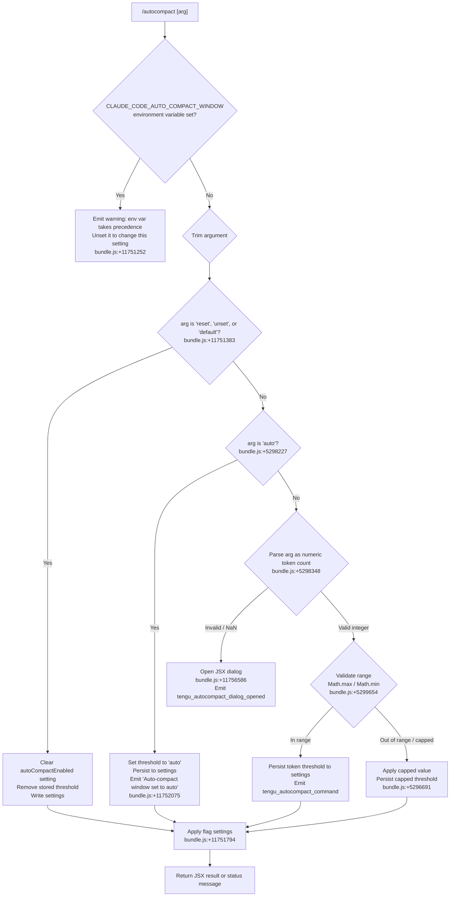

# `/autocompact`

> Analysis basis: CC v2.1.198 bundle.js (AST extraction + Claude interpretation)
> Minimum version: v2.1.198

---

## Overview

`/autocompact` controls how full the conversation context window becomes before Claude Code automatically summarizes (compacts) it. Users may set an explicit token threshold, enable automatic threshold selection, or reset the setting to the default. The command validates the argument, persists the preference to settings, and surfaces a JSX dialog for certain interaction paths.

---

## Registration

| Field | Value |
|---|---|
| type | `local-jsx` |
| name | `autocompact` |
| description | `Set how full the context gets before auto-summarizing` |
| argumentHint | `[auto\|<tokens>]` |
| isHidden | `false` |
| module_id | `S3l` |
| load_inline | `true` |
| loc_byte | `11756804` |
| loc_byte_end | `11757068` |
| loc_line | `7748` |
| arbor_handler.name | `BBf` |
| arbor_handler.fqn | `claude-2.1.198::BBf` |
| arbor_handler.kind | `AsyncFunction` |
| arbor_handler.resolution_path | `module_id` |
| arbor_handler.n_hits | `1` |

Analysis basis: CC v2.1.198 bundle.js:+11756804

---

## Input Branching

The command processes four or more distinct input cases (environment variable override, reset/unset/default keywords, `auto` keyword, and numeric token values), warranting a Mermaid flowchart.



---

## Behavioral Spec

### Handler Entry Point — `autocompactHandler` (`BBf`)

The Arbor-resolved handler is `BBf` (AsyncFunction, `claude-2.1.198::BBf`, resolved via `module_id`). On invocation it:

1. Reads the current environment to check whether `CLAUDE_CODE_AUTO_COMPACT_WINDOW` is set (literal at bundle.js:+5299536).
2. If the environment variable is present, outputs the precedence warning message and returns early without modifying any persistent setting (bundle.js:+11751252).
3. Otherwise, delegates argument parsing and settings mutation to `parseAndApplyAutocompact` (`AQt`).
4. Constructs a JSX element via `KD.jsx` when a dialog is needed (bundle.js:+11756586).

Analysis basis: CC v2.1.198 bundle.js:+11756494

---

### Argument Parsing — `parseAndApplyAutocompact` (`AQt`)

```
async function parseAndApplyAutocompact(rawArg, context):
    trimmed = rawArg.trim()                        // bundle.js:+11751354

    if trimmed in ["reset", "unset", "default"]:  // bundle.js:+11751383
        clearStoredThreshold(settings)
        return statusMessage("cleared")

    parsed = parseTokenValue(trimmed)              // odo, bundle.js:+11751426

    if parsed == "auto":                           // bundle.js:+5298227
        persistThreshold(settings, "auto")
        emitTelemetry("tengu_autocompact_command")
        return statusMessage("Auto-compact window set to auto")

    if parsed is invalid:
        openDialog()                               // bundle.js:+11756586
        return dialogResult

    validated = validateRange(parsed)             // Cde, bundle.js:+5299532
    persistThreshold(settings, validated.value)
    applyFlagSettings(context)                    // bundle.js:+11751794
    emitTelemetry("tengu_autocompact_command")    // bundle.js:+11751857
    return statusMessage("set", validated.value)
```

Analysis basis: CC v2.1.198 bundle.js:+11751218

---

### Token Value Parser — `parseTokenValue` (`odo`)

Accepts a string argument and returns either `"auto"`, a validated integer count, or a sentinel indicating invalid input.

```
function parseTokenValue(input):
    trimmed = input.trim()                        // bundle.js:+5298197

    if trimmed.endsWith(someUnit):               // bundle.js:+5298256
        raw = parseFloat(trimmed)                // bundle.js:+5298274
    else:
        raw = parseInt(trimmed)                  // bundle.js:+5298348

    // Multiply by 1000 if unit suffix present   // literal 1000 at bundle.js:+5298332
    // Clamp percentages by 100                  // literal 100 at bundle.js:+5298368

    if not Number.isFinite(raw):                 // bundle.js:+5298394
        return INVALID

    return Math.round(raw)                       // bundle.js:+5298441
```

Analysis basis: CC v2.1.198 bundle.js:+5298197

---

### Range Validation — `validateThreshold` (`Cde`)

Ensures the parsed token count falls within acceptable bounds; returns a status tag alongside the (possibly clamped) value.

```
function validateThreshold(value):
    parsed = parseInt(value)                     // bundle.js:+5296501

    if isNaN(parsed):
        return { status: "invalid", value: null } // literal "invalid" at bundle.js:+5296561

    clamped = clampToModelContextWindow(parsed)  // calls T (formatting helper)

    if clamped != parsed:
        return { status: "capped", value: clamped } // literal "capped" at bundle.js:+5296691

    return { status: "valid", value: parsed }    // literal "valid" at bundle.js:+5296486
```

Analysis basis: CC v2.1.198 bundle.js:+5296501

---

### Settings Resolution — `resolveAutocompactSettings` (`syp`)

Reads the effective compaction window from multiple configuration layers (environment, settings file, client data, experiment flags) with a defined precedence order.

```
function resolveAutocompactSettings(appState):
    // 1. Environment variable takes highest precedence
    envValue = process.env["CLAUDE_CODE_AUTO_COMPACT_WINDOW"] // bundle.js:+5299536
    if envValue is defined:
        return { source: "env", value: parseTokenValue(envValue) } // bundle.js:+5299728

    // 2. User/project settings layer                          // bundle.js:+5299798
    settingsValue = readSettingsKey("autoCompactEnabled")      // bundle.js:+5296022

    if settingsValue is defined:
        return { source: "settings", value: settingsValue }

    // 3. Client data                                          // literal "clientdata" at bundle.js:+5299904
    // 4. Experiment override                                  // literal "experiment" at bundle.js:+5299993
    // 5. Model default                                        // literal "model-default" at bundle.js:+5300092

    // Apply Math.max and Math.min bounds                      // bundle.js:+5299654, +5299694
    bounded = Math.max(lowerBound, Math.min(upperBound, resolvedValue))
    return { source: determinedSource, value: bounded }
```

Analysis basis: CC v2.1.198 bundle.js:+5299816

---

### Settings Persistence — `saveSettings` (`eo`)

Writes the updated threshold to the appropriate settings layer (user or project). It reads the current merged settings object, mutates the relevant key, atomically writes the file via a temp-file-and-rename pattern (bundle.js:+1114240), and invalidates any in-memory cache (bundle.js:+29196).

```
async function saveSettings(key, value, settingsLayer):
    current = loadSettingsFromDisk(settingsLayer)  // g1r path bundle.js:+1363662
    current[key] = value
    writeSettingsAtomically(current, settingsLayer) // BMt bundle.js:+1113634
    invalidateCache()                               // o_ bundle.js:+1366893
    emitSettingsChangeEvent()                       // qnt.emit bundle.js:+1367304
```

Analysis basis: CC v2.1.198 bundle.js:+1366112

---

### Flag Settings Application — `applyFlagSettings` (`Lr` → `X8`)

After a successful write, the command re-applies feature-flag-sourced settings to ensure the runtime configuration is consistent with the persisted value. This triggers telemetry for flag-derived overrides.

Analysis basis: CC v2.1.198 bundle.js:+11751690 (`AQt` → `Lr`), bundle.js:+1363293 (`Lr` → `X8`)

---

### Model-Name Normalization — `normalizeModelName` (`so` / `p_`)

Internally, context-window sizing calls into a model-name normalization routine that maps known model aliases to canonical identifiers. The following model name strings are referenced during traversal (not exhaustive — only those found in depth-2 literals):

- `"claude-fable-5"` (bundle.js:+2339776)
- `"claude-mythos-5"` (bundle.js:+2339831)
- `"claude-opus-4-8"` through `"claude-opus-4-0"` (bundle.js:+2339888–2340205)
- `"claude-sonnet-5"`, `"claude-sonnet-4-6"`, `"claude-sonnet-4-5"`, `"claude-sonnet-4-0"` (bundle.js:+2340237–2340450)
- `"claude-haiku-4-5"` (bundle.js:+2340484)
- `"claude-3-7-sonnet"`, `"claude-3-5-sonnet"`, `"claude-3-5-haiku"` (bundle.js:+2340543–2340665)
- `"claude-3-opus"`, `"claude-3-sonnet"`, `"claude-3-haiku"` (bundle.js:+2340724–2340834)
- `"application-inference-profile"` (bundle.js:+2340970)

The normalization logic uses `toLowerCase`, `startsWith("claude-")`, `slice`, `includes`, and `replace` operations (bundle.js:+2339582–2340882).

Analysis basis: CC v2.1.198 bundle.js:+2340927

---

## State & Side Effects

| Item | Detail |
|---|---|
| Telemetry: `tengu_autocompact_command` | Fired on every successful threshold change (set or cleared). bundle.js:+11751857 |
| Telemetry: `tengu_autocompact_dialog_opened` | Fired when the argument is absent or unparseable and a JSX dialog is opened. bundle.js:+11756529 |
| Telemetry: `tengu_amber_redwood2` | Fired during settings layer initialization. bundle.js:+5295860 |
| Telemetry: `tengu_amber_redwood3` | Fired during settings layer initialization. bundle.js:+5295891 |
| Telemetry: `tengu_daemon_config_reload` | Fired when daemon configuration is reloaded after settings change. bundle.js:+18392244 |
| Telemetry: `tengu_feature_ok` | Fired on successful feature flag evaluation. bundle.js:+1039573 |
| Telemetry: `tengu_feature_bad` | Fired on a recoverable feature flag evaluation issue. bundle.js:+1039640 |
| Telemetry: `tengu_feature_sad` | Fired on a failed feature flag evaluation. bundle.js:+1039721 |
| Settings key written | `autoCompactEnabled` in the user or project settings file. bundle.js:+5296022 |
| Environment variable checked | `CLAUDE_CODE_AUTO_COMPACT_WINDOW` — takes precedence over any settings-file value. bundle.js:+5299536 |
| Cache invalidation | In-memory settings caches (`iln`, `PAr`) are cleared after a successful write. bundle.js:+29196 |
| Settings-change event | `qnt.emit` is called to notify subscribers of the updated configuration. bundle.js:+1367304 |
| File I/O | Settings file is written atomically: write to temp path → `fsyncSync` → `renameSync`. bundle.js:+1113843, +1114240 |
| JSX dialog rendered | Rendered via `KD.jsx` with `"dialog"` role when no valid numeric argument is provided. bundle.js:+11756586 |
| Hook registration | <!-- TODO: not found in depth-2 traversal; needs --depth 4 --> |
| Sound | <!-- TODO: not found in depth-2 traversal; needs --depth 4 --> |

---

## Version History

| Version | Change |
|---|---|
| v2.1.198 | Initial analysis |

---

## Common Mistakes

1. **Setting a value while `CLAUDE_CODE_AUTO_COMPACT_WINDOW` is set in the environment.** The command will warn and exit without persisting any change. Unset that environment variable first.
2. **Passing a non-integer string without a recognized unit suffix.** Values that cannot be parsed as a finite number cause the command to open the interactive dialog rather than persisting a threshold.
3. **Expecting the threshold to be respected immediately in an already-running session.** The setting is persisted to disk and the in-memory cache is invalidated, but open sessions may need to reload settings.
4. **Using `reset` expecting it to disable auto-compact entirely.** The reset keywords (`reset`, `unset`, `default`) clear the user override, reverting to the resolved default (which may still enable auto-compaction based on model defaults or experiment flags).
5. **Providing a value beyond the model's context window.** The command clamps the value to the model's maximum and stores the capped number silently (status `"capped"`). Confirm the effective value after setting.

---

## Appendix — Identifier Mapping

> For bundle debugging only. Identifiers change across versions.

| Identifier | Role |
|---|---|
| `BBf` | Main async handler for `/autocompact` (Arbor-resolved entry point) |
| `AQt` | Argument parsing and settings mutation coordinator |
| `V9` | Settings resolution orchestrator (reads env, settings, client data, experiment layers) |
| `so` | Model-name normalization dispatcher |
| `vot` | Model-entry lookup helper (uses `Object.entries`) |
| `p_` | Model-name string normalization (lowercase, prefix checks, slice, replace) |
| `_xt` | Auxiliary model-name helper |
| `Qu` | Model-name replace utility |
| `fy` | Settings utility (calls `sw`) |
| `sw` | Low-level settings primitive |
| `iS` | Token count validation orchestrator |
| `Xki` | Integer parse-and-validate helper (uses `parseInt`, `isNaN`) |
| `b7r` | Token bounds helper (calls `lZe`, `Xki`, `Jki`) |
| `Jki` | Context-window size resolver (calls `hg`, `hV`, `kw`, `t0n`, `so`, `Fo`) |
| `Cde` | Threshold range validator; returns `"valid"`, `"invalid"`, or `"capped"` |
| `T` | Output formatting / writing utility |
| `syp` | Effective compaction-window resolver (precedence: env → settings → clientdata → experiment → model-default) |
| `Sv` | Settings layer accessor (calls `st`, `uc`) |
| `Ema` | Settings array/object validator |
| `n` | String lowercasing utility |
| `Qki` | Config key lookup helper (calls `L0`) |
| `Zki` | Config key delete helper (calls `Dt`) |
| `sdo` | Settings write helper (calls `Sv`, `hr`, `s2n`, `odo`) |
| `hr` | Settings write sub-helper |
| `s2n` | Settings normalization helper (calls `nt`) |
| `odo` | Token-value string parser (handles `"auto"`, unit suffixes, `parseInt`/`parseFloat`) |
| `ryp` | Settings read helper with `Object.hasOwn` guard |
| `eo` | Settings persistence orchestrator (load → mutate → atomic-write → cache-clear → emit) |
| `Oh` | Settings file locator |
| `Vwe` | Settings path builder (user/project/local layers) |
| `x3` | Settings object constructor |
| `zt` | Path/filesystem utility |
| `h1r` | Settings file reader |
| `XRs` | Settings schema validator |
| `Y8` | Settings file parser |
| `zRs` | SDK inline settings parser |
| `Nk` | Settings file writer coordinator |
| `IHe` | File reader with slice/replaceAll for settings |
| `mn` | Error-code helper |
| `en` | Error code constant (`"ENOENT"`) |
| `HOr` | Timestamp recorder (`Vgn.set`, `Date.now`) |
| `I3e` | Settings object rebuilder |
| `OHn` | Path resolver for settings files |
| `BMt` | Atomic file write implementation (temp → fsync → rename) |
| `r` | Filesystem module reference |
| `Wd` | Real-path resolver |
| `d` | Daemon/supervisor process manager |
| `zws` | Temp-file write helper |
| `i` | File descriptor wrapper |
| `$Mt` | File open/stat/close helper |
| `ant` | Permission-application helper |
| `$Dr` | Rename-error handler |
| `eLs` | `Object.defineProperty` wrapper for settings exports |
| `Me` | `JSON.stringify` wrapper |
| `o_` | In-memory settings cache invalidator (`iln.clear`, `PAr.clear`) |
| `Fgn` | Gitignore-awareness helper for settings files |
| `Pt` | Git process runner |
| `eOr` | Git output parser |
| `Ugn` | `git check-ignore` invoker |
| `p6u` | `git config --global --get core.excludesfile` invoker |
| `q0s` | `git ls-files --error-unmatch` invoker |
| `K0s` | Gitignore warn helper |
| `m6` | `.claude/settings.json` path builder |
| `ar` | App-state accessor |
| `xe` | Feature-flag OK path renderer |
| `V` | React/JSX state accessor |
| `Pe` | JSX element primitive (`OQe`) |
| `St` | Feature-flag SAD path renderer |
| `Le` | Feature-flag BAD path renderer |
| `X8` | Settings-load-from-disk orchestrator (with telemetry: `loadSettingsFromDisk_start/end`) |
| `a0` | Cache-presence check helper |
| `_a` | Memory-usage recorder |
| `g1r` | Settings load executor (logs `settings_load_started/completed`) |
| `aln` | Settings load auxiliary helper |
| `Re` | Error reporter (calls `sr`, `st`, `qi`, `jvu`) |
| `sr` | Error string builder |
| `st` | String coercion utility |
| `qi` | Essential-traffic error logger |
| `jvu` | Error ring-buffer manager (`Bmn.shift`, `Bmn.push`) |
| `Lr` | Flag-settings applier (entry point after successful persist) |
| `Ke` | JSX component wrapper |
| `OQe` | Base JSX primitive |
| `gl` | Number formatter (locale `"en-US"`, style `"compact"`) |
| `Ju` | Number format helper |
| `xiu` | Locale number formatter core |

---

Note: index built via Arbor fallback; some signals (telemetry, literals) may be missing — see arbor-fallback.js.