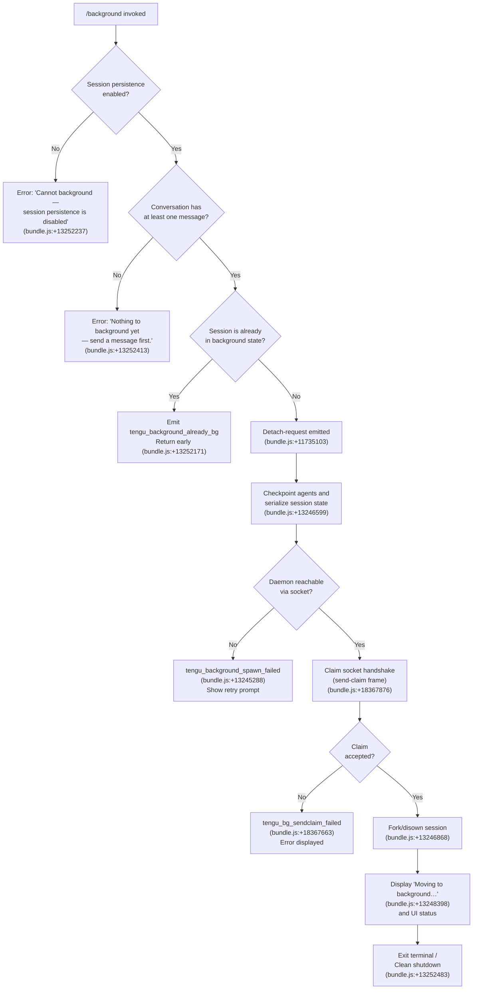

# `/background`

> Analysis basis: CC v2.1.198 bundle.js (AST extraction + Claude interpretation)
> Minimum version: v2.1.198

---

## Overview

The `/background` command (alias `/bg`) sends the current interactive REPL session to the background daemon, freeing the terminal for other use. It serializes the live conversation state into a background job, hands it off to the Claude Code daemon process via a Unix socket claim protocol, and then either exits the terminal cleanly or prints a status message. The command is only valid when a conversation has already been started and session persistence is enabled.

---

## Registration

| Field | Value |
|---|---|
| type | `local-jsx` |
| name | `background` |
| description | `Send this session to the background and free the terminal` |
| aliases | `["bg"]` |
| argumentHint | `[prompt]` |
| immediate | `null` |
| module_id | `Iic` |
| load_inline | `true` |
| loc_byte | `13602750` |
| loc_byte_end | `13602990` |
| loc_line | `9374` |
| arbor_handler.name | `hom` |
| arbor_handler.fqn | `claude-2.1.198::hom` |
| arbor_handler.kind | `AsyncFunction` |
| arbor_handler.resolution_path | `module_id` |
| arbor_handler.n_hits | `0` |

Analysis basis: CC v2.1.198 bundle.js:+13602750

---

## Input Branching

The handler contains 4+ distinct branches based on session state and daemon availability:



---

## Behavioral Spec

### Guard Checks (pre-flight)

```
async function handleBackground(context, args):
    if not context.sessionPersistenceEnabled:
        display error "Cannot background — session persistence is disabled…"
        return

    if context.conversationMessages.length == 0:
        display error "Nothing to background yet — send a message first."
        return

    if context.currentSessionIsAlreadyBackgrounded:
        emit telemetry("tengu_background_already_bg")
        return
```

Analysis basis: CC v2.1.198 bundle.js:+13252157 (handler `hom` entry), +13252237 (persistence guard), +13252413 (message guard), +13252171 (already-bg guard)

---

### Detach Request and Agent Checkpoint

```
async function initiateDetach(context):
    emit detach-request signal to running agent loop
    await checkpointAgents(context)   // serialize all agent states to disk
    copySessionFilesToTransferDirectory()
```

The handler emits a `"detach-request"` event (literal at bundle.js:+11735103) to interrupt the active agent loop gracefully. It then calls `checkpointAgents` (call edge `Tic → t.checkpointAgents` at bundle.js:+13246599) to persist all in-progress agent state.

Analysis basis: CC v2.1.198 bundle.js:+11735103, +13246599

---

### Session Fork and Roster Entry

```
async function forkSessionForBackground(sessionId, prompt):
    tmpDir = createTempDirectory(randomUUID()[0..8])
    copySessionFile(sourceDir, tmpDir)
    buildBackgroundArgs([
        "--resume", sessionId,
        "--fork-session",
        "--reply-on-resume", prompt ?? "",
        "--add-dir", ...additionalDirs,
        "--allowed-tools", ...,
        "--disallowed-tools", ...,
        "--model", modelName,
        "--effort", effortLevel,
        "--permission-mode", permMode,
        "--", ...remainingArgs
    ])
    return { tmpDir, args }
```

Key CLI flags constructed for the background process (literals at bundle.js):
- `"--resume"` (+13244643)
- `"--fork-session"` (+13244656)
- `"--reply-on-resume"` (+13244698)
- `"--add-dir"` (+13244750)
- `"--allowed-tools"` (+13244785)
- `"--disallowed-tools"` (+13244826)
- `"--model"` (+13244857)
- `"--effort"` (+13244886)
- `"--permission-mode"` (+13244903)

Analysis basis: CC v2.1.198 bundle.js:+13244527 (`fom` call for arg building), +13221803 (UUID slice at `fee`), +13221825

---

### Gate Blocking Checks

Before dispatching, the handler enforces two policy guards:

**1. `bypassPermissions` gate:**
If the session uses `--dangerously-skip-permissions` / `--allow-dangerously-skip-permissions` and the disclaimer has not been accepted interactively, the command errors with:
> `"--bg with bypassPermissions requires accepting the disclaimer first. Run \`claude --dangerously-skip-permissions\` once interactively."`

(literal at bundle.js:+13242659)

**2. Auto-permission-mode gate:**
If `--permission-mode auto` is set but the user has not opted in interactively, the command errors with:
> `"--bg with auto mode requires opting in first. Run \`claude --permission-mode auto\` once interactively."`

(literal at bundle.js:+13242821)

When a gate blocks, telemetry event `"gate_blocked"` (literal at bundle.js:+13221778) is emitted.

Analysis basis: CC v2.1.198 bundle.js:+13242490, +13242659, +13242821, +13221778

---

### Daemon Ensure and Socket Dispatch

```
async function ensureDaemonAndDispatch(args, tmpDir):
    daemonStatus = await ensureDaemonRunning()  // calls Yur → _8o → eu
    // telemetry: tengu_bg_daemon_ensure_running (via "daemon_ensure_running" literal)

    if daemonStatus == "not running":
        // Possibly prompt to install as service
        // literal: "Install as a service now? [y/N/never, or 'once' just for now]"
        //          at bundle.js:+13180900
        answer = await promptUser()
        emit telemetry("tengu_bg_daemon_cold_start_ask")
        emit telemetry("tengu_bg_daemon_cold_start_ask_answer")

    writeDispatchFile(tmpDir, args)
    // timeout for flush: 2000 ms (literal at bundle.js:+13244587)
    await flushWithTimeout(2000, "flush timeout")

    result = await socketDispatch(tmpDir)  // i8o path
    return result
```

Dispatch timeout: **2000 ms** (bundle.js:+13244587, literal `"flush timeout"` at +13244592).
Daemon service poll timeout: **40000 ms** (bundle.js:+13172817).
Post-spawn wait timeout: **30000 ms** (bundle.js:+13174583).

Analysis basis: CC v2.1.198 bundle.js:+13244579 (`ul` timeout call), +13244587, +13172761

---

### Socket Claim Protocol

```
async function sendClaimToSocket(socketPath, sessionId):
    socket = connectUnixSocket(socketPath)
    // timeout: 5000 ms (literal at bundle.js:+18368097)
    // error if timeout: "send-claim timeout" (+18368153)

    frame = buildClaimFrame(sessionId)   // sqm → Dz.buildClaimFrame
    writeFrameToSocket(socket, frame)    // JR: Buffer.from + writeUInt32BE + writeUInt8

    result = await awaitClaimAck(socket)
    if result.error == "ECONNREFUSED":
        // literal "ECONNREFUSED" at bundle.js:+18368245
        throw ConnectionRefusedError
    return result
```

Claim frame uses a 4-byte big-endian length prefix plus a 1-byte type tag (call edges `JR → n.writeUInt32BE` at +11729699, `JR → n.writeUInt8` at +11729727).

Analysis basis: CC v2.1.198 bundle.js:+18367810 (`dis → sSr.connect`), +18368097, +18367884 (`dis → JR`)

---

### Low-Memory Guard

Before dispatching a background job, the daemon worker checks available free memory:

```
function checkMemoryBeforeDispatch():
    freeMb = os.freemem() / (1024 * 1024)
    emit telemetry("tengu_bg_low_mem_mb", { freeMb })
    if freeMb < threshold:
        emit telemetry("tengu_bg_dispatch_low_mem")
        // abort dispatch
```

Platform check: only runs on `"macos"` (literal at bundle.js:+13148779) using the `bun:ffi` dynamic library path `"/usr/lib/libSystem.B.dylib"` (literal at +13148913).

Analysis basis: CC v2.1.198 bundle.js:+13148687 (telemetry `tengu_bg_low_mem_mb`), +18375342 (`g → QJc.freemem`), +13148779

---

### SIGKILL Escalation for Stuck Processes

```
async function killOldSession(pid, timeout1=30, timeout2=15):
    send SIGTERM to pid
    wait timeout1 seconds
    if still running:
        emit telemetry("tengu_bg_dispatch_sigkill_escalate")
        send "SIGKILL" to pid
        wait timeout2 seconds
    if still running after timeout2:
        retry up to 100 times (literal at bundle.js:+18374831)
```

Timeouts: **30 s** (bundle.js:+18374711) and **15 s** (+18374722). Signal literals: `"SIGTERM"` (+18367901), `"SIGKILL"` (+18374804).

Analysis basis: CC v2.1.198 bundle.js:+18374797 (`g → G.kill`), +18374756 (telemetry)

---

### Spare Session Management

The background system maintains a pool of pre-warmed "spare" sessions:

```
function manageSparePool(sessionMap):
    emit telemetry("tengu_bg_spare_enable")
    for each session in sessionMap.values():
        status = session.retireIfSettled()
        if status == "claimed":
            emit telemetry("tengu_bg_spare_claim")
        elif status == "failed":
            emit telemetry("tengu_bg_spare_claim_fail")
```

Spare session states observed: `"spare"` (+18375646), `"exec"` (+18375762), `"done"` (+18381954), `"killed"` (+18381972), `"stopped"` (+18381981), `"failed"` (+18381991), `"idle"` (+18383215), `"crashed"` (+18382243), `"blocked"` (+18382297), `"working"` (+18382611), `"resuming"` (+18384297).

Retry-exhausted event: `"dup_retry_exhausted"` emitted when duplicate detection loop exhausts attempts (literal at bundle.js:+18375166).

Analysis basis: CC v2.1.198 bundle.js:+18376152, +18376280, +18376546

---

### UI Render (JSX Component)

```
function BackgroundCommandUI(props):
    // Shows "Moving to background…" text while transitioning
    // literal: "Moving to background…" at bundle.js:+13248398

    if noSeed:
        // event: "no_seed" at bundle.js:+13247285
        // literal: "Nothing to background — exiting." at +13247335
        display exitMessage
        return

    if alreadyBackgrounded:
        // shows "(backgrounded)" suffix at +13248853
        // shows "(worktree handed off)" at +13248068
        renderAgentList(agents, width=26 chars)

    // Uses nFe.useRef, nFe.useEffect for lifecycle
    // Uses LIt.jsx for rendering
    // Renders session status with column padding of 26 chars (literal at bundle.js:+13229871)
```

The UI is a JSX component registered as `local-jsx` type. It uses React hooks (`useRef`, `useEffect`) and renders a session summary table with columns padded to **26** characters (literal at bundle.js:+13229871).

Menu items rendered in the UI (literals):
- `"claude agents"` (+13229964)
- `"list sessions"` (+13229980)
- `"open in this terminal"` (+13230020)
- `"show recent output"` (+13230066)
- `"stop this session"` (+13230109)

Analysis basis: CC v2.1.198 bundle.js:+13248044 (`H8o → vIt`), +13248289 (`nFe.useEffect`), +13248366 (`LIt.jsx`), +13247296 (`H8o → Ti`)

---

### Session Roster File I/O

The background command writes and reads several state files under the daemon's data directory:

| File | Purpose | Call site |
|---|---|---|
| `state.json` | Per-session state record | literal at bundle.js:+18382447 |
| `roster.json` | Background session roster | read/parse via `V4` at +12064879 |
| `daemon.status.json` | Daemon liveness heartbeat | literal at bundle.js:+13346372 |
| `pins.json` | Pinned directory list | literal at bundle.js:+4356454 |
| `adopt.json` | Checkpoint adopt spec | literal at bundle.js:+8045310 |
| `pty-pids` | PTY process ID list | literal at bundle.js:+12061338 |

Roster parse failure telemetry: `tengu_bg_roster_parse_failed` (bundle.js:+12065072).

Roster file write mode: octal `448` = `0o700` (literal at bundle.js:+18374499), host-managed dir sentinel `"host-managed"` at +12060810.

Analysis basis: CC v2.1.198 bundle.js:+18382447, +12064879, +13346372

---

### Argument Forwarding to Background Process

The background process receives these additional flags when applicable:
- `"--agent"` (+13222301) / `"--name"` / `"-n"` (+13222329) for named agents
- `"--continue"` / `"-c"` (+13222569) for session continuation
- `"--session-id"` (+13241583) or `"--session-id="` (+13241278) for explicit session binding
- `"--resume="` (+13240831)

Session type passed as `"slash"` (literal at bundle.js:+13224730) to distinguish backgrounded REPL sessions from other invocation modes.

Analysis basis: CC v2.1.198 bundle.js:+13244725 (`Yur → a2e`)

---

### Exit and Handoff

```
async function performHandoff(context):
    // Stop current agent watchers (z → Nn.filter, z → qr.has)
    context.dispose()

    // Spawn detached background process
    Dz.spawn(backgroundProcess, { detached: true })
    // literal "spawned" at bundle.js:+18376786

    // Set session state to "bg" in appState
    // literal "bg" at bundle.js:+18382775

    // Telemetry
    emit telemetry("tengu_background")
    emit telemetry("repl_background_fork")
    // literals: "repl_background_fork" at +13245941

    // Clean exit of host process
    process.exit(0)
```

Telemetry outcome literals: `"queued_for_later"` (+13245964), `"spawn_failed"` (+13246015).

Analysis basis: CC v2.1.198 bundle.js:+18376609 (`g → Dz.spawn`), +13246089 (telemetry `tengu_background`), +13245941

---

## State & Side Effects

| Item | Detail |
|---|---|
| Telemetry | `tengu_background` (+13246089), `tengu_background_already_bg` (+13252171), `tengu_background_spawn_failed` (+13245288), `tengu_bg_dispatch` (+13218578), `tengu_bg_dispatch_fallback` (+13219108), `tengu_bg_dispatch_rescued` (+13225945), `tengu_bg_dispatch_sigkill_escalate` (+18374756), `tengu_bg_dispatch_low_mem` (+18375462), `tengu_bg_low_mem_mb` (+13148687), `tengu_bg_sendclaim_failed` (+18367663), `tengu_bg_handoff_settle` (+18382136), `tengu_bg_spare_enable` (+18376152), `tengu_bg_spare_claim` (+18376280), `tengu_bg_spare_claim_fail` (+18376546), `tengu_bg_roster_parse_failed` (+12065072), `tengu_bg_state_read_transient` (+4355153), `tengu_bg_daemon_cold_start_ask` (+13173801), `tengu_bg_daemon_cold_start_ask_answer` (+13180975), `tengu_bg_daemon_install` (+13173223), `tengu_bg_daemon_service_stale_exec` (+13172861), `tengu_bg_daemon_spawn_failed` (+13174352), `tengu_bg_daemon_service_poll_fallthrough` (+13173477), `tengu_bg_daemon_cold_start_ask` (+13173801), `tengu_rename_full_session_fork` (+12612702), `tengu_amber_anchor` (+3413906) |
| Filesystem writes | Dispatch file in tmp directory, `state.json`, `roster.json` entries, `daemon.status.json`, PTY pid files |
| Socket I/O | Unix domain socket claim frame (length-prefixed binary protocol) to daemon control socket |
| appState changes | Session `isBackgrounded` flag set to `true`; session state transitions to `"bg"` |
| Process lifecycle | Host process calls `process.exit` after handoff; background child process spawned detached |
| Hook registration | `process.on("exit", ...)` registered during daemon startup (call edge `eu → process.on` at bundle.js:+13703220) |
| Sound | None observed in call graph |
| Agent checkpoint | All agent states written to disk before detach (call edge `Tic → t.checkpointAgents` at +13246599) |

---

## Version History

| Version | Change |
|---|---|
| v2.1.198 | Initial analysis |

---

## Common Mistakes

1. **Running `/background` before sending any message** — The command checks that the conversation is non-empty and will refuse with `"Nothing to background yet — send a message first."` (bundle.js:+13252413). Start a task first.

2. **Using `/background` with `--dangerously-skip-permissions` without prior interactive acceptance** — The gate check (bundle.js:+13242659) blocks backgrounding until the user has accepted the bypass disclaimer in an interactive session. Run `claude --dangerously-skip-permissions` once to accept.

3. **Using `/background` with auto permission mode without prior opt-in** — Similar gate (bundle.js:+13242821). Run `claude --permission-mode auto` interactively once to unlock.

4. **Expecting `/background` to work when session persistence is disabled** — If the configuration has session persistence off, the command errors immediately (bundle.js:+13252237). Enable persistence in settings or environment.

5. **Mixing `--bg` and `--cloud` flags** — The argument parser explicitly detects this combination and shows an error: `"--bg and --cloud are different backends. Use \`claude --cloud '<task>'\` directly to start a cloud session."` (literal at bundle.js:+13183321).

6. **Daemon not running and auto-install not accepted** — If the daemon is not installed as a service, `/background` will prompt the user to install it (literal `"Install as a service now? [y/N/never, or 'once' just for now] "` at bundle.js:+13180900). Answering `"no"` or `"never"` will prevent background dispatch.

---

## Appendix — Identifier Mapping

> For bundle debugging only. Identifiers change across versions.

| Identifier | Role |
|---|---|
| `hom` | Main `/background` command async handler (arbor_handler) |
| `Yur` | Background arg-building and orchestration function |
| `Tic` | Background session fork/checkpoint coordinator |
| `H8o` | JSX UI component for background transition display |
| `vIt` | Session status column renderer (26-char padded) |
| `gis` | Background job state machine / handoff settler |
| `dis` | Daemon socket claim sender |
| `sqm` | Claim frame builder (`Dz.buildClaimFrame` wrapper) |
| `iqm` | Send-claim with timeout (5000 ms) |
| `aqm` | Low-level socket connect for claim |
| `JR` | Binary frame serializer (length-prefix + type byte) |
| `i8o` | CLI background dispatch coordinator |
| `fee` | Background session fork launcher |
| `fom` | Argument parser / option builder for background invocation |
| `oom` | Background session orchestrator (sub-function of `fee`) |
| `g` | Background session state-machine loop (daemon side) |
| `As` | Process exit / flush helper |
| `ul` | Flush-with-timeout utility (2000 ms) |
| `_8o` | Signal/process registration shim |
| `eu` | Process event listener registration |
| `Si` | Signal registration via `sus.register` |
| `FT` | Daemon context accessor |
| `Mn` | Generic timeout-with-abort utility |
| `l8` | Graceful shutdown with race (500 ms) |
| `kye` | MCP server shutdown on exit |
| `$ye` | Cleanup timeout handler |
| `Re` | Error logger / structured error handler |
| `qi` | Queue manager for error telemetry |
| `jvu` | Rotating log buffer (shift/push) |
| `RTt` | Session rename/name-generation driver |
| `r7f` | Per-session agent runner with abort signal |
| `CR` | Main agent conversation loop |
| `PZn` | AppState get/set coordinator for session |
| `g$o` | Session model and state initializer |
| `vs` | Model alias resolver |
| `Fo` | Model short-name canonicalizer |
| `wR` | Session worker renderer |
| `Yrr` | Message normalizer and hash builder |
| `TR` | Message transform / tool schema builder |
| `tgc` | Main query execution loop (turn controller) |
| `ann` | Agent listing delta builder |
| `k$o` | Fallback request builder |
| `Zjn` | Local-agent session manager |
| `Tic` | Background checkpoint and fork coordinator |
| `Mgt` | Adopt-checkpoint file reader |
| `BVp` | Checkpoint schema validator |
| `V4` | Roster file read/parse/repair |
| `EGe` | Pinned-dirs file manager |
| `msp` | Directory scanner for background state |
| `Oea` | Directory creator for background state |
| `dis` | Daemon socket claim sender |
| `W7o` | Host-managed roster writer |
| `Ti` | Terminal exit / cleanup orchestrator |
| `Fje` | Terminal unmount helper |
| `Ego` | Terminal final-output writer |
| `Sgo` | Force-exit with SIGKILL escalation |
| `cOn` | Terminal cursor save/restore writer |
| `Ws` | Fullscreen/flicker mode resolver |
| `PGt` | Data-directory path resolver |
| `k0t` | Startup performance profiler |
| `rvr` | Perf mark recorder |
| `Efs` | Startup profiling aggregator |
| `hfs` | Profiling report writer |
| `Ope` | Agent state-map manager |
| `xgt` | Agent listing renderer |
| `Lgt` | Agent summary line builder |
| `Zjn` | Background session tracker |
| `Q9` | Task metadata updater |
| `jjn` | Task record update handler |
| `MVe` | Task lifecycle event handler |
| `ZTo` | Subagent session resolver |
| `eIo` | Workflow realpath hasher |
| `QTo` | Cached-value TTL accessor |
| `nIo` | Agent vT-state getter |
| `rIo` | Agent Ka-state getter |
| `oIo` | Agent z8t-state getter |
| `NVe` | Agent config getter |
| `Dgt` | Agent detail getter |
| `FM` | <!-- TODO: not found in depth-2 traversal; needs --depth 4 --> |
| `oRe` | Tool permission context builder |
| `dsp` | Tool permission dedup helper |
| `dq` | Disallowed-tool filter builder |
| `Eic` | Tool whitelist checker |
| `Kur` | Tool pattern matcher |
| `yic` | Tool allow-list checker |
| `AIe` | Tool name accumulator |
| `Cz` | Tool set membership checker |
| `kie` | Tool name prefix checker |
| `qur` | Agent tool filter builder |
| `_ic` | Tool slice/accumulator |
| `mom` | Tool map builder |
| `fom` | Arg parser for `--bg` sub-options |
| `wIt` | Permission flag parser |
| `Gjo` | Cloud-flag detector |
| `Wjo` | Cloud-flag string matcher |
| `HN` | Settings layer reader |
| `Hn` | Settings accessor |
| `h6` | <!-- TODO: not found in depth-2 traversal; needs --depth 4 --> |
| `Sic` | <!-- TODO: not found in depth-2 traversal; needs --depth 4 --> |
| `by` | Amber-anchor telemetry emitter |
| `D0e` | Background-service label getter |
| `Yce` | Service-state resolver |
| `Pye` | State enum accessor |
| `ov` | App-state value accessor |
| `jat` | State-change event dispatcher |
| `ZJr` | State string serializer |
| `li` | Daemon-worker environment setup |
| `gxe` | <!-- TODO: not found in depth-2 traversal; needs --depth 4 --> |
| `S2` | Environment/build-mode detector |
| `L9e` | Context-store accessor |
| `_f` | Async-context getter |
| `C0` | Context-store get wrapper |
| `pTd` | tmux session spawner |
| `fTd` | tmux `spawnSync` executor |
| `DTe` | Detach-request handler |
| `Nqa` | Detach-request event emitter |
| `mj` | Stderr writer for detach notice |
| `Tme` | <!-- TODO: not found in depth-2 traversal; needs --depth 4 --> |
| `dCn` | <!-- TODO: not found in depth-2 traversal; needs --depth 4 --> |
| `g8o` | Background command JSX entry point |
| `kIt` | JSX utility / render helper |
| `hom` | Top-level `/background` command handler |
| `vb` | AppState consumer hook |
| `PR` | Task-list state manager |
| `w6p` | Task queue processor |
| `IT` | Task queue mutator (shift/splice/push) |
| `C6p` | Task config builder |
| `L6p` | Task timestamp updater |
| `x6p` | Task status updater |
| `HWn` | AppState setState caller |
| `zAo` | <!-- TODO: not found in depth-2 traversal; needs --depth 4 --> |
| `Ku` | Task enqueue helper |
| `Ac` | AppState context consumer |
| `oro` | AppState context hook |
| `o8n` | <!-- TODO: not found in depth-2 traversal; needs --depth 4 --> |
| `BLt` | <!-- TODO: not found in depth-2 traversal; needs --depth 4 --> |
| `Bje` | <!-- TODO: not found in depth-2 traversal; needs --depth 4 --> |
| `J9n` | <!-- TODO: not found in depth-2 traversal; needs --depth 4 --> |
| `XMt` | <!-- TODO: not found in depth-2 traversal; needs --depth 4 --> |
| `Xge` | <!-- TODO: not found in depth-2 traversal; needs --depth 4 --> |
| `Xln` | Telemetry drain flusher (`ius.drain`) |
| `TZe` | Telemetry drain flusher (`sus.drain`) |
| `eRa` | Promise.allSettled wrapper (local) |
| `LRa` | Promise.allSettled wrapper (remote) |
| `t4n` | Scroll-summary / UI metrics emitter |
| `gRa` | UI timing accumulator |
| `Flc` | Daemon status file writer |
| `ftn` | Daemon status file path builder |
| `Ys` | AsyncLocalStorage store accessor |
| `Ene` | <!-- TODO: not found in depth-2 traversal; needs --depth 4 --> |
| `wg` | Compact boundary detector |
| `lsr` | EE (event emitter) compact helper |
| `Fue` | File cleanup / state-file sweep |
| `mE` | Pin-cache delete helper |
| `dc` | Jobs-directory path builder |
| `Zi` | Background job file reader/writer |
| `ip` | Temp-file installer |
| `Uf` | Secure random-bytes file writer |
| `Jg` | Active-state marker |
| `U0` | Active-state set helper |
| `GTe` | Roster path builder |
| `_Ue` | Auth-dir path builder |
| `tM` | Z6l-path accessor |
| `Z6l` | PTY-pid path builder |
| `uk` | PTY-dir path builder |
| `B9o` | EGf path helper |
| `qbt` | Dme path helper |
| `QD` | Z6l-late path builder |
| `XZ` | Split-path builder |
| `nZt` | Roster-path builder (nZt) |
| `eZt` | Auth-roster path builder |
| `ZQt` | Auth-dir path builder (ZQt) |
| `tZt` | Dispatch-file path builder |
| `pie` | Daemon-dir path builder |
| `Ome` | Dispatch-file path builder (Ome) |
| `pYe` | Dispatch socket path builder |
| `Rme` | Roster join path builder |
| `VZ` | Retire-if-settled implementation |
| `$6l` | Roster unlink helper |
| `Q` | Session retire-if-settled caller |
| `Kbt` | Checkpoint session reader |
| `V4` | Roster file parse and repair |
| `TGf` | Checkpoint directory writer |
| `Vir` | Background socket connection with lease |
| `IS` | Control-socket request sender |
| `Pme` | Dispatch file reader |
| `cic` | Dispatch ack checker |
| `Flc` | Status-file writer |

Note: index built via Arbor fallback; some signals (telemetry, literals) may be missing — see arbor-fallback.js.