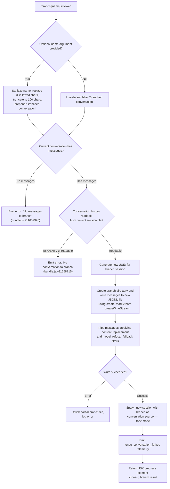

# `/branch`

> Analysis basis: CC v2.1.198 bundle.js (AST extraction + Claude interpretation)
> Minimum version: v2.1.198

---

## Overview

The `/branch` command creates a divergent copy of the current conversation at the point it is invoked, preserving the conversation history up to that moment and starting a new, independent session from it. The branched session is assigned a fresh UUID and the conversation messages are copied into a new JSONL file, after which a new interactive session is spawned using the branch as its starting point. A `tengu_conversation_forked` telemetry event is emitted on success.

---

## Registration

| Field | Value |
|---|---|
| type | `local-jsx` |
| name | `branch` |
| description | `Create a branch of the current conversation at this point` |
| argumentHint | `[name]` |
| module_id | `oBo` |
| load_inline | `true` |
| loc_byte | `13082721` |
| loc_byte_end | `13082898` |
| loc_line | `8965` |
| arbor_handler.name | `t2f` |
| arbor_handler.fqn | `claude-2.1.198::t2f` |
| arbor_handler.kind | `AsyncFunction` |
| arbor_handler.resolution_path | `module_id` |
| arbor_handler.n_hits | `0` |

Analysis basis: CC v2.1.198 bundle.js:+13082721

---

## Input Branching

The command has four distinct top-level branches depending on argument presence, conversation state, and message availability.



---

## Behavioral Spec

### Top-Level Handler (`t2f`)

The Arbor-resolved handler `t2f` is an `AsyncFunction` reached via `module_id` resolution through module `oBo`.

Analysis basis: CC v2.1.198 bundle.js:+11661994

```
async function branchCommandHandler(args, context):
    # args.name is the optional user-supplied branch label
    label = sanitizeBranchName(args.name)
    messages = getCurrentConversationMessages(context)

    if messages is empty or null:
        return errorResult("No messages to branch")

    sourceFile = resolveConversationFilePath(context)
    if sourceFile does not exist (ENOENT):
        return errorResult("No conversation to branch")

    branchId  = crypto.randomUUID()
    branchDir = buildBranchDirectoryPath(context, branchId)
    await fs.mkdir(branchDir, { recursive: true })

    ok = await copyConversationToFile(sourceFile, branchDir, messages)
    if not ok:
        await fs.unlink(partialBranchFile)
        return errorResult("Unknown error occurred")

    spawnNewSession({ mode: "fork", sourceDir: branchDir, label })
    emit("tengu_conversation_forked")
    return progressJSX(branchId, label)
```

Analysis basis: CC v2.1.198 bundle.js:+11661994

---

### Branch Name Sanitization (`k2l` / `n3e`)

Analysis basis: CC v2.1.198 bundle.js:+11658343

```
function sanitizeBranchName(rawName):
    if rawName is null or empty:
        return "Branched conversation"

    # Strip or replace characters disallowed in filesystem labels
    cleaned = rawName.replace(disallowedPattern, "")

    # Normalize whitespace, collapse multiples
    cleaned = cleaned.replaceAll("  ", " ").trim()

    # Validate against allowed-character regex (O9u, P9u patterns)
    if not allowedCharPattern.test(cleaned):
        cleaned = cleaned.slice(0, 200)   # safety truncation

    # Hard truncate to 100 characters
    result = "Branched conversation" + (cleaned ? " — " + cleaned : "")
    return result.padEnd(...)   # padEnd used for display alignment
```

Literal evidence: default label `"Branched conversation"` at bundle.js:+11658451; truncation constant `100` at bundle.js:+11658435.

---

### Conversation File Copy (`R2l`)

Analysis basis: CC v2.1.198 bundle.js:+11658507

```
async function copyConversationToFile(sourcePath, branchDir, messages):
    readStream  = fs.createReadStream(sourcePath, { encoding: "utf8", highWaterMark: 448 })
    writeStream = fs.createWriteStream(destPath,  { flags: "open", highWaterMark: 384 })

    lineReader = readline.createInterface({ input: readStream })

    filteredLines = []
    for line in lineReader:
        parsed = safeJsonParse(line)
        if parsed.type == "content-replacement" or "model_refusal_fallback":
            skip
        filteredLines.push(transformLine(parsed))

    for line in filteredLines:
        writeStream.write(line)

    await streamFinished(writeStream)
    writeStream.close()
    readStream.destroy()
    return true

# On any stream error the caller unlinks the partial file.
```

Key literals: `highWaterMark: 448` at bundle.js:+11658600; `highWaterMark: 384` at bundle.js:+11658810; encoding `"utf8"` at bundle.js:+11658651; flags `"open"` at bundle.js:+11658677; filter strings `"content-replacement"` at bundle.js:+11659197 and `"model_refusal_fallback"` at bundle.js:+11659595.

---

### Session Spawn for Branched Session (`M2l`)

Analysis basis: CC v2.1.198 bundle.js:+11661994 (call from `t2f`) and bundle.js:+11661021 (`M2l` implementation)

```
async function spawnBranchedSession(branchDir, label, context):
    # Initialize telemetry and process hooks
    registerSignalHandlers()           # eu, Si
    sessionStart = new Date()

    # Resolve branch identifier
    branchId = extractIdFromPath(branchDir)   # ii: indexOf + slice

    # Start JSONL session worker in "fork" mode
    sessionResult = await startSessionWorker({
        mode:      "fork",             # literal "fork" at +11661711
        sourceDir: branchDir,
        label:     label,
        autoTitle: "auto",             # literal "auto" at +11661144
        startTime: sessionStart.toISOString(),
    })

    # Emit conversation-forked event
    telemetry.emit("tengu_conversation_forked")  # +11661190

    # Attach file watcher for session state changes (mS / Fue)
    watchBranchFiles(branchDir)

    return sessionResult
```

Analysis basis: CC v2.1.198 bundle.js:+11661188

---

### Message Validation Guard

Before any file I/O is attempted, the handler checks whether there is at least one user message in the current conversation:

```
function validateConversationHasMessages(messages):
    if not Array.isArray(messages) or messages.length == 0:
        return { ok: false, error: "No messages to branch" }
    firstUserMsg = messages.find(m => m.role == "user")
    if firstUserMsg is null:
        return { ok: false, error: "No messages to branch" }
    return { ok: true }
```

Literal evidence: `"user"` role check at bundle.js:+1093866; empty array guard at bundle.js:+1093895; error string `"No messages to branch"` at bundle.js:+11659920.

---

## State & Side Effects

| Item | Detail |
|---|---|
| Telemetry | `tengu_conversation_forked` (bundle.js:+11661190) — emitted after successful branch spawn |
| Telemetry (indirect) | `tengu_feature_ok` / `tengu_feature_bad` (bundle.js:+1039573, +1039640) — emitted by feature gate wrapper `Le`/`xe` |
| File system | Creates a new branch directory under the Claude sessions directory; writes a filtered JSONL copy of the current conversation |
| File system (cleanup) | On write failure, unlinks the partial branch file (bundle.js:+11658980) |
| Process | Spawns a new interactive CLI session (`Dz.spawn` at bundle.js:+18376609) with the branch as its starting conversation source |
| appState changes | New session entry is registered in the session roster; the branched session is given a fresh UUID |
| Hook registration | `process.on("exit", …)` registered via `eu` (bundle.js:+13703220) for the spawned child process |
| Sound | None observed in depth-2 traversal |

---

## Version History

| Version | Change |
|---|---|
| v2.1.198 | Initial analysis |

---

## Common Mistakes

1. **Running `/branch` with no prior messages** — the command immediately returns `"No messages to branch"` and does nothing. Ensure the conversation has at least one user turn before branching.
2. **Supplying a branch name with filesystem-unsafe characters** — special characters are silently stripped by the sanitizer (`k2l`/`n3e`). The resulting name may be shorter than expected or reduced to only the default prefix.
3. **Branching in a session whose JSONL file has been deleted externally** — the ENOENT guard in `R2l` catches this and returns `"No conversation to branch"` without creating any files.
4. **Expecting the current session to be paused** — `/branch` spawns a *new* process; the original session continues running independently alongside the branched one.
5. **Assuming all message types are preserved** — messages of type `"content-replacement"` and `"model_refusal_fallback"` are filtered out of the branch copy during the pipe phase.

---

## Appendix — Identifier Mapping

> For bundle debugging only. Identifiers change across versions.

| Identifier | Role |
|---|---|
| `t2f` | Top-level async handler for `/branch` command (Arbor-resolved entry point) |
| `M2l` | Branch session orchestrator — coordinates file copy and session spawn |
| `R2l` | Conversation file copy worker — reads source JSONL, filters, writes branch file |
| `k2l` | Branch name sanitizer — normalises raw user input into a filesystem-safe label |
| `n3e` | Inner string-processing helper for name sanitization (regex exec, replaceAll, slice) |
| `e2f` | Session ID parser / line-number tracker used during JSONL copy |
| `Fue` | File watcher bootstrapper for the newly spawned branch session |
| `mS` | Basename extractor / session label helper |
| `fj` | Session title writer (writes custom-title metadata for the branch) |
| `y7e` | Agent-name setter for branched session |
| `UZ` | Context / worktree resolver called during session initialization |
| `vbe` | Git worktree detection helper |
| `Nfc` | File-listing helper for branch directory population |
| `ii` | Utility: indexOf + slice for extracting branch ID from path |
| `Zm` | Session initialization wrapper called by `M2l` |
| `eu` | Process exit-handler registrar |
| `Si` | Signal handler setup (registers with runtime via `sus.register`) |
| `g` | Daemon background-session dispatch function (reached during spawn path) |
| `gis` | Background session worker lifecycle manager |
| `dis` | Daemon socket claim sender |
| `Kbt` | Background session file loader / retirer |
| `V4` | Background session single-file reader with JSONL parse |
| `bv` | Conversation file path builder |
| `Th` | Session metadata path resolver |
| `Le` | Feature-gate wrapper (success path — emits `tengu_feature_ok`) |
| `xe` | Feature-gate wrapper (failure path — emits `tengu_feature_bad`) |
| `Re` | Error reporting / telemetry aggregator |
| `sr` | Error classifier (code extraction from Error objects) |
| `st` | String coercion utility |
| `mn` | Logger / structured log emitter |
| `en` | Low-level log writer |
| `Mn` | Process wait / timeout utility |
| `Me` | JSON serializer wrapper |
| `Gt` | JSON.parse wrapper |
| `he` | String coercion (toString) utility |
| `gd` | Debug log emitter |
| `JR` | Binary frame encoder (used in daemon socket protocol) |
| `nt` | Background worker context factory |
| `oXe` | Memory pressure monitor |
| `hrm` | macOS-specific free-memory probe (uses bun:ffi) |
| `EGe` | Pinned-jobs file reader/writer |
| `msp` | Directory scanner for session files |
| `Oea` | File copy helper (mkdir + copyFile) |
| `lm` | Session file loader with caching |
| `Zi` | Session state file reader/writer |
| `ip` | Atomic file-write helper (uses random bytes for temp name) |
| `Uf` | Secure temp-file writer (randomBytes, copyFile, chmod) |
| `mE` | Cache invalidation helper ($re.delete) |
| `dc` | Jobs-directory path builder |
| `gR` | Session directory path resolver |
| `tZt` | Host-managed session path builder |
| `ZQt` | Auth-subdirectory path builder |
| `eZt` | Session metadata directory path builder |
| `pie` | Daemon session path builder |
| `Ome` | Host-managed metadata path builder |
| `nZt` | Session roster entry path builder |
| `GTe` | PTY-pids file path builder |
| `_Ue` | PTY-pids directory resolver |
| `tM` | PTY-pids writer |
| `Z6l` | PTY-pids split/write helper |
| `uk` | PTY session path builder |
| `qbt` | PTY directory path builder |
| `B9o` | PTY session file path resolver |
| `QD` | PTY-pids reader |
| `XZ` | PTY session split helper |
| `W7o` | Host-tombstone writer (daemon handoff) |
| `VZ` | Session retire-if-settled worker |
| `Rme` | Session roster path builder |
| `$6l` | Session unlink / remove helper |
| `Q` | Session retirement dispatcher |
| `yr` | Session state classifier (nonconforming check) |
| `Um` | State-order helper |
| `Ke` | State-key lookup helper |
| `Jg` | Active-session registry accessor |
| `U0` | Active-session set builder (`Bre`) |
| `oRe` | Tool-output permission classifier |
| `dsp` | Permission dedup/filter helper |
| `V4` | Single session file loader |
| `TGf` | Session file writer (mkdir + Uf) |
| `Flc` | Daemon status file writer |
| `ftn` | Daemon status file path builder |
| `Ys` | AsyncLocalStorage store accessor |
| `Ene` | Environment context helper |
| `N` | Background worker sweep / watch loop |
| `Z` | Background session worker (voice + grace clock management) |
| `U` | Shutdown / abort signal handler |
| `Ssc` | Low-memory context initializer |
| `vur` | Background attach-upgrade helper |
| `Fn` | Promise fulfillment helper |
| `ne` | Named-session accessor |
| `oe` | Session pool (Z + ne + A + v) |
| `k` | MCP tool watcher / file-change handler |
| `tts` | Scheduled-task runner |
| `J3c` | Task log appender |
| `Z3c` | Task lock file writer |
| `ets` | Task executor (Si + tsn) |
| `e9c` | Task state reader |
| `Zon` | Task directory path builder |
| `tsn` | Task lock releaser |
| `XL` | Process signal sender (process.kill) |
| `wI` | Worker state machine stepper |
| `D` | Daemon yield writer |
| `hSe` | Session directory locator |
| `E` | SDK/HTTP MCP client connection handler |
| `$Je` | MCP batch-size calculator |
| `AVc` | MCP object-key counter |
| `H` | Active process kill helper |
| `I` | Input event handler (key press / scroll) |
| `R` | HTTP request router (OAuth + gateway endpoints) |
| `A` | userinfo fetch helper |
| `ZW` | Session relocation helper |
| `Zh` | Context cache lookup |
| `FL` | Shell-escape helper (e.replace) |
| `pj` | Session log appender / title writer |
| `S2` | Session config builder |
| `YY` | Session rename helper |
| `W1t` | Config file read/write helper |
| `LXe` | Buffer-packing utility |
| `zY` | Session basename hasher |

---

Note: index built via Arbor fallback; some signals (telemetry, literals) may be missing — see arbor-fallback.js.