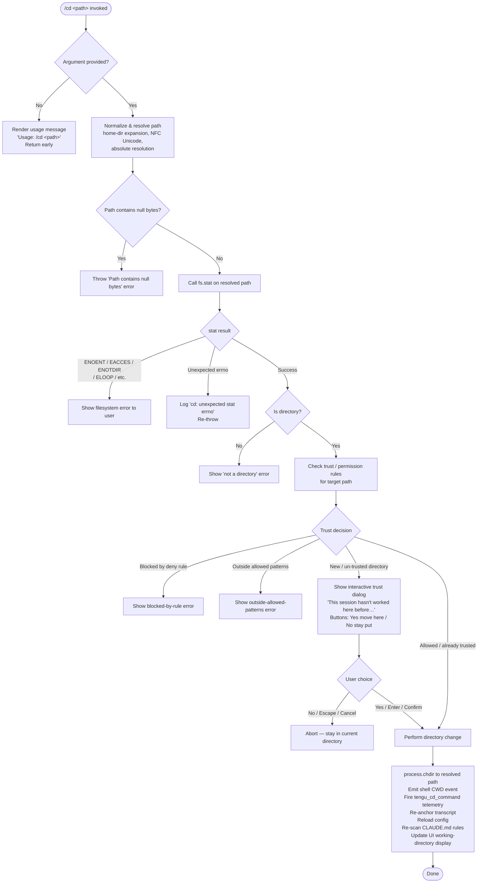

# `/cd`

> Analysis basis: CC v2.1.198 bundle.js (AST extraction + Claude interpretation)
> Minimum version: v2.1.198

---

## Overview

The `/cd` command changes the active working directory of the current Claude Code session to a user-specified path. It validates the target path (resolving home-directory shorthand, symlinks, and normalizing Unicode), checks trust/permission settings for the destination, performs the directory change atomically, and then re-anchors all session-level subsystems (transcript, config, shell CWD, CLAUDE.md rules) to the new location.

---

## Registration

| Field | Value |
|---|---|
| type | `local-jsx` |
| name | `cd` |
| description | Move this session to a new working directory |
| argumentHint | `<path>` |
| module_id | `mBl` |
| load_inline | `true` |
| loc_byte | `11703439` |
| loc_byte_end | `11703599` |
| loc_line | `7657` |
| arbor_handler.name | `F2f` |
| arbor_handler.fqn | `claude-2.1.198::F2f` |
| arbor_handler.kind | `AsyncFunction` |
| arbor_handler.resolution_path | `module_id` |
| arbor_handler.n_hits | `0` |

Analysis basis: CC v2.1.198 bundle.js:+11703439

---

## Input Branching

The command has five or more distinct paths depending on argument validity, directory existence, trust status, and permission rules. A Mermaid flowchart is used.



---

## Behavioral Spec

### 1. Argument Parsing and Usage Guard

If no argument is supplied after `/cd`, the handler renders a JSX usage hint (`"Usage: /cd <path>"`) via the UI renderer and returns immediately without attempting any filesystem operation.

Analysis basis: CC v2.1.198 bundle.js:+11701941

### 2. Path Normalization (`pathNormalizer`)

```
function pathNormalizer(rawInput):
    if rawInput contains null bytes ("\0"):
        throw Error("Path contains null bytes")

    trimmed = rawInput.trim()
    normalized = unicodeNormalize(trimmed, form="NFC")   // NFC normalization

    if platform is "windows":
        // apply Windows-specific separator replacement
        normalized = applyWindowsPathFix(normalized)

    if normalized starts with "~/":
        homeDir = os.homedir()
        normalized = path.join(homeDir, normalized.slice(2))
    else if normalized starts with "~\\":
        homeDir = os.homedir()
        normalized = path.join(homeDir, normalized.slice(2))

    if path.isAbsolute(normalized):
        return path.resolve(normalized)
    else:
        return path.resolve(currentWorkingDirectory, normalized)
```

Analysis basis: CC v2.1.198 bundle.js:+1104634, +1104880, +1104887, +1104921, +1104946, +1104984, +1105002, +1105031, +1105144, +1105198

### 3. Filesystem Validation

After normalization, the handler calls `fs.stat` asynchronously on the resolved path. The following POSIX error codes are recognized and surface user-facing messages rather than raw stack traces:

| errno code | Meaning |
|---|---|
| `ENOENT` | Path does not exist |
| `EACCES` | Permission denied |
| `EPERM` | Operation not permitted |
| `ENOTDIR` | A path component is not a directory |
| `ELOOP` | Too many symbolic links |
| `ENAMETOOLONG` | Path name too long |
| `EROFS` | Read-only filesystem |

Any other errno is treated as unexpected; the string `"cd: unexpected stat errno"` is logged and the error is re-thrown.

Analysis basis: CC v2.1.198 bundle.js:+11702032, +11702069, +11702234, +11702240; errno table at +186278–+186367

### 4. Trust and Permission Check (`permissionGate`)

```
function permissionGate(resolvedPath, sessionContext):
    rules = loadPermissionRules(sessionContext)
    // rules sourced from: cliArg, command, session, toolsNarrowing,
    //   mcpServerPolicy, userSettings, policySettings,
    //   projectSettings, localSettings, flagSettings

    for rule in rules:
        if rule.type == "deny" and rule matches resolvedPath:
            return { decision: "blockedByRule", rule }

    allowedPatterns = collectAllowedPatterns(sessionContext)
    if allowedPatterns.length > 0:
        if not any(pattern matches resolvedPath for pattern in allowedPatterns):
            return { decision: "outsideAllowedPatterns" }

    if resolvedPath not in trustedDirectoryStore:
        return { decision: "newDirectory" }

    return { decision: "allowed" }
```

Pattern matching uses glob-style expansion with special regex characters escaped (`^$.|?+()[]{}` literal set). Directory segments are matched with `(?:.*/)?` prefix and `(/.*)?` suffix wildcards.

Analysis basis: CC v2.1.198 bundle.js:+11697097, +11697243, +11697350, +11697477, +11697668, +11697703, +11697896, +11697959, +11698008, +11698025, +11698041

### 5. Interactive Trust Dialog (`trustConfirmationUI`)

When the resolved path has never been visited in this session the handler renders a JSX dialog with the following elements:

- **Warning header**: `"Moving to a new directory:"`
- **Body**: Warns that Claude Code will be able to read, edit, and execute files there. A security-guide link (`https://code.claude.com/docs/en/security`) labelled `"Security guide"` is presented.
- **Prompt question**: Asks whether this is a directory the user created or trusts (fragment: `"This session hasn"`…`"t worked here before. Is this a directory you created or one you trust?"`).
- **Buttons**: `"Yes, move here"` (confirm) and `"No, stay put"` (cancel).
- **Keyboard shortcuts**: `enter`/`confirm` accepts; `escape`/`cancel` declines.

If the user declines, the handler aborts and the session CWD is unchanged.

Analysis basis: CC v2.1.198 bundle.js:+11698982, +11699006, +11699106, +11699124, +11699316, +11699368, +11699582, +11699604, +11699633, +11699839, +11699854, +11699883, +11700022

### 6. Directory Change Execution (`executeDirectoryChange`)

```
async function executeDirectoryChange(resolvedPath, sessionContext):
    // Step 1: call Node.js process.chdir
    process.chdir(resolvedPath)

    // Step 2: emit shell CWD event (fires tengu_shell_set_cwd telemetry)
    emitShellCwdEvent(resolvedPath)

    // Step 3: normalize stored path (NFC, path.normalize)
    storedPath = normalizePath(resolvedPath)
    eventBus.emit("cwdChange", storedPath)

    // Step 4: begin transcript relocation
    transcript.beginTranscriptRelocation()
    transcript.flush()

    // Step 5: settle all background watchers
    await Promise.allSettled(Array.from(watcherSet.values()))

    // Step 6: update session-level CLAUDE.md rule set for new directory tree
    reloadClaudeRules(resolvedPath)

    // Step 7: write session log entry ("cd", "relocated")
    sessionLogger.append({ event: "cd", status: "relocated", path: resolvedPath })

    // Step 8: fire mirror event
    transcript.fireMirror()

    // Step 9: end transcript relocation
    transcript.endTranscriptRelocation()

    // Step 10: rename/move transcript file to new directory
    moveTranscriptFile(resolvedPath)

    // Step 11: reload global config (fires tengu_cd_command telemetry)
    await configStore.refreshConfig()
    emitTelemetry("tengu_cd_command", { path: resolvedPath })

    // Step 12: re-anchor lint/diagnostic anchors for new path
    reanchorAnchors(resolvedPath)

    // Step 13: rebuild top-level CLAUDE.md breadcrumb list for new tree
    rebuildRulesBreadcrumb(resolvedPath)

    // Step 14: update UI working-directory display
    renderWorkingDirectoryUpdate(resolvedPath)
```

Analysis basis: CC v2.1.198 bundle.js:+11700494, +11700511, +11700517, +11700545, +11700606, +11700789, +11700799, +11700823, +11700850, +11700869, +11700906, +11700915, +11700924, +11702619, +11702714, +13720431, +13720590, +13720630, +13720680, +13720696, +13720708, +13720725, +13720754, +13720835, +13720848, +13720959

### 7. CLAUDE.md Rules Re-scan (`rebuildRulesBreadcrumb`)

After the directory change, the command walks the new directory tree upward collecting `CLAUDE.md` (shared, checked-in project instructions), `CLAUDE.local.md` (private, not checked in), and any `.claude/*.md` rule files. It also inherits global user rules. Each file is categorised by label:

| File pattern | Label |
|---|---|
| `CLAUDE.md` | `Project` — project instructions, checked into the codebase |
| `CLAUDE.local.md` | `Local` — user's private project instructions, not checked in |
| `.claude/` `*.md` | `rules` |
| Auto-memory file | `AutoMem` — user's auto-memory, persists across conversations |
| Organization policy | `Managed` — organization-managed policy instructions |
| Global user file | *(user's private global instructions for all projects)* |

Analysis basis: CC v2.1.198 bundle.js:+5278129, +5278163, +5278196, +5278297, +5278337, +5278378, +5280386, +5280456, +5280522, +5280532, +5280596, +5280606, +5280652

### 8. Session Context Update (`sessionContextUpdater`)

The post-change function `sessionContextUpdater` (handler `Ur`) reads the current app state, looks up the most-recent message that carries a `working_directory` field, and propagates updated values for `allowed_tools`, `disallowed_tools`, `avoid_prompts`, `permission_mode`, `bypassPermissions`, `effort`, `model`, `max_thinking_tokens`, and `flag_settings` into the live session context. If bypass-permissions mode was previously enabled but is now blocked by policy or settings, the telemetry event `tengu_disable_bypass_permissions_mode` is fired and mode is cleared.

Analysis basis: CC v2.1.198 bundle.js:+11313870, +11313950, +11313975, +11314030, +11314085, +11314146, +11314248, +11314279, +11314601–+11314654, +3461875, +3461925, +3462050, +3462066

---

## State & Side Effects

| Item | Detail |
|---|---|
| Telemetry: `tengu_cd_command` | Fired after successful directory change (bundle.js:+11700871) |
| Telemetry: `tengu_shell_set_cwd` | Fired when shell CWD is updated via the path-normalizer subsystem (bundle.js:+6839426) |
| Telemetry: `tengu_disable_bypass_permissions_mode` | Fired if bypass-permissions mode is revoked at the destination (bundle.js:+3461875) |
| Telemetry: `tengu_daemon_config_reload` | Fired when the daemon config is reloaded after the move (bundle.js:+18392244) |
| Telemetry: `tengu_config_lock_contention` | Fired if config file lock is contested during config reload (bundle.js:+14255436) |
| Telemetry: `tengu_config_stale_write` | Fired if a stale write is detected during config save (bundle.js:+14255572) |
| Telemetry: `tengu_config_auto_repaired` | Fired when config is auto-repaired from cache (bundle.js:+14255949) |
| Telemetry: `tengu_config_auth_loss_prevented` | Fired if a write would have wiped auth credentials (bundle.js:+14256279) |
| Telemetry: `tengu_config_fallback_write` | Fired when the global config falls back to an alternate write path (bundle.js:+14255052) |
| Telemetry: `tengu_config_parse_error` | Fired on config JSON parse failure (bundle.js:+14259169) |
| Telemetry: `tengu_bg_state_read_transient` | Fired when background session state is read transiently (bundle.js:+4355153) |
| Telemetry: `tengu_daemon_control` | Fired on daemon control operations triggered by session re-anchoring (bundle.js:+18414881) |
| Telemetry: `tengu_claude_rules_md_permission_error` | Fired if CLAUDE.md cannot be read at the new path due to permissions (bundle.js:+5277327) |
| Telemetry: `tengu_paper_halyard` | Fired during CLAUDE.md rules breadcrumb rebuild (bundle.js:+5280225) |
| `process.chdir` | Node.js process working directory is updated (bundle.js:+11700494) |
| `eventBus.emit("cwdChange")` | Internal CWD-change event broadcast to all subsystems (bundle.js:+47329) |
| Transcript relocation | Transcript file is moved to the new directory; begin/end relocation markers bracket the operation (bundle.js:+13720630, +13720848) |
| Config reload | `configStore.refreshConfig()` is awaited (bundle.js:+11700850) |
| Anchor re-anchor | Lint/diagnostic anchors are reanchored to the new path via `lY.reanchor` (bundle.js:+1166078) |
| CLAUDE.md rescan | Full upward tree walk to collect project and user rule files (bundle.js:+11700906) |
| Trust store update | New directory added to trusted-directory set if user confirmed (bundle.js:+11697350) |
| UI update | Working-directory display in the header is re-rendered (bundle.js:+11700869) |
| Hook registration | `process.on("exit")` handler registered in subsystems touched by `eu` and `biu` (bundle.js:+13703220, +217658) |

---

## Version History

| Version | Change |
|---|---|
| v2.1.198 | Initial analysis |

---

## Common Mistakes

1. **Omitting the path argument**: `/cd` with no argument shows `"Usage: /cd <path>"` and does nothing. Always supply a path, e.g. `/cd ~/projects/myapp`.
2. **Using a relative path that escapes allowed patterns**: If the session has allow-list rules, a relative `../sibling` path may resolve outside the allowed zone and be rejected with an `outsideAllowedPatterns` error. Use absolute paths when in doubt.
3. **Assuming the change is instant for background tools**: The command suspends and flushes the transcript before moving. Any in-flight tool calls referencing the old directory may reference stale paths; the injected system message warns that all tool calls and paths from the previous directory are stale.
4. **Null bytes in path**: Any path containing a null byte (`\0`) is rejected immediately with `"Path contains null bytes"`. This can happen when a path is constructed programmatically from binary data.
5. **Declining the trust dialog and expecting a partial change**: If the user presses `"No, stay put"` or `Escape`, the working directory is completely unchanged. There is no partial or deferred move.
6. **Expecting bypass-permissions mode to survive the move**: If the new directory's policy or settings disable bypass-permissions mode, it is silently revoked after the move. Check the session status after `/cd` if bypass mode is required.

---

## Appendix — Identifier Mapping

> For bundle debugging only. Identifiers change across versions.

| Identifier | Role |
|---|---|
| `F2f` | Main handler (AsyncFunction) for the `/cd` command |
| `us` | Path normalization and validation function |
| `Pt` | Permission-rule loader / context resolver |
| `qhn` | Store accessor for permission context |
| `Lae` | Permission-rule lookup helper |
| `ar` | Allow-rule aggregator |
| `sw` | Core allow-rule evaluation primitive |
| `zt` | Path join / normalize utility |
| `yH` | Unicode NFC normalization wrapper |
| `xo` | JSX usage-message renderer |
| `en` | Error-code classifier / POSIX errno handler |
| `Re` | Telemetry event emitter |
| `sr` | Error serializer for telemetry |
| `st` | String coercion utility |
| `qi` | Telemetry queue flusher |
| `wSs` | Telemetry string builder |
| `jvu` | Telemetry ring-buffer manager |
| `uBl` | Directory permission pattern evaluator |
| `Co` | Session context accessor |
| `mg` | Symlink-aware path resolver (lstat + readlink traversal) |
| `Cc` | Platform CWD getter |
| `kp` | Path component iterator |
| `KE` | Glob-to-regex segment compiler |
| `S0t` | Symlink-resolving stat walker |
| `Wd` | Realpath (realpathSync) wrapper |
| `nQt` | Home-directory prefix stripper |
| `D2f` | Allowed-pattern match engine |
| `tQt` | Glob pattern tokenizer |
| `Gpm` | Pattern decision aggregator |
| `W7e` | Platform path separator normalizer |
| `P2f` | Outside-allowed-patterns error builder |
| `dz` | Deny-rule evaluator |
| `gzo` | Deny-rule list builder |
| `Ph` | Regex escaper for glob patterns |
| `MTe` | Auto-approve rule evaluator |
| `Dgc` | Rule decision classifier |
| `$ze` | Shell command safety checker |
| `x1o` | Shell parser entry point |
| `wYt` | Shell AST lexer |
| `xYt` | Shell token classifier |
| `L1o` | Shell command name extractor |
| `Ur` | Session-context updater post-move |
| `Mrr` | `allowed_tools` / `disallowed_tools` merger |
| `Drr` | Permission-mode merger |
| `dR` | Bypass-permissions gating check |
| `kQr` | Org-policy bypass-permissions disabler |
| `nt` | Settings-layer bypass-permissions resolver |
| `U2f` | Pre-move system-message injector |
| `Gp` | Message text formatter (bold) |
| `kGu` | String replaceAll wrapper |
| `qNe` | Tool-list renderer for system message |
| `aks` | Approved-tool set accessor |
| `N2f` | Core directory-change orchestrator |
| `FH` | Shell CWD update and event emitter |
| `mn` | Structured logger (error level) |
| `NDr` | CWD normalizer and store updater |
| `ite` | Path event bus emitter |
| `V` | Telemetry event dispatcher |
| `l0` | Path normalize + event-bus emit wrapper |
| `xLt` | `path.normalize` thin wrapper |
| `s7e` | Transcript-relocation and session-file mover |
| `kt` | Synchronous settings accessor |
| `eu` | Process-exit handler registrar |
| `Si` | Signal (SIGTERM) handler registrar |
| `S2` | Session environment classifier (production/test) |
| `yfc` | Environment variable reader |
| `N5` | Session type discriminator |
| `L9e` | Log file path resolver |
| `WA` | CWD-change event broadcaster |
| `Kcs` | Event-bus subscription manager |
| `qcs` | CWD-change event emitter via `cln` |
| `ifc` | Background-watcher settler |
| `Nde` | Promise.allSettled over watcher set |
| `Htn` | Transcript file writer |
| `Me` | JSON serializer (JSON.stringify wrapper) |
| `T` | Structured log writer |
| `Hiu` | Log level filter |
| `Oc` | Log line formatter |
| `YZe` | ANSI/color output helper |
| `biu` | Main logger instance initializer |
| `afc` | Transcript append-file handler |
| `pj` | Transcript file appender (with mkdir) |
| `rfc` | Transcript file rename/move orchestrator |
| `Cfc` | Recursive directory copier |
| `Zr` | Module export bootstrapper |
| `Uea` | Background-session state manager |
| `mE` | Background state cache clearer |
| `Zi` | Background session file loader/saver |
| `gd` | Structured logger for background state |
| `Gt` | JSON.parse wrapper |
| `ip` | Background session state writer |
| `Uf` | Atomic file writer (randomBytes temp file) |
| `lm` | Background state cache checker |
| `he` | String coercion wrapper (String()) |
| `uY` | Anchor re-anchor caller (`lY.reanchor`) |
| `bE` | Post-move display refresh trigger |
| `O2f` | CLAUDE.md rules breadcrumb rebuilder |
| `yI` | Path normalizer for rule file keys |
| `g5t` | CLAUDE.md tree walker (upward scan) |
| `Wm` | Settings-tier discriminator |
| `UG` | Directory-level rule collector (recursive) |
| `lMe` | Async readdir rule scanner |
| `p5t` | Relative-path rule filter |
| `h5t` | Rule breadcrumb list formatter |
| `fsr` | HTML entity unescaper |
| `HC` | Header/working-directory UI updater |
| `fbt` | Context-file collector for new directory |
| `Dt` | Config system orchestrator |
| `A7o` | Config schema validator |
| `SCt` | Config file reader/writer with lock |
| `c6` | Config key prefix stripper |
| `I7o` | Config directory enumerator |
| `v7o` | Config backup directory path builder |
| `qHm` | Config file watcher manager |
| `QMt` | File-watch registration helper (`watchFile`) |
| `yhe` | Config hot-reload callback |
| `j8` | Path normalization for config keys |
| `sQt` | Context-file path resolver |
| `_n` | Global config save-with-lock |
| `Onn` | Config file write with backup rotation |
| `sfi` | Config write metadata builder |
| `ACt` | Config schema migration helper |
| `BMt` | Atomic file write (open/write/fsync/rename) |
| `TFe` | Config version checker |
| `b7o` | Config entry iterator |
| `Dnn` | Timestamp stamper for config writes |
| `Mnn` | Config read-before-write validator |
| `Kfr` | Config save-global fallback writer |
| `Pe` | Promise error boundary |
| `fBl` | Trust-dialog JSX component |
| `H` | Background-process kill helper |
| `P` | Child-process handle |