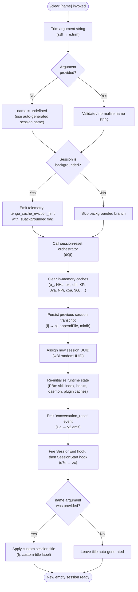

# `/clear`

> Analysis basis: CC v2.1.198 bundle.js (AST extraction + Claude interpretation)
> Minimum version: v2.1.198

---

## Overview

`/clear` starts a fresh Claude Code session by resetting the in-memory conversation context while leaving the previous session's transcript safely on disk, making it available for later recall via `/resume`. It accepts an optional name argument, is aliased as `/reset` and `/new`, and supports both interactive and non-interactive (thin-client) modes.

---

## Registration

| Field | Value |
|---|---|
| type | `local` |
| name | `clear` |
| description | `Start a new session with empty context; previous session stays on disk (resumable with /resume)` |
| argumentHint | `[name]` |
| aliases | `reset`, `new` |
| supportsNonInteractive | `true` |
| thinClientDispatch | `post-text` |
| module_id | `xBl` |
| load_inline | `true` |
| loc_byte | `11720822` |
| loc_byte_end | `11721113` |
| arbor_handler.name | `sBf` |
| arbor_handler.fqn | `claude-2.1.198::sBf` |
| arbor_handler.kind | `AsyncFunction` |
| arbor_handler.resolution_path | `module_id` |
| arbor_handler.n_hits | `0` |

Analysis basis: CC v2.1.198 bundle.js:+11720822

---

## Input Branching

The command distinguishes four behaviorally distinct paths based on the optional name argument and the backgrounded-session state, warranting a flowchart.



---

## Behavioral Spec

### Top-level handler (`sBf`)

```
async function sessionClearHandler(rawArg, context):
    trimmedArg = rawArg.trim()           // sBf → e.trim  (+11720648)
    name = trimmedArg.length > 0
             ? trimmedArg
             : undefined
    await runSessionReset(name, context) // dQt
    return                               // no return value to REPL
```

Analysis basis: CC v2.1.198 bundle.js:+11720648

---

### Session-reset orchestrator (`dQt`)

This is the heavyweight coordinator invoked by the handler. It performs the full teardown-and-reinitialise cycle.

```
async function runSessionReset(name, context):

    // 1. Snapshot & telemetry
    emitTelemetry("tengu_cache_eviction_hint", {    // +11718384
        conversationClear: "conversation_clear",     // literal +11718422
        isBackgrounded: context.isBackgrounded       // literal +11718495
    })

    // 2. Abort any active operations
    abortSignal = AbortSignal.timeout(...)           // +11718340
    activeSessions = Object.values(sessionMap)       // +11718558
    for each session in activeSessions:
        session.add(abortRef)                        // +11718610

    // 3. Flush pending transcript writes
    clearTranscriptBuffers()                         // t.clear  +11718884
    flushPendingWrites()                             // nH → RIe.delete +13810005

    // 4. Clear in-memory caches
    clearConversationCaches()                        // o_  +11718726 → iln.clear, PAr.clear
    clearHookStateCaches()                           // listed below

    // 5. Reset plugin / hook registrations
    resetAllPluginState()                            // PBo  +11718744

    // 6. Persist previous session to disk
    writeSessionTranscript()                         // fj → pj +11720095

    // 7. Generate new session identity
    newSessionId = crypto.randomUUID()               // wBl.randomUUID +11719924
    emitNewSessionEvent(newSessionId, name)          // $Ar → qcs → cln.emit

    // 8. Reinitialise runtime
    reinitialiseRuntime(context, name)               // Uq +11720391

    // 9. Fire lifecycle hooks
    fireSessionEndHook()                             // q7e → zx: "SessionEnd" +13844020
    fireSessionStartHook()                           // zx: "SessionStart" +13873708

    // 10. Emit 'conversation_reset' event for UI
    emitConversationResetEvent()                     // "conversation_reset" literal +11719885
```

Analysis basis: CC v2.1.198 bundle.js:+11718280

---

### Cache-clearing sub-routine (`o_`)

Two in-memory caches are explicitly cleared on every `/clear` invocation.

```
function clearConversationCaches():
    inlineCache.clear()    // iln.clear  +29196
    policyCache.clear()    // PAr.clear  +29208
```

Analysis basis: CC v2.1.198 bundle.js:+29196

---

### State-reset bundle (`PBo`)

A cascade of subordinate reset helpers is called as part of step 5 above.

```
function resetAllPluginState():
    clearSkillIndex()          // V0 → LW → e.clearSkillIndexCache  +13686404
    clearMCPNotificationCache()// oHa → Nq.clear  +5427920
    flushSubagentState()       // Ode → LBn (clears _U, Xpo, X5t, JWe maps)
    resetCompactState()        // NHa → Y5t.clear, Vpo.clear  +5468552
    clearMessageHistory()      // MHa / PMe  +5467460
    resetAutonomousLoopFlag()  // fAp.resetAutonomousLoopDelivered  +5487962
    clearVJt()                 // $G → vJt.clear  +11438601
    clearHookCaches()          // ohl → EKe.clear, Mko.clear  +9435933
    clearWorktreeCaches()      // oxl → KSt.clear, KYt.clear  +10666670
    clearCompletionCache()     // KPr → Cwe.clear  +1168568
    clearPipelineCache()       // Jya → p3n.clear  +5594081
    clearPermissionCache()     // NPr → l3e.clear  +1159526
    clearSkillNameCache()      // c5a → joe.clear, gPe.clear  +7584800
    resolveNewSessionPath()    // Promise.resolve  +11717603
```

Analysis basis: CC v2.1.198 bundle.js:+11717239

---

### Transcript persistence (`fj` → `pj`)

Before the session context is discarded, the previous conversation is written to disk so it can be retrieved by `/resume`.

```
function writeSessionTranscript():
    headerLine = buildTranscriptHeader()   // bv: Rg.join  +13699708
    logEntry = serialiseMessages()         // pj → Me  +13740306
    filePath = computeLogFilePath()        // pj → Rg.dirname  +13740440
    fs.mkdir(filePath, {recursive:true})   // pj → Ll.mkdir  +13740431
    fs.appendFile(filePath, logEntry)      // pj → Ll.appendFile  +13740389
    emitSessionRenamedTelemetry()          // tengu_session_renamed  +13741275

    if name != undefined:
        labelSession("custom-title", name) // literal "custom-title"  +13741183
```

Analysis basis: CC v2.1.198 bundle.js:+13741157

---

### Session lifecycle hooks (`q7e` → `zx`)

`/clear` fires a `SessionEnd` event for the old session and a `SessionStart` event for the new one, running any registered hooks for each.

```
function fireSessionLifecycleHooks():
    // End old session
    dispatchHookEvent("SessionEnd")       // literal +13844020
    runHookPipeline(hookContext)          // zx: full hook executor

    // Start new session
    dispatchHookEvent("SessionStart")     // literal +13873708
    runHookPipeline(hookContext)

    // Each hook type dispatched through unified executor zx which:
    //   - builds hook input (wKo)
    //   - filters matchers (vKo, Xmc, Zmc)
    //   - runs spawn / http / mcp / callback hooks (efr, AKo, bKo, Xpr)
    //   - collects results (Zpr, Hme)
    //   - emits telemetry: tengu_run_hook, tengu_repl_hook_finished
```

Analysis basis: CC v2.1.198 bundle.js:+13843993, +13894706

---

### Runtime reinitialisation (`Uq`)

After the new session ID is assigned, the full plugin and hook registry is rebuilt.

```
async function reinitialiseRuntime(context, name):
    // Load session settings
    rebuildSessionConfig()           // kc, wd  +3479017
    mergeGlobalConfig()              // $_, Ql, MX  +5439778

    // Plugin hooks
    if safeMode:
        skip plugin registration     // literal "Safe mode: skipping..." +5437210
    else if allowManagedHooksOnly:
        skip non-managed             // literal "Skipping plugin hooks..." +5439904
    else:
        loadPluginHooks()            // kSe → mHa  +5437271
        emitTelemetry("load_plugin_hooks")            // +5440006

    // Restore session references
    rebuildSessionList()             // V5t → Od, Zm, Jy, Ov
    assignNewConversationId()        // V5t → qpr.randomUUID  +13843438
    emitConversationResetEvent()     // y2.emit  +5441241
    reloadSkillsIfNeeded()           // hook_session_start_reload_skills +5441254
    emitAdditionalContextHook()      // hook_additional_context  +5441382
```

Analysis basis: CC v2.1.198 bundle.js:+5439728

---

## State & Side Effects

| Item | Detail |
|---|---|
| Telemetry | `tengu_cache_eviction_hint` (+11718384), `tengu_run_hook` (+13895071), `tengu_repl_hook_finished` (+13878343), `tengu_session_renamed` (+13741275), `tengu_hook_plugin_metrics` (+13872565), `tengu_hook_plugin_injected` (+13893323), `tengu_feature_ok` (+1039573), `tengu_feature_bad` (+1039640), `tengu_transcript_write_failed` (+13747333), `tengu_bg_state_read_transient` (+4355153), `tengu_shell_set_cwd` (+6839426), `tengu_mcp_skills` (+7422200), `tengu_daemon_config_reload` (+18392244), `tengu_daemon_control` (+18414881) |
| Previous session transcript | Written to disk via `fs.appendFile` + `fs.mkdir` before context is wiped; resumable with `/resume` |
| In-memory caches cleared | `iln`, `PAr`, `EKe`, `Mko`, `KSt`, `KYt`, `Cwe`, `p3n`, `l3e`, `joe`, `gPe`, `vJt`, `Y5t`, `Vpo`, `Nq` |
| Session UUID | New UUID generated via `crypto.randomUUID()` (wBl.randomUUID +11719924) |
| Lifecycle hooks fired | `SessionEnd` for old session → `SessionStart` for new session |
| Skill index cache | Cleared via `e.clearSkillIndexCache` (+13686404) and optionally reloaded (`hook_session_start_reload_skills`) |
| Active abort controllers | All running operations aborted via `AbortSignal.timeout` (+11718340) |
| Conversation event | `conversation_reset` emitted to UI layer (+11719885) |
| Custom session name | If `[name]` argument supplied, applied as `custom-title` label (+13741183) |
| Sound | <!-- TODO: not found in depth-2 traversal; needs --depth 4 --> |

---

## Version History

| Version | Change |
|---|---|
| v2.1.198 | Initial analysis |

---

## Common Mistakes

1. **Expecting context to be gone immediately** — the command is async; callers in non-interactive mode (via `thinClientDispatch: post-text`) should wait for the `conversation_reset` event before issuing follow-up commands.
2. **Confusing `/clear` with a permanent delete** — the previous session is written to disk in full. Use `/resume` to return to it; the transcript is not removed.
3. **Using `/clear` when `/compact` is intended** — `/clear` drops all context; `/compact` summarises and retains a compressed version. If the goal is to free token budget without losing history, use `/compact`.
4. **Passing a name with leading/trailing whitespace** — the argument is trimmed (Analysis basis: CC v2.1.198 bundle.js:+11720648), so `  my session  ` becomes `my session`.
5. **Assuming aliases are identical in all respects** — `/reset` and `/new` are pure aliases (same registration object); they execute the identical code path as `/clear`.

---

## Appendix — Identifier Mapping

> For bundle debugging only. Identifiers change across versions.

| Identifier | Role |
|---|---|
| `sBf` | Top-level async handler for `/clear` (arbor_handler) |
| `dQt` | Session-reset orchestrator; drives the full teardown/reinitialise cycle |
| `fQt` | Cache-eviction / context-window sizing helper |
| `$_` | Config merge utility (policy settings path) |
| `Ql` | Session config reader |
| `tue` | Policy-settings applicator |
| `U5` | Safe-mode check helper |
| `G$` | In-memory store reset coordinator |
| `$Qr` | Session state accessor (get/set via `i5i`) |
| `o_` | Clears `iln` and `PAr` in-memory caches |
| `BQr` | Hook-state reset (clears `hooks` key in config) |
| `q7e` | Session lifecycle hook dispatcher (fires SessionEnd / SessionStart) |
| `Od` | Session object constructor / accessor |
| `kt` | Logger / debug-trace utility |
| `Y1` | Alternate logger / state-write helper |
| `iv` | Model-family capability resolver |
| `sO` | Effort-level resolver (`high` default) |
| `bv` | Transcript header builder (joins path segments) |
| `Pt` | Path resolver helper |
| `E2e` | Session-end event emitter |
| `zx` | Unified hook executor pipeline |
| `i9` | Hook context initialiser |
| `T` | Low-level stream writer (write + flush) |
| `MIe` | Hook output parser |
| `wKo` | Hook input builder (constructs per-event payload) |
| `Xmc` | Hook matcher filter A |
| `vKo` | Hook source filter (third-party hooks) |
| `Zmc` | Hook matcher filter B |
| `Fn` | Formatter / template utility |
| `V` | Telemetry emit wrapper |
| `Me` | JSON serialise helper |
| `Re` | Error logger / reporter |
| `Le` | Feature-flag OK reporter |
| `jBe` | Feature-flag metrics reporter |
| `jR` | Abort-controller / timeout manager |
| `ghe` | Hook result aggregator |
| `T1` | Session-start payload builder |
| `Xpr` | Callback-type hook runner |
| `bKo` | MCP-tool hook runner |
| `Zpr` | Hook output interpreter (JSON vs plain-text) |
| `Hme` | Hook environment variable processor |
| `AKo` | HTTP-type hook runner |
| `zmc` | HTTP hook response parser |
| `gIe` | Hook input schema validator |
| `efr` | Spawn-type hook runner (forks subprocess) |
| `wje` | Hook warning emitter |
| `xe` | Feature-flag bad reporter |
| `T9` | Telemetry rate-limiter / emitter |
| `_Po` | Abort-propagation helper |
| `BLt` | Abort-timeout constant |
| `Ke` | Non-conforming session handler |
| `yr` | Backgrounded-session branch handler |
| `Um` | Background-session state reader |
| `s` | Active-session set manager (add/delete) |
| `r` | Process-exit handler |
| `As` | CLI error / forced-exit helper |
| `i` | I/O stream lifecycle manager (close) |
| `n` | Channel name normaliser |
| `f` | Path-normalise utility |
| `j8` | File path normaliser (NFC, replaceAll) |
| `Ka` | Session lock helper |
| `d` | Supervisor daemon config manager |
| `SXe` | File-stat validator (checks regular-file, size limit) |
| `en` | Error code classifier |
| `Ys` | Async-context store reader |
| `JVo` | File-read cache helper |
| `he` | String coercion utility |
| `o` | Column-format helper (padEnd) |
| `rdc` | Config diff renderer |
| `E` | SDK/SSE connection manager (stop/start/Re) |
| `$Je` | SSE stream batch processor |
| `sr` | Error-to-string converter |
| `A` | MCP server process manager (stop/start/updateConfig) |
| `FEr` | MCP server type checker |
| `UEr` | MCP server URL normaliser |
| `H` | OAuth / user-info client |
| `lQc` | Heartbeat / daemon-config reload trigger |
| `zce` | Heartbeat scheduler |
| `I` | Scrolling / viewport state manager |
| `R` | HTTP gateway request handler |
| `p` | Process-exit / abort initiator |
| `aI` | Forced-shutdown helper |
| `u` | Daemon-stop coordinator |
| `M$` | Daemon-stop event emitter |
| `l8` | Daemon-stop async race handler |
| `CE` | Countdown-display component (`padded-countdown`) |
| `f6t` | Session-name store (nmo get/set) |
| `FO` | Assistant-message usage tracker |
| `moe` | Usage-cache presence checker |
| `PBo` | Full plugin/state reset bundle |
| `xBo` | Session-reset pre-flight check |
| `V0` | Skill-index reset coordinator |
| `LW` | Skill-index cache clear + reload trigger |
| `Sor` | Session ordering reset |
| `EFl` | Feature-flag reset |
| `cVe` | Stored-state version reset |
| `oHa` | MCP notification cache clear |
| `VWe` | MCP skill-directory writer |
| `Ode` | Subagent + compact state reset bundle |
| `F5e` | Telemetry-context resetter |
| `LBn` | Subagent exit / map cleanup |
| `f5t` | Session-start telemetry emitter |
| `gxt` | Compact-label reset |
| `yxt` | Safe-mode state reset |
| `NHa` | Post-compact cache clear (Y5t, Vpo) |
| `MHa` | Message-history reset |
| `PMe` | Pending-message queue reset |
| `Qy` | Output-token counter reset |
| `ifo` | In-flight operation reset |
| `$G` | vJt cache clear |
| `ohl` | Hook-cache clear (EKe, Mko) |
| `oxl` | Worktree-cache clear (KSt, KYt) |
| `KPr` | Completion-cache clear (Cwe) |
| `vBl` | Feature-visibility reset |
| `Jya` | Pipeline-cache clear (p3n) |
| `WTr` | Watch-path has-check helper |
| `NPr` | Permission-cache clear (l3e) |
| `hja` | Stored-state helper (_8t) |
| `_8t` | qWn store get/set |
| `c5a` | Skill-name cache clear (joe, gPe) |
| `ar` | Log-line writer (sw) |
| `FH` | Working-directory setter |
| `zt` | Absolute-path validator |
| `mn` | Error-node creator |
| `NDr` | CWD normalisation (NFC via yH) |
| `yH` | Unicode-normalise (NFC) helper |
| `ite` | CWD resolution via xLt |
| `tl` | Transcript-line logger |
| `GWe` | Session-cleanup gate |
| `vT` | Volatile-timer holder |
| `nH` | Flush-and-delete transcript buffers |
| `$pr` | Pending-promise registry (add/delete via Upr) |
| `pft` | Background-task finaliser (BLa) |
| `DT` | Daemon teardown coordinator |
| `G8e` | Daemon hash-check helper |
| `cPe` | Config-hash builder |
| `oL` | MCP skills reload coordinator |
| `nt` | MCP connection lifecycle manager |
| `OBo` | Orphan-background-session cleaner |
| `Dge` | Background-session probe |
| `Zm` | Session-list initialiser |
| `eu` | process.on registration helper |
| `Si` | Signal (SIGTERM etc.) registration |
| `HL` | Session-header logger |
| `Th` | Session-title formatter |
| `i3` | Localised-time formatter |
| `pQt` | Post-clear process-on rebind |
| `$Ar` | New-UUID emitter (rte.randomUUID → qcs → cln.emit) |
| `Kcs` | UUID-creation callback |
| `qcs` | cln event emitter for new session ID |
| `qVa` | Background-queue flush |
| `FZ` | Feature-flag re-enable after clear |
| `Fea` | Background-session file state manager |
| `mE` | State-file delete helper |
| `Zi` | Background-session state read/write |
| `gd` | Error-node wrapper |
| `Gt` | JSON.parse wrapper |
| `ip` | Session-path builder |
| `Uf` | Session-file atomic write (randomBytes, copyFile, chmod) |
| `lm` | Session-file lock helper |
| `fj` | Transcript-write + session-rename coordinator |
| `pj` | Transcript append-file writer |
| `S2` | Session-name generator (yfc, N5, L9e) |
| `Pe` | Base telemetry record builder |
| `Vde` | Symlink-based session pointer manager |
| `hKo` | Session directory maker (Vv.mkdir) |
| `kje` | Session task-dir path builder |
| `Fp` | Session file-pointer path builder |
| `efm` | lstat / realpath helper |
| `DVe` | Session-open helper |
| `TT` | Subagent path builder (Upo.get, DMe.join) |
| `Gc` | Global-config accessor |
| `Zr` | Event-bus initialiser (yan, Ean, BQc, Uis) |
| `jm` | Coordinator-mode tag applicator |
| `uj` | Worktree-state event emitter (Trr.emit) |
| `Ame` | Isolation-latch reset |
| `Zd` | ENOSPC/EMFILE error classifier |
| `Uq` | Runtime reinitialisation entry point |
| `kc` | Per-session config loader |
| `wd` | Config defaults applicator |
| `MX` | Environment-variable config merger |
| `Hn` | Hook registry builder |
| `_nt` | Timestamp + debounce helper |
| `Tn` | Debounced async runner |
| `kSe` | Plugin-hook loader (safe-mode gate) |
| `V5t` | New conversation initialiser |
| `Jy` | Conversation-state accessor |
| `Ov` | Main conversation loop / agent runner |
| `l` | Telemetry flush collector |
| `Flc` | Telemetry batch sender |
| `ui` | Conversation-UUID / timestamp stamper |

---

Note: index built via Arbor fallback; some signals (telemetry, literals) may be missing — see arbor-fallback.js.