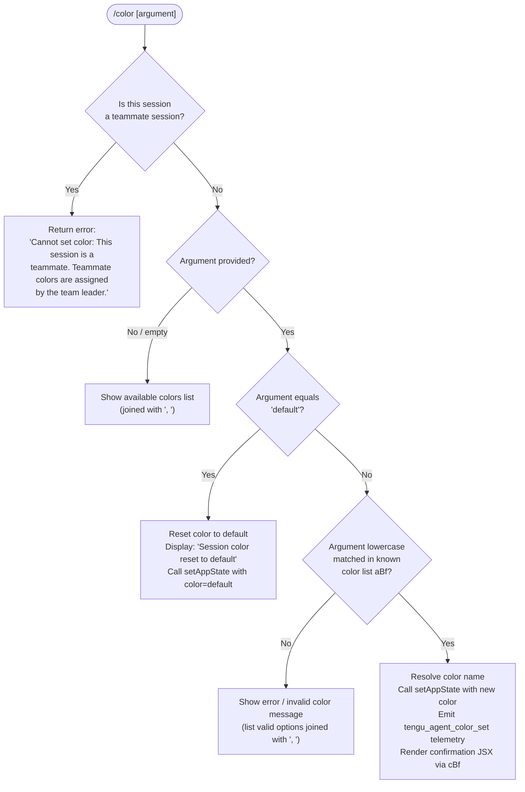

# `/color`

> Analysis basis: CC v2.1.198 bundle.js (AST extraction + Claude interpretation)
> Minimum version: v2.1.198

---

## Overview

The `/color` command sets the prompt bar color for the current Claude Code session. It accepts a named color or the keyword `default` to reset to the default appearance, and applies the change by mutating application state and emitting a telemetry event. In multi-agent (teammate) sessions the command is blocked, as colors in that context are controlled by the team leader.

---

## Registration

| Field | Value |
|---|---|
| type | `local-jsx` |
| name | `color` |
| description | `Set the prompt bar color for this session` |
| argumentHint | `null` |
| immediate | `true` |
| module_id | `DBl` |
| load_inline | `true` |
| loc_byte | `11722704` |
| loc_byte_end | `11722921` |
| loc_line | `7659` |
| arbor_handler.name | `lBf` |
| arbor_handler.fqn | `claude-2.1.198::lBf` |
| arbor_handler.kind | `AsyncFunction` |
| arbor_handler.resolution_path | `module_id` |
| arbor_handler.n_hits | `0` |

Analysis basis: CC v2.1.198 bundle.js:+11722704

---

## Input Branching

Four distinct branches exist: teammate guard, `default` reset, valid named color, and invalid/unrecognised color. A Mermaid flowchart is required.



Analysis basis: CC v2.1.198 bundle.js:+11721542 – +11722133

---

## Behavioral Spec

### Top-Level Handler (`lBf`)

The Arbor-resolved handler is `lBf` (an `AsyncFunction`). It receives the tool-call context object and immediately delegates to the core color-application function `Asr`.

```
async function colorCommandHandler(context):
    sessionContext = resolveSessionContext(context)   // _f → C0 → $6r.getStore
    return applyColorCommand(sessionContext, context)  // Asr
```

Analysis basis: CC v2.1.198 bundle.js:+11721473 – +11721481

---

### Session Context Resolution

```
function resolveSessionContext(context):
    store = getAsyncLocalStore()   // _f, C0, $6r.getStore
    return store at index 0        // literal 0 at bundle.js:+2359885
```

Analysis basis: CC v2.1.198 bundle.js:+11721542

---

### Teammate Guard

Before any color logic runs, the handler checks whether the current session is operating as a teammate. The literal error string stored at bundle.js:+11721553 is returned immediately if this check is true, preventing any state mutation.

```
function applyColorCommand(sessionCtx, context):
    if sessionCtx.isTeammate():
        return errorResult(
            "Cannot set color: This session is a teammate. " +
            "Teammate colors are assigned by the team leader."
        )
    // … continue to color resolution
```

Analysis basis: CC v2.1.198 bundle.js:+11721553

---

### Argument Normalisation and Color Lookup

The argument string is lower-cased before comparison. The command holds two arrays: the canonical color list (`aBf`) used for membership testing, and the display list (`ey`) used for the user-visible comma-separated enumeration.

```
function resolveColor(rawArgument, colorList, displayList):
    normalised = rawArgument.toLowerCase()        // bundle.js:+11721719
    if colorList.includes(normalised):            // bundle.js:+11721737
        return { valid: true, color: normalised }
    if displayList.includes(normalised):          // bundle.js:+11721761
        return { valid: true, color: normalised }
    availableColors = displayList.join(", ")      // bundle.js:+11721783, literal ", " at +11721791
    return { valid: false, suggestions: availableColors }
```

Analysis basis: CC v2.1.198 bundle.js:+11721719 – +11721791

---

### Random Color Selection (No Argument)

When the user supplies no argument (or an empty string), `Math.floor` and `Math.random` are invoked to select a random entry from the color list for display purposes (e.g., as a hint). No state change is applied in this path; the command renders the available color list instead.

```
function pickRandomColorHint(colorList):
    index = Math.floor(Math.random() * colorList.length)   // bundle.js:+11721682, +11721693
    return colorList[index]
```

Analysis basis: CC v2.1.198 bundle.js:+11721682 – +11721693

---

### Default Reset Path

When the argument equals `"default"` (literal at bundle.js:+11721881), the command resets the session color by writing `"default"` into app state and displays the confirmation string `"Session color reset to default"` (literal at bundle.js:+11722142).

```
function resetColorToDefault(context):
    context.setAppState({ color: "default" })          // bundle.js:+11721923
    display confirmationMessage("Session color reset to default")  // bundle.js:+11722142
    // No telemetry emitted on reset path (telemetry only on set path)
```

Analysis basis: CC v2.1.198 bundle.js:+11721881, +11721923, +11722142

---

### Valid Color Application

When a valid named color is matched, the handler:
1. Enumerates the known color map keys via `Esr` (which calls `Object.keys`, bundle.js:+11721246).
2. Calls `t.setAppState` with the resolved color (bundle.js:+11721923).
3. Reads back the current state via `t.getAppState` to confirm the write (bundle.js:+11721966).
4. Triggers the `mQt` rendering path, which emits `tengu_agent_color_set` telemetry (bundle.js:+13746392) and queues the JSX confirmation component via `mQt → pj → S2`.
5. Renders the result JSX using `cBf` (bundle.js:+11722133).

```
async function applyValidColor(colorName, context):
    knownKeys = getColorMapKeys()            // Esr → Object.keys
    context.setAppState({ color: colorName })
    currentState = context.getAppState()     // confirm write
    jsxNode = await renderColorConfirmation( // mQt → pj → S2
        colorName,
        context
    )
    emitTelemetry("tengu_agent_color_set")   // via V at bundle.js:+13746390
    return renderResult(jsxNode)             // cBf path
```

Analysis basis: CC v2.1.198 bundle.js:+11721912 – +11722075

---

### JSX Result Rendering (`cBf`)

`cBf` is the JSX-producing sub-function that composes the visual confirmation shown in the terminal after a color is applied or when a reset occurs. It uses several internal UI primitives (`bE`, `ime`, `ame`, `SNe`) and may resolve a promise synchronously for immediate display (literal `Promise.resolve` at bundle.js:+11722273).

```
function buildColorResultJSX(colorName, mode):
    baseElement = buildBaseElement(colorName)   // bE
    interactiveElement = buildInteractiveEl()   // ime
    // Promise.resolve for immediate scheduling  (bundle.js:+11722273)
    resultNode = buildResultNode()              // SNe, r, ame
    return resultNode
```

Analysis basis: CC v2.1.198 bundle.js:+11722133 – +11722303

---

### Color Name Formatting (System Tag)

The literal `"system"` (bundle.js:+11721499) appears in the handler context, indicating that the `/color` command's UI messages are tagged with a system-level message classification when rendered in the conversation history.

Analysis basis: CC v2.1.198 bundle.js:+11721499

---

### Agent-Color Telemetry Routing (`mQt`)

The telemetry path runs through the `mQt` function, which calls the logging subsystem (`pj`) and emits the `"agent-color"` category string (bundle.js:+13746308) alongside the `tengu_agent_color_set` event. This path also invokes `kt` and `eu` for standard session logging infrastructure.

```
async function emitAgentColorTelemetry(colorName, sessionCtx):
    logEntry = buildLogEntry("agent-color", colorName)   // literal at bundle.js:+13746308
    await writeLog(logEntry)                             // pj path
    incrementMetric("kt")
    registerExitHandler()                                // eu
    emitEvent("tengu_agent_color_set", { color: colorName }, sessionCtx)  // V, bundle.js:+13746390
```

Analysis basis: CC v2.1.198 bundle.js:+13746282 – +13746392

---

## State & Side Effects

| Item | Detail |
|---|---|
| Telemetry | `tengu_agent_color_set` (bundle.js:+13746392) — emitted on every successful named-color application; **not** emitted on default reset |
| Telemetry (indirect) | `tengu_daemon_config_reload` (bundle.js:+18392244), `tengu_feature_ok` (bundle.js:+1039573), `tengu_feature_bad` (bundle.js:+1039640), `tengu_daemon_control` (bundle.js:+18414881), `tengu_bg_state_read_transient` (bundle.js:+4355153) — reached via deep call-graph utilities; not directly triggered per invocation |
| appState changes | `setAppState({ color: <value> })` called with either the validated color name or `"default"` (bundle.js:+11721923) |
| appState read-back | `getAppState()` called after write to confirm the mutation (bundle.js:+11721966) |
| Teammate guard | Hard block with error string; no state mutation occurs (bundle.js:+11721553) |
| JSX rendering | `local-jsx` type; command produces a JSX node via `cBf`; rendered immediately (`immediate: true`) |
| File I/O (indirect) | Log append via `pj → Ll.appendFile` (bundle.js:+13740389); log directory creation via `Ll.mkdir` (bundle.js:+13740431) — standard session log infrastructure |
| Sound | None detected in depth-2 traversal |
| Hook registration | `eu → process.on("exit", ...)` (bundle.js:+13703220, +13703231) — standard exit handler registration |

---

## Version History

| Version | Change |
|---|---|
| v2.1.198 | Initial analysis |

---

## Common Mistakes

1. **Passing a color name without normalising case** — the handler calls `.toLowerCase()` on the input before lookup, so `"Red"` and `"RED"` both resolve to `"red"`. Users need not worry about casing, but scripts calling the command programmatically should be aware the stored value will always be lowercase.
2. **Using `/color` in a teammate session** — the command is completely blocked when the session role is teammate. The team leader must set the color; invoking `/color` as a teammate will return the guard error and make no change.
3. **Expecting telemetry on a default reset** — `tengu_agent_color_set` is only emitted when a named color is applied. Resetting to `"default"` produces a confirmation message but does not fire this event.
4. **Expecting an `argumentHint`** — `argumentHint` is `null` in the registration; the CLI does not display an inline placeholder hint for the argument. Users must know valid color names in advance or invoke `/color` with no argument to see the available options.
5. **Assuming synchronous state visibility** — although `setAppState` is called and `getAppState` is read back immediately, the visual prompt-bar update is driven by the JSX rendering pipeline (`local-jsx`) which may paint on the next render cycle.

---

## Appendix — Identifier Mapping

> For bundle debugging only. Identifiers change across versions.

| Identifier | Role |
|---|---|
| `lBf` | Top-level async command handler for `/color` (Arbor-resolved entry point) |
| `Asr` | Core color-application logic; performs all branching (teammate guard, default reset, valid/invalid color) |
| `_f` | Async-local-storage accessor helper |
| `C0` | Store retrieval wrapper (calls `$6r.getStore`) |
| `Esr` | Color map key enumerator (calls `Object.keys` on the color registry) |
| `cBf` | JSX result builder for color confirmation UI |
| `bE` | Base UI element builder used inside `cBf` |
| `ime` | Interactive element builder used inside `cBf` |
| `ame` | Additional result node builder used inside `cBf` |
| `mQt` | Telemetry and logging orchestrator for agent-color events |
| `bv` | Log entry formatter called by `mQt` |
| `pj` | Log write function (file append, mkdir, session log infrastructure) |
| `S2` | Log serialisation/formatting layer inside `pj` |
| `kt` | Metrics/counter increment utility |
| `Th` | Secondary message formatting/display helper |
| `eu` | Exit handler registration (wraps `process.on("exit", ...)`) |
| `Si` | Signal registration helper (wraps `sus.register`) |
| `ENn` | Background state/file resolution orchestrator |
| `dc` | Directory path builder for background state |
| `gR` | Sub-path resolver within background state directory |
| `Zi` | Background job state reader (lstat, readFile, cache management) |
| `mE` | Cache entry deletion helper for background state |
| `ip` | Atomic file-write helper for background state persistence |
| `Uf` | Safe file-write implementation (randomBytes, writeFile, copyFile, chmod) |
| `JBe` | Write-path helper used inside `Uf` |
| `lm` | Log-message dispatcher (checks cache, calls `T`, `he`, `Re`) |
| `Re` | Structured log record emitter (calls `sr`, `st`, `qi`, `jvu`) |
| `sr` | Error-to-string conversion utility |
| `qi` | Log queue accessor (`wSs`) |
| `jvu` | Log queue rotation (shift + push on `Bmn`) |
| `mS` | Basename extraction helper with metrics (`wy.basename`, `zY`, `kt`) |
| `zY` | Path utility called inside `mS` |
| `Tyt` | Terminal/display utility invoked after color resolution |
| `T` | Log-write driver (calls `o.write`, `o.flush`) |
| `Hiu` | Log destination resolver (`NF`, `$Cr`, `cus`) |
| `Oc` | Log-line formatter (redaction, slice, lastIndexOf) |
| `YZe` | Options builder for log write (`Ops`) |
| `biu` | Session runner / main-loop binder |
| `he` | String-coercion helper (wraps `String`) |
| `V` | Telemetry event emitter |
| `Me` | JSON serialisation helper (wraps `JSON.stringify`) |
| `Gt` | JSON parse helper (wraps `JSON.parse`) |
| `mn` | Error normalisation helper (wraps `en`) |
| `en` | Base error factory |
| `gd` | Error-logging helper (wraps `en`) |
| `SXe` | File stat/read pipeline (stat, isFile, size check, content read) |
| `rdc` | Column-width calculator for table rendering (`Object.keys`, `Math.max`) |
| `E` | MCP/SDK connection manager |
| `A` | Daemon/server process lifecycle manager |
| `lQc` | Heartbeat scheduler |
| `I` | Input event handler (scroll/keyboard) |
| `d` | Supervisor job runner (manages start/stop/update of daemon) |
| `u` | Daemon control dispatcher (stop, start, control events) |
| `xe` | Daemon stop handler (emits `tengu_feature_ok`) |
| `Le` | Daemon stop-failure handler (emits `tengu_feature_bad`) |
| `M$` | Daemon control emitter (emits `tengu_daemon_control`) |
| `l8` | Daemon lifecycle runner (Promise.race, process.exit) |
| `sw` | Low-level write primitive |
| `i3` | Display initialisation helper (calls `sw`) |
| `ar` | Argument renderer (calls `sw`) |
| `HL` | Header/label formatter called inside `bv` |
| `tH` | Timestamp helper used in log formatters |
| `N5` | Numeric formatting helper in log serialisation |
| `yfc` | Format-detection helper in log serialisation |
| `L9e` | App-state accessor used in log serialisation |
| `st` | String-coercion primitive (wraps `String`) |
| `o` | Output stream object (has `.write`, `.flush`, `.map`, `.padEnd`) |
| `SNe` | JSX node finaliser used inside `cBf` |

---

Note: index built via Arbor fallback; some signals (telemetry, literals) may be missing — see arbor-fallback.js.