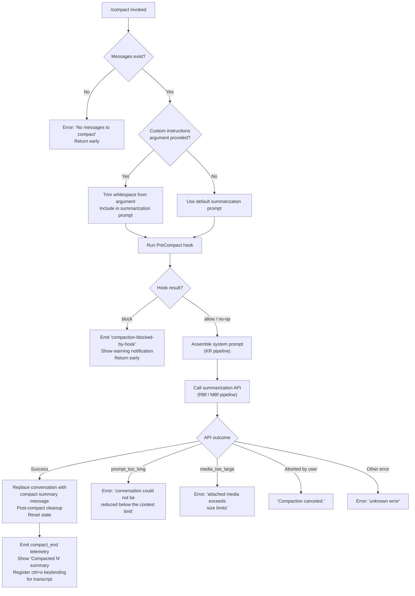

# `/compact`

> Analysis basis: CC v2.1.198 bundle.js (AST extraction + Claude interpretation)
> Minimum version: v2.1.198

---

## Overview

`/compact` frees up context window space by summarizing the current conversation into a condensed form. It invokes a multi-phase pipeline — pre-compact hook execution, system-prompt assembly, an API summarization call, and post-compact state reset — replacing the full conversation history with a compact summary message. An optional argument lets the user supply custom summarization instructions to guide the summary content.

---

## Registration

| Field | Value |
|---|---|
| type | `local` |
| name | `compact` |
| description | `Free up context by summarizing the conversation so far` |
| argumentHint | `<optional custom summarization instructions>` |
| supportsNonInteractive | `true` |
| thinClientDispatch | `post-text` |
| module_id | `g3l` |
| load_inline | `true` |
| loc_byte | `11749937` |
| loc_byte_end | `11750237` |
| loc_line | `7747` |
| arbor_handler.name | `kBf` |
| arbor_handler.fqn | `claude-2.1.198::kBf` |
| arbor_handler.kind | `AsyncFunction` |
| arbor_handler.resolution_path | `module_id` |
| arbor_handler.n_hits | `0` |

Analysis basis: CC v2.1.198 bundle.js:+11749937

---

## Input Branching

The command has 4+ distinct branches based on conversation state, argument presence, hook results, and compaction outcome.



---

## Behavioral Spec

### 1. Entry Point — Main Handler (`kBf`)

```
async function compactCommandHandler(context, userArgument):
    messageHistory = getMessageHistory(context)

    if messageHistory is empty:
        throw Error("No messages to compact")   // bundle.js:+11749425

    customInstructions = userArgument?.trim() ?? ""  // bundle.js:+11749457

    result = await runCompactPipeline(context, customInstructions)

    if result.cancelled:
        displayMessage("Compaction canceled.")  // bundle.js:+11749536

    return String(result)                       // bundle.js:+11749749
```

Analysis basis: CC v2.1.198 bundle.js:+11749394

---

### 2. Compact Progress Tracker (`RBf`)

```
async function compactProgressPipeline(context, customInstructions):
    startTime = performance.now()               // bundle.js:+11745483

    emitStatus("compact_progress")             // bundle.js:+11745346
    emitStatus("hooks_start")                  // bundle.js:+11745377

    hookResult = await runPreCompactHook(context)   // rC → GNf

    emitStatus("pre_compact")                  // bundle.js:+11745400
    emitStatus("sdk_status", "compacting")     // bundle.js:+11745462

    [contextData, hookPayload] = await Promise.all([
        buildContextPayload(context),           // jJ
        buildHookArgs(context)                  // jJ
    ])

    if hookResult.decision == "block":
        emitNotification("compaction-blocked-by-hook",
                         "compaction blocked by PreCompact hook",
                         severity="warning")    // bundle.js:+11319144 / +11319178
        return blocked

    systemPrompt = await assembleSystemPrompt(context)   // PBf → KR

    emitStatus("compact_start")                // bundle.js:+11745906
    emitMode("stream_mode", "requesting")      // bundle.js:+11745762 / +11745781

    summaryResult = await callSummarizationAPI(
        systemPrompt, contextData, customInstructions)    // MBf

    if summaryResult.error == "prompt_too_long":
        return Error("Compaction failed · conversation could not be reduced below the context limit")
        // bundle.js:+11746437

    if summaryResult.error == "media_too_large":
        return Error("Compaction failed · attached media exceeds size limits")
        // bundle.js:+11746559

    if summaryResult.aborted:
        return cancelled

    await performPostCompactCleanup(context, summaryResult)   // Ode

    resetAppState()                            // _pt → N5t.setState

    emitStatus("compact_end")                  // bundle.js:+11747312
    emitMetadata("compactMetadata", ...)       // bundle.js:+11746767

    displayCompactionSummary("Compacted " + N) // bundle.js:+11748825
    registerKeybinding("ctrl+o", "app:toggleTranscript")
    // bundle.js:+11748686 / +11748718

    return success
```

Analysis basis: CC v2.1.198 bundle.js:+11745483

---

### 3. Pre-Compact Hook Execution (`rC` → `GNf` → `Xrr`)

```
async function runPreCompactHook(context):
    hookConfigs = loadHookConfigs("PreCompact")    // bundle.js:+13839179

    if no hooks configured:
        return allow

    hookInput = buildHookInput(context)

    for each hookConfig:
        hookType = hookConfig.type    // "command", "prompt", "agent", "http", etc.

        if hookType == "command":
            result = await spawnCommandHook(hookInput)
        else if hookType == "http":
            result = await callHttpHook(hookInput)
        else if hookType == "mcp_tool":
            result = await callMcpToolHook(hookInput)
        else:
            emitWarning("hook_type_unsupported")  // bundle.js:+13896207

        if result.decision == "block":
            return block(result.reason)

    return allow
```

The hook input serialization path (`Xrr`) handles message type normalization across:
`system`, `user`, `assistant`, `api_system`, `attachment`, `teammate_mailbox`, `team_context`,
`image`, `text`, `notebook`, `pdf`, `file`, and many other message subtypes.
Analysis basis: CC v2.1.198 bundle.js:+11369465 / +11369666 / +14173605

---

### 4. System Prompt Assembly (`PBf` → `KR`)

The system prompt builder (`KR`) assembles a rich context block by invoking numerous sub-assemblers in parallel/sequence:

```
async function assembleSystemPrompt(context):
    appState = context.getAppState()

    components = await Promise.all([
        buildEnvBlock(appState),           // Vfm, qfm, Kfm
        buildMemoryBlock(appState),        // N2t
        buildToolGuidance(appState),       // amm
        buildOutputStyleBlock(appState),   // gmm, hmm
        buildContextManagement(appState),  // Zfm
        buildBgSessionBlock(appState),     // _mm
        buildScratchpad(appState),         // UZn
        buildBriefBlock(appState),         // Emm
        buildFlagSettings(appState),       // bmm
        buildTaskContinuity(appState),     // nmm, rmm
        buildAutonomyAppend(appState),     // cmm, tmm
        buildHookSettings(appState),       // GRl
        buildMemdirBlock(appState),        // x5i, m0e
        buildPaddedCountdown(appState),    // Hhc
        loadAgentSystemPrompt(appState),   // ej
    ])

    return joinComponents(components)
```

Analysis basis: CC v2.1.198 bundle.js:+11748881 / +13962864

---

### 5. Summarization API Call (`MBf`)

```
async function callSummarizationAPI(systemPrompt, contextData, customInstructions):
    startTime = performance.now()

    // Attempt precomputed compact first
    precomputed = await checkPrecomputedCompact(context)   // nfo
    if precomputed.available and not stale:
        emitTelemetry("tengu_precomputed_compact_consumed")
        return applyPrecomputed(precomputed)                // Rpt

    // If precomputed missing or discarded:
    emitTelemetry("tengu_precomputed_compact_discarded")   // bundle.js:+5486474

    // Build summarization request
    request = buildSummarizationRequest(
        systemPrompt, contextData, customInstructions)     // wBn

    // Check for miss conditions
    if not contextReady:
        emitStatus("miss_not_ready")                       // bundle.js:+11747804
        return miss

    if customInstructions missing and hooks missing:
        emitStatus("miss_custom_instructions")             // bundle.js:+11747621
        emitStatus("miss_hook")                            // bundle.js:+11747674

    // Make API call with streaming
    response = await streamSummarizationResponse(request)  // RBn pipeline

    if response.aborted:
        emitStatus("aborted")                              // bundle.js:+11747882
        return cancelled

    // Validate boundary UUID
    if boundaryUuidMissing:
        emitStatus("boundary_uuid_missing")                // bundle.js:+11748136

    return applyCompactResult(response)
```

Analysis basis: CC v2.1.198 bundle.js:+11747693

---

### 6. Context Payload Assembly (`jJ`)

```
function buildContextPayload(context):
    // Collects full conversation for summarization input
    // Filters messages by type
    // Appends tool use records
    // Builds formatted text block with padded status lines
    // Joins sections with two-space separator

    messages = filterMessages(context.messages)            // o.filter
    formatted = messages.map(m => formatMessage(m))        // s.map, a.map
    toolResults = collectToolResults(messages)              // i.push, i.join
    agentContexts = collectAgentContexts(messages)         // s.join

    return joinAll([formatted, toolResults, agentContexts])
```

Analysis basis: CC v2.1.198 bundle.js:+13839152

---

### 7. Post-Compact Cleanup (`Ode`)

```
async function postCompactCleanup(context, summaryResult):
    // 1. Cancel any in-flight streaming requests
    cancelInflightRequests()                   // LBn → _U.delete

    // 2. Unlink temp files created during compaction
    unlinkTempFiles()                          // IBn → jHa.unlink

    // 3. Clear precomputed compact caches
    clearPrecomputedCaches()                   // NHa → Y5t.clear, Vpo.clear

    // 4. Reset MHA / PME state containers
    resetStateContainers()                     // MHa, PMe

    // 5. Reset autonomous loop counters
    resetAutonomousLoopDelivered()             // fAp.resetAutonomousLoopDelivered

    // 6. Clear output token counters
    clearOutputTokens()                        // Qy → nZe, Object.values

    // 7. Write compact boundary marker
    writeBoundaryMarker("compact_boundary",
                        role="system")         // bundle.js:+14191594 / +14191572

    // 8. Append "Conversation compacted" sentinel
    appendSentinel("Conversation compacted")   // bundle.js:+14191150

    // 9. Trigger ifo (post-compact signal)
    triggerPostCompactSignal()                 // ifo
```

Analysis basis: CC v2.1.198 bundle.js:+5487825

---

### 8. Reactive Compact Sub-pipeline (`cfo` → `ABn` → `ZSp`)

The reactive compact path (triggered automatically by context pressure, not directly by the user) shares infrastructure with the manual `/compact` command:

```
async function reactiveCompact(context):
    // Pre-checks
    groups = segmentConversationIntoGroups(context)
    if groups.length < 2:
        emitStatus("too_few_groups")
        return { reason: "Reactive compact: fewer than 2 groups, nothing to compact" }
        // bundle.js:+5465055

    if no assistant messages in summarize set:
        emitStatus("exhausted")
        return { reason: "Reactive compact: no assistant messages in summarize set, bailing" }
        // bundle.js:+5465619

    // Attempt summarization
    result = await runSummarizationLoop(groups)         // ZSp

    if result.error == "media_too_large":
        // Retry with media stripped
        log("Reactive compact: summarize hit media-size error, retrying stripped")
        // bundle.js:+5466746
        result = await runSummarizationLoop(groups, stripMedia=true)
        if still fails:
            return { reason: "media_unstrippable" }

    if result.summary is empty:
        log("Reactive compact: empty summary text in summarization response")
        // bundle.js:+5464256
        return { reason: "summarization produced empty response" }

    emitTelemetry("tengu_reactive_compact_succeeded")

    return applyReactiveResult(result)
```

Analysis basis: CC v2.1.198 bundle.js:+5491510 / +5465055

---

## State & Side Effects

| Item | Detail |
|---|---|
| Telemetry | `tengu_run_hook` (hook execution), `tengu_feature_ok` / `tengu_feature_bad` / `tengu_feature_sad` (feature flag tracking), `tengu_hook_plugin_metrics`, `tengu_silent_harbor`, `tengu_slate_harrier`, `tengu_orchid_mantis_v2`, `tengu_orchid_mantis`, `tengu_memdir_disabled`, `tengu_herring_clock`, `tengu_team_memdir_disabled`, `tengu_sparrow_ledger`, `tengu_heron_brook_applied`, `tengu_heron_brook`, `tengu_amber_sextant`, `tengu_verified_vs_assumed`, `tengu_agent_memory_loaded`, `tengu_sepia_moth`, `tengu_precomputed_compact_consumed`, `tengu_precomputed_compact_discarded`, `tengu_post_compact_file_restore_success`, `tengu_post_compact_file_restore_error`, `tengu_chair_sermon`, `tengu_reactive_compact_succeeded`, `tengu_compact_credits_clamp_rescue`, `tengu_reactive_compact_attempt`, `tengu_reactive_compact_failed`, `tengu_amber_packet`, `tengu_keybinding_fallback_used` |
| Hook registration | Fires `PreCompact` hooks before summarization; result can block the compaction. Fires `PostCompact` hooks after state reset. |
| appState changes | Conversation history replaced with compacted summary message. `N5t.setState` called to push new state. Precomputed compact caches cleared. In-flight streaming aborted. Output token counters reset. Boundary marker (`compact_boundary`) written with `system` role. |
| Keybinding | `ctrl+o` registered after successful compaction to open transcript view (`app:toggleTranscript`) |
| Notification | `notification` event emitted with compaction summary text `"Compacted " + N` |
| Sound | <!-- TODO: not found in depth-2 traversal; needs --depth 4 --> |
| Files | Temp files unlinked during post-compact cleanup (`IBn → jHa.unlink`) |

---

## Version History

| Version | Change |
|---|---|
| v2.1.198 | Initial analysis |

---

## Common Mistakes

1. **Calling `/compact` on an empty session**: The handler throws immediately with `"No messages to compact"` if the message history is empty. There is no graceful fallback or partial compaction.

2. **Expecting PreCompact hooks to be purely advisory**: A `PreCompact` hook returning a `block` decision will abort the entire compaction silently from the user's perspective (only a `warning` notification is shown). If compaction appears to do nothing, check hook configurations.

3. **Assuming custom instructions fully replace the summarization prompt**: The `<optional custom summarization instructions>` argument is appended as additional guidance; it does not replace the built-in summarization prompt structure assembled by the `KR` system-prompt pipeline.

4. **Confusing reactive compaction with manual `/compact`**: Reactive compaction runs automatically when context pressure thresholds are met and uses a grouped-segment algorithm. Manual `/compact` always summarizes the full available history. They share infrastructure but have different entry conditions.

5. **Expecting conversation history to persist post-compaction**: After `/compact` succeeds, the full conversation is replaced by the summary. All prior tool results, file reads, and assistant reasoning that were not captured in the summary are gone from the model's context.

6. **Using `/compact` when attached media is very large**: If media in the conversation exceeds size limits, compaction fails with `"Compaction failed · attached media exceeds size limits"`. Remove large attachments before compacting.

---

## Appendix — Identifier Mapping

> For bundle debugging only. Identifiers change across versions.

| Identifier | Role |
|---|---|
| `kBf` | Main handler for `/compact` command (AsyncFunction) |
| `RBf` | Compact progress pipeline orchestrator |
| `MBf` | Summarization API call coordinator |
| `PBf` | System prompt assembly coordinator |
| `KR` | System prompt builder (assembles all context components) |
| `jJ` | Context payload builder for summarization input |
| `zx` | Hook execution engine (runs individual hook instances) |
| `Xrr` | Message normalizer for hook input serialization |
| `GNf` | Pre-compact hook loader and dispatcher |
| `JRe` | Hook type classifier |
| `rC` | Pre-compact hook runner |
| `Ode` | Post-compact cleanup orchestrator |
| `LBn` | In-flight request canceller |
| `IBn` | Temp file unlinker |
| `NHa` | Precomputed compact cache clearer |
| `cfo` | Reactive compact outer loop |
| `ABn` | Reactive compact group summarizer |
| `ZSp` | Core reactive summarization loop (makes API call) |
| `K5t` | Conversation group extractor |
| `wg` | Message list slicer / boundary finder |
| `lsr` | Message sequence helper |
| `EE` | Token counter utility |
| `nfo` | Precomputed compact cache reader |
| `Rpt` | Precomputed compact applicator |
| `wBn` | Summarization request builder |
| `ofo` | Boundary index finder in message history |
| `RBn` | Full summarization request/response pipeline |
| `FMe` | Summarization result formatter |
| `mAp` | Post-compact state applicator |
| `Uq` | Hook loader (loads plugin and settings-file hooks) |
| `DBn` | Post-compact file restorer |
| `UBn` | AppState values collector for post-compact |
| `efr` | Command/script hook executor (spawns subprocess) |
| `AKo` | HTTP hook executor |
| `bKo` | MCP tool hook executor |
| `Zpr` | Hook output parser (JSON or plain text) |
| `zmc` | HTTP hook response body parser |
| `Hme` | Hook plugin metrics recorder |
| `Re` | Error logger for hook failures |
| `Le` | Feature-ok telemetry emitter |
| `xe` | Feature-bad telemetry emitter |
| `St` | Feature-sad telemetry emitter |
| `jBe` | Feature flag guard |
| `jR` | Hook timeout / abort controller |
| `T9` | Telemetry event emitter |
| `Vfm` | Environment info block builder |
| `qfm` | Confirmation guidance block builder |
| `Kfm` | Fable identity block builder |
| `N2t` | Memory (CLAUDE.md) loader and formatter |
| `amm` | Tool usage guidance block builder |
| `gmm` | Output style block builder (env_info_static) |
| `hmm` | Output style block builder (env_info_simple) |
| `Zfm` | Context management block builder |
| `_mm` | Background-session block builder |
| `UZn` | Scratchpad block builder |
| `Emm` | Brief mode block builder |
| `bmm` | Flag settings block builder |
| `nmm` | Task continuity block builder |
| `rmm` | Reproduce/verify workflow block builder |
| `omm` | Auto-mode guidance block builder |
| `smm` | Session-specific memory block builder |
| `lmm` | Tone-and-style block builder |
| `cmm` | Autonomy append block builder |
| `tmm` | Act-dont-rederive block builder |
| `GRl` | Hook settings block builder |
| `x5i` | Memdir loader |
| `m0e` | Model provider block builder |
| `Hhc` | Padded countdown display builder |
| `Ur` | AppState reader (working_directory, allowed_tools, etc.) |
| `ej` | Agent system prompt loader |
| `Mrr` | Allowed-tools block builder |
| `Drr` | Disallowed-tools block builder |
| `dR` | Bypass-permissions resolver |
| `zKo` | Context efficiency / compact-mode selector |
| `Tmm` | Context-mode orchestrator wrapper |
| `tz` | Lazy loader helper |
| `Lr` | Module export resolver |
| `so` | Model capability checker |
| `_or` | Tool registry value extractor |
| `nt` | Instruction/memory file reader |
| `_pt` | App state setter (`N5t.setState`) |
| `DBf` | Compaction UI display builder |
| `fze` | Model display name resolver |
| `hSf` | Model alias table (opus, sonnet, etc.) |
| `pv` | Keybinding action dispatcher |
| `mRe` | OTEL metrics emitter for compaction |
| `su` | OTEL metrics base emitter |
| `IGe` | OTEL resource attribute builder |
| `Nae` | Post-compact notification helper |
| `he` | String coercion helper |
| `Qm` | AppState getter (for reactive compact) |
| `cR` | Model capability pair (iv + sO) |
| `iv` | Extended thinking capability checker |
| `sO` | Effort-level capability checker |
| `vHa` | Token budget math helper (max/floor) |
| `eAp` | Budget redistribution helper |
| `Jdt` | Cancel-reason classifier |
| `PH` | AbortError type checker |
| `z9` | Path/content sanitizer pipeline |
| `Qy` | Output token counter resetter |
| `ifo` | Post-compact signal trigger |
| `ui` | Message UUID stamper |
| `vf` | Token counting utility (Math.round) |
| `TR` | Message turn renderer / formatter |
| `BEp` | Token usage tracker |
| `tBn` | Token accounting pipeline |
| `nBn` | Token rounding helper |
| `S5t` | Context size calculator |
| `_do` | Max-context resolver |
| `f5t` | Temp file path generator |
| `gx` | Temp file writer |
| `yxt` | File write helper (sw + wae) |
| `gxt` | Temp file cleanup helper |
| `MHa` | State container resetter |
| `PMe` | State container pair resetter |
| `fdo` | Reactive compact abort handler |
| `v7e` | Ypr/Kpr filter (Anthropic message filter) |
| `ufo` | Tool result formatter for summarization |
| `VJ` | Tool type tagger |
| `MNf` | Array tool type checker |
| `RNf` | Tool result validator |
| `Nde` | MCP server hook registry drainer |
| `Dpt` | Process exit hook registrar |
| `eu` | Process-on wrapper |
| `Z5t` | UUID generator wrapper |
| `DSe` | Post-compact display state resettor |
| `UMe` | Tool permission set manager |
| `eje` | Tool display event pusher |
| `VWe` | Plugin cache writer |
| `F5t` | Plugin hook file loader |
| `lBn` | Plugin hook path validator |
| `WJ` | Plugin hook executor wrapper |
| `Xga` | Plugin script runner |
| `GWe` | Plugin hook filter |
| `wma` | Model name normalizer |
| `Ry` | Model display string builder |
| `hoe` | Model suffix slicer |
| `d5t` | Header entry converter |
| `sZe` | Session metadata tagger |
| `MSe` | Compact metadata recorder |
| `Fn` | Module `t` reference |
| `V` | Feature-ok event builder |
| `Pe` | Feature-bad event builder |
| `Ke` | Feature-sad event builder |
| `Me` | JSON stringify wrapper |
| `Do` | OQe event emitter |
| `qg` | Telemetry queue helper |
| `T` | Output stream writer (debug/verbose) |
| `jKo` | System prompt section key constant (`:L`) |
| `Nx` | Send-user-msg constant (`:send_user_msg`) |