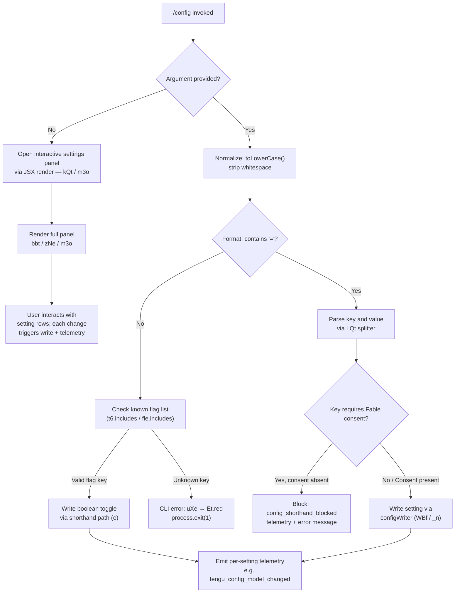

# `/config`

> Analysis basis: CC v2.1.198 bundle.js (AST extraction + Claude interpretation)
> Minimum version: v2.1.198

---

## Overview

`/config` (aliased as `/settings`) opens an interactive settings panel that allows users to inspect and modify Claude Code's configuration options. When invoked with a `key=value` argument, it performs a direct shorthand write to a specific setting, bypassing the interactive UI. It renders a JSX-based full-screen configuration panel and dispatches telemetry events for every setting change.

---

## Registration

| Field | Value |
|---|---|
| type | `local-jsx` |
| name | `config` |
| description | `Open settings` |
| aliases | `["settings"]` |
| argumentHint | `[key=value]` |
| module_id | `T5l` |
| load_inline | `true` |
| loc_byte | `11991613` |
| loc_byte_end | `11991891` |
| loc_line | `7843` |
| arbor_handler.name | `T5f` |
| arbor_handler.fqn | `claude-2.1.198::T5f` |
| arbor_handler.kind | `AsyncFunction` |
| arbor_handler.resolution_path | `module_id` |
| arbor_handler.n_hits | `0` |

Analysis basis: CC v2.1.198 bundle.js:+11991613

---

## Input Branching

The handler (`T5f`) has 4+ distinct branches based on presence, format, and validity of the `[key=value]` argument, plus whether the interactive panel or shorthand write path is taken.



---

## Behavioral Spec

### 1. Handler Entry — Argument Detection and Normalization

The async handler `T5f` begins by examining the raw argument string.

```
async function configCommandHandler(args, appContext):
    rawArg = args.trim()

    if rawArg is empty:
        return openInteractivePanel(appContext)

    normalizedArg = rawArg.toLowerCase()

    if knownFlagList.includes(normalizedArg) OR secondaryFlagList.includes(normalizedArg):
        return writeShorthandBoolean(normalizedArg, appContext)

    if normalizedArg.includes("="):
        return parseAndWriteKeyValue(normalizedArg, appContext)

    // Fallback: unrecognized key with no '='
    return reportCliError("unrecognized config key")
```

Analysis basis: CC v2.1.198 bundle.js:+11990746 (toLowerCase), +11990765 (flag check), +11990781 (secondary flag check), +11990798 (shorthand write branch)

---

### 2. CLI Error Reporter

When the key cannot be resolved the error reporter (`uXe`) prints in red and exits.

```
function reportCliError(message):
    console.error(Et.red(message))
    // telemetry: "cli_error" literal (bundle.js:+13219803)
    writeErrorFile(fI)           // Bae.writeFileSync, kCr.join
    process.exit(1)              // bundle.js:+13219816
```

Analysis basis: CC v2.1.198 bundle.js:+13219793 (uXe), +13219803 (cli_error literal), +13219816 (process.exit)

---

### 3. Key-Value Argument Parser (`LQt`)

The `LQt` function tokenizes the `key=value` shorthand argument.

```
function parseKeyValue(input):
    trimmed = input.trim()

    if not trimmed.includes("="):
        return null    // caller handles missing '='

    eqIndex  = trimmed.indexOf("=")
    key      = trimmed.slice(0, eqIndex)
    rest     = trimmed.slice(eqIndex + 1)

    valueList = rest.split(",").map(v => v.trim()).filter(Boolean)

    // Check for multiple assignments (comma-separated values)
    if valueList.length > 1:
        return { key, values: valueList, multi: true }

    return { key, value: valueList[0] ?? "", multi: false }
```

Analysis basis: CC v2.1.198 bundle.js:+11787269 (trim), +11787286 (includes check), +11787320 (split), +11787376 (indexOf), +11787393 (slice key), +11787549 (slice value)

---

### 4. Interactive Panel Renderer (`kQt` → `bbt` → `m3o`)

When no argument is provided the command renders the settings panel.

```
function openInteractivePanel(appContext):
    appState = appContext.getAppState()    // m3o: +11790410

    // Initialise section list — bbt flattens all setting rows
    sections = buildSettingSections(appState)   // zNe, bbt flat-map

    // Apply app-state guards (workflows disabled, artifact disabled, etc.)
    // bundle.js:+11790446 (disableWorkflows), +11790474 (enableWorkflows)

    renderJsx(u9o.jsx, { sections, appState })   // T5f → u9o.jsx: +11990685

    // Panel stays open; each row interaction calls a per-setting writer
    // and emits the corresponding tengu_* event
```

Analysis basis: CC v2.1.198 bundle.js:+11789108 (kQt → bbt), +11790410 (getAppState), +11990685 (JSX render call)

---

### 5. Settings Section Builder (`bbt` / `zNe`)

`bbt` aggregates every configurable setting row. `zNe` handles model-tier display logic.

```
function buildSettingSections(appState):
    rows = []

    // Model selection — zNe
    modelRow = buildModelRow(appState)   // zNe: includes opus-4-6, sonnet-4-6 literals
    rows.push(modelRow)

    // Feature toggles (representative list derived from literals):
    rows.push(settingRow("thinking",            "Thinking mode",           "thinking_toggle"))
    rows.push(settingRow("tips",                "Show tips"))
    rows.push(settingRow("reduceMotion",        "Reduce motion"))
    rows.push(settingRow("autoCompact",         "Auto-compact"))
    rows.push(settingRow("autoCompactEnabled",  flag))
    rows.push(settingRow("promptSuggestionEnabled", "Prompt suggestions"))
    rows.push(settingRow("recap",               "Session recap"))
    rows.push(settingRow("checkpoints",         "Rewind code (checkpoints)"))
    rows.push(settingRow("fileCheckpointingEnabled", flag))
    rows.push(settingRow("workflows",           "Dynamic workflows"))
    rows.push(settingRow("artifacts",           "Artifacts"))
    rows.push(settingRow("verbose",             "Verbose output"))
    rows.push(settingRow("progressBar",         "Terminal progress bar"))
    rows.push(settingRow("showStatusInTerminalTab", "Show status in terminal tab"))
    rows.push(settingRow("turnDuration",        "Show turn duration"))
    rows.push(settingRow("timestamps",          "Show message timestamps"))
    rows.push(settingRow("permissionMode",      "Default permission mode",
                         enum=["default","plan","bypassPermissions","auto"]))
    rows.push(settingRow("theme",               "Theme"))
    rows.push(settingRow("notifChannel",        "Notifications"))
    rows.push(settingRow("outputStyle",         "Output style"))
    rows.push(settingRow("defaultView",         "Default view",
                         enum=["transcript","chat"]))
    rows.push(settingRow("language",            "Language"))
    rows.push(settingRow("editor",              "Editor mode",
                         enum=["emacs","normal","vim"]))
    rows.push(settingRow("diffTool",            "Diff tool"))
    rows.push(settingRow("autoConnectIde",      "Auto-connect to IDE"))
    rows.push(settingRow("autoInstallIdeExtension", "Auto-install IDE extension"))
    rows.push(settingRow("chrome",              "Claude in Chrome"))
    rows.push(settingRow("teammateMode",        "Teammate mode"))
    rows.push(settingRow("remoteControl",       "Enable Remote Control"))
    rows.push(settingRow("gitignore",           "Respect .gitignore in file picker"))
    rows.push(settingRow("copyOnSelect",        "Copy on select"))
    rows.push(settingRow("autoScroll",          "Auto-scroll"))
    rows.push(settingRow("agentsView",          "Agents view"))
    rows.push(settingRow("autoUpdatesChannel",  "Auto-update channel",
                         enum=["rc","slow","latest"]))
    rows.push(settingRow("apiKey",              "Use custom API key"))
    rows.push(settingRow("externalEditorContext","Show last response in external editor"))
    rows.push(settingRow("prStatus",            "Show PR status footer"))
    rows.push(settingRow("precomputeCompactionEnabled", "Precompute compaction"))
    rows.push(settingRow("showExternalIncludesDialog", "External CLAUDE.md includes"))
    rows.push(settingRow("worktreeBaseRef",     "Worktree base ref",
                         enum=["fresh","head"]))
    rows.push(settingRow("useAutoModeDuringPlan","Use auto mode during plan"))
    rows.push(settingRow("switchModelsOnFlag",  flag))
    rows.push(settingRow("leftArrowOpensAgents", flag))
    rows.push(settingRow("defaultToAgentsView", "Open agents view by default"))
    rows.push(settingRow("copyFullResponse",    "Skip the /copy picker"))
    rows.push(settingRow("agentPushNotifEnabled", flag))

    return rows
```

Analysis basis: CC v2.1.198 bundle.js:+11770623 (bbt → V), +11757438 (zNe → Eo), +11770833 (bbt → zNe), various literal locations cited in literals array.

---

### 6. Config Write Path (`_n` / `Onn` / `Kfr`)

When a setting value is committed (interactive or shorthand), the config writer performs a safe atomic write.

```
async function writeConfigSetting(key, value, scope):
    // scope: "userSettings" | "projectSettings" | "localSettings" | "policySettings"
    // bundle.js:+1366050, +1366072, +1366694, +1366809, +1366832

    existingConfig = readConfigFromDisk()     // _n → H0 → zt

    updatedConfig  = mergeKeyValue(existingConfig, key, value)

    // Guard: do not wipe auth fields — bundle.js:+14256127
    if existingConfig.hasAuth AND NOT updatedConfig.hasAuth:
        log("saveConfigWithLock: refusing to write — auth loss prevention")
        emit("tengu_config_auth_loss_prevented")   // +14256279
        return

    acquireLock()    // Onn: s.mkdirSync for lock dir

    // Lock contention warning — bundle.js:+14255347
    if lockWaitMs > 100:
        emit("tengu_config_lock_contention")       // +14255436

    atomicWriteFile(updatedConfig)   // BMt: writeFileSync, fchmodSync, fsyncSync, renameSync
    releaseLock()
```

Analysis basis: CC v2.1.198 bundle.js:+14251949 (_n → Onn), +14256127 (auth-loss guard), +14255436 (lock contention telemetry), +14254873 (Kfr → BMt)

---

### 7. Model Row and Model-Change Logic (`zNe` / `V` / `BZ`)

```
function buildModelRow(appState):
    currentModel   = appState.model
    modelDisplay   = normalizeModelDisplay(currentModel)    // zNe: toLowerCase, +11757480

    // Available tiers include literals: "opus-4-6", "sonnet-4-6"
    // Special annotations: " · Draws from usage credits" (+11770848)
    //                      " · this session only — /model to set up" (+11770888)

    return {
        key:     "model",
        label:   "Model",
        value:   modelDisplay,
        options: buildModelOptions(appState),   // BZ → cb → Fo
        onChange: (newModel) => {
            writeConfigSetting("model", newModel, "userSettings")
            emit("tengu_config_model_changed")   // +11770625
        }
    }
```

Analysis basis: CC v2.1.198 bundle.js:+11770625 (telemetry), +11770687 (BZ), +11757438 (zNe), +11770848 (credits annotation literal)

---

### 8. Fable Model Consent Guard

When the shorthand argument targets a model tier that requires Fable/usage-credits consent, the handler blocks and reports.

```
function checkFableConsent(key, value, appState):
    if key == "model" AND isFableTier(value):
        if NOT appState.hasFableConsent:
            emitTelemetry("config_shorthand_blocked")     // +11782496
            // message literal: "needs usage-credits consent — run /model first"
            //                   bundle.js:+11782537
            return BLOCKED
    return ALLOWED
```

Analysis basis: CC v2.1.198 bundle.js:+11782474 (model_fable_consent), +11782496 (config_shorthand_blocked), +11782537 (error message literal)

---

### 9. Settings Persistence Layer — File Paths

The settings module (`m6`) resolves canonical paths:

- User settings: `.claude/settings.json` (bundle.js:+1346416, +1346426)
- Local settings: `.claude/settings.local.json` (bundle.js:+1346488)

Analysis basis: CC v2.1.198 bundle.js:+1346408 (m6 → gN.join), +1346416 (".claude" literal), +1346426 ("settings.json" literal), +1346488 ("settings.local.json" literal)

---

## State & Side Effects

| Item | Detail |
|---|---|
| Telemetry — model | `tengu_config_model_changed` (+11770625) |
| Telemetry — push notifications | `tengu_push_notif_pref_changed` (+11771401) |
| Telemetry — auto-compact | `tengu_auto_compact_setting_changed` (+11771839) |
| Telemetry — refusal fallback | `tengu_refusal_fallback_setting_changed` (+11772077) |
| Telemetry — tips | `tengu_tips_setting_changed` (+11772308) |
| Telemetry — reduce motion | `tengu_reduce_motion_setting_changed` (+11772606) |
| Telemetry — thinking | `tengu_thinking_toggled` (+11772827) |
| Telemetry — fast mode | `tengu_penguins_off` (+2306584), `tengu_chomp_inflection` (+11773268) |
| Telemetry — session recap | `tengu_sedge_lantern` (+11773502) |
| Telemetry — checkpoints | `tengu_file_history_snapshots_setting_changed` (+11773939) |
| Telemetry — verbose / YNe | `tengu_maple_sundial` (+11768471) |
| Telemetry — progress bar | `tengu_terminal_progress_bar_setting_changed` (+11775231) |
| Telemetry — terminal sidebar | `tengu_terminal_sidebar` (+11775298) |
| Telemetry — terminal tab status | `tengu_terminal_tab_status_setting_changed` (+11775546) |
| Telemetry — turn duration | `tengu_show_turn_duration_setting_changed` (+11775770) |
| Telemetry — precompute compaction | `tengu_precompute_compaction_setting_changed` (+11776090) |
| Telemetry — message timestamps | `tengu_show_message_timestamps_setting_changed` (+11776405) |
| Telemetry — gitignore | `tengu_respect_gitignore_setting_changed` (+11778096) |
| Telemetry — default view | `tengu_default_view_setting_changed` (+11780991) |
| Telemetry — editor mode | `tengu_editor_mode_changed` (+11781580) |
| Telemetry — external editor | `tengu_external_editor_context_changed` (+11781895) |
| Telemetry — PR status | `tengu_pr_status_footer_setting_changed` (+11782209) |
| Telemetry — diff tool | `tengu_diff_tool_changed` (+11782782) |
| Telemetry — auto-connect IDE | `tengu_auto_connect_ide_changed` (+11783054) |
| Telemetry — auto-install IDE ext | `tengu_auto_install_ide_extension_changed` (+11783358) |
| Telemetry — Claude in Chrome | `tengu_claude_in_chrome_setting_changed` (+11783694) |
| Telemetry — teammate mode | `tengu_teammate_mode_changed` (+11784090) |
| Telemetry — config lock | `tengu_config_lock_contention` (+14255436), `tengu_config_stale_write` (+14255572), `tengu_config_auto_repaired` (+14255949), `tengu_config_auth_loss_prevented` (+14256279), `tengu_config_fallback_write` (+14255052) |
| Telemetry — feature flags | `tengu_feature_ok` (+1039573), `tengu_feature_sad` (+1039721), `tengu_feature_bad` (+1039640) |
| Telemetry — sepia/silk/amber | `tengu_sepia_moth` (+11775834), `tengu_silk_hinge` (+11776161), `tengu_amber_creek` (+3610207), `tengu_pewter_brook` (+3610114), `tengu_amber_flint` (+8063801) |
| Config file writes | Atomic write via `writeFileSync` → `fchmodSync` → `fsyncSync` → `renameSync` (BMt); lock via `mkdirSync` (Onn) |
| Auth-loss guard | Refuses to overwrite config if auth fields would be lost (Onn/Kfr, +14256127) |
| appState changes | `e.setAppState` called after successful interactive setting change (+11791429) |
| JSX render | `u9o.jsx` rendered as full-screen panel (+11990685) |
| Cache clearing | `iln.clear` and `PAr.clear` called on settings reload (`o_`, +29196, +29208) |
| Sound / motion | No sound effects; `reduceMotion` setting controls UI animation |

---

## Version History

| Version | Change |
|---|---|
| v2.1.198 | Initial analysis |

---

## Common Mistakes

1. **Omitting the `=` sign in shorthand writes** — `/config verbose` (no `=`) is interpreted as a flag lookup, not a key-value write; use `/config verbose=true` instead.
2. **Attempting to set a Fable/usage-credits model tier via shorthand without prior consent** — the handler blocks with `config_shorthand_blocked` and instructs the user to run `/model` first (bundle.js:+11782537).
3. **Expecting `/config` to reflect policy-managed settings** — `policySettings` values are read-only; writes to managed keys are silently ineffective (`write_ineffective`, +1367139).
4. **Confusion between `/config` and `/settings`** — both aliases are fully equivalent (registration `aliases: ["settings"]`).
5. **Concurrent Claude instances** — if another Claude instance holds the config lock, a `tengu_config_lock_contention` event fires and a warning is logged; the write still proceeds after the lock is acquired.
6. **Using a bare key without `=` for non-boolean settings** — only the two flag lists (`t6`, `fle`) support the bare-key form; all other keys require `key=value` syntax.

---

## Appendix — Identifier Mapping

> For bundle debugging only. Identifiers change across versions.

| Identifier | Role |
|---|---|
| `T5f` | Main async handler for `/config` command (arbor_handler) |
| `r` | Raw argument string / intermediate variable |
| `As` | CLI error dispatch wrapper |
| `uXe` | Error printer (red-colored stderr output) |
| `fI` | Error file writer (writeFileSync + path join) |
| `e` | Shorthand boolean write function |
| `kQt` | Interactive panel launcher; delegates to `bbt` and `m3o` |
| `bbt` | Large settings panel builder; aggregates all setting rows |
| `V` | State-read utility used throughout settings |
| `BZ` | Model-option builder; delegates to `cb` and `Fo` |
| `cb` | Model-list constructor |
| `Fo` | Model normalization and display resolver |
| `b5t` | Secondary model/type helper |
| `eo` | Settings loader / writer core (loads all scopes) |
| `Oh` | Settings scope reader |
| `zt` | File-existence / stat utility |
| `h1r` | Per-file settings reader |
| `x3` | Settings object merger / loader |
| `Nk` | Settings validation helper |
| `mn` | ENOENT handler for missing settings files |
| `T` | Terminal output writer |
| `HOr` | Timestamp tracker (Map.set / Date.now) |
| `I3e` | Settings object initializer |
| `BMt` | Atomic file writer (writeFileSync → fchmodSync → fsyncSync → renameSync) |
| `Me` | JSON serializer (JSON.stringify) |
| `o_` | Cache clearer (iln.clear, PAr.clear) |
| `Fgn` | gitignore / excludes-file tracker |
| `m6` | Settings file path resolver (`.claude/settings.json`) |
| `ar` | Utility helper (sw delegate) |
| `xe` | Feature-flag OK emitter (`tengu_feature_ok`) |
| `St` | Feature-flag SAD emitter (`tengu_feature_sad`) |
| `Le` | Feature-flag BAD emitter (`tengu_feature_bad`) |
| `X8` | Settings-from-disk loader entry |
| `Re` | Error logger with push to error list |
| `kae` | Model annotation builder |
| `I` | Scroll / math helper for panel rendering |
| `R` | HTTP request handler (OAuth/gateway — reached transitively) |
| `A` | OAuth userinfo fetch |
| `x` | Cookie / header splitter |
| `k` | File-watcher / interval manager |
| `N` | Background worker scheduler / sweep loop |
| `$3` | Config-panel section composer |
| `Eo` | Enum option builder |
| `YIn` | Setting-row renderer with label/hint |
| `IH` | Setting-row input handler |
| `zNe` | Model-row builder (shows opus-4-6, sonnet-4-6 options) |
| `o` | Column-padding formatter |
| `Hh` | Model fast-mode availability checker |
| `k6` | Model-list cache reader |
| `g2` | Model first-party classifier |
| `ASe` | Model availability loader |
| `xde` | Model type discriminator |
| `hg` | Model display-name builder |
| `iT` | Setting item type renderer |
| `b_e` | Setting base component |
| `I_e` | Setting item icon/indicator |
| `mr` | API-provider resolver (gateway/bedrock/foundry etc.) |
| `Di` | Setting item display component |
| `Ow` | Settings panel orchestrator (wraps `eo`) |
| `L` | Away-summary / session tracking loop |
| `E7e` | App-state reader (iz.getState) |
| `F7t` | Background workflow tracker |
| `y` | State-atom reader |
| `tMe` | Loop/compaction state reader |
| `CFm` | Away-summary system-message builder |
| `w2c` | Conversation tail accessor |
| `L2c` | Conversation message classifier |
| `v` | Generic value holder |
| `sVt` | Away-summary generator |
| `LHc` | UUID generator (randomUUID) |
| `i3o` | Notification-preference patch sender |
| `D3l` | Notification panel renderer |
| `WBf` | Notification preference writer (_s.patch) |
| `Ke` | Singleton component factory |
| `OQe` | Singleton implementation |
| `v2n` | Feature-flag value writer |
| `FJ` | Flag-store writer |
| `w` | Blur/focus window state tracker |
| `ire` | Window-state event listener |
| `lc` | Label/style component |
| `st` | Styled-string builder |
| `YL` | Setting-list section component |
| `Yle` | Setting-list item full renderer |
| `C6` | Checkbox / toggle component |
| `dxe` | Divider / section-separator component |
| `y9e` | Setting-item value renderer |
| `nt` | Notification dispatcher |
| `n2t` | Notification type builder |
| `r2t` | Notification payload builder |
| `tG` | Notification gate |
| `aMn` | Notification dedup tracker |
| `Dt` | Daemon/config-change broadcaster |
| `hQr` | Hotkey row builder |
| `gQr` | Hotkey data source |
| `W$n` | Section header component |
| `Hn` | Horizontal row / layout component |
| `J4t` | Artifact setting row |
| `Sbt` | Verbose-setting row |
| `YNe` | Verbose notification handler |
| `_n` | Global config save entry (`saveGlobalConfig`) |
| `Onn` | Atomic config save with lock (`saveConfigWithLock`) |
| `TFe` | Config type validator |
| `b7o` | Config entry iterator |
| `Dnn` | Config timestamp recorder |
| `Mnn` | Config state accessor |
| `ACt` | Config application handler |
| `Kfr` | Config save with merge logic |
| `j` | Output write queue |
| `P` | Write-queue processor |
| `d` | Daemon write stream |
| `U` | Abort / shutdown signal handler |
| `Tn` | Push-notification sender |
| `O` | HTTP response builder |
| `AR` | Abort-reason recorder |
| `Ti` | API call executor with timeout/retry |
| `fN` | Feature flag inclusion checker |
| `Mnt` | Managed-enum validator |
| `VL` | Notification-channel validator |
| `mHn` | Notification-channel map |
| `lVt` | Permission-mode row builder |
| `Kj` | Permission-rule enumerator |
| `Afr` | Permission-rule detail builder |
| `c3` | Permission-mode component |
| `OIe` | Output-style option builder |
| `Ws` | Fullscreen/UI-mode setting handler |
| `NP` | Local-agent capability checker |
| `rD` | Remote-feature flag reader |
| `zZr` | Fullscreen-disabled message builder |
| `dre` | Flicker-override message builder |
| `KZr` | Fullscreen toggle builder |
| `Lr` | Settings-from-disk loader (X8 wrapper) |
| `Z8d` | Notification-scope writer |
| `ov` | Workflow event emitter |
| `jat` | Workflow allow-event dispatcher |
| `hNe` | Workflow-enable row handler |
| `Qi` | Workflow quiet-notification helper |
| `kc` | Safe-mode / bare-mode CLI flag checker |
| `Ql` | Safe-mode row renderer |
| `wd` | Bare-mode row renderer |
| `oG` | Option-string prefix stripper |
| `l3o` | Language setting row |
| `O$n` | Kairos input-needed push handler |
| `wge` | Setting write-guard (policy check) |
| `Pe` | Setting row component |
| `U3l` | Model-selection panel section |
| `S_e` | Model-section header |
| `t3o` | Sonnet model row builder |
| `n3o` | Custom model-id row builder |
| `nl` | Model-option list renderer |
| `il` | Agent-teams mode row builder |
| `eqp` | Agent-teams flag reader |
| `pIo` | Preview/beta setting row |
| `fIo` | Feature preview renderer |
| `tXt` | Teammate-model row |
| `Msr` | Teammate-default-model composer |
| `nXt` | Teammate model API-provider resolver |
| `Fv` | Remote-control setting section |
| `Ufr` | Remote-control availability reader |
| `Lnn` | Remote-control option builder |
| `eB` | Remote-control toggle handler |
| `dze` | Remote-control startup-setting writer |
| `Cme` | Update-channel setting section |
| `qfr` | Update-channel option builder |
| `Zr` | Module export initializer |
| `f3o` | Chrome-extension setting row |
| `dI` | IDE-extension setting row |
| `d$` | API-key display truncator (slice to 20 chars) |
| `Abt` | Settings-panel close / back handler |
| `m3o` | Full settings panel root component |
| `uc` | Active-project context checker |
| `tT` | Tracked-project set manager |
| `n` | String case-normalizer |
| `Xwe` | Project-path resolver |
| `wMn` | Workflow-display state builder |
| `o4i` | Workflow-state reader |
| `Q4t` | Artifact-setting row builder |
| `bpa` | Artifact panel component |
| `Ipa` | Artifact notification handler |
| `X4t` | Worktree-ref setting row |
| `XNe` | Auto-mode data loader (h6) |
| `eYe` | Auto-mode row builder |
| `Rzo` | Auto-mode option list |
| `Ede` | Kairos push-notification setting row |
| `qi` | Network-mode status reader |
| `wSs` | Network-mode display builder |
| `QS` | Setting-key enum validator |
| `N8e` | IDE-connection status checker |
| `hbe` | Auto-updater status checker |
| `Ttt` | Update-channel availability validator |
| `LQt` | Key-value argument parser |
| `Fn` | Single-value extractor |

---

Note: index built via Arbor fallback; some signals (telemetry, literals) may be missing — see arbor-fallback.js.