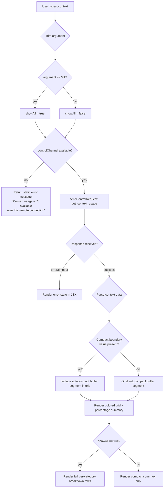

# `/context`

> Analysis basis: CC v2.1.198 bundle.js (AST extraction + Claude interpretation)
> Minimum version: v2.1.198

---

## Overview

The `/context` command visualizes the current context window usage as a colored grid rendered directly in the terminal. It dispatches a `get_context_usage` control request to the local agent, retrieves structured token-count data, and renders a JSX component that breaks the context into categorized colored segments (free space, autocompact buffer, system tokens, memory files, messages, tools, etc.). When invoked with the `all` argument it shows an expanded breakdown; without it, a compact summary is presented.

---

## Registration

| Field | Value |
|---|---|
| type | `local-jsx` |
| name | `context` |
| description | `Visualize current context usage as a colored grid` |
| argumentHint | `[all]` |
| thinClientDispatch | `control-request` |
| module_id | `K5l` |
| load_inline | `true` |
| loc_byte | `12010870` |
| loc_byte_end | `12011096` |
| loc_line | `7880` |
| arbor_handler.name | `p6f` |
| arbor_handler.fqn | `claude-2.1.198::p6f` |
| arbor_handler.kind | `AsyncFunction` |
| arbor_handler.resolution_path | `module_id` |
| arbor_handler.n_hits | `0` |

Analysis basis: CC v2.1.198 bundle.js:+12010870

---

## Input Branching

The command has four distinct branches depending on argument value, connection availability, and context data shape.



Analysis basis: CC v2.1.198 bundle.js:+12009468, +12009499, +12009525, +12009552, +12009664

---

## Behavioral Spec

### Entry Point: Handler (contextCommandHandler)

```
async function contextCommandHandler(args, appContext):
    trimmedArg = args.trim()                         // +12009474
    showAll = (trimmedArg == "all")                  // +12009499, "all" literal

    if not appContext.controlChannel:                // +12009525, "controlChannel" literal
        return staticText(
            "Context usage isn't available over this remote connection"
        )                                            // +12009552

    controlResponse = await appContext.sendControlRequest(
        event: "get_context_usage"                   // +12009664, +12009634
    )

    // Register response event listener, convert to JSX
    await listenForControlResponse(controlResponse)  // via v_t, +12009694
    render contextVisualizationJSX(controlResponse, showAll)
```

### Sub-feature: Context Data Parsing (contextDataParser)

```
function contextDataParser(rawData):
    // Filter out system-level messages
    filteredItems = rawData.filter(...)              // +12007571

    // Find compact boundary marker
    compactBoundary = filteredItems.find(
        item => item.type == "compact_boundary"      // "compact_boundary" literal, +14191594
    )                                                // +12007889

    // Compute category totals via Kae / gl
    percentFormatter = createFormatter(             // gl + Kae, +12007530, +12009306
        locale: "en-US",                            // "en-US" literal, +227025
        style:  "compact"                           // "compact" literal, +227043
    )
    // Round percentages to nearest integer
    roundedPct = Math.round(rawPct)                 // +225022

    return {
        segments: categorizedSegments,
        showCompactBuffer: (compactBoundary != null),
        totalTokens: sum,
        freeTokens: freeCount
    }
```

Analysis basis: CC v2.1.198 bundle.js:+12007530, +12007571, +12007889, +12009226, +12009306

### Sub-feature: Grid Renderer (contextGridRenderer)

The renderer (referenced as `VQt`) converts the parsed context data into a colored terminal grid.

```
function contextGridRenderer(parsedData, showAll):
    segments = [
        { label: "Free space",         color: ..., tokens: parsedData.freeTokens },
        { label: "Autocompact buffer", color: ..., tokens: compactBufferTokens,
          visible: parsedData.showCompactBuffer },
        { label: "System",             ... },
        { label: "Messages",           ... },
        // additional categories from raw data
    ]                     // literals: "Free space" +12007606, "Autocompact buffer" +12007629
                          // "system" +12009771, "Messages" +11353621

    // Build grid rows; each cell represents a token fraction
    grid = buildColoredGrid(segments)               // via h3e +12009226

    // Threshold coloring: < 20% free → warning color
    // literal 20 at +224993, "< 20" at +225002
    freeThreshold = 20
    if (percentFree < freeThreshold):
        applyWarningColor(freeCell)

    if showAll:
        // Render per-category breakdown rows
        // Categories present: "Project" +12008575, "User" +12008612,
        //   "Local" +12008647, "Flag" +12008682, "Policy" +12008718,
        //   "Plugin" +12008748, "Built-in" +12008780, "MCP" +1207633,
        //   "System prompt" +11352677, "System tools" +11352758,
        //   "MCP tools" +11352823, "Memory files" +11353141,
        //   "Skills" +11353203, "Messages" +11353621,
        //   "Custom agents" +11353074
        renderDetailRows(segments)
    else:
        renderSummaryRow(percentFree)

    return JSXElement
```

Analysis basis: CC v2.1.198 bundle.js:+12007606, +12007629, +12008575, +12008807, +12009226

### Sub-feature: Control-Channel Availability Check (connectionChecker)

```
function isControlChannelAvailable(appContext):
    // Checks for "controlChannel" key in the app context/state object
    // Returns false when running over a thin-client remote connection
    return Boolean(appContext["controlChannel"])     // +12009525
```

Analysis basis: CC v2.1.198 bundle.js:+12009525

### Sub-feature: Compact Boundary Detection (compactBoundaryDetector)

```
function getCompactBoundaryPosition(items):
    // lsr + wg helpers scan the array for the compact_boundary sentinel
    // wg slices the items array at that position (+14191747)
    sentinel = items.find(i => i.type == "compact_boundary")
    if sentinel:
        return items.indexOf(sentinel)
    return null
```

Analysis basis: CC v2.1.198 bundle.js:+12009430, +14191594, +14191677, +14191724, +14191747

### Sub-feature: Percentage Formatter (percentFormatter)

```
function formatPercent(value, totalTokens):
    // gl + Ju + xiu: uses Intl number formatting
    // locale "en-US", style "compact", appends ".0" suffix when needed
    formatted = new Intl.NumberFormat("en-US", { notation: "compact" })
                    .format(value)                   // "en-US" +227025, ".0" +224963
    return formatted + "%"
```

Analysis basis: CC v2.1.198 bundle.js:+224949, +224963, +224993, +225002

---

## State & Side Effects

| Item | Detail |
|---|---|
| Telemetry | No `tengu_*` events are fired directly inside the `/context` handler itself at depth ≤ 2. Indirect calls through `Ws` / `nt` / `Z8d` may emit `tengu_amber_creek` (+3610207), `tengu_pewter_brook` (+3610114) during fullscreen / terminal-detection sub-calls. |
| Control request | Emits `get_context_usage` event over the internal control channel (+12009664) |
| Connection guard | Returns a static error string and stops early if `controlChannel` is absent (+12009525, +12009552) |
| JSX render | Renders a `local-jsx` component — output goes to the terminal renderer, not to the conversation transcript |
| appState changes | None detected at depth ≤ 2 |
| Hook registration | None detected at depth ≤ 2 |
| Sound | None detected |
| Argument side effects | `showAll = true` expands the category breakdown; no persistent state is written |

---

## Version History

| Version | Change |
|---|---|
| v2.1.198 | Initial analysis |

---

## Common Mistakes

1. **Using `/context` over a remote thin-client connection** — the command requires a local control channel. Over a remote or tunnel connection where `controlChannel` is absent, the command immediately returns the static message `"Context usage isn't available over this remote connection"` and renders nothing.
2. **Expecting a markdown or text response** — `/context` renders a `local-jsx` component (colored grid) directly in the terminal UI. Piping or scripting around its output will not produce plain text.
3. **Omitting `all` when you need per-category detail** — without the `all` argument only a compact summary row is shown; the full breakdown of system prompt, MCP tools, memory files, skills, messages, etc. requires `/context all`.
4. **Confusing the `< 20` threshold label with a hard limit** — the `< 20` marker (+225002) is a display warning threshold (free context below 20%), not a hard cap on usage.
5. **Assuming the autocompact buffer segment is always present** — it appears only when a `compact_boundary` sentinel exists in the context data; fresh sessions without prior compaction will not show this segment.

---

## Appendix — Identifier Mapping

> For bundle debugging only. Identifiers change across versions.

| Identifier | Role |
|---|---|
| `p6f` | Main async handler for `/context` (arbor_handler) |
| `Ws` | Terminal / fullscreen environment detector |
| `NP` | Local-agent check helper |
| `rD` | Feature-flag reader |
| `zZr` | Terminal string formatter |
| `st` | String coercion utility |
| `dre` | tmux / iTerm detection helper |
| `Q8d` | Terminal type query (spawns tmux display-message) |
| `J8d` | String prefix checker for terminal name |
| `vHe` | Environment variable reader for terminal hints |
| `KZr` | Windows-over-SSH / ConPTY detector |
| `Z8d` | Notification / state registration helper |
| `nt` | Notification dispatcher |
| `Dt` | Date/time + state tracker |
| `Lr` | Settings loader |
| `X8` | Settings-from-disk orchestrator |
| `g1r` | Settings load telemetry helper |
| `x3` | Multi-source settings collector |
| `VQt` | Context grid renderer (main JSX builder) |
| `gl` | Intl number formatter factory |
| `Ju` | Compact number formatter |
| `xiu` | Low-level formatter helper |
| `Kae` | Percentage rounding + formatter |
| `h3e` | Grid cell builder |
| `d6f` | Compact boundary helper (wraps `wg`) |
| `wg` | Array slice at compact boundary |
| `lsr` | Compact boundary sentinel finder |
| `EE` | Sentinel value constant |
| `Ul` | Token count getter |
| `ute` | Raw usage extractor |
| `UM` | Token count wrapper |
| `v_t` | Control-response event listener registrar |
| `iq` | JSX wrapper / renderer |
| `Jno` | React.createElement alias |
| `wre` | Context state aggregator |
| `Lke` | Context usage data builder |
| `$no` | Alternate context state path |
| `Brr` | Full system-prompt builder (deep dependency) |
| `Kk` | Model/plan resolver |
| `KR` | System-prompt assembler |
| `TR` | Message-history normalizer |
| `Xrr` | Diagnostics / system-prompt formatter |
| `ej` | Main-thread system-prompt collector |
| `ANf` | Tool context builder |
| `_Nf` | Built-in tool context collector |
| `bNf` | Token-usage analyzer |
| `INf` | Token counter helper |
| `CNf` | Per-segment token counter |
| `vNf` | Token ratio helper |
| `wNf` | Context segment aggregator |
| `Sv` | Config reader |
| `uc` | Settings merge helper |
| `V9` | Auto-compact window resolver |
| `syp` | Auto-compact settings validator |
| `Cde` | Numeric settings parser |
| `sdo` | Auto-compact source resolver |
| `odo` | Token-window string parser |
| `hr` | Filesystem helper |
| `s2n` | Notification-state helper |
| `N2t` | Memory-load system-prompt builder |
| `qd` | Path helper |
| `bm` | Path basename helper |
| `J0e` | Memory directory creator |
| `sue` | File/directory stat helper |
| `Ke` | Feature validator |
| `xe` | Path existence checker |
| `Gat` | Memory-gate helper |
| `m5i` | Memory file loader |
| `Tjd` | Memory index helper |
| `O2t` | Path formatter |
| `pR` | Memory path resolver |
| `mT` | Path join helper |
| `S5i` | Memory section builder |
| `I5i` | Memory index formatter |
| `T5i` | Memory template builder |
| `oZr` | Memory block formatter |
| `gmm` | Environment-info system-prompt block builder |
| `hmm` | OS/shell environment info collector |
| `KKo` | OS version/type reader |
| `qKo` | Shell type detector |
| `UZn` | Scratchpad / temp-dir block builder |
| `See` | Scratchpad state reader |
| `kIe` | Scratchpad path helper |
| `Emm` | Brief-mode system-prompt builder |
| `bmm` | Focus/context-management block builder |
| `olt` | Settings lookup helper |
| `umm` | Agent role sentence selector |
| `Jfm` | Heron-brook system-prompt injection |
| `L0` | State lookup with ownership check |
| `Qfm` | Amber-sextant block builder |
| `GRl` | Computed-cache system-prompt block |
| `cmm` | Autonomy-append block builder |
| `nmm` | Context-efficiency / compaction reminder builder |
| `rmm` | Verified-vs-assumed block builder |
| `omm` | Slate-harrier block builder |
| `smm` | Orchid-mantis block builder |
| `Yw` | CLI/remote context block builder |
| `lmm` | Session-memory block builder |
| `amm` | Full system-prompt orchestrator |
| `vv` | State reader with fallback |
| `imm` | MJ-state reader |
| `MJ` | Disabled-features checker |
| `Uu` | Tool-count helper |
| `qK` | IEt/dze error handler |
| `mK` | Message flatMap helper |
| `x5i` | Cross-session memory helper |
| `L5i` | Cross-session path builder |
| `m0e` | Model-info helper |
| `nR` | Model name constants reader |
| `fu` | String template helper |
| `Hhc` | Padded-countdown context helper |
| `d3n` | Max-context calculator |
| `Zfm` | Additional feature-flag blocks |
| `emm` | Act-don't-rederive block builder |
| `_mm` | Worktree / bg-session block builder |
| `kbo` | Worktree path helper |
| `Tmm` | Slate-harrier wrapper |
| `zKo` | Opus-4-7 / additive mode block builder |
| `kl` | String cast helper |
| `GRl` | Computed-cache block |
| `ej` | Main-thread prompt collector |
| `pc` | Prompt-container selector |
| `tC` | Container state helper |
| `Zr` | ESModule marker / bind helper |
| `Flc` | Date-stamped log helper |
| `Qdt` | Assistant-message usage extractor |
| `moe` | Usage cache checker |
| `_Nf` | Built-in tool array collector |
| `HNf` | Tool-section parser (match/split/trim) |
| `Wrr` | Full tool-context assembler |
| `Hmm` | Per-tool context builder |
| `k5i` | Tool+memory combined context builder |
| `$Ko` | Tool-name slicer |
| `VAt` | Per-tool token analyzer |
| `o8e` | Full tool descriptor builder |
| `Re` | Error reporter |
| `C$o` | Tool content formatter |
| `yNf` | Memory-file context builder |
| `eue` | claudeMd reader |
| `kc` | CLAUDE.md loader |
| `ENf` | MCP tool context builder |
| `INe` | Tool-result context builder |
| `jrr` | Per-tool-call context builder |
| `u` | Daemon stop / xe wrapper |
| `Le` | Path + existence helper |
| `M$` | Event-bus push helper |
| `l8` | Process-race helper |
| `_` | Token-join + session builder |
| `g` | Daemon session manager |
| `vgm` | UUID generator |
| `xn` | Session ID helper |
| `HC` | Session handle creator |
| `bNf` | Token usage analyzer |
| `vf` | Rounding helper |
| `c` | Session-context helper |
| `un` | Session abort helper |
| `p` | Process exit helper |
| `aI` | Abort initiator |
| `TNf` | Tool-entry mapper |
| `SNf` | Sub-agent context collector |
| `Oco` | ZI + Iq wrapper |
| `Iq` | Tool filter helper |
| `eUl` | Il-lookup helper |
| `Il` | Cached tool lookup (V4i/q4i) |
| `wNf` | Context segment aggregator |
| `TR` | Message normalizer |
| `rgm` | Message reorder helper |
| `Enn` | Empty-content fixer |
| `SHc` | tga helper |
| `lgm` | Content-type dispatcher |
| `pgm` | Tool-use dedup helper |
| `G` | i/P accessor |
| `Ozo` | Array-is-array + some checker |
| `cgm` | Array some helper |
| `ugm` | Tool-use get/startsWith helper |
| `q` | trn accessor |
| `PZ` | t.some helper |
| `B` | Set add wrapper |
| `U` | Abort controller set |
| `SPo` | Session-param builder |
| `Cfr` | vfr/IHc/ggm helper |
| `DO` | Standard tool builder |
| `tzo` | Tool-search ref cleaner |
| `ogm` | Tool-ref cleaner |
| `lHc` | flatMap tool filter |
| `O` | Write helper with dQc/Zd |
| `sgm` | e.some / isArray helper |
| `Cgm` | Content slicer / Tgm lookup |
| `Chc` | Chc placeholder |
| `D` | d.write / V wrapper |
| `mgm` | T / n.filter / r.some helper |
| `bHc` | OQr / V / e.filter helper |
| `Xrr` | Diagnostics block builder |
| `R` | OAuth / API response handler |
| `wgm` | t.push / Fzo / n.trim helper |
| `fgm` | vfr / IHc / Hgm helper |
| `CKe` | Orphaned-thinking filter |
| `Ngm` | No-message-content replacer |
| `IKe` | Whitespace-only assistant filter |
| `Ugm` | Empty assistant content fixer |
| `hgm` | t.at / e.slice / THc helper |
| `EHc` | s.findLastIndex / Nzo helper |
| `THc` | n.at / Cfr / n.push helper |
| `agm` | l.every / l.filter / c.join helper |
| `ANf` | Tool context builder |
| `tl` | sw helper |
| `L7e` | MF / oL / hpr helper |
| `MF` | Tool-filter helper |
| `oL` | nt wrapper |
| `hpr` | loe helper |
| `w7e` | e.filter / t.has / t.add helper |
| `ij` | hpr / t.add / e.filter helper |
| `lS` | Fo / ca / so / Jbd helper |
| `loe` | Lr / FZn helper |
| `FZn` | tz helper |
| `x$n` | Context-window sorter |
| `gWe` | Number / kco / Math.max helper |
| `fSe` | Lr helper |
| `HWe` | HWe placeholder |
| `Mco` | Mco placeholder |
| `v` | v placeholder |
| `y` | a accessor |
| `Fbe` | Retry backoff calculator |
| `H` | o.values / P.kill helper |
| `L` | Away-summary orchestrator |
| `E7e` | iz.getState helper |
| `F7t` | Local-workflow helper |
| `tMe` | UC helper |
| `CFm` | c_r helper |
| `w2c` | e.at helper |
| `L2c` | r1e / t.add / c_r / B$n helper |
| `sVt` | Background-task abort helper |
| `LHc` | UUID generator |
| `sr` | Error/String wrapper |
| `foe` | Math.min / c2n / Sv / V9 helper |
| `c2n` | p0e / Cde helper |
| `p0e` | so / R$d / Math.min / zki helper |
| `oe` | Z / ne / A / v accessor |
| `Z` | Voice/recording session manager |
| `d` | SXe / r.write / rdc session helper |
| `cHr` | ZFe.push / Date.now helper |
| `K` | iec / u$ / B.enqueue helper |
| `ae` | Q accessor |
| `eMc` | Math.sqrt / Math.min helper |
| `be` | T/A/k/TE/z/ne/ue voice buffer |
| `oZe` | toLowerCase / $cs.has / t.split helper |
| `ifs` | Intl.DateTimeFormat helper |
| `Xdr` | Voice WebSocket stream manager |
| `Se` | Promise.all / s.set / Sss / REr helper |
| `_Rm` | _Rm placeholder |
| `pe` | ce.get / T / VHl / we helper |
| `z` | Nn.filter / qr.has helper |
| `X` | E / nyr / z.applyMcpUpdate helper |
| `j` | clearTimeout / setTimeout / Math.round helper |
| `ue` | Voice session event loop |
| `St` | V / Pe helper |
| `ve` | Zm / kt / _e voice buffer |
| `HZo` | tl / gZo.basename / t.add helper |
| `ne` | h accessor |
| `A` | FEr / UEr / H.userinfo helper |
| `FEr` | Array.isArray / UEr helper |
| `UEr` | t.startsWith / t.slice / r.replace helper |
| `Lma` | wma / e.slice / rC / TR helper |
| `wma` | moe / gdo helper |
| `gdo` | gdo placeholder |
| `rC` | GNf helper |
| `GNf` | JRe / Xrr helper |
| `xt` | KTo accessor |
| `KTo` | Me helper |
| `_e` | N4 / kt / Boolean / Z.has helper |
| `N4` | kt / eu helper |
| `kt` | sw helper |
| `eu` | Si / process.on helper |
| `je` | we.findLastIndex / we.splice helper |
| `we` | ve.has / dn / Me / V / Pe / Ejt / tVc / Sjt / yQ / IT / ve.add helper |
| `dn` | Itt.push / Dte.logMCPDebug helper |
| `Ejt` | Ajt / uu helper |
| `tVc` | r accessor |
| `Sjt` | bjt / yQ / uu helper |
| `yQ` | Od / zx helper |
| `IT` | hr / u0 / Axp / t.findIndex helper |
| `Xtn` | eu helper |
| `Ze` | process.emit / ke.toggleQr / V / Pe / ke.logStatus helper |
| `ke` | ve.abort helper |
| `N` | Date.now / B.values / Z.shiftGraceClocksForward helper |
| `oXe` | prm / jt / Esc.freemem / hrm helper |
| `Ssc` | nt helper |
| `EGe` | _T.lstat / G3t / e.isFile / _T.rm helper |
| `Fn` | t accessor |
| `vur` | nt helper |

---

Note: index built via Arbor fallback; some signals (telemetry, literals) may be missing — see arbor-fallback.js.