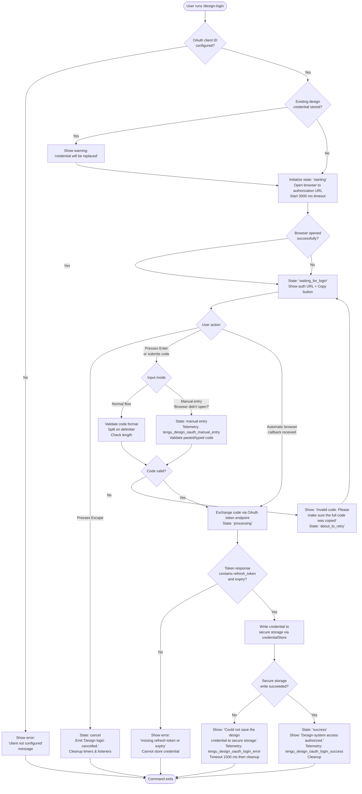

# `/design-login`

> Analysis basis: CC v2.1.198 bundle.js (AST extraction + Claude interpretation)
> Minimum version: v2.1.198

---

## Overview

`/design-login` initiates an OAuth authorization flow that grants Claude Code access to a user's claude.ai design-system projects. It operates independently of the main session's authentication, storing a separate design credential in secure storage so that `/design-sync` can subsequently read and write the organization's design projects. The command presents an interactive terminal UI that guides the user through browser-based sign-in or manual code entry.

---

## Registration

| Field | Value |
|---|---|
| type | `local-jsx` |
| name | `design-login` |
| description | `Authorize design-system access for /design-sync with your claude.ai account` |
| module_id | `XWl` |
| load_inline | `true` |
| loc_byte | `12172145` |
| loc_byte_end | `12172344` |
| loc_line | `8184` |
| arbor_handler.name | `QWl` |
| arbor_handler.fqn | `claude-2.1.198::QWl` |
| arbor_handler.kind | `Function` |
| arbor_handler.resolution_path | `direct` |
| arbor_handler.n_hits | `1` |

Analysis basis: CC v2.1.198 bundle.js:+12172145

---

## Input Branching

The command has more than three distinct internal state paths (initial start, browser flow in progress, manual code entry, success, cancelled/escaped, error/retry), so a Mermaid flowchart is used.



---

## Behavioral Spec

### Top-Level Handler (`QWl` / `djf`)

The handler dispatched by the registration is resolved by Arbor as `QWl` (resolution path: `direct`). The call graph's top-level entry point is `djf`, which renders the React/JSX component via `ME.jsx` and delegates to `YWl` (the interactive login component function).

Analysis basis: CC v2.1.198 bundle.js:+12171921

### Component Initialization (`YWl`)

```
function designLoginComponent(props):
    [authState, setAuthState] = useState("starting")   // literal: "starting" @ +12165903
    clockCtx  = useClockContext()                       // Os — requires ClockProvider
    termSize  = useTerminalSize()                       // Er — requires Ink App component
    colCount  = Math.max(termSize.columns, 0)           // literals 0, 1 @ +12165984 / +12166006
    widthRef  = useRef()
    spacerWidth = Math.max(colCount - 50, 4)           // literals 50, 4 @ +12166113 / +12166137

    oauthClientId = resolveDesignOAuthClientId()        // MXt → Cnr → Gs
    if not oauthClientId:
        show error: "The Claude Design OAuth client is not configured..." // @ +12166997
        return early
```

Analysis basis: CC v2.1.198 bundle.js:+12165884

### State Machine Values

The component tracks the following named states (all literals found in the bundle):

| State string | Meaning | loc_byte |
|---|---|---|
| `"starting"` | Initial render, launching browser | +12165903 |
| `"waiting_for_login"` | Browser opened; waiting for code | +12166701 |
| `"about_to_retry"` | Invalid code entered; prompting retry | +12166468 |
| `"processing"` | Exchanging code for tokens | +12167527 |
| `"success"` | Credential stored successfully | +12166167 |

Keyboard shortcuts observed in literals: `"escape"` (cancel) and `"return"` (submit) (bundle.js:+12166275, +12166428).

### OAuth Flow Initiation

```
function startOAuthFlow(clientId):
    generate PKCE codeVerifier and codeChallenge
    generate nonce and state parameter
    store oauth_state in session store                  // literal "oauth_state" @ +18115438
    scopes = ["openid", "profile", "email", "offline_access"]
    // literals @ +18219972, +18219981, +18219991, +18222737
    build authorizationUrl with:
        response_type = "code"
        code_challenge_method = "S256"                  // @ +18223098
        redirect_uri = "/oauth/callback"                // @ +18223149
    open authorizationUrl in default browser
    setTimeout(3000, showManualEntryFallback)           // 3000 ms @ +12167322
```

Analysis basis: CC v2.1.198 bundle.js:+12167220

### Manual Code Entry Fallback

If the browser does not open within the timeout window, the UI transitions to a manual-entry prompt displaying the message "Browser didn't open? Use the url below to sign in" (bundle.js:+12169470). A copy-to-clipboard button is shown with label `"copy"` / `"(Copied!)"` (bundle.js:+12169639, +12169566). Triggering this path emits the `tengu_design_oauth_manual_entry` telemetry event (bundle.js:+12166787).

### Code Validation

```
function validateAndSubmitCode(rawInput, setAuthState):
    parts = rawInput.split(delimiter)                   // YWl → I.split @ +12166579
    if parts.length is not expected count:
        setAuthState("about_to_retry")
        showError("Invalid code. Please make sure the full code was copied")
        // literal @ +12166628
        return
    handleManualAuthCodeInput(parts)                    // r.handleManualAuthCodeInput @ +12166825
```

Analysis basis: CC v2.1.198 bundle.js:+12166579

### Token Exchange and Credential Storage

```
function exchangeCodeAndStore(code, verifier, state):
    // Token endpoint: "/oauth/token" @ +18224984
    // grant_type: "device_code" pattern also present; design uses "code" grant
    response = POST tokenEndpoint with code + verifier
    if response missing refresh_token or expires_in:
        show error: "The token response was missing a refresh token or expiry..."
        // @ +10969775
        return failure

    // Persist via credentialStore (Inr → Hl → dfi)
    result = credentialStore.write(designTokens)
    if result == "primary_and_fallback_failed":         // @ +2390873
        show error: "Could not save the design credential to secure storage."
        // @ +12167832
        telemetry("tengu_design_oauth_login_error")    // @ +12168081
        setTimeout(1500, cleanup)                       // 1500 ms @ +12168057
        return failure

    setAuthState("success")
    show: "Design-system access authorized."            // @ +12166199
    telemetry("tengu_design_oauth_login_success")      // @ +12167928
    cleanup()
```

Analysis basis: CC v2.1.198 bundle.js:+12167723 (credentialStore path `Inr`), +12167554 (`wUo` token-exchange path)

### Cancellation

```
function handleCancel():
    show: "Design login cancelled."                    // @ +12166364
    r.cleanup()                                        // @ +12168626
    I.forEach(clearTimeout)
    I.clear()                                          // @ +12168638 / +12168658
```

Analysis basis: CC v2.1.198 bundle.js:+12168626

### Existing Credential Warning

If a design credential is already stored in secure storage at the time the command is invoked, the UI displays: "A design credential is already stored — completing this flow replaces it." (bundle.js:+12169219). The flow continues normally; on success the old credential is overwritten.

### OAuth Client ID Resolution (`MXt` → `Cnr` → `Gs`)

```
function resolveDesignOAuthClientId(env):
    // Gs validates env against approved endpoint list
    // env values: "prod", "local", "staging" @ +866746, +868048, +868073
    // Approved local ports: 8000, 4000, 3000 @ +867112, +867199, +867289
    // CLAUDE_CODE_DESIGN_OAUTH_CLIENT_ID env var overrides registered client
    if env == "prod":
        return registeredClientId  // "22422756-60c9-4084-8eb7-27705fd5cf9a" @ +867786
    elif CLAUDE_CODE_CUSTOM_OAUTH_URL not in approved list:
        throw Error("CLAUDE_CODE_CUSTOM_OAUTH_URL is not an approved endpoint.")
        // @ +868233
    elif CLAUDE_CODE_DESIGN_OAUTH_CLIENT_ID not set:
        return null   // triggers "client not configured" error in component
```

Analysis basis: CC v2.1.198 bundle.js:+12166965

### Credential Storage Backend (`Inr` → `Hl` → `dfi`)

The storage layer (`dfi`) tries a primary secure-storage path, then falls back to plaintext if the primary raises a transient error. Telemetry outcome literals observed:

| Outcome literal | loc_byte |
|---|---|
| `"secure_storage_credentials_write"` | +2390523 |
| `"primary_transient_skip_fallback"` | +2390621 |
| `"plaintext_fallback_used"` | +2390770 |
| `"primary_and_fallback_failed"` | +2390873 |

Analysis basis: CC v2.1.198 bundle.js:+2390523

### UI Rendering

The component renders a `"column"` layout (literal `"column"` at bundle.js:+12168757) with:
- Title: `"Design login"` (bundle.js:+12168932)
- Description: "Authorize design-system access (read and write your organization's claude.ai/design projects)…" (bundle.js:+12168980)
- Conditional URL display + copy button when manual entry is active
- Status messages keyed to the current authState

The component uses `_1.useEffect`, `_1.useState`, `_1.useRef`, and `_1.useCallback` React hooks and renders via `ME.jsx` / `ME.jsxs`.

Analysis basis: CC v2.1.198 bundle.js:+12168732

---

## State & Side Effects

| Item | Detail |
|---|---|
| Telemetry: `tengu_design_oauth_manual_entry` | Fired when user triggers manual code entry path (bundle.js:+12166787) |
| Telemetry: `tengu_design_oauth_login_success` | Fired on successful credential storage (bundle.js:+12167928) |
| Telemetry: `tengu_design_oauth_login_error` | Fired when secure storage write fails (bundle.js:+12168081) |
| Secure storage write | Credential written via `dfi` credentialStore; falls back to plaintext |
| Clipboard | Copy-to-clipboard of auth URL via platform clipboard utility (`$w` → `yGi` / `W8d`) |
| Timer registration | `setTimeout` 3000 ms for browser-open fallback (bundle.js:+12167322); 1500 ms for error cleanup (bundle.js:+12168057) |
| OAuth state store | Writes `"oauth_state"` key to session KV store during flow; deleted on completion/cancellation |
| appState changes | Sets design-credential entry in persisted credential store; no main session auth state modified |
| Sound | None observed |
| Browser launch | Calls `r.startOAuthFlow` which opens the system default browser to the authorization URL (bundle.js:+12167220) |

---

## Version History

| Version | Change |
|---|---|
| v2.1.198 | Initial analysis |

---

## Common Mistakes

1. **Running `/design-login` without a registered OAuth client** — if `CLAUDE_CODE_DESIGN_OAUTH_CLIENT_ID` is not set and the build does not include the registered client ID, the command exits immediately with "The Claude Design OAuth client is not configured in this build." Set the environment variable or upgrade to a production build.
2. **Dismissing the browser prompt too quickly** — the 3-second browser-open timeout is short; if the browser is slow to open, the manual-entry fallback appears before the browser completes navigation. Wait for the browser tab to load before entering a code.
3. **Copying a partial code** — the code is validated by splitting on an internal delimiter and checking segment count. A truncated paste yields "Invalid code. Please make sure the full code was copied." Copy the entire code string from the browser.
4. **Expecting this to replace main API auth** — `/design-login` stores a separate design credential only; the main session's API key or primary OAuth token is entirely unaffected.
5. **Running in a sandboxed environment without secure storage** — if both primary and fallback credential stores fail, the command reports an error and exits without storing any credential. Check keychain/keyring permissions before running.
6. **Using a custom OAuth URL not in the approved list** — setting `CLAUDE_CODE_CUSTOM_OAUTH_URL` to a non-approved origin causes `Gs` to throw "CLAUDE_CODE_CUSTOM_OAUTH_URL is not an approved endpoint." (bundle.js:+868233).

---

## Appendix — Identifier Mapping

> For bundle debugging only. Identifiers change across versions.

| Identifier | Role |
|---|---|
| `djf` | Top-level handler / entry point (renders JSX component) |
| `QWl` | Arbor-resolved handler function for `design-login` registration |
| `YWl` | Interactive login React component function |
| `Os` | `useClock` context hook (requires ClockProvider) |
| `Er` | `useTerminalSize` context hook (requires Ink App) |
| `MXt` | OAuth client ID resolution dispatcher |
| `Cnr` | OAuth client ID resolver (calls `Gs`) |
| `Gs` | Endpoint/environment validator; maps env name to approved OAuth base URL |
| `HSs` | Sub-helper inside `Gs` (approved endpoint list check) |
| `Uvu` | Sub-helper inside `Gs` (URL normalization) |
| `vN` | OAuth token-revoke / Axios error helper |
| `wUo` | Token exchange and storage orchestrator |
| `Inr` | Credential persistence entry point (delegates to `Hl` → `dfi`) |
| `Hl` | Credential store selector |
| `dfi` | Credential read/write with primary+fallback logic |
| `O9e` | Async credential read helper inside `dfi` |
| `fAt` | Cleanup / post-success helper |
| `Kd` | Context subscription hook (MCP server list) used during render |
| `m` | Filter helper inside `Kd` |
| `$w` | Clipboard write orchestrator |
| `K2t` | Clipboard strategy selector |
| `HH` | Clipboard low-level write |
| `yGi` | Platform clipboard dispatcher (macOS/Linux/Windows) |
| `Dn` | Clipboard executor |
| `Wr` | Child-process executor for clipboard commands |
| `Pt` | Clipboard fallback writer |
| `WZr` | Linux clipboard variant selector |
| `Zf` | Clipboard strategy sub-helper |
| `W8d` | Clipboard strategy builder |
| `GZr` | Clipboard screen/tmux helper |
| `z2t` | Clipboard tmux helper |
| `ax` | OSC52 escape sequence builder |
| `B_` | DCS clipboard sequence builder |
| `_Gi` | Screen clipboard sequence builder |
| `Re` | Error logger / render error boundary helper |
| `he` | String coercion utility |
| `sr` | Error string constructor |
| `xe` | Feature-flag reader |
| `Le` | Feature-flag store accessor |
| `St` | Feature-flag bad-state reporter |
| `ve` | Message queue (JSX render queue) |
| `ME` | React JSX runtime (`jsx` / `jsxs`) |
| `_1` | React hooks namespace (`useState`, `useRef`, `useCallback`, `useEffect`) |
| `R` | OAuth HTTP request router (large function handling all OAuth endpoints) |
| `xXc` | OAuth admin key validation helper |
| `g8m` | Admin credential checker |
| `bu` | HTTP response builder |
| `tge` | JSON serializer wrapper |
| `xss` | IP denylist checker |
| `vss` | IPv4-mapped address resolver |
| `wss` | IP pattern matcher |
| `QYc` | URL-length / header-size guard |
| `nQe` | URL string replacer |
| `gss` | JWT validator |
| `lss` | JWT header parser |
| `LYc` | JWT kid lookup |
| `hss` | JWT seal/unseal |
| `css` | JWT cipher suite helper |
| `Ass` | JWT verification entry |
| `bss` | SHA-256 hash builder |
| `Sss` | Device-grant token minter |
| `mss` | AES-GCM encryption helper |
| `REr` | Token string formatter |
| `Ijm` | Uppercase normalizer |
| `Sin` | CSRF nonce builder |
| `$Er` | Random bytes generator |
| `rQe` | OAuth callback state validator |
| `kYc` | State seal verifier |
| `xYc` | OAuth state sealer |
| `OYc` | Random value generator (uses `bwt.random`) |
| `PYc` | Random bytes generator (uses `kEr.randomBytes`) |
| `rae` | JSON response shorthand |
| `Se` | Token store set/del helper |
| `A` | Userinfo claims extractor |
| `FEr` | Array-or-string claims normalizer |
| `UEr` | Claim string sanitizer |
| `WEr` | Header inclusion checker |
| `GXc` | Gateway settings loader |
| `N8m` | Policy store populator |
| `U8m` | Policy filter |
| `F8m` | Policy builder |
| `Pss` | Model permission store |
| `Mss` | Model list normalizer |
| `Dss` | Request decoder |
| `VXc` | Upstream request fan-out |
| `Dwt` | Single upstream fetch |
| `Kss` | Response string coercer |
| `EXc` | Model list endpoint handler |
| `HXc` | Messages endpoint handler |
| `w$e` | JSON response parser |
| `fXc` | Auth application helper |
| `hXc` | Beta-header filter |
| `mXc` | Token-count proxy handler |
| `o8m` | Count-tokens response builder |
| `hh` | HTTP client with proxy support |
| `MEr` | Metrics logger |
| `Co` | HTTP handler dispatcher |
| `H` | OAuth provider object (authorizationUrl, callback, refresh, userinfo) |
| `o` | Server list formatter |
| `Z` | Voice recording session manager |
| `ue` | Voice stream connection loop |
| `Xdr` | Voice WebSocket stream handler |
| `pe` | Audio capture process manager |
| `cHr` | Recording timestamp recorder |
| `eMc` | Audio chunk size calculator |
| `be` | Voice session state machine |
| `ve` | (also) Voice audio buffer queue |
| `ae` | Audio direction queue |
| `oZe` | Locale detector |
| `ifs` | Date/time formatter |
| `Le` | (also) Voice feature-flag reader |
| `xe` | (also) Voice feature-flag accessor |
| `St` | (also) Voice feature-flag bad-state |
| `HZo` | Voice file registration helper |
| `Lr` | Platform identifier |
| `X` | MCP update applicator |
| `z` | MCP rate-limit filter |
| `K` | Session enqueue helper |
| `j` | Daemon write-with-timeout helper |
| `d` | MCP server supervisor writer |
| `lQc` | Supervisor config loader |
| `Cqm` | JSON-over-socket writer |
| `dQc` | File realpath/stat checker |
| `T` | Multipart form-data writer |
| `N` | Background worker sweep function |
| `k` | File watcher + polling loop |
| `u` | Daemon socket connection manager |
| `c` | Async unlock helper |
| `un` | Mutex primitive |
| `V` | Generic value wrapper / identity |
| `Zd` | Stream drain helper |
| `p` | Process exit helper |
| `f` | Current-frame accessor |
| `q` | Task queue |
| `ce` | Claims token builder |
| `Tc` | UUID generator wrapper |
| `wse` | Token payload builder |
| `vs` | Claims set assembler |
| `kt` | Session key builder |
| `ee` | JWT payload reader |
| `U` | Abort controller manager |
| `ne` | Slice helper |
| `x` | Cookie parser |
| `B` | Generic map/set |
| `n` | Case-normalizer |
| `v` | Iterator helper |
| `_Rm` | Voice resource cleanup |