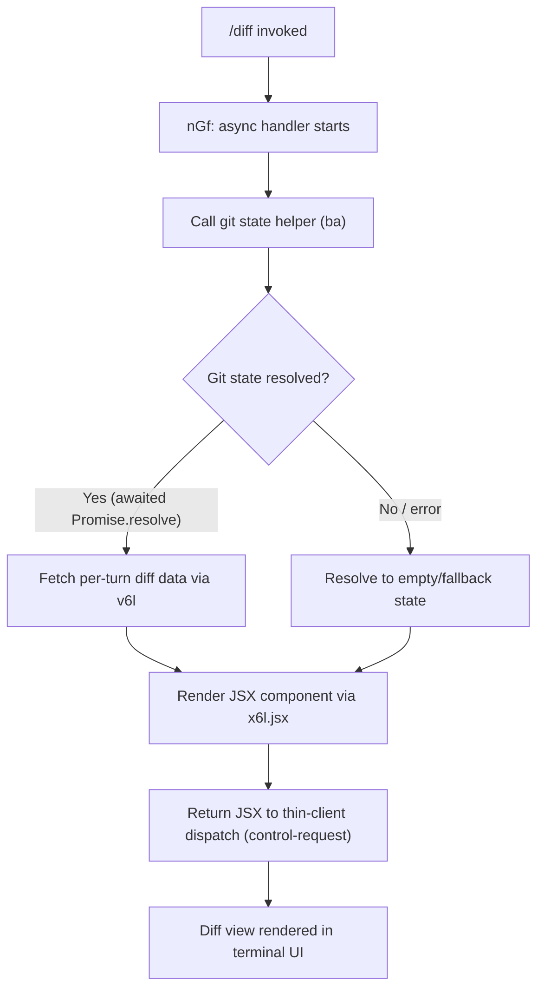

# `/diff`

> Analysis basis: CC v2.1.198 bundle.js (AST extraction + Claude interpretation)
> Minimum version: v2.1.198

---

## Overview

The `/diff` command renders a unified view of uncommitted changes in the current repository alongside per-turn diffs accumulated during the active session. It is implemented as a local JSX command that resolves its handler asynchronously, dispatches a control request to the thin client, and returns a React component to display the diff output inline in the terminal UI.

---

## Registration

| Field | Value |
|---|---|
| type | `local-jsx` |
| name | `diff` |
| description | `View uncommitted changes and per-turn diffs` |
| loc_byte | `12045271` |
| loc_byte_end | `12045489` |
| loc_line | `7881` |
| immediate | `null` |
| thinClientDispatch | `control-request` |
| module_id | `L6l` |
| load_inline | `true` |
| arbor_handler.name | `nGf` |
| arbor_handler.fqn | `claude-2.1.198::nGf` |
| arbor_handler.kind | `AsyncFunction` |
| arbor_handler.resolution_path | `module_id` |
| arbor_handler.n_hits | `0` |

Analysis basis: CC v2.1.198 bundle.js:+12045271

---

## Input Branching

The handler follows two primary branches based on whether the git state resolution succeeds or not, plus a JSX rendering path. Three distinct paths are present, so a Mermaid flowchart is used.



Analysis basis: CC v2.1.198 bundle.js:+12045039 – +12045117

---

## Behavioral Spec

### Primary Handler — `nGf` (AsyncFunction)

`nGf` is the top-level async handler for `/diff`, resolved from module `L6l` via the `module_id` resolution path.

```
async function diffCommandHandler(context):
    // Step 1: Obtain git working-tree state
    gitState = await resolveGitState(context)          // calls ba()

    // Step 2: Await any in-flight async resolution
    resolvedData = await Promise.resolve(gitState)     // bundle.js:+12045068

    // Step 3: Retrieve per-turn diff payload
    turnDiffData = fetchPerTurnDiff(resolvedData)      // calls v6l()

    // Step 4: Render diff as a JSX component
    output = renderDiffComponent(turnDiffData)         // calls x6l.jsx()

    return output   // handed back via thinClientDispatch: "control-request"
```

Analysis basis: CC v2.1.198 bundle.js:+12045039

---

### Git State Helper — `ba`

`ba` is a shared utility invoked by `nGf` to collect the current git working-tree state. It internally calls two sub-utilities:

```
function resolveGitState(context):
    remoteInfo = getRemoteInfo()      // calls Qi()  — resolves "remote" string constant
    treeStatus = buildTreeStatus()    // calls Ul()  — delegates to ute()
    return { remoteInfo, treeStatus }
```

- `Qi` — appears to handle remote-tracking reference resolution. The string literal `"remote"` (bundle.js:+64238) is associated with this code path, suggesting it reads the configured upstream remote name.
- `Ul` — delegates immediately to `ute` (bundle.js:+811922) to compute the working-tree status (staged, unstaged, untracked file lists).

Analysis basis: CC v2.1.198 bundle.js:+811956, +811962, +811922

---

### Per-Turn Diff Fetcher — `v6l`

```
function fetchPerTurnDiff(resolvedGitState):
    // Reads accumulated per-turn change records from session state
    // Returns structured diff payload for the renderer
    return perTurnDiffPayload
```

Analysis basis: CC v2.1.198 bundle.js:+12045098

---

### JSX Renderer — `x6l.jsx`

```
function renderDiffComponent(diffPayload):
    // Constructs a React/Ink component tree that displays:
    //   1. Uncommitted working-tree changes (from git state)
    //   2. Per-turn diffs accumulated in the current session
    return <DiffView data={diffPayload} />
```

The `local-jsx` command type means the returned JSX is handled entirely within the CLI process and surfaced inline in the terminal interface.

Analysis basis: CC v2.1.198 bundle.js:+12045117

---

## State & Side Effects

| Item | Detail |
|---|---|
| Telemetry | None detected in depth-2 traversal |
| Hook registration | None detected |
| appState changes | Read-only with respect to appState; reads per-turn diff records from session state but does not mutate them |
| thinClientDispatch | `control-request` — the rendered JSX is dispatched to the thin client as a control request |
| Sound | None detected |
| Git interaction | Reads working-tree status and remote tracking info via `ba` → `Qi` / `Ul` → `ute`; no write operations |
| String constant | `"remote"` (bundle.js:+64238) — used to identify the git remote reference during state resolution |

---

## Version History

| Version | Change |
|---|---|
| v2.1.198 | Initial analysis |

---

## Common Mistakes

1. **Expecting output outside a git repository** — `/diff` relies on `ba` resolving a git working-tree state. Running it in a directory that is not a git repository will produce an empty or error state rather than a useful diff view.
2. **Confusing uncommitted changes with per-turn diffs** — the command surfaces two distinct datasets: the current working-tree changes (via `git status` / `git diff`) and the changes made during the active Claude Code session (per-turn diffs). These are displayed together but have different scopes.
3. **Assuming real-time refresh** — `/diff` is a one-shot snapshot rendered at invocation time. It does not auto-update as files change; re-invoke the command to get an updated view.
4. **Expecting telemetry or side effects** — no telemetry events are fired by this command, so there is no signal in usage analytics when it is invoked.

---

## Appendix — Identifier Mapping

> For bundle debugging only. Identifiers change across versions.

| Identifier | Role |
|---|---|
| `nGf` | Primary async handler for `/diff`; entry point resolved from module `L6l` via `module_id` path |
| `ba` | Git state resolution helper; orchestrates remote info and working-tree status collection |
| `Qi` | Remote reference resolver; reads the configured git remote name (associated with `"remote"` literal) |
| `Ul` | Working-tree status builder; thin wrapper that delegates immediately to `ute` |
| `ute` | Core working-tree status computation routine; called by `Ul` |

Note: index built via Arbor fallback; some signals (telemetry, literals) may be missing — see arbor-fallback.js.