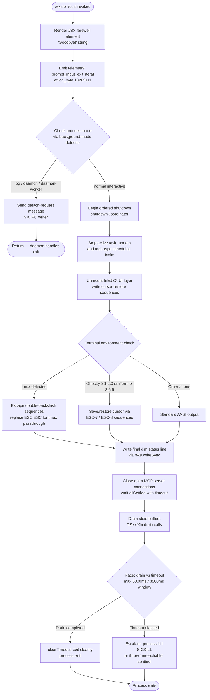

# `/exit`

> Analysis basis: CC v2.1.198 bundle.js (AST extraction + Claude interpretation)
> Minimum version: v2.1.198

---

## Overview

The `/exit` command (aliased as `/quit`) terminates the Claude Code CLI session. When invoked, it renders a JSX farewell element ("Goodbye!"), executes an ordered shutdown sequence that tears down active connections and child processes, flushes pending output, and finally calls `process.exit`. The command is marked `immediate`, meaning it executes without waiting for any in-flight agent turn to complete.

---

## Registration

| Field | Value |
|---|---|
| type | `local-jsx` |
| name | `exit` |
| description | `null` |
| aliases | `["quit"]` |
| immediate | `true` |
| module_id | `Pic` |
| load_inline | `true` |
| loc_byte | `13263674` |
| loc_byte_end | `13263870` |
| loc_line | `9083` |
| arbor_handler.name | `Mom` |
| arbor_handler.fqn | `claude-2.1.198::Mom` |
| arbor_handler.kind | `AsyncFunction` |
| arbor_handler.resolution_path | `module_id` |
| arbor_handler.n_hits | `1` |

Analysis basis: CC v2.1.198 bundle.js:+13263674

---

## Input Branching

The exit flow has more than three distinct execution branches (process mode detection, shutdown sequencing, drain race, SIGKILL fallback), so a Mermaid flowchart is used.



Analysis basis: CC v2.1.198 bundle.js:+13262891 (handler entry), +13263093 (farewell render), +6895745 (shutdown coordinator), +6893401 (process.exit), +6893426 (process.kill SIGKILL)

---

## Behavioral Spec

### 1. Handler Entry — `exitCommandHandler` (bundle: `Mom`)

```
async function exitCommandHandler(context):
    // Render farewell JSX element
    renderFarewell(context)                  // calls Oic.jsx at +13262968

    // Detect background / daemon execution mode
    mode = detectProcessMode()               // calls backgroundModeDetector at +13262891
    if mode in ["bg", "daemon", "daemon-worker"]:
        sendDetachRequest(context)           // calls ipcWriter (DTe) at +13262907
        return                               // daemon process handles its own exit

    // Collect any remaining "todo" and "scheduled task" items
    flushPendingTasks(context)               // calls taskFlusher (Dqa) at +13262938

    // Hand off to full shutdown coordinator
    await shutdownCoordinator(context)       // calls Ti at +13263106
```

Analysis basis: CC v2.1.198 bundle.js:+13262891

---

### 2. Background / Daemon Detach — `ipcWriter` (bundle: `DTe`)

```
function ipcWriter(context):
    // Validate channel is available
    validateChannel()                        // calls channelCheck (dCn) at +11735066
    // Notify daemon-side supervisor of detach intent
    sendMessage(type="detach-request")       // calls messageSender (Nqa) at +11735085
    // Serialize payload via JSON.stringify (Me → JSON.stringify at +194884)
    writeToChannel(serializedPayload)        // calls channelWriter (mj → MZ.write at +11209471)
    // Cleanup transport
    closeTransport()                         // calls Tme at +11735179
```

Analysis basis: CC v2.1.198 bundle.js:+11735066  
Literal `"detach-request"` at +11735103; literals `"bg"`, `"daemon"`, `"daemon-worker"` at +2362190, +2362200, +2362214.

---

### 3. Pending Task Flush — `taskFlusher` (bundle: `Dqa`)

```
function taskFlusher(context):
    // Enumerate tasks still marked "todo"
    todos = collectTasks(type="todo")        // literal "todo" at +8038533
    for each todo in todos:
        events = gatherEvents(todo)          // calls eventGatherer (eVt) at +8039337
        results.push(events)

    // Enumerate "scheduled task" entries
    scheduled = collectTasks(type="scheduled task")  // literal at +8037929
    for each task in scheduled:
        formatted = formatEntry(task)        // calls entryFormatter (XTo) at +8038639
        // String-width aware truncation via Bun.stringWidth (an at +221107)
        truncated = truncateToWidth(formatted)
        results.push(truncated)
```

Analysis basis: CC v2.1.198 bundle.js:+8038494

---

### 4. Shutdown Coordinator — `shutdownCoordinator` (bundle: `Ti`)

```
async function shutdownCoordinator(context):
    // Resolve any pending promises before teardown
    await Promise.resolve()                  // +6895745

    // Schedule forced kill as a backstop timer
    timer = setTimeout(forcedKillFn, max(5000, 3500))
                                             // literals 5000 at +6895842, 3500 at +6895849
    timer.unref()                            // IDe.unref at +6895858

    // Unmount JSX UI and restore cursor
    unmountUI()                              // calls uiUnmounter (Fje) at +6895813
        // → writes cursor-save/restore sequences (ESC-7 / ESC-8 at +3958028, +3958039)
        // → terminal quirk handling (tmux escape at +3600561, Ghostty/iTerm version gates)
        // → e.unmount() at +6892814

    // Write final status line (dim styling)
    writeStatusLine()                        // calls outputWriter (Ego) at +6895819
        // → nAe.writeSync at +6893193
        // → Et.dim at +6893209
        // → escapes backslash sequences (literals "\\\\" at +6893112, "\\\"" at +6893135)

    // Close MCP/supervisor connections
    await settleConnections(eRa)             // Promise.allSettled + Array.from at +6879625
    await settleConnections(LRa)             // Promise.allSettled + Array.from at +13813526

    // Drain stdio
    await drainStdio(TZe)                    // TZe → sus.drain at +69718
    await drainStdio(Xln)                    // Xln → ius.drain at +69796

    // Race drain completion against abort signal timeout
    result = await Promise.race([
        drainCompletionPromise,
        AbortSignal.timeout(2000)            // literal 2000 at +6896027
    ])

    // Emit cache-eviction hint telemetry
    emit("tengu_cache_eviction_hint")        // +6896224

    // Emit session-end event
    emitEvent(type="session_end")            // literal at +6896262

    // Emit scroll-summary telemetry
    emit("tengu_scroll_summary")             // +6895258

    // Write final perf marks, flush startup profiling if active
    finalizePerfMarks(k0t)                   // +6896186

    // Write session summary
    writeSessionSummary(t4n)                 // +6896199

    // Clear backstop timer and exit
    clearTimeout(timer)                      // +6896039
    process.exit(0)                          // Sgo → process.exit at +6893401
```

Analysis basis: CC v2.1.198 bundle.js:+6895745

---

### 5. Forced-Kill Backstop — `forcedKillFn` (bundle: `Sgo`)

```
function forcedKillFn():
    clearTimeout(internalTimer)              // +6893320
    instance = activeInstanceRegistry.get() // mu.get at +6893353
    if instance exists:
        process.exit(instance.exitCode)      // +6893401
    else:
        process.kill(process.pid, "SIGKILL") // +6893426
        throw new Error("unreachable")       // literal at +6893474
```

Analysis basis: CC v2.1.198 bundle.js:+6893320

---

### 6. UI Unmount & Terminal Cleanup — `uiUnmounter` (bundle: `Fje`)

```
function uiUnmounter():
    nAe.writeSync(outputDescriptor, cursorData)  // +6892736
    instance = mu.get(key)                        // +6892763
    instance.unmount()                            // +6892814
    YN(instance)                                  // additional cleanup at +6892848
    restoreTerminalState()                        // calls cOn at +6892896
        // cOn writes ESC-7 (save) / ESC-8 (restore) sequences
        // checks terminal: ghostty>=1.2.0, iTerm.app>=3.6.6, tmux passthrough
        // writes "error"-level log on failure (literal at +3958182)
```

Analysis basis: CC v2.1.198 bundle.js:+6892736

---

### 7. Output Writer / Status Line — `outputWriter` (bundle: `Ego`)

```
function outputWriter(context):
    checkOutputLevel(OL)                     // +6893024
    checkN5Flag()                            // +6893031
    resolveWorkingDirectory(PGt)             // +6893055
        // PGt → r.statSync at +13701758
        // PGt → Rg.join at +13701716
    registerProcessExitHandler(Zm)           // +6893075
        // Zm → process.on("exit", ...) at +13703220
    escapeShellSpecials(text)
        // replaces "\\" (literal at +6893112) and "\"" (literal at +6893135)
    nAe.writeSync(fd, formattedText)         // +6893193
    applyDimStyling(Et.dim)                  // +6893209
```

Analysis basis: CC v2.1.198 bundle.js:+6893024

---

### 8. Session Summary Writer — `sessionSummaryWriter` (bundle: `t4n`)

```
function sessionSummaryWriter(context):
    checkOutputLevel(OL)                     // +6895244
    loadHeaderFormatter(HRa)                 // +6895250
    loadVariables(V)                         // +6895256
    computeScrollMetrics(gRa)                // +6895285
        // gRa → Date.now, Math.max, Math.round, Object.assign at +6891256–6891536
        // gRa emits tengu_scroll_summary indirectly
    writeFormattedSession(Ws)                // +6895302
        // Ws checks for local-agent mode (literal at +3609468)
        // Ws emits tengu_amber_creek and tengu_pewter_brook
        // Ws handles fullscreen disable warnings for tmux -CC and Windows/ConPTY
```

Analysis basis: CC v2.1.198 bundle.js:+6895244

---

### 9. Performance Mark Finalizer — `perfMarkFinalizer` (bundle: `k0t`)

```
function perfMarkFinalizer():
    // Reads perf_hooks module (literal at +227304)
    report = buildStartupReport(rvr)         // +228514
        // marks "main_after_run" checkpoint (literal at +229249)
        // emits tengu_startup_perf event (+230200)
    if reportEnabled:
        writeReportFile(hfs)                 // +228529
            // hfs → JSON.stringify at +228733
            // hfs → xps.writeFileSync at +195252
            // hfs → "startup-perf" file (literal at +228998)
            // hfs logs "Startup profiling report:" (literal at +228898)
    else:
        log("Startup profiling not enabled") // literal at +228019
```

Analysis basis: CC v2.1.198 bundle.js:+228514

---

## State & Side Effects

| Item | Detail |
|---|---|
| Telemetry: `tengu_cache_eviction_hint` | Emitted during shutdown coordinator at +6896224 |
| Telemetry: `tengu_startup_perf` | Emitted by performance mark finalizer at +230200 |
| Telemetry: `tengu_scroll_summary` | Emitted by session summary writer at +6895258 |
| Telemetry: `tengu_amber_creek` | Emitted by session summary writer (Ws) at +3610207 |
| Telemetry: `tengu_pewter_brook` | Emitted by session summary writer (Ws) at +3610114 |
| Telemetry: `tengu_daemon_config_reload` | Emitted by daemon config path at +18392244 (reachable via daemon branch) |
| Literal: `"prompt_input_exit"` | Event-type string emitted at command invocation +13263111 |
| Literal: `"Goodbye!"` | Farewell string rendered in JSX output at +13262853 |
| `process.exit` call | Invoked by `Sgo` (forcedKillFn or normal path) at +6893401 |
| `process.kill SIGKILL` | Escalation fallback in `Sgo` when no active instance found, +6893426 |
| `process.on("exit", ...)` | Registered by `Zm`/`eu` during output writer setup at +13703220 |
| IPC write: `"detach-request"` | Sent to daemon supervisor when running in bg/daemon mode at +11735103 |
| stdio drain | `sus.drain` (+69718) and `ius.drain` (+69796) called before exit |
| MCP connection teardown | `Promise.allSettled` over all active server connections at +6879625, +13813526 |
| Terminal cursor sequences | ESC-7 (save) and ESC-8 (restore) written at +3958028, +3958039 |
| Startup profiling file | Written to `startup-perf` file via `xps.writeFileSync` at +195252 if profiling was active |
| JSX UI unmount | `e.unmount()` called at +6892814 |
| Backstop timer | `setTimeout` at 5000 ms (max with 3500 ms) unreffed; cleared on clean exit |
| `AbortSignal.timeout` | 2000 ms drain abort signal at +6896027 |

---

## Version History

| Version | Change |
|---|---|
| v2.1.198 | Initial analysis |

---

## Common Mistakes

1. **Using `/exit` during an active agent turn**: Because the command is marked `immediate`, it interrupts the turn immediately. Any in-progress tool calls or partial responses will be abandoned without saving. Use `/stop` first if you want to preserve context.
2. **Expecting instant termination in daemon mode**: When Claude Code is running as a background daemon (`bg`, `daemon`, or `daemon-worker` process mode), `/exit` sends a `"detach-request"` IPC message and returns — the daemon process controls the actual exit, which may be delayed.
3. **Conflating `/exit` with Ctrl-C**: Ctrl-C sends SIGINT and may be handled differently. `/exit` goes through the full ordered shutdown sequence including telemetry emission and stdio drain, whereas SIGINT handling is a separate code path.
4. **Assuming the alias `/quit` has different behavior**: `/quit` is registered as a plain alias for `/exit` and follows the exact same handler path (`Mom`).
5. **Ignoring terminal environment detection**: The shutdown sequence adjusts ANSI escape sequences based on detected terminal (tmux, Ghostty ≥ 1.2.0, iTerm ≥ 3.6.6). Running inside an unsupported multiplexer may result in leftover cursor artifacts if the terminal does not honor the save/restore sequences.

---

## Appendix — Identifier Mapping

> For bundle debugging only. Identifiers change across versions.

| Identifier | Role |
|---|---|
| `Mom` | Main exit command handler (`exitCommandHandler`) — entry point, AsyncFunction |
| `li` | Background / process-mode detector |
| `gxe` | Inner helper called by background-mode detector |
| `DTe` | IPC writer — sends `"detach-request"` to daemon supervisor |
| `dCn` | IPC channel validator |
| `Nqa` | IPC message sender |
| `eVt` | Task event gatherer |
| `un` | Task-type resolver |
| `mj` | IPC channel write wrapper |
| `Me` | JSON serializer wrapper (delegates to `JSON.stringify`) |
| `Tme` | IPC transport closer |
| `jm` | Auxiliary teardown helper called from main handler |
| `Dqa` | Pending task flusher |
| `Ma` | String entry formatter (width-aware) |
| `an` | `Bun.stringWidth` wrapper |
| `qs` | String column-width calculator |
| `XE` | Inner column width helper |
| `XTo` | Scheduled-task entry formatter |
| `UC` | Utility helper used by XTo |
| `sw` | Shared low-level utility (referenced by multiple paths) |
| `MVp` | Scheduled task time/recurrence parser |
| `RO` | Recurrence rule parser (cron-style: "Every minute", "Every hour", etc.) |
| `pU` | Time string parser |
| `xdt` | Date/time adjustment calculator |
| `fa` | Human-readable duration formatter (ms → s/m/h/d) |
| `Rom` | Farewell JSX component renderer (renders "Goodbye!") |
| `DR` | Inner farewell component helper |
| `Ti` | Shutdown coordinator — primary async orchestrator |
| `Fje` | UI unmounter (Ink/JSX layer teardown) |
| `YN` | Post-unmount cleanup helper |
| `cOn` | Terminal state restorer (cursor save/restore, ESC-7/ESC-8) |
| `M6e` | Terminal version gate checker (Ghostty, iTerm version comparison) |
| `v6e` | Terminal identifier helper |
| `ax` | tmux escape-sequence rewriter |
| `Zd` | Terminal output helper |
| `T` | Low-level terminal output writer (write + flush) |
| `Ego` | Final status-line output writer (dim styling + shell escapes) |
| `OL` | Output level checker |
| `N5` | Output flag checker |
| `kt` | Low-level utility (shared) |
| `PGt` | Working directory resolver (statSync) |
| `i3` | Path join helper |
| `ar` | Path utility |
| `zt` | Path existence checker |
| `Zm` | Process exit-event handler registrar |
| `eu` | `process.on("exit", ...)` installer |
| `Cpi` | Cleanup-path helper in outputWriter |
| `Sgo` | Forced-kill backstop function (process.exit / SIGKILL) |
| `TZe` | stdio drain caller (sus.drain) |
| `Xln` | Secondary stdio drain caller (ius.drain) |
| `d` | Supervisor / daemon config reload handler (tengu_daemon_config_reload path) |
| `SXe` | File stat checker used in supervisor path |
| `en` | ENOENT handler |
| `Ys` | Async store accessor |
| `JVo` | Inner file check helper |
| `he` | String coercion wrapper |
| `rdc` | Config diff calculator |
| `E` | MCP server connection manager (stop/start) |
| `$Je` | MCP connection stopper |
| `Re` | Connection result logger |
| `sr` | Error string normalizer |
| `A` | Daemon/supervisor manager |
| `FEr` | Array-type connection dispatcher |
| `UEr` | URL normalization helper |
| `H` | Process kill dispatcher (SIGTERM) |
| `lQc` | Heartbeat scheduler |
| `zce` | Heartbeat tick function |
| `I` | HTTP/API server request handler |
| `R` | Full API router (OAuth, device auth, managed settings, inference proxy) |
| `V` | Shared variable store / registry |
| `eRa` | First MCP allSettled connection closer |
| `LRa` | Second MCP allSettled connection closer |
| `k0t` | Performance mark finalizer / startup profiling writer |
| `rvr` | Startup profiling report builder |
| `Efs` | Perf-mark event recorder |
| `hfs` | Startup profiling file writer |
| `_fs` | File path builder for profiling output |
| `Tve` | `xps.writeFileSync` wrapper |
| `dfs` | Profiling checkpoint formatter |
| `W5` | `require("perf_hooks")` loader |
| `yfs` | Secondary file path builder |
| `t4n` | Session summary writer |
| `HRa` | Session header formatter |
| `gRa` | Scroll/session metrics calculator |
| `mRa` | Metrics helper |
| `Ws` | Formatted session line writer (handles local-agent, fullscreen, tmux/Windows warnings) |
| `NP` | Local-agent mode checker |
| `rD` | Feature-flag (VRi) checker |
| `zZr` | Status string formatter |
| `dre` | Display entry formatter |
| `KZr` | Fullscreen-mode eligibility checker |
| `Lr` | Display width helper |
| `Z8d` | Nested summary helper |
| `nt` | Token/usage counter |
| `BLt` | Post-summary cleanup |
| `Ke` | OQe-based output emitter |
| `OQe` | Low-level output queue |
| `yr` | Nonconforming-mode output handler |
| `Um` | OQe wrapper for nonconforming terminals |
| `Bje` | Promise-chain resolver for shutdown tail |
| `J9n` | Tail cleanup helper |
| `XMt` | Final output flush step |
| `Xge` | Secondary final cleanup |

---

Note: index built via Arbor fallback; some signals (telemetry, literals) may be missing — see arbor-fallback.js.