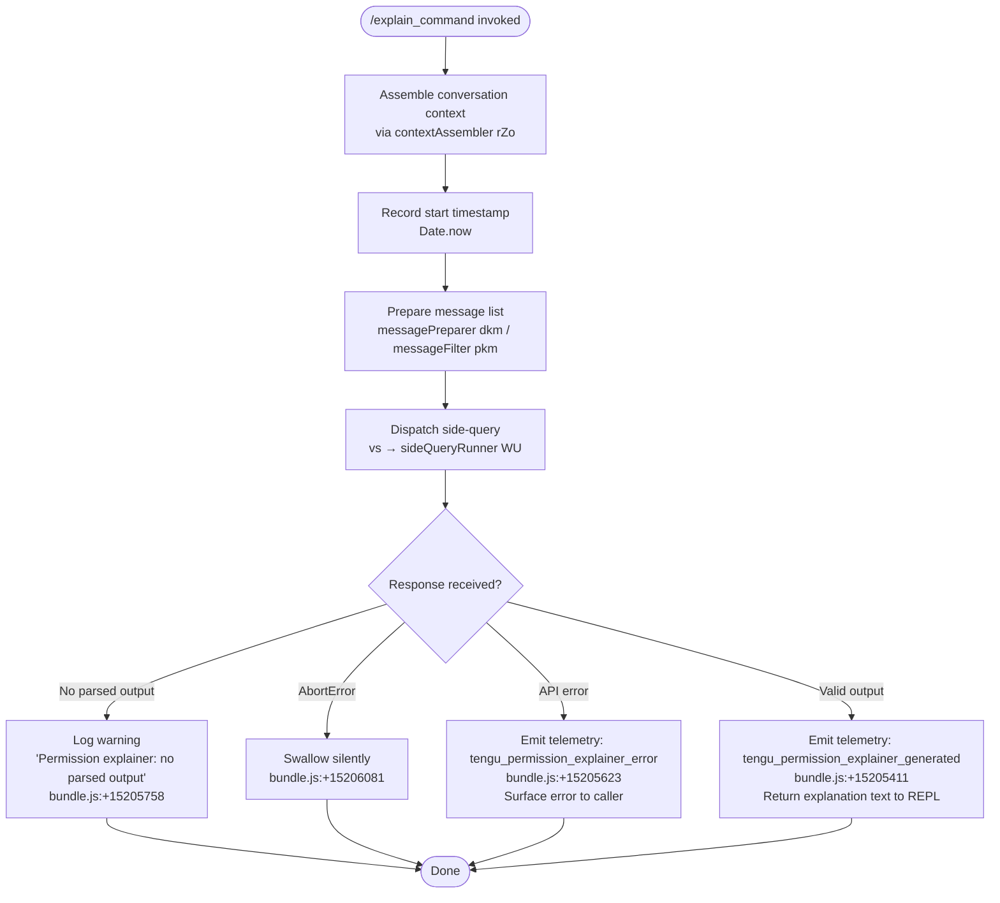

# `/explain_command`

> Analysis basis: CC v2.1.198 bundle.js (AST extraction + Claude interpretation)
> Minimum version: v2.1.198

---

## Overview

`/explain_command` is a `tool`-type slash command that invokes an AI-backed **permission explainer** sub-flow. When called, it assembles recent conversation context, dispatches a side-query to the model, and produces a human-readable explanation of why a particular tool invocation requires the permissions it does. The result is surfaced inline in the REPL without advancing the main conversation turn.

---

## Registration

| Field | Value |
|---|---|
| type | `tool` |
| name | `explain_command` |
| description | `null` (not set in registration object) |
| loc_byte | `15204928` |
| loc_byte_end | `15204964` |
| loc_line | `11641` |
| arbor_handler.name | `Pkc` |
| arbor_handler.fqn | `claude-2.1.198::Pkc` |
| arbor_handler.kind | `AsyncFunction` |
| arbor_handler.resolution_path | `direct` |
| arbor_handler.n_hits | `1` |

Analysis basis: CC v2.1.198 bundle.js:+15204928

The registration block spans bytes `(15204928, 15204964)`. The string literal `"explain_command"` appears at byte `+15204946` and the type literal `"tool"` at byte `+15204934`, both inside that range.

Additionally, the string `"permission_explainer"` appears at byte `+15204986`, and `"permission_explainer_generate"` at byte `+15205513`, confirming the internal subsystem label used for telemetry and logging.

---

## Input Branching

The handler exhibits four distinct execution paths depending on the outcome of the side-query and the shape of the response. A Mermaid flowchart is used accordingly.



---

## Behavioral Spec

### Main Handler — `permissionExplainerHandler` (bundle identifier: `Pkc`)

Analysis basis: CC v2.1.198 bundle.js:+15204623

```
async function permissionExplainerHandler(toolInput, appContext):
    # Step 1 — Collect conversation context
    context = assembleContext(appContext)          # rZo → Dt (config + history)

    # Step 2 — Timestamp the start of the request
    startTime = Date.now()                        # bundle.js:+15204647

    # Step 3 — Serialize recent messages
    #   Converts last N assistant messages to a condensed text form
    #   Truncation depth: 2 (literal at bundle.js:+15204148)
    #   Message limit window: 1000 (literal at bundle.js:+15204192)
    serialized = serializeMessages(context.messages)   # dkm: JSON.stringify + String cast

    # Step 4 — Filter and reverse message history
    #   Keeps only "assistant" role messages (literal at bundle.js:+15204227)
    #   Takes up to 3 most-recent (literal at bundle.js:+15204247)
    #   Appends ellipsis "..." truncation marker (literal at bundle.js:+15204423)
    filtered = filterAndReverseHistory(context.messages)  # pkm

    # Step 5 — Dispatch side-query (does NOT add to conversation history)
    response = await sideQueryRunner(             # vs → WU (bundle.js:+15204833, 15204846)
        messages      = filtered,
        systemContext = serialized,
        featureLabel  = "permission_explainer"    # bundle.js:+15204986
    )

    # Step 6 — Interpret response
    if response is null or has no parsed content:
        log("Permission explainer: no parsed output in response")  # bundle.js:+15205758
        return                                    # silent no-op

    if response.error is AbortError:              # bundle.js:+15206081
        return                                    # user-cancelled; swallow

    if response.error is api_error:               # literal at bundle.js:+15206152
        emit("tengu_permission_explainer_error")  # bundle.js:+15205623
        raise or surface error

    # Step 7 — Emit success telemetry and return explanation
    emit("tengu_permission_explainer_generated")  # bundle.js:+15205411
    return formatExplanation(response.content)    # Me + ukm (bundle.js:+15205219, 15205253)
```

### Context Assembly — `assembleContext` (bundle identifier: `rZo`)

Analysis basis: CC v2.1.198 bundle.js:+15204499

```
function assembleContext(appContext):
    config = loadConfig()          # Dt → SCt (reads project + global config)
    history = appContext.messages
    return { config, history }
```

### Config Loader — `configLoader` (bundle identifier: `Dt`)

Analysis basis: CC v2.1.198 bundle.js:+14253999

```
function configLoader():
    # Reads global config via synchronous file I/O
    raw = fileSystem.readFileSync(configPath, "utf-8")   # SCt → r.readFileSync; literal "utf-8" at +14257838
    parsed = jsonParse(raw)                              # Gt → JSON.parse
    # Watches for changes
    startFileWatcher(configPath)                         # qHm → QMt → A0s.watchFile
    return parsed
```

Guard: if config is accessed before the system is ready, throws with message `"Config accessed before allowed."` (literal at bundle.js:+14257755).

### Message Filter — `filterAndReverseHistory` (bundle identifier: `pkm`)

Analysis basis: CC v2.1.198 bundle.js:+15204204

```
function filterAndReverseHistory(messages):
    # Keep only "assistant" role entries
    assistantOnly = messages.filter(m => m.role == "assistant")
    # Reverse to get newest-first
    reversed = assistantOnly.reverse()
    # Take the top 3
    top3 = reversed.slice(0, 3)
    # Sanitize lone surrogates in text blocks
    sanitized = top3.map(m => sanitizeSurrogates(m))  # mI handles charCodeAt surrogate range 55296–56319 (literals at +205489, +205499)
    # Prepend "..." marker
    return ["..."].concat(sanitized)   # literal "..." at +15204423; r.unshift at +15204431
```

### Side-Query Dispatcher — `sideQueryRunner` (bundle identifier: `vs` → `WU`)

Analysis basis: CC v2.1.198 bundle.js:+2326347 (vs), +9297457 (WU)

```
async function sideQueryRunner(messages, systemContext, featureLabel):
    # Resolve authentication
    authToken = resolveAuth()         # xV → cE → pb
    # Build request headers including User-Agent, session IDs, etc.
    headers = buildHeaders()          # xV applies: "User-Agent", "X-Claude-Code-Session-Id",
                                      #  "x-client-app", etc. (literals at +3075193..+3075432)
    # The side-query uses the "side_query" feature label (literal at +9297502)
    # and the "structured_outputs" capability (literal at +9297630)

    response = await apiClient.post(messages, headers)   # nId → u_.post
    return response
```

Key numeric constraints observed in this path:

- Request timeout watchdog minimum: **15 000 ms** (literal at bundle.js:+3082877)
- Request timeout watchdog maximum: **120 000 ms** (literal at bundle.js:+3082895)
- Gateway session timeout: **600 000 ms** (literal at bundle.js:+3076120)
- Message column padding width: **40** characters (literal at bundle.js:+18405753)

---

## State & Side Effects

| Item | Detail |
|---|---|
| Telemetry — success | `tengu_permission_explainer_generated` (bundle.js:+15205411) |
| Telemetry — error | `tengu_permission_explainer_error` (bundle.js:+15205623) |
| Telemetry — stream watchdog | `tengu_stream_watchdog_default_on` (bundle.js:+3084636) |
| Telemetry — byte watchdog | `tengu_byte_watchdog_fired_late` (bundle.js:+3083928), `tengu_byte_stream_idle_timeout_ms` (bundle.js:+3082666) |
| Telemetry — config | `tengu_config_parse_error` (bundle.js:+14259169), `tengu_config_auth_loss_prevented` (bundle.js:+14252278) |
| Telemetry — lone surrogate | `tengu_lone_surrogate_sanitized` (bundle.js:+9298871) |
| Telemetry — API | `tengu_api_success` (bundle.js:+9299175) |
| Telemetry — feature flags | `tengu_feature_ok` (+1039573), `tengu_feature_bad` (+1039640), `tengu_feature_sad` (+1039721) |
| Side-query dispatch | Sends a **non-history** API call tagged `"side_query"` — does not advance the main conversation turn |
| File I/O | Config file read synchronously via `readFileSync`; backup directory accessed via `I7o` / `v7o` (bundle.js:+14258037, +14258448) |
| File watcher | Registered via `A0s.watchFile` (bundle.js:+1157718); unwatched via `i_c.unwatchFile` (bundle.js:+14253838) |
| appState changes | None confirmed at depth-2 traversal |
| Sound | <!-- TODO: not found in depth-2 traversal; needs --depth 4 --> |

---

## Version History

| Version | Change |
|---|---|
| v2.1.198 | Initial analysis |

---

## Common Mistakes

1. **Assuming the command advances conversation history.** `/explain_command` issues a *side-query* (tagged `"side_query"` at bundle.js:+9297502). The model response is never appended to the session message list.
2. **Expecting a description field.** The `description` field in the registration object is `null`; tooling that renders command help from this field will show nothing.
3. **Providing no context.** The command filters for `"assistant"` role messages and takes the three most recent. If none exist (e.g., at session start), the filtered list will be empty and the model will receive minimal context, likely producing a generic or unhelpful explanation.
4. **Confusing the abort behaviour.** An `AbortError` (bundle.js:+15206081) is silently swallowed — there is no user-visible indication that the request was cancelled. Do not treat silence as success.
5. **Triggering a config guard.** If `/explain_command` is invoked during startup before the config subsystem is ready, the loader throws `"Config accessed before allowed."` (bundle.js:+14257755). This is an internal guard, not a user-facing error string.

---

## Appendix — Identifier Mapping

> For bundle debugging only. Identifiers change across versions.

| Identifier | Role |
|---|---|
| `Pkc` | Main handler — `permissionExplainerHandler` (AsyncFunction) |
| `rZo` | Context assembler — collects config + message history |
| `Dt` | Config loader — reads and caches global/project config |
| `SCt` | Config file reader — synchronous read, backup, and parse |
| `zt` | Config path resolver |
| `A7o` | Config merge utility |
| `qHm` | File-watcher setup for config changes |
| `QMt` | Watch registration helper (`A0s.watchFile`) |
| `I7o` | Backup directory walker |
| `v7o` | Backup path joiner |
| `dkm` | Message serializer — JSON.stringify + String cast |
| `pkm` | Message filter/reverser — assistant-only, top-3, ellipsis prepend |
| `mI` | Surrogate-aware string slicer (charCode range 55296–56319) |
| `vs` | Side-query entry point |
| `w6` | Side-query builder |
| `WU` | API request dispatcher |
| `xV` | HTTP client core — headers, auth, retry |
| `cE` | Auth resolver (OAuth/API-key branch selector) |
| `pb` | Profile-based auth loader |
| `Pw` | API call executor with retry/backoff |
| `b$d` | Byte-stream watchdog (15 000 / 120 000 ms thresholds) |
| `nId` | HTTP POST to Anthropic API (`u_.post`) |
| `nl` | Prompt/model resolution pipeline |
| `Fo` | Model name normaliser (fable, sonnet, haiku, opus, best) |
| `A1t` | Model tier resolver |
| `QC` | Conversation compiler (system + human + assistant turns) |
| `x1t` | Message builder (roles, tool_use, tool_result blocks) |
| `L1t` | Legacy message stitcher |
| `L6r` | Request body assembler |
| `IH` | Instruction header injector |
| `hh` | Proxy / network routing helper |
| `x2r` | Proxy URL validator |
| `rV` | HTTP/HTTPS URL classifier |
| `oSn` | Proxy-auth helper runner (30 000 ms timeout literal at +1893007) |
| `Sxe` | WIF (Workload Identity Federation) token exchange |
| `_st` | WIF HTTP fetch (AbortSignal.timeout, `https://api.anthropic.com`) |
| `I$d` | Request metadata tracker (UUID, chunk times, verbose logging) |
| `H7r` | Numeric bound clamp (Number.isFinite, Math.min/max) |
| `C$d` | Header sanitiser (`authorization` → `<opaque>`, `anthropic-beta`) |
| `Gs` | Custom OAuth URL validator (staging / prod allow-list) |
| `Oae` | Vertex AI endpoint resolver |
| `Re` | Structured logger (push to ring buffer `Bmn`) |
| `T` | Low-level output writer (`o.write` / `o.flush`) |
| `Me` | JSON.stringify wrapper |
| `Wi` | MCP tool type guard (`mcp_tool` literal at +3372606) |
| `ukm` | Explanation formatter |
| `he` | String coercer (String() wrapper) |
| `gd` | Error encoder |
| `st` | String primitive coercer |
| `mr` | React/render helper |
| `Fm` | Feature-flag reader |
| `Ke` | UI component: generic container |
| `Pe` | UI component: text renderer |
| `Le` | UI component: secondary text |
| `xe` | UI component: primary text |
| `St` | UI component: status line |
| `Um` | UI component: message block |
| `Do` | UI component: output pane |
| `nt` | Notification / event bus dispatcher |
| `dis` | Daemon IPC — send-claim to background worker |
| `gis` | Background session lifecycle manager |
| `g` | Daemon background session host |
| `EGe` | Filesystem cleanup helper (lstat / rm / readdir) |
| `VZ` | Background worker state reader |
| `Zi` | File-state watcher for background sessions |
| `N` | Background worker pool sweeper |
| `Nn` | Filter helper for worker pool |
| `aMn` | Notification deduplicator |
| `tG` | Token-based timer gate |
| `z` | Worker pool state manager |
| `Qxn` | Context resolver for side-query |
| `y$d` | Side-query context builder |
| `CZe` | Context fragment extractor |
| `bGr` | Foundry resource tag resolver |
| `TGr` | Foundry resource name normaliser |
| `Exe` | Gateway JWT refresh executor |
| `nId` | Gateway refresh HTTP poster |
| `pTr` | Timestamp utility (Date.now wrapper) |
| `FFt` | Response header lowercaser |
| `u0e` | SDK error logger (`[Anthropic SDK ERROR]`) |
| `ZIn` | AsyncLocalStorage store accessor (`mpi.getStore`) |
| `D6r` | URL encoder (encodeURIComponent) |
| `_0n` | OAuth token refresher |
| `Fh` | Token lifecycle manager |
| `hpi` | Boolean coercer |
| `wd` | Retry-with-backoff helper |
| `wc` | Response status classifier |
| `dI` | Request deduplicator |
| `e$t` | Request error handler |
| `Zit` | HTTP status gate (`$8` literal) |
| `Git` | Request telemetry recorder (IRi / HRi) |
| `_$d` | Request pipeline orchestrator |
| `hr` | Host resolution helper |
| `qM` | Proxy credentials resolver |
| `hw` | Proxy auth runner (`Iwe`) |
| `I3` | AWS region resolver (`J3u`, `zBe`) |
| `T$d` | Token store factory (`$ki`, `Nki`) |
| `Bki` | Token persistence writer (`fu`) |
| `Gki` | Token persistence reader |
| `$ki` | Keychain-backed token store |
| `Uh` | Auth-provider selector (`UOt`, `sEd`, `sV`) |
| `sV` | Auth-method lowercaser (bedrock / vertex / anthropicAws) |
| `sEd` | Auth-prefix stripper (`anthropic.` prefix) |
| `IN` | Auth injector |
| `u5e` | Auth capability checker |
| `so` | Model-scoped auth resolver |
| `p_` | Model string normaliser (lowercase, prefix strip) |
| `nce` | Managed-settings cache (`JLt`, `TGr`) |
| `CGr` | Foundry resource matcher (`Mfi`) |
| `IGr` | Managed-settings policy resolver |
| `ave` | API latency accumulator |
| `X3t` | Cache-control helper (`uta`, `Aut`, `Y3t`) |
| `a2` | Agent-URI resolver (`vsp`, `tO`, `aJr`) |
| `WLt` | Cache-write finisher |
| `eko` | Session-ID hasher (`ifl.createHash`) |
| `tCn` | Session context injector |
| `FMn` | Final message formatter |
| `cKe` | Capability-set evaluator (`Eo`, `zTr`, `YTr`) |
| `Eo` | Claude API client constructor |
| `U3` | Feature-array validator |
| `nR` | Network-routing selector (`x7r`, `c5e`) |
| `pV` | HIPAA-mode checker (`Xot.includes`) |
| `lfl` | Message list flattener |
| `xw` | Tool-result mapper |
| `IMe` | Inference-mode resolver (`z6`, `Fc`) |
| `z6` | Random-bytes session ID generator |
| `_n` | Agent session initialiser |
| `Fc` | API-client factory (`cE`, `Dt`) |
| `eun` | Content-block expander |
| `Qcn` | Content-type checker (`diu.test`) |
| `LP` | Deep-clone helper (`structuredClone`) |
| `XZe` | Content-block normaliser (`Zcn`) |
| `Zcn` | Text-block replacer (`Nps`) |
| `s0n` | Side-query options builder |
| `ghf` | Feature-flag finder |
| `Wi` | MCP tool guard |
| `St` | Status-line renderer |

---

Note: index built via Arbor fallback; some signals (telemetry, literals) may be missing — see arbor-fallback.js.