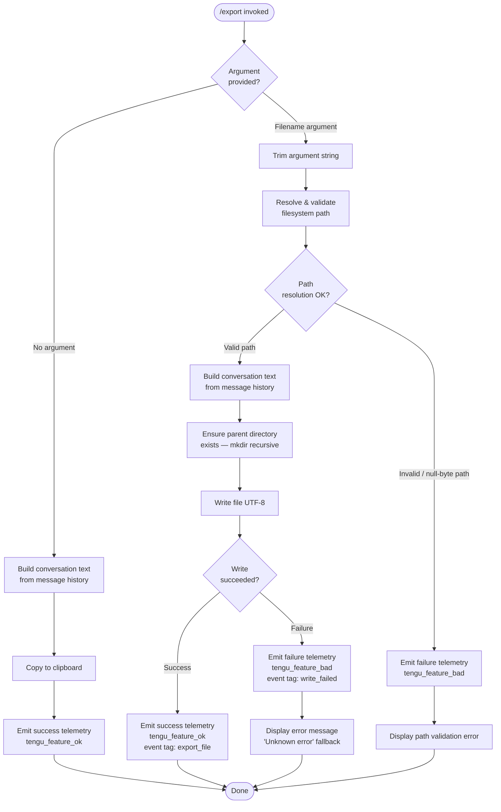

# `/export`

> Analysis basis: CC v2.1.198 bundle.js (AST extraction + Claude interpretation)
> Minimum version: v2.1.198

---

## Overview

The `/export` command serializes the current conversation history to either a file on disk or the clipboard, depending on whether the user supplies an optional filename argument. The command renders each message turn (user and assistant) into a plain-text representation, strips ANSI escape codes, and then either writes the result to a resolved filesystem path or copies it to the system clipboard.

---

## Registration

| Field | Value |
|---|---|
| type | `local-jsx` |
| name | `export` |
| description | `Export the current conversation to a file or clipboard` |
| argumentHint | `[filename]` |
| module_id | `eac` |
| load_inline | `true` |
| loc_byte | `13281506` |
| loc_byte_end | `13281702` |
| loc_line | `9086` |
| arbor_handler.name | `zom` |
| arbor_handler.fqn | `claude-2.1.198::zom` |
| arbor_handler.kind | `AsyncFunction` |
| arbor_handler.resolution_path | `module_id` |
| arbor_handler.n_hits | `0` |

Analysis basis: CC v2.1.198 bundle.js:+13281506

---

## Input Branching

The command has three distinct branches depending on argument presence and path resolution outcome, so a flowchart is used.



Analysis basis: CC v2.1.198 bundle.js:+13281005 (export_file branch), +13281068 (write_failed branch), +13281166 (Unknown error fallback)

---

## Behavioral Spec

### 1. Handler Entry Point (`zom`)

The primary handler is the `AsyncFunction` resolved by Arbor as `zom` (fqn `claude-2.1.198::zom`), reached via the `module_id` resolution path through module `eac`.

```
async function exportHandler(args, appContext):
    rawArg = args.trim()                        # bundle.js:+13280965

    conversationText = buildConversationText(appContext.messages)

    if rawArg is empty:
        copyToClipboard(conversationText)
        emitTelemetry("tengu_feature_ok", {})   # bundle.js:+13281005
        renderSuccess("Copied to clipboard")
        return

    resolvedPath = resolveAndValidatePath(rawArg)
    if resolvedPath is error:
        emitTelemetry("tengu_feature_bad", {})  # bundle.js:+13281068
        renderError(resolvedPath.message)
        return

    try:
        writeConversationFile(resolvedPath, conversationText)
        emitTelemetry("tengu_feature_ok", { tag: "export_file" })  # bundle.js:+13281008
        renderSuccess("Exported to " + resolvedPath)
    catch error:
        message = error.message ?? "Unknown error"   # bundle.js:+13281166
        emitTelemetry("tengu_feature_bad", { tag: "write_failed" })  # bundle.js:+13281085
        renderError(message)
```

Analysis basis: CC v2.1.198 bundle.js:+13280956 (`zom` → `Kom` edge), +13280996 (`zom` → `sdr` edge)

---

### 2. Conversation Text Builder (`idr` / `Vom`)

This sub-routine iterates over the conversation message list and converts each turn into a plain-text string, then strips ANSI codes from the combined output.

```
function buildConversationText(messages):
    lines = []
    for each message in messages:
        role = message.role          # "user" or "assistant" (bundle.js:+13280459, +13279078)
        formatted = formatSingleMessage(message)   # Vom
        lines.push(formatted)
        lines.push(stripANSI(formatted))           # Oi → Bun.stripANSI (bundle.js:+4018462)
    return lines.join("\n")                        # bundle.js:+13279954
```

#### 2a. Single Message Formatter (`Vom`)

```
function formatSingleMessage(message):
    header = renderMessageHeader(message)          # Wom
    body   = renderMessageBody(message)            # SK (handles plan/convo/none modes)
    return combineHeaderAndBody(header, body)
```

The body renderer (`SK`) distinguishes between message display modes, including `"plan"`, `"default"`, `"none"`, `"convo"`, and `"connecting"` states.

Analysis basis: CC v2.1.198 bundle.js:+13279334 (`Vom` → `Wom`), +13279349 (`Vom` → `SK`), +8071932 (`"plan"`), +8072239 (`"convo"`)

#### 2b. Text Content Extraction (`Qic`)

For each message block, the text content extractor:

1. Searches the content array for an entry where `role === "user"` (bundle.js:+13280459) using `Array.find`.
2. Trims whitespace from the candidate string (bundle.js:+13280554).
3. Checks if the content is an array; if so, finds the sub-item whose `type === "text"` (bundle.js:+13280616).
4. Applies a substring truncation — the constant `50` (bundle.js:+13280677) and `49` (bundle.js:+13280696) appear as offsets/limits in the excerpt logic.
5. Normalizes the result through `Ld` → `ii`, which uses `indexOf` and `slice` to trim leading/trailing markup (bundle.js:+206669, +206698).

```
function extractTextSnippet(contentBlock):
    candidate = contentBlock.find(item => item.role === "user")
    trimmed   = candidate?.trim()
    if Array.isArray(trimmed):
        textItem = trimmed.find(item => item.type === "text")
        raw = textItem?.value ?? ""
    else:
        raw = trimmed ?? ""
    excerpt = normalizeExcerpt(raw, maxLen=50)    # bundle.js:+13280677
    return excerpt.substring(0, 49)               # bundle.js:+13280696
```

Analysis basis: CC v2.1.198 bundle.js:+13280438 (`Qic` → `e.find`), +13280571 (`Array.isArray`), +13280662 (`Qic` → `Ld`)

---

### 3. Timestamp Formatter (`qom`)

A utility generates a filesystem-safe timestamp for use in default filenames or metadata.

```
function formatTimestamp(date):
    year    = String(date.getFullYear())                          # bundle.js:+13280164
    month   = String(date.getMonth() + 1).padStart(2, "0")       # bundle.js:+13280189
    day     = String(date.getDate()).padStart(2, "0")             # bundle.js:+13280230
    hours   = String(date.getHours()).padStart(2, "0")            # bundle.js:+13280268
    minutes = String(date.getMinutes()).padStart(2, "0")          # bundle.js:+13280307
    seconds = String(date.getSeconds()).padStart(2, "0")          # bundle.js:+13280348
    return year + month + day + "T" + hours + minutes + seconds
```

Analysis basis: CC v2.1.198 bundle.js:+13281221 (`zom` → `qom`)

---

### 4. Filename Normalization (`Zic`)

Before path resolution, the raw filename argument is lowercased.

```
function normalizeFilename(raw):
    return raw.toLowerCase()    # bundle.js:+13280741
```

Analysis basis: CC v2.1.198 bundle.js:+13281249 (`zom` → `Zic`)

---

### 5. Path Resolution and Validation (`us` via `Bom` / `sdr`)

The path resolver applies a sequence of safety checks before accepting a path:

```
function resolveAndValidatePath(rawPath):
    if rawPath includes null byte:
        raise Error("Path contains null bytes")    # bundle.js:+1104887

    normalized = path.normalize(NFC(rawPath))      # NFC normalization: bundle.js:+67679
    home = os.homedir()                            # bundle.js:+1104984

    if normalized.startsWith("~/"):
        normalized = path.join(home, normalized.slice(2))   # bundle.js:+1105031, +1105053

    if platform is "windows":                      # bundle.js:+1105084
        # apply Windows-specific path normalization
        pass

    if path.isAbsolute(normalized):
        return path.resolve(normalized)            # bundle.js:+1105198
    else:
        return path.resolve(cwd, normalized)
```

The file-write helper (`sdr`) then:
1. Calls `path.extname` to inspect the extension (bundle.js:+13276286).
2. Resolves the destination path (via `Bom`, bundle.js:+13276405).
3. Creates the parent directory recursively with `fs.mkdir` (bundle.js:+13276425).
4. Writes the file content using `fs.writeFile` with encoding `"utf-8"` (bundle.js:+13276472, +13276500).

Analysis basis: CC v2.1.198 bundle.js:+13276405 (`sdr` → `Bom`), +13276425 (`sdr` → `rdr.mkdir`), +13276472 (`sdr` → `rdr.writeFile`)

---

### 6. Clipboard Export Path

When no filename argument is provided, the conversation text is written to the clipboard via `xe` (clipboard write utility).

```
function copyToClipboard(text):
    result = clipboardWrite(text)          # xe → V, Pe (bundle.js:+13281005)
    if result.ok:
        emitTelemetry("tengu_feature_ok")  # bundle.js:+1039573
    else:
        emitTelemetry("tengu_feature_bad") # bundle.js:+1039640
```

Analysis basis: CC v2.1.198 bundle.js:+13281005 (`zom` → `xe`)

---

## State & Side Effects

| Item | Detail |
|---|---|
| Telemetry | `tengu_feature_ok` (bundle.js:+1039573) — emitted on successful clipboard write or file write |
| Telemetry | `tengu_feature_bad` (bundle.js:+1039640) — emitted on clipboard failure, path validation failure, or file write failure |
| Telemetry tags | `"export_file"` (bundle.js:+13281008) on file-write success; `"write_failed"` (bundle.js:+13281085) on file-write failure |
| Filesystem | Creates parent directory recursively (`fs.mkdir`) and writes file with `utf-8` encoding (bundle.js:+13276425, +13276472) |
| Clipboard | Writes serialized conversation text to system clipboard when no filename is given |
| ANSI stripping | `Bun.stripANSI` is applied to remove terminal escape codes before export (bundle.js:+4018462) |
| Error fallback | Error message defaults to `"Unknown error"` when the thrown error has no `.message` property (bundle.js:+13281166) |
| Process exit | Fatal CLI errors within the error reporter (`As`) may call `process.exit(1)` (bundle.js:+13219816, literal `1` at +13219829) |
| appState changes | None detected at depth-2 traversal |
| Sound | None detected at depth-2 traversal |

---

## Version History

| Version | Change |
|---|---|
| v2.1.198 | Initial analysis |

---

## Common Mistakes

1. **Omitting the filename** when intending file export — without an argument the output goes to the clipboard, not disk, with no warning.
2. **Providing a path with null bytes** — the path validator will reject it with `"Path contains null bytes"` before any I/O occurs (bundle.js:+1104887).
3. **Supplying a relative path from a different working directory** — paths are resolved relative to the process CWD, not the project root; use an absolute path or `~/`-prefixed path to be explicit.
4. **Expecting ANSI color codes in the output** — the exporter strips all ANSI escape sequences via `Bun.stripANSI` (bundle.js:+4018462), so the file/clipboard content will always be plain text.
5. **Assuming the parent directory already exists** — the command creates intermediate directories automatically, but write permission on the parent is still required.

---

## Appendix — Identifier Mapping

> For bundle debugging only. Identifiers change across versions.

| Identifier | Role |
|---|---|
| `zom` | Main async export handler (Arbor-resolved entry point) |
| `Kom` | Intermediate coordinator called by `zom`; dispatches to `idr` |
| `idr` | Conversation text assembler; iterates messages, pushes lines, joins result |
| `Vom` | Single-message formatter; delegates to header renderer (`Wom`) and body renderer (`SK`) |
| `Wom` | Message header renderer |
| `SK` | Message body renderer; branches on display mode (`plan`, `convo`, `none`, `default`, `connecting`) |
| `v_t` | Inline JSX component helper used during message rendering |
| `jom` | Array-check helper within message formatter |
| `Qic` | Text-content extractor; finds `"user"` role entries and `"text"` type sub-items |
| `Zic` | Filename normalizer; lowercases the raw argument |
| `qom` | Timestamp formatter; produces `YYYYMMDDTHHmmss` strings |
| `sdr` | File-write orchestrator; resolves path, creates directory, writes UTF-8 file |
| `Bom` | Path extension inspector and write-mode selector |
| `idr` | Conversation line accumulator (also listed under assembler above) |
| `Oi` | ANSI-stripping wrapper around `Bun.stripANSI` |
| `c` | Session state helper accessed during message rendering; checks `"stopped"` / `"background session"` states |
| `xe` | Clipboard write dispatcher; emits `tengu_feature_ok` on success |
| `Le` | Clipboard failure handler; emits `tengu_feature_bad` |
| `V` | Internal clipboard write primitive called by `xe` |
| `Pe` | Internal clipboard result evaluator called by `xe`/`Le` |
| `OQe` | Low-level clipboard implementation |
| `us` | Path resolution and security validation utility |
| `Pt` | Path construction helper used by `us` |
| `zt` | Platform detection utility used within `us` |
| `yH` | Unicode NFC normalizer for filesystem paths |
| `ar` | Sync-write helper used within `Bom` path |
| `sw` | Low-level synchronous write primitive |
| `Ld` | Excerpt normalizer; delegates to `ii` for index/slice operations |
| `ii` | String excerpt utility using `indexOf` + `slice` |
| `As` | Fatal error reporter; may invoke `process.exit(1)` |
| `SK` | Permission/mode checker (also body renderer above; appears in two contexts) |

Note: index built via Arbor fallback; some signals (telemetry, literals) may be missing — see arbor-fallback.js.