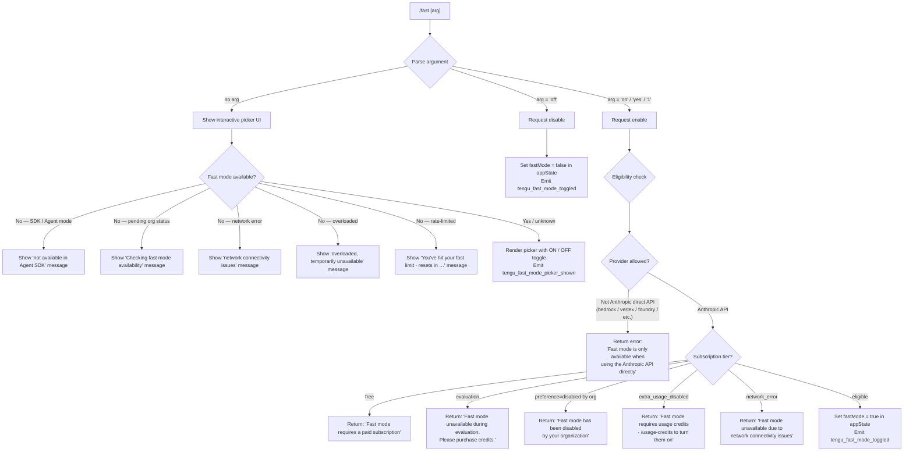

# `/fast`

> Analysis basis: CC v2.1.198 bundle.js (AST extraction + Claude interpretation)
> Minimum version: v2.1.198

---

## Overview

The `/fast` command toggles "Fast mode" (also described in-UI as a "research preview"), which switches Claude Code to a performance-optimized inference path when the user's account and environment are eligible. The command accepts an optional `[on|off]` argument for explicit setting, and falls back to an interactive picker UI when no argument is supplied. Eligibility is gated by API provider, subscription tier, organization policy, and real-time network availability.

---

## Registration

| Field | Value |
|---|---|
| type | `local-jsx` |
| name | `fast` |
| description | `Toggle fast mode ( ... )` |
| argumentHint | `[on\|off]` |
| immediate | `null` |
| thinClientDispatch | `control-request` |
| isHidden | `null` |
| module_id | `Tnc` |
| load_inline | `true` |
| loc_byte | `13026633` |
| loc_byte_end | `13026905` |
| loc_line | `8867` |
| arbor_handler.name | `stm` |
| arbor_handler.fqn | `claude-2.1.198::stm` |
| arbor_handler.kind | `AsyncFunction` |
| arbor_handler.resolution_path | `module_id` |
| arbor_handler.n_hits | `3` |

Analysis basis: CC v2.1.198 bundle.js:+13026633

---

## Input Branching

There are 5+ distinct branches driven by argument value and eligibility state, so a Mermaid flowchart is used.



Analysis basis: CC v2.1.198 bundle.js:+13025638 (handler `stm`), +2306446 (eligibility router `Yle`), +2306478 (provider check), +2305971 (free tier), +2306129 (org disabled), +2306213 (extra usage), +2306310 (network error), +2306893 (Agent SDK), +13024850 (overloaded), +13024904 (rate limit)

---

## Behavioral Spec

### 1. Main Handler (`stm` / `fastCommandHandler`)

```
async function fastCommandHandler(commandContext):
    arg = commandContext.args.trim().toLowerCase()

    // Resolve provider and run prefetch
    providerInfo = resolveProvider()          // calls lc → mr
    normalizedArg = normalizeArgument(arg)    // calls e → t.replace

    // Branch: explicit on/off vs. interactive
    if normalizedArg == "off":
        disableFastMode(commandContext)       // calls dur with off path
    else:
        eligibilityState = checkFastEligibility()  // calls Yle
        if normalizedArg in ["on", "yes", "1"]:
            applyEligibilityOrError(eligibilityState, commandContext)
        else:
            showPickerUI(eligibilityState, commandContext)  // calls Qot → pur

    return JSX result
```

Analysis basis: CC v2.1.198 bundle.js:+13025638 (`stm`), +13025700 (`Qot`), +13025772 (`dur`), +13025876 (JSX return)

---

### 2. Eligibility Gate (`Yle` / `fastModeEligibilityRouter`)

```
function fastModeEligibilityRouter(context):
    provider = getProviderType()   // lc → mr → Fm/st

    // Provider must be first-party Anthropic API
    if provider not in ["gateway", "firstParty"]:
        if provider in ["bedrock", "vertex", "foundry",
                        "anthropicAws", "mantle"]:
            return { available: false,
                     reason: "only available when using the Anthropic API directly" }

    // Check Agent SDK mode
    if runningInAgentSDK():
        emit telemetry: tengu_penguins_off
        return { available: false,
                 reason: "Fast mode is not available in the Agent SDK" }

    // Fetch org/account status (may be cached)
    status = fetchOrGetCachedFastModeStatus()   // calls nt → aMn
    return buildEligibilityResult(status)
```

Analysis basis: CC v2.1.198 bundle.js:+2306446 (`Yle`), +2171424 (provider constants), +2306478 ("only available" literal), +2306546 ("not available" literal), +2306584 (`tengu_penguins_off`)

---

### 3. Eligibility Status Mapping (`buildEligibilityResult`)

```
function buildEligibilityResult(orgStatus):
    switch orgStatus.tier:
        case "free":
            return unavailable("Fast mode requires a paid subscription")
        case "evaluation" (non-paid trial):
            return unavailable("Fast mode unavailable during evaluation. Please purchase credits.")
        case "preference" = disabled:
            return unavailable("Fast mode has been disabled by your organization")
        case "extra_usage_disabled":
            return unavailable("Fast mode requires usage credits · /usage-credits to turn them on")
        case "network_error":
            emit tengu_org_penguin_mode_fetch_failed
            return unavailable("Fast mode unavailable due to network connectivity issues")
        case "pending":
            return pending("Checking fast mode availability (org status pending)")
        default:
            return available()
```

Analysis basis: CC v2.1.198 bundle.js:+2305971 (free), +2306038 (evaluation), +2306129 (org disabled), +2306213 (extra_usage_disabled), +2306310 (network error), +2307024 (pending), +2312239 (`tengu_org_penguin_mode_fetch_failed`)

---

### 4. Prefetch / Cache Logic (`Qot` / `fastModePrefetchOrCache`)

```
async function fastModePrefetchOrCache(context):
    // If in-flight promise exists, return it immediately
    if prefetchInFlight:
        log("Fast mode prefetch in progress, returning in-flight promise")
        return inFlightPromise

    // If fetched recently, skip
    if timeSinceLastFetch < THRESHOLD:
        log("Skipping fast mode prefetch, fetched recently")
        return cachedResult

    // Auth check
    auth = getAuthCredentials()       // Mbd → Gs; checks provider+tokens
    if not auth:
        return error("No auth available")

    // Network fetch with axios; handle HTTP errors
    try:
        result = await fetchFastModeStatus(auth)   // f6r → lc → PIn → Dt
        if result.statusCode == 401 or 403:
            handleOAuthError(result)
        recordTimestamp(Date.now())
        cacheResult(result)
        emit p6r event
        return result
    catch AxiosError:
        return networkErrorResult()
    catch other:
        raise
```

Analysis basis: CC v2.1.198 bundle.js:+2310730 (`Qot`), +2310819 (in-flight log), +2311067 (skip-recent log), +2311243 ("No auth available"), +2311378 (401), +2311404 (403), +2311870 (`p6r.emit`)

---

### 5. Interactive Picker UI (`pur` / `fastModePickerComponent`)

The picker is a React/Ink JSX component rendered inline.

```
function fastModePickerComponent(eligibilityState, onDone):
    emit telemetry: tengu_fast_mode_picker_shown

    // Render header: " Fast mode (research preview)"
    renderRow(label="Fast mode", value= eligibilityState.enabled ? "ON " : "OFF")

    // Render status sub-line
    if eligibilityState.overloaded:
        renderSubline("Fast mode overloaded and is temporarily unavailable")
    else if eligibilityState.rateLimited:
        resetTime = formatCountdown(eligibilityState.resetAt)
        renderSubline("You've hit your fast limit · resets in " + resetTime)

    // Key bindings
    on key "tab"    → toggle ON/OFF selection
    on key "enter"  → confirm selection, call onDone
    on key "escape" → cancel, call onDone with no change

    // If confirmed OFF while currently OFF:
    //   show "Kept Fast mode OFF" (system notification)
    // If toggled to OFF:
    //   show "Fast mode OFF" (notification)

    // Documentation link always shown:
    // https://code.claude.com/docs/en/fast-mode
```

Analysis basis: CC v2.1.198 bundle.js:+13025878 (`tengu_fast_mode_picker_shown`), +13023959 (" Fast mode (research preview)"), +13024609 ("Fast mode"), +13024677 ("ON "), +13024683 ("OFF"), +13024850 (overloaded), +13024904 (rate-limit), +13024933 (" · resets in "), +13024210 (tab/toggle), +13024251 (enter/confirm), +13024144 (escape/cancel), +13022281 ("Fast mode OFF"), +13023366 ("Kept Fast mode OFF"), +13025119 (docs URL)

---

### 6. Toggle Application (`dur` / `fastModeApplyToggle`)

```
function fastModeApplyToggle(targetState, eligibilityState, context):
    // If arg == "off", bypass eligibility and disable immediately
    if targetState == "off":
        updateAppState({ fastMode: false })
        emit telemetry: tengu_fast_mode_toggled
        showNotification("Fast mode OFF")
        return

    // For explicit "on": re-validate eligibility
    applyFlagSettings(eligibilityState)   // uur → apply_flag_settings

    // Check opus-4-7 deprecation flag
    if flag "opus47-fast-mode-deprecation" active:
        handleDeprecationWarning()         // XWo → Ddi

    updateAppState({ fastMode: true })
    emit telemetry: tengu_fast_mode_toggled
```

Analysis basis: CC v2.1.198 bundle.js:+13025753 ("off" literal), +13021998 (`tengu_fast_mode_toggled`), +13021582 ("apply_flag_settings"), +13021379 ("opus47-fast-mode-deprecation"), +13022281 ("Fast mode OFF")

---

### 7. Opus 4.7 Deprecation / Cooldown Handling (`Ddi` / `fastModeDeprecationCheck`)

```
function fastModeDeprecationCheck(context):
    // Dates involved: 2026-07-25 cutoff
    cutoffDate = Date.parse("2026-07-25")
    now = Date.now()

    if now >= cutoffDate and modelIsOpus47(context):
        // Opus 4.7 fast mode is being sunset
        emit telemetry: tengu_sunset_penguin_opus47
        // Redirect or warn; model identifiers checked:
        //   "claude-opus-4-7", "opus-4-7"
        //   "claude-opus-4-8" is the successor
    
    // Cooldown sub-case
    if fastModeState == "cooldown":
        log("Fast mode cooldown expired, re-enabling fast mode")
```

Analysis basis: CC v2.1.198 bundle.js:+2308027 (`tengu_sunset_penguin_opus47`), +2308057 ("2026-07-25"), +2307988 ("claude-opus-4-7"), +2307947 ("opus-4-8"), +13022141 ("claude-opus-4-8"), +2308256 ("cooldown"), +2308309 (cooldown-expired log)

---

## State & Side Effects

| Item | Detail |
|---|---|
| Telemetry: `tengu_fast_mode_toggled` | Fired on every explicit enable or disable (bundle.js:+13021998) |
| Telemetry: `tengu_fast_mode_picker_shown` | Fired when the interactive picker UI is rendered (bundle.js:+13025878) |
| Telemetry: `tengu_penguins_off` | Fired when fast mode is blocked because the Agent SDK is in use (bundle.js:+2306584) |
| Telemetry: `tengu_org_penguin_mode_fetch_failed` | Fired when the org status network fetch fails (bundle.js:+2312239) |
| Telemetry: `tengu_sunset_penguin_opus47` | Fired when the Opus 4.7 fast-mode deprecation path is hit (bundle.js:+2308027) |
| Telemetry: `tengu_config_parse_error` | Fired on config file parse failure in the config persistence layer (bundle.js:+14259169) |
| Telemetry: `tengu_config_lock_contention` | Fired when config lock acquisition exceeds expected time (bundle.js:+14255436) |
| Telemetry: `tengu_config_stale_write` | Fired when config write detects a stale re-read (bundle.js:+14255572) |
| Telemetry: `tengu_config_auto_repaired` | Fired when config file is auto-repaired from cache (bundle.js:+14255949) |
| Telemetry: `tengu_config_auth_loss_prevented` | Fired when a config write is refused to prevent auth wipe (bundle.js:+14256279) |
| Telemetry: `tengu_config_fallback_write` | Fired when config write falls back to an alternate path (bundle.js:+14255052) |
| Telemetry: `tengu_oauth_401_*` (multiple) | Fired for OAuth 401 recovery paths during fast mode status fetch (bundle.js:+3129529 et al.) |
| Telemetry: `tengu_feature_ok` / `tengu_feature_bad` / `tengu_feature_sad` | Fired by the feature flag subsystem (bundle.js:+1039573, +1039640, +1039721) |
| appState changes | `fastMode` boolean toggled in app state; `flagSettings` key updated (bundle.js:+13021061 "fastMode", +2306831 "flagSettings") |
| Hook registration | `Go` (keyboard handler registrar) calls `o.registerHandler` for picker key bindings: tab=toggle, enter=confirm, escape=cancel (bundle.js:+4271199) |
| Event emission | `p6r.emit` after status fetch; `Odi.emit` on fast mode state change for downstream listeners (bundle.js:+2311870, +2308369) |
| thinClientDispatch | `"control-request"` — the command is dispatched as a control request in thin-client (proxy) environments (registration field) |
| Config persistence | `fastMode` setting may be written to `~/.claude.json` via `saveConfigWithLock` / `saveGlobalConfig` paths; backup rotation is performed (up to 5 backups) (bundle.js:+14256740) |
| Notification | "Fast mode OFF" and "Kept Fast mode OFF" system notifications rendered via the notification subsystem (bundle.js:+13022281, +13023366) |
| Sound | <!-- TODO: not found in depth-2 traversal; needs --depth 4 --> |

---

## Version History

| Version | Change |
|---|---|
| v2.1.198 | Initial analysis. Interactive picker UI, `[on\|off]` argument support, Opus 4.7 deprecation path (cutoff 2026-07-25), Agent SDK gating, provider gating, org-policy gating, cooldown/rate-limit display, docs link at https://code.claude.com/docs/en/fast-mode |

---

## Common Mistakes

1. **Using `/fast on` on a non-Anthropic provider**: Fast mode is only available with the direct Anthropic API. Attempts via AWS Bedrock, Google Vertex AI, Azure Foundry, or other providers return an immediate error message rather than toggling the setting.
2. **Expecting `/fast on` to work on a free-tier account**: The command will display "Fast mode requires a paid subscription" and will not enable the feature.
3. **Using `/fast on` when the org has disabled it**: Organization-level policy (`preference=disabled`) overrides user intent; the command returns "Fast mode has been disabled by your organization" and takes no action.
4. **Invoking `/fast` inside Agent SDK / tool-use context**: The Agent SDK path explicitly blocks Fast mode with a dedicated message ("Fast mode is not available in the Agent SDK") and fires `tengu_penguins_off` telemetry.
5. **Expecting immediate availability after extra usage credits**: The `extra_usage_disabled` state is resolved via `/usage-credits`, not via `/fast` directly; `/fast on` will show the appropriate guidance message in this state.
6. **Ignoring the Opus 4.7 deprecation warning**: Starting 2026-07-25, fast mode on model `claude-opus-4-7` enters a sunset path. Users should migrate to `claude-opus-4-8` or later.
7. **Assuming the toggle is synchronous**: The handler is an `AsyncFunction` (`stm`) and the org status is fetched over the network on first invocation; there is an in-flight promise deduplication mechanism — rapid repeated calls will share a single network request.

---

## Appendix — Identifier Mapping

> For bundle debugging only. Identifiers change across versions.

| Identifier | Role |
|---|---|
| `stm` | Main async handler for `/fast` (arbor_handler, `claude-2.1.198::stm`) |
| `lc` | Provider type resolver (called from handler and eligibility router) |
| `mr` | Provider constant lookup / matching utility |
| `Fm` | Provider string "gateway" constant holder |
| `st` | String coercion / toString utility |
| `Yle` | Fast mode eligibility router (checks provider, SDK mode, org status) |
| `nt` | Org/account status cache accessor |
| `n2t` | Cache read sub-function (org status) |
| `r2t` | Cache write sub-function (org status) |
| `tG` | Experiment/flag gate check |
| `eG` | Growthbook experiment event emitter |
| `aMn` | Active org status fetcher with deduplication |
| `FJr` | Growthbook experiment dispatcher (emits GrowthbookExperimentEvent) |
| `qJr` | Network request runner for org status endpoint |
| `Dt` | Config reader (reads from disk, coordinates with lock) |
| `zt` | File system path resolver |
| `A7o` | Config directory path builder |
| `SCt` | Config file reader with backup rotation (up to 5 backups) |
| `qHm` | Config file watcher / unwatcher |
| `T` | Logger / debug output helper |
| `Hiu` | Debug-mode check wrapper |
| `cus` | Terminal output stream selector |
| `Me` | JSON serializer wrapper |
| `Oc` | API key / credential redactor (`[REDACTED]`) |
| `Kps` | Credential masking list builder |
| `YZe` | Output writer coordinator |
| `Ops` | Raw stream write helper |
| `biu` | Session log file writer (batched, with `setTimeout`/`setImmediate`) |
| `AZe` | Batched write scheduler (debounces with `clearTimeout`/`setTimeout`) |
| `jae` | Log directory resolver |
| `Siu` | Async file append handler (mkdir + appendFile) |
| `Si` | Process exit signal hook registrar (`sus.register`) |
| `Uae` | EISDIR / directory error handler for file writes |
| `Jps` | Log file path joiner |
| `nl` | Slash-command argument / model string parser (full command input tokenizer) |
| `ePt` | Command argument filter pipeline entry |
| `hMs` | Argument filter (hMs.filter) |
| `mMs` | Model string builder from parsed tokens |
| `tPt` | Tool / flag token parser |
| `Ccs` | Command completion candidates generator |
| `xle` | Extra argument extractor |
| `VHn` | Value-with-hint wrapper |
| `jwe` | Remote settings accessor |
| `x3` | Model resolution and mapping utility |
| `Lle` | Model list expander |
| `JDt` | Model list with default injector |
| `vcs` | Completion list finalizer |
| `mne` | Normalized command name extractor |
| `ca` | Command string cleaner (e.replace) |
| `Aw` | Allowed command whitelist checker (`f_e.includes`) |
| `Fo` | Full command dispatcher (routes to subcommand handlers) |
| `so` | Subcommand option resolver |
| `mV` | Model variant selector |
| `$bd` | Model tag adder |
| `b1t` | Array-based model flag handler |
| `l` | File lock / log file controller |
| `Flc` | Log file creation with timestamp |
| `c$` | Extension allow-list checker (`oEd.includes`) |
| `GIn` | Global include / import resolver |
| `A1t` | Import argument normalizer (strips "claude-" prefix, lowercases) |
| `ipi` | Inline parameter injector (`Object.entries`) |
| `Hn` | Settings hierarchy reader |
| `UHn` | User settings + project settings merger |
| `vot` | Object.entries iterator for settings |
| `Lr` | Lookup by key in settings map |
| `spi` | Settings path indexer |
| `Bbd` | Block / banned command checker |
| `A6r` | indexOf-based argument scanner |
| `Gbd` | Global block / deny-list checker |
| `opi` | startsWith option prefix checker |
| `y9e` | Session state / context builder |
| `iT` | In-context type resolver |
| `b_e` | Boolean state string converter |
| `I_e` | Inline result extractor |
| `Eo` | Context environment object builder |
| `Di` | Dependency injector for context |
| `vs` | View state (current fast mode status display) |
| `w6` | Widget layout composer |
| `i_` | Inner layout helper |
| `a3` | Alignment/padding helper |
| `IH` | Interactive handler (keyboard + model) |
| `QC` | Query / command context builder |
| `c_` | Color utility selector |
| `Ul` | UI layout helper |
| `ute` | UI text element |
| `Hh` | Fast mode status heading renderer (reads `fast_mode`, `opus-4-7/8` strings) |
| `l$` | Label formatter |
| `KP` | Key-press handler coordinator |
| `C6` | Color/style constant (UI component) |
| `hr` | Horizontal rule / divider renderer |
| `hZe` | Header/zone element (also used in `Pw`) |
| `PIn` | Provider info accessor |
| `kbd` | Keyboard shortcut hint renderer |
| `Qot` | Fast mode prefetch-or-cache orchestrator |
| `f6r` | Fast mode network fetch runner |
| `qi` | Queue/inflight tracker |
| `wSs` | Inflight promise store |
| `pne` | Promise node executor |
| `T6` | Task/promise scheduler |
| `Pw` | HTTP/auth pipeline executor (handles ANTHROPIC_API_KEY, OAuth, WIF) |
| `Cw` | Content-type / array validator |
| `Mbd` | Auth credential builder |
| `Gs` | OAuth/API-key URL environment resolver (prod/staging/local) |
| `HSs` | HTTP scheme selector |
| `Uvu` | URL validator |
| `h$` | HTTP request cache manager (`P7r.get/set/delete`) |
| `p2d` | Full HTTP request pipeline (auth, retry, 401 recovery, exit on zombie) |
| `C$` | OAuth credential builder ($Y, DV, Gne components) |
| `VLt` | Validated token holder |
| `V` | React/Ink View component |
| `xe` | Feature-ok telemetry emitter |
| `Xit` | Expiry checker (checks token expiry vs `Date.now`) |
| `Le` | Feature-sad telemetry emitter |
| `aV` | OAuth token file-descriptor reader (CLAUDE_CODE_OAUTH_TOKEN_FILE_DESCRIPTOR) |
| `Hl` | Token helper / hydrator |
| `ate` | Auth token expiry handler |
| `sxt` | Session exchange token helper |
| `Re` | Request retry handler (pushes to `Itt`, logs errors) |
| `d2d` | Duplicate detection helper |
| `LRi` | Linear retry/backoff (Math.min/Math.max, 2000ms base, 60000ms cap) |
| `Fh` | Final handler / cleanup on fatal auth error |
| `eo` | Settings load-from-disk orchestrator |
| `Oh` | Settings override resolver |
| `Vwe` | Settings file path builder (userSettings/projectSettings/localSettings) |
| `h1r` | Settings hierarchy loader |
| `XRs` | Settings file reader with object-key enumeration |
| `Y8` | Settings file parser with Rcs/LP/d1r/Mcs layers |
| `zRs` | Settings layer merger (LP, UHe, BP, Wnt) |
| `Nk` | Settings node kind resolver |
| `IHe` | Settings file content reader (readFileSync, 4096-char slice, replaceAll) |
| `mn` | Error normalizer |
| `en` | EISDIR special-case handler |
| `HOr` | Settings hot-reload timestamp recorder (`Vgn.set`) |
| `I3e` | Inline settings extractor (OHn + x3) |
| `OHn` | Settings path resolver (gN.resolve/dirname/join) |
| `BMt` | Atomic file write with temp-file, fsync, rename (handles ELOOP, ENOTDIR, hex random suffix) |
| `Wd` | Realpath resolver (handles realpathSync) |
| `d` | Daemon supervisor instance (stop/start/updateConfig) |
| `zws` | Safe temp-file writer (fstat, closeSync, openSync) |
| `$Mt` | File stat + open/close helper |
| `ant` | Permission error handler (EINVAL/ENOTSUP/EPERM/ENOSYS) |
| `$Dr` | File descriptor utility (n, yws, I9u) |
| `eLs` | File property definer (Object.defineProperty) |
| `o_` | Cache clear on settings reload (`iln.clear`, `PAr.clear`) |
| `Fgn` | Gitignore / git-check-ignore integration for settings file protection |
| `Pt` | Git path resolver (qhn, ar) |
| `eOr` | Git execution wrapper (Ec) |
| `Ugn` | Gitignore rule appender (Wr) |
| `p6u` | Path expander (handles `~/`, `MHe.isAbsolute`) |
| `q0s` | Gitignore query runner (Wr) |
| `K0s` | Gitignore warning emitter |
| `m6` | `.claude` directory path builder (gN.join + ".claude") |
| `ar` | Shell command runner (sw) |
| `sw` | Child process / shell executor |
| `St` | Feature-sad telemetry emitter (V + Pe) |
| `Pe` | OQe-based primitive emitter |
| `X8` | Settings load-from-disk dispatcher (a0, _a, g1r, aln) |
| `a0` | Settings object initializer |
| `_a` | Memory usage sampler (`process.memoryUsage`, `ufs` set) |
| `g1r` | Full settings loader with timing (Date.now, XRs, Y8, zRs) |
| `aln` | Settings alias normalizer |
| `_n` | Global config save orchestrator (`saveGlobalConfig`) |
| `Onn` | Config write with backup rotation (up to 5 backups at 384-byte mode, copyFileSync) |
| `sfi` | Config serializer (uGr + Object.assign) |
| `ACt` | Config auth validator |
| `v7o` | Backup directory path builder (sy.join + "backups") |
| `v` | Versioned config item |
| `_` | Config section collector (g.join, N$, h.push, vgm, xn, HC; "api_system"/"user" sections) |
| `I` | React scroll/layout handler (Math.max/floor, preventDefault) |
| `TFe` | Config type field extractor |
| `b7o` | Config entries iterator (Object.entries) |
| `Dnn` | Config write timestamp recorder |
| `Mnn` | Config merge helper (SCt + H0) |
| `Kfr` | Config fallback writer (sy.dirname, BMt, T, V, Pe) |
| `dur` | Fast mode toggle dispatcher (routes on/off/interactive; calls `uur`, `Hh`, `vs`, `so`, `MN`, `Zot`, `XWo`) |
| `uur` | Fast mode flag settings applier (`apply_flag_settings`; calls `dxe`, `c_`, `Ul`, `y9e`, `eo`, `QUe`, `Hh`, `Fo`, `QC`) |
| `dxe` | Flag setting value extractor |
| `QUe` | App state shape validator/coercer (String/Number/Boolean coercions; keys: cacheBreakerPhrase, autoCompactWindow, briefTranscript, isBriefOnly, fastMode, model) |
| `JUe` | Picker display wrapper (W$, uc, Et.dim, wo) |
| `W$` | Theme selector (E6e, EDn, oG, V6i; "auto"/"dark"/"light" etc.) |
| `E6e` | Theme enum entry (Q6i) |
| `EDn` | Theme inclusion checker (LOr.includes; light/light-ansi/dark-ansi/light-daltonized/dark-daltonized) |
| `oG` | Theme string slicer (startsWith + slice for "auto") |
| `V6i` | Theme variant builder |
| `uc` | Legacy global config migrator |
| `tT` | Tracked tool-use set manager (H2e, t.add/has, EI.filter) |
| `Xwe` | Current working directory resolver (Oh + yY.resolve) |
| `wo` | Terminal foreground color resolver (startsWith "rgb("/"ansi256("/"ansi:", cke fallback) |
| `cke` | ANSI color code mapper (full Et.* palette: black/red/green/.../whiteBright, hex, ansi256, rgb) |
| `UX` | UI color undefined/fallback handler |
| `MN` | Model name formatter (qdi: toFixed for non-integers) |
| `qdi` | Number formatter (Number.isInteger + toFixed) |
| `Zot` | Cached fast mode state reader (lc lookup) |
| `XWo` | Opus 4.7 deprecation gate (Ddi) |
| `Ddi` | Model/date deprecation checker (Date.parse, Date.now, Number.isNaN; cutoff 2026-07-25) |
| `pur` | Fast mode picker React component (main interactive UI; Anc.c, yt, Ni, Oo, bnc.useState, d6r, vs, Hh, so, MN, Zot, uur, V, Ke, c_, JUe, C6, XWo, Wv.jsxs/jsx, fa) |
| `yt` | Zustand-like store hook (`t.getState`, `Fke.useSyncExternalStore`) |
| `oro` | App state context reader (`Fke.useContext`; throws ReferenceError outside AppStateProvider) |
| `Ni` | Keyboard/confirm dialog component (useContext, useRef, useCallback, useEffect, tQd, setTimeout, fold logic) |
| `Ac` | App state getter (oro) |
| `Oo` | App state observer (oro) |
| `Os` | Clock context reader (`u7i.useContext`; must be within ClockProvider) |
| `tQd` | Reducer for keyboard confirm selection (e.reduce) |
| `a` | Spend-block / billing check handler (tge + Response.json; "spend.blocked", "store_error", "billing_error", 429) |
| `tge` | Billing response serializer (JSON.stringify) |
| `W7i` | Keyboard input focus hook |
| `u` | Daemon fold/stop orchestrator (xe, Le, M$, l8; "daemon_stop"/"daemon_stop_failed") |
| `M$` | MCP event queue dispatcher (eG, bX.push, V5e, UJr) |
| `V5e` | MCP event publisher (tx) |
| `UJr` | MCP session UUID generator + emitter (OJr.randomUUID, rat, z6, e.emit) |
| `l8` | Daemon graceful shutdown (Promise.race/all, kye, $ye, Mn, process.exit; 500ms timeout) |
| `kye` | MCP server shutdown (xye.shutdown) |
| `$ye` | Timeout cleanup (clearTimeout, R7o) |
| `Mn` | Abort/timeout wrapper (setTimeout, clearTimeout, s.unref; "aborted"/"abort") |
| `r3t` | Keyboard repeat-rate limiter |
| `d6r` | Fast mode status event emitter (Date.now, lc, T, Odi.emit; "cooldown"/"active") |
| `Ke` | App component root (OQe) |
| `OQe` | Root component registry |
| `c` | Background session/UI controller (un; "stopped"/"background session") |
| `un` | Background session terminator |
| `Go` | Global keyboard handler registrar (tA context, Zke.useRef/useEffect, o.registerHandler; scope="Global") |
| `tA` | Keyboard context accessor (`sut.useContext`) |
| `fa` | Countdown/time formatter (Math.floor/round; 86400000ms/day, 3600000ms/hr, 60s; "0s" base) |