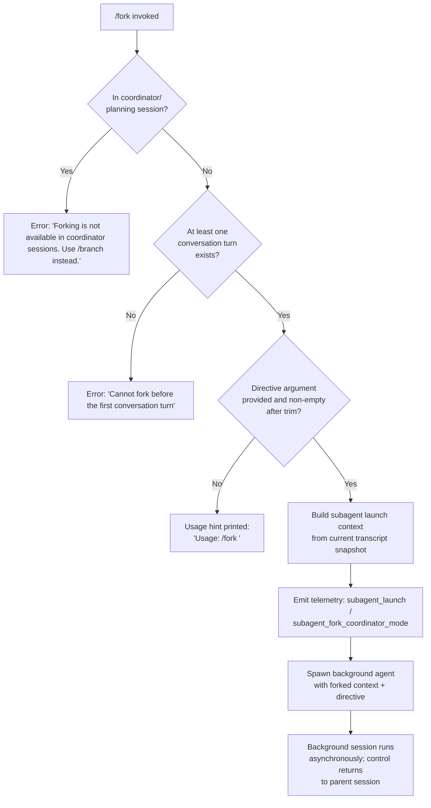

# `/fork`

> Analysis basis: CC v2.1.198 bundle.js (AST extraction + Claude interpretation)
> Minimum version: v2.1.198

---

## Overview

`/fork` spawns a background agent that inherits a complete snapshot of the current conversation context, then runs independently under a user-supplied directive. The command validates that the session is eligible for forking (not a coordinator session, and at least one conversation turn must have occurred), trims the directive argument, constructs a subagent launch context from the existing transcript, and hands off execution to the background agent subsystem.

---

## Registration

| Field | Value |
|---|---|
| type | `local-jsx` |
| name | `fork` |
| description | `Spawn a background agent that inherits the full conversation` |
| argumentHint | `<directive>` |
| module_id | `vrc` |
| load_inline | `true` |
| loc_byte | `13083413` |
| loc_byte_end | `13083616` |
| loc_line | `8965` |
| arbor_handler.name | `Dtm` |
| arbor_handler.fqn | `claude-2.1.198::Dtm` |
| arbor_handler.kind | `AsyncFunction` |
| arbor_handler.resolution_path | `module_id` |
| arbor_handler.n_hits | `0` |

Analysis basis: CC v2.1.198 bundle.js:+13083413

---

## Input Branching

Four distinct paths exist based on session state and argument content, requiring a flowchart.



Analysis basis: CC v2.1.198 bundle.js:+13082972, +13083036, +13083064, +13083105, +13083110, +13083183

---

## Behavioral Spec

### 1. Entry validation (handler: `forkCommandHandler`)

```
async function forkCommandHandler(args, appContext):
    directive = args.trim()                     // bundle.js:+13082972

    if sessionIsCoordinatorMode(appContext):    // bundle.js:+13083105
        print("Forking is not available in coordinator sessions. Use /branch instead.")
        return                                  // bundle.js:+13083110

    if not hasAtLeastOneTurn(appContext):       // bundle.js:+13083183
        print("Cannot fork before the first conversation turn")
        return

    if directive is empty:
        print("Usage: /fork <directive>")       // bundle.js:+13082996
        return

    launchForkedSubagent(directive, appContext)
```

Analysis basis: CC v2.1.198 bundle.js:+13082972

### 2. Subagent launch context construction (`buildSubagentLaunchContext`)

```
function buildSubagentLaunchContext(directive, appContext):
    // Retrieve the current conversation snapshot
    transcript = getAppState(appContext)        // bundle.js:+11657506
    contexts  = getReplContexts(appContext)     // bundle.js:+11655915

    // Collect configuration fields carried into the fork
    config = {
        working_directory:   currentWorkingDir,     // bundle.js:+11313975
        allowed_tools:       resolvedAllowedTools,   // bundle.js:+11314030
        disallowed_tools:    resolvedDisallowedTools,// bundle.js:+11314085
        avoid_prompts:       avoidPromptsFlag,       // bundle.js:+11314146
        permission_mode:     permissionMode,         // bundle.js:+11314248
        bypassPermissions:   bypassPermsFlag,        // bundle.js:+11314279
        session:             sessionId,              // bundle.js:+11314578
        effort:              effortSetting,          // bundle.js:+11314603
        model:               activeModel,            // bundle.js:+11314616
        max_thinking_tokens: maxThinkingTokens,      // bundle.js:+11314628
        flag_settings:       currentFlagSettings,    // bundle.js:+11314654
    }

    // Generate a unique session ID for the forked agent
    sessionUUID = generateRandomId()             // bundle.js:+11656121

    // Attach 'fork' role label and system context
    launchRecord = {
        role:   "fork",                          // bundle.js:+11655875
        type:   "subagent",                      // bundle.js:+11656630
        mode:   "spawn",                         // bundle.js:+11656720
        config: config,
        transcript_slice: pruneTranscript(transcript, contexts),
    }

    return launchRecord
```

Analysis basis: CC v2.1.198 bundle.js:+11655669, +11655681, +11655788

### 3. Background session dispatch (`dispatchBackgroundAgent`)

```
async function dispatchBackgroundAgent(launchRecord, directive):
    // Timestamp the fork
    startTime = Date.now()                       // bundle.js:+11656148

    // Hand off to the background agent runner
    agentContext = buildAgentContext(launchRecord)  // bundle.js:+11656161

    // The agent runner registers with the global subagent registry
    // and begins execution; the parent session does not block
    agentHandle = await spawnLocalAgent(agentContext, directive)
                                                 // bundle.js:+11656184

    // Emit telemetry for the fork launch event
    emit("subagent_launch")                      // bundle.js:+11655684
    if coordinatorModeActive:
        emit("subagent_fork_coordinator_mode")   // bundle.js:+11655702

    // If directive was missing, record the omission
    if directive is empty:
        emit("subagent_fork_prompt_missing")     // bundle.js:+11655826

    return agentHandle
```

Analysis basis: CC v2.1.198 bundle.js:+11655684, +11655702, +11655826, +11656148, +11656184

### 4. Transcript pruning for fork context (`pruneTranscriptForFork`)

```
function pruneTranscriptForFork(transcript, contexts):
    // Trim leading/trailing whitespace from each message segment
    trimmed = transcript.map(segment => segment.trim())  // bundle.js:+11657913

    // Limit context slice depth
    // Maximum slice characters: 50 messages head, 49 tail
    head = trimmed.slice(0, 50)                  // bundle.js:+11656091
    tail = trimmed.slice(-49)                    // bundle.js:+11656104

    // Apply context replacements for resumed fork sessions
    merged = mergeContexts(head, tail, contexts) // bundle.js:+11655994 ("resume")

    return merged
```

Analysis basis: CC v2.1.198 bundle.js:+11656042, +11656051, +11656091, +11656094

### 5. Post-fork agent lifecycle (`backgroundAgentLifecycle`)

The spawned background agent runs through the full agent loop (function `backgroundSessionRunner`), which itself orchestrates:

- System-prompt assembly from the forked app state (function `assembleSystemPrompt`) — bundle.js:+11657506
- Tool configuration inheritance (function `inheritToolConfig`) — bundle.js:+11657617
- Session registration in the agent registry — bundle.js:+11656184
- Periodic progress telemetry (`subagent_complete`, `subagent_stall_timeout`) — bundle.js:+9742272, +9742292
- Automatic tear-down and transcript write-back when the agent concludes — bundle.js:+9742935

Analysis basis: CC v2.1.198 bundle.js:+11657506, +11657617, +11657668, +9742272

---

## State & Side Effects

| Item | Detail |
|---|---|
| Telemetry | `tengu_silent_harbor` (bundle.js:+13963348); `tengu_slate_harrier` (bundle.js:+13973321); `tengu_orchid_mantis_v2` (bundle.js:+13958022); `tengu_forked_agent_default_turns_exceeded` (bundle.js:+11312503); `tengu_async_agent_stall_timeout` (bundle.js:+9742032); `tengu_agent_summary_skipped` (bundle.js:+9622757); `tengu_agent_tool_completed` (bundle.js:+9737722); `tengu_agent_tool_terminated` (bundle.js:+9745802); `tengu_auto_mode_decision` (bundle.js:+9739420); `tengu_shale_finch` (bundle.js:+9733175); `tengu_run_hook` (bundle.js:+13877941); `tengu_bg_dispatch_sigkill_escalate` (bundle.js:+18374756); `tengu_bg_spare_enable` (bundle.js:+18376152); `tengu_bg_spare_claim` (bundle.js:+18376280) |
| Subagent registry mutation | The forked agent is registered in the global subagent registry (`Upr.add` / `Upr.delete`) — bundle.js:+13808377, +13808402 |
| Background daemon interaction | A background session process is created via the daemon subsystem; the session lifecycle events `daemon_bg_session_create` and `task_local_agent` / `task_local_agent_failed` are emitted — bundle.js:+18374571, +7988013, +7988032 |
| Transcript side-effect | The forked agent writes its own transcript to a subdirectory under the parent session's transcript path — bundle.js:+13699837, +13699882 |
| appState changes | The forked agent allocates its own app-state slot; the parent app-state is read-only from the fork's perspective — bundle.js:+11657506 |
| Session file I/O | A `.meta.json` and `.jsonl` transcript file are written for the spawned agent — bundle.js:+13699780, +13699936 |
| Sound | None observed |
| Hook registration | `SubagentStart` / `SubagentStop` hooks may fire for the spawned session — bundle.js:+13843775, +13886874 |
| OTel span | A `claude_code.subagent.spawn` OpenTelemetry span is created — bundle.js:+6815161 |

---

## Version History

| Version | Change |
|---|---|
| v2.1.198 | Initial analysis |

---

## Common Mistakes

1. **Running `/fork` in a coordinator session** — The command explicitly rejects coordinator-mode sessions with the message "Forking is not available in coordinator sessions. Use /branch instead." Use `/branch` in those contexts.
2. **Running `/fork` before any conversation turn** — The command requires at least one prior assistant turn to exist in the transcript; invoking it on a freshly opened session produces an error.
3. **Omitting the `<directive>` argument** — Without a directive the command prints the usage hint and records a `subagent_fork_prompt_missing` telemetry event; the fork does not launch.
4. **Expecting synchronous output** — The forked agent runs in the background and its output does not appear in the parent session's stream; results must be observed via the background agent's own transcript or task-notification callbacks.
5. **Assuming shared mutable state with the parent** — The fork receives a snapshot of the parent's transcript and configuration at the moment `/fork` is invoked; subsequent parent-session changes are not propagated to the child.

---

## Appendix — Identifier Mapping

> For bundle debugging only. Identifiers change across versions.

| Identifier | Role |
|---|---|
| `Dtm` | Main async handler for the `/fork` command (forkCommandHandler) |
| `tBo` | Subagent launch context builder (buildSubagentLaunchContext) |
| `Z$f` | App-state reader and configuration assembler for the forked session |
| `KR` | System-prompt assembly pipeline |
| `Ur` | Transcript-state reader; finds last relevant message |
| `M4` | Background agent session runner / main agent loop |
| `cze` | Inner query execution loop for the spawned agent |
| `Hgt` | Spawner helper — resolves agent binary and context directory |
| `Vde` | Background session file system setup (symlink, mkdir, open) |
| `DVe` | Background session file descriptor initialiser |
| `s_l` | Agent turn processor (processes a single agent turn) |
| `U1f` | Full query-loop orchestrator for background agents |
| `AU` | Subagent exit cleanup (removes from registry, flushes state) |
| `LBn` | Per-subagent teardown helper |
| `nTe` | Subagent task registration and hook invocation |
| `Ov` | Hook execution engine for subagent lifecycle hooks |
| `r0a` | OTel span creator for subagent spawn (`claude_code.subagent.spawn`) |
| `CT` | Pending-session timestamp recorder |
| `IP` | Random session-ID generator (uses `oln.randomBytes`) |
| `C2l` | Transcript segment trimmer |
| `fnr` | REPL-context merger (head/tail splicer) |
| `DRf` | Assistant-message context filter |
| `PRf` | Tool-result context filter |
| `MRf` | Tool-use context filter |
| `ORf` | Mixed-block context filter |
| `DMo` | Agent-summary generator |
| `PZn` | Session initialisation and app-state write-back |
| `le` | Background session logger / output writer |
| `Xfe` | Agent metadata file writer (`.meta.json`, `.jsonl`) |
| `Hfc` | Agent log directory initialiser |
| `iS` | Keyboard-interrupt signal handler setup |
| `NZn` | MCP tool list reconciler for the spawned agent |
| `As` | CLI error exit helper (emits `cli_error`, calls `process.exit`) |
| `uXe` | Error formatter called before process exit |
| `fI` | Final flush helper before process exit |
| `OL` | Locale/output-language resolver |
| `Qi` | Model capability query |
| `Le` | Logging subsystem emitter |
| `Pe` | Promise-based event emitter helper |
| `OQe` | Observable queue implementation |
| `Mrr` | Allowed-tools context builder |
| `Drr` | Disallowed-tools context builder |
| `dR` | Permission-mode resolver |
| `KS` | Model-string canonicaliser |
| `so` | AWS Bedrock ARN / inference-profile resolver |
| `Vfm` | System prompt text-output instruction builder |
| `qfm` | Hard-to-reverse action confirmation instruction builder |
| `Kfm` | Task-continuity instruction builder |
| `BFt` | Fable-identity prefix checker |
| `k6` | Tool-result character-escaper |
| `U9i` | Tool-parameter JSON formatter |
| `pye` | Fable-5 mitigation flag reader |
| `nt` | Memory-directory loader |
| `zKo` | Context-management (compact/additive mode) section builder |
| `Tmm` | Context-management wrapper |
| `amm` | Session-guidance section builder |
| `N2t` | Memory-load prompt builder |
| `gmm` | Environment-info (full) section builder |
| `hmm` | Environment-info (simple) section builder |
| `_mm` | Background-session worktree section builder |
| `UZn` | Scratchpad / temp-directory section builder |
| `Emm` | Brief-mode section builder |
| `bmm` | Flag-settings section builder |
| `umm` | Base system-prompt selector |
| `Jfm` | Autonomy-append section builder |
| `Qfm` | Amber-sextant (heron-brook) section builder |
| `GRl` | GrowthBook feature-flag reader (parallel) |
| `cmm` | Task-ownership identity selector |
| `nmm` | Xfm scratchpad system section builder |
| `rmm` | Verified-vs-assumed section builder |
| `omm` | Context-management mode delegator |
| `smm` | Session-specific guidance section builder |
| `lmm` | mK section appender |
| `x5i` | oZr extra-context loader |
| `m0e` | Provider-type (firstParty / anthropicAws) resolver |
| `Hhc` | Countdown-display component for background sessions |
| `ej` | Main-thread system-prompt assembler |
| `Zr` | Module-export shim |
| `ty` | Permission/tool-filter helper |
| `Ke` | Observable queue constructor |
| `AVe` | Tool classifier / safety classifier |
| `IVa` | Transcript update helper |
| `D8t` | fjn helper invoker |
| `QEf` | Query-event filter |
| `ZEf` | Compact-boundary event handler |
| `fgt` | In-progress tracking helper |
| `Hjn` | Agent-notification dispatcher |
| `hgt` | Agent state reader |
| `tSf` | Transcript getter |
| `vVa` | Agent state updater with timeout debounce |
| `Sl` | Result filter |
| `pQn` | Pending-results collector |
| `CR` | Individual agent turn runner |
| `CVa` | Agent context updater |
| `gMo` | Multi-agent context set manager |
| `xn` | New-turn initialiser (randomUUID factory) |
| `iEf` | In-flight event filter |
| `g` | Background session process manager (spawn/kill/monitor) |
| `mjn` | Tool-use classification entry point |
| `bEt` | Tool safety classifier |
| `S7t` | Agent output safety gate |
| `K_l` | Handoff-classifier caller |
| `P_l` | Classifier pre-check |
| `hjn` | Token-budget helper |
| `Il` | Token-budget cache |
| `ee` | Agent turn context accumulator |
| `Xdr` | Voice-stream WebSocket handler (unrelated to fork, but reachable) |
| `Z` | Voice recording UI component (unrelated to fork) |
| `ue` | Voice UI wrapper |
| `ve` | Voice segment buffer |
| `Se` | OAuth token-store helper |
| `Wt` | REPL-session message writer |
| `It` | Plugin-file loader |
| `yn` | REPL session wrapper |
| `re` | Voice recording init helper |
| `Ie` | Workflow abort helper |
| `bt` | Bridge REPL v2 transport handler |
| `Tn` | Promise-based connection timeout |
| `Wic` | Bridge message dispatcher |
| `Fe` | MCP tool-call dispatcher |
| `jic` | Bridge control-message processor |
| `on` | Bridge data write-batch handler |
| `Nt` | Bridge end-of-stream handler |
| `R` | OAuth/gateway HTTP route handler (unrelated, reachable via depth-2) |
| `L` | Away-summary generator |
| `Lns` | Headless plugin installer |
| `Yt` | Headless session bootstrap |
| `Or` | Plugin MCP reconciler |
| `au` | Skills load timing helper |
| `p4` | Plugin manifest loader |
| `U1f` | Full agent-turn query loop (see above; reused entry) |
| `LBn` | Subagent exit handler (see above) |
| `AHa` | Upo-registry delete helper (session teardown) |
| `SHa` | Upo-registry set helper (session init) |
| `e_l` | Non-shell monitor stop helper |
| `nLa` | Shell-task stop helper |
| `tLa` | All-task join helper |
| `Tje` | c9n/vho registry cleanup (fork teardown) |
| `bPo` | vJt registry cleanup |
| `o0a` | OTel span end helper |
| `lDe` | AsyncLocalStorage context restorer |
| `aDe` | AsyncLocalStorage span initialiser |
| `I2` | AsyncLocalStorage active-span accessor |
| `jde` | Background session exit handler |
| `TPo` | Process-exit listener registration |
| `eu` | Signal handler registration (`process.on("exit")`) |
| `v7e` | Ant-prefixed filter for version tags |
| `Xfe` | Metadata-file writer (see above) |
| `WJ` | `Xga` wrapper (desktop save-config helper) |
| `rHa` | `Nq.delete` / `VWe` cleanup wrapper |
| `VWe` | Config-file write helper |
| `ZKe` | oEf-set membership checker |
| `IPo` | Agent transcript diff/patch processor |
| `IDo` | `TDo.clear` cache cleaner |
| `CDo` | `TDo` cache get/set with timestamp |
| `bnn` | Math.ceil token estimate |
| `DWe` | Math.round token estimate |
| `En` | Message writer (gt.writeMessages) |
| `gt` | Low-level message persistence |
| `Wde` | Deduplication filter for messages |
| `vE` | Annotation-set builder |
| `tgm` | Annotation entry creator |
| `ngm` | Annotation map builder |
| `eYt` | Message o/r initialiser |
| `uEt` | Tool-progress tracker |
| `Bfe` | Text-trim helper |
| `cEt` | Array-or-object content flattener |
| `AVa` | Agent-state t.get/Ka/Joe accessor triple |
| `nTe` | See above (subagent task registration) |
| `a1` | Hook context builder (G$, $_, U5, u3) |
| `kmc` | MCP task config builder |
| `Rmc` | Remote-agent config builder |
| `FTc` | Bridge final-teardown callback |
| `GHl` | GHl helper (depth-2 not resolved) |
| `lIf` | lIf helper (depth-2 not resolved) |
| `sRi` | sRi metrics helper |
| `Wbr` | Wbr breadcrumb helper |
| `dIf` | dIf helper (depth-2 not resolved) |
| `wae` | wae state helper |
| `CP` | CP state helper |
| `RM` | RM state helper (sw-based) |

---

Note: index built via Arbor fallback; some signals (telemetry, literals) may be missing — see arbor-fallback.js.