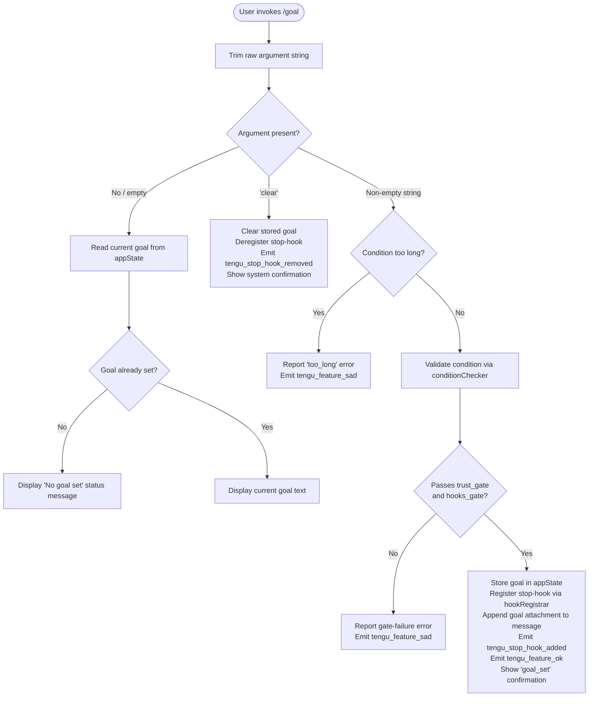

# `/goal`

> Analysis basis: CC v2.1.193 bundle.js (AST extraction + Claude interpretation)
> Minimum version: v2.1.193

---

## Overview

The `/goal` command sets a persistent success condition that Claude evaluates before each stop event during a session. When a goal is active, a stop-hook is registered that checks whether the condition has been met; if not, Claude is instructed to continue working. Invoking the command with the argument `clear` (or with no argument) removes any previously set goal and deregisters the hook.

---

## Registration

| Field | Value |
|---|---|
| type | `local-jsx` |
| name | `goal` |
| description | Set a goal Claude checks before stopping |
| argumentHint | `[<condition> \| clear]` |
| immediate | `true` |
| module_id | `CKl` |
| load_inline | `true` |
| loc_byte | `13214365` |
| loc_byte_end | `13214551` |
| loc_line | `8979` |
| arbor_handler.name | `UFf` |
| arbor_handler.fqn | `claude-2.1.193::UFf` |
| arbor_handler.kind | `AsyncFunction` |
| arbor_handler.resolution_path | `module_id` |
| arbor_handler.n_hits | `0` |

Analysis basis: CC v2.1.193 bundle.js:+13214365

---

## Input Branching

Four distinct input paths are possible (no argument / empty string, `clear`, a valid condition string, and a condition string that is too long), so a Mermaid flowchart is used.



Analysis basis: CC v2.1.193 bundle.js:+13212978, +13213066, +13213094, +13213119, +13213202, +13213205, +13213216, +13213328

---

## Behavioral Spec

### 1. Argument Parsing

```
async function goalCommandHandler(rawArg, context):
    trimmed = rawArg.trim()                         // bundle.js:+13212978
    if trimmed is empty:
        return displayCurrentGoalStatus(context)
    if trimmed.toLowerCase() == "clear":            // implicit from "skip"/"clear" branching
        return clearGoal(context)
    return setGoal(trimmed, context)
```

Analysis basis: CC v2.1.193 bundle.js:+13212978

---

### 2. Display Current Goal Status

When no argument is supplied the handler reads the current goal string from `appState`. If no goal has been stored, the literal `"No goal set"` is shown to the user as a `"system"` message. If a goal is set, its text is displayed.

```
function displayCurrentGoalStatus(context):
    currentGoal = context.getAppState().goal      // via wHt / vHt
    if currentGoal is null or empty:
        showSystemMessage("No goal set")           // bundle.js:+13213119
    else:
        showSystemMessage(currentGoal)
```

Analysis basis: CC v2.1.193 bundle.js:+13213119, +13213163

---

### 3. Clear Goal

When the argument is `"clear"`, the handler removes the goal from `appState` and deregisters the stop-hook that was previously attached.

```
function clearGoal(context):
    context.setAppState({ goal: null })
    stopHookRegistry.delete(existingHookId)        // via hookRegistrar / s.r.delete
    emit telemetry("tengu_stop_hook_removed")      // bundle.js:+10853486
    showSystemMessage("Goal cleared")
    emit telemetry("tengu_feature_ok")             // via feature-outcome path
```

Analysis basis: CC v2.1.193 bundle.js:+10853486, +13213066

---

### 4. Validate and Set Goal

For a non-empty, non-`clear` argument, the handler first runs the condition through two gates — `hooks_gate` and `trust_gate` — before storing it and registering the stop-hook.

```
async function setGoal(conditionText, context):

    // Gate checks (via conditionChecker → iLo → qB / Kae)
    hooksAllowed = gateCheck("hooks_gate", context)   // bundle.js:+10852624
    trustAllowed = gateCheck("trust_gate", context)   // bundle.js:+10852678

    if not hooksAllowed or not trustAllowed:
        emit telemetry("tengu_feature_sad")            // bundle.js:+1026902
        showError(gate-failure reason)
        return

    // Length guard (literal "too_long")
    if conditionText.length exceeds maximum:
        emit telemetry("tengu_feature_sad")
        reportError("too_long")                        // bundle.js:+13213216
        return

    // Persist goal
    context.setAppState({ goal: conditionText })       // bundle.js:+10853015

    // Append goal as an attachment to the current message
    newAttachmentId = generateUUID()                   // x_l → v_l.randomUUID, bundle.js:+10853580
    context.applyMessageOp("append", {
        kind: "attachment",                            // bundle.js:+10853562
        role: "goal",                                  // bundle.js:+10853520
        content: conditionText
    })

    // Register stop-hook that will be called before each stop event
    stopHookRegistry.add(newHookId)                    // s.r.add, bundle.js:+17488421
    emit telemetry("tengu_stop_hook_added")            // bundle.js:+10853114

    // Record outcome and notify
    context.applyMessageOp("append", {
        kind: "goal_status",                           // bundle.js:+10853649
        status: "goal_set"                             // bundle.js:+13213205
    })
    emit telemetry("tengu_feature_ok")                 // bundle.js:+1026754
    showSystemMessage(confirmationJSX)                 // vKl.jsx, bundle.js:+13213004
```

Analysis basis: CC v2.1.193 bundle.js:+10852624, +10852678, +10853015, +10853057, +10853099, +10853114, +10853520, +10853562, +10853649, +13213205, +13213216

---

### 5. Stop-Hook Evaluation at Each Stop Event

After a goal is registered, `hookRegistrar` (resolved through `vHt → iLo → td → Ijf`) is called before every Claude stop event. It evaluates whether the current session state satisfies the stored condition.

```
async function stopHookEvaluator(sessionContext):
    storedGoal = sessionContext.getAppState().goal    // bundle.js:+10852813
    if storedGoal is null:
        return PROCEED_TO_STOP

    timestamp = Date.now()                            // bundle.js:+10852977
    tokenStats = computeOutputTokens(sessionContext)  // Ay → outputTokens, bundle.js:+48345

    goalMet = evaluateConditionAgainstState(
        storedGoal,
        sessionContext,
        tokenStats
    )

    if goalMet:
        return PROCEED_TO_STOP
    else:
        // Instruct Claude to continue; emit a prompt-type message
        context.applyMessageOp("append", {
            kind: "prompt",                           // bundle.js:+10852542
            content: continueInstruction
        })
        return CONTINUE_AGENT
```

If the stop-hook infrastructure itself signals an unrecoverable error, `process.exit(1)` is called via the `errorHandler` path (`Is → process.exit`, literal `1` at bundle.js:+13300680). The error is tagged `"cli_error"` (bundle.js:+13300654) before exit.

Analysis basis: CC v2.1.193 bundle.js:+10852542, +10852813, +10852977, +10853057, +13300654, +13300667, +13300680

---

### 6. Condition Checker Helper (`conditionChecker`)

The `conditionChecker` helper (resolved through `l7n`) normalises the condition text to lowercase before membership testing against a known-condition set (`caf`), providing case-insensitive matching.

```
function conditionChecker(conditionText):
    normalized = conditionText.toLowerCase()          // bundle.js:+10852034
    return knownConditionSet.has(normalized)          // caf.has, bundle.js:+10852026
```

Analysis basis: CC v2.1.193 bundle.js:+10852026, +10852034

---

### 7. JSX Confirmation UI

On success, the handler renders a JSX confirmation component (`vKl.jsx`) with a randomised display variant (via `Math.random()` selecting from 2 options with `setTimeout` scheduling — bundle.js:+14343445, +14343484). This keeps the success feedback visually varied across invocations.

```
function renderGoalConfirmation(goalText):
    variant = Math.floor(Math.random() * 2)     // bundle.js:+14343445
    setTimeout(() => displayConfirmation(variant, goalText), delay)
    return confirmationJSX
```

Analysis basis: CC v2.1.193 bundle.js:+13213004, +14343445, +14343484

---

## State & Side Effects

| Item | Detail |
|---|---|
| Telemetry: `tengu_stop_hook_added` | Fired when a goal condition is successfully stored and the stop-hook is registered (bundle.js:+10853114) |
| Telemetry: `tengu_stop_hook_removed` | Fired when `/goal clear` deregisters the existing stop-hook (bundle.js:+10853486) |
| Telemetry: `tengu_feature_ok` | Fired on any successful feature outcome — goal set or goal cleared (bundle.js:+1026754) |
| Telemetry: `tengu_feature_sad` | Fired when validation fails (gate rejection or condition too long) (bundle.js:+1026902) |
| Hook registration | A stop-hook entry is added to `stopHookRegistry` via `r.add` on success; removed via `r.delete` on clear (bundle.js:+17488421, +17488444) |
| appState changes | `goal` key is written via `setAppState` on set (bundle.js:+10853015) and cleared on `/goal clear` (bundle.js:+10852977 context) |
| Message ops | A `"goal"` attachment (`"append"`) is applied to the active message on set; a `"goal_status"` record is also appended (bundle.js:+10853452, +10853562, +10853649) |
| UUID generation | A fresh UUID (`v_l.randomUUID`) is generated for each new goal attachment (bundle.js:+10853580) |
| Process exit | Fatal stop-hook errors call `process.exit(1)` after emitting a `"cli_error"` event (bundle.js:+13300654, +13300667, +13300680) |
| Output token accounting | `Ay` reads `outputTokens` from `Object.values` of session state at each stop-hook evaluation (bundle.js:+48312, +48345) |
| Pad/column formatting | Column layout helper uses `i.padEnd` with two-space separator `"  "` for display (bundle.js:+17509233, +17509254) |

---

## Version History

| Version | Change |
|---|---|
| v2.1.193 | Initial analysis |

---

## Common Mistakes

1. **Forgetting `clear` clears immediately**: `/goal clear` takes effect at the next stop-hook evaluation boundary; any in-flight agent turn already past the check may still stop. Issue the command before the agent reaches a natural stopping point.
2. **Condition too long**: The handler enforces a maximum condition length. Overly verbose goal descriptions are rejected with `"too_long"` without storing anything. Keep the condition concise.
3. **Gate failures are silent from the model's perspective**: If `hooks_gate` or `trust_gate` blocks the registration, only the CLI surface shows an error; the model receives no updated appState and will not check any goal.
4. **Case sensitivity in condition matching**: The `conditionChecker` normalises to lowercase, so the stored goal text comparison is case-insensitive — but the *stored* text retains its original casing for display.
5. **No persistence across sessions**: The goal is stored in `appState` (in-memory), not in a config file. Starting a new Claude Code session means the goal must be re-set.
6. **`immediate: true` means the command runs without entering the agent loop**: The command output is shown inline in the shell, not as an agent message. Do not expect the model to respond conversationally to `/goal`.

---

## Appendix — Identifier Mapping

> For bundle debugging only. Identifiers change across versions.

| Identifier | Role |
|---|---|
| `UFf` | Main async handler for `/goal` command (arbor_handler; module `CKl`) |
| `n` | Argument string variable / intermediate result in parsing |
| `i` | Stop-hook promise / session iteration handle |
| `r` | Stop-hook registry (Set with `add`, `delete`, `close`) |
| `Is` | Fatal error handler — emits `cli_error` and calls `process.exit` |
| `s` | Hook scheduler — calls `r.add`, `i.finally`, `r.delete` |
| `e` | JSX confirmation component renderer (uses `Math.random`, `setTimeout`) |
| `l7n` | Condition checker — normalises to lowercase, tests membership in `caf` |
| `wHt` | Goal-set path: reads/writes appState, applies message ops, registers hook |
| `Lt` | Lower-level app-state reader utility (calls `Rx`) |
| `Rx` | Core appState accessor |
| `CHt` | Message builder — constructs `"Stop"` prompt entries, pushes to array |
| `aDe` | App-state setter (calls `o.set` and `nZa`) |
| `o` | Column-layout formatter (uses `s.map`, `i.padEnd`) |
| `nZa` | Array mapping utility for state update |
| `x_l` | UUID generator wrapper (calls `v_l.randomUUID`) |
| `V` | Feature-outcome reporter (success path, `tengu_feature_ok`) |
| `Ve` | Supplementary outcome emitter (calls `Zze`) |
| `Zze` | Core telemetry emitter |
| `vt` | Feature-outcome reporter (calls `V` and `Oe`; used in goal-set path) |
| `Oe` | Sad-path feature reporter (`tengu_feature_sad`; calls `Zze`) |
| `vHt` | Stop-hook evaluator — reads appState, timestamps, applies continue ops |
| `iLo` | Hook registration coordinator (calls `qB`, `Kae`, `Tr`, `td`) |
| `qB` | Policy settings reader (calls `_n` with key `"policySettings"`) |
| `_n` | Generic settings store accessor (calls `sun`, `yB`) |
| `Kae` | Secondary gate checker (calls `_n`, `Go`) |
| `Tr` | Trust-gate evaluator identifier |
| `td` | Hook installer (calls `Ijf`) |
| `Ijf` | Hook descriptor builder (calls `at`, `R7e`, `Ks`, `kt`, `afe`, `oW`, `Pt`, `oE.resolve`) |
| `t` | Session context object within stop-hook evaluator |
| `Ay` | Output-token aggregator (uses `y7e`, `Object.values`; key `"outputTokens"`) |
| `we` | Feature-outcome reporter variant used inside `vHt` (calls `V`, `Oe`) |
| `c7n` | Final cleanup / teardown utility called at end of handler |

---

Note: index built via Arbor fallback; some signals (telemetry, literals) may be missing — see arbor-fallback.js.