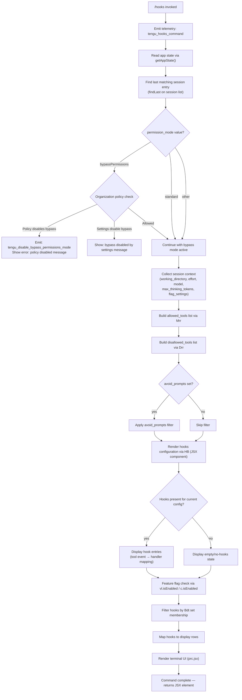

# `/hooks`

> Analysis basis: CC v2.1.198 bundle.js (AST extraction + Claude interpretation)
> Minimum version: v2.1.198

---

## Overview

The `/hooks` command displays the current hook configurations associated with tool events in a Claude Code session. It is a read-oriented `local-jsx` command that queries application state to enumerate hooks, renders them through an interactive terminal UI component, and emits a telemetry event upon invocation. It operates immediately (no agent round-trip required) and does not modify session state.

---

## Registration

| Field | Value |
|---|---|
| type | `local-jsx` |
| name | `hooks` |
| description | `View hook configurations for tool events` |
| loc_byte | `13073398` |
| loc_byte_end | `13073548` |
| loc_line | `8965` |
| immediate | `true` |
| module_id | `drc` |
| load_inline | `true` |
| arbor_handler.name | `Itm` |
| arbor_handler.fqn | `claude-2.1.198::Itm` |
| arbor_handler.kind | `AsyncFunction` |
| arbor_handler.resolution_path | `module_id` |
| arbor_handler.n_hits | `0` |

Analysis basis: CC v2.1.198 bundle.js:+13073398

---

## Input Branching

The `/hooks` command has a relatively linear flow at the top level (invoke → query state → render), but the internal hook-display logic branches across multiple distinct paths: permission mode checks, allowed-tool vs. disallowed-tool filtering, bypass-permissions policy evaluation, and daemon/supervisor interaction. A Mermaid chart captures these branches.



---

## Behavioral Spec

### Top-Level Handler (`Itm`)

```
async function hooksCommandHandler(context):
    emit telemetry("tengu_hooks_command")            // bundle.js:+13073208
    sessionContext = readCurrentSessionContext()      // calls getSessionContext (Ur)
    hookDisplay   = buildHookDisplayComponent(sessionContext)  // calls HB
    return renderJSX(hookDisplay)                    // prc.jsx at +13073278
```

Analysis basis: CC v2.1.198 bundle.js:+13073206–13073278

---

### Session Context Reader (`Ur` / `getSessionContext`)

Reads live application state and resolves the active session entry.

```
function getSessionContext(appStateProvider):
    state = appStateProvider.getAppState()           // +11313870
    // Find the most recent session matching current working directory
    sessionEntry = state.sessions.findLast(
        entry => entry["working_directory"] matches current  // +11313950, literal +11313975
    )
    allowedTools    = buildAllowedToolsList(sessionEntry)    // Mrr, +11314048
    disallowedTools = buildDisallowedToolsList(sessionEntry) // Drr, +11314106
    permissionMode  = resolvePermissionMode(sessionEntry)    // dR,  +11314301

    return {
        working_directory : sessionEntry["working_directory"],  // +11313975
        allowed_tools     : allowedTools,                       // +11314030
        disallowed_tools  : disallowedTools,                    // +11314085
        avoid_prompts     : sessionEntry["avoid_prompts"],      // +11314146
        permission_mode   : permissionMode,                     // +11314248
        session           : sessionEntry["session"],            // +11314578
        effort            : sessionEntry["effort"],             // +11314603
        model             : sessionEntry["model"],              // +11314616
        max_thinking_tokens: sessionEntry["max_thinking_tokens"],// +11314628
        flag_settings     : sessionEntry["flag_settings"],      // +11314654
    }
```

Analysis basis: CC v2.1.198 bundle.js:+11313870, +11313950, +11314048–11314654

---

### Permission-Mode Resolver (`dR` / `resolvePermissionMode`)

Delegates to `kQr` (permissionModeKernel) which applies organizational-policy and settings-level overrides.

```
function resolvePermissionMode(sessionEntry):
    rawMode = sessionEntry["permission_mode"]         // +11314248
    return permissionModeKernel(rawMode)              // kQr, +3462145

function permissionModeKernel(rawMode):
    if organizationPolicyCheck.has("bypassPermissions"):  // k0e.has, +3403343
        emit telemetry("tengu_disable_bypass_permissions_mode")  // +3461875
        // Error text: "Bypass permissions mode was disabled by your organization policy"
        //             (bundle.js:+3461925)
        raise PolicyError(policyDisabledMessage)
    if settingsValue == "disable":                    // literal "disable", +3462050
        // Message: "Bypass permissions mode was disabled by settings"
        //          (bundle.js:+3462066)
        return disabledResult
    // Otherwise: proceed with resolved mode
    return resolvedMode
```

Analysis basis: CC v2.1.198 bundle.js:+3462145, +3461872, +3403343, +3461925, +3462050, +3462066

---

### Allowed-Tools Builder (`Mrr` / `buildAllowedToolsList`)

Calls the shared tool-list constructor (`Co`) to produce the allow list from session state.

```
function buildAllowedToolsList(sessionEntry):
    return toolListConstructor(sessionEntry["allowed_tools"])  // Co, +11306421
```

Analysis basis: CC v2.1.198 bundle.js:+11314048, +11306421

---

### Disallowed-Tools Builder (`Drr` / `buildDisallowedToolsList`)

Mirror of the above for the deny list.

```
function buildDisallowedToolsList(sessionEntry):
    return toolListConstructor(sessionEntry["disallowed_tools"])  // Co, +11306569
```

Analysis basis: CC v2.1.198 bundle.js:+11314106, +11306569

---

### Hook Display Component (`HB` / `buildHookDisplayComponent`)

The primary rendering function. Collects all hook entries from configuration and maps them to displayable rows.

```
function buildHookDisplayComponent(sessionCtx):
    // Resolve hook source paths
    hookPaths = resolveHookSourcePaths(sessionCtx)            // Yw, +11127320

    // Push entries to display list
    displayList = []
    for each hookEntry in hookPaths:
        fileInfo = statHookFile(hookEntry)                    // SXe, +18391426
        displayList.push(fileInfo)                            // d.push, +11127392

    // Build hook metadata component
    metaComponent = buildHookMetaComponent()                  // hFo, +11127407
    configDisplay = buildConfigDisplayComponent()             // dS,   +11127421

    // Filter hooks to those applicable to current session
    filteredHooks = filterApplicableHooks(hookPaths)          // qse, +11127443

    // Build grouped display
    groupedDisplay = buildGroupedDisplay(filteredHooks)       // gFo, +11127458
    keyedDisplay   = buildKeyedDisplay(filteredHooks)         // ku,  +11127470

    // Check feature flags
    workflowsEnabled = featureFlagEnabled("vl")               // vl.isEnabled, +11127706
    hookEnabled      = hookFeatureFlagEnabled("c")            // c.isEnabled,   +11127836

    // Filter by known-hook registry
    knownHooks = filteredHooks.filter(h => Bdt.has(h))        // Bdt.has, +11127797

    // Map to display rows; include daemon-status heartbeat if applicable
    rows = knownHooks.map(hook => renderHookRow(hook))        // o.map, +11127825

    // Include daemon config if heartbeat string present
    // literal "daemon.status.json" used at +13346372
    daemonStatus = queryDaemonStatus()                        // Flc → ftn, +18390946

    // Assemble final JSX structure
    return assembleJSXDisplay(rows, metaComponent, groupedDisplay, daemonStatus)
```

Analysis basis: CC v2.1.198 bundle.js:+11127320–11127923

---

### Hook File Stat (`SXe` / `statHookFile`)

Validates each hook's backing file exists and is within size limits before display.

```
async function statHookFile(hookEntry):
    try:
        stats = await filesystem.stat(hookEntry.path)   // ndc.stat, +13523462
    catch error:
        if error.code == "ENOENT":                      // literal +13523493
            return Promise.reject(notFoundError)        // +13523507
    if not stats.isFile():                              // +13523534
        return notAFileError
    if stats.size > 1048576:                            // literal 1048576 (+13523553) — 1 MiB limit
        return fileTooLargeError
    content = readFileContent(hookEntry.path)           // Ys → yEd.getStore, +13523637
    keys = Object.keys(content)                         // +13523971
    if registeredHookSet.has(hookEntry.key):            // o.has, +13524057
        return formatHookEntry(content, keys)
    return null
```

Maximum hook file size: 1 048 576 bytes (1 MiB) (bundle.js:+13523553)

Analysis basis: CC v2.1.198 bundle.js:+13523462–13524057

---

### Hook Source Path Resolver (`Yw` / `resolveHookSourcePaths`)

Enumerates hook configuration locations for both `cli` and `remote` hook sources.

```
function resolveHookSourcePaths(sessionCtx):
    paths = []
    // CLI hook scope
    cliPaths    = getHookPaths("cli",    sessionCtx)   // literal "cli",    +5173047
    remotePaths = getHookPaths("remote", sessionCtx)   // literal "remote", +5173058
    paths.push(...cliPaths, ...remotePaths)
    // Resolve each path through normalization (kl → String, st → String)
    return paths.map(p => normalizePath(p))            // +5172895–5173074
```

Analysis basis: CC v2.1.198 bundle.js:+5172895–5173074

---

### Applicable-Hook Filter (`qse` / `filterApplicableHooks`)

Removes hooks that are not applicable given the current tool availability and narrowing rules.

```
function filterApplicableHooks(hookList):
    // Use N1e to check each hook's applicability
    return hookList.filter(hook => isHookApplicable(hook))   // e.filter, +11126747

function isHookApplicable(hook):
    // Check deny list membership
    if hook matches deny rule:                               // literal "deny", +14076437
        return false
    // Check cliArg narrowing
    if hook.source == "cliArg":                             // literal +14077084
        return evaluateCliArgNarrowing(hook)
    // Check toolsNarrowing
    if hook.source == "toolsNarrowing":                     // literal +14077105
        return evaluateToolsNarrowing(hook)
    return true
```

Analysis basis: CC v2.1.198 bundle.js:+11126747–11126762, +14077143–14077209

---

### Daemon Status Query (`Flc` / `queryDaemonStatus`)

Reads the daemon's status file (`daemon.status.json`) to include heartbeat data in the hooks display when the daemon supervisor is active.

```
function queryDaemonStatus():
    configPath = joinPath(configDir, "daemon.status.json")  // Ulc.join + literal +13346372
    timestamp  = Date.now()                                  // +13346485
    store      = getStore()                                  // Ys → yEd.getStore, +13346517
    heartbeat  = parseStatusFile(configPath)                 // literal "heartbeat" +18390670
    return { timestamp, heartbeat, store }
```

Analysis basis: CC v2.1.198 bundle.js:+13346372, +13346469–13346540, literal `"daemon.status.json"` at +13346372

---

### Configuration Formatter (`rdc` / `formatHookConfiguration`)

Calculates column widths and formats the hook configuration table for terminal output.

```
function formatHookConfiguration(hookMap):
    keys      = Object.keys(hookMap)                // +13524683
    maxWidth  = Math.max(...keys.map(k => k.length))// +13524729
    formatted = formatRows(keys, hookMap, maxWidth)  // P_, +13524928
    return formatted
```

Analysis basis: CC v2.1.198 bundle.js:+13524683–13524928

---

## State & Side Effects

| Item | Detail |
|---|---|
| Telemetry: `tengu_hooks_command` | Fired immediately on command entry (bundle.js:+13073208) |
| Telemetry: `tengu_disable_bypass_permissions_mode` | Fired when organization policy or settings blocks bypass-permissions mode (bundle.js:+3461875) |
| Telemetry: `tengu_slate_harbor` | Fired during hook-path resolution for CLI/remote scopes (bundle.js:+5173077) |
| Telemetry: `tengu_daemon_config_reload` | Fired when the daemon configuration is reloaded as a side effect of display (bundle.js:+18392244) |
| Telemetry: `tengu_workflows_enabled` | Fired when the workflows feature flag is found enabled during hook filtering (bundle.js:+3437965) |
| Telemetry: `tengu_cobalt_ridge` | Fired during hook display group construction (bundle.js:+5170161) |
| Telemetry: `tengu_feature_ok` | Fired when a feature gate passes (bundle.js:+1039573) |
| Telemetry: `tengu_feature_bad` | Fired when a feature gate fails (bundle.js:+1039640) |
| Telemetry: `tengu_daemon_control` | Fired during daemon start/stop operations triggered as side effect (bundle.js:+18414881) |
| appState changes | Read-only: `getAppState()` is called but no mutations are performed by the command itself |
| Hook registration | None: `/hooks` is a viewer, not a hook registrar |
| Sound | None observed in traversal |
| Daemon status file read | Reads `daemon.status.json` from config directory (bundle.js:+13346372) |
| File system stat | Performs `stat()` on each hook backing file; rejects missing files (ENOENT) and files > 1 MiB |

---

## Version History

| Version | Change |
|---|---|
| v2.1.198 | Initial analysis |

---

## Common Mistakes

1. **Expecting output when no hooks are configured.** The command displays an empty state silently when no hooks exist; this is intentional, not a bug.
2. **Assuming `/hooks` modifies hook configuration.** It is strictly read-only. To add or change hooks, edit the relevant configuration files directly.
3. **Mistaking the 1 MiB file-size guard for a hook limit.** The 1 048 576-byte threshold (bundle.js:+13523553) applies to each individual hook backing file, not to the total number of hooks.
4. **Expecting bypass-permissions hooks when policy disables the mode.** If your organization policy or local settings set `permission_mode` to `"disable"`, the bypass path is suppressed entirely and hooks that depend on it will not appear.
5. **Confusing `disallowed_tools` hooks with absent hooks.** Tools on the disallow list are enumerated and displayed in the hooks view; they are filtered from agent execution but still visible here.
6. **Overlooking the `daemon.status.json` dependency.** If the daemon status file is absent, the heartbeat row in the display will be omitted without an error.

---

## Appendix — Identifier Mapping

> For bundle debugging only. Identifiers change across versions.

| Identifier | Role |
|---|---|
| `Itm` | Top-level async handler for the `/hooks` command (arbor_handler) |
| `V` | Generic utility / value helper called at command entry and display |
| `Ur` | Session-context reader (`getSessionContext`) |
| `Mrr` | Allowed-tools list builder |
| `Drr` | Disallowed-tools list builder |
| `Co` | Shared tool-list constructor (used by both `Mrr` and `Drr`) |
| `dR` | Permission-mode resolver |
| `kQr` | Permission-mode kernel (policy + settings override logic) |
| `nt` | Low-level tool/permission node processor |
| `HB` | Hook-display component builder (main JSX assembler) |
| `Yw` | Hook source path resolver |
| `e6` | Path component helper |
| `kl` | String normalization helper |
| `st` | String conversion / formatting utility |
| `SXe` | Hook file stat and content loader |
| `en` | File read helper |
| `Ys` | Store accessor (wraps `yEd.getStore`) |
| `JVo` | Hook key validator |
| `XVo` | Hook entry formatter |
| `rdc` | Hook configuration table formatter |
| `E` | Daemon/supervisor stop controller |
| `$Je` | Stop sequencer helper |
| `Re` | Shutdown reporter |
| `sr` | Error string builder |
| `A` | Process/daemon lifecycle manager |
| `FEr` | Array-type discriminator for daemon config |
| `UEr` | Path prefix normalizer |
| `H` | Process kill helper |
| `lQc` | Heartbeat / daemon-loop manager |
| `zce` | Heartbeat ticker |
| `I` | Input/scroll handler for JSX display |
| `R` | HTTP request handler (OAuth/gateway, called transitively) |
| `hFo` | Hook metadata component builder |
| `Zr` | Module registry initializer |
| `Ean` | Module binding helper |
| `dS` | Configuration display component builder |
| `CMn` | Config-section formatter |
| `a0` | App-state accessor helper |
| `o4i` | Workflow-settings loader |
| `js` | Feature-flag evaluator |
| `gQr` | Hook group renderer |
| `GGd` | Hook group display formatter |
| `BGd` | Background config accessor |
| `qse` | Applicable-hook filter |
| `N1e` | Hook applicability checker |
| `iNe` | Hook-set membership tester |
| `dz` | Deny-rule evaluator |
| `Hzo` | Tool-narrowing evaluator |
| `yzo` | Post-filter hook processor |
| `gFo` | Grouped hook display builder |
| `mU` | Hook group key builder |
| `m8t` | Group metadata helper |
| `ku` | Keyed hook display builder |
| `u` | Daemon control action list |
| `xe` | Feature-ok gate (emits `tengu_feature_ok`) |
| `Pe` | Feature gate checker |
| `Le` | Feature-bad gate (emits `tengu_feature_bad`) |
| `M$` | Daemon event emitter |
| `eG` | Event-group resolver |
| `V5e` | Transaction helper |
| `UJr` | UUID-based daemon session creator |
| `l8` | Shutdown race/timeout controller |
| `kye` | Shutdown initiator |
| `$ye` | Timeout clearer |
| `Mn` | Timeout-with-abort helper |
| `U4` | Daemon display orchestrator |
| `Aft` | Local-agent launch helper |
| `vv` | Agent start helper |
| `iC` | String key builder for agent |
| `uAt` | Unused-agent-slot checker |
| `DO` | Output-stream manager |
| `j4t` | Output codec selector |
| `T` | Terminal output writer |
| `mr` | Provider/backend router |
| `fu` | Stream-transform helper |
| `yl` | Hook-list presenter |
| `c` | Feature-flag container for hooks |
| `un` | Feature flag evaluator (inner) |
| `l` | Daemon-status file loader |
| `Flc` | Daemon status query function |
| `Ene` | Config-path resolver |
| `ftn` | Status-file path builder |
| `Me` | JSON serializer wrapper |

---

Note: index built via Arbor fallback; some signals (telemetry, literals) may be missing — see arbor-fallback.js.