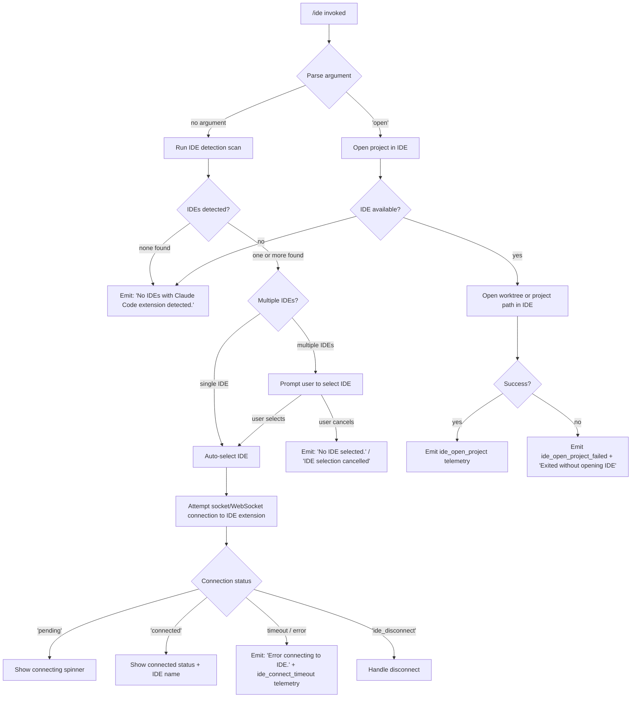

# `/ide`

> Analysis basis: CC v2.1.198 bundle.js (AST extraction + Claude interpretation)
> Minimum version: v2.1.198

---

## Overview

The `/ide` command manages IDE integrations for Claude Code, allowing users to detect connected IDE instances, open projects in an IDE, and monitor the connection status of the IDE extension. It operates by scanning for running IDE processes, establishing a socket-based connection to the Claude Code IDE extension, and rendering a JSX status panel showing the current connection state.

---

## Registration

| Field | Value |
|---|---|
| type | `local-jsx` |
| name | `ide` |
| description | `Manage IDE integrations and show status` |
| argumentHint | `[open]` |
| module_id | `LWl` |
| load_inline | `true` |
| loc_byte | `12139420` |
| loc_byte_end | `12139576` |
| loc_line | `7941` |
| arbor_handler.name | `QWf` |
| arbor_handler.fqn | `claude-2.1.198::QWf` |
| arbor_handler.kind | `AsyncFunction` |
| arbor_handler.resolution_path | `module_id` |
| arbor_handler.n_hits | `0` |

Analysis basis: CC v2.1.198 bundle.js:+12139420

---

## Input Branching

The command has 4+ distinct branches based on the subcommand argument and detected IDE state:



---

## Behavioral Spec

### Handler Entry Point

The primary handler is `QWf` (resolved via `module_id` → `LWl`, Arbor path: `module_id`).

Analysis basis: CC v2.1.198 bundle.js:+12135614

```
async function ideCommandHandler(context):
    emit telemetry("tengu_ext_ide_command")          // +12135616

    if argument == "open":
        return handleOpenProject(context)

    detectedIDEs = await detectRunningIDEs()         // calls ideDetectionScan

    if detectedIDEs is empty:
        render "No IDEs with Claude Code extension detected."   // +12135831
        return

    if detectedIDEs.length == 1:
        selectedIDE = detectedIDEs[0]
    else:
        selectedIDE = await promptUserToSelectIDE(detectedIDEs)

    if selectedIDE is null:
        render "No IDE selected."                    // +12135951
        return

    return renderIDEStatusPanel(selectedIDE, context)
```

### IDE Detection (`cGn` — IDE detection coordinator)

Analysis basis: CC v2.1.198 bundle.js:+7449512

```
async function ideDetectionScan(options):
    port = parseInt(options.port)
    connectionList = await getActiveIDEConnections()         // calls aGn

    results = await Promise.all(
        connectionList.map(conn => resolveIDEMetadata(conn)) // calls M3p
    )

    for each result:
        normalize path via YO.resolve                        // +7449930
        if path startsWith known prefix:
            strip prefix, uppercase drive letter (Windows)   // +7450158
        apply path replacement rules                         // +7450130, +7450177

    if argument startsWith known flag:                       // +7450232
        killStaleDaemonProcesses()                           // calls o9a (+7450387)

    collect and filter results
    emit telemetry("ide_detect")                             // +7450867
    on failure emit telemetry("ide_detect_failed")           // +7450931
    return filtered IDE list
```

### IDE Process Scanner (`aGn` — active connection enumerator)

Analysis basis: CC v2.1.198 bundle.js:+7446000

```
async function enumerateActiveIDEConnections():
    candidates = await discoverCandidatePaths()              // calls P3p
    results = await Promise.all(candidates.map(async path =>
        stat = await zt(path)
        // resolve .lock files to live socket paths
        return {path, stat}
    ))
    formatted = results.map(r => padEnd formatting)          // +18403751
    return formatted
```

### Candidate Path Discovery (`P3p` — path scanner)

Analysis basis: CC v2.1.198 bundle.js:+7447220

```
async function discoverCandidatePaths():
    baseDirs = [YO.join(...), os.homedir(), ...]
    for each baseDir:
        push "ide" subdirectory                              // literal "ide" +7447233
        if environment is WSL:
            probe "/mnt/c/Users" Windows paths              // +7447518
            skip "Public", "Default", "Default User", "All Users"
                                                             // +7447612–7447676
        resolve ".claude" config dir                        // +7447311
    walk directory tree, filter:
        isDirectory or isSymbolicLink
        resolve realpath
        deduplicate via Set
    return unique candidate socket paths
```

### IDE Metadata Resolution (`M3p` / `P6r`)

Analysis basis: CC v2.1.198 bundle.js:+7445498

```
async function resolveIDEMetadata(connection):
    raw = String(connection)
    // execute shell probe: sh -c <detection command>
    // timeout: 3000 ms                                      // +2356394
    result = await executeShellCommand("sh", ["-c", ...], timeout=3000)
    port = parseInt(result)
    if isNaN(port): return null
    return {port, raw}
```

### IDE Name Detection (`Ax` — IDE name resolver)

Analysis basis: CC v2.1.198 bundle.js:+7455172

```
function resolveIDEName(processInfo):
    lower = processInfo.toLowerCase()
    // check for known IDE keywords in order:
    //   "windsurf", "devin", "cursor", "insiders", "vscode",
    //   "vs code", "visual studio code", "vscodium", "code - oss"
    basename = YO.basename(processInfo)
    // JetBrains detection via pjt()
    // Returns canonical name string, e.g. "IDE"       // +7455117
    return resolvedName
```

IDE name keyword matching is performed by `a9a` (checks: `windsurf`, `devin`, `cursor`, `insiders`, `vscode`, `vs code`, `visual studio code`, `vscodium`, `code - oss`) — Analysis basis: CC v2.1.198 bundle.js:+7452348

VSCodium-specific detection checks `codium` and `.cmd` extension (Windows) — Analysis basis: CC v2.1.198 bundle.js:+7452829

Linux IDE scan uses the shell command:
> `ps aux | grep -E "code|cursor|windsurf|devin-desktop|idea|pycharm|webstorm|phpstorm|rubymine|clion|goland|rider|datagrip|dataspell|aqua|gateway|fleet|android-studio" | grep -v grep`

(Analysis basis: CC v2.1.198 bundle.js:+7454278)

### Open Project Sub-command (`handleOpenProject` via `QWf` branch)

Analysis basis: CC v2.1.198 bundle.js:+12136006

```
async function handleOpenProject(context):
    ide = await detectOrSelectIDE()
    if ide is null:
        return                                    // no IDE available

    worktreePath = getWorktreePath() ?? getProjectPath()
    basename = dar.basename(worktreePath)        // +12136070

    try:
        emit telemetry("ide_open_project")       // +12136149
        // type: "worktree" or "project"         // +12136183, +12136194
        result = await openInIDE(ide, worktreePath)
        if result indicates failure:
            emit telemetry("ide_open_project_failed")   // +12136256
            render "Exited without opening IDE"          // +12136546
    catch:
        emit telemetry("ide_open_project_failed")
        suggest: "restart your IDE"                      // +12136815
```

### IDE Connection Handler (`wWl` — JSX status component)

Analysis basis: CC v2.1.198 bundle.js:+12137429

```
function IDEStatusComponent(props):
    [status, setStatus] = useState(null)         // +12137429
    appState = useAppState()                     // via yt +12137449
    connectionRef = useRef()                     // +12137507

    useEffect(() =>
        // Monitor connection
        if status == "pending":                  // +12137602
            // show connecting indicator
        if status == "connected":                // +12137631
            emit telemetry("ide_connect")        // +12137646
        if status == "ide_disconnect":           // via ide_disconnect literal +12138339
            handle graceful disconnect
        if status == "ide_connect_timeout":      // +12137840
            render "Error connecting to IDE."   // +12137958
            emit telemetry("ide_connect_failed") // +12137733
    , [status])

    useCallback for connection initiation:       // +12137928
        connect via socket (sse-ide or ws-ide)  // +12133655, +12133675
        if URL starts with "ws:":               // +12138456
            use WebSocket protocol
        else:
            use SSE protocol
        render "Connecting to <IDE name>"        // +12138668

    if mcp tool name startsWith "mcp__ide__":   // +12138236
        mark as ide-connected tool

    return JSX panel showing connection status
```

### Path Normalization Utility (`m4o`)

Analysis basis: CC v2.1.198 bundle.js:+12138861

```
function normalizeAndTruncatePaths(paths, maxCount=100):
    if paths.length == 0: return ""
    slice = paths.slice(0, 100)                // limit: 100 entries  +12138861
    normalized = slice.map(p =>
        p.normalize("NFC")                     // Unicode normalization +12139002
    )
    if paths.length > 3:                       // threshold: 3         +12138934
        head = normalized.slice(0, 2)          // show first 2         +12138950
        suffix = ", …"                         // +12139173
    else:
        join with ", "                         // +12139159
    return result
```

Numeric thresholds found in path-list display logic (Analysis basis: CC v2.1.198 bundle.js):
- Maximum list size before slicing: **100** (+12138861)
- Truncation threshold (show head + ellipsis): **3** items (+12138934)
- Head count when truncating: **2** (+12138950 — value `1` used as index offset)

---

## State & Side Effects

| Item | Detail |
|---|---|
| Telemetry: `tengu_ext_ide_command` | Fired on every `/ide` invocation (bundle.js:+12135616) |
| Telemetry: `tengu_feature_ok` | Fired on successful feature gate check (bundle.js:+1039573) |
| Telemetry: `tengu_feature_bad` | Fired on feature gate rejection (bundle.js:+1039640) |
| Telemetry: `tengu_feature_sad` | Fired on feature gate error (bundle.js:+1039721) |
| Telemetry: `tengu_daemon_control` | Fired when daemon control operations run (bundle.js:+18414881) |
| Telemetry: `tengu_bg_dispatch_sigkill_escalate` | Fired when a background session is SIGKILL-escalated (bundle.js:+18374756) |
| Telemetry: `tengu_bg_low_mem_mb` | Fired on low-memory detection (bundle.js:+13148687) |
| Telemetry: `tengu_bg_dispatch_low_mem` | Fired when dispatcher sheds workers due to low memory (bundle.js:+18375462) |
| Telemetry: `tengu_bg_spare_enable` | Fired when spare daemon slot is enabled (bundle.js:+18376152) |
| Telemetry: `tengu_bg_sendclaim_failed` | Fired when socket claim send fails (bundle.js:+18367663) |
| Telemetry: `tengu_bg_handoff_settle` | Fired when background handoff settles (bundle.js:+18382136) |
| Telemetry: `tengu_bg_state_read_transient` | Fired on transient state file read (bundle.js:+4355153) |
| Telemetry: `tengu_bg_spare_claim` | Fired when a spare daemon is claimed (bundle.js:+18376280) |
| Telemetry: `tengu_bg_spare_claim_fail` | Fired when spare claim fails (bundle.js:+18376546) |
| Telemetry: `tengu_daemon_yield` | Fired when daemon yields to foreground (bundle.js:+18397025) |
| Telemetry: `tengu_bg_retire_pinned_low_mem` | Fired when pinned workers are retired due to low memory (bundle.js:+18380081) |
| Telemetry: `tengu_bg_prewarm_per_sweep` | Fired during daemon prewarm sweep (bundle.js:+18380206) |
| Telemetry: `tengu_mcp_skills` | Fired during MCP skill registration (bundle.js:+7422200) |
| Inline telemetry literals | `ide_detect` (+7450867), `ide_detect_failed` (+7450931), `ide_open_project` (+12136149), `ide_open_project_failed` (+12136256), `ide_connect` (+12137646), `ide_connect_failed` (+12137733), `ide_connect_timeout` (+12137840), `ide_disconnect` (+12138339) |
| Socket connection | Creates Unix domain socket or WebSocket connection to IDE extension process; sends length-prefixed binary frames via `JR` (Buffer.allocUnsafe, writeUInt32BE, writeUInt8) |
| File system writes | Writes socket claim files and state.json under `.claude` config directory; creates directories as needed |
| File system reads | Reads `pins.json`, `state.json`, and roster entry files from daemon data dir |
| appState changes | Updates connection status (`pending` → `connected` / error) via `useAppState` / `useSyncExternalStore` |
| Process signals | May send SIGTERM or SIGKILL to stale IDE daemon processes (+18374804, +18367901) |
| Daemon lifecycle | Spawns (`Dz.spawn`), claims, and retires background daemon sessions as part of IDE connection management |
| Sound | <!-- TODO: not found in depth-2 traversal; needs --depth 4 --> |

---

## Version History

| Version | Change |
|---|---|
| v2.1.198 | Initial analysis |

---

## Common Mistakes

1. **Invoking `/ide open` without an active project** — If no worktree or project path is set, the command cannot open an IDE window and will silently return without feedback beyond the "No IDE selected." message.
2. **Expecting immediate connection** — The IDE extension must already be installed and running. The command does not install the extension; it only connects to an already-running instance. If the extension is absent, the timeout (`ide_connect_timeout`) will fire after a delay and display "Error connecting to IDE."
3. **WSL path confusion** — On Windows Subsystem for Linux the scanner probes `/mnt/c/Users` for Windows-side IDE installations. Paths are normalized with Unicode NFC and drive letters are uppercased. Using raw Linux paths for Windows IDEs will cause detection failure.
4. **Multiple IDE instances** — When more than one IDE with the Claude Code extension is running, the command presents a selection prompt. Cancelling (or not selecting) results in "No IDE selected." / "IDE selection cancelled" — this is expected, not an error.
5. **Stale lock files** — The daemon connection layer uses `.lock` files to track live sockets. If a previous Claude Code session crashed, stale lock files may confuse detection; restarting the IDE clears them (the suggestion "restart your IDE" is emitted in this case at +12136815).

---

## Appendix — Identifier Mapping

> For bundle debugging only. Identifiers change across versions.

| Identifier | Role |
|---|---|
| `QWf` | Primary async handler for `/ide` command (Arbor: `claude-2.1.198::QWf`) |
| `m4o` | Path list normalization and truncation utility |
| `cGn` | IDE detection coordinator (scans ports, processes, resolves metadata) |
| `aGn` | Active IDE connection enumerator (walks socket directories) |
| `P3p` | Candidate socket path scanner (home dir, WSL, .claude dir) |
| `M3p` | IDE metadata resolver (maps connection to port/name) |
| `P6r` | Shell-based port extraction for IDE process (`sh -c`, 3000 ms timeout) |
| `Wr` | Shell command executor wrapper (`execFileNoThrow`) |
| `Ax` | IDE name resolver from process info string |
| `a9a` | IDE keyword matcher (windsurf, devin, cursor, vscode, etc.) |
| `uGn` | VSCodium / codium specific name resolution |
| `W3p` | Linux `ps aux` IDE process scanner |
| `hw` | IPC/WebSocket connection initializer |
| `Iwe` | Low-level IPC transport setup |
| `wWl` | JSX IDE status React component |
| `DT` | MCP skills manager (used during IDE tool registration) |
| `oL` | MCP skill registration helper (calls `nt`) |
| `Kd` | App state subscription hook (useSyncExternalStore wrapper) |
| `yt` | App state reader hook |
| `oro` | App state context accessor |
| `Oo` | App state setter hook |
| `dis` | IDE socket claim sender (sends binary claim frame to daemon) |
| `sqm` | Claim frame builder (`Dz.buildClaimFrame`) |
| `iqm` | Claim-send async handler with 5000 ms timeout (+18368097) |
| `JR` | Binary frame encoder (Buffer.allocUnsafe, writeUInt32BE, writeUInt8) |
| `gis` | Background session lifecycle manager (idle/active/crashed states) |
| `Zi` | Background session state file reader/writer |
| `dc` | Socket path constructor |
| `ip` | IDE socket access validator |
| `oRe` | MCP tool name prefix router (`mcp__ide__` detection) |
| `Kbt` | IDE connection timing tracker (Date.now based) |
| `yr` | Session state conformance checker ("nonconforming" literal) |
| `Jg` | Session activation gate ("active" state) |
| `uk` | Session socket path helper |
| `QD` | Session "late" state handler |
| `XZ` | Session path splitter |
| `tM` | Session Z6l transition helper |
| `GTe` | Session `_Ue` path resolver |
| `nZt` | Session roster write helper |
| `eZt` | Daemon socket path builder (ZQt) |
| `g` | Background daemon session main loop / dispatch function |
| `nt` | Daemon notification dispatcher |
| `tG` | Daemon event emitter helper |
| `aMn` | Daemon session assignment manager (BJr set) |
| `Dt` | Daemon timing/scheduling helper (Date.now, qHm) |
| `N` | File-watcher sweep handler (watches for new IDE connections) |
| `EGe` | `pins.json` reader and filter |
| `msp` | Directory scanner for pinned session files |
| `VZ` | Session file read-or-retire helper |
| `$6l` | Session file unlink helper |
| `Q` | Session retire-if-settled coordinator |
| `l` | Connection life-cycle logger (Flc) |
| `Flc` | Date.now-based lifecycle event recorder |
| `h` | Connection state transition handler |
| `z` | MCP conversation filter (filters `mcp__` prefixed tool names) |
| `Nn` | Conversation message filter |
| `H` | Daemon process killer (sends kill to all running IDE processes) |
| `o9a` | Stale daemon process killer via `process.kill` |
| `l9a` | Path replacement utility for Windows drive letters |
| `Dn` | IDE connection wrapper (calls Wr + Pt) |
| `ZEo` | IDE open-project orchestrator |
| `W3p` | Linux process scanner (ps aux grep) |
| `pjt` | JetBrains-specific IDE name detector |
| `Boe` | Open-project result handler |
| `qWf` | Post-connection callback / second-phase handler |
| `St` | Feature gate check (V + Pe pattern) |
| `xe` | Feature flag evaluator |
| `Pe` | Feature gate result handler |
| `Le` | Feature gate error handler |
| `V` | Feature gate core check |
| `Pt` | Store reader (qhn → Vhn.getStore) |
| `qhn` | App store accessor |
| `ar` | Async runner wrapper (calls sw) |
| `M$` | First-party MCP server registrar (eG, bX, V5e, UJr) |
| `UJr` | MCP server UUID and event emitter |
| `V5e` | MCP server transaction handler (tx) |
| `eG` | MCP server event gate |
| `tZt` | Daemon socket directory path builder |
| `pie` | Daemon socket path helper |
| `Ome` | Daemon host-managed path resolver |
| `Re` | Error reporter (sr + st + qi + jvu) |
| `sr` | Error string formatter |
| `st` | Error string converter |
| `qi` | Error queue writer |
| `jvu` | Error log ring-buffer manager (Bmn shift/push) |
| `p` | Daemon normalization and abort handler |
| `aI` | Forced-shutdown handler |
| `u` | Daemon abort controller |
| `l8` | Graceful shutdown with Promise.race/all and 500 ms timeout |
| `kye` | MCP server shutdown (`xye.shutdown`) |
| `$ye` | Timeout clear and R7o helper |
| `Mn` | setTimeout-based abort timer |
| `As` | CLI error handler (`process.exit`) |
| `j8` | Windows path normalizer (replaces separators) |
| `jm` | JSX rendering helper |
| `n` | Unicode NFC normalizer |
| `PJi` | Path match regex helper |
| `tge` | Spend-limit JSON serializer |
| `bhe` | State check helper |
| `G` | Process handle container (i, P fields) |
| `prm` | Low-memory reporter entry point (nt) |
| `hrm` | macOS free-memory probe via bun:ffi / libSystem.B.dylib |
| `oXe` | System memory check dispatcher (freemem + hrm) |
| `G3t` | pins.json path builder (wy.join + gR) |
| `Gt` | JSON.parse wrapper |
| `mn` | Error-safe async executor |
| `gd` | Log writer (en) |
| `en` | Low-level output writer |
| `W7o` | Daemon claim-file writer (mkdir + writeFile + JSON.stringify) |
| `UEr` | MCP tool name prefix stripper |
| `k` | MCP session + file-watcher + interval scheduler |
| `tts` | Scheduled task writer (Jie.writeFile) |
| `tsn` | Scheduled task unlink cleaner |
| `D` | Display writer (d.write + V) |
| `hSe` | Task directory path builder |
| `I` | Scroll/input event handler |
| `G8e` | MCP configuration hash builder (cPe) |
| `cPe` | SHA-256 config fingerprinter (DBa.createHash) |
| `Me` | JSON.stringify wrapper |
| `c` | Connection guard (calls un) |
| `un` | Connection initializer |
| `iGn` | <!-- TODO: not found in depth-2 traversal; needs --depth 4 --> |