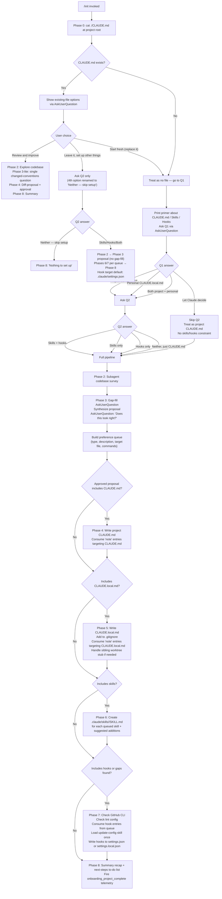

# `/init`

> Analysis basis: CC v2.1.198 bundle.js (AST extraction + Claude interpretation)
> Minimum version: v2.1.198

---

## Overview

The `/init` command bootstraps a project's Claude Code configuration by interactively guiding the user through creating or improving `CLAUDE.md` files, skills (`.claude/skills/`), and lifecycle hooks (`.claude/settings.json`). It surveys the codebase via a subagent, asks targeted gap-fill questions, synthesizes a proposal from findings, then writes only the artifacts the user approves. The prompt body is conditional: a full interactive template (~20,920 chars) is used for fresh or update flows, and a shorter fallback template (~1,592 chars) handles a simpler "just create CLAUDE.md" path.

---

## Registration

| Field | Value |
|---|---|
| type | `prompt` |
| name | `init` |
| description | `Initialize new CLAUDE.md file(s) and optional skills/hooks with codebase documentation \| Initialize a new CLAUDE.md file with codebase documentation` |
| loc_byte | `12162759` |
| loc_byte_end | `12163152` |
| loc_line | `8183` |
| handler_method | `getPromptForCommand` |
| handler_method_start | `12163075` |
| handler_method_end | `12163151` |
| prompt_body.length | `22519` characters total |
| prompt_body.trace | `conditional; identifier→njf (var template, 20920 chars); identifier→tjf (var template, 1592 chars)` |
| arbor_handler.name | `getPromptForCommand` |
| arbor_handler.fqn | `claude-2.1.198::getPromptForCommand` |
| arbor_handler.kind | `Method` |
| arbor_handler.resolution_path | `direct` |
| arbor_handler.n_hits | `2` |

Analysis basis: CC v2.1.198 bundle.js:+12162759

---

## Input Branching

The command involves 8 distinct phases with multiple branching paths based on CLAUDE.md existence, user answers, and codebase findings. A Mermaid flowchart is used.



---

## Behavioral Spec

### Handler Dispatch and Prompt Selection

The handler `getPromptForCommand` (Arbor-resolved, `direct` path) is an ObjectMethod on the registration object. At invocation it selects one of two prompt templates:

```
function getPromptForCommand(context):
    # Two templates exist in the bundle:
    #   fullInteractiveTemplate  (~20920 chars, identifier njf)
    #   shortFallbackTemplate    (~1592 chars,  identifier tjf)
    # The branch condition is evaluated at call time (exact condition
    # not recoverable at depth-2; needs --depth 4)
    if conditionForFullFlow(context):
        promptText = fullInteractiveTemplate   # 8-phase guided flow
    else:
        promptText = shortFallbackTemplate     # simple CLAUDE.md creation
    return { type: "text", content: promptText }
```

Analysis basis: CC v2.1.198 bundle.js:+12163075 (handler_method_start), +12163123 (literal "text"), +12163135 (ejf call)

---

### Phase 0 — Existing File Detection

```
function phase0_checkExistingClaudeMd():
    result = shell("cat ./CLAUDE.md")   # project-root only; no tree walk
    if result.exitCode == 0:
        return { exists: true, content: result.stdout }
    else:
        return { exists: false }
```

The probe is intentionally shallow: only the project-root `CLAUDE.md` is checked, not subdirectory files. This gates Phase 1's question variant.

Analysis basis: CC v2.1.198 bundle.js:+4202476 (literal "CLAUDE.md"), +4202471 (path resolution via `Pt`)

---

### Phase 1 — Interactive Setup Questions

```
function phase1_askSetupQuestions(phase0Result):
    printPrimer()   # Explains CLAUDE.md, Skills, Hooks concepts

    if phase0Result.exists:
        choice = AskUserQuestion("I found an existing CLAUDE.md. What would you like to do?",
                                  options=["Review and improve it",
                                           "Leave it, set up other things",
                                           "Start fresh (replace it)"])
        return routeFromExistingChoice(choice)
    else:
        q1 = AskUserQuestion("Which CLAUDE.md files should /init set up?",
                              options=["Project CLAUDE.md",
                                       "Personal CLAUDE.local.md",
                                       "Both project + personal",
                                       "Let Claude decide"])
        if q1 != "Let Claude decide":
            q2 = AskUserQuestion("Also set up skills and hooks?",
                                  options=["Skills + hooks", "Skills only",
                                           "Hooks only", "Neither, just CLAUDE.md"])
        else:
            q2 = null   # skipped; treated as project CLAUDE.md, unconstrained
        return { q1, q2 }
```

Q2 is a hint, not a hard filter — Phase 3 may deviate and will note the deviation.

Analysis basis: CC v2.1.198 bundle.js:+4202514 (literal "workspace"), +4202635 (literal "claudemd"), +4202651 (literal "Run /init to create…")

---

### Phase 2 — Codebase Survey

```
function phase2_exploreCodbase():
    # Launch subagent to read key files:
    files = [
        "package.json", "Cargo.toml", "pyproject.toml", "go.mod", "pom.xml",
        "README", "Makefile", "CI configs",
        "CLAUDE.md", ".claude/rules/", "AGENTS.md",
        ".cursor/rules", ".cursorrules",
        ".github/copilot-instructions.md",
        ".devin/rules/", ".windsurf/rules/", ".windsurfrules",
        ".clinerules", ".mcp.json"
    ]
    findings = subagent.read(files)

    detect = {
        buildTestLintCommands: ...,
        languages: ...,
        frameworks: ...,
        packageManager: ...,
        projectStructure: ...,    # monorepo | multi-module | single
        codeStyleDifferences: ...,
        gotchas: ...,
        envVars: ...,
        existingSkillsDir: ...,   # .claude/skills/ present?
        existingRulesDir: ...,    # .claude/rules/ present?
        formatterConfig: ...,     # prettier, biome, ruff, black, gofmt, etc.
        worktrees: shell("git worktree list")
    }
    gaps = whatCouldNotBeDeterminedFromCode(findings)
    return { findings, gaps }
```

Analysis basis: CC v2.1.198 bundle.js:+4202883 (Xct→Gh), +4202928 (Xct→uQi), +4202934 (Xct→_b)

---

### Phase 3 — Gap-Fill Interview and Proposal Synthesis

```
function phase3_gapFillAndPropose(q1, q2, findings, gaps):
    if userChose("Review and improve"):
        answer = AskUserQuestion("Has anything changed about how the team works?",
                                  options=["No, nothing's changed", "Yes — let me describe"])
        if answer == "Yes":
            changes = AskUserQuestion(freeText=true)
        return buildDiffProposal(existingFile, findings, changes)

    questions = buildGapQuestions(q1, gaps)
    # For project/both/Let Claude decide: codebase practices
    # For personal/both: user's role, familiarity, sandbox URLs, worktree layout
    answers = AskUserQuestion(questions)

    proposal = []
    if q1 includes project file:
        proposal.push({ type:"file", path:"CLAUDE.md", summary: oneLineSummary() })
    if q1 includes personal file:
        proposal.push({ type:"file", path:"CLAUDE.local.md", summary: oneLineSummary() })

    for each finding in (findings + answers):
        artifact = classify(finding)
        # Hook   → deterministic fast shell command (format/lint per edit)
        # Skill  → on-demand multi-step workflow (/verify, /deploy-staging)
        # Note   → behavioral guidance without enforcement
        proposal.push(artifact)

    if q2 != null and proposal deviates from q2:
        printDeviationNote()

    printProposal(proposal)   # printed as normal assistant text, not preview field
    approval = AskUserQuestion("Does this look right?",
                                options=["Looks good — proceed",
                                         "Drop the hook", "Drop the skill"])
                                # "Other" added automatically by tool

    preferenceQueue = buildQueue(approvedProposal)
    return preferenceQueue
```

Analysis basis: CC v2.1.198 bundle.js:+4202985 (xe call), +4202988 (literal "onboarding_project_complete")

---

### Phase 4 — Write CLAUDE.md

```
function phase4_writeClaudeMd(preferenceQueue, findings, q1Choice):
    if userChose("Review and improve"):
        diffs = computeDiff(existingFile, findings, phase3LiteAnswer)
        printDiffs(diffs)   # each diff has one-line reason
        approval = AskUserQuestion("Apply these edits?",
                                    options=["Apply all", "Let me pick which",
                                             "Skip — leave it as is"])
        if approval == "Skip": return
        applySelectedDiffs(diffs, approval)
        return

    content = []
    content.push(REQUIRED_PREFIX)
    # REQUIRED_PREFIX starts with "# CLAUDE.md\n\nThis file provides guidance..."

    notes = preferenceQueue.filter(type=="note" and target=="CLAUDE.md")
    for note in notes:
        content.push(conciseLine(note))

    # Include only what passes: "Would removing this cause Claude mistakes?"
    include = [
        nonObviousBuildTestLintCommands(findings),
        codeStyleDifferingFromDefaults(findings),
        testingInstructionsAndQuirks(findings),
        repoEtiquette(findings),
        requiredEnvVars(findings),
        nonObviousGotchas(findings),
        importantPartsFromAiToolConfigs(findings)   # AGENTS.md, .cursor/rules, etc.
    ]
    exclude = [
        fileByFileStructure,
        standardLanguageConventions,
        genericAdvice,
        frequentlyChangingInfo,   # use @path/to/import instead
        longTutorials,            # move to skill or separate file
        commandsObviousFromManifest
    ]

    if projectHasMultipleConcerns():
        suggestRulesDirectory(".claude/rules/")   # auto-loaded, path-scopable

    if isMonorepoOrMultiModule():
        offerSubdirClaudeMdFiles()   # auto-loaded when Claude works in subdir

    writeFile("./CLAUDE.md", content)
```

Analysis basis: CC v2.1.198 bundle.js:+14259726 (_b→Onn), +14259750 (_b→H0), +14259826 (_b→TFe)

---

### Phase 5 — Write CLAUDE.local.md

```
function phase5_writeClaudeLocalMd(preferenceQueue, findings, worktreeInfo):
    if file_exists("./CLAUDE.local.md"):
        existingContent = readFile("./CLAUDE.local.md")
        # propose specific additions only; never silently overwrite

    if worktreeInfo.hasMultiple and userConfirmed("sibling/external"):
        # Upward file walk won't find one CLAUDE.local.md from all worktrees
        personalContent = buildPersonalContent(preferenceQueue)
        writeFile("~/.claude/<project-name>-instructions.md", personalContent)
        stub = "@~/.claude/<project-name>-instructions.md"
        writeFile("./CLAUDE.local.md", stub)
        # User copies stub to each sibling worktree
    else:
        # Nested worktrees: main repo's CLAUDE.local.md found automatically
        notes = preferenceQueue.filter(type=="note" and target=="CLAUDE.local.md")
        content = buildPersonalContent(notes)   # role, familiarity, sandbox URLs, prefs
        writeFile("./CLAUDE.local.md", content)

    appendToGitignore("CLAUDE.local.md")   # keep private
    # NEVER import this stub inside project CLAUDE.md
```

Analysis basis: CC v2.1.198 bundle.js:+14259876 (_b→Dnn), +14259957 (_b→Mnn), +14259966 (_b→ACt)

---

### Phase 6 — Skill Creation

```
function phase6_createSkills(preferenceQueue, findings):
    existingSkills = readDir(".claude/skills/")   # do not overwrite

    # Process queued skill preferences first
    for skill in preferenceQueue.filter(type=="skill"):
        name = deriveNameFromPreference(skill)
        body = buildBodyFromUserWordsAndFindings(skill, findings)
        if bodyIsUnderspecified(body):
            clarification = AskUserQuestion(clarifyingQuestion)
        if matchesBundledSkill(name):
            notifyUserBundledStillExists()   # user's skill is additive
        writeFile(".claude/skills/{name}/SKILL.md", formatSkillMd(name, body))

    # Suggest additional skills based on findings
    suggestions = identifyAdditionalSkillOpportunities(findings)
    for suggestion in suggestions:
        if not conflicts(suggestion, existingSkills):
            present({ name, purpose, rationale })

    # Skill frontmatter format:
    # ---
    # name: <skill-name>
    # description: <what and when>
    # ---
    # [Instructions for Claude]
    #
    # Side-effect workflows use: disable-model-invocation: true
    # and accept $ARGUMENTS for parameterized input
```

Analysis basis: CC v2.1.198 bundle.js:+14259892 (_b→T), +14260110 (_b→V)

---

### Phase 7 — Additional Optimizations

```
function phase7_optimizations(preferenceQueue, findings, q1Choice):
    # GitHub CLI check
    ghPresent = shell("which gh")   # "where gh" on Windows
    if not ghPresent and usesGitHub(findings):
        AskUserQuestion("Install GitHub CLI?", explanation=githubCliExplanation)

    # Linting check
    if not lintConfigFound(findings):
        AskUserQuestion("Set up linting?", explanation=lintingExplanation)

    # Hook setup from preference queue
    hookTarget = deriveHookTarget(q1Choice)
    # q1=="project" → .claude/settings.json  (team-shared, committed)
    # q1=="personal" → .claude/settings.local.json
    # q1=="both" → ask the user once for all hooks

    if preferenceQueue.has(type=="hook") or (findings.formatter and noFormattingHookInQueue):
        loadHookReference()
        # Invoke Skill tool: skill='update-config', args='[hooks-only] <summary>'
        # Load ONCE per /init run; subsequent hooks reuse it

        for hook in resolvedHooks:
            event = mapPreferenceToEvent(hook)
            # "after every edit"      → PostToolUse + matcher "Write|Edit"
            # "when Claude finishes"  → Stop event
            # "before running bash"   → PreToolUse + matcher "Bash"
            # "before committing"     → NOT a hooks.json hook (can't filter by command)
            #                           Route to .git/hooks/pre-commit / husky instead

            followConstructingHookFlow(hook, event, hookTarget)
            # Steps: dedup check → construct → pipe-test raw → wrap →
            #        write JSON → jq -e validate → live-proof → cleanup → handoff
```

Lock contention timeout: 60000 ms (Analysis basis: CC v2.1.198 bundle.js:+14256485)
Backup rotation keeps 5 most recent backups (Analysis basis: CC v2.1.198 bundle.js:+14256740)
Lock acquisition warning threshold: 100 ms (Analysis basis: CC v2.1.198 bundle.js:+14255341)
File mode for written configs: 384 (octal 0600) (Analysis basis: CC v2.1.198 bundle.js:+14257022)

---

### Phase 8 — Summary and Next Steps

```
function phase8_summary(artifactsWritten, findings):
    printRecap(artifactsWritten)   # files written + key points in each
    remindUserFilesAreStartingPoint()
    remindUserCanRerunInit()

    todoList = []
    if frontendDetected(findings):
        todoList.push("/plugin install frontend-design@claude-plugins-official")
        todoList.push("/plugin install playwright@claude-plugins-official")
    if githubCliMissing and userSaidNo:
        todoList.push(githubCliItem)
    if lintingMissing and userSaidNo:
        todoList.push(lintingItem)
    if testsMissingOrSparse(findings):
        todoList.push(testFrameworkItem)
    todoList.push("/plugin install skill-creator@claude-plugins-official")   # always
    todoList.push("/plugin — browse official plugins")   # always

    printTodoList(sortByImpact(todoList))

    emit("onboarding_project_complete")   # telemetry
```

Analysis basis: CC v2.1.198 bundle.js:+4202988 (literal "onboarding_project_complete")

---

### Config Persistence and Lock Safety

The config write path (reached via `Kfr` → `BMt`) implements a robust atomic-write pattern:

```
function saveConfigWithLock(configPath, newData, cachedConfig):
    acquireLock(configPath)
    # Lock contention emits tengu_config_lock_contention if slow

    reread = readFile(configPath)

    if reread has parse error:
        emit("tengu_config_auto_repaired")
        # Auto-repair from cached config; see GH #3117
        data = cachedConfig
    else if reread is missing auth that cachedConfig has:
        emit("tengu_config_auth_loss_prevented")
        # Refuse to write to avoid wiping ~/.claude.json; see GH #3117
        return
    else if reread differs from expectedState:
        emit("tengu_config_stale_write")

    backup = timestampedBackupPath(configPath)
    # Backup naming: path.join(backupsDir, baseName + ".backup." + Date.now())
    copyFile(configPath, backup)
    pruneOldBackups(keep=5)   # keep 5 most recent

    tempPath = randomHexPath()   # 6 random bytes → 12 hex chars
    writeFileSyncAndFlush(tempPath, serialize(newData))
    fchmod(tempPath, 0o600)
    renameSync(tempPath, configPath)   # atomic on POSIX

    releaseLock()

    # Error cases:
    # EACCES → emit tengu_config_auth_loss_prevented or fallback write
    # parse error on reread → emit tengu_config_parse_error
```

Guarded error message: `"Config accessed before allowed."` (Analysis basis: CC v2.1.198 bundle.js:+14257755)
Auth-loss guard message prefix: `"saveConfigWithLock: re-read config is missing auth…"` (Analysis basis: CC v2.1.198 bundle.js:+14256127)
Parse-error repair message prefix: `"saveConfigWithLock: re-read hit a parse error…"` (Analysis basis: CC v2.1.198 bundle.js:+14255821)

---

## State & Side Effects

| Item | Detail |
|---|---|
| Telemetry: `tengu_config_lock_contention` | Fired when config lock acquisition is slow (>100 ms threshold). CC v2.1.198 bundle.js:+14255436 |
| Telemetry: `tengu_config_stale_write` | Fired when re-read config differs from expected state during lock-guarded save. CC v2.1.198 bundle.js:+14255572 |
| Telemetry: `tengu_config_auto_repaired` | Fired when re-read config has a parse error and the cached config is used for repair. CC v2.1.198 bundle.js:+14255949 |
| Telemetry: `tengu_config_auth_loss_prevented` | Fired when re-read config is missing auth that the cache has; write aborted to protect `~/.claude.json`. CC v2.1.198 bundle.js:+14256279 |
| Telemetry: `tengu_config_fallback_write` | Fired when fallback (non-atomic) write path is used. CC v2.1.198 bundle.js:+14255052 |
| Telemetry: `tengu_config_parse_error` | Fired on config JSON parse failure. CC v2.1.198 bundle.js:+14259169 |
| Telemetry: `tengu_feature_ok` | Fired on successful feature gate check. CC v2.1.198 bundle.js:+1039573 |
| Telemetry: `tengu_slate_harbor_experiment` | Fired during experiment tracking (A/B test infra). CC v2.1.198 bundle.js:+12139650 |
| Telemetry: `onboarding_project_complete` | Fired at end of Phase 8 summary to signal successful `/init` completion. CC v2.1.198 bundle.js:+4202988 |
| Files written | `./CLAUDE.md`, `./CLAUDE.local.md` (optional), `.claude/skills/<name>/SKILL.md` (optional), `.claude/settings.json` or `.claude/settings.local.json` (hooks, optional), `~/.claude/<project-name>-instructions.md` (sibling-worktree path only) |
| .gitignore modification | `CLAUDE.local.md` is appended to `.gitignore` when the personal file is created (Phase 5) |
| Config backups | Up to 5 timestamped backups written to a `backups/` subdirectory alongside the config file; backup filename contains `Date.now()` timestamp and `.backup.` infix |
| Atomic write | Config writes use temp file → `fchmod(0o600)` → `fsync` → `rename` pattern; falls back to in-place write on `EACCES` |
| File watch cleanup | `i_c.unwatchFile` called on config paths during update cycle |
| Lock deduplication | `S7o` Set (config lock tracker) used for dedup; `BJr` Set used in experiment tracking |
| Growthbook experiment | `growthbook_experiment` event emitted via `Yne.emit`; UUID generated with `OJr.randomUUID()` |
| Hook reference load | `update-config` skill invoked exactly once per `/init` run via Skill tool before first hook is written |

---

## Version History

| Version | Change |
|---|---|
| v2.1.198 | Initial analysis. Full 8-phase interactive flow; conditional prompt (njf ~20920 chars / tjf ~1592 chars); `CLAUDE.local.md` worktree-aware stub support; `update-config` skill integration for hook construction; `save_project` telemetry literal present alongside `onboarding_project_complete`. |

---

## Common Mistakes

1. **Running `/init` in a subdirectory expecting it to affect the root.** Phase 0 checks `./CLAUDE.md` relative to the current working directory; only the project-root file is detected. Run `/init` from the repository root.
2. **Assuming Q2 is a hard filter.** The user's skills/hooks answer in Q2 is a hint. Phase 3 may propose different artifact types if the codebase evidence warrants it; the deviation is explicitly noted in the proposal.
3. **Choosing "Let Claude decide" and expecting no writes without approval.** This option skips Q2 but still presents a full proposal via `AskUserQuestion` before writing anything. Nothing is written without explicit user approval.
4. **Putting personal setup details in project CLAUDE.md.** The `@~/.claude/<project-name>-instructions.md` import stub belongs only in `CLAUDE.local.md`, never in the team-shared `CLAUDE.md`. The prompt body enforces this explicitly.
5. **Expecting `/init` to replace existing skills.** Phase 6 reads `.claude/skills/` first and only proposes new skills that complement existing ones; it will not overwrite.
6. **Treating the config write as instant.** The lock-guarded save has a 60,000 ms timeout and a 100 ms contention-warning threshold. Concurrent Claude instances may cause `tengu_config_lock_contention` events and brief write delays.
7. **Assuming "before committing" maps to a Claude hook.** The hook system cannot filter Bash commands by content, so `git commit` cannot be intercepted by a `PreToolUse` matcher. `/init` routes this case to a git pre-commit hook instead.
8. **Invoking the `update-config` skill more than once per run.** The hook reference skill is loaded exactly once; subsequent hooks in the same `/init` session reuse the already-loaded context.

---

## Appendix — Identifier Mapping

> For bundle debugging only. Identifiers change across versions.

| Identifier | Role |
|---|---|
| `__handler_init` | Synthetic BFS entry point for the `/init` command handler; not a real bundle symbol |
| `Xct` | Top-level `/init` orchestrator function; coordinates subagent survey and artifact writing |
| `Gh` | Config read helper; reads project config and dispatches to parse/watch logic |
| `Dt` | Config update dispatcher; routes to lock-guarded save or fallback write |
| `zt` | Path resolution / project root utility |
| `A7o` | Config accessor / getter helper |
| `SCt` | Lock-guarded config read function; reads `~/.claude.json` with ENOENT/parse guards |
| `qHm` | File-watch registration helper for config paths |
| `uQi` | CLAUDE.md path locator; resolves the target filename in the project root |
| `zro` | Workspace path builder; joins path segments for CLAUDE.md target |
| `Pt` | Path normalisation helper (calls `qhn` and `ar`) |
| `Zws` | Cwd/home directory resolver |
| `_b` | Main artifact-writing orchestrator for Phase 4/5/6/7 (writes CLAUDE.md, local, skills, hooks) |
| `Onn` | Atomic config write function; implements temp-file → fchmod → fsync → rename pattern |
| `sfi` | File metadata / stat helper used during write setup |
| `T` | Terminal output / stream writer |
| `V` | Logging / verbose output utility |
| `en` | Error normaliser / formatter |
| `ACt` | Auth-loss guard checker for config writes |
| `Me` | JSON serialiser wrapper |
| `v7o` | Backup directory path builder (joins `backups/` subdir) |
| `BMt` | `writeFileSyncAndFlush` implementation; handles symlink resolution, temp-file write, fsync, rename, EACCES fallback |
| `TFe` | Post-write hook / callback trigger |
| `Dnn` | Timestamp helper (`Date.now()` wrapper used for backup naming) |
| `Mnn` | Fallback project config save (calls `SCt` + `H0`) |
| `Kfr` | `save_project` config writer; calls `BMt` and `Pe` for project-scoped settings |
| `Pe` | Post-save callback dispatcher |
| `xe` | Feature-flag / experiment gate checker (emits `tengu_feature_ok`) |
| `ejf` | Experiment tracking setup function (calls `st` and `nt`) |
| `st` | Experiment string-coercion helper |
| `nt` | Experiment assignment logic; checks `k0e`, `BV` caches and calls `aMn`/`Dt` |
| `n2t` | Experiment cache initialiser |
| `r2t` | Experiment result formatter |
| `tG` | Growthbook feature evaluator (calls `eG`) |
| `eG` | Growthbook context / feature flag resolver (calls `Z3`) |
| `aMn` | Experiment assignment function; deduplicates via `BJr` Set, calls `FJr` |
| `FJr` | Experiment event emitter; generates UUID via `OJr.randomUUID`, emits `growthbook_experiment` |
| `qJr` | Experiment result handler; calls `Gh`/`Dt` for config persistence of assignment |
| `n` | String lowercase normaliser (`i.toLowerCase()`) |
| `v` | String prefix checker (`v.startsWith`) |
| `_` | Conversation/message array builder (joins segments, pushes to `h`) |
| `I` | Scroll / viewport position calculator (`Math.max`, `Math.floor`) |
| `i` | Stream / connection close helper |
| `e` | String replace utility (`t.replace`) |

---

Note: index built via Arbor fallback; some signals (telemetry, literals) may be missing — see arbor-fallback.js.