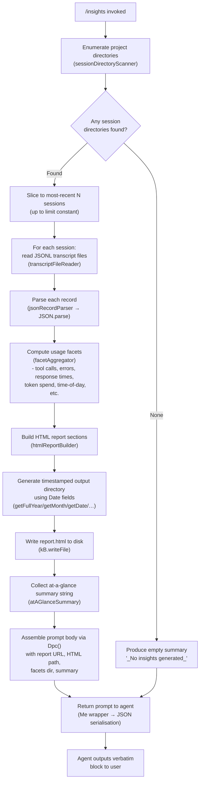

# `/insights`

> Analysis basis: CC v2.1.198 bundle.js (AST extraction + Claude interpretation)
> Minimum version: v2.1.198

---

## Overview

The `/insights` command generates a self-contained HTML usage report that aggregates and analyses all historical Claude Code session data stored on disk. It collects session transcripts, computes statistics across multiple facets (tools used, response times, time-of-day patterns, token spend, etc.), writes the report as `report.html` inside a timestamped directory, and then instructs the agent to deliver a fixed confirmation message that includes a link to the generated file.

---

## Registration

| Field | Value |
|---|---|
| type | `prompt` |
| name | `insights` |
| description | Generate a report analyzing your Claude Code sessions |
| loc_byte | `13679309` |
| loc_byte_end | `13680613` |
| loc_line | `10272` |
| handler_method | `getPromptForCommand` |
| handler_method_start | `13679483` |
| handler_method_end | `13680612` |
| prompt_body.length | `513` characters |
| prompt_body.trace | `call→Dpc(...) (1 literals)` |
| arbor_handler.name | `getPromptForCommand` |
| arbor_handler.kind | `Method` |
| arbor_handler.fqn | `claude-2.1.198::getPromptForCommand` |
| arbor_handler.resolution_path | `direct` |
| arbor_handler.n_hits | `1` |

Analysis basis: CC v2.1.198 bundle.js:+13679309

---

## Input Branching

The handler's execution involves more than three distinct branches (session enumeration, facet data collection, HTML generation, prompt assembly, and fallback-to-empty-summary paths); a Mermaid flowchart is used.



Analysis basis: CC v2.1.198 bundle.js:+13679489 (handler entry), +13665911 (sessionDirectoryScanner), +13666015 (Promise.all over sessions), +13668526 (writeFile), +13680515 (Dpc call)

---

## Behavioral Spec

### 1. Session Directory Scanning

```
function sessionDirectoryScanner(baseDir):
    entries = filesystem.readdir(baseDir)        // kB.readdir
    projects = path.join(baseDir, "projects")    // literal "projects"
    subdirs = entries.filter(isDirectory)
    sort subdirs (setImmediate-deferred sort)
    return subdirs
```

The scanner resolves the `projects` sub-path (literal `"projects"`, bundle.js:+5446423) under the global config directory and collects only directory entries (bundle.js:+13665606). Results are sorted after yielding to the event loop via `setImmediate` (bundle.js:+13665818). Up to a batch limit of 50 / 200 entries are processed depending on context (literals `50` at +13665930, `200` at +13665935).

Analysis basis: CC v2.1.198 bundle.js:+13665538

### 2. Transcript File Reading

```
function transcriptFileReader(sessionDir):
    files = filesystem.readdir(sessionDir)       // Ll.readdir
    jsonlFiles = files.filter(isFile and matchesExtension(".jsonl"))
    for each file:
        stat = filesystem.stat(file)             // Ll.stat
        records.push({ name: basename(file), stat })
    return records sorted by mtime
```

Only files with the `.jsonl` extension are collected (literal `".jsonl"`, bundle.js:+13770511). File metadata is obtained via `stat` calls (bundle.js:+13770714). The file-name filter uses a regex test (bundle.js:+27889 via `xM → Qnu.test`).

Analysis basis: CC v2.1.198 bundle.js:+13770405

### 3. Record Parsing and Session Metadata Loading

```
function sessionMetaLoader(sessionDir):
    metaPath = path.join(usageDataDir, "session-meta", sessionId)
    raw = filesystem.readFile(metaPath, "utf-8")  // encoding literal at +13610859
    parsed = safeJsonParse(raw)                   // Gt → JSON.parse
    return parsed

function jsonRecordParser(rawText):
    return safeJsonParse(rawText)                 // Gt → JSON.parse
```

Session metadata is stored under the `"session-meta"` subdirectory (literal, bundle.js:+13604790) inside `"usage-data"` (literal, bundle.js:+13604694). The `"facets"` subdirectory (literal, bundle.js:+13604744) holds per-session facet records. Parsing uses a safe JSON wrapper (`Gt`) that delegates to native `JSON.parse` (bundle.js:+195356).

Analysis basis: CC v2.1.198 bundle.js:+13610800, +13610835, +13610876

### 4. Facet Aggregation

```
function facetAggregator(sessions):
    for each session record:
        classify tool calls (WebSearch, WebFetch, Edit, Write, …)
        classify tool errors (command failures, edit failures, file errors, …)
        bucket response times into bands:
            "2-10s", "10-30s", "30s-1m", "1-2m", "2-5m", "5-15m", ">15m"
        bucket hour-of-day into:
            "Morning (6-12)", "Afternoon (12-18)", "Evening (18-24)", "Night (0-6)"
        accumulate token spend
        accumulate git actions ("git commit", "git push")
    return aggregated facet maps
```

Response-time band boundaries include thresholds at 120 s (bundle.js:+13622301) and 900 s (bundle.js:+13622383). Time-of-day hour boundaries use integer constants 11, 12–17, 18–23, 0–5 (bundle.js:+13622964 et seq.). Tool names matched include `"WebSearch"` (+13605387), `"WebFetch"` (+13605411), `"Edit"` (+13605518), `"Write"` (+13605530). Tool errors classified include `"Command Failed"` (+13606405), `"Edit Failed"` (+13606577), `"File Not Found"` (+13606801), `"File Too Large"` (+13606715), `"File Changed"` (+13606635), `"User Rejected"` (+13606483).

Analysis basis: CC v2.1.198 bundle.js:+13607464 (facetProcessor), +13614646 (reportAggregator)

### 5. HTML Report Generation

```
function htmlReportBuilder(facets, sessionMeta):
    // Escape HTML entities (&amp; &lt; &gt; &quot; &apos;)
    sections = []
    sections.push(atAGlanceSummary(facets))
    sections.push(toolUsageSection(facets.toolCalls))
    sections.push(toolErrorSection(facets.toolErrors))     // red #dc2626, green #16a34a
    sections.push(responseTimeSection(facets.responseTimes))
    sections.push(timeOfDaySection(facets.hourBuckets))
    sections.push(tokenSpendSection(facets.tokenUsage))
    // Chart colors: #2563eb, #0891b2, #10b981, #8b5cf6, #eab308
    html = assembleFullDocument(sections)
    return html
```

The report uses a set of fixed brand colors (bundle.js:+13659746, +13659884, +13660056, +13660199, +13664204, +13663462, +13663711). Empty-state placeholders are `"<p class=\"empty\">No data</p>"` (+13621572), `"<p class=\"empty\">No response time data</p>"` (+13622029), `"<p class=\"empty\">No time data</p>"` (+13622879), `"<p class=\"empty\">No tool errors</p>"` (+13663473). The "Add to CLAUDE.md" action string appears at bundle.js:+13627425. Markdown-to-HTML conversion uses `<strong>$1</strong>` (+13623787), bullet `"• "` (+13623830), and `"<br>"` (+13623860).

Analysis basis: CC v2.1.198 bundle.js:+13623715 (htmlReportBuilder entry), +13659724 (color chart renderer), +13660416 (distribution renderer)

### 6. Output Directory and File Writing

```
function writeInsightsReport(html):
    now = new Date()
    dirName = formatTimestamp(
        now.getFullYear(), now.getMonth(), now.getDate(),
        now.getHours(), now.getMinutes(), now.getSeconds()
    )
    outputDir = path.join(insightsBaseDir, dirName)
    filesystem.mkdir(outputDir, { recursive: true })     // kB.mkdir
    reportPath = path.join(outputDir, "report.html")     // literal at +13668498
    filesystem.writeFile(reportPath, html)               // kB.writeFile
    return { reportPath, outputDir }
```

The output filename is always `"report.html"` (bundle.js:+13668498). The directory is constructed from date/time components (bundle.js:+13668330 through +13668428). The `kB.mkdir` call uses a recursive option to create intermediate directories (bundle.js:+13668239).

Analysis basis: CC v2.1.198 bundle.js:+13668239

### 7. At-a-Glance Summary Computation

```
function atAGlanceSummary(facets):
    // Produces a short text block for injection into the prompt body
    // Contains rounded counts (Math.round at +13679870)
    // Separator literal " · " used between items (+13679941)
    if no data:
        return "_No insights generated_"    // literal at +13680380
    return formattedSummaryString
```

The summary is prefixed with a note that it is for the agent's context only and has not been shown to the user. The separator `" · "` (bundle.js:+13679941) joins summary items. Fallback value `"_No insights generated_"` is used when no session data is available (bundle.js:+13680380).

Analysis basis: CC v2.1.198 bundle.js:+13679870

### 8. Prompt Assembly and Agent Instruction

```
function getPromptForCommand(context):
    // Arbor-resolved entry point: getPromptForCommand (direct, n_hits=1)
    reportData = collectInsightsData(context)    // Mpc call chain
    { reportPath, outputDir, atAGlance } = reportData
    promptText = Dpc(                            // loc_byte +13680515
        reportData,
        reportPath,
        outputDir,
        atAGlance
    )
    // promptText instructs agent to output <message> block verbatim
    return Me(promptText)                        // Me → JSON.stringify wrapper
```

The prompt body (513 characters, bundle.js:+13679309) instructs the agent to output the contents of a `<message>…</message>` block verbatim as its entire response, including a shareable report URL and an invitation to discuss any section. The agent must not omit any line from this block. The at-a-glance summary is embedded in the prompt for agent context but is explicitly marked as not yet visible to the user.

Analysis basis: CC v2.1.198 bundle.js:+13679489, +13680515, +13680533

### 9. Session Limit and Batch Slicing

The handler slices the collected session list before parallel processing (bundle.js:+13665992, `n.slice`). The numeric limits 50 and 200 (bundle.js:+13665930, +13665935) cap how many sessions are scanned in a single invocation. Within the parallel map over sessions (bundle.js:+13666015, `Promise.all`), each session is processed independently. A sub-limit of 5 sessions is used at one branch (literal `5`, bundle.js:+13666378). Token-spend sessions older than 1 800 000 ms (30 minutes) may be filtered (bundle.js:+13613283).

Analysis basis: CC v2.1.198 bundle.js:+13665992

### 10. Facets Disk Persistence

```
function persistFacets(sessionId, facetData):
    facetsDir = path.join(usageDataDir, "facets", sessionId)
    filesystem.mkdir(facetsDir, { recursive: true })
    outPath = path.join(facetsDir, recordFilename)
    payload = Me(facetData)    // JSON.stringify
    filesystem.writeFile(outPath, payload)
```

Facet data is written under the `"facets"` sub-path (literal, bundle.js:+13604744). The `adm` writer (bundle.js:+13611376) and `sdm` writer (bundle.js:+13610619) both follow this pattern, using `kB.mkdir` and `kB.writeFile` respectively.

Analysis basis: CC v2.1.198 bundle.js:+13611376, +13610619

---

## State & Side Effects

| Item | Detail |
|---|---|
| Telemetry | `tengu_daemon_config_reload` (bundle.js:+18392244); `tengu_daemon_idle_exit` (+18398067); `tengu_daemon_control` (+18414881); `tengu_bg_dispatch_sigkill_escalate` (+18374756); `tengu_bg_dispatch_low_mem` (+18375462); `tengu_bg_spare_enable` (+18376152); `tengu_bg_spare_claim` (+18376280); `tengu_bg_spare_claim_fail` (+18376546); `tengu_transcript_phantom_parent` (+13754991); `tengu_relink_walk_broken` (+13730051); `tengu_transcript_parent_cycle` (+13759179); `tengu_chain_parent_cycle` (+13731828); `tengu_chain_timestamp_fallback` (+13731977); `tengu_chain_parallel_tr_recovered` (+13733843); `tengu_daemon_yield` (+18397025); `tengu_voice_*` events (out-of-scope for this command) |
| File writes | Creates timestamped output directory and writes `report.html` inside it (bundle.js:+13668239, +13668526) |
| File reads | Reads JSONL transcript files and session-meta JSON files from the `usage-data` directory tree (bundle.js:+13610835, +13770405) |
| Directory creation | `kB.mkdir` with recursive flag for both the output directory and facet subdirectories (bundle.js:+13668239, +13611376) |
| Facet persistence | Session facet records may be written to `usage-data/facets/` during data collection (bundle.js:+13611457, +13610707) |
| appState changes | None identified in depth-2 traversal |
| Hook registration | None identified in depth-2 traversal |
| Sound | None identified in depth-2 traversal |
| Agent output constraint | Agent is instructed to output the `<message>` block verbatim; no additional agent reasoning is expected in the response |

---

## Version History

| Version | Change |
|---|---|
| v2.1.198 | Initial analysis |

---

## Common Mistakes

1. **Running `/insights` with no prior sessions** — If no JSONL transcript files exist under the `usage-data/projects/` tree, the at-a-glance summary will fall back to `"_No insights generated_"` and the report will be largely empty. Ensure at least one session has been completed before invoking the command.
2. **Expecting interactive output mid-generation** — The command performs all filesystem work synchronously before the agent responds. There is no streaming progress indicator; the terminal appears idle while the report is being built.
3. **Misinterpreting the agent's response as analysis** — The agent is explicitly instructed to output only the verbatim `<message>` block. Any apparent analysis in the response is part of that pre-composed block, not live reasoning over the data.
4. **Assuming the report URL is a remote URL** — The `Report URL` and `HTML file` fields in the prompt body both point to local filesystem paths. The file must be opened in a browser manually.
5. **Modifying `usage-data/` while `/insights` is running** — The command reads multiple files concurrently via `Promise.all`. Writing to session files mid-collection may produce inconsistent facet data in the report.
6. **Expecting data older than 30 minutes to always appear** — The handler includes a 1 800 000 ms (30-minute) cutoff filter (bundle.js:+13613283) that may exclude recent-but-stale spend data from certain aggregation paths.

---

## Appendix — Identifier Mapping

> For bundle debugging only. Identifiers change across versions.

| Identifier | Role |
|---|---|
| `__handler_insights` | Synthetic BFS entry point for the `/insights` command handler |
| `Mpc` | Main insights data-collection orchestrator (calls scanner, readers, aggregators, writers) |
| `_dm` | Session directory scanner; reads and filters project subdirectories |
| `E2` | Path joiner helper used during directory enumeration |
| `tCt` | JSONL transcript file enumerator; stats each `.jsonl` file |
| `xM` | File-extension matcher (regex test for `.jsonl`) |
| `idm` | Session metadata loader (reads `session-meta` JSON files) |
| `gqo` | Usage-data path resolver |
| `Btn` | Base path builder for `usage-data` directory |
| `xpc` | JSON parse wrapper used during metadata loading |
| `Gt` | Safe JSON parser (delegates to `JSON.parse`) |
| `tge` | JSON serialiser helper (delegates to `JSON.stringify`) |
| `SXe` | File write helper with stat check and ENOENT guard |
| `rdc` | Column-width calculator for display formatting |
| `lpr` | Full insights report assembler (drives facet aggregation and HTML rendering) |
| `Dfe` | Transcript chain / session-state builder |
| `$dm` | Session state initialiser |
| `ZW` | Chain walker utility |
| `XZe` | Message-record flattener / JSON-path walker |
| `EE` | Entity extractor used in chain building |
| `_pm` | Binary transcript parser (JSONL byte-level reader) |
| `ypm` | Synchronous JSONL header reader |
| `sfc` | Session facet collector / indexer |
| `Hpm` | JSONL chunk parser |
| `Mfc` | Facet map updater |
| `Lbe` | Session chain loader and timestamp resolver |
| `rpm` | NaN-safe numeric validator for timestamps |
| `opm` | Ordered session record builder |
| `tpm` | Topological session sorter |
| `kyt` | Key-map transformer helper |
| `Xqo` | Text sanitiser / entity replacer |
| `gen` | Generalised record renderer |
| `Zqo` | Content-type classifier (image/document detection) |
| `spm` | Array content type checker |
| `ipm` | Single-item content type checker |
| `Ibe` | Inline block extractor |
| `bpr` | Bucket pair accumulator |
| `Tpr` | Facet value list builder |
| `Qum` | NaN guard for numeric aggregation |
| `_qo` | Per-session facet processor (classifies tool calls, errors, timing) |
| `Lpc` | Individual record facet classifier |
| `$tn` | Tool name normaliser |
| `Jum` | File-extension extractor for tool-call classification |
| `wMe` | Diff-based change detector |
| `Cu` | String index helper |
| `Zh` | Duration rounder / formatter |
| `Hqo` | Aggregated stats finaliser |
| `adm` | Facet directory writer (mkdir + writeFile for `usage-data/facets`) |
| `Me` | JSON stringify wrapper |
| `odm` | Obsolete facet file reader and cleaner |
| `apr` | Alternative path resolver for `usage-data` |
| `Ppc` | Partial parse / record validator |
| `ldm` | Full session loader and HTML render driver |
| `rdm` | Parallel session data fetcher |
| `edm` | Per-session record extractor |
| `sNe` | HTML section renderer (produces report sections) |
| `pc` | Template interpolation helper |
| `Yrr` | Agent-listing delta / snapshot writer |
| `xn` | UUID generator wrapper |
| `ann` | Assistant-message extractor for at-a-glance summary |
| `CP` | CSS/HTML class helper |
| `RM` | Render mode selector |
| `o9` | Output formatter |
| `wpc` | Warmup renderer helper |
| `Ey` | Encoding utility |
| `Hf` | Token-count helper |
| `kt` | Encoding/token utility |
| `Sl` | Filter pipeline helper |
| `sr` | Error stringifier |
| `sdm` | Session data file writer (mkdir + writeFile) |
| `ydm` | Object-key enumerator for session map |
| `Rpc` | Report statistics aggregator (percentiles, medians, distributions) |
| `eCt` | Object entries iterator |
| `ii` | Index-of / slice utility |
| `kpc` | Numeric distribution builder (push, sort, percentile) |
| `udm` | Final report document assembler |
| `vpc` | Per-session HTML section generator |
| `Kum` | Encoding wrapper for report generation |
| `$o` | Object assign helper |
| `gdm` | HTML report string builder (full document) |
| `Yd` | HTML entity escaper |
| `Na` | String replaceAll wrapper for entity escaping |
| `ipr` | Inner HTML renderer |
| `hdm` | HTML stringify helper |
| `xIe` | Chart / bar-graph renderer |
| `fdm` | Distribution statistics formatter |
| `mdm` | Map-max normaliser for chart scaling |
| `D` | Date object used for timestamping output directory |
| `Dpc` | Prompt body template function (assembles final 513-char prompt string) |
| `lQc` | Heartbeat / config-reload coordinator |
| `adm` | Facet directory writer (see above) |
| `Re` | Error reporter / logger |
| `K` | Queue enqueue helper |
| `se` | Session event dispatcher |
| `re` | Reference tracker |
| `Q` | Pending-event queue |
| `Z` | Voice recording state machine (unrelated to insights core path) |
| `ne` | Notification emitter |