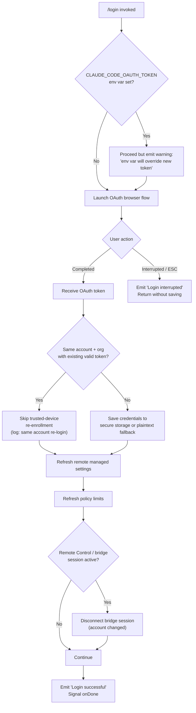

# `/login`

> Analysis basis: CC v2.1.198 bundle.js (AST extraction + Claude interpretation)
> Minimum version: v2.1.198

---

## Overview

The `/login` command initiates an interactive OAuth authentication flow that allows users to switch between Anthropic accounts or sign in for the first time. It launches a React-based UI component (handler `ESf`, resolved via Arbor as `ejl`) that orchestrates the full credential acquisition cycle: presenting a browser-based OAuth consent page, capturing the returned token, persisting it to secure storage (or plaintext fallback), then refreshing dependent subsystems — remote managed settings, policy limits, and trusted-device enrollment — before signalling completion.

---

## Registration

| Field | Value |
|---|---|
| type | `local-jsx` |
| name | `login` |
| description | `Switch Anthropic accounts \| Sign in with your Anthropic account` |
| loc_byte | `12172382` |
| loc_byte_end | `12172638` |
| loc_line | `8184` |
| module_id | `oDo` |
| load_inline | `true` |
| arbor_handler.name | `ejl` |
| arbor_handler.fqn | `claude-2.1.198::ejl` |
| arbor_handler.kind | `Function` |
| arbor_handler.resolution_path | `direct` |
| arbor_handler.n_hits | `2` |

Analysis basis: CC v2.1.198 bundle.js:+12172382 – +12172638

---

## Input Branching

The command has more than three distinct code paths depending on existing credentials, environment-variable overrides, and user interaction outcome.



Analysis basis: CC v2.1.198 bundle.js:+9774048 – +9776154

---

## Behavioral Spec

### Top-Level Handler (`ESf` / `ejl`)

The top-level JSX component renders the login UI and wires the completion callback.

```
function loginCommandComponent(props):
    state = useState(initialState)
    onDone = props.onDone

    render LoginScreen(
        onSuccess = handleSuccess,
        onInterrupt = handleInterrupt
    )
```

Analysis basis: CC v2.1.198 bundle.js:+9775882 (ESf), +9776032 (E1e dispatch)

---

### OAuth Flow Orchestrator (`E1e`)

This is the core stateful orchestrator. On mount it:

1. Invokes `onChangeAPIKey` to clear any stale in-memory key reference.
2. Calls `applyMessageOp` with an `"update"` operation and message index `1` to initialise the UI message slot.
3. Calls the timestamp utility (`uZe` → `Date.now`) to record session start.
4. Determines the current auth provider via `mr`/`Fm`/`st`; recognises provider strings: `"gateway"`, `"bedrock"`, `"foundry"`, `"anthropicAws"`, `"mantle"`, `"vertex"`, `"firstParty"`.
5. Launches the OAuth acquisition sequence via `jVe`.

```
function oauthOrchestrator(env):
    clearInMemoryAPIKey()
    initMessageSlot(index=1, op="update")
    sessionStart = Date.now()

    provider = detectAuthProvider(env)   // gateway | bedrock | firstParty | ...

    result = await launchOAuthFlow(provider)

    if result.interrupted:
        emit("Login interrupted")
        return

    warnIfEnvOverrideActive()   // CLAUDE_CODE_OAUTH_TOKEN check

    if isSameAccountReLogin(result.token):
        log("[trusted-device] Same account+org re-login with existing token, skipping re-enrollment")
    else:
        await persistCredentials(result.token)
        await enrollTrustedDevice(result.token)

    await refreshRemoteManagedSettings()
    await refreshPolicyLimits()

    if bridgeSessionActive():
        log("[bridge:repl] Account changed via /login — disconnecting Remote Control session")
        disconnectBridgeSession()

    appState = getAppState()
    setAppState({ ...appState, loginComplete: true })
    emit("Login successful")
    onDone()
```

Analysis basis: CC v2.1.198 bundle.js:+9774048 (onChangeAPIKey), +9774067 (applyMessageOp), +9774183 (uZe), +9774217 (jVe), +9774773 (bridge disconnect log), +9775040 (same-account re-login log), +9774688 (getAppState), +9774861 (setAppState), +9776113 (Login successful literal), +9776132 (Login interrupted literal)

---

### OAuth Token Acquisition (`jVe`)

`jVe` drives the browser-side consent exchange.

```
function launchOAuthFlow(provider):
    authConfig = resolveAuthConfig(provider)    // $Ka
    browserWindow = openBrowserConsent(authConfig)  // BVe → Dks

    token = await waitForCallback(timeout)      // RQ

    if token == null:
        return { interrupted: true }

    persistPolicySettings()    // S8n → policySettings literal
    notifySettingsChange()     // gD.notifyChange
    logResult(token)           // Re / sr

    startBackgroundPoll()      // IIo
    refreshOnAuthChange()      // wIo
    schedulePeriodicRefresh()  // FKa → SMn (setInterval / clearInterval)

    return { interrupted: false, token }
```

Analysis basis: CC v2.1.198 bundle.js:+8088218 ($Ka), +8088224 (BVe), +8088248 (RQ), +8088260 (S8n), +8088269 (IIo), +8088311 (wIo), +8088392 (FKa)

---

### Credential Storage (`pb` / `Iw` / `dfi`)

Credentials are written through a layered secure-storage approach.

```
function persistCredentials(token):
    // Primary: OS secure storage (keychain/credential-store)
    try:
        dfi.write(token)
        emit_telemetry("secure_storage_credentials_write")
        return
    catch TransientError:
        emit_telemetry("primary_transient_skip_fallback")
        return
    catch PermanentError:
        pass

    // Fallback: plaintext file
    writePlaintextFallback(token)
    emit_telemetry("plaintext_fallback_used")

    // Both failed
    if bothFailed:
        emit_telemetry("primary_and_fallback_failed")
        raise StorageError
```

Analysis basis: CC v2.1.198 bundle.js:+2390523 (secure_storage_credentials_write), +2390621 (primary_transient_skip_fallback), +2390770 (plaintext_fallback_used), +2390873 (primary_and_fallback_failed)

---

### Auth Provider Resolution (`mr` / `Pw` / `oR`)

Determines which backend the credential applies to.

```
function detectAuthProvider(env):
    if env.ANTHROPIC_API_KEY:
        return checkApiKeyHelper(env)   // "apiKeyHelper" | "none"

    if env.ANTHROPIC_AUTH_TOKEN or env.CLAUDE_CODE_OAUTH_TOKEN:
        return "firstParty"

    if env.CLAUDE_CODE_OAUTH_TOKEN_FILE_DESCRIPTOR:
        return readFdToken(env.CLAUDE_CODE_OAUTH_TOKEN_FILE_DESCRIPTOR)

    if env.CCR_OAUTH_TOKEN_FILE:
        return readFileToken(env.CCR_OAUTH_TOKEN_FILE)

    if env.CLAUDE_CODE_API_KEY_FILE_DESCRIPTOR:
        key = readFd(env.CLAUDE_CODE_API_KEY_FILE_DESCRIPTOR, maxBytes=20)
        return classifyKey(key)  // "API key" label used

    // No credentials — fail with required-env message
    raise Error("ANTHROPIC_API_KEY, ANTHROPIC_AUTH_TOKEN, CLAUDE_CODE_OAUTH_TOKEN, " +
                "or WIF env vars (ANTHROPIC_FEDERATION_RULE_ID + ANTHROPIC_ORGANIZATION_ID) required")
```

Analysis basis: CC v2.1.198 bundle.js:+3116026 (ANTHROPIC_API_KEY), +3116120 (apiKeyHelper), +3116159 (none), +2196977 (CLAUDE_CODE_API_KEY_FILE_DESCRIPTOR), +2197039 (API key), +3114016 (ANTHROPIC_AUTH_TOKEN), +3114105 (CLAUDE_CODE_OAUTH_TOKEN), +3114222 (CLAUDE_CODE_OAUTH_TOKEN_FILE_DESCRIPTOR), +3114291 (CCR_OAUTH_TOKEN_FILE), +3116495 (required env-var error message), +2198659 (maxBytes=20)

---

### Remote Managed Settings Refresh (`wIo` / `OKa` / `kqp`)

On successful login, managed settings are re-fetched from the remote endpoint.

```
function refreshRemoteManagedSettings():
    cacheKey = computeHash(authToken, "sha256", "hex")  // Njn → rqa.createHash

    response = fetchWithRetry(managedSettingsEndpoint,
        headers={
            "User-Agent": userAgent,
            "Cache-Control": "no-cache",
            "If-None-Match": cachedETag
        })

    switch response.status:
        200: parseAndApplySettings(response)       // "Remote settings: Fetched successfully"
        204: saveEmptySentinel()                   // "Remote settings: Saved empty sentinel (404 response)"
        304: useCache()                            // "Remote settings: Using cached settings (304)"
        401: forceRefreshRetry(); emit(tengu_remote_settings_401_force_refresh_retry)
        403: rejectSettings()
        404: saveEmptySentinel()
        500+: useStaleCache()                      // "Remote settings: Using stale cache after fetch failure"
        timeout: useStaleCache()
        network_error: useStaleCache()

    log("Remote settings: Refreshed after auth change")
```

Analysis basis: CC v2.1.198 bundle.js:+8083534 (User-Agent), +8083552 (Cache-Control), +8083568 (no-cache), +8083605 (If-None-Match), +8083968 (200), +8083977 (204), +8083986 (304), +8083995 (404), +8084028 (304 log), +8084874 (fetch success log), +8085421 (tengu_remote_settings_401_force_refresh_retry), +8086727 (stale cache log), +8088337 (auth-change refresh log), +8011702 (sha256), +8011729 (hex)

---

### Policy Limits Refresh (`k7t` / `t_c` / `bHm`)

Policy limits are fetched and cached after auth change.

```
function refreshPolicyLimits():
    authType = detectAuthType()   // "wif" | "oauth" | "api_key"

    result = await fetchPolicyLimitsEndpoint()
    emit_telemetry("tengu_policy_limits_fetch", { status: result.status })

    switch result.outcome:
        "succeeded": applyRestrictions()
                     log("Policy limits: Applied new restrictions successfully")
        "failed":    useStaleCache()
                     log("Policy limits: Using stale cache after fetch failure")
        "in_flight": defer()

    log("Policy limits: Refreshed after auth change")
```

Analysis basis: CC v2.1.198 bundle.js:+14230478 (wif), +14230517 (oauth), +14230534 (api_key), +14233176 (policy_limits_load), +14233245 (in_flight), +14233382 (succeeded), +14233394 (failed), +14233476 (tengu_policy_limits_fetch), +14234380 (applied new restrictions log), +14233996 (stale cache log), +14235524 (auth-change refresh log)

---

### Trusted-Device Enrollment (`W8t` / `FPe`)

After a new-account login, the device is enrolled for trusted-device tokens.

```
function enrollTrustedDevice(oauthToken):
    if env.CLAUDE_TRUSTED_DEVICE_TOKEN:
        log("[trusted-device] CLAUDE_TRUSTED_DEVICE_TOKEN env var is set, skipping enrollment")
        return

    if isEssentialTrafficOnly():
        log("[trusted-device] Essential traffic only, skipping enrollment")
        return

    if oauthToken == null:
        log("[trusted-device] No OAuth token, skipping enrollment")
        return

    response = POST enrollmentEndpoint,
        headers={ "Content-Type": "application/json" },
        body={ oauthToken },
        timeout=10000

    emit_telemetry("bridge_trusted_device_enroll")

    switch response.status:
        201: storeDeviceToken(response.device_token)
        401|403: emit({ error: "http_error" })
        other: emit({ error: "unknown" })

    if storeDeviceToken fails:
        emit({ error: "storage_failed" })
```

Analysis basis: CC v2.1.198 bundle.js:+8004104 (CLAUDE_TRUSTED_DEVICE_TOKEN skip log), +8004418 (essential traffic skip log), +8004531 (no OAuth token skip log), +8004782 (Content-Type), +8004825 (timeout=10000), +8004927 (bridge_trusted_device_enroll), +8005013 (201), +8005132 (http_error), +8005210 (missing device_token log), +8005311 (missing_token), +8005472 (unknown), +8005519 (storage_failed)

---

### Environment-Override Warning

If `CLAUDE_CODE_OAUTH_TOKEN` is set, the command emits a prominent warning after login:

> "Warning: CLAUDE_CODE_OAUTH_TOKEN is set in your environment and will override this login token at runtime. After logging in, unset that variable for your new credentials to take effect."

Analysis basis: CC v2.1.198 bundle.js:+9775657

---

### Authentication Failure Handling (`MEt` / `Jw`)

If the OAuth exchange fails (the assistant message type is `"authentication_failed"`), the orchestrator records the failure and surfaces it.

```
function handleAuthFailure(messages):
    lastAssistantMsg = messages.findLast(m => m.role == "assistant")
    if lastAssistantMsg.type == "authentication_failed":
        setUIState("error")
        emit(type="system", content=errorDetail)
```

Analysis basis: CC v2.1.198 bundle.js:+9775478 (MEt/Jw), +9775528 (authentication_failed), +9775567 (system), +14130593 (findLast)

---

### Login UI Component (`S1e`)

The terminal UI wrapper (`S1e`, width=21 columns) renders the interactive login screen.

```
function loginScreen(props):
    [state, setState] = useState(initial)
    memoSentinel = Symbol.for("react.memo_cache_sentinel")
    cacheSlots = new Array(21)   // React compiler memo cache

    keyHandler = registerKeyHandler(scope="Global", confirm="confirm:no")

    return JSX(
        LoginBox,
        onDone=props.onDone,
        onInterruptLabel=["Press ", key, " again to exit"],
        cancelLabel="cancel",
        escLabel="Esc",
        settingsLabel="Settings"
    )
```

Analysis basis: CC v2.1.198 bundle.js:+9776196 (S1e), +9776202 (width=21), +9776255 (Symbol.for), +9776266 (react.memo_cache_sentinel), +9776374 (onDone), +9776533 (confirm:no), +9776652 (Press), +9776671 (again to exit), +9776751 (Esc), +9776769 (cancel), +9777206 (Login), +9777231 (permission)

---

## State & Side Effects

| Item | Detail |
|---|---|
| Telemetry | `tengu_remote_settings_401_force_refresh_retry` (bundle.js:+8085421) |
| Telemetry | `tengu_feature_bad` (bundle.js:+1039640) |
| Telemetry | `tengu_feature_ok` (bundle.js:+1039573) |
| Telemetry | `tengu_feature_sad` (bundle.js:+1039721) |
| Telemetry | `tengu_managed_settings_security_dialog_shown` (bundle.js:+8077725) |
| Telemetry | `tengu_managed_settings_security_dialog_accepted` (bundle.js:+8077409) |
| Telemetry | `tengu_managed_settings_security_dialog_rejected` (bundle.js:+8077459) |
| Telemetry | `tengu_config_auth_loss_prevented` (bundle.js:+14252278) |
| Telemetry | `tengu_policy_limits_fetch` (bundle.js:+14233476) |
| Telemetry | `tengu_policy_limits_cache_write_failed` (bundle.js:+14232879) |
| Telemetry | `tengu_disable_bypass_permissions_mode` (bundle.js:+14108734) |
| Telemetry | `tengu_auto_mode_config` (bundle.js:+14106420) |
| Telemetry | `tengu_daemon_config_reload` (bundle.js:+18392244) |
| Telemetry | `tengu_keybinding_fallback_used` (bundle.js:+4323184) |
| Telemetry | `bridge_trusted_device_enroll` (bundle.js:+8004927) |
| appState changes | `setAppState` called after login to record completion (bundle.js:+9774861) |
| Credential storage | OS keychain (primary), plaintext fallback on failure; telemetry emitted for each path |
| Remote settings poll | Background interval (`setInterval`) started via `SMn` after login (bundle.js:+3418640) |
| Policy limits poll | Background interval started via `n_c`/`SMn` after login (bundle.js:+14235885) |
| Feature-flag refresh | `cMn` → `e.refreshFeatures` called; internal feature caches (`k0e`, `iMn`, `BV`) cleared and rebuilt (bundle.js:+3404591) |
| Bridge / Remote Control | Bridge session disconnected when account changes (bundle.js:+9774773) |
| Hook registration | `uo` registers a keyboard handler via `s.registerHandler` in the Global scope (bundle.js:+4270889) |
| Cache clears | `iln.clear`, `PAr.clear` (cache caches), `JMo.clear`, `k0e.clear`, `iMn.clear`, `BV.clear` executed on auth change |
| Sound | None identified in depth-2 traversal |

---

## Version History

| Version | Change |
|---|---|
| v2.1.198 | Initial analysis |

---

## Common Mistakes

1. **Leaving `CLAUDE_CODE_OAUTH_TOKEN` set after `/login`** — the environment variable takes precedence over the freshly saved token at runtime, so the new credentials are never used. Unset it after login (bundle.js:+9775657).
2. **Running `/login` inside a Remote Control / bridge session without expecting disconnection** — the command unconditionally disconnects active bridge sessions when the account changes (bundle.js:+9774773). Plan for reconnection.
3. **Expecting keychain storage to always succeed** — on Linux systems without a secret-service daemon, the command silently falls back to plaintext credential storage. Monitor `plaintext_fallback_used` telemetry in enterprise deployments.
4. **Interrupting with Esc mid-flow** — pressing Esc triggers "Login interrupted" and leaves the session with the previous credentials unchanged. No partial state is saved.
5. **Assuming `/login` is a no-op when already authenticated** — even for same-account re-login it still initiates a full OAuth browser round-trip; only the trusted-device re-enrollment step is skipped.

---

## Appendix — Identifier Mapping

> For bundle debugging only. Identifiers change across versions.

| Identifier | Role |
|---|---|
| `E1e` | OAuth flow orchestrator / main login state machine |
| `ejl` | Arbor-resolved handler name (same as `ESf` entry point) |
| `ESf` | Top-level login JSX component (handler entry point) |
| `S1e` | Login screen UI component (terminal render) |
| `jVe` | OAuth acquisition coordinator |
| `uZe` | Session-start timestamp helper (wraps `Date.now`) |
| `mr` | Auth-provider type resolver |
| `Fm` | Auth-provider formatter / normaliser |
| `st` | String coercion / normalisation utility |
| `RQ` | OAuth callback waiter / token receiver |
| `Tle` | Logging / tracing utility |
| `ble` | Browser launcher helper |
| `h2e` | HTTP helper used during token exchange |
| `fu` | Fetch utility wrapper |
| `sTn` | HTTP client core (`Cot` adapter) |
| `Pw` | Auth resolution and credential assembly |
| `wd` | Credential reader (env + file) |
| `oR` | Env-var credential resolver |
| `JFt` | API-key-file-descriptor reader |
| `dI` | Config directory resolver |
| `hZe` | VS Code integration detection (`claude-vscode`) |
| `qOt` | `CLAUDE_CODE_API_KEY_FILE_DESCRIPTOR` reader (`sri`) |
| `pb` | Profile-based credential builder (`user_oauth`, `profile-implicit`) |
| `wc` | Auth wrapper / credential merge helper |
| `Dt` | Persistent data write helper |
| `d$` | Token slice utility (maxBytes=20 truncation) |
| `S8n` | Policy-settings persistence (`policySettings`) |
| `Re` | Async result logger |
| `sr` | Error-to-string serialiser |
| `qi` | Network traffic queue (`essential-traffic`) |
| `jvu` | Queue rotation helper (`Bmn.shift` / `Bmn.push`) |
| `IIo` | Remote-settings background poll initiator |
| `PKa` | Remote-settings fetch scheduler |
| `vIo` | Remote-settings version inspector |
| `WVe` | Settings version comparator |
| `vKa` | Remote-settings timeout message helper |
| `T` | Generic CLI output / renderer |
| `Hiu` | Platform formatter |
| `Me` | JSON serialiser (`JSON.stringify`) |
| `Oc` | Log-line redactor (`[REDACTED]`) |
| `YZe` | Output formatter (`Ops`) |
| `biu` | CLI subprocess launcher |
| `wIo` | Auth-change settings refresh orchestrator |
| `Rwe` | Remote-settings fetcher |
| `TOr` | HTTP redirect handler |
| `P6u` | HTTP method normaliser (`toUpperCase`, `D6u.has`) |
| `Mks` | Managed-settings key validator |
| `Njn` | Settings payload hasher (`sha256`/`hex`) |
| `kTo` | Deep object traversal for hashing |
| `kqp` | Remote-settings retry/backoff controller |
| `Lqp` | Retry limit constant holder |
| `OKa` | Remote-settings HTTP fetch implementation |
| `Zq` | Exponential backoff calculator (`Math.min/pow/random`) |
| `Mn` | Timeout-with-abort utility |
| `Le` | Feature-flag OK reporter (`tengu_feature_ok`) |
| `V` | Feature-flag lookup |
| `Pe` | Feature-flag evaluator |
| `OQe` | Feature-flag registry |
| `xe` | Feature-flag error reporter (`tengu_feature_bad`) |
| `Ke` | Feature-flag sad-path reporter (`tengu_feature_sad`) |
| `xnt` | Cache invalidation helper (`iln.clear`, `PAr.clear`) |
| `o_` | Cache clear executor |
| `TIo` | Async connection pool manager |
| `MKa` | Managed-settings warning emitter (`Wwe`) |
| `Wwe` | Warning list builder |
| `wKa` | Settings security check / approval dialog |
| `Ujn` | Schema key extractor (`Object.keys`) |
| `Cgt` | Settings field uppercaser / filter |
| `uqa` | Settings diff calculator |
| `OL` | Settings change notifier |
| `CKa` | Security dialog state machine |
| `fqp` | Security dialog requester queue |
| `iq` | Dialog write-permission gate |
| `DD` | Settings rejection handler |
| `LKa` | Settings acceptance handler (`jc`) |
| `jc` | Config writer post-acceptance |
| `DKa` | Atomic settings file writer (`n.writeFile`, `n.datasync`) |
| `rHn` | Config path builder (`Rks.join`) |
| `UKa` | Settings application confirmation emitter |
| `FKa` | Periodic settings refresh scheduler |
| `SMn` | `setInterval`/`clearInterval` manager |
| `Mqp` | Polling cycle handler |
| `Si` | Signal/handler registrar (`sus.register`) |
| `CQn` | Existing-token comparator (`Bun.deepEquals`) |
| `Hn` | State subscriber / hook registry |
| `UHn` | Cache-entry loader (`Ecs`) |
| `Ecs` | `iln` cache accessor |
| `h1r` | Hook dispatcher |
| `Scs` | Cache setter (`iln.set`) |
| `x3` | Full state subscriber chain |
| `KDt` | WSL/Windows path helper (`wsl`, `jt`) |
| `LQn` | Post-login subsystem refresh coordinator |
| `yln` | Feature-refresh initiator |
| `DV` | Feature-value reader |
| `vyl` | `JMo.clear` feature cache clearer |
| `cMn` | Feature-flags remote refresh (`e.refreshFeatures`, `_9i`) |
| `tG` | GrowthBook context builder |
| `eG` | GrowthBook initialiser (`Z3`) |
| `_9i` | Feature-payload processor (sets `k0e`, `iMn`, `BV`) |
| `y9i` | Feature snapshot builder (`Object.fromEntries`, `Array.from`) |
| `_n` | Config snapshot builder |
| `A4` | Global config updater (`globalConfig`) |
| `RKa` | Config validation helper |
| `$8` | Auth-presence check (`d2u.has`) |
| `Ugt` | Header/custom-config assembler |
| `_qp` | `fVt` filter (custom header entries) |
| `Hqp` | BYOC header processor (`hqp`, `gqp`) |
| `Jgn` | Header allowlist checker (`x6u.has`, `EDt.some`) |
| `Qgn` | Secondary header allowlist checker (`k6u.has`) |
| `Sqp` | Header schema validator (`Eqp.has`) |
| `tT` | CA-certificate cache clearer (`H2e`, `EI.filter`) |
| `F1r` | CA-cert clear logger |
| `W1r` | mTLS config cache clearer |
| `oOt` | Proxy agent cache clearer |
| `X3e` | Network stack config rebuilder |
| `c8s` | IP-stack selector (IPv4/IPv6 / `_N`, `k3`) |
| `l8s` | IP-stack error thrower |
| `rV` | URL proxy resolver (`https:`, `443`, `80`) |
| `k7t` | Policy limits refresh orchestrator |
| `l7o` | Policy limits poll triggerer |
| `Nye` | Policy limits change notifier (`Rdi`, `W9i`) |
| `Rdi` | `kdi.emit` dispatcher |
| `W9i` | `G9i.emit` dispatcher |
| `Pfr` | Policy limits fetch with timeout |
| `O$` | Policy limits data loader (`d2t`) |
| `d2t` | Limits fetcher (calls `Pw`, `pb`, `fu`) |
| `N0e` | Limits cache path builder (`V9i.join`) |
| `Nfr` | Policy limits poll scheduler |
| `t_c` | Policy limits single fetch-and-cache cycle |
| `p2t` | Limits file reader (`j9i.readFileSync`) |
| `ZHc` | Limits cache freshness checker (`JHc.statSync`) |
| `AHm` | Limits payload hasher (`XHc.createHash`) |
| `bHm` | Limits fetch request builder |
| `THm` | Limits retry backoff (`IHm`, `Zq`) |
| `CHm` | Limits cache writer (`UXe.writeFile`) |
| `n_c` | Limits background poll loop |
| `wHm` | Limits poll cycle executor |
| `qce` | GrowthBook teardown (`Bat`, cleanup) |
| `Bat` | GrowthBook cleanup (clears `k0e`, `iMn`, `e2t`, `BJr`, `BV`) |
| `zJr` | Interval/listener removal on cleanup |
| `Fc` | Auth credential fetcher (`cE`, `Dt`) |
| `cE` | Credential assembly with config (`wd`, `pb`, `Pw`) |
| `e$t` | Credential expiry checker (`Zit`) |
| `Zit` | Token validity tester (`st`, `$8`) |
| `r3t` | Re-auth trigger |
| `ITo` | Trusted-device enrollment initiator |
| `Zr` | EventEmitter factory |
| `FPe` | Trusted-device prerequisites checker (`nt`) |
| `nt` | Feature / policy prerequisite evaluator |
| `aMn` | BJr-based dedup guard |
| `Hl` | Secure storage interface (`dfi`) |
| `dfi` | Credential read/write/delete (primary + fallback) |
| `O9e` | Async credential read helper |
| `W8t` | Full trusted-device enrollment executor |
| `D$` | Enrollment state machine |
| `S9i` | Enrollment policy evaluator |
| `EVp` | Enrollment event emitter (`q2`) |
| `ETo` | Enrollment result recorder (`zc`) |
| `Gs` | OAuth endpoint resolver (`HSs`, `Uvu`) |
| `HSs` | Environment-tier resolver (`prod`/`staging`/`local`) |
| `Uvu` | URL validator |
| `jmn` | Enrollment payload builder |
| `he` | String coercer for enrollment headers |
| `wyl` | Post-login wallet refresh |
| `w7t` | Session permission-state updater |
| `xQn` | `KJr` permission loader |
| `KJr` | Permission record reader |
| `aVt` | Permission-state diff applier (`$H`) |
| `$H` | Permission map updater (allow/deny/ask rules) |
| `Gp` | Permission rule parser (`kGu`) |
| `Ur` | App-state permission merger |
| `Mrr` | Allowed-tools merger (`Co`) |
| `Drr` | Disallowed-tools merger (`Co`) |
| `dR` | Permission-mode constraint checker |
| `kQr` | Bypass-permissions mode validator |
| `nDo` | Post-login notification dispatcher |
| `L7t` | Auto-mode config loader (`x7t`) |
| `x7t` | Auto-mode capability evaluator |
| `CX` | Policy-gated feature loader (`lMn`) |
| `lMn` | Policy-level model evaluator (`S9i`) |
| `kzo` | Auto-mode flag reader |
| `xzo` | Auto-mode quota checker |
| `vs` | Model selection logic (`w6`, `Fo`, `IH`) |
| `w6` | Model shortname resolver |
| `Fo` | Full model-name normaliser |
| `IH` | Model-name alias resolver |
| `fye` | Model version classifier (`claude-3-`, `claude-opus-4-*`, etc.) |
| `so` | Inference-profile detector (`application-inference-profile`) |
| `Kit` | Claude-3 family classifier |
| `XNe` | Model-gate feature checker (`h6`) |
| `Hnn` | Auto-mode notification builder |
| `Afr` | Auto-mode gate detail builder |
| `Kj` | Available-model policy enforcer |
| `d` | Daemon/supervisor config reloader |
| `SXe` | File stat / read helper (1 MiB limit) |
| `rdc` | Daemon config parser |
| `E` | SDK connection manager |
| `A` | OAuth PKCE / userinfo fetcher (`FEr`, `UEr`) |
| `lQc` | Heartbeat poller (`zce`) |
| `I` | Input event throttle |
| `bee` | Model effort level selector |
| `c3` | Max-thinking-tokens resolver |
| `DEe` | Permission-mode change event emitter (`su`) |
| `su` | Permission-change event dispatcher (`permission_mode_changed`) |
| `OIe` | Tool permission list syncer |
| `MEt` | Authentication-failure message extractor (`Jw`) |
| `Jw` | Message array `findLast` helper |
| `Myl` | Login UI title renderer |
| `pC` | Login state subscriber (`yt`, `Hze`, `Fo`, `TQn`) |
| `yt` | Zustand store hook |
| `oro` | App-state context checker |
| `Hze` | Login reducer hook (`AQn.useReducer`, `TX`) |
| `TX` | Feature-store subscription manager |
| `g9i` | Feature-store async loader |
| `z_` | Zustand-based auth-state selector |
| `TQn` | Login model resolver (`aS`, `H$`, `nl`, `QC`) |
| `aS` | Model string normaliser |
| `ca` | String replacement utility |
| `dpi` | Model display-name builder |
| `H$` | Login model context builder (`upi`, `nl`, `Aw`, `Md`, `Qle`, `GIn`) |
| `upi` | Tool-permission resolver (`ePt`, `Hn`, `DN`) |
| `nl` | Tool-list normaliser |
| `Aw` | Allowlist checker (`f_e.includes`) |
| `Md` | Tool-name mapper (`mr`) |
| `Qle` | Blocked-tool checker (`Qbd.includes`) |
| `GIn` | Tool-group resolver (`ca`, `Fo`, `A1t`) |
| `QC` | Model/tool combination validator (`x1t`, `L1t`, `L6r`, `cpi`) |
| `R6` | Model-tier resolver (`Zle`, `cpi`) |
| `l2e` | Tier-fallback helper |
| `cpi` | Model constraint checker (`x1t`, `L1t`, `__e`) |
| `L6r` | Tool-compatibility matrix |
| `x1t` | Full model resolution pipeline |
| `L1t` | Model shortname-to-ID resolver |
| `nA` | App-state context provider accessor (`pGe.useContext`) |
| `uo` | Global keyboard handler registrar |
| `tA` | Keyboard context accessor (`sut.useContext`) |
| `Ag` | App interrupt/exit handler (`oea`) |
| `oea` | Exit-action dispatcher (`Ooo`) |
| `Ooo` | Action menu component (`hG`, `Zu`, `SG`) |
| `Zu` | Action confirmation dialog |
| `SG` | Timeout-based action resolver |
| `p` | Forced-shutdown executor (`process.exit`, `u.abort`) |