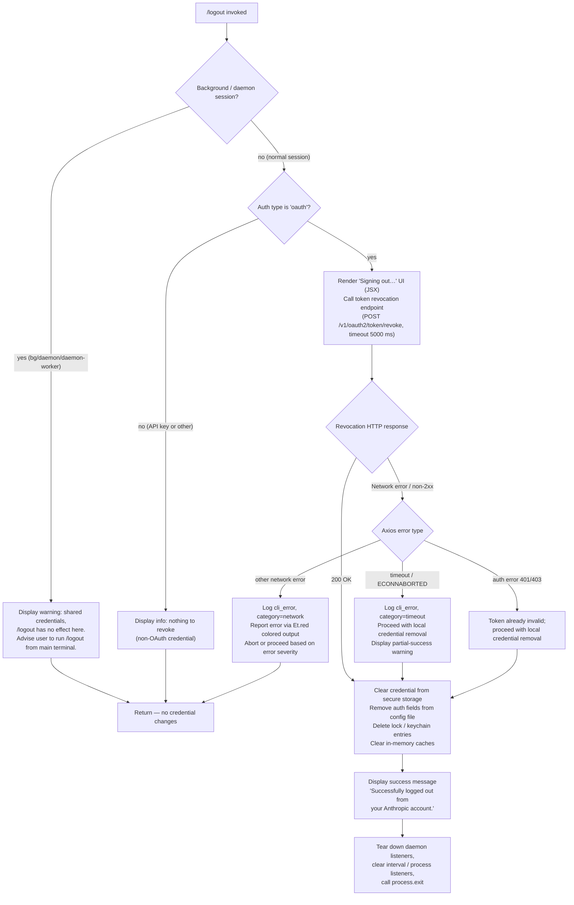

# `/logout`

> Analysis basis: CC v2.1.198 bundle.js (AST extraction + Claude interpretation)
> Minimum version: v2.1.198

---

## Overview

The `/logout` command signs the user out of their Anthropic account by revoking the active OAuth token, clearing session credentials from secure storage and config, and then tearing down all in-process daemon and listener state before exiting. It is a `local-jsx` command whose handler renders a JSX confirmation UI, performs the network revocation call, persists the credential removal to disk, and finally calls `process.exit`.

---

## Registration

| Field | Value |
|---|---|
| type | `local-jsx` |
| name | `logout` |
| description | Sign out from your Anthropic account |
| loc_byte | `12172699` |
| loc_byte_end | `12172983` |
| loc_line | `8184` |
| module_id | `Lxo` |
| load_inline | `true` |
| arbor_handler.name | `Wdf` |
| arbor_handler.fqn | `claude-2.1.198::Wdf` |
| arbor_handler.kind | `AsyncFunction` |
| arbor_handler.resolution_path | `module_id` |
| arbor_handler.n_hits | `0` |

Analysis basis: CC v2.1.198 bundle.js:+12172699

---

## Input Branching

Four distinct branches exist based on session context, authentication type, and network outcome — a Mermaid flowchart is used.



Analysis basis: CC v2.1.198 bundle.js:+8989703 (handler entry `Wdf`), +8989813 (background-session literal), +8989965 (system role literal), +8990007 (success message literal), +2184195 (token-revocation telemetry), +2184185 (5000 ms timeout), +8988079 (Promise.resolve entry), +8988166 (`mr` auth-type check)

---

## Behavioral Spec

### 1. Session-context guard

```
async function logoutHandler(context):
    sessionKind = getSessionKind()   // "bg" | "daemon" | "daemon-worker" | foreground
    if sessionKind in ["bg", "daemon", "daemon-worker"]:
        displayWarning(
            "This background session shares credentials with other sessions; "
            "/logout here has no effect. Run /logout from your main terminal to sign out."
        )
        return   // early exit, no credential changes
```

Analysis basis: CC v2.1.198 bundle.js:+2362190 (literal `"bg"`), +2362200 (`"daemon"`), +2362214 (`"daemon-worker"`), +8989813 (warning string literal)

---

### 2. Auth-type check

```
    authProvider = readCurrentAuthProvider()
    // known providers: gateway, bedrock, foundry, anthropicAws, mantle, vertex, firstParty
    if authProvider is not "oauth":
        displayInfo("No OAuth session active; nothing to revoke.")
        return
```

Analysis basis: CC v2.1.198 bundle.js:+2171424 (`mr` / auth-type resolver), +2171435 (`"gateway"`), +2171492 (`"bedrock"`), +2171709 (`"firstParty"`)

---

### 3. UI render + token revocation

```
    renderJSX(<SigningOutSpinner label="Signing out…" />)   // loc +8990162

    try:
        response = await httpPost(
            url   = buildOAuthRevokeURL(),      // uses Gs / URL-builder
            body  = { token: currentRefreshToken },
            headers = { "Content-Type": "application/json" },
            timeout = 5000                      // ms, loc +2184185
        )
        telemetry.emit("oauth_token_revoke")    // loc +2184195
    catch error:
        errorCategory = classifyAxiosError(error)
        // categories: "timeout", "auth", "network", "http", "other"
        if errorCategory == "auth":
            pass   // token already invalid; continue with local cleanup
        elif errorCategory == "timeout":
            logCliError("cli_error", category="timeout")
            // continue with local cleanup
        else:
            logCliError("cli_error", category=errorCategory)
            displayRed(error.message)
            if isFatal(errorCategory):
                return
```

Analysis basis: CC v2.1.198 bundle.js:+2184027 (`vN` / token-revoke caller, `po.post`), +2184087 (literal `"refresh_token"`), +2184142 (`"Content-Type"`), +2184157 (`"application/json"`), +2184232 (`po.isAxiosError`), +2184195 (`"oauth_token_revoke"`), +13219793 (`uXe` / error display with `Et.red`), +13219803 (literal `"cli_error"`)

---

### 4. Local credential removal

```
    // 4a. Remove credential from secure storage / keychain
    deleteKeychainEntry(service="claude-code-user")   // loc +2197833
    // 4b. Remove auth fields from the global config (~/.claude.json)
    updateGlobalConfig(patch={ oauthToken: null, refreshToken: null })
    writeConfigWithLock()                 // safe atomic write, loc +14255163
    // 4c. Clear in-memory credential caches
    clearSecureStorageCache()             // loc +2390523 (event "secure_storage_credentials_write")
    // 4d. Emit oauth_logout telemetry marker
    xe("oauth_logout")                    // loc +8989484
```

Analysis basis: CC v2.1.198 bundle.js:+2197833 (`"claude-code-user"`), +2198592 (`"Failed to delete keychain entry"` — error branch), +8086227 (`NKa` / keychain delete), +8086291 (`$gt.unlink`), +14255163 (`s.mkdirSync` in lock-guarded config write), +2390523 (`"secure_storage_credentials_write"`)

---

### 5. Daemon / listener teardown

```
    stopAllTimers()        // clearInterval on registered intervals (loc +3404902)
    removeProcessListeners()  // process.removeListener / process.off (loc +3404937, +3404158)
    clearEventMaps([k0e, iMn, e2t, BJr, BV])   // loc +3404284–3404332
    emitShutdownEvent()    // $at.emit (loc +3404037)
    unlinkPidFile()        // xxo / l7o (loc +14235591)
    flushOutputBuffer()    // nAe.writeSync (loc +6896336)
    process.exit(0)        // loc +13219816
```

Analysis basis: CC v2.1.198 bundle.js:+8988146 (`HKt` teardown orchestrator), +3404902 (`clearInterval`), +3404937 (`process.removeListener`), +3404158 (`process.off`), +3404037 (`$at.emit`), +14235607 (`UXe.unlink`), +13219816 (`process.exit`)

---

### 6. Success confirmation

```
    displayMessage(
        role    = "system",
        content = "Successfully logged out from your Anthropic account."
    )
    // message role literal "system" at loc +8989965
    // message text literal at loc +8990007
```

Analysis basis: CC v2.1.198 bundle.js:+8989965, +8990007

---

## State & Side Effects

| Item | Detail |
|---|---|
| Telemetry — `oauth_token_revoke` | Emitted after a successful or attempted OAuth revocation HTTP call (bundle.js:+2184195) |
| Telemetry — `oauth_logout` | Emitted after local credential removal (bundle.js:+8989484) |
| Telemetry — `tengu_feature_ok` | Emitted on clean credential-write completion (bundle.js:+1039573) |
| Telemetry — `tengu_feature_sad` | Emitted on transient write failure (bundle.js:+1039721) |
| Telemetry — `tengu_feature_bad` | Emitted on hard write failure (bundle.js:+1039640) |
| Telemetry — `tengu_config_lock_contention` | Emitted if the config lock is slow to acquire (bundle.js:+14255436) |
| Telemetry — `tengu_config_stale_write` | Emitted if a stale config write is detected (bundle.js:+14255572) |
| Telemetry — `tengu_config_auto_repaired` | Emitted if a config parse error is auto-repaired under lock (bundle.js:+14255949) |
| Telemetry — `tengu_config_auth_loss_prevented` | Emitted when a write that would erase auth is aborted (bundle.js:+14256279) |
| Telemetry — `tengu_config_parse_error` | Emitted on config JSON parse failure (bundle.js:+14259169) |
| Telemetry — `tengu_config_fallback_write` | Emitted when the config fallback-write path is used (bundle.js:+14255052) |
| Secure storage | Keychain entry for service `"claude-code-user"` is deleted (bundle.js:+2197833) |
| Config file (`~/.claude.json`) | OAuth/refresh token fields nulled and re-written atomically under file lock |
| In-memory caches | Multiple Set/Map caches (`k0e`, `iMn`, `e2t`, `BJr`, `BV`, `hRi`) are cleared (bundle.js:+3404284–+3404332, +3106763) |
| Process listeners | All registered `process.on` / `process.off` listeners removed (bundle.js:+3404937, +3404158) |
| PID / socket file | Lock file or pid file unlinked via `UXe.unlink` (bundle.js:+14235607) |
| Output buffer | Terminal output flushed with `nAe.writeSync` before exit (bundle.js:+6896336) |
| Process exit | `process.exit(0)` called unconditionally after cleanup (bundle.js:+13219816) |
| Sound | None detected in traversal |

---

## Version History

| Version | Change |
|---|---|
| v2.1.198 | Initial analysis |

---

## Common Mistakes

1. **Running `/logout` inside a background (`bg`), `daemon`, or `daemon-worker` session** — The command displays a warning and returns immediately without revoking any token or clearing credentials. Always run `/logout` from the primary interactive terminal.
2. **Expecting the session to remain open after logout** — The handler calls `process.exit(0)` as part of the teardown sequence; the CLI process terminates unconditionally.
3. **Assuming network failure prevents credential removal** — For `auth` (401/403) and `timeout` error categories, local credential removal still proceeds even when the revocation HTTP call fails. The keychain entry and config file are cleared regardless.
4. **Relying on `/logout` to clear API-key based auth** — The command only revokes OAuth sessions. Non-OAuth auth providers are detected early and the command returns without any credential changes.
5. **Concurrent Claude Code instances during logout** — The config write is lock-guarded (file lock, 60 000 ms maximum wait at bundle.js:+14256485). A second instance holding the lock will trigger `tengu_config_lock_contention` telemetry and may cause the logout to observe a stale config.

---

## Appendix — Identifier Mapping

> For bundle debugging only. Identifiers change across versions.

| Identifier | Role |
|---|---|
| `Wdf` | Top-level logout async handler (arbor_handler; entry point resolved via module_id `Lxo`) |
| `T_t` | Logout implementation core — orchestrates UI, revocation, cleanup, and exit |
| `jdf` | Logout render helper — builds JSX confirmation/status display |
| `r` | Data-read helper called from `T_t` (reads session/config data) |
| `As` | Error-display-and-exit utility (logs `cli_error`, calls `process.exit`) |
| `uXe` | Colored error printer (`Et.red` + `console.error`) |
| `fI` | Config file writer (`Bae.writeFileSync` + `kCr.join`) |
| `li` | Session-kind classifier (distinguishes `bg` / `daemon` / `daemon-worker`) |
| `gxe` | Session-kind lookup implementation |
| `HKt` | Daemon/listener teardown orchestrator |
| `Mjn` | Sub-teardown step A |
| `DV` | Sub-teardown step B |
| `Gne` | Cache clear helper (`hRi.clear`) |
| `y0e` | Sub-teardown step D |
| `qce` | Full shutdown sequence coordinator (timers, listeners, event maps, log flush) |
| `tG` | Timer/queue cleanup coordinator |
| `eG` | Inner timer stop helper |
| `Bat` | Comprehensive process-listener and set-clear helper |
| `zJr` | Interval clearer (`clearInterval` + `process.removeListener`) |
| `Re` | Log-flush / output serializer |
| `sr` | Error-string builder |
| `st` | String coercion utility |
| `qi` | Essential-traffic queue helper |
| `jvu` | Ring-buffer shift/push helper (`Bmn`) |
| `NKa` | Keychain / credential delete orchestrator |
| `$Ka` | Sub-step of keychain deletion |
| `BVe` | Credential presence checker (`Dks`) |
| `Tle` | Path builder for credential storage |
| `rHn` | Credential file path joiner (`Rks.join`) |
| `xxo` | PID/lock-file removal orchestrator |
| `l7o` | Lock-file unlink helper (with timeout clear) |
| `u7o` | Lock-file inner helper |
| `Nye` | Lock-file watcher / filter (checks `n.some`, `t.includes`) |
| `N0e` | Socket/pipe path builder (`V9i.join`) |
| `mr` | Auth-provider type resolver (gateway / bedrock / foundry / oauth etc.) |
| `Fm` | Auth-provider enum mapper |
| `Hl` | Storage read orchestrator |
| `dfi` | Dual-store read/write dispatcher (primary + fallback) |
| `O9e` | Async storage read helper |
| `KTd` | Async storage read with AsyncLocalStorage context |
| `xe` | Telemetry emitter (emits `oauth_logout` and others) |
| `V` | Telemetry event value builder |
| `Pe` | Telemetry event publisher |
| `St` | Secondary telemetry emitter path |
| `Le` | Tertiary telemetry emitter path |
| `vN` | OAuth token revocation HTTP caller |
| `Gs` | OAuth URL / endpoint resolver |
| `HSs` | Base OAuth URL constant holder |
| `Uvu` | Environment-to-URL mapper |
| `T` | HTTP request executor and response handler |
| `Hiu` | HTTP-level transport wrapper |
| `cus` | HTTP client init (`bru` / `Tru`) |
| `Me` | JSON body serializer (`JSON.stringify`) |
| `Oc` | Authorization header builder (redacts token in logs) |
| `Kps` | Header-map builder (`miu.map`) |
| `YZe` | Output write helper (`Ops` / `e.write`) |
| `biu` | Logging infrastructure initializer (file appender, process hooks) |
| `AZe` | Batched log-line writer (setTimeout / setImmediate drain) |
| `jae` | Log-file path resolver (`Wae.join`) |
| `Siu` | Log-file appender (`OF.mkdir` + `OF.appendFile`) |
| `Si` | Signal handler registrar (`sus.register`) |
| `Uae` | Log error-code classifier (`en`) |
| `Jps` | Log file path joiner (`Wae.join` + `kt`) |
| `ate` | Post-logout state update helper |
| `Z7r` | Config file access orchestrator |
| `wRi` | Config read/write core |
| `cri` | Config path resolver |
| `wN` | Config file path normalizer + hasher |
| `hw` | Config schema validator (`Iwe`) |
| `YP` | OS user-info reader (`ATn.userInfo`) |
| `he` | String coercion helper |
| `_n` | Global config save-with-fallback orchestrator |
| `Onn` | Locked config writer (creates dir, acquires lock, rotates backups) |
| `sfi` | Config object initializer (`uGr` + `Object.assign`) |
| `en` | Error code extractor |
| `SCt` | Config file reader with backup rotation |
| `ACt` | Config validation helper |
| `v7o` | Config backup path builder (`sy.join`) |
| `BMt` | Atomic file write helper (temp-file + rename + fsync) |
| `TFe` | Config type validator |
| `b7o` | Config object entry iterator (`Object.entries`) |
| `Dnn` | Config timestamp helper (`Date.now`) |
| `Mnn` | Config merge helper (calls `SCt` + `H0`) |
| `Kfr` | Config write-with-backup helper |
| `xCn` | Config change notifier |
| `Lge` | Post-mutation side-effect trigger |
| `l2e` | Cleanup finalizer helper |
| `jdf` | Logout JSX render function (wraps `CGe` + `T_t`) |
| `CGe` | JSX component builder for logout status display |
| `YE` | JSX element factory helper |
| `su` | OTEL metrics emitter |
| `IGe` | OTEL metrics span/attribute builder |
| `z6` | Session-ID generator (`C7o.randomBytes`) |
| `kt` | Config-path resolver (calls `sw`) |
| `RNn` | Resource-attribute builder (`Object.freeze`) |
| `Z3t` | String coercion for attribute values |
| `NP` | Metric filter (`u2u.has`) |
| `Fc` | Metric counter helper (`cE` + `Dt`) |
| `Fsp` | JWT / token decoder (`JSON.parse` + `Buffer.from` + `base64url`) |
| `Hta` | Metric histogram helpers (`Osp` + `Psp`) |
| `E2e` | OTEL event-name attribute setter |
| `Dbr` | OTEL event emitter helper |
| `a` | Spend / billing event emitter (`tge` + `Response.json`) |
| `tge` | Spend-event serializer (`JSON.stringify`) |
| `Pbr` | Post-event cleanup helper |
| `jc` | Process-exit coordinator (wraps `Ti`) |
| `Ti` | Full process shutdown sequencer (unmount, drain, race-timeout, kill) |
| `Fje` | Terminal unmount helper (`nAe.writeSync` + `e.unmount`) |
| `YN` | Post-unmount output restore helper |
| `cOn` | ANSI cursor-restore writer (`vre.writeSync`, ESC-7 / ESC-8 sequences) |
| `Ego` | Exit-banner printer (`nAe.writeSync` + `Et.dim`) |
| `OL` | Output stream reference |
| `N5` | TTY size helper |
| `PGt` | Stat-based file presence check (`r.statSync`) |
| `Zm` | Exit-code resolver (`kt` + `eu`) |
| `Cpi` | Path escape helper (backslash / quote replacement) |
| `Sgo` | Forced-kill scheduler (`process.exit` / `process.kill` with SIGKILL) |
| `TZe` | Output drain helper (`sus.drain`) |
| `d` | MCP / supervisor session stop+restart helper |
| `SXe` | File-stat async helper (`ndc.stat`) |
| `rdc` | MCP response size calculator (`Math.max`) |
| `E` | SDK session stop orchestrator (`Promise.all`) |
| `A` | Supervisor session stop orchestrator (`H.userinfo`) |
| `lQc` | Supervisor config update helper (`zce`) |
| `eRa` | Parallel session settle helper (`Promise.allSettled`) |
| `LRa` | MCP-layer parallel settle helper |
| `k0t` | Startup-profile writer (`rvr` + `hfs`) |
| `rvr` | Profile-entry serializer |
| `hfs` | Profile-file writer (`JSON.stringify` + `Efs`) |
| `t4n` | Scroll-summary telemetry emitter (`tengu_scroll_summary`) |
| `HRa` | Scroll-summary data collector |
| `gRa` | Scroll-timing calculator (`Date.now` + `Math.max` + `Math.round`) |
| `Ws` | Display-mode / fullscreen-mode resolver |
| `BLt` | Cache-eviction-hint handler |
| `Ke` | React context accessor (`OQe`) |
| `yr` | Nonconforming-terminal fallback handler |
| `Um` | React context accessor (alternate path, `OQe`) |
| `Bje` | Session-end promise resolver (`J9n`) |
| `J9n` | Session-end resolve callback holder |
| `XMt` | Exit finalizer step A |
| `Xge` | Exit finalizer step B |
| `Xln` | Output drain finisher (`ius.drain`) |
| `zt` | Path utility (used extensively in config and file helpers) |
| `en` | Error code / property extractor |
| `v` | String prefix tester (`v.startsWith`) |
| `_` | Backup-list sorter / file-list helper |
| `I` | Scroll-position / viewport calculator (`Math.max` + `Math.floor`) |