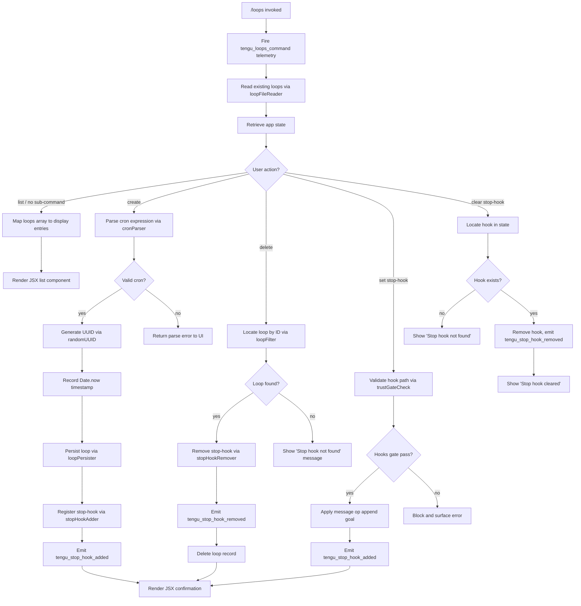

# `/loops`

> Analysis basis: CC v2.1.198 bundle.js (AST extraction + Claude interpretation)
> Minimum version: v2.1.198

---

## Overview

The `/loops` command provides a management interface for Claude Code's "loops" — persistent scheduled or recurring task configurations. It supports listing all active loops, creating new ones (with cron-style scheduling), and deleting existing ones. The command renders a JSX-based UI component and coordinates with the daemon scheduler, app state, and filesystem storage.

---

## Registration

| Field | Value |
|---|---|
| type | `local-jsx` |
| name | `loops` |
| description | `List, create, and delete loops` |
| loc_byte | `13082522` |
| loc_byte_end | `13082679` |
| loc_line | `8965` |
| immediate | `true` |
| module_id | `Erc` |
| load_inline | `true` |
| arbor_handler.name | `ktm` |
| arbor_handler.fqn | `claude-2.1.198::ktm` |
| arbor_handler.kind | `AsyncFunction` |
| arbor_handler.resolution_path | `module_id` |
| arbor_handler.n_hits | `0` |

Analysis basis: CC v2.1.198 bundle.js:+13082522

---

## Input Branching

The command has multiple distinct branches depending on user sub-action (list, create, delete, set stop-hook, clear stop-hook) as well as scheduling path decisions. A Mermaid flowchart is used.



Analysis basis: CC v2.1.198 bundle.js:+13081487–+13082679

---

## Behavioral Spec

### 1. Handler Entry (`loopsCommandHandler`)

The main handler `ktm` is an `AsyncFunction` resolved via module `Erc`.

```
async function loopsCommandHandler(context):
    emit telemetry("tengu_loops_command")          // bundle.js:+13081489
    existingLoops = await loopFileReader(context)  // calls yde → Mdt
    appState     = context.getAppState()           // bundle.js:+13081539
    loopType     = "cron"                          // bundle.js:+13081585

    displayList  = existingLoops.map(loopDisplayMapper)  // bundle.js:+13081567
    stophookList = existingLoops.filter(stophookFilter)  // bundle.js:+13081671

    subAction = determineSubAction(context.args)

    switch subAction:
        case LIST:   return renderLoopList(displayList)
        case CREATE: return createLoop(context, appState, existingLoops)
        case DELETE: return deleteLoop(context, appState, stophookList)
        case SET_STOP_HOOK:   return setStopHook(context, appState)
        case CLEAR_STOP_HOOK: return clearStopHook(context, appState)

    return renderJSX(Src.jsx, displayList)   // bundle.js:+13082292
```

Analysis basis: CC v2.1.198 bundle.js:+13081487

---

### 2. Loop File Reader (`loopFileReader` / `yde` → `loopDataLoader` / `Mdt`)

Reads the persisted loops from disk.

```
async function loopFileReader(context):
    filePath = pathJoin(claudeDir, loopFileName)  // uses M$n.join
    raw      = await fs.readFile(filePath, "utf-8")  // bundle.js:+5125132, encoding "utf-8" at +5125160
    if error.code in ["ENOENT","EACCES","EPERM","ENOTDIR","ELOOP","ENAMETOOLONG","EROFS"]:
        return []       // graceful empty fallback
    parsed = JSON.parse(raw)
    if not Array.isArray(parsed):
        return []
    return parsed
```

Analysis basis: CC v2.1.198 bundle.js:+5125113, +5125132, +5125143

---

### 3. Cron Expression Parser (`cronParser` / `xtm`)

Parses a human-readable or standard cron string into a structured schedule object.

```
function cronParser(input):
    trimmed = input.match(cronPattern)       // bundle.js:+13081075
    if not match: return error

    minute = parseInt(parts[0])              // bundle.js:+13081112
    minute = Math.max(0, minute)             // bundle.js:+13081197
    minute = Math.ceil(minute)               // bundle.js:+13081208

    // Boundary constants:
    //   max minute:  59    (bundle.js:+13081254)
    //   max hour:    23    (bundle.js:+13081325)
    //   max day:     31    (bundle.js:+13081378)
    //   minute span: 60    (bundle.js:+13081220)

    hour   = Math.round(parts[1])            // bundle.js:+13081281
    result = scheduledTaskParser(trimmed)    // calls pU → cgp

    // Human labels found in literals:
    //   "Every minute"  (bundle.js:+5123024)
    //   "Every hour"    (bundle.js:+5123241)
    //   Range format:   "1-5" (bundle.js:+5123948)

    return { minute, hour, label, raw: input }
```

Analysis basis: CC v2.1.198 bundle.js:+13081075, +13081197, +13081208

---

### 4. Schedule Task Internal Parser (`scheduledTaskParser` / `pU` → `cgp`)

Lower-level cron field parser used by `cronParser`.

```
function scheduledTaskParser(expression):
    trimmed = expression.trim()                // bundle.js:+5121733
    parts   = trimmed.split(separator)         // cgp: bundle.js:+5121153
    result  = new Set()

    for each part in parts:
        match = part.match(rangeOrStepPattern) // bundle.js:+5121173
        if match:
            base  = parseInt(match.group)      // bundle.js:+5121218
            // step values observed: 3, 6, 7, 10  (bundle.js:+5121394,+5121430,+5121436,+5121232)
            result.add(computed)               // bundle.js:+5121279

    return Array.from(result)                  // bundle.js:+5121681
```

Analysis basis: CC v2.1.198 bundle.js:+5121153, +5121218

---

### 5. Loop Creator (`createLoop` / `Ddt`)

```
async function createLoop(context, appState, existingLoops):
    id        = crypto.randomUUID()          // Mda.randomUUID, bundle.js:+5126460
    createdAt = Date.now()                   // bundle.js:+5126522
    schedule  = cronParser(context.args)
    record    = buildLoopRecord(id, createdAt, schedule)  // kge call at +5126568

    await loopPersister(existingLoops, record)   // Mdt call at +5126612
    existingLoops.push(record)                   // bundle.js:+5126625

    await stopHookAdder(context, appState, record)  // P4t at +5126720
    emit kt()                                        // bundle.js:+5126657

    return render("Stop hook set")               // literal at +13082249
```

Analysis basis: CC v2.1.198 bundle.js:+5126460, +5126522

---

### 6. Loop Persister (`loopPersister` / `P4t`)

Writes loop configuration files to the `.claude` directory.

```
async function loopPersister(loopList, newRecord):
    dir  = pathJoin(claudeDir, ".claude")     // literal ".claude" at +5126301, M$n.join at +5126290
    await fs.mkdir(dir, { recursive: true })  // R$n.mkdir at +5126280
    data = loopList.map(serializeEntry)       // bundle.js:+5126341
    await fs.writeFile(targetPath, data)      // R$n.writeFile at +5126377
    // Also updates hook data via hSe and Me
```

Analysis basis: CC v2.1.198 bundle.js:+5126269, +5126290, +5126301

---

### 7. Stop Hook Adder (`stopHookAdder` / `LAt`)

Adds a stop-hook tied to a loop into the conversation/app state.

```
async function stopHookAdder(context, appState, loopRecord):
    // Gate checks
    policySettings = fetchPolicySettings(context)  // i9 → Hn, literal "policySettings" at +3481041
    hooksGatePass  = checkHooksGate(context)       // literal "hooks_gate" at +11171403
    trustGatePass  = checkTrustGate(context)       // literal "trust_gate" at +11171457

    if not hooksGatePass or not trustGatePass:
        return error

    previousState = context.getAppState()          // bundle.js:+11171592
    timestamp     = Date.now()                     // bundle.js:+11171756
    tokenCount    = computeOutputTokens()          // Qy, literal "outputTokens" at +49159

    newState = buildUpdatedState(previousState, loopRecord, "goal_set")
               // literal "goal_set" at +11171535
    context.setAppState(newState)                  // bundle.js:+11171794

    // Append goal message
    context.applyMessageOp({
        op:      "append",          // literal at +11172231
        role:    "system",          // literal at +13081820
        content: loopRecord.goal,   // literal "goal" at +11172299
    })                              // bundle.js:+11171836

    uuid = randomUUID()             // qOl → WOl.randomUUID, bundle.js:+11171878
    emit telemetry("tengu_stop_hook_added")  // bundle.js:+11171893

    render confirmationMessage("Stop hook set")  // literal at +13082249
```

Analysis basis: CC v2.1.198 bundle.js:+11171507, +11171570, +11171592

---

### 8. Stop Hook Remover (`stopHookRemover` / `xAt`)

```
async function stopHookRemover(context, appState, loopRecord):
    currentState = context.getAppState()      // bundle.js:+11172010

    filtered = currentState.stophooks.filter(
        hook => hook.id !== loopRecord.id
    )

    if filtered.length === currentState.stophooks.length:
        return displayMessage("Stop hook not found")  // literal at +13081931

    newState = { ...currentState, stophooks: filtered }
    context.setAppState(newState)               // bundle.js:+11172139

    context.applyMessageOp({
        op:   "append",                         // literal at +11172231
        type: "attachment",                     // literal at +11172341
        goal_status: "cleared",                 // literal "goal_status" at +11172428
    })                                          // bundle.js:+11172208

    uuid = randomUUID()                         // qOl, bundle.js:+11172250
    emit telemetry("tengu_stop_hook_removed")   // bundle.js:+11172265

    displayMessage("Stop hook cleared")         // literal at +13081953
```

Analysis basis: CC v2.1.198 bundle.js:+11172006, +11172010, +11172139

---

### 9. Loop Deleter (`loopDeleter` / `_de`)

```
async function loopDeleter(context, appState, loopId):
    existing  = await loopFileReader(context)   // Mdt call at +5126840
    remaining = existing.filter(l => l.id !== loopId)  // bundle.js:+5126849
    hookSet   = remaining.filter(hasHook)       // n.has at +5126864

    if remaining.length === existing.length:
        displayMessage("Stop hook not found")   // literal at +13081931
        return

    await loopPersister(remaining, null)        // P4t at +5126913

    // Also clears C7 membership check: bundle.js:+5126791
    await stopHookRemover(context, appState, { id: loopId })
```

Analysis basis: CC v2.1.198 bundle.js:+5126791, +5126840, +5126849

---

### 10. Loop Display Mapper / Schedule Humanizer (`scheduleHumanizer` / `RO`)

Converts stored loop records into displayable format with human-readable schedule labels.

```
function scheduleHumanizer(loopRecord):
    trimmed = loopRecord.cron.trim()             // bundle.js:+5122904
    match   = trimmed.match(cronPattern)         // bundle.js:+5123045
    value   = parseInt(match.groups.value)       // bundle.js:+5123080

    label = switch(value):
        case 0:   "Every minute"                 // literal at +5123024
        default:  "Every hour"                   // literal at +5123241

    // Path normalization for Windows:
    normalized = pathNormalizer(loopRecord.path) // j8, literal "windows" at +1105677
    // Uses iN.normalize, jt, t.replaceAll       // bundle.js:+1105651

    dayName = getDayName(loopRecord.dayOfWeek)   // h.getUTCDay at +5123781
    //   h.setUTCDate  bundle.js:+5123800
    //   h.getUTCDate  bundle.js:+5123813
    //   h.setUTCHours bundle.js:+5123831
    //   h.getDay      bundle.js:+5123860

    return { label, normalized, dayName, raw: loopRecord }
```

Analysis basis: CC v2.1.198 bundle.js:+5122904, +5123024, +5123241

---

### 11. Daemon Status Helper (`daemonStatusReader` / `Flc`)

Used when rendering loop list to show daemon health.

```
async function daemonStatusReader():
    now        = Date.now()                  // bundle.js:+13346485
    sessionId  = storeContext.getStore()     // Ys, bundle.js:+13346517
    statusPath = pathJoin(ulcDir, "daemon.status.json")
                 // literal at +13346372, ftn call at +13346534
    data       = await readStatusFile(statusPath)   // er at +13346367
    encoded    = JSON.stringify(data)               // Me at +13346540
    return encoded
```

Analysis basis: CC v2.1.198 bundle.js:+13346469, +13346485

---

## State & Side Effects

| Item | Detail |
|---|---|
| Telemetry: `tengu_loops_command` | Fired immediately on handler entry (bundle.js:+13081489) |
| Telemetry: `tengu_stop_hook_added` | Fired when a stop-hook is successfully registered (bundle.js:+11171893) |
| Telemetry: `tengu_stop_hook_removed` | Fired when a stop-hook is successfully removed (bundle.js:+11172265) |
| Telemetry: `tengu_daemon_yield` | Fired by background daemon worker yielding (bundle.js:+18397025) — reached via callGraph depth 2 |
| Telemetry: `tengu_bg_*` (6 events) | Background worker lifecycle events reached via depth-2 call edges (bundle.js:+18374571–+18376546) |
| Telemetry: `tengu_feature_ok/bad/sad` | Feature gate outcomes (bundle.js:+1039573, +1039640, +1039721) |
| Telemetry: `tengu_daemon_control` | Daemon control actions (bundle.js:+18414881) |
| appState changes | `setAppState` called on loop create/delete; `applyMessageOp` with `"append"` op used to attach goal/goal_status content |
| Filesystem writes | Loop records written to `.claude/` directory (bundle.js:+5126280, +5126377) |
| Filesystem reads | Loop data read as UTF-8 file (bundle.js:+5125132) |
| Filesystem deletes | `fs.unlink` reached in scheduler cleanup paths (bundle.js:+17351838, +17352067) |
| Hook registration | Stop-hooks stored in app state and persisted; trust gate and hooks gate evaluated before registration |
| Scheduled task intervals | `setInterval` / `clearInterval` used in background scheduler (bundle.js:+17355815, +17355649) |
| File watching | `N.watch` used to observe loop-related file changes (bundle.js:+17356006) |
| Sound | <!-- TODO: not found in depth-2 traversal; needs --depth 4 --> |

---

## Version History

| Version | Change |
|---|---|
| v2.1.198 | Initial analysis |

---

## Common Mistakes

1. **Providing an invalid cron expression**: The cron parser (`xtm` / `cronParser`) enforces bounds of 0–59 for minutes, 0–23 for hours, and 1–31 for days (bundle.js:+13081220, +13081254, +13081325, +13081378). Expressions outside these ranges are rejected.
2. **Deleting a loop that does not exist**: The delete path checks membership before removal and surfaces `"Stop hook not found"` (bundle.js:+13081931) rather than silently succeeding.
3. **Insufficient trust / hooks gate permissions**: Creating or modifying stop-hooks requires passing both the `hooks_gate` and `trust_gate` policy checks (bundle.js:+11171403, +11171457). Running in a restricted policy context will silently block hook registration.
4. **Expecting immediate scheduler activation**: The daemon scheduler runs on a `setInterval` sweep (bundle.js:+17355815); a newly created loop will not execute until the next sweep cycle.
5. **Assuming cross-platform paths are identical**: The schedule humanizer normalizes paths for Windows using `replaceAll` (bundle.js:+1105694). Hardcoded backslash paths in loop definitions may not behave as expected on Unix.

---

## Appendix — Identifier Mapping

> For bundle debugging only. Identifiers change across versions.

| Identifier | Role |
|---|---|
| `ktm` | Main async handler for `/loops` command (`loopsCommandHandler`) |
| `yde` | Wrapper calling loop file loader (`loopFileReaderWrapper`) |
| `Mdt` | Core loop data loader / file reader (`loopDataLoader`) |
| `zt` | Utility used in file read path (likely path resolver) |
| `hSe` | Hook/path helper used in file and persist paths |
| `tl` | Low-level utility (calls `sw`) |
| `xo` | Error code classifier (checks ENOENT, EACCES, etc.) |
| `en` | Error code lookup helper |
| `Re` | File read result processor |
| `sr` | Error string builder |
| `st` | String coercion utility |
| `qi` | Network queue accessor (`essential-traffic` label) |
| `jvu` | Queue shift/push manager |
| `T` | CLI output writer / table formatter |
| `Hiu` | Debug/redaction handler |
| `Me` | JSON serializer wrapper |
| `Oc` | String redaction / path trimmer (`[REDACTED]` literal) |
| `YZe` | Output ops helper |
| `biu` | CLI subprocess runner (sets up process, intervals, exit handler) |
| `pU` | Cron expression pre-processor / trimmer |
| `cgp` | Cron field tokenizer (split + match + parseInt) |
| `UC` | Secondary utility called from loop file reader wrapper |
| `sw` | Low-level synchronous utility |
| `wAt` | App state map builder |
| `x1e` | State map setter |
| `ZAl` | Map entry array mapper |
| `kt` | Low-level emit/notify utility (calls `sw`) |
| `RO` | Schedule humanizer / loop display mapper |
| `j8` | Cross-platform path normalizer |
| `UEr` | Path prefix stripper (startsWith / slice / replace) |
| `k` | Background scheduler runner (setInterval, watch, workers) |
| `tts` | Scheduled task saver (writeFile + unlink) |
| `tsn` | Scheduled task cleaner (unlink) |
| `D` | Daemon transient/supervisor writer |
| `N` | Background worker sweep watcher |
| `I` | Keyboard/input event handler |
| `g` | Background session dispatcher (spawn, kill, mkdir, writeFile) |
| `p` | Forced shutdown handler (process.exit, abort) |
| `aI` | Shutdown initiator |
| `u` | Daemon stop coordinator |
| `xe` | Feature gate: ok path (emits `tengu_feature_ok`) |
| `Le` | Feature gate: bad path (emits `tengu_feature_bad`) |
| `M$` | First-party billing/session pusher |
| `l8` | Daemon stop race/all Promise coordinator |
| `l` | Daemon status reader (calls `Flc`) |
| `Flc` | Daemon status file reader / encoder |
| `Ene` | Timestamp / event helper |
| `Ys` | Async store context getter |
| `ftn` | Status file path builder |
| `h` | Date/day-of-week helper (UTC date arithmetic) |
| `_de` | Loop deleter orchestrator |
| `C7` | Set membership checker (for hook deduplication) |
| `P4t` | Loop file persister (mkdir + writeFile) |
| `xAt` | Stop-hook remover / clearer |
| `qOl` | UUID generator wrapper (`WOl.randomUUID`) |
| `Ke` | OQe-based confirmation renderer |
| `OQe` | Base confirmation/render primitive |
| `xtm` | Cron expression parser (regex + Math bounds) |
| `Ddt` | Loop creator (UUID + Date.now + persist + hook) |
| `kge` | Loop record builder |
| `tge` | JSON body serializer (for spend/response path) |
| `LAt` | Stop-hook adder orchestrator |
| `LFo` | Hook adder inner flow controller |
| `i9` | Policy settings fetcher |
| `Hn` | Policy host resolver |
| `tue` | Trust policy resolver |
| `hr` | Hook registration sub-step |
| `_d` | Path/hook validation layer (calls `BHm`) |
| `BHm` | Hook path canonicalizer (resolve, `..'` check) |
| `St` | Feature gate: sad/ok path (emits `tengu_feature_sad`) |
| `Pe` | Feature gate: bad path emit wrapper |
| `Qy` | Output token counter (reads `outputTokens` from state) |

---

Note: index built via Arbor fallback; some signals (telemetry, literals) may be missing — see arbor-fallback.js.