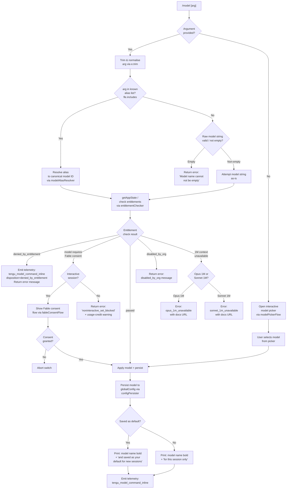

# `/model`

> Analysis basis: CC v2.1.198 bundle.js (AST extraction + Claude interpretation)
> Minimum version: v2.1.198

---

## Overview

The `/model` command lets users set or switch the AI model used by Claude Code for the current session and/or as the persistent default. When invoked with a model name argument (or alias), it validates the target model against the available model list, checks entitlement gating conditions, and—if the model requires consent (e.g., Fable 5)—either shows a consent flow interactively or blocks the switch in non-interactive mode. When invoked without an argument, it opens an interactive model-selection picker backed by the model registry.

---

## Registration

| Field | Value |
|---|---|
| type | `local` |
| name | `model` |
| description | Set the AI model for Claude Code |
| argumentHint | `<model>` |
| supportsNonInteractive | `true` |
| module_id | `sac` |
| load_inline | `true` |
| loc_byte | 13296157 |
| loc_byte_end | 13296331 |
| loc_line | 9087 |
| arbor_handler.name | `Xom` |
| arbor_handler.fqn | `claude-2.1.198::Xom` |
| arbor_handler.kind | `AsyncFunction` |
| arbor_handler.resolution_path | `module_id` |
| arbor_handler.n_hits | 0 |

Analysis basis: CC v2.1.198 bundle.js:+13296157

---

## Input Branching

The command has five or more distinct execution branches depending on whether an argument is supplied, the model alias resolves, entitlements pass, consent is required, and whether the session is interactive. A Mermaid flowchart is used.



---

## Behavioral Spec

### Handler Entry — `Xom` (main handler)

Analysis basis: CC v2.1.198 bundle.js:+13281777

```
async function modelCommandHandler(context, arg):
    rawArg = arg.trim()                         // bundle.js:+13281777

    // Inline model set path (non-empty argument)
    if rawArg is non-empty:
        emit telemetry("tengu_model_command_inline", ...)  // bundle.js:+13281927

        // Check against known alias list (fle.includes)
        if knownAliasList.includes(rawArg):      // bundle.js:+13281793
            canonicalModel = resolveAlias(rawArg)
        else:
            canonicalModel = rawArg

        appState = context.getAppState()         // bundle.js:+13281816

        // Run full model validation + entitlement check
        result = await validateAndSetModel(      // bundle.js:+13281860
                     appState, canonicalModel, context)

        // Check Fable consent gate
        if result.requiresFableConsent:          // bundle.js:+13282063
            if context.isNonInteractive:         // bundle.js:+13282107
                return error("noninteractive_set_blocked",
                    "Fable 5 uses usage credits and needs a one-time consent"
                    + " · pick Fable from /model in an interactive session to set it up")
            else:
                consentGranted = await fableConsentFlow(context)  // bundle.js:+13282085
                if not consentGranted: return

        // Check whether model has 1M context issues
        if result.t6Includes(rawArg):            // bundle.js:+13281880
            return handleExtendedContextError(result)

        // If all checks pass, apply and persist
        applyModel(appState, canonicalModel)     // bundle.js:+13281967
        persistConfig(context)                   // via configPersister (ld)

        // Display result
        printModelSetMessage(context, canonicalModel, savedAsDefault)
        return

    // No argument: open interactive picker
    else:
        await interactiveModelPicker(context)    // bundle.js:+13282307
```

---

### Model Alias Resolver — `modelAliasResolver` (`Fo`)

Analysis basis: CC v2.1.198 bundle.js:+2342743

The alias resolver normalises short names to canonical model IDs. It trims and lowercases the input, then matches against a fixed table of known short-name aliases. Known aliases extracted from literals include:

| Alias | Resolves to / Description |
|---|---|
| `sonnet` | Latest claude-sonnet variant |
| `haiku` | Latest claude-haiku variant |
| `opus` | Latest claude-opus variant |
| `best` | Best available model for the account |
| `fable` | claude-fable-5 |
| `opusplan` | Opus in plan mode, else Sonnet |
| `sonnet[1m]` | Sonnet with 1M context window |
| `sonnet-4-6[1m]` | claude-sonnet-4-6 with 1M context |
| `sonnet-5[1m]` | claude-sonnet-5 with 1M context |
| `[1m]` | 1M-context variant suffix |

Analysis basis: CC v2.1.198 bundle.js:+2342820 (alias `fable`), +2342929 (alias `sonnet`), +2342969 (alias `haiku`), +2343008 (alias `opus`), +2343046 (alias `best`), +2341705 (alias `opusplan`)

```
function resolveAlias(rawAlias):
    normalised = rawAlias.trim().toLowerCase()
    match normalised:
        case "sonnet"       => return resolveLatestSonnet()
        case "haiku"        => return resolveLatestHaiku()
        case "opus"         => return resolveLatestOpus()
        case "best"         => return resolveBestModel()
        case "fable"        => return "claude-fable-5"
        case "opusplan"     => return resolveOpusPlan()
        case "sonnet[1m]"   => return resolveLatestSonnetWith1M()
        case "sonnet-4-6[1m]" => return "claude-sonnet-4-6" + 1M flag
        case "sonnet-5[1m]" => return "claude-sonnet-5" + 1M flag
        default             => return rawAlias
```

---

### Model Catalogue — canonical IDs (`modelCatalogue`, `p_`)

Analysis basis: CC v2.1.198 bundle.js:+2339776 through +2340834

The canonical model catalogue (used for membership checks and alias resolution) contains the following IDs extracted from literals:

- `claude-fable-5` (+2339776)
- `claude-mythos-5` (+2339831)
- `claude-opus-4-8` (+2339888)
- `claude-opus-4-7` (+2339945)
- `claude-opus-4-6` (+2340002)
- `claude-opus-4-5` (+2340059)
- `claude-opus-4-1` (+2340116)
- `claude-opus-4-0` (+2340205)
- `claude-sonnet-5` (+2340237)
- `claude-sonnet-4-6` (+2340294)
- `claude-sonnet-4-5` (+2340355)
- `claude-sonnet-4-0` (+2340450)
- `claude-haiku-4-5` (+2340484)
- `claude-3-7-sonnet` (+2340543)
- `claude-3-5-sonnet` (+2340604)
- `claude-3-5-haiku` (+2340665)
- `claude-3-opus` (+2340724)
- `claude-3-sonnet` (+2340777)
- `claude-3-haiku` (+2340834)

Third-party profile type also recognised: `application-inference-profile` (+2340970)

---

### Entitlement & Availability Checker — `validateAndSetModel` (`xsr` → `QR` → `x1t`, `__e`)

Analysis basis: CC v2.1.198 bundle.js:+13281860

```
async function validateAndSetModel(appState, modelId, context):
    // Normalise model string
    modelLower = modelId.toLowerCase()

    // 1M context check for Opus
    if modelId includes "[1m]" and not account.hasOpus1M:
        return { error: "opus_1m_unavailable",
                 message: "Opus with 1M context is not available for your account. "
                          + "Learn more: https://code.claude.com/docs/en/model-config#extended-context-with-1m" }
        // bundle.js:+11758223

    // 1M context check for Sonnet
    if modelId includes sonnet[1m] variants and not account.hasSonnet1M:
        return { error: "sonnet_1m_unavailable",
                 message: "Sonnet with 1M context is not available for your account. "
                          + "Learn more: https://code.claude.com/docs/en/model-config#extended-context-with-1m" }
        // bundle.js:+11758442

    // Org-level disable check
    if orgPolicy.disables(modelId):
        return { error: "disabled_by_org" }      // bundle.js:+11758666

    // Entitlement check (denied_by_entitlement)
    if not entitlementChecker.allows(modelId, appState):
        return { error: "denied_by_entitlement" } // bundle.js:+11757857

    // Fable consent check
    if modelId is fable variant and not consent.granted:
        return { requiresFableConsent: true }

    // Fable unavailable / probe failed
    if fableProbe fails:
        return { error: "fable_unavailable" | "fable_probe_failed" }
        // bundle.js:+11758917, +11758937

    // model_switch telemetry outcome path
    emit("model_switch", { outcome: "ok", model: modelId })  // bundle.js:+11757842

    return { ok: true }
```

---

### Model Validation via API Probe — `modelValidator` (`C7t`)

Analysis basis: CC v2.1.198 bundle.js:+9770465

When the model string does not match a known alias or catalogue entry, a lightweight API validation probe is fired:

```
async function modelValidator(modelString, context):
    trimmed = modelString.trim()
    if trimmed is empty:
        return error("Model name cannot be empty")  // bundle.js:+9770502

    nameLower = trimmed.toLowerCase()

    // Check known-bad cache
    if JMoCache.has(nameLower):
        return error(cachedResult)               // bundle.js:+9770771

    // Fire side-query probe
    probeResult = await apiProbe(              // WU call: bundle.js:+9770816
        model=trimmed,
        messages=[{ role:"user", content:"Hi" }],    // bundle.js:+9770935
        system=ephemeral,                             // bundle.js:+9770960
        type="model_validation"                       // bundle.js:+9770866
    )

    if probeResult.authError:
        return error("Authentication failed. Please check your API credentials.")
        // bundle.js:+9771238

    if probeResult.networkError:
        return error("Network error. Please check your internet connection.")
        // bundle.js:+9771340

    if probeResult.errorType == "not_found_error":   // bundle.js:+9771459
        // Cache the failure
        JMoCache.set(nameLower, result)
        return error("model: " + trimmed + " not found")  // bundle.js:+9771541

    // Store into short-alias normalisation map (_Sf / ySf)
    normalisedName = normaliseModelName(trimmed)     // bundle.js:+9771075
    JMoCache.set(nameLower, { ok: true, canonical: normalisedName })
    return { ok: true, canonical: normalisedName }
```

Short-alias normalisation table used internally by `ySf`:

| Input fragment | Canonical token |
|---|---|
| `fable-5` / `fable_5` | Fable 5 canonical form |
| `opus-4-8` / `opus_4_8` | Opus 4.8 |
| `opus-4-7` / `opus_4_7` | Opus 4.7 |
| `opus-4-6` / `opus_4_6` | Opus 4.6 |
| `opus-4-5` / `opus_4_5` | Opus 4.5 |
| `sonnet-5` / `sonnet_5` | Sonnet 5 |
| `sonnet-4-6` / `sonnet_4_6` | Sonnet 4.6 |
| `sonnet-4-5` / `sonnet_4_5` | Sonnet 4.5 |

Analysis basis: CC v2.1.198 bundle.js:+9771820 through +9772368

---

### Interactive Model Picker — `interactiveModelPicker` (`Lsr` → `e3o`)

Analysis basis: CC v2.1.198 bundle.js:+13282307

```
async function interactiveModelPicker(context):
    // Build picker entries from model registry
    entries = buildPickerEntries(context)       // e3o: bundle.js:+11759859

    // Each entry shows: model name (bold) + tier badge + fast-mode indicator
    // Fast-mode entries show: " · Fast mode ON" / " · Fast mode OFF"
    // bundle.js:+11759730 / +11759827
    // Credits indicator: " · Draws from usage credits" (+11759781)

    selected = await renderPicker(entries)

    if selected is null: return   // user cancelled

    // Apply selection through same validate-and-set path
    await validateAndSetModel(context.appState, selected.modelId, context)

    // Persist and display outcome
    if selected.saveAsDefault:
        persistToGlobalConfig(selected.modelId)
        print(bold(selected.displayName)
              + " and saved as your default for new sessions")
              // bundle.js:+11759566
    else:
        print(bold(selected.displayName)
              + " for this session only")       // bundle.js:+11759612

    emit("model_set_default", { model: selected.modelId })  // bundle.js:+11759924
```

---

### Provider-Aware Model Resolution — `providerModelResolver` (`__e`)

Analysis basis: CC v2.1.198 bundle.js:+2327626

The resolver maps a canonical model ID to the provider-specific endpoint format, taking into account the active provider type:

```
function resolveForProvider(modelId, providerContext):
    provider = providerContext.provider       // gateway / bedrock / vertex / firstParty
    // bundle.js:+2171435, +2171492, +2171700, +2171709

    modelLower = modelId.toLowerCase()
    modelNorm  = normaliseModelString(modelLower)  // ca / p_ calls

    // Disabled check
    if modelStatus == "disabled":            // bundle.js:+2327901
        log warning: "That model" + [reason] // bundle.js:+2328055

    // Absent check
    if modelStatus == "absent":              // bundle.js:+2328027
        return fallback

    // 1M-context suffix injection
    if model needs 1M context:
        displaySuffix = " (1M context)"      // bundle.js:+2342418

    // Bedrock: convert claude-X to ARN format
    if provider == "bedrock":
        return bedrockArnForModel(modelId)

    // Vertex: convert to vertex endpoint string
    if provider == "vertex":
        return vertexModelPath(modelId)

    // foundry path
    if provider == "foundry":               // bundle.js:+2334324
        return foundryModelId(modelId)

    // Mantle path
    if model includes "mantle":             // bundle.js:+2331723
        return mantleModelId(modelId)

    return modelId   // pass through for firstParty
```

---

### Config Persistence — `configPersister` (`ld`)

Analysis basis: CC v2.1.198 bundle.js:+13281967

When a model is successfully set, it is persisted to the global config file (`~/.claude.json`) using a locked write:

```
function persistModelToConfig(modelId):
    // Generate short content hash for cache busting
    hash = createHash("sha256")            // bundle.js:+3443896 / +3443911
           .update(modelId)
           .digest("hex")
           .slice(0, 12)                   // bundle.js:+3443953

    saveConfigWithLock({ model: modelId, modelHash: hash })
    // Lock contention emits: tengu_config_lock_contention
    // bundle.js:+14255436
```

Lock acquisition timeout: 60000 ms (bundle.js:+14256485).
Backup file suffix: `.backup.` (bundle.js:+14256601).
Maximum backup copies retained: 5 (bundle.js:+14256740).

---

### Bootstrap Model Discovery — `bootstrapModelDiscovery` (`LOe`)

Analysis basis: CC v2.1.198 bundle.js:+11759092

On startup (and when `/model` triggers a refresh), Claude Code optionally fetches the live model list from the gateway endpoint:

```
async function bootstrapModelDiscovery(context):
    if not env.CLAUDE_CODE_ENABLE_GATEWAY_MODEL_DISCOVERY:
        log("[Bootstrap] Skipped gateway /v1/models "
            + "(CLAUDE_CODE_ENABLE_GATEWAY_MODEL_DISCOVERY not set)")
        // bundle.js:+8991829
        return cachedModelList

    if provider is third-party:
        log("[Bootstrap] Skipped: 3P provider")  // bundle.js:+8992075
        return

    if nonEssentialTrafficDisabled:
        log("[Bootstrap] Skipped: Nonessential traffic disabled")
        // bundle.js:+8991984
        return

    response = await fetchModelList(              // bundle.js:+8992166
        headers: {
            "Content-Type": "application/json",  // +8992266
            "anthropic-version": "2023-06-01",   // +8995132
        },
        timeout: { connect: 1000, read: 5000 }   // +8995178 / +8995192
    )

    emit("api_bootstrap_fetch", { status: response.status })  // +8992453

    if parse fails:
        emit("api_bootstrap_fetch", { result: "parse_failed" })  // +8992475
        return

    log("[Bootstrap] Fetch ok")                  // +8992505

    // Compute cache hash (16-char SHA-256 prefix)
    newHash = gMn(response.data)                 // bundle.js:+8993858

    if hash unchanged:
        log("[Bootstrap] Cache unchanged, skipping write")  // +8994410
    else:
        log("[Bootstrap] Cache updated, persisting to disk")  // +8994469
        persist(newHash, response.data)
```

---

## State & Side Effects

| Item | Detail |
|---|---|
| Telemetry | `tengu_model_command_inline` — emitted on every non-interactive arg invocation (bundle.js:+13281927) |
| Telemetry | `tengu_feature_bad` — emitted on feature probe failure (bundle.js:+1039640) |
| Telemetry | `tengu_feature_sad` — emitted on feature partial failure (bundle.js:+1039721) |
| Telemetry | `tengu_feature_ok` — emitted on feature probe success (bundle.js:+1039573) |
| Telemetry | `tengu_api_success` — emitted on successful API call in validation probe (bundle.js:+9299175) |
| Telemetry | `tengu_config_lock_contention` — emitted when config lock takes longer than expected (bundle.js:+14255436) |
| Telemetry | `tengu_config_stale_write` — emitted when a stale config write is detected (bundle.js:+14255572) |
| Telemetry | `tengu_config_auto_repaired` — emitted when config is auto-repaired (bundle.js:+14255949) |
| Telemetry | `tengu_config_auth_loss_prevented` — emitted when a write would have wiped auth (bundle.js:+14256279) |
| Telemetry | `tengu_config_fallback_write` — emitted on fallback config write path (bundle.js:+14255052) |
| Telemetry | `tengu_client_data_cache_key` — emitted during bootstrap data caching (bundle.js:+8994085) |
| Telemetry | `tengu_prompt_cache_1h_config` — emitted when 1-hour prompt cache config is active (bundle.js:+13992499) |
| Telemetry | `tengu_lone_surrogate_sanitized` — emitted when a lone surrogate character is sanitised from model response (bundle.js:+9298871) |
| Telemetry | `tengu_saffron_credits_only_tiers` — emitted for credits-only tier check (bundle.js:+5310336) |
| Telemetry | `tengu_bg_dispatch_sigkill_escalate` — emitted when background process SIGKILL escalation occurs (bundle.js:+18374756) |
| Telemetry | `tengu_bg_dispatch_low_mem` — emitted on low-memory background dispatch (bundle.js:+18375462) |
| Telemetry | `tengu_bg_spare_enable` / `tengu_bg_spare_claim` / `tengu_bg_spare_claim_fail` — background spare process lifecycle (bundle.js:+18376152, +18376280, +18376546) |
| appState changes | Active model ID updated on `appState` (via `getAppState` call, bundle.js:+13281816) |
| Config changes | `model` field written to `~/.claude.json` with locked write; SHA-256 hash (12-char prefix) cached alongside |
| Fast-mode indicator | Displayed in picker when model supports fast mode; suffix `" · Fast mode ON"` / `" · Fast mode OFF"` (bundle.js:+11759730, +11759827) |
| Credits indicator | Displayed for credit-drawing models: `" · Draws from usage credits"` (bundle.js:+11759781) |
| API side-query | Fires a lightweight `"Hi"` probe message for unknown model strings to validate availability (bundle.js:+9770935) |
| Error display | Inline errors are returned as text responses; not thrown as exceptions |

---

## Version History

| Version | Change |
|---|---|
| v2.1.198 | Initial analysis |

---

## Common Mistakes

1. **Providing an empty model name** — `/model ` (with trailing space only) will fail with `"Model name cannot be empty"` after trimming. Always supply a non-empty alias or full model ID.
2. **Using unsupported 1M-context variants on ineligible accounts** — aliases like `sonnet[1m]` or `sonnet-5[1m]` silently resolve but are gated by account entitlement; the error message includes the documentation URL `https://code.claude.com/docs/en/model-config#extended-context-with-1m`.
3. **Attempting to set Fable 5 non-interactively** — running `/model fable` in a non-interactive shell (`--print` mode or script) will always fail with the `noninteractive_set_blocked` error because the consent flow requires an interactive terminal.
4. **Assuming model IDs are stable across minor versions** — the catalogue is embedded in the bundle; the set of available model strings may differ between CC releases even if the aliases (`sonnet`, `opus`, etc.) remain constant.
5. **Relying on the picker without understanding entitlement filtering** — the interactive picker only shows models available for the user's account tier; models filtered out by org policy or entitlement will not appear, which may be confusing if a team member reports a model available in their picker but not yours.
6. **Setting an org-disabled model** — `/model <org-disabled-model>` will return a `disabled_by_org` error; this cannot be overridden by the user and must be changed by an organisation administrator.

---

## Appendix — Identifier Mapping

> For bundle debugging only. Identifiers change across versions.

| Identifier | Role |
|---|---|
| `Xom` | Main command handler for `/model` (AsyncFunction) |
| `xsr` | Model set orchestrator — dispatches to model registry and entitlement checks |
| `QR` | Model registry accessor — retrieves model catalogue |
| `k1t` | Model catalogue initialiser |
| `Op` | Model option builder |
| `Fo` | Model alias resolver — maps short names to canonical IDs |
| `QC` | Model availability checker — combines registry and entitlement data |
| `ybr` | Model entry builder helper |
| `R6` | Model registry entry constructor |
| `l2e` | Model list filter |
| `cpi` | Model catalogue item parser |
| `L6r` | Model display name formatter |
| `x1t` | Model validation and entitlement gate |
| `L1t` | Model list renderer for picker |
| `V` | Utility: version/variant string helper |
| `ld` | Config persister — writes model choice to disk with hash |
| `Um` | Hash utility wrapper |
| `OQe` | Core logging/output utility |
| `TQt` | Model switch flow orchestrator |
| `mne` | Model name normaliser |
| `ca` | String sanitiser / replacer |
| `Aw` | Model availability status checker |
| `so` | Model sort/ordering utility |
| `vot` | Model variant object transformer |
| `p_` | Canonical model catalogue membership checker |
| `_xt` | Extended context flag handler |
| `Qu` | String replacement utility |
| `mV` | Model metadata validator |
| `mr` | Message/result formatter |
| `Fm` | Model formatter |
| `st` | String coercion utility |
| `$bd` | Model default setter |
| `Fbd` | Model fallback builder |
| `b1t` | Model batch initialiser |
| `Dt` | Config data transformer / disk writer |
| `Le` | Feature probe logger |
| `Pe` | Probe event emitter |
| `nl` | Settings loader from disk |
| `ePt` | Settings entry parser |
| `hMs` | Settings filter helper |
| `mMs` | Settings merge helper |
| `tPt` | Settings table builder |
| `Ccs` | Config cache store |
| `xle` | Config list expander |
| `VHn` | Settings version handler |
| `jwe` | Remote settings fetcher |
| `x3` | Settings entry constructor |
| `Lle` | Settings list loader |
| `JDt` | Settings join deduplicator |
| `vcs` | Settings version comparator |
| `r` | Process exit / data stream handler (context-dependent) |
| `As` | Process exit orchestrator |
| `l` | File logger |
| `Flc` | File log context |
| `o` | Output map helper |
| `s` | Stream subscription handler |
| `i` | Stream connection handler |
| `c$` | Config extension checker |
| `GIn` | Global settings injection |
| `A1t` | Model availability assertion helper |
| `ipi` | Inline policy interpreter |
| `Hn` | Settings hierarchy navigator |
| `UHn` | Settings hierarchy updater |
| `spi` | Settings path index helper |
| `n` | String lowercaser (context-dependent) |
| `Bbd` | Base model badge builder |
| `A6r` | Alias index resolver |
| `Gbd` | Group badge builder |
| `opi` | Option prefix inspector |
| `t3o` | Tier-3 model option builder |
| `goe` | Gateway option evaluator |
| `b_e` | Base model entry builder |
| `Eo` | Entitlement option checker |
| `xma` | Extended model accessor |
| `iT` | Inline tier resolver |
| `I_e` | Identity entitlement evaluator |
| `Di` | Display info builder |
| `n3o` | Nested tier option builder |
| `kw` | Known-model writer |
| `KP` | Key presence checker |
| `Uh` | User header builder |
| `fu` | Feature utility |
| `k$d` | Key-store default setter |
| `wde` | Widget display evaluator |
| `__e` | Provider-aware model resolver |
| `E_e` | Error event emitter |
| `S_e` | Status event emitter |
| `y_e` | Yes-path evaluator |
| `qY` | Query model yield checker |
| `qIn` | Query inline normaliser |
| `rst` | Result string tester |
| `nst` | Nested status tester |
| `C6r` | Catalogue 6 resolver |
| `C7t` | API-probe model validator |
| `WU` | API call wrapper (primary API dispatch) |
| `Hf` | Header formatter |
| `xV` | HTTP client / Axios wrapper |
| `g` | Background session manager |
| `u5e` | User state evaluator |
| `nce` | Network cache evaluator |
| `y` | Model list array (context-dependent) |
| `ghf` | Gateway hit finder |
| `eko` | Endpoint key organiser |
| `tCn` | Token context normaliser |
| `FMn` | Format message normaliser |
| `cKe` | Cache key evaluator |
| `nR` | Network retry handler |
| `L` | Away-summary/loop manager (context-dependent) |
| `lfl` | Log file lister |
| `s0n` | Stream zero normaliser |
| `xw` | Extended writer |
| `IMe` | Inline message emitter |
| `eun` | Entry update normaliser |
| `LP` | List persistence helper |
| `XZe` | Extended zero evaluator |
| `Ke` | Key event emitter |
| `CGr` | Cache group resolver |
| `IGr` | Inline group resolver |
| `ave` | Average evaluator |
| `yr` | Year/retry resolver |
| `Do` | Dispatch output helper |
| `X3t` | Extended tier transformer |
| `a2` | Async accessor |
| `WLt` | Write-lock timer |
| `_Sf` | Short-form alias normaliser |
| `ySf` | Yes short-form evaluator |
| `C3l` | Cache-3 loader |
| `LOe` | Live model options evaluator (bootstrap model discovery) |
| `kxo` | Key-exchange object |
| `NP` | Name-presence checker |
| `vs` | Version string helper |
| `qdf` | Query dispatch fetcher (API bootstrap fetcher) |
| `T` | Terminal output writer |
| `zdf` | Zero dispatch fetcher |
| `qi` | Queue item handler |
| `Ell` | Error list logger |
| `h7r` | Header 7 resolver |
| `St` | Status tracker |
| `pne` | Pending network evaluator |
| `pb` | Profile builder |
| `Sxe` | Scope exchange evaluator |
| `_st` | WIF credentials resolver |
| `Gs` | Gateway string handler |
| `Cw` | Cache writer |
| `sR` | Status response handler |
| `xe` | Experience/event emitter |
| `yll` | Year-log-level helper |
| `gMn` | Gateway model normaliser (SHA-256 cache hash builder) |
| `_n` | Config node writer |
| `Onn` | On-disk node normaliser (saveConfigWithLock) |
| `TFe` | Token file evaluator |
| `b7o` | Backup 7 object builder |
| `Dnn` | Date-node normaliser |
| `Mnn` | Model name node normaliser |
| `ACt` | Auth-consistency tester |
| `Kfr` | Key file resolver |
| `k9i` | Key 9 iterator |
| `x9i` | Extended 9 iterator |
| `DV` | Data validator |
| `Gne` | Cache clear handler |
| `D_` | Data underscore handler |
| `Re` | Response emitter |
| `sr` | String resolver |
| `jvu` | Journal view updater |
| `he` | Header emitter |
| `BZ` | Fable consent gate handler |
| `cb` | Consent builder |
| `k6` | Key 6 accessor |
| `b5t` | Batch-5 transformer |
| `xde` | Extended display evaluator |
| `Iyp` | Identity yield processor |
| `Typ` | Type yield processor |
| `Edo` | Entry display object |
| `A5t` | Attribute-5 transformer |
| `SMe` | Session metadata evaluator |
| `g2` | Group-2 builder |
| `ASe` | Async status evaluator |
| `Lsr` | Interactive model picker orchestrator |
| `kae` | Key acquisition evaluator |
| `IQt` | Interactive query transformer |
| `eo` | Entry object (settings loader orchestrator) |
| `Oh` | Option handler |
| `zt` | Zone transformer |
| `h1r` | Header-1 resolver |
| `Nk` | Node key accessor |
| `mn` | Message normaliser |
| `HOr` | Hit-or-resolver |
| `I3e` | Identity-3 evaluator |
| `BMt` | Backup meta transformer (file write utility) |
| `Me` | Message emitter (JSON stringify wrapper) |
| `o_` | Object underscore (cache clear) |
| `Fgn` | File-gitignore normaliser |
| `m6` | Module-6 accessor |
| `ar` | Archive resolver |
| `X8` | Extension-8 handler |
| `lc` | Log context |
| `dxe` | Display-x evaluator |
| `Hh` | Header handler |
| `l$` | List-dollar accessor |
| `zNe` | Zero normalised evaluator (model picker entry builder) |
| `IH` | Inline handler |
| `hg` | Hash generator |
| `e3o` | Entry-3 object (picker entry builder for interactive flow) |
| `Jte` | Jump-to entry handler |
| `tT` | Tag tracker |
| `Zle` | Zero-list evaluator |
| `b6r` | Batch-6 resolver |
| `yne` | Yield normalised evaluator |
| `M6` | Module-6 builder |