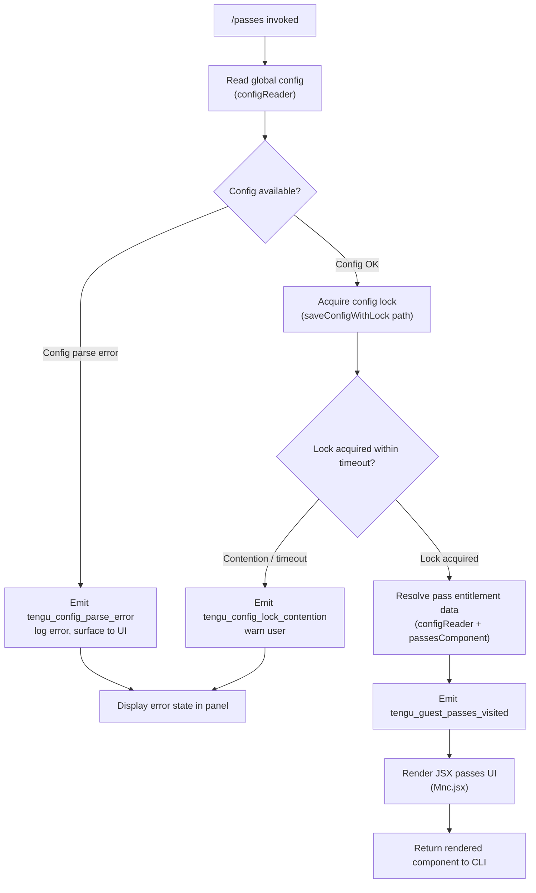

# `/passes`

> Analysis basis: CC v2.1.198 bundle.js (AST extraction + Claude interpretation)
> Minimum version: v2.1.198

---

## Overview

`/passes` is a local-jsx command that renders a UI panel allowing the current Claude Code user to share a free week of Claude Code with friends (guest passes). When invoked, the handler (`ctm`) fetches the current global configuration, initialises the passes-management component, renders a JSX view via the React-like render pipeline, and emits a telemetry event (`tengu_guest_passes_visited`) to record the interaction.

---

## Registration

| Field | Value |
|---|---|
| type | `local-jsx` |
| name | `passes` |
| description | `Share a free week of Claude Code with friends` |
| module_id | `Rnc` |
| load_inline | `true` |
| isHidden | `null` (not hidden) |
| loc_byte | `13031567` |
| loc_byte_end | `13031889` |
| loc_line | `8867` |
| arbor_handler.name | `ctm` |
| arbor_handler.fqn | `claude-2.1.198::ctm` |
| arbor_handler.kind | `AsyncFunction` |
| arbor_handler.resolution_path | `module_id` |
| arbor_handler.n_hits | `2` |

Analysis basis: CC v2.1.198 bundle.js:+13031567

---

## Input Branching

The command flow has two principal branches based on whether the global configuration is readable, plus an inner JSX render step, giving 3+ distinct paths.



Analysis basis: CC v2.1.198 bundle.js:+13031398 (telemetry emit), +13031449 (JSX render call)

---

## Behavioral Spec

### 1. Handler Entry (`ctm`)

`ctm` is an `AsyncFunction` resolved via `module_id → Rnc` by Arbor (resolution_path: `module_id`, n_hits: 2).

```
async function passesCommandHandler(context):
    configData   = await readGlobalConfig(context)       // configReader → SCt
    passesData   = await resolvePassesState(configData)  // ocr
    recordVisit()                                        // emits tengu_guest_passes_visited
    component    = renderPassesView(passesData, context) // Mnc.jsx
    return component
```

Analysis basis: CC v2.1.198 bundle.js:+13031260 (ctm→Dt), +13031294 (ctm→ocr), +13031300 (ctm→configLifecycleManager), +13031398 (V / telemetry), +13031449 (Mnc.jsx)

---

### 2. Global Config Read (`configReader`)

The config subsystem reads the Claude global configuration file (typically `~/.claude.json`) with UTF-8 encoding, parses JSON, and applies normalisation through a path-resolution helper.

```
function readGlobalConfig():
    rawBytes = fs.readFileSync(configPath, "utf-8")   // literal: "utf-8" at +14257838
    parsed   = JSON.parse(rawBytes)                   // jsonParser
    if parse fails:
        emit "tengu_config_parse_error"               // +14259169
        throw Error("Config accessed before allowed.") // literal at +14257755
    normalised = normaliseConfigPaths(parsed)
    return normalised
```

Analysis basis: CC v2.1.198 bundle.js:+14257811 (readFileSync), +14257838 (encoding), +14259169 (parse error telemetry), +14257755 (guard error message)

---

### 3. Config Lock / Save Path (`saveConfigWithLock`)

When the passes UI triggers any write-back (e.g., recording that passes were viewed or redeemed), the config-lock subsystem is engaged to prevent concurrent writes across multiple Claude Code instances.

```
async function saveConfigWithLock(updatedConfig):
    acquired = await acquireLock(timeout)
    if not acquired:
        emit "tengu_config_lock_contention"           // +14255436
        warn("Lock acquisition took longer than expected…") // literal +14255347
    
    reRead = readGlobalConfig()
    
    if reRead has parse error:
        emit "tengu_config_auto_repaired"             // +14255949
        // auto-repair from cache; see GH #3117 — literal at +14255821
    
    if reRead is missing auth fields that cache has:
        emit "tengu_config_auth_loss_prevented"       // +14256279
        // refuse write to prevent auth wipe — literal at +14256127
        return
    
    writeConfigAtomic(updatedConfig)
    emit "tengu_config_stale_write" if stale          // +14255572
```

Analysis basis: CC v2.1.198 bundle.js:+14255347 (lock warning literal), +14255436 (lock contention event), +14255572 (stale write event), +14255821 (parse-error repair message), +14256127 (auth-loss guard message), +14255949 (auto-repaired event), +14256279 (auth-loss prevented event)

---

### 4. Passes State Resolution (`ocr` / `Fc`)

`ocr` calls into the main session/filesystem layer (`Fc`) and then the session-runner (`Dt`) to fetch current user pass entitlements from the Anthropic backend or local cache.

```
async function resolvePassesState(configData):
    session   = await buildSession(configData)         // Fc → cE
    entitlements = await fetchPassEntitlements(session) // Dt
    timestamp = Date.now()                             // +14254089
    return { session, entitlements, timestamp }
```

Analysis basis: CC v2.1.198 bundle.js:+12671199 (ocr→Fc), +12671247 (ocr→Dt), +14254089 (Date.now in Dt)

---

### 5. Backup / File-Management Subsystem (`backupHelper` / `configBackupManager`)

The config subsystem maintains up to 5 rolling backup copies (literal `5` at +14256740) of `~/.claude.json` in a `backups/` subdirectory (literal `"backups"` at +14257323). File names include a `.backup.` infix (literal at +14256601) and a `Date.now()` timestamp suffix for uniqueness.

```
function rotateConfigBackups(configDir):
    backupDir = path.join(configDir, "backups")        // "backups" at +14257323
    fs.mkdirSync(backupDir, { recursive: true })
    existing  = fs.readdirStringSync(backupDir)
                  .filter(name => name.includes(".backup."))
    sorted    = sortByTimestamp(existing)
    while sorted.length >= MAX_BACKUPS:                // MAX_BACKUPS = 5 (+14256740)
        fs.unlinkSync(oldest)
        sorted.shift()
    dest = path.join(backupDir, buildBackupName())
    fs.copyFileSync(configPath, dest)
```

Analysis basis: CC v2.1.198 bundle.js:+14257323 ("backups"), +14256601 (".backup."), +14256740 (limit 5), +14258454 (mkdirSync), +14258752 (copyFileSync), +14256714 (copyFileSync in Onn)

---

### 6. Passes UI Render (JSX)

After all data is resolved, `ctm` calls `Mnc.jsx` to produce the rendered passes panel that the CLI displays to the user.

```
function renderPassesView(passesData, context):
    props = buildPassesProps(passesData, context)
    return Mnc.jsx(PassesComponent, props)
```

Analysis basis: CC v2.1.198 bundle.js:+13031449 (Mnc.jsx call in ctm)

---

## State & Side Effects

| Item | Detail |
|---|---|
| Telemetry — `tengu_guest_passes_visited` | Fired on every invocation of `/passes` (bundle.js:+13031400) |
| Telemetry — `tengu_config_parse_error` | Fired when `~/.claude.json` fails JSON parsing (bundle.js:+14259169) |
| Telemetry — `tengu_config_lock_contention` | Fired when the config file lock cannot be acquired promptly (bundle.js:+14255436) |
| Telemetry — `tengu_config_stale_write` | Fired when a write is detected to be against a stale read (bundle.js:+14255572) |
| Telemetry — `tengu_config_auto_repaired` | Fired when the config is auto-repaired from cache after a parse error (bundle.js:+14255949) |
| Telemetry — `tengu_config_auth_loss_prevented` | Fired when a write is blocked to prevent loss of auth credentials (bundle.js:+14256279) |
| Telemetry — `tengu_config_fallback_write` | Fired when a fallback write path is taken (bundle.js:+14255052) |
| Telemetry — `tengu_bg_dispatch_sigkill_escalate` | Background dispatch: SIGKILL escalation (bundle.js:+18374756) |
| Telemetry — `tengu_bg_dispatch_low_mem` | Background dispatch: low memory condition (bundle.js:+18375462) |
| Telemetry — `tengu_bg_spare_enable` | Background spare session enabled (bundle.js:+18376152) |
| Telemetry — `tengu_bg_spare_claim` | Background spare session claimed (bundle.js:+18376280) |
| Telemetry — `tengu_bg_spare_claim_fail` | Background spare session claim failure (bundle.js:+18376546) |
| Telemetry — `tengu_daemon_config_reload` | Daemon detected config reload (bundle.js:+18392244) |
| Config file read | Reads `~/.claude.json` with UTF-8 encoding on every invocation |
| Config backup rotation | May write up to 5 rolling `.backup.`-infixed copies under `backups/` subdirectory |
| Config lock acquisition | Uses a file-based lock; warns if contention detected |
| Auth-loss guard | Refuses write if re-read config is missing auth fields present in cache (GH #3117) |
| JSX render | Renders `PassesComponent` via `Mnc.jsx` in the CLI UI layer |
| Hook registration | `Si` calls `sus.register` (bundle.js:+69675); watcher registered via `QMt → A0s.watchFile` (bundle.js:+1157718) |
| appState changes | Config state (`V`) updated after successful lock-protected write |
| Sound | <!-- TODO: not found in depth-2 traversal; needs --depth 4 --> |
| Process signal | `process.on("exit", …)` registered in subprocess runner (bundle.js:+217669) |

---

## Version History

| Version | Change |
|---|---|
| v2.1.198 | Initial analysis |

---

## Common Mistakes

1. **Invoking `/passes` in an environment without a valid `~/.claude.json`**: The config guard (`"Config accessed before allowed."`) will throw before the UI renders. Ensure the user has completed initial setup (`/login`) before sharing passes.
2. **Concurrent Claude Code instances writing config simultaneously**: The lock-contention path emits `tengu_config_lock_contention` and may delay the passes panel. Avoid running multiple Claude Code instances that write config at the same time.
3. **Assuming `/passes` is available to all account types**: The command is not hidden (`isHidden: null`) but the underlying pass entitlement is fetched from the Anthropic backend; users on plans that do not support guest passes will see an empty or restricted UI.
4. **Expecting a prompt/LLM interaction**: This is a `local-jsx` command, not a `prompt` command. It renders a local React-like component — no LLM turn is issued when `/passes` is invoked.
5. **Modifying `~/.claude.json` externally while `/passes` is open**: The auth-loss prevention guard (GH #3117) may refuse a config write if it detects auth fields have disappeared in the re-read, which can silently block pass redemption writes.

---

## Appendix — Identifier Mapping

> For bundle debugging only. Identifiers change across versions.

| Identifier | Role |
|---|---|
| `ctm` | Main async handler for `/passes` command (handler entry point) |
| `Dt` | Session runner / pass entitlement fetcher |
| `zt` | Path / config directory resolver utility |
| `A7o` | Auxiliary config helper (called from session runner) |
| `SCt` | Config file reader with backup and error handling |
| `As` | CLI error reporter (calls `process.exit`) |
| `Gt` | JSON parse wrapper |
| `c6` | String prefix normaliser (startsWith / slice helper) |
| `en` | Logger / event emitter utility |
| `I7o` | Backup directory scanner and file copier |
| `v7o` | Config directory path builder |
| `T` | Terminal output / subprocess runner |
| `Hiu` | Subprocess output formatter |
| `Me` | JSON stringify wrapper |
| `Oc` | String sanitiser / redactor |
| `YZe` | Option processor |
| `biu` | Subprocess launch and lifecycle manager |
| `qHm` | Config watcher initialiser |
| `QMt` | File-watch registration helper |
| `Re` | File-watch event handler |
| `yhe` | Config change diffuser |
| `Si` | Hook / signal registration dispatcher |
| `ocr` | Session builder calling `Fc` and `Dt` |
| `Fc` | High-level session factory |
| `cE` | Session construction core |
| `wd` | Git bare-repo detector |
| `pb` | Auth profile builder |
| `wc` | First-party auth checker |
| `dI` | Session dependency injector |
| `Pw` | Full session initialiser (auth resolution, API key check) |
| `e$t` | Zit initialiser wrapper |
| `Zit` | State/store accessor |
| `_n` | Config lifecycle manager (top-level coordinator) |
| `Onn` | Save-config-with-lock implementation |
| `sfi` | Object assign / config merge helper |
| `uGr` | Config merge inner utility |
| `ACt` | Alternate config accessor |
| `BMt` | Atomic file write (writeFileSyncAndFlush) with symlink/lock handling |
| `Wd` | Real-path resolver |
| `mn` | Error logger for file operations |
| `zws` | Safe file write with temp-file swap |
| `$Mt` | File open/stat/close helper |
| `ant` | chmod / permission applier |
| `$Dr` | Path normaliser for write operations |
| `eLs` | Object.defineProperty wrapper for file metadata |
| `TFe` | Config timestamp / freshness checker |
| `b7o` | Config entries iterator (Object.entries) |
| `Dnn` | Date.now timestamp recorder for config |
| `Mnn` | Config read + H0 accessor pair |
| `Kfr` | Save-global-config orchestrator |
| `Pe` | Post-save callback dispatcher |
| `OQe` | Callback queue processor |
| `Hiu` | Subprocess output formatter (dup of T sub-call) |
| `vgm` | UUID generator for message IDs |
| `xn` | Conversation turn builder |
| `HC` | History context assembler |
| `V` | App state / global state container |
| `UEr` | String prefix stripper / path normaliser |
| `k` | File-system watcher with interval polling |
| `h` | Push-buffer accumulator |
| `g` | Background session / daemon process manager |
| `_` | Conversation record builder |
| `I` | Scroll / viewport position calculator |
| `R` | OAuth / gateway HTTP request handler |
| `A` | Userinfo fetcher (OAuth) |
| `n` | Locale / case normaliser |
| `d` | Supervisor / MCP server process manager |
| `s` | Async resource set with add/delete/finally |
| `i` | Connection close handler |
| `o` | Terminal column formatter (padEnd / map) |
| `m` | Managed-settings / policy filter |
| `e` | String replacement utility |
| `t` | File-system or string target (context-dependent) |
| `l` | Path filter with startsWith check |
| `a` | Spend-limit / billing response handler |

---

Note: index built via Arbor fallback; some signals (telemetry, literals) may be missing — see arbor-fallback.js.