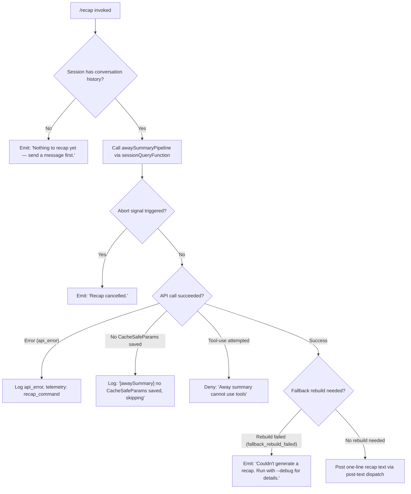

# `/recap`

> Analysis basis: CC v2.1.198 bundle.js (AST extraction + Claude interpretation)
> Minimum version: v2.1.198

---

## Overview

The `/recap` command triggers an immediate, on-demand generation of a one-line summary of the current Claude Code session. It invokes the same away-summary pipeline used by the background session-recap mechanism, but runs synchronously within the interactive REPL rather than waiting for an idle timeout. The result is emitted as a post-text dispatch to the terminal.

---

## Registration

| Field | Value |
|---|---|
| type | `local` |
| name | `recap` |
| description | `Generate a one-line session recap now` |
| loc_byte | `13566449` |
| loc_byte_end | `13566665` |
| loc_line | `9230` |
| supportsNonInteractive | `true` |
| thinClientDispatch | `post-text` |
| load_inline | `true` |
| load_ident | `Ocm` |
| arbor_handler.name | `Ocm` |
| arbor_handler.fqn | `claude-2.1.198::Ocm` |
| arbor_handler.kind | `AsyncFunction` |
| arbor_handler.resolution_path | `load_ident` |
| arbor_handler.n_hits | `0` |

Analysis basis: CC v2.1.198 bundle.js:+13566449

The handler is inlined via `load: () => Promise.resolve({ call: Ocm })` — no separate module ID. Arbor resolved it via `load_ident` path directly to the `Ocm` async function (`claude-2.1.198::Ocm`).

---

## Input Branching

The command has 4+ distinct outcome branches (empty history, cancellation, API error, fallback-rebuild failure, and success), so a Mermaid flowchart is used.



Analysis basis: CC v2.1.198 bundle.js:+13565906, +13566111, +13566203, +13566264, +13566339

---

## Behavioral Spec

### Top-Level Handler: recapCommandHandler (`Ocm`)

```
async function recapCommandHandler(context):
    // Step 1: Check history
    history = getConversationHistory(context)
    if history is empty:
        emitText("Nothing to recap yet — send a message first.")
        return

    // Step 2: Build away-summary request
    summaryRequest = buildAwaySummaryRequest(context)   // via Pcm
    if summaryRequest.cacheSafeParams is null:
        logDebug("[awaySummary] no CacheSafeParams saved, skipping")
        return

    // Step 3: Register abort listener
    abortController = context.abortController
    abortController.addEventListener("abort", onAbort)

    // Step 4: Run the away-summary query pipeline (sVt -> CR -> U1f)
    try:
        result = await runAwaySummaryQuery(summaryRequest)   // sVt

        if result.status == "aborted":
            emitText("Recap cancelled.")
            return

        if result.status == "failed":
            logTelemetry("recap_command", status="api_error")
            emitText("Couldn't generate a recap. Run with --debug for details.")
            return

        if result.status == "no-turn":
            // no output generated
            return

        if result.status == "away_summary":
            // Success path
            postText(result.summary)    // thinClientDispatch = "post-text"
            return

    catch error where error.name == "api-error":
        logTelemetry("recap_command", status="api_error")
        emitText("Couldn't generate a recap. Run with --debug for details.")
```

Analysis basis: CC v2.1.198 bundle.js:+13565765, +13565820, +8058932, +8059037, +8059156, +8059472, +13565906, +13566012, +13566111, +13566203, +13566339

---

### Away-Summary Request Builder (`Pcm`)

```
function buildAwaySummaryRequest(context):
    // Resolve message-type flags
    messageTypeFlags = resolveMessageTypeFlags()   // Vse, TXe
    filterDynamicMessages = filterByType(messageTypeFlags)

    // Determine model via model-resolution chain (VR -> fZ)
    model = resolveModelForSummary()

    // Collect conversation turns for compaction boundary check
    turns = getTurnsUpToCompactBoundary()   // wg -> lsr
    if turns is empty:
        return null   // triggers "no CacheSafeParams" log

    // Construct summary prompt parameters
    params = {
        turns: turns,
        model: model,
        flags: messageTypeFlags,
        abortSignal: context.abortSignal
    }

    return params
```

Analysis basis: CC v2.1.198 bundle.js:+13564605, +13564650, +13564659, +13564662, +13564819, +13565496

---

### Away-Summary Query Runner (`sVt`)

```
async function runAwaySummaryQuery(params):
    // Guard: abort already requested?
    if params.abortSignal.aborted:
        return { status: "aborted" }

    // Build the model-format prompt (T -> model format builder)
    formattedPrompt = formatSummaryPrompt(params)   // T

    // Register process-level abort handler
    params.abortSignal.addEventListener("abort", () => abortController.abort())

    // Call the core query pipeline
    queryResult = await coreQueryPipeline(formattedPrompt, params)   // CR -> U1f

    // Handle tool-use attempts (recap must NOT use tools)
    if queryResult attempts tool_use:
        deny("Away summary cannot use tools")
        return { status: "other" }

    return queryResult
```

Analysis basis: CC v2.1.198 bundle.js:+8058955, +8058975, +8059193, +8059212, +8059271, +8059389, +8059404, +8059633, +8059722

---

### Model Name Resolution (`vs` → `Fo`)

```
function resolveModelDisplayName(rawName):
    trimmed = rawName.trim().toLowerCase()

    // Known model alias map (evaluated at bundle.js:+2342800 region):
    //   "fable"    -> canonical fable identifier
    //   "opusplan" -> opus-plan variant
    //   "sonnet"   -> sonnet variant
    //   "haiku"    -> haiku variant
    //   "opus"     -> opus variant
    //   "best"     -> best-available alias
    //   "[1m]"     -> one-million-token context tag

    resolved = lookupAlias(trimmed)   // Aw, ost, Tw, UY, g$, KS, L6, Ey ...
    if not resolved:
        resolved = applyFallbackNormalization(rawName)   // t.replace

    return resolved
```

Analysis basis: CC v2.1.198 bundle.js:+2326347, +2342743, +2342820, +2342871, +2342887, +2342929, +2342969, +2343008, +2343046

---

### Session Log Writer (`biu` / `Siu`)

The away-summary path also triggers the persistent session log writer, which:

1. Creates the log directory if absent (`OF.mkdir`).
2. Appends the summary line to the log file (`OF.appendFile`).
3. Measures byte length of the appended content (`Buffer.byteLength`).
4. Debounces writes via `clearTimeout` / `setTimeout` (debounce period: 1000 ms; batch limit: 100 items). Analysis basis: CC v2.1.198 bundle.js:+67112, +67133
5. Registers an `exit` process listener to flush pending writes on shutdown. Analysis basis: CC v2.1.198 bundle.js:+217669

```
async function sessionLogWriter(summaryLine, logDir):
    await fs.mkdir(logDir, { recursive: true })
    await fs.appendFile(logPath, summaryLine)
    byteLen = Buffer.byteLength(summaryLine)
    scheduleFlush(debounceMs=1000, maxBatch=100)
```

Analysis basis: CC v2.1.198 bundle.js:+217113, +217172, +217265, +217298, +217389

---

## State & Side Effects

| Item | Detail |
|---|---|
| Telemetry (`recap_command`) | Fired on success path and error path; carries `status` field (`api_error`, `ok`, `away_summary`, `other`, etc.) — bundle.js:+13565906 |
| Telemetry (query pipeline) | Inherits full query-pipeline telemetry from `U1f` (e.g. `tengu_query_error`, `tengu_auto_compact_succeeded`, `tengu_malformed_tool_use_retry_outcome`, etc.) |
| Tool-use denial | Any tool call attempted by the model during recap is immediately denied with "Away summary cannot use tools" — bundle.js:+8059404 |
| Session log append | The recap output is appended to the persistent session log via `OF.appendFile` — bundle.js:+217172 |
| Abort signal | The command registers an `abort` event listener on the current `AbortController`; on signal, emits "Recap cancelled." and returns — bundle.js:+8059193, +8059212 |
| appState changes | Minimal; the query pipeline may call `e.getAppState` / `e.setAppState` internally — bundle.js:+11308942 |
| thinClientDispatch | `post-text` — the recap string is posted as plain text output |
| Sound | None detected in depth-2 traversal |

---

## Version History

| Version | Change |
|---|---|
| v2.1.198 | Initial analysis |

---

## Common Mistakes

1. **Running `/recap` before any conversation**: If no messages have been exchanged yet, the command outputs `"Nothing to recap yet — send a message first."` and terminates immediately without calling the model. Analysis basis: CC v2.1.198 bundle.js:+13566111
2. **Expecting tool calls to work during recap**: The away-summary pipeline explicitly denies all tool-use attempts with `"Away summary cannot use tools"`. The recap is intentionally text-only. Analysis basis: CC v2.1.198 bundle.js:+8059404
3. **Cancelling and expecting output**: If the abort signal fires (e.g. pressing `Ctrl+C`) before the model responds, the command exits with `"Recap cancelled."` and no summary is written. Analysis basis: CC v2.1.198 bundle.js:+13566203
4. **Ignoring the `--debug` hint**: When the underlying API call fails, the user sees only `"Couldn't generate a recap. Run with --debug for details."` — re-running with `--debug` is required to see the actual error. Analysis basis: CC v2.1.198 bundle.js:+13566339
5. **Assuming `/recap` is context-free**: The command operates on cached conversation state (`CacheSafeParams`). If the session has not yet persisted those parameters (e.g. immediately after process start), it silently skips recap. Analysis basis: CC v2.1.198 bundle.js:+8059098

---

## Appendix — Identifier Mapping

> For bundle debugging only. Identifiers change across versions.

| Identifier | Role |
|---|---|
| `Ocm` | Top-level recap command handler (AsyncFunction); entry point resolved via `load_ident` |
| `Pcm` | Away-summary request builder; constructs prompt parameters from conversation history |
| `sVt` | Away-summary query runner; manages abort signal and dispatches to core pipeline |
| `Npe` | Intermediate pipeline adapter between away-summary runner and core query |
| `vs` | Model name resolver; dispatches to alias lookup and normalization |
| `w6` | Model alias lookup table initializer |
| `Fo` | Model display-name formatter; performs trim, toLowerCase, alias map lookup, and replace |
| `IH` | Auxiliary formatter calling `Fo` and a secondary normalization function |
| `CR` | Core query orchestrator; coordinates session state, token pipeline, and model dispatch |
| `PZn` | Session-state query function; reads/writes appState, resolves UUIDs, calls model |
| `U1f` | Main agent query loop; handles streaming, tool execution, compaction, fallback chains |
| `AU` | Turn-level query dispatcher; invokes `U1f` and manages result routing |
| `LBn` | Subagent exit / cleanup handler; removes session entries and signals abort |
| `xe` | Feature-flag checker (ok path); emits `tengu_feature_ok` |
| `Le` | Feature-flag checker (bad path); emits `tengu_feature_bad` |
| `biu` | Session transcript / log writer setup; registers exit handler and debounced flush |
| `AZe` | Debounced batch-write scheduler using `setTimeout` / `clearTimeout` / `setImmediate` |
| `Siu` | Filesystem append worker; calls `OF.mkdir`, `OF.appendFile`, measures byte length |
| `jae` | Path join and key helper used by log writer |
| `Jps` | Log file path builder; joins directory and filename via `Wae.join` |
| `Uae` | Error classifier for `EISDIR` filesystem errors |
| `Si` | Hook registration helper; calls `sus.register` |
| `T` | Prompt formatter; serializes model input, handles redacted fields, calls `YZe` and `biu` |
| `Hiu` | Model capability resolver; delegates to `NF` and `$Cr` |
| `cus` | Credential / auth resolver; calls `bru` and `Tru` |
| `Me` | JSON stringifier wrapper |
| `Oc` | Model string normalizer; strips redacted segments and slices tail |
| `Kps` | Model identifier map builder using `miu.map` |
| `YZe` | Output stream writer calling `Ops` |
| `Ops` | Raw write executor (`e.write`) |
| `xn` | Background session spawner; generates UUID and delegates to `_` |
| `_` | Session file writer and process launcher |
| `vgm` | UUID generator for background sessions |
| `g` | Daemon background session manager (spawn, kill, memory check, lifecycle) |
| `cKa` | Result flat-mapper for session query outputs |
| `Vse` | Message-type flag checker using `yMe.has` |
| `TXe` | Conversation filter; checks `Array.isArray`, `Vse`, `VR`, `indexOf`, `startsWith` |
| `VR` | Model-tier resolver; delegates to `fZ` |
| `fZ` | Model-tier flag evaluator using `Array.isArray` and `Sl` |
| `DZ` | Message role prefix checker (`e.startsWith`) |
| `wg` | Compact-boundary slicer; calls `lsr` and `e.slice` |
| `lsr` | Compact-boundary detector using `EE` |
| `Z1f` | Forked-agent query result renderer; calls `V`, `Pe`, `yr` |
| `yr` | Message role classifier (`Um`, `Ke`) returning `nonconforming` for unknown roles |
| `Wde` | Tool-use summary deduplicator; filters and pushes unique entries |
| `vxp` | Tool-use entry finder (`e.find`) |
| `EE` | Compact boundary sentinel value |
| `ZKe` | Tool-use summary presence checker (`oEf.has`) |
| `n_l` | Secondary tool-use summary checker (calls `ZKe`) |
| `IP` | Random hex ID generator using `oln.randomBytes` (63 bytes → 8 hex chars) |
| `jde` | Session cleanup dispatcher; calls `eu` and `v7e` |
| `eu` | Hook unregistration helper calling `Si` and `process.on` |
| `v7e` | Pending-session filter and finalizer; calls `ypr`, `kpr`, `bpm` |
| `j8` | Path normalizer; calls `iN.normalize`, `jt`, and `t.replaceAll` for Windows paths |
| `CP` | Context-parameter resolver |
| `Prr` | Pre-run validation helper |
| `Jse` | Session existence checker |
| `q9` | Token-budget helper; calls `zl` and `Tma` |
| `ySe` | State serializer/deserializer; calls `f2`, `t.load`, `e.dump` |
| `vMe` | Spend/billing state resolver |
| `z0a` | Spend-limit enforcer |
| `Rrr` | Request retry resolver |
| `OZn` | Output normalizer |
| `HC` | Host-context resolver for spawned sessions |

Note: index built via Arbor fallback; some signals (telemetry, literals) may be missing — see arbor-fallback.js.