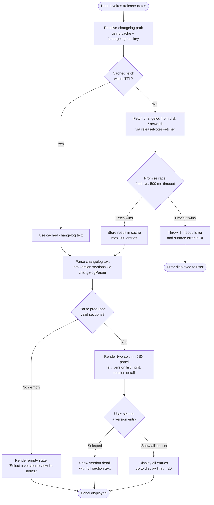

# `/release-notes`

> Analysis basis: CC v2.1.198 bundle.js (AST extraction + Claude interpretation)
> Minimum version: v2.1.198

---

## Overview

The `/release-notes` command opens an interactive JSX-rendered panel that displays the parsed contents of the bundled `changelog.md` file, allowing the user to navigate between version entries and read per-version release notes. It fetches (or uses a cached copy of) the changelog, parses it into version-keyed sections, and renders a two-column browser with a version list on one side and selected-version details on the other.

---

## Registration

| Field | Value |
|---|---|
| type | `local-jsx` |
| name | `release-notes` |
| description | `View release notes` |
| module_id | `b7l` |
| load_inline | `true` |
| loc_byte | `12608449` |
| loc_byte_end | `12608590` |
| arbor_handler.name | `Jzf` |
| arbor_handler.fqn | `claude-2.1.198::Jzf` |
| arbor_handler.kind | `AsyncFunction` |
| arbor_handler.resolution_path | `module_id` |
| arbor_handler.n_hits | `0` |

Analysis basis: CC v2.1.198 bundle.js:+12608449

---

## Input Branching

The command execution involves four or more distinct paths (changelog cache hit vs. miss, timeout race, changelog parse success vs. failure, and JSX render branches), so a Mermaid flowchart is used.



Analysis basis: CC v2.1.198 bundle.js:+12606765 (timeout), +12606815 (Promise.race), +12603412 (changelog.md key), +12603719 (cache size 200), +12606801 (500 ms timeout), +12607004 (JSX render), +12607137 ("Show all"), +12607759 ("Select a version…")

---

## Behavioral Spec

### Handler Entry — `releaseNotesHandler` (`Jzf`)

The Arbor-resolved handler is `Jzf` (AsyncFunction), reached via `module_id` → `b7l`.

```
async function releaseNotesHandler(context):
    // Step 1: race changelog fetch against a 500 ms timeout
    result = await Promise.race([
        fetchChangelog(context),          // releaseNotesFetcher (w6o)
        rejectAfterMs(500, "Timeout")     // literal: 500 ms, "Timeout"
    ])

    // Step 2: parse result into version-keyed sections
    sections = parseChangelog(result)     // changelogParser (klr)

    // Step 3: render the interactive panel
    return renderReleaseNotesPanel(sections, context)  // JSX renderer (A7l / PYe.jsx)
```

Analysis basis: CC v2.1.198 bundle.js:+12606765, +12606783, +12606815, +12606829, +12606858, +12606866, +12607004

---

### Changelog Fetcher — `releaseNotesFetcher` (`w6o`)

Resolves the path to `changelog.md`, checks an in-memory LRU cache (maximum 200 entries), and reads from disk when a cache miss occurs.

```
async function releaseNotesFetcher(context):
    cacheDir  = buildCachePath(["cache", "changelog.md"])  // v6o, literals
    cacheStore = globalCacheStore.get()                     // u_.get, Ys / yEd.getStore
    parentDir = path.dirname(cacheDir)                      // zZt.dirname

    timestamp = Date.now()
    if cacheStore has entry AND entry.age <= 200:           // cache TTL check, literal 200
        return cacheStore.entry.text

    rawText = readChangelogFromDisk(cacheDir)               // _n → Onn → SCt
    cacheStore.set(key, { text: rawText, ts: timestamp })
    return rawText
```

Analysis basis: CC v2.1.198 bundle.js:+12603395 (cache/changelog.md path), +12603695 (cache get), +12603719 (200-entry limit), +12603784 (dirname), +12603834 (Date.now)

---

### Config/File I-O Layer — `configReadWithLock` (`_n` / `Onn`)

Reading the changelog from disk goes through the same locked-config I/O subsystem used for global config files, which includes:

- Acquiring a file lock (with a 60 000 ms maximum wait; literal at +14256485).
- Warning when lock acquisition exceeds 100 ms ("Lock acquisition took longer than expected…"; literal at +14255347).
- Creating the parent directory with `mkdirSync` if missing.
- Reading with `readFileSync` in `utf-8` encoding (literal at +14257838).
- Maintaining up to 5 rolling backup copies under a `backups/` subdirectory (literals at +14256740, +14257323).
- On parse error: emitting `tengu_config_parse_error` and auto-repairing from the in-memory cache ("See GH #3117"; literal at +14255821).
- Refusing writes that would erase existing auth tokens ("See GH #3117"; literal at +14256127), emitting `tengu_config_auth_loss_prevented`.

```
function readFileWithLock(filePath, options):
    acquire fileLock(filePath, timeout=60000)
    if lockWaitMs > 100:
        emit telemetry("tengu_config_lock_contention")
    try:
        raw = fs.readFileSync(filePath, "utf-8")
        parsed = JSON.parse(raw)            // or plain text for changelog
        return parsed
    except ParseError:
        emit telemetry("tengu_config_parse_error")
        repairFromCache()
        emit telemetry("tengu_config_auto_repaired")
    finally:
        release fileLock(filePath)
```

Analysis basis: CC v2.1.198 bundle.js:+14251949, +14255163, +14255347, +14255436, +14255572, +14255821, +14256127, +14256485, +14257838

---

### Changelog Parser — `changelogParser` (`klr`)

Splits the raw changelog text into a map of version-label → body-text pairs and filters out empty sections.

```
function changelogParser(rawText):
    sections = parseIntoVersionSections(rawText)    // XZt: split, trim, slice
    keys     = Object.keys(sections)
    filtered = keys.filter(k => sections[k] is non-empty)  // o.filter
    // Each entry formatted as "VERSION - SUMMARY" separator " - " (literal +12604220)
    // Bullet lines prefixed with "- " (literal +12604298)
    versionEntries = filtered.map(k => buildEntry(k, sections[k]))  // Re, sr
    return versionEntries
```

Analysis basis: CC v2.1.198 bundle.js:+12604728, +12604745, +12604759, +12604786, +12604859, +12604957, +12604220, +12604298

---

### Section Splitter — `sectionSplitter` (`XZt`)

Parses the raw markdown body by splitting on version headers, trimming whitespace, extracting version labels via `headerParser` (`ii`), slicing the body lines, and trimming bullet lines.

```
function sectionSplitter(rawText):
    lines = rawText.split(separator)
    for each line in lines:
        trimmed = line.trim()
        if isVersionHeader(trimmed):
            label = headerParser(trimmed)   // ii: indexOf + slice
            collect body lines until next header
        else:
            append to current section body
    return { label: body } map
```

Analysis basis: CC v2.1.198 bundle.js:+12604089, +12604138, +12604215, +12604255, +12604278

---

### JSX Panel Renderer — `releaseNotesPanel` (`A7l`)

Renders the interactive two-column release notes browser as a React component. Uses React memoisation (sentinel `"react.memo_cache_sentinel"` at +12607638).

```
function releaseNotesPanel(versionEntries, selectedIndex, onSelect):
    // Left column: version list
    // - Shows up to 20 entries by default (literal 20 at +12607064)
    // - "Show all" button reveals the full list (literal "Show all" at +12607137)
    // - Column layout key: "column" (literal at +12607694)

    // Right column: detail pane
    // - Placeholder text when nothing selected:
    //   "Select a version to view its notes." (literal at +12607759)
    // - Renders selected entry's full text

    // Panel title: "Release notes" (literal at +12608110)

    leftPane  = renderVersionList(versionEntries, maxVisible=20, showAll=false)
    rightPane = selectedIndex >= 0
                  ? renderDetail(versionEntries[selectedIndex])
                  : renderPlaceholder("Select a version to view its notes.")

    return jsx("column", [leftPane, rightPane], title="Release notes")
```

Layout constants observed in component memoisation slots:
- Slot indices 3, 4, 7, 9, 10, 11, 12, 13, 14, 15, 16, 17, 18, 19, 20 (memo cache sentinel usage pattern)

Analysis basis: CC v2.1.198 bundle.js:+12607058, +12607064, +12607137, +12607235, +12607338, +12607380, +12607460, +12607627, +12607638, +12607669, +12607694, +12607759, +12608091, +12608110

---

### List Formatter — `versionListFormatter` (`S7l`) and `lineMapper` (`L6o`)

`S7l` slices a raw array to a display window and delegates individual line rendering to `L6o`. `L6o` maps version entries to rendered rows.

```
function versionListFormatter(entries, start, count):
    window = entries.slice(start, start + count)   // e.slice
    return lineMapper(window)                       // L6o

function lineMapper(entries):
    return entries.map(entry => renderRow(entry))  // t.map
```

Analysis basis: CC v2.1.198 bundle.js:+12606565 (L6o → t.map), +12606640 (S7l → e.slice), +12606693 (S7l → L6o)

---

### Error / Timeout Path

If the changelog fetch does not resolve within 500 ms, a `"Timeout"` error is thrown and surfaced. The `processExitHandler` (`As`) handles fatal CLI errors by logging to stderr in red (`Et.red`) and writing a `cli_error` event before calling `process.exit`.

```
function timeoutRacer(ms, label):
    return new Promise((_, reject) =>
        setTimeout(() => reject(new Error(label)), ms)
    )
    // ms    = 500  (literal +12606801)
    // label = "Timeout" (literal +12606789)

function fatalErrorHandler(err):
    console.error(Et.red(err.message))   // uXe
    writeCliError("cli_error", err)      // fI → Bae.writeFileSync
    process.exit(1)
```

Analysis basis: CC v2.1.198 bundle.js:+12606765, +12606783, +12606789, +12606801, +13219793, +13219800, +13219816

---

## State & Side Effects

| Item | Detail |
|---|---|
| Telemetry — `tengu_config_lock_contention` | Emitted when the config/file lock takes more than 100 ms to acquire (bundle.js:+14255436) |
| Telemetry — `tengu_config_stale_write` | Emitted when a stale write is detected during config save (bundle.js:+14255572) |
| Telemetry — `tengu_config_parse_error` | Emitted on JSON/file parse failure (bundle.js:+14259169) |
| Telemetry — `tengu_config_auto_repaired` | Emitted after auto-repair from cached config (bundle.js:+14255949) |
| Telemetry — `tengu_config_auth_loss_prevented` | Emitted when a write would have erased auth tokens (bundle.js:+14256279) |
| Telemetry — `tengu_config_fallback_write` | Emitted on fallback write path (bundle.js:+14255052) |
| File I/O | Reads `changelog.md` from disk; creates parent directories if absent; maintains up to 5 backup copies under `backups/` |
| Cache | In-memory LRU store, maximum 200 entries; key = `cache/changelog.md` |
| Lock | File lock with 60 000 ms timeout; warns at 100 ms; released in `finally` |
| appState changes | Selected version index tracked in component state; toggling "Show all" updates display window |
| Sound | None observed in depth-2 traversal |
| Error exit | `process.exit(1)` called on unrecoverable CLI error after writing `cli_error` record |

---

## Version History

| Version | Change |
|---|---|
| v2.1.198 | Initial analysis |

---

## Common Mistakes

1. **Expecting instant results on slow filesystems** — the command times out after 500 ms (bundle.js:+12606801). If `changelog.md` is on a slow or networked path, the command will surface a `"Timeout"` error rather than a partial result.
2. **Assuming the full list is always visible** — only the first 20 version entries are displayed by default (bundle.js:+12607064). The user must click **Show all** to see older entries.
3. **Editing `changelog.md` manually while Claude Code is running** — the locked I/O layer caches up to 200 reads; a manual edit may not appear until the cache entry expires or the process restarts.
4. **Interpreting the config telemetry events as release-notes-specific** — events such as `tengu_config_lock_contention` originate from the shared config I/O subsystem and fire whenever file-lock contention occurs, not only during `/release-notes` invocations.
5. **Missing the two-column layout requirement** — the panel renders as a `"column"` JSX layout; terminal emulators or CI environments that strip layout hints may display the version list and detail pane as a flat stream rather than side-by-side.

---

## Appendix — Identifier Mapping

> For bundle debugging only. Identifiers change across versions.

| Identifier | Role |
|---|---|
| `Jzf` | Main async handler for `/release-notes` (`releaseNotesHandler`) |
| `w6o` | Changelog fetcher with cache and path resolution (`releaseNotesFetcher`) |
| `v6o` | Cache path builder — joins `["cache", "changelog.md"]` (`cachePathBuilder`) |
| `YZt` | Secondary changelog path resolver, also calls `Ys` (`changelogPathResolver`) |
| `klr` | Changelog parser — splits text into version sections, filters empties (`changelogParser`) |
| `XZt` | Section splitter — splits raw text on version headers (`sectionSplitter`) |
| `ii` | Version header parser — `indexOf` + `slice` to extract label (`headerParser`) |
| `A7l` | JSX panel renderer — two-column release notes browser (`releaseNotesPanel`) |
| `S7l` | Version list formatter — slices display window, delegates to `L6o` (`versionListFormatter`) |
| `L6o` | Line mapper — maps version entries to rendered rows (`lineMapper`) |
| `mb` | Shared markdown/text utility called by both `S7l` and `klr` (`markdownUtil`) |
| `Re` | Release entry builder / error-path handler within parser (`releaseEntryBuilder`) |
| `sr` | Error constructor/string wrapper used in parser and entry builder (`errorWrapper`) |
| `_n` | Locked file-read orchestrator (`lockedFileReader`) |
| `Onn` | Core locked read implementation with backup and directory logic (`lockedReadImpl`) |
| `SCt` | Config read helper — `readFileSync`, parse, backup rotation (`configReadHelper`) |
| `Mnn` | Wrapper calling `SCt` and `H0` (`configReadWrapper`) |
| `Kfr` | Config write helper with auth-loss guard and atomic rename (`configWriteHelper`) |
| `BMt` | Atomic file write with temp-file + fsync + rename (`atomicFileWriter`) |
| `Dnn` | Timestamp/date utility used in config I/O (`timestampUtil`) |
| `b7o` | Object-entries iterator for config merging (`configEntryIterator`) |
| `ACt` | Auth-check utility referenced in config lock path (`authChecker`) |
| `Me` | JSON serialiser wrapper (`jsonSerializer`) |
| `v7o` | Backup path builder — joins `"backups"` segment (`backupPathBuilder`) |
| `As` | Fatal CLI error handler — logs and exits (`fatalErrorHandler`) |
| `uXe` | Stderr error printer using red colouring (`stderrPrinter`) |
| `fI` | CLI error record writer (`cliErrorWriter`) |
| `Ys` | Async-local store accessor (`asyncStoreAccessor`) |
| `qi` | Telemetry/config channel selector (`channelSelector`) |
| `wSs` | Telemetry settings resolver (`telemetrySettingsResolver`) |
| `st` | String coercion utility (`stringCoercer`) |
| `hr` | HTTP/network request helper used in fetcher (`networkRequestHelper`) |
| `Re` | Entry formatter / error reporter in parser (`entryFormatter`) |
| `jvu` | Rolling buffer manager (`rollingBufferManager`) |
| `Flc` | Logging / event-flush helper (`eventFlushHelper`) |
| `xlr` | Auxiliary parser helper called by `klr` (`auxParserHelper`) |
| `_` | Conversation/message builder (`messageBuilder`) |
| `I` | Scroll / viewport math helper (`viewportMathHelper`) |
| `T` | Output writer / formatter (`outputWriter`) |
| `V` | Validation helper (`validationHelper`) |
| `en` | Error normaliser (`errorNormaliser`) |
| `zt` | Path/file utility wrapper (`pathFileUtil`) |
| `sfi` | Config snapshot factory (`configSnapshotFactory`) |
| `Pe` | Platform/environment query helper (`platformQueryHelper`) |
| `TFe` | Feature-flag or config transform (`configTransform`) |

---

Note: index built via Arbor fallback; some signals (telemetry, literals) may be missing — see arbor-fallback.js.