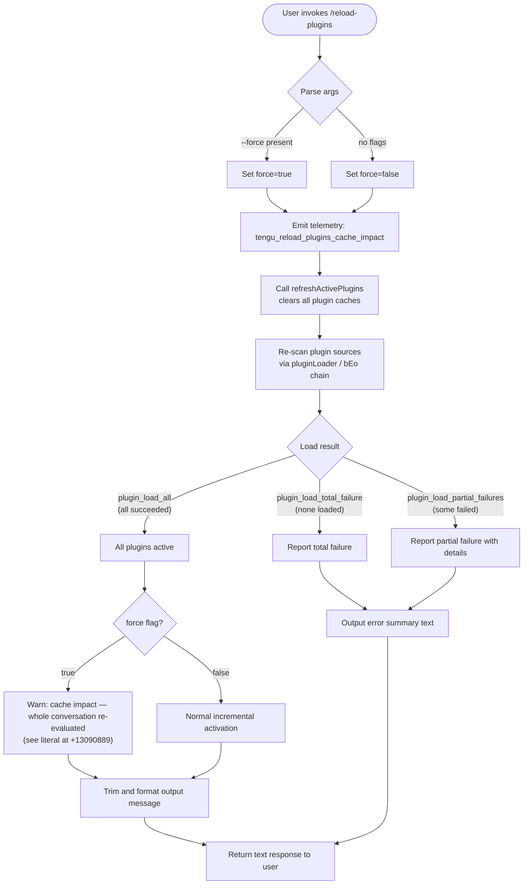

# `/reload-plugins`

> Analysis basis: CC v2.1.198 bundle.js (AST extraction + Claude interpretation)
> Minimum version: v2.1.198

---

## Overview

`/reload-plugins` activates pending plugin changes in the current session without requiring a full restart. It re-scans all plugin sources (MCP servers, skills, hooks, LSP servers), rebuilds the active-plugin state, and reports a summary of what changed. Passing `--force` causes the full conversation context to be re-evaluated against the new plugin set rather than using cached state.

---

## Registration

| Field | Value |
|---|---|
| type | `local` |
| name | `reload-plugins` |
| description | `Activate pending plugin changes in the current session` |
| argumentHint | `[--force]` |
| supportsNonInteractive | `false` |
| thinClientDispatch | `control-request` |
| module_id | `qrc` |
| load_inline | `true` |
| loc_byte | `13092318` |
| loc_byte_end | `13092562` |
| loc_line | `8974` |
| arbor_handler.name | `ztm` |
| arbor_handler.fqn | `claude-2.1.198::ztm` |
| arbor_handler.kind | `AsyncFunction` |
| arbor_handler.resolution_path | `module_id` |
| arbor_handler.n_hits | `0` |

Analysis basis: CC v2.1.198 bundle.js:+13092318

---

## Input Branching

There are more than three distinct code paths depending on flag presence, cache state, and plugin source outcomes.



Analysis basis: CC v2.1.198 bundle.js:+13091004, +13091055, +13091100, +13091431, +13091463

---

## Behavioral Spec

### Handler Entry — `reloadPluginsHandler` (bundle ident: `ztm`)

The command's main handler is the async function `ztm`, resolved via `module_id → qrc`.

```
async function reloadPluginsHandler(context):
    // Step 1: emit a telemetry marker with cache-impact metadata
    emitCacheImpact(context)           // calls Vrc → V (telemetry: tengu_reload_plugins_cache_impact)

    // Step 2: determine force flag
    rawArgs = context.args.trim()
    forceRequested = rawArgs.includes("--force") or rawArgs.includes("force")

    // Step 3: gather current app state
    appState = context.getAppState()

    // Step 4: log cache clear
    log("refreshActivePlugins: clearing all plugin caches")   // literal at +13087949

    // Step 5: reload active plugins
    reloadResult = await refreshActivePlugins(appState, forceRequested)
    // → internally calls pluginLoader (bEo chain) which runs:
    //     assemblePluginLoadResult (G2o)  — parallel Promise.all across sources
    //     loadMcpServersForSession (B2o)  — MCP server loading with Promise.allSettled
    //     installPluginCache (mQ)         — scans disk, checks known marketplaces

    // Step 6: build output lines
    lines = []
    for each plugin type in ["plugin", "skill", "agent"]:
        statusLine = formatStatusLine(reloadResult, pluginType)
        if statusLine has errors:
            lines.push("error: " + statusLine)
        else:
            lines.push(statusLine)

    // Step 7: separator and force-mode warning
    output = lines.join(" · ")     // literal separator at +13091242
    if forceRequested:
        output += warningAboutConversationReplay   // literal ending at +13090889

    // Step 8: return text content block
    return { type: "text", content: output }
```

Analysis basis: CC v2.1.198 bundle.js:+13091004, +13091022, +13091100, +13091395, +13091463, +13091509, +13091615, +13091669, +13091741, +13091773, +13091816

---

### Cache-Impact Telemetry — `cacheImpactReporter` (bundle ident: `Vrc`)

```
function cacheImpactReporter(context):
    payload = buildCacheImpactPayload(context)  // calls V at +13090289
    emit("tengu_reload_plugins_cache_impact", payload)
```

Analysis basis: CC v2.1.198 bundle.js:+13091615, +13090289, +13090291

---

### Plugin Refresh Core — `refreshActivePlugins` (bundle ident: `_Ie`)

This is the central async orchestrator reached from `ztm → _Ie`.

```
async function refreshActivePlugins(appState, force):
    // Clear all caches across subsystems
    clearSkillIndexCache()          // via LW → e.clearSkillIndexCache at +13686404
    clearPluginStaticCache()        // via $G → vJt.clear at +11438601
    log("Cleared installed plugins cache")  // literal at +11507726

    // Parallel reload of all plugin categories
    [mcpResult, skillResult, hookResult, lspResult] = await Promise.all([
        loadMcpServers(appState),           // XTe chain
        loadSkillPlugins(appState),          // Noe chain → reads .dxt / .mcpb files
        loadHookPlugins(appState),           // K8e chain → reads .lsp.json
        loadLspPlugins(appState)             // GGn chain
    ])

    // Compute diff between old and new plugin sets
    added   = filterAdded(mcpResult, skillResult, hookResult, lspResult)    // qtm
    removed = filterRemoved(mcpResult, skillResult, hookResult, lspResult)  // Ktm

    // Emit event for downstream consumers (e.g., UI refresh)
    eventEmitter.emit("plugin-state-changed", { added, removed })  // y2.emit at +13089075

    // Assemble final load result
    return assembleResult(added, removed, force)
```

Analysis basis: CC v2.1.198 bundle.js:+13087947, +13088001, +13088007, +13088056, +13088069, +13088168, +13088484, +13088562, +13088645, +13088678, +13088804, +13089075

---

### Plugin Loader — `assemblePluginLoadResult` (bundle ident: `G2o`)

```
async function assemblePluginLoadResult(sources, options):
    results = await Promise.all(sources.map(src => loadOneSource(src)))

    allOk      = results.every(r => r.status === "fulfilled")
    allFailed  = results.every(r => r.status === "rejected")

    if allOk:
        emit("plugin_load_all")                   // literal at +11597706
    else if allFailed:
        emit("plugin_load_total_failure")         // literal at +11597724
    else:
        emit("plugin_load_partial_failures")      // literal at +11597793

    // Guard: if cwd changed mid-scan, abort side-effects
    if originalCwdChangedMidScan():
        log("assemblePluginLoadResult: originalCwd changed mid-scan; skipping side-effects (stale early-kick)")
        // literal at +11597859
        return staleResult

    return buildFinalResult(results)
```

Analysis basis: CC v2.1.198 bundle.js:+11596466, +11596966, +11597020, +11597030, +11597057, +11597706, +11597724, +11597793, +11597859

---

### MCP Server Loading — `loadMcpServersForSession` (bundle ident: `B2o`)

```
async function loadMcpServersForSession(appState):
    // Iterate settings layers: userSettings, flagSettings, policySettings, localSettings
    configs = Object.entries(allSettingsLayers)
    serverMap = new Map()

    for [scopeName, scopeConfig] of configs:
        servers = parseServerEntries(scopeConfig)  // includes mcpAutoDiscovered, projectSettings
        loaded  = await Promise.allSettled(servers.map(s => connectServer(s)))

        for result of loaded:
            if result.status === "fulfilled":
                serverMap.set(result.value.name, result.value)
            else:
                recordFailure(result.reason)  // tagged with reason codes e.g. "marketplace-blocked-by-policy"

    // Detect and suppress duplicates
    deduped = deduplicate(serverMap)  // tags suppressed entries "mcp-server-suppressed-duplicate"

    return deduped
```

Analysis basis: CC v2.1.198 bundle.js:+11574468, +11574527, +11574827, +11575971, +11576142, +11576374, +11577315, +11577330, +11577345, +11577417, +7359556

---

### Plugin Cache Installation — `installPluginCache` (bundle ident: `mQ`)

This function performs the full disk-scan and cache construction. Key behaviours:

```
async function installPluginCache(options):
    // 1. Walk plugin directories; parse .mcp.json project config
    projectConfig = loadProjectMcpConfig()   // kT: searches upward for ".mcp.json"

    // 2. Load known marketplaces list from disk
    marketplaces = loadKnownMarketplaces()   // hm → reads "known_marketplaces.json"

    // 3. For each server entry, resolve type (plugin | skill | agent | plugin MCP server)
    for entry of Object.entries(allEntries):
        resolved = resolvePluginEntry(entry)   // mpe chain

    // 4. Check approval status ("approved" | "pending")
    checkApprovals()   // ZS: checks array membership via t.includes

    // 5. Build parallel loading tasks (max 3 concurrent — literal at +7359532)
    tasks = buildLoadTasks(resolved, { concurrency: 3 })
    results = await Promise.all(tasks)

    // 6. Track added/removed via Set membership
    for r of results:
        if not alreadySeen(r):
            addedSet.add(r)
        // window of 2 entries max for suppression — literal at +7359630

    // 7. Assign final cache and return
    return buildCacheResult(addedSet, results)
```

Analysis basis: CC v2.1.198 bundle.js:+7357497, +7357536, +7357640, +7357692, +7357847, +7357968, +7358009, +7358466, +7358515, +7359242, +7359421, +7359490, +7359543, +7359622

---

### Force-Mode Warning — `buildForceWarning` (bundle ident: `Ytm`)

```
function buildForceWarning(rawInput):
    parts = rawInput.split(delimiter)   // n.split at +13090786
    // assembles user-visible warning that includes the phrase
    // "the whole conversation instead of using the cache. Run /reload-plugins --force to apply."
    // (literal at +13090889)
    return joinedWarning
```

Analysis basis: CC v2.1.198 bundle.js:+13091669, +13090786, +13090889

---

### Output Formatting — `buildPluginStatusText` (bundle ident: `_Ie` → return path)

The handler collects per-plugin-type status strings (for types `"plugin"`, `"skill"`, `"agent"`, `"plugin MCP server"`) and joins them with ` · ` (literal at +13091242). Each line may carry an `"error"` prefix (literal at +13091298). The final payload is returned as a `"text"` content block (literal at +13091373).

Analysis basis: CC v2.1.198 bundle.js:+13091121, +13091153, +13091182, +13091215, +13091242, +13091298, +13091373

---

## State & Side Effects

| Item | Detail |
|---|---|
| Telemetry — primary | `tengu_reload_plugins_cache_impact` (emitted on every invocation; bundle.js:+13090291) |
| Telemetry — load outcome | `tengu_plugin_state_file_error` (on plugin state file I/O failure; +11507905) |
| Telemetry — feature flags | `tengu_feature_ok`, `tengu_feature_bad`, `tengu_feature_sad` (feature gate results; +1039573, +1039640, +1039721) |
| Telemetry — tool search | `tengu_tool_search_unsupported_models` (if a loaded plugin model is unsupported; +5162027) |
| Cache cleared | `vJt` (plugin static cache) via `$G → vJt.clear` at +11438601 |
| Cache cleared | Skill index cache via `e.clearSkillIndexCache` at +13686404 |
| appState changes | Plugin registry rebuilt; added/removed plugin sets updated in appState |
| Event emitted | `"plugin-state-changed"` on the internal event emitter (`y2.emit` at +13089075) |
| `--force` side effect | Full conversation replay against new plugin set (warned to user; literal at +13090889) |
| Hook registration | Safe-mode guard: if `--safe-mode` is active, plugin hook registration is skipped (literal `"Safe mode: skipping plugin hook registration"` at +5437210) |
| Sound | None observed in traversal |
| thinClientDispatch | `control-request` — command is forwarded to the control plane in thin-client mode |
| Non-interactive | Not supported (`supportsNonInteractive: false`) |

---

## Version History

| Version | Change |
|---|---|
| v2.1.198 | Initial analysis |

---

## Common Mistakes

1. **Expecting non-interactive use**: `supportsNonInteractive` is `false`; `/reload-plugins` cannot be used in headless or `--print` pipelines — the session must be interactive.
2. **Misunderstanding `--force`**: The flag does not skip safety checks or force-install anything. It triggers a conversation cache-bust, meaning the entire conversation context is re-evaluated against the new plugin set, which can be expensive and slow.
3. **Running while cwd changes**: The loader guards against a changed working directory mid-scan and will abort side-effects, logging a "stale early-kick" warning. If this occurs, the reload silently no-ops its side effects even though it appears to complete.
4. **Using yarn or pnpm lockfiles**: Plugin packages whose directories contain `yarn.lock` or `pnpm-lock.yaml` are explicitly skipped with the message "Skipped: yarn/pnpm lockfiles are not supported". Use `bun` or `npm` instead (literal at +11526480).
5. **Assuming all plugin types reload in one pass**: The loader handles `plugin`, `skill`, `agent`, and `plugin MCP server` as distinct categories. A failure in one category does not prevent others from loading (`plugin_load_partial_failures` path).

---

## Appendix — Identifier Mapping

> For bundle debugging only. Identifiers change across versions.

| Identifier | Role |
|---|---|
| `ztm` | Main handler — `reloadPluginsHandler` (AsyncFunction) |
| `c_` | Plugin state initializer / pre-flight check |
| `Ul` | Utility called by pre-flight and handler entry |
| `ute` | Sub-utility called by `Ul` |
| `lee` | Plugin type enumerator helper |
| `un` | Inner utility of `lee` |
| `jrc` | Plugin reload orchestration setup |
| `bEo` | Plugin loader outer wrapper |
| `sve` | Loader sub-utility |
| `CEo` | Loader coordinator calling `G2o` and `B2o` |
| `G2o` | `assemblePluginLoadResult` — parallel load aggregator |
| `B2o` | `loadMcpServersForSession` — MCP server loader with `Promise.allSettled` |
| `mQ` | `installPluginCache` — disk scanner and cache builder |
| `kc` | Plugin config file locator |
| `P2` | Object prototype utility (`Object.create`) |
| `kT` | Project MCP config scanner (finds `.mcp.json` upward) |
| `mpe` | Plugin entry resolver |
| `ZS` | Approval status checker (array membership) |
| `K0n` | Transport-type validator (`http`, `dynamic`) |
| `hE` | Plugin hook initializer |
| `T` | Terminal output writer utility |
| `b6n` | Plugin binary/bundle loader (`.mcpb`, `.dxt`) |
| `Sx` | Cache deduplication helper |
| `kBa` | Plugin entry cache manager (Map-based) |
| `Vrc` | Cache-impact telemetry reporter |
| `V` | Telemetry emitter base |
| `Ytm` | Force-mode warning builder |
| `_Ie` | `refreshActivePlugins` — central plugin reload orchestrator |
| `YFl` | Plugin cache clear helper |
| `Lg` | Plugin subsystem loader (skills, hooks, MCP) |
| `yFf` | Skills loader |
| `Xw` | Skills sub-utility |
| `Mpo` | Plugin root scanner |
| `Re` | Error reporter utility |
| `V0` | Skill index cache invalidator |
| `LW` | `clearSkillIndexCache` caller |
| `Hj` | Hook coordinator |
| `Nco` | Plugin notification coordinator |
| `$G` | Static plugin cache clearer (`vJt.clear`) |
| `XTe` | MCP server connection manager |
| `VD` | MCP config reader |
| `hm` | Known-marketplaces file reader |
| `kor` | Marketplace JSON path resolver |
| `xGe` | MCP entry expander |
| `Hn` | MCP entry schema validator |
| `yj` | Plugin manifest reader |
| `OJt` | Plugin directory locator (`.claude-plugin`) |
| `S2o` | Plugin marketplace JSON parser |
| `LR` | Plugin source loader (project + user scopes) |
| `b2o` | Plugin source reader (file scope) |
| `qJt` | MCP plugin install/update engine |
| `Qw` | MCP scope validator |
| `Gor` | MCP config scoped getter |
| `Pt` | Active-context accessor |
| `XR` | Plugin file loader from disk |
| `T2o` | Synchronous plugin file reader |
| `I2o` | Plugin entry iterator |
| `$Jt` | Plugin state file write helper |
| `nF` | Plugin canonical path resolver |
| `Nor` | Plugin directory reader |
| `Oor` | Plugin output path builder |
| `cz` | String formatter for plugin output |
| `Tor` | Plugin temp-dir cleaner |
| `C2o` | Plugin slot updater |
| `VJt` | Plugin install/download executor |
| `rbt` | Plugin archive extractor (`.mcpb`) |
| `sie` | Content hash generator |
| `Noe` | Plugin disk scanner (reads `.dxt`, `.mcpb`, manifest) |
| `uEo` | Plugin manifest parser |
| `gBa` | Plugin status classifier |
| `JWt` | Plugin install directory manager |
| `K8e` | LSP plugin loader (reads `.lsp.json`) |
| `e5p` | LSP config expander |
| `Z4p` | LSP path validator (relative path check) |
| `Flc` | Daemon status file writer |
| `GGn` | LSP extension-conflict detector |
| `qtm` | Added-plugins filter |
| `Ktm` | Removed-plugins filter |
| `kSe` | Safe-mode hook guard |
| `Ql` | Settings boolean parser (`yes`/`on`/`no`/`off`) |
| `DO` | HIPAA / compliance mode resolver |
| `j4t` | Context tier parser (`standard`, `tst`, `tst-auto`) |
| `Qco` | `auto:` prefix parser for concurrency |
| `mr` | API gateway/provider resolver |
| `fu` | Context-store accessor |
| `LJ` | Lowercase command normalizer |
| `Bgp` | Command array normalizer |
| `nt` | Notification tracker |
| `Qy` | Output token accumulator |
| `Gue` | Dependency display formatter |

---

Note: index built via Arbor fallback; some signals (telemetry, literals) may be missing — see arbor-fallback.js.