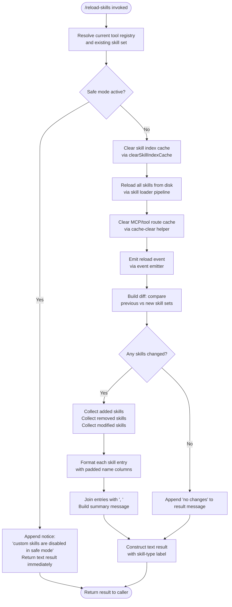

# `/reload-skills`

> Analysis basis: CC v2.1.193 bundle.js (AST extraction + Claude interpretation)
> Minimum version: v2.1.193

---

## Overview

`/reload-skills` rescans the filesystem for skill definitions that were added or modified during the current session, invalidates the skill index cache, and reports back the set of changed, added, or removed skills. It is a local command that can run in non-interactive mode and dispatches its result as a text message via the thin-client post-text mechanism.

---

## Registration

| Field | Value |
|---|---|
| type | `local` |
| name | `reload-skills` |
| description | `Pick up skills added or changed on disk during this session` |
| supportsNonInteractive | `true` |
| thinClientDispatch | `post-text` |
| module_id | `q6l` |
| load_inline | `true` |
| loc_byte | `12836324` |
| loc_byte_end | `12836541` |
| arbor_handler.name | `EPf` |
| arbor_handler.fqn | `claude-2.1.193::EPf` |
| arbor_handler.kind | `AsyncFunction` |
| arbor_handler.resolution_path | `module_id` |
| arbor_handler.n_hits | `0` |

Analysis basis: CC v2.1.193 bundle.js:+12836324

---

## Input Branching

Four distinct branches are present in the handler: safe-mode guard, cache-clear + skill reload, diff computation (added/removed/changed), and the no-changes fallback. A Mermaid flowchart is used accordingly.



---

## Behavioral Spec

### Handler Entry — Skill Reload Orchestrator

The primary handler (`EPf`, `AsyncFunction`) is resolved via the `module_id` path (`q6l`).

Analysis basis: CC v2.1.193 bundle.js:+12835804

```
async function reloadSkillsHandler(context):
    # Step 1 — Resolve current state
    previousSkillSet = getCurrentSkillSet(context)   // via getToolRegistry + getSkillStore
    currentConfig    = resolveConfig(context)

    # Step 2 — Safe-mode guard
    if isSafeMode(currentConfig):
        return buildTextResult(
            " (custom skills are disabled in safe mode)"
        )
        // literal at bundle.js:+12836094

    # Step 3 — Cache invalidation
    clearSkillIndexCache()          // P6 -> e.clearSkillIndexCache  bundle.js:+13423705
    clearToolRouteCache()           // o6 -> rqt.clear               bundle.js:+11117631

    # Step 4 — Reload from disk
    newSkills = await loadSkillsFromDisk()    // p0 pipeline          bundle.js:+12835853

    # Step 5 — Emit reload event
    emitReloadEvent(eventEmitter)             // gF.emit              bundle.js:+12835911

    # Step 6 — Compute diff
    added   = newSkills \ previousSkillSet
    removed = previousSkillSet \ newSkills

    # Step 7 — Summarise background sessions among removed
    stoppedSessions = filterStopped(removed)  // "stopped", "background session" bundle.js:+17520186

    # Step 8 — Build result message
    changeParts = []
    for skill in union(added, removed):
        changeParts.push(formatSkillEntry(skill))   // padEnd(40)  bundle.js:+17511228

    if changeParts is empty:
        resultText = "no changes"               // literal bundle.js:+12836074
    else:
        resultText = changeParts.join(", ")     // literal bundle.js:+12836068

    return buildTextResult(resultText, type="text", label="skill")
    // "text" bundle.js:+12836154 | "skill" bundle.js:+12836211
```

---

### Sub-feature: Skill Store Resolution (`getSkillStore`)

Resolves the async-local storage context holding the active skill set before the reload begins.

Analysis basis: CC v2.1.193 bundle.js:+1062079

```
function getSkillStore():
    store = asyncLocalStorage.getStore()    // yln.getStore
    if store is null:
        return defaultSkillContext()        // kK fallback
    return store
```

---

### Sub-feature: Config Resolution (`resolveConfig`)

Determines whether safe mode is currently active by reading the parsed CLI configuration.

Analysis basis: CC v2.1.193 bundle.js:+1062130

```
function resolveConfig(context):
    raw = getConfigFromRegistry(context)    // Pt -> Eln -> mr
    return parseConfig(raw)                 // mr -> Rx
```

Safe-mode is detected by checking `--safe-mode` in the resolved config (literal: `"--safe-mode"` at bundle.js:+70258).

---

### Sub-feature: Skill Index Cache Clear (`clearSkillIndexCacheWrapper`)

Wraps the async cache-clear sequence: resolves a promise, invokes the jitter helper, then calls `clearSkillIndexCache`.

Analysis basis: CC v2.1.193 bundle.js:+13423653

```
async function clearSkillIndexCacheWrapper():
    await Promise.resolve()                 // P6 -> Promise.resolve  bundle.js:+13423653
    await jitterDelay()                     // P6 -> JMo              bundle.js:+13423683
    skillStore.clearSkillIndexCache()       // P6 -> e.clearSkillIndexCache bundle.js:+13423705
```

Jitter is computed as `Math.random() ** 2` (exponent `2` at bundle.js:+14343445) passed to `setTimeout` (bundle.js:+14343484).

---

### Sub-feature: Disk Skill Loader Pipeline (`loadSkillsFromDisk`)

Loads skill definitions from disk using a multi-step pipeline that includes reading, validating, and indexing skill files.

Analysis basis: CC v2.1.193 bundle.js:+13423752

```
async function loadSkillsFromDisk():
    phase1 = await LYn()     // first loader stage   bundle.js:+13423757
    phase2 = await oAl()     // second loader stage  bundle.js:+13423763
    index  = await buildSkillIndex(phase1, phase2)   // z8e -> eVt  bundle.js:+13423769
    return index
```

The index builder (`eVt`) reads from an internal map store (`ozn.get` at bundle.js:+10606606) and applies transformation `Q8t` (bundle.js:+10606614).

---

### Sub-feature: Error Handling in Skill Loader (`skillLoaderErrorHandler`)

If skill loading emits an error event, the error handler writes a `cli_error` record to disk and exits the process.

Analysis basis: CC v2.1.193 bundle.js:+13300599

```
function skillLoaderErrorHandler(err):
    console.error(colorRed(err.message))    // lKe -> St.red  bundle.js:+13300613
    writeCliError(err)                      // OT -> Lse.writeFileSync bundle.js:+201267
    process.exit(1)                         // literal 1 bundle.js:+13300680
```

The `cli_error` string literal appears at bundle.js:+13300654. The error file path is constructed via `path.join` (`jgr.join` at bundle.js:+201285).

---

### Sub-feature: Skill Entry Formatter (`formatSkillEntry`)

Formats a single skill name for inclusion in the summary output, padding the name to a fixed column width.

Analysis basis: CC v2.1.193 bundle.js:+17509220

```
function formatSkillEntry(skill):
    name   = skill.name.toLowerCase()          // i.toLowerCase  bundle.js:+17511154
    padded = name.padEnd(40)                   // i.padEnd, literal 40 bundle.js:+17511228
    cols   = skill.columns.map(c => c + "  ")  // separator "  " bundle.js:+17509254
    return padded + cols.join("")
```

---

### Sub-feature: Background Session Termination (`stopBackgroundSessions`)

When removed skills include background sessions, their watchers are explicitly closed before the diff is reported.

Analysis basis: CC v2.1.193 bundle.js:+17495264

```
function stopBackgroundSessions(removedSkills):
    for session in removedSkills:
        if session.status === "stopped":         // literal bundle.js:+17520186
            session.watcher.close()              // i -> n.close  bundle.js:+17495264
            session.reader.close()               // i -> r.close  bundle.js:+17495274
            session.cleanup()                    // i -> s        bundle.js:+17495414
            label = "background session"         // literal bundle.js:+17520229
            trackSessionEnd(session, label)      // c -> yn  bundle.js:+17520224
```

The active-session registry (`r`) uses `add` / `delete` / `finally` chaining around the close sequence (bundle.js:+17488421, +17488444, +17488430).

---

### Sub-feature: Result Construction (`buildTextResult`)

Assembles the final `text`-typed result object returned by the command, optionally appending the safe-mode notice.

Analysis basis: CC v2.1.193 bundle.js:+12836089

```
function buildTextResult(body, type="text", label="skill"):
    flags = resolveFlags()                    // El -> at -> String  bundle.js:+29676
    if flags["yes"] or flags["on"]:           // literals bundle.js:+29725, +29731
        prefix = "--"                         // literal bundle.js:+70053
    return { type: type, content: body, label: label }
    // "text" bundle.js:+12836154, "skill" bundle.js:+12836211
```

Safe-mode notice string: `" (custom skills are disabled in safe mode)"` (bundle.js:+12836094).
No-changes fallback string: `"no changes"` (bundle.js:+12836074).

---

## State & Side Effects

| Item | Detail |
|---|---|
| Telemetry | None found in depth-2 traversal |
| Skill index cache | Cleared unconditionally (unless safe mode) via `clearSkillIndexCache` (bundle.js:+13423705) |
| Tool route cache | Cleared unconditionally (unless safe mode) via `rqt.clear` (bundle.js:+11117631) |
| Event emission | Reload event fired on `gF` event emitter (bundle.js:+12835911) |
| Background sessions | Open watchers/readers for removed background sessions are closed (bundle.js:+17495264) |
| Active session registry | Updated via `r.add` / `r.delete` around session lifecycle (bundle.js:+17488421, +17488444) |
| Error path | On skill-load error: writes `cli_error` record to disk and calls `process.exit(1)` (bundle.js:+13300667, +13300680) |
| Jitter delay | Randomised exponential back-off (`Math.random() ** 2`) applied before cache clear (bundle.js:+14343445) |
| Output channel | Result dispatched as `post-text` via thin-client mechanism |

---

## Version History

| Version | Change |
|---|---|
| v2.1.193 | Initial analysis |

---

## Common Mistakes

1. **Running in safe mode and expecting skills to reload** — The command detects safe mode early and returns immediately with a notice that custom skills are disabled; no cache invalidation or disk scan occurs in that branch.
2. **Assuming the command is synchronous** — The handler is an `AsyncFunction`; callers must await it. In non-interactive pipelines this matters for sequencing subsequent commands.
3. **Expecting telemetry events** — No `tengu_*` telemetry events were found in the depth-2 traversal for this command; do not rely on telemetry for observability of skill reloads.
4. **Ignoring background session closure** — Removed skills that were running as background sessions have their watchers and readers explicitly closed; any external handle to those sessions will become invalid after `/reload-skills`.
5. **Misreading "no changes"** — The string `"no changes"` is only emitted when the diff between old and new skill sets is empty; a successful reload that finds actual changes will list them instead.

---

## Appendix — Identifier Mapping

> For bundle debugging only. Identifiers change across versions.

| Identifier | Role |
|---|---|
| `EPf` | Primary async handler for `/reload-skills` (resolved via module_id `q6l`) |
| `Pt` | Config registry resolver — fetches active configuration from registry |
| `Eln` | Async-local store accessor — retrieves skill store from async context |
| `kK` | Default skill context fallback when async store is null |
| `mr` | Config parser — converts raw config object to structured form |
| `Rx` | Low-level config read primitive |
| `Is` | Skill file loader — orchestrates reading skill definitions from disk |
| `lKe` | Skill load error handler — logs and writes `cli_error` record |
| `OT` | CLI error file writer — serialises error to disk via `writeFileSync` |
| `p0` | Disk skill loader pipeline entry point |
| `P6` | Skill index cache clear wrapper (Promise + jitter + `clearSkillIndexCache`) |
| `e` | Jitter delay helper — computes `Math.random() ** 2` then `setTimeout` |
| `LYn` | First stage of skill loading pipeline |
| `oAl` | Second stage of skill loading pipeline |
| `z8e` | Skill index builder — combines loader output into indexed skill map |
| `eVt` | Index transformation step — reads from internal map, applies transform |
| `Q8t` | Index entry transformation applied during `eVt` |
| `o6` | Tool route cache clear helper — calls `rqt.clear` |
| `s` | Active session registry manager — handles `add` / `delete` / `finally` |
| `i` | Individual skill session — exposes `close`, `cleanup`, `toLowerCase` |
| `n` | Session watcher — closed via `n.close()` on session removal |
| `Nn` | Diff / change-set builder utility |
| `t` | Internal change-set accumulator used by `Nn` |
| `o` | Skill entry column formatter — maps column values and pads strings |
| `c` | Result message part accumulator (array pushed to, then joined) |
| `yn` | Session-end tracker — records background session termination |
| `El` | Result object constructor — assembles final text result |
| `at` | Flag resolver — checks `yes`/`on` flag values for result prefix |
| `Ctn` | Safe-mode appendix helper — appends safe-mode notice string |

---

Note: index built via Arbor fallback; some signals (telemetry, literals) may be missing — see arbor-fallback.js.