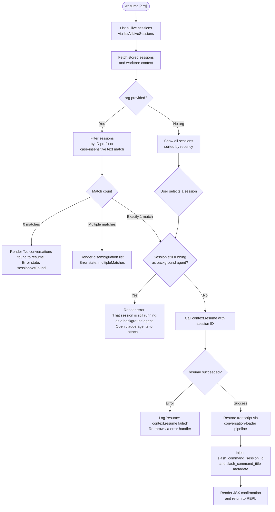

# `/resume`

> Analysis basis: CC v2.1.198 bundle.js (AST extraction + Claude interpretation)
> Minimum version: v2.1.198

---

## Overview

`/resume` (alias: `/continue`) allows the user to pick up a previous Claude Code conversation by searching for it by session ID or by a free-text search term. The command fetches all live and stored sessions, filters them against the supplied argument, and then restores the matching conversation's transcript and state into the current REPL context. If the target session is still running as a background agent, the command refuses the resume and directs the user to `/agents` instead.

---

## Registration

| Field | Value |
|---|---|
| type | `local-jsx` |
| name | `resume` |
| description | Resume a previous conversation |
| argumentHint | `[conversation id or search term]` |
| aliases | `["continue"]` |
| module_id | `SQl` |
| load_inline | `true` |
| loc_byte | `12782252` |
| loc_byte_end | `12782449` |
| loc_line | `8549` |
| arbor_handler.name | `XJf` |
| arbor_handler.fqn | `claude-2.1.198::XJf` |
| arbor_handler.kind | `AsyncFunction` |
| arbor_handler.resolution_path | `module_id` |
| arbor_handler.n_hits | `0` |

Analysis basis: CC v2.1.198 bundle.js:+12782252

---

## Input Branching

Five or more distinct control paths exist in the handler, so a Mermaid flowchart is required.



Analysis basis: CC v2.1.198 bundle.js:+12780742, +12780846, +12780856, +12781077, +12781307, +12781534, +12781569, +12781694, +12781844

---

## Behavioral Spec

### 1. Session Discovery — `listAllLiveSessions` + stored transcript scan

```
async function discoverSessions(context):
    liveSessions = await listAllLiveSessions(context)  // IPC to daemon
    worktreeInfo  = await detectWorktreeContext()        // git worktree list --porcelain
    storedSessions = await loadConversationIndex()       // reads JSONL transcript files
    return merge(liveSessions, storedSessions, worktreeInfo)
```

The daemon call returns sessions tagged `"interactive"` (Analysis basis: CC v2.1.198 bundle.js:+9447883). Worktree detection runs `git worktree list --porcelain` and normalises paths (Analysis basis: CC v2.1.198 bundle.js:+9436219, +9436230, +9436237). The prefix `"worktree "` (9 characters) is stripped when parsing the porcelain output (Analysis basis: CC v2.1.198 bundle.js:+9436438, +9436472).

### 2. Filtering and Matching

```
function filterSessions(sessions, arg):
    if arg is empty:
        return sessions sorted by recency
    needle = arg.trim().toLowerCase()
    exact  = sessions.find(s => s.id.startsWith(needle))
    if exact:
        return [exact]
    fuzzy = sessions.filter(s =>
        s.id.includes(needle) OR
        s.title.toLowerCase().includes(needle) OR
        s.lastPrompt.toLowerCase().includes(needle)
    )
    return fuzzy sorted by localeCompare
```

Analysis basis: CC v2.1.198 bundle.js:+12780742, +12780772, +13750336, +13750361, +13750461, +13750509, +13750609, +13750675

### 3. Background-Agent Guard

Before restoring, the handler checks whether the candidate session is currently claimed by a background agent worker. If the daemon reports the session as live in `"interactive"` mode and the session has an active background worker, the command emits the literal error string:

> "That session is still running as a background agent. Open `claude agents` to attach to it, or stop it there first to resume here."

(Analysis basis: CC v2.1.198 bundle.js:+12780856)

No resume is attempted in this branch.

### 4. Context Restoration — `XJf` main flow

```
async function resumeHandler(arg, context):
    sessions = await discoverSessions(context)
    candidates = filterSessions(sessions, arg)

    if candidates.length == 0:
        renderError(sessionNotFound, "No conversations found to resume.")
        return

    if candidates.length > 1 and arg is not empty:
        renderDisambiguationList(candidates, state="multipleMatches")
        return

    target = candidates[0]

    if isRunningAsBackgroundAgent(target):
        renderError("That session is still running as a background agent...")
        return

    try:
        await context.resume(target.id)          // internal resume call
    catch err:
        logError("resume: context.resume failed")
        throw err

    transcript = await loadTranscriptPipeline(target)   // Dfe / wbe / Ofc chain
    injectMetadata({
        slash_command_session_id: target.id,
        slash_command_title:      target.title
    })
    renderConversationView(transcript)
    recordTimestamp(Date.now())
```

Analysis basis: CC v2.1.198 bundle.js:+12780854, +12781077, +12781080, +12781083, +12781089, +12781146, +12781182, +12781215, +12781243, +12781257, +12781408, +12781534, +12781547, +12781563, +12781569, +12781614, +12781675, +12781694, +12781844

### 5. Transcript Loading Pipeline — `wbe` / `Ofc` / `Dfe`

The conversation-loader pipeline (reached via the `wbe` → `Ofc` → `Dfe` call chain) reads JSONL transcript files using Node's `fs` APIs (`readFile`, `stat`, `readdir`). It:

- Parses each JSONL record, recognising `type` values `"assistant"`, `"user"`, `"system"`, `"attachment"`, `"compact_boundary"`, `"summary"`, `"last-prompt"`, `"progress"` (Analysis basis: CC v2.1.198 bundle.js:+13699051, +13699073, +13699096, +13756259, +13756326, +14191594).
- Relinks parent–child chains using UUID references; logs `tengu_transcript_phantom_parent` when a parent UUID is missing and `tengu_transcript_parent_cycle` when a cycle is detected (Analysis basis: CC v2.1.198 bundle.js:+13754991, +13759179).
- Applies compact-boundary summaries and strips session-level metadata keys such as `"custom-title"`, `"ai-title"`, `"tag"`, `"mode"`, `"permission-mode"`, `"agent-name"`, `"agent-color"`, `"bridge-session"`, `"worktree-state"` (Analysis basis: CC v2.1.198 bundle.js:+13756530, +13756608, +13756678, +13757045, +13757108, +13756815, +13756889, +13757481, +13757266).

### 6. Command Completions — `UZ` / `vbe`

The `UZ` function provides argument completions. It runs the same session-discovery logic, normalises paths, filters by the partial argument already typed, and returns up to a sorted, sliced list of candidate session identifiers and titles. The list is de-duplicated via a `Map` keyed on session ID (Analysis basis: CC v2.1.198 bundle.js:+13750276, +13750294, +13750316, +13750336, +13750361, +13750461, +13750509, +13750527, +13750565, +13750583, +13750594, +13750609, +13750675).

### 7. Empty-Result Render — `_Ql`

When the session list is empty after filtering, `_Ql` renders a bold UI element using `Et.bold` (Analysis basis: CC v2.1.198 bundle.js:+12781844, +12778558) displaying `"No conversations found to resume."` (Analysis basis: CC v2.1.198 bundle.js:+12781307).

### 8. Error Logging Path — `Re` / `sr`

On any failure inside the restore flow, the handler calls the error-logging utilities (`Re` → `sr` → `Error` / `String`, then `Dte.logError`) and records the string `"resume: context.resume failed"` to the error log with level `"error"` (Analysis basis: CC v2.1.198 bundle.js:+12781077, +12781083, +12781089, +875603, +875628).

---

## State & Side Effects

| Item | Detail |
|---|---|
| Telemetry — `tengu_worktree_detection` | Fired during worktree context detection (bundle.js:+9436319) |
| Telemetry — `tengu_transcript_phantom_parent` | Fired when a transcript node references a missing parent UUID (bundle.js:+13754991) |
| Telemetry — `tengu_transcript_parent_cycle` | Fired when a parent-UUID chain forms a cycle (bundle.js:+13759179) |
| Telemetry — `tengu_relink_walk_broken` | Fired when the transcript relink walk is broken (bundle.js:+13731334) |
| Telemetry — `tengu_chain_parent_cycle` | Fired when a chain-level parent cycle is detected (bundle.js:+13731828) |
| Telemetry — `tengu_chain_timestamp_fallback` | Fired when timestamp ordering falls back to a secondary sort (bundle.js:+13731977) |
| Telemetry — `tengu_chain_parallel_tr_recovered` | Fired when parallel transcript chains are recovered (bundle.js:+13733843) |
| Telemetry — `tengu_daemon_control` | Fired during daemon IPC calls related to session listing (bundle.js:+18414881) |
| Metadata injection | Writes `slash_command_session_id` and `slash_command_title` into conversation context (bundle.js:+12781569, +12781794) |
| appState changes | Restores full transcript state (messages, metadata maps, compact summaries) into the active conversation store |
| File I/O | Reads JSONL transcript files and `daemon.status.json` from the project directory (bundle.js:+13346372) |
| Timestamp | Records `Date.now()` as the resume timestamp on the restored session (bundle.js:+12781215) |
| Sound | None observed in depth-2 traversal |

---

## Version History

| Version | Change |
|---|---|
| v2.1.198 | Initial analysis |

---

## Common Mistakes

1. **Supplying a partial term that matches multiple sessions** — the command renders a disambiguation list (`multipleMatches` state) rather than picking the most-recent match. Supply a more specific ID prefix or the full session UUID to avoid this.
2. **Trying to resume a session that is still attached to a background agent** — the command blocks the resume with an explicit error and instructs you to use `claude agents` first. Stop or detach the background session before running `/resume`.
3. **Expecting `/resume` to work with no prior conversations** — if the transcript index contains no matching sessions, the command renders `"No conversations found to resume."` and exits. Check that a project directory with a valid transcript file exists.
4. **Confusing `/resume` with `/continue`** — both are functionally identical; `continue` is a registered alias. Either form triggers the same `XJf` handler.
5. **Passing a search term that matches only session metadata fields** — matching applies to session ID prefix, title, and last prompt text. Other metadata fields (tags, agent name, mode) are not searched.

---

## Appendix — Identifier Mapping

> For bundle debugging only. Identifiers change across versions.

| Identifier | Role |
|---|---|
| `XJf` | Main async handler for `/resume` (arbor_handler) |
| `EQl` | Session list pre-filter / entry shim called before `XJf` |
| `Zh` | Session sort / render helper (called from `EQl` and `XJf`) |
| `kfe` | Daemon session lister; calls `listAllLiveSessions` |
| `AKe` | Daemon IPC helper used by `kfe` |
| `vbe` | Worktree context builder; runs `git worktree list --porcelain` |
| `Wr` | Child-process executor (wraps `Iwe`) |
| `Iwe` | Core child-process spawn/lifecycle manager |
| `Re` | Error formatter / reporter |
| `sr` | Error constructor wrapper |
| `st` | String-coercion utility |
| `qi` | Telemetry event recorder |
| `wSs` | Telemetry string formatter |
| `jvu` | Telemetry queue manager (shift/push ring buffer `Bmn`) |
| `$o` | Object-assign state merger |
| `he` | String identity/normalisation helper |
| `Flc` | Daemon status file reader (`daemon.status.json`) |
| `Ys` | Async-storage store accessor |
| `ftn` | Status-file path builder |
| `yH` | Path NFC normaliser |
| `ar` | Path utilities wrapper |
| `sw` | Synchronous file-system helper |
| `Ccr` | Completion-provider entry for `/resume` |
| `rnn` | Completion list builder (calls `Nfc`, `LXe`) |
| `Nfc` | Full context/file tree loader for completions |
| `LXe` | Completion entry serialiser |
| `wpm` | Context entry writer |
| `xM` | UUID-format validator (regex test) |
| `xbe` | Transcript loader — public entry point |
| `Dfe` | Transcript parser / metadata extractor |
| `wbe` | Conversation store hydrator |
| `Ofc` | Conversation object factory (`Epm` + `Dfe`) |
| `Epm` | File-stat + path-join helper for conversation files |
| `UZ` | Argument-completion provider for `/resume` |
| `_Ql` | Empty-result / error UI renderer (uses `Et.bold`) |
| `CXe` | Timestamp parser (`Date.parse`) |
| `Jqo` | Session-date sorter |
| `Lbe` | Chain-builder: links transcript nodes by parent UUID |
| `opm` | Chain ordering and parallel-chain resolver |
| `tpm` | Chain topological sort helper |
| `rpm` | NaN-safe numeric comparator for chain ordering |
| `Mfc` | Chain deduplication map builder |
| `kyt` | Compact-summary mapper |
| `Xqo` | Prompt-text extractor from transcript entries |
| `Zqo` | Attachment-type classifier |
| `spm` | Array/scalar normaliser for message content |
| `ipm` | Content-array membership checker |
| `bpr` | Session metadata `get`/`set` accessor |
| `Tpr` | Session metadata value-list extractor |
| `Oqo` | Completion entry builder (calls `Xqo`, `kyt`, `Zqo`) |
| `EQl` | Pre-filter shim calling `e.filter` on session list |
| `Ise` | Session-ID validator |
| `aIe` | Post-restore UI state updater |
| `epm` | Walk-based transcript relink traversal |
| `sfc` | Transcript store iterator / map builder |
| `Do` | Observable queue helper |
| `Fn` | Promise resolver |
| `Hpm` | Binary JSONL parser (Buffer-level) |
| `_pm` | Low-level JSONL file reader (synchronous, `openSync`/`readSync`/`closeSync`) |
| `ypm` | Header-only JSONL reader |
| `gpm` | Buffer comparator |
| `xwe` | Streaming JSONL parser |
| `A6u` | JSONL chunk accumulator |
| `T6u` | JSONL line tokeniser |
| `b6u` | JSONL BOM-stripping reader |
| `xo` | File-existence helper (`en`) |
| `G` | Compound getter (session index, `i`, `P`) |
| `K` | Background-session event emitter |
| `kt` | Synchronous file helper (wraps `sw`) |
| `se` | Session watcher / focus-state tracker |
| `re` | Voice / session state compound object |
| `Q` | File-lifecycle manager (`VZ`, `$6l`) |
| `VZ` | Session file reader with `lstat`/`rm`/`readFile` |
| `$6l` | Session file unlinker |

---

Note: index built via Arbor fallback; some signals (telemetry, literals) may be missing — see arbor-fallback.js.