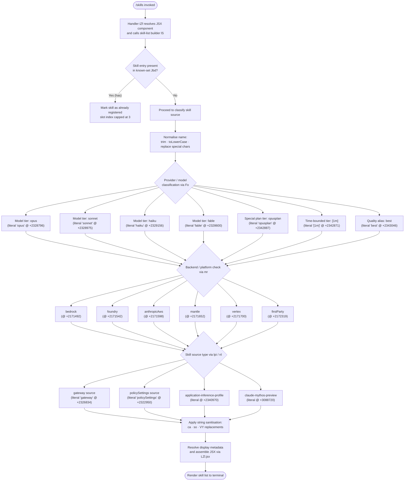

# `/skills`

> Analysis basis: CC v2.1.198 bundle.js (AST extraction + Claude interpretation)
> Minimum version: v2.1.198

---

## Overview

The `/skills` command enumerates and displays the set of available skills (capabilities or tool integrations) that Claude Code can invoke in the current session. It operates as an immediate, local-JSX command: it resolves the available skill set synchronously without sending an agent prompt, then renders a JSX component listing the results. The handler (`iZf`) queries the current skill registry and formats output through the shared model/provider resolution pipeline.

---

## Registration

| Field | Value |
|---|---|
| type | `local-jsx` |
| name | `skills` |
| description | `List available skills` |
| immediate | `true` |
| module_id | `wZl` |
| load_inline | `true` |
| loc_byte | `12842609` |
| loc_byte_end | `12842741` |
| loc_line | `8657` |
| arbor_handler.name | `iZf` |
| arbor_handler.fqn | `claude-2.1.198::iZf` |
| arbor_handler.kind | `AsyncFunction` |
| arbor_handler.resolution_path | `module_id` |
| arbor_handler.n_hits | `0` |

Analysis basis: CC v2.1.198 bundle.js:+12842609

---

## Input Branching

The handler's call graph reveals several branching paths through model/provider classification, skill-source discrimination, and string normalisation, resulting in more than three distinct paths. A Mermaid flowchart is used.



Analysis basis: CC v2.1.198 bundle.js:+12842422 (JSX call), +12842486 (lS call), +2341134 (Jbd.has check), +2341080 (slot cap literal 4)

---

## Behavioral Spec

### Top-level handler — skill list entry point

The Arbor-resolved handler `iZf` is an `AsyncFunction` reached via `module_id → wZl`.

```
async function skillsCommandHandler(context):
    jsxComponent  = resolveJsxView()          // calls LZl.jsx @ +12842422
    skillList     = buildSkillList(context)   // calls lS        @ +12842486
    render(jsxComponent, skillList)
    return
```

Analysis basis: CC v2.1.198 bundle.js:+12842422, +12842486

---

### Skill-list builder — `lS`

`lS` assembles the enumerable skills for the current session. It applies string normalisation (`ca`), checks membership in the known-skills set (`Jbd.has`), performs source-type classification (`so`), and enforces a slot ceiling.

```
function buildSkillList(context):
    results = []
    for each candidate in context.availableSkills:
        normalised = sanitiseString(candidate.name)   // ca @ +2341096
        classified = classifySource(normalised)        // so @ +2341099
        if knownSkillSet.has(normalised):              // Jbd.has @ +2341134
            candidate.slotIndex = min(candidate.slotIndex, 3)  // literal 3 @ +2341147
            mark as registered
        results.push(classified)
    return results
```

Maximum slot index: **3** (bundle.js:+2341147)

Analysis basis: CC v2.1.198 bundle.js:+2341080, +2341096, +2341099, +2341134, +2341147

---

### Model/provider classifier — `Fo`

`Fo` is the central model-tier and provider-classification function called from multiple paths. It trims and lower-cases its input, then dispatches through a series of specialised matchers.

```
function classifyModelAndProvider(raw):
    s = raw.trim().toLowerCase()         // e.trim @ +2342743, t.toLowerCase @ +2342754

    tier = matchModelTier(s)             // hg      @ +2342772
    src  = sanitiseSource(s)            // ca      @ +2342782
    isAllowed = checkAllowList(s)       // Aw      @ +2342800
    origin = resolveOrigin(s)           // ost     @ +2342835
    weight = resolveWeight(s)           // Tw      @ +2342848
    identity = resolveIdentity(s)       // UY      @ +2342858
    shortName = buildShortName(s)       // g$      @ +2342910
    kindTag = resolveKindTag(s)         // KS      @ +2342913
    location = resolveLocation(s)       // L6      @ +2342992
    tierLabel = resolveTierLabel(s)     // Ey      @ +2343030
    capabilities = resolveCapabilities(s) // lpi   @ +2343060
    metadata = resolveMetadata(s)       // Md      @ +2343078
    qualityCheck = checkQuality(s)      // Qle     @ +2343084
    agentSpec = resolveAgentSpec(s)     // A9e     @ +2343092
    lowercasedFull = lowerFull(s)       // jbd     @ +2343137
    providerClass = resolveProviderClass(s) // kw   @ +2343145
    cleaned = s.replace(pattern, repl)  // t.replace @ +2343161

    return assemble(tier, src, isAllowed, origin, weight, identity,
                    shortName, kindTag, location, tierLabel,
                    capabilities, metadata, qualityCheck, agentSpec,
                    lowercasedFull, providerClass, cleaned)
```

Known model tier literals (all within `Fo` sub-calls):

| Tier key | loc_byte |
|---|---|
| `"opus"` | +2328796 |
| `"sonnet"` | +2328975 |
| `"haiku"` | +2329156 |
| `"fable"` | +2328600 |
| `"opusplan"` | +2342887 |
| `"[1m]"` | +2342871 |
| `"best"` | +2343046 |

Analysis basis: CC v2.1.198 bundle.js:+2342743–+2343161

---

### Platform / backend resolver — `mr`

`mr` maps model identifiers to backend provider labels. It is called by `Md` (`+2172133`), `UY` (`+2172312`), and `Uh` (`+2172053`).

```
function resolveBackendProvider(modelId):
    platformStr = getPlatformString(modelId)   // Fm @ +2171424
    normalised  = normaliseString(platformStr) // st @ +2171452

    switch normalised:
        case "bedrock"       -> return PLATFORM.BEDROCK      // +2171492
        case "foundry"       -> return PLATFORM.FOUNDRY      // +2171542
        case "anthropicAws"  -> return PLATFORM.ANTHROPIC_AWS // +2171598
        case "mantle"        -> return PLATFORM.MANTLE        // +2171652
        case "vertex"        -> return PLATFORM.VERTEX        // +2171700
        case "firstParty"    -> return PLATFORM.FIRST_PARTY   // +2172319
        default              -> return PLATFORM.UNKNOWN
```

Analysis basis: CC v2.1.198 bundle.js:+2171424, +2171452, +2171492–+2172319

---

### Capability / skill-source resolver — `lpi` and `nl`

`lpi` resolves per-skill capability metadata by delegating to `nl` (the skill-set normaliser) and `ost` (origin resolver), then calls `Ey` for tier labels.

```
function resolveCapabilities(skillEntry):
    metadata   = resolveSkillMetadata(skillEntry)  // S_e   @ +2326419
    origin     = resolveOrigin(skillEntry)         // ost   @ +2326432
    skillNorm  = normaliseSkillSet(skillEntry)     // nl    @ +2326468
    tierLabel  = resolveTierLabel(skillEntry)      // Ey    @ +2326506
    return combine(metadata, origin, skillNorm, tierLabel)

function normaliseSkillSet(entry):
    // nl @ +2322520 – extensive normalisation:
    // reads ePt, tPt markers; calls mne, mV, Qo helpers;
    // maps over sub-entries (r.map @ +2322686);
    // sanitises each (ca @ +2322697, l.trim @ +2322700, e.trim @ +2322730);
    // checks inclusion (o.includes @ +2322757);
    // applies allow-list (Aw @ +2322811);
    // resolves gateway/policySettings/inline-profile checks;
    // literal "gateway"        @ +2326834
    // literal "policySettings" @ +2322950
    cleaned = []
    for each item in entry.items:
        t = sanitise(item).trim()
        if not isExcluded(t) and isAllowed(t):
            classify(t)  // gateway, policySettings, etc.
            cleaned.push(t)
    return cleaned
```

Analysis basis: CC v2.1.198 bundle.js:+2326419, +2326432, +2326468, +2326506, +2322520–+2323488

---

### Source-type classifier — `so`

`so` examines a skill string to determine whether it uses an inference profile or a special preview model.

```
function classifySource(s):
    vot   = getVendorOriginTag(s)         // vot    @ +2340927
    p_    = getPrimaryFlag(s)             // p_     @ +2340950
    isProfile = s.includes(
        "application-inference-profile"   // literal @ +2340970
    )
    if isProfile:
        return SOURCE.INFERENCE_PROFILE
    ext   = getExtension(s)              // _xt    @ +2341010
    quota = getQuota(s)                  // Qu     @ +2341014
    return assemble(vot, p_, ext, quota)
```

Analysis basis: CC v2.1.198 bundle.js:+2340927–+2341014

---

### Provider class resolver — `kw`

`kw` resolves the outermost provider-class label, including the `"claude-mythos-preview"` experimental model token.

```
function resolveProviderClass(s):
    tier    = matchModelTier(s)       // b_e    @ +3088650  (literal 1 @ +3088606)
    source  = classifySource(s)       // so     @ +3088671
    cleaned = sanitiseString(s)       // ca     @ +3088674
    key     = resolveKey(s)           // KP     @ +3088683
    if s contains "claude-mythos-preview":  // literal @ +3088720
        label = PROVIDER.MYTHOS_PREVIEW
    display = resolveDisplay(s)       // Uh     @ +3088759
    budget  = resolveBudget(s)        // fu     @ +3088786
    extra   = resolveExtra(s)         // k$d    @ +3088841
    return assemble(tier, source, cleaned, key, label, display, budget, extra)
```

Analysis basis: CC v2.1.198 bundle.js:+3088650–+3088841

---

### String normalisation utilities

Several small string helpers are used throughout the pipeline:

| Utility | Operation | loc_byte |
|---|---|---|
| `ca` (sanitise) | `e.replace(pattern, replacement)` | +2170748 |
| `Aw` (allow-list) | `f_e.includes(value)` | +2170710 |
| `VY` (clean) | `e.replace(pattern, replacement)` | +2344105 |
| `g$` (short name) | `e.replace(pattern, replacement)` | +2330797 |
| `jbd` (lowercase) | `e.toLowerCase()` | +2328232 |
| `st` (normalise) | `String(value)` · booleans `"yes"`/`"on"` | +29676, +29725, +29731 |

Analysis basis: CC v2.1.198 bundle.js:+2170710, +2170748, +2330797, +2344105, +29676

---

## State & Side Effects

| Item | Detail |
|---|---|
| Telemetry | None detected in depth-2 traversal (`telemetry: []`) |
| Hook registration | None observed in call graph |
| appState changes | None; command is `immediate: true` and read-only |
| Sound | None observed |
| JSX render | Renders via `LZl.jsx` component (bundle.js:+12842422) |
| Known-skill set | Reads `Jbd` (set membership check, bundle.js:+2341134); does not mutate |
| Slot index cap | Clamps registered-skill slot to maximum **3** (bundle.js:+2341147) |
| String allocations | Multiple `replace`/`trim`/`toLowerCase` calls; all ephemeral |

---

## Version History

| Version | Change |
|---|---|
| v2.1.198 | Initial analysis |

---

## Common Mistakes

1. **Expecting agent interaction**: `/skills` is `immediate: true` and `local-jsx` — it does not invoke the AI agent or send any prompt. Results are computed synchronously from the current session state.
2. **Assuming telemetry is emitted**: No `tengu_*` events were found in the depth-2 traversal. Do not rely on analytics signals to track `/skills` invocations.
3. **Confusing slot index with count**: The slot cap of **3** (literal at bundle.js:+2341147) is an internal registration index ceiling, not the maximum number of skills displayed.
4. **Treating `"claude-mythos-preview"` as stable**: This string literal (bundle.js:+3088720) appears inside the provider-class resolver and may represent an experimental or internal model identifier; do not rely on it being user-visible or stable across versions.
5. **Misidentifying the handler**: The Arbor-resolved handler is `iZf` (resolution path: `module_id → wZl`). The call graph's synthetic `__handler_skills` entry is BFS bookkeeping only — `iZf` is the real entry point.

---

## Appendix — Identifier Mapping

> For bundle debugging only. Identifiers change across versions.

| Identifier | Role |
|---|---|
| `iZf` | Top-level `AsyncFunction` handler for `/skills` (Arbor FQN: `claude-2.1.198::iZf`) |
| `lS` | Skill-list builder; applies normalisation, membership check, source classification |
| `Fo` | Central model/provider classifier; dispatches to all sub-resolvers |
| `hg` | Model-tier matcher (first pass) |
| `b_e` | Model-tier matcher (second pass, used by `kw`) |
| `ca` | String sanitiser (`e.replace`) |
| `Aw` | Allow-list membership checker (`f_e.includes`) |
| `ost` | Origin resolver for skill entries |
| `I6r` | Sub-resolver within `ost` |
| `Tw` | Weight/priority resolver |
| `UY` | Identity resolver (calls `mr`, `fu`) |
| `VY` | String cleaner (`e.replace`) |
| `g$` | Short-name builder (`e.replace`) |
| `KS` | Kind-tag resolver |
| `VIn` | Sub-resolver within `KS` |
| `L6` | Location resolver |
| `w6r` | Sub-resolver within `L6` |
| `Ey` | Tier-label resolver |
| `pxe` | Sub-resolver within `Ey` |
| `lpi` | Capability/skill-source resolver |
| `S_e` | Skill metadata resolver (calls `mr`, `fu`, `E_e`, `y_e`) |
| `nl` | Skill-set normaliser (extensive; maps, trims, classifies) |
| `Md` | Metadata resolver (calls `mr`) |
| `mr` | Backend/platform resolver (bedrock, foundry, anthropicAws, mantle, vertex, firstParty) |
| `Qle` | Quality checker (`Qbd.includes`) |
| `A9e` | Agent-spec resolver (calls `st`) |
| `st` | String normaliser (wraps `String()`; handles `"yes"`/`"on"` booleans) |
| `jbd` | Full lowercase resolver (`e.toLowerCase`) |
| `kw` | Provider-class resolver (includes mythos-preview handling) |
| `so` | Source-type classifier (inference-profile detection) |
| `KP` | Key resolver (calls `Zyd`) |
| `Uh` | Display metadata resolver (calls `UOt`, `sEd`, `mr`, `sV`) |
| `fu` | Budget/cost resolver (calls `sTn`) |
| `k$d` | Extra/auxiliary resolver within `kw` |
| `Fm` | Platform string extractor (called by `mr`) |
| `rp` | Shared resolution primitive (called by `I6r`, `VIn`, `w6r`, `pxe`) |
| `KIn` | Shared resolution primitive (called by `I6r`, `VIn`, `w6r`, `pxe`) |
| `ePt` | Entry-point marker read by `nl` |
| `tPt` | Terminal-point marker read by `nl` |
| `mne` | Helper within `nl` |
| `mV` | Helper within `nl` |
| `Qo` | Helper within `nl` |
| `c$` | Helper within `nl` |
| `GIn` | Helper within `nl` |
| `ipi` | Helper within `nl` |
| `Hn` | Helper within `nl` |
| `vot` | Vendor-origin tag extractor (used by `so`, `nl`) |
| `spi` | Helper within `nl` |
| `Bbd` | Helper within `nl` |
| `A1t` | Helper within `nl` |
| `Gbd` | Helper within `nl` |
| `E_e` | Helper within `S_e` |
| `y_e` | Helper within `S_e` |
| `p_` | Primary-flag extractor (used by `so`) |
| `_xt` | Extension resolver (used by `so`) |
| `Qu` | Quota resolver (used by `so`) |
| `Zyd` | Sub-resolver called by `KP` |
| `UOt` | Sub-resolver called by `Uh` |
| `sEd` | Sub-resolver called by `Uh` |
| `sV` | Sub-resolver called by `Uh` |
| `sTn` | Sub-resolver called by `fu` |
| `LZl` | JSX view component rendered by `iZf` |
| `Jbd` | Known-skill set (Set; membership checked via `.has`) |
| `f_e` | Allow-list array (checked via `.includes` in `Aw`) |
| `Qbd` | Quality-check list (checked via `.includes` in `Qle`) |

---

Note: index built via Arbor fallback; some signals (telemetry, literals) may be missing — see arbor-fallback.js.