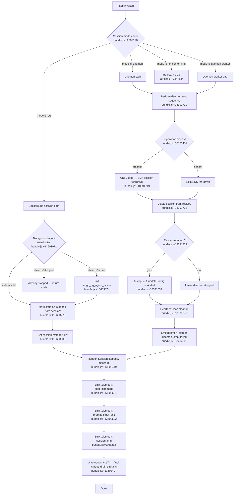

# `/stop`

> Analysis basis: CC v2.1.198 bundle.js (AST extraction + Claude interpretation)
> Minimum version: v2.1.198

---

## Overview

The `/stop` command terminates the currently running background session while intentionally preserving both the conversation transcript and the associated git worktree. It is a `local-jsx` command that is executed immediately (`immediate: true`), meaning it bypasses the normal prompt-processing pipeline and directly invokes an async handler (`Gum`) that orchestrates daemon teardown, session-state transitions, and UI cleanup.

---

## Registration

| Field | Value |
|---|---|
| type | `local-jsx` |
| name | `stop` |
| description | `Stop this background session; transcript and worktree are kept` |
| immediate | `true` |
| module_id | `Spc` |
| load_inline | `true` |
| loc_byte | `13603948` |
| loc_byte_end | `13604132` |
| loc_line | `9374` |
| arbor_handler.name | `Gum` |
| arbor_handler.fqn | `claude-2.1.198::Gum` |
| arbor_handler.kind | `AsyncFunction` |
| arbor_handler.resolution_path | `module_id` |
| arbor_handler.n_hits | `0` |

Analysis basis: CC v2.1.198 bundle.js:+13603948

---

## Input Branching

The command follows more than three distinct execution paths depending on session mode, daemon availability, and background-agent state. A Mermaid flowchart is used to capture the branching structure.



---

## Behavioral Spec

### Main Handler — `Gum` (AsyncFunction)

The top-level handler resolved by Arbor via the `module_id` path (`Spc` → `Gum`). It is the sole entry point for `/stop`.

```
async function stopCommandHandler(context):
    sessionMode = getSessionMode(context)          // checks 'bg', 'daemon', 'daemon-worker'
    if sessionMode is nonconforming:
        return early                               // bundle.js:+2347534

    emitTelemetry("stop_command")                 // bundle.js:+13603681
    stringArg = normalizeStopArg(context)         // bundle.js:+13603667, uses e / t.replace

    backgroundAgentResult = runBackgroundAgentStop(context)  // spr, bundle.js:+13603677
    await backgroundAgentResult

    uiTeardown(context)                           // Ti, bundle.js:+13603497
    emitTelemetry("prompt_input_exit")            // bundle.js:+13603502
    emitTelemetry("session_end")                  // bundle.js:+6896262
```

Analysis basis: CC v2.1.198 bundle.js:+13603948

---

### Sub-feature: Background Agent Stop Orchestration (`spr`)

`spr` is the primary coordinator for stopping a background session. It calls into several helpers to read state, validate mode, update state, clean up file artifacts, and render the final UI message.

```
async function backgroundAgentStopOrchestrator(context):
    // State and mode validation
    currentState = readAgentState(context)        // V, bundle.js:+13603072
    modeCheck = validateSessionMode(context)      // Ke + Pe, bundle.js:+13603106, +13603124
    modeStr = getSessionModeString(context)       // yr, bundle.js:+13603143

    if modeStr is 'nonconforming':
        emitTelemetry("tengu_bg_agent_action")    // bundle.js:+13603074
        return

    // Toolkit and daemon utilities
    toolkitRef = getToolkit(context)              // kt, bundle.js:+13603146
    daemonManager = getDaemonManager(context)     // Bum, bundle.js:+13603160
    sessionLister = getSessionLister(context)     // li, bundle.js:+13603169

    // Background session file / state management
    bgState = readOrUpdateBgState(context)        // Zi, bundle.js:+13603217
    bgStateResult = getSessionStatusMap(context)  // Jg, bundle.js:+13603230
    sessionIdGen = generateSessionId(context)     // ip, bundle.js:+13603242

    // Mark session as stopped
    bgState.status = "stopped from session"       // bundle.js:+13603276
    bgState.mode   = "idle"                       // bundle.js:+13603305

    // Daemon-specific cleanup
    daemonCleanup(context)                        // dCn, bundle.js:+13603418

    // Render confirmation
    renderMessage("Session stopped.")             // Tme, bundle.js:+13603445, literal bundle.js:+13603449

    emitTelemetry("tengu_bg_agent_action")        // bundle.js:+13603074
```

Analysis basis: CC v2.1.198 bundle.js:+13603677

---

### Sub-feature: Background State File Manager (`Zi`)

`Zi` manages a persistent state file for the background session (reads, writes, and clears state entries).

```
async function bgStateFileManager(sessionId, stateDir):
    statePath = pathJoin(stateDir, sessionId)     // wy.join, bundle.js:+4354329

    // Parallel lstat to check for regular files
    stats = await Promise.all(lstatCalls)         // bundle.js:+4354416

    if not stats[0].isFile():
        logWarning("not a regular file")          // bundle.js:+4354709, +4354739
        return

    // Sort by 'order' / 'stateOrder' keys
    sorted = sortByField(entries, "order")        // bundle.js:+4354356
    sorted = sortByField(entries, "stateOrder")   // bundle.js:+4354377

    // Get current state from registry
    existing = registry.get(sessionId)            // $re.get, bundle.js:+4354570

    // Build display representation
    label = pathBasename(statePath)               // wy.basename, bundle.js:+4354635
    registry.set(sessionId, newState)             // $re.set, bundle.js:+4354748

    // Read state file as UTF-8 JSON
    raw = await fs.readFile(statePath, "utf-8")   // bundle.js:+4355353, +4355367
    parsed = JSON.parse(raw)                      // Gt, bundle.js:+4355523

    // Process numeric fields, own-property entries
    for entry of Object.entries(parsed):          // bundle.js:+4355837
        if Object.hasOwn(parsed, entry.key):      // bundle.js:+4355870
            value = Number(entry.value)           // bundle.js:+4355743
            if Number.isFinite(value):            // bundle.js:+4355935
                accumulate(value)

    result = Object.fromEntries(processed)        // bundle.js:+4355899

    // On stop: remove from registries and clear
    registry.delete(sessionId)                    // $re.delete, bundle.js:+4354957
    secondaryRegistry.delete(sessionId)           // sRe.delete, bundle.js:+4354971
    registry.clear()                              // $re.clear, bundle.js:+4356040

    emitTelemetry("tengu_bg_state_read_transient")// bundle.js:+4355153
    return result
```

Analysis basis: CC v2.1.198 bundle.js:+13603217

---

### Sub-feature: Session Status Map (`Jg` / `U0`)

Reads and aggregates per-session status objects, mapping terminal states to human-readable keys.

```
function getSessionStatusMap(sessions):
    for session of sessions:
        status = session.status                   // U0, bundle.js:+4363212
        // Terminal status strings observed:
        // "done", "success", "failure", "stopped", "active"
        //  bundle.js:+4363054, +4363067, +4363099, +4363116, +4363235
        accumulate(status)
    return statusMap
```

Analysis basis: CC v2.1.198 bundle.js:+13603230

---

### Sub-feature: Session ID Generator (`ip` / `Uf`)

Generates a random session identifier, writes it to disk, and manages session credential files.

```
async function generateAndPersistSessionId(workDir):
    randomBytes = crypto.randomBytes(4)           // UDr.randomBytes, bundle.js:+1069697
                                                  // length 4, bundle.js:+1069713
    idHex = randomBytes.toString("hex")           // bundle.js:+1069725
    content = encodeAsUtf8(idHex)                 // bundle.js:+1069771

    await fs.writeFile(idPath, content)           // rY.writeFile, bundle.js:+1069744
    buildCredentialBundle(content)                // JBe, bundle.js:+1069797

    if credentialSet.has(idHex):                  // THe.has, bundle.js:+1069842
        await fs.copyFile(src, dst)               // rY.copyFile, bundle.js:+1069867
        await fs.chmod(dst, 0o600)                // rY.chmod, bundle.js:+1069901 (octal 384 decimal, bundle.js:+4353916)

    if secondarySet.has(idHex):                   // Ews.has, bundle.js:+1069941
        await fs.unlink(oldPath)                  // rY.unlink, bundle.js:+1069966

    pathJoin(workDir, idHex)                      // wy.join, bundle.js:+4353888
    formatted = formatSessionId(idHex)            // Me, bundle.js:+4353903
    deleteFromRegistry(idHex)                     // mE / $re.delete, bundle.js:+4354288
```

Analysis basis: CC v2.1.198 bundle.js:+13603242

---

### Sub-feature: Daemon Stop Sequence (`d` — session manager)

Executed for `daemon` and `daemon-worker` session modes. Stops the SDK session, removes it from the in-memory registry, optionally restarts the supervisor, and schedules a heartbeat cleanup.

```
async function daemonSessionStop(sessionId, registry):
    // Retrieve session file info
    fileInfo = await statFile(sessionId)          // SXe, bundle.js:+18391426
    if fileInfo.errorCode == "ENOENT":            // bundle.js:+13523493
        reject(error)
    if fileInfo.size > 1048576:                   // bundle.js:+13523553
        truncate / handle large file

    // Write supervisor label
    writeSupervisorTag("supervisor")              // r.write, bundle.js:+18391443
                                                  // literal bundle.js:+18391451

    // Calculate column widths
    maxWidth = Math.max(...columnWidths)          // rdc / Math.max, bundle.js:+13524729
    paddedLine = line.padEnd(maxWidth)            // P_, bundle.js:+13524928

    // Stop the SDK-level session
    session = registry.get(sessionId)             // i.get, bundle.js:+18391699
    await session.stop()                          // E.stop, bundle.js:+18391719
    // E.stop internally: resolves SDK connection states
    // "sdk", "connected", "failed" — bundle.js:+17907121, +17907257, +17907444

    registry.delete(sessionId)                    // i.delete, bundle.js:+18391728

    // Supervisor lifecycle
    supervisor = getSupervisor(sessionId)         // A, bundle.js:+18391839
    await supervisor.stop()                       // A.stop, bundle.js:+18391839
    supervisor.updateConfig(newConfig)            // A.updateConfig, bundle.js:+18391848
    await supervisor.start()                      // A.start, bundle.js:+18391866

    // Heartbeat cleanup
    heartbeat = getHeartbeat(sessionId)           // lQc / zce, bundle.js:+18391968
                                                  // literal "heartbeat", bundle.js:+18390670
    registry.set(sessionId, updatedEntry)         // i.set, bundle.js:+18392013
    await internalProcess.start()                 // I.start, bundle.js:+18392024

    emitTelemetry("tengu_daemon_config_reload")   // bundle.js:+18392244
```

Analysis basis: CC v2.1.198 bundle.js:+18391719

---

### Sub-feature: Daemon Control Messages (`u` — daemon_stop signals)

Dispatches `daemon_stop` / `daemon_stop_failed` control messages to the daemon process via the messaging layer.

```
async function sendDaemonStopSignal(daemonHandle):
    try:
        result = await daemonHandle.send("daemon_stop")  // xe / V + Pe, bundle.js:+18414803
                                                          // literal bundle.js:+18414806
        emitTelemetry("tengu_feature_ok")                // bundle.js:+1039573
    catch error:
        emitTelemetry("tengu_feature_bad")               // bundle.js:+1039640
        log("daemon_stop_failed")                        // literal bundle.js:+18414843

    register("firstParty", handler)                      // M$, bundle.js:+18414878
                                                         // literal bundle.js:+3396190
    emitTelemetry("tengu_daemon_control")                // bundle.js:+18414881

    if remainingSessionCount == 0:
        exitCode = await waitForExit(500ms timeout)      // l8 / process.exit, bundle.js:+18409979
                                                         // timeout literal bundle.js:+18409940
```

Analysis basis: CC v2.1.198 bundle.js:+18414803

---

### Sub-feature: UI Teardown (`Ti`)

Manages the terminal UI shutdown sequence after the stop operation completes: flushing output, draining streams, clearing timeouts, and collecting session-end metrics.

```
async function uiTeardown(context):
    await Promise.resolve()                       // bundle.js:+6895745
    renderFinalFrame()                            // Fje / Ego, bundle.js:+6895813, +6895819

    // Render final output line with escape codes
    // ESC-7 (save cursor) / ESC-8 (restore cursor) used for flicker-free rendering
    // bundle.js:+3958028, +3958039
    writeSync(stdout, finalContent)               // nAe.writeSync, bundle.js:+6896336

    // Graceful shutdown timer
    maxWait = Math.max(5000, 3500)               // bundle.js:+6895842, +6895849
    timer = setTimeout(teardownCallback, maxWait)
    timer.unref()                                 // IDe.unref, bundle.js:+6895858

    // Drain pending I/O
    await drainStream(stdout)                     // TZe / sus.drain, bundle.js:+6895938
    await drainStream(stderr)                     // Xln / ius.drain, bundle.js:+6896435

    // Race: graceful shutdown vs 2000ms hard timeout
    result = await Promise.race([
        gracefulShutdown(),                       // eRa, bundle.js:+6896087
        hardTimeout(2000)                         // bundle.js:+6896027
    ])
    clearTimeout(timer)                           // bundle.js:+6896039

    // Abort signal for stragglers
    AbortSignal.timeout(remaining)                // bundle.js:+6896150

    // Persist startup profiling data if enabled
    persistPerfData()                             // k0t / hfs, bundle.js:+6896186
                                                  // literal "Startup profiling report:", bundle.js:+228898

    // Scroll summary and cache eviction
    emitTelemetry("tengu_scroll_summary")         // bundle.js:+6895258
    emitTelemetry("tengu_cache_eviction_hint")    // bundle.js:+6896224

    // Process session-end hooks
    settledHooks = await Promise.allSettled(      // eRa, LRa
        Array.from(cleanupHandlers)               // bundle.js:+6879644, +13813545
    )

    // Fullscreen mode restoration
    // Detects tmux -CC (iTerm2) or Windows-over-SSH (ConPTY) and skips fullscreen
    // bundle.js:+3609689, +3609875
    restoreTerminalMode(context)                  // Ws / t4n, bundle.js:+6895302

    // Final screen mode: "fullscreen" or "default"
    // bundle.js:+3610023, +3610049
    writeSessionEnd()                             // Bje / J9n, bundle.js:+6896310

    emitTelemetry("tengu_pewter_brook")           // bundle.js:+3610114
    emitTelemetry("session_end")                  // bundle.js:+6896262

    // Kill any remaining child processes
    if processStillRunning:
        process.kill(pid, "SIGKILL")              // Sgo, bundle.js:+6893426
                                                  // literal bundle.js:+6893451
```

Analysis basis: CC v2.1.198 bundle.js:+13603497

---

## State & Side Effects

| Item | Detail |
|---|---|
| Telemetry: `tengu_bg_agent_action` | Fired when a background agent is in an active or nonconforming state at stop time (bundle.js:+13603074) |
| Telemetry: `tengu_daemon_config_reload` | Fired after the daemon supervisor is restarted following session stop (bundle.js:+18392244) |
| Telemetry: `tengu_feature_ok` | Fired when the `daemon_stop` control message is delivered successfully (bundle.js:+1039573) |
| Telemetry: `tengu_feature_bad` | Fired when the `daemon_stop` message delivery fails (bundle.js:+1039640) |
| Telemetry: `tengu_daemon_control` | Fired after the daemon control action completes (bundle.js:+18414881) |
| Telemetry: `tengu_bg_state_read_transient` | Fired during background state file reads (bundle.js:+4355153) |
| Telemetry: `tengu_startup_perf` | Fired if startup profiling data is flushed at exit (bundle.js:+230200) |
| Telemetry: `tengu_scroll_summary` | Fired during UI teardown scroll accounting (bundle.js:+6895258) |
| Telemetry: `tengu_pewter_brook` | Fired during terminal mode restoration (bundle.js:+3610114) |
| Telemetry: `tengu_cache_eviction_hint` | Fired as part of cache cleanup at session end (bundle.js:+6896224) |
| Session state change | Session status set to `"stopped from session"` and mode to `"idle"` (bundle.js:+13603276, +13603305) |
| Registry mutations | Session removed from `$re` (primary) and `sRe` (secondary) background-state registries; `$re` is fully cleared on stop (bundle.js:+4354957, +4354971, +4356040) |
| SDK session teardown | `E.stop()` is called, resolving the SDK connection through states `sdk → connected → failed` before closing (bundle.js:+18391719) |
| Supervisor restart | Supervisor (`A`) is stopped, its config updated, and then restarted if the session configuration requires it (bundle.js:+18391839) |
| Credential file cleanup | Session credential files are unlinked from disk during session ID teardown (bundle.js:+1069966) |
| stdout/stderr drain | Both output streams are drained before process exit to avoid truncation (bundle.js:+6895938, +6896435) |
| Child process kill | Any child processes still running after shutdown timeout receive `SIGKILL` (bundle.js:+6893451) |
| Process exit | If no sessions remain after stop, `process.exit` is called (bundle.js:+18409979) |
| Hook registration | `process.on("exit", ...)` registered during session run to handle ungraceful exits (bundle.js:+217669) |
| Fullscreen mode | Terminal fullscreen mode is detected and restored; tmux-CC and Windows-over-SSH suppress fullscreen (bundle.js:+3609689, +3609875) |
| Sound | <!-- TODO: not found in depth-2 traversal; needs --depth 4 --> |

---

## Version History

| Version | Change |
|---|---|
| v2.1.198 | Initial analysis |

---

## Common Mistakes

1. **Expecting the worktree to be deleted**: `/stop` explicitly preserves both the conversation transcript and the git worktree. Use a different mechanism to clean up worktree artifacts.
2. **Using `/stop` in a non-background session**: The handler validates the session mode (`bg`, `daemon`, `daemon-worker`) and exits early for nonconforming sessions (bundle.js:+2347534). The command has no effect in a regular foreground session.
3. **Assuming the process exits immediately**: The teardown sequence races graceful shutdown against a 2000 ms hard timeout and drains I/O streams before exit. Scripted wrappers should wait for the process to actually terminate rather than assuming instant exit.
4. **Conflating `/stop` with a destructive operation**: Because transcripts and worktrees are retained, the session can be inspected or resumed by other means; `/stop` marks the session `stopped from session` / `idle`, not deleted.
5. **Re-invoking `/stop` on an already-stopped session**: The background-agent state machine detects the `stopped` state and returns early without emitting additional telemetry or performing daemon teardown again (bundle.js:+13603116).

---

## Appendix — Identifier Mapping

> For bundle debugging only. Identifiers change across versions.

| Identifier | Role |
|---|---|
| `Gum` | Main async stop command handler (entry point, resolved by Arbor via module_id `Spc`) |
| `spr` | Background agent stop orchestrator (coordinates state transitions, daemon cleanup, UI message) |
| `V` | Agent state reader (reads current background agent state) |
| `Ke` | Session mode validator (first mode check helper) |
| `OQe` | Shared mode-check primitive used by `Ke` and `Pe` |
| `Pe` | Session mode validator (second mode check helper) |
| `yr` | Session mode string resolver |
| `Um` | Mode string helper called by `yr` |
| `kt` | Toolkit / utility reference accessor |
| `sw` | Toolkit helper called by `kt` |
| `Bum` | Daemon manager accessor |
| `li` | Session lister accessor |
| `gxe` | Session list implementation called by `li` |
| `Zi` | Background state file manager (reads/writes/clears session state files) |
| `a` | Spend-limit / billing response handler (called within `Zi`) |
| `tge` | JSON serializer for billing error responses |
| `T` | CLI argument / debug formatter |
| `Hiu` | Authentication/userinfo helper |
| `Me` | Session ID formatter / JSON stringifier |
| `Oc` | CLI argument sanitizer / redactor |
| `YZe` | Option parser helper |
| `biu` | Process runner / subprocess manager |
| `o` | Column-padding output writer |
| `d` | Daemon session stop manager (full daemon teardown sequence) |
| `SXe` | Session file stat helper (checks ENOENT, file size limits) |
| `r` | Supervisor tag writer |
| `rdc` | Column-width calculator for display output |
| `i` | Session registry accessor (get/set/delete/close) |
| `E` | SDK session object (provides `.stop()`) |
| `A` | Supervisor process object (provides `.stop()`, `.updateConfig()`, `.start()`) |
| `lQc` | Heartbeat scheduler / cleanup |
| `I` | Internal process start controller |
| `u` | Daemon control message dispatcher (`daemon_stop` / `daemon_stop_failed`) |
| `xe` | Daemon message sender (success path) |
| `Le` | Daemon message sender (alternate / fallback path) |
| `M$` | First-party handler registration |
| `l8` | Process exit waiter (races `process.exit` against timeout) |
| `mn` | Error code extractor |
| `en` | Error normalizer |
| `gd` | Secondary error code extractor |
| `Gt` | JSON parser wrapper |
| `Jg` | Session status map aggregator |
| `U0` | Per-session status reader |
| `Bre` | Status map builder called by `U0` |
| `ip` | Session ID generator (orchestrates `Uf` + path operations) |
| `Uf` | Random-bytes session ID writer and credential file manager |
| `JBe` | Credential bundle builder |
| `mE` | Registry delete wrapper for session cleanup |
| `dCn` | Daemon-specific additional cleanup helper |
| `Tme` | "Session stopped." message renderer |
| `Ti` | UI teardown orchestrator (flush, drain, timer, fullscreen restore) |
| `Fje` | Final frame renderer (unmount Ink, write sync) |
| `YN` | Post-unmount cleanup helper |
| `cOn` | Escape-sequence cursor save/restore writer |
| `Ego` | Output line writer with escape handling |
| `OL` | Output layer reference |
| `N5` | Node count / line counter |
| `PGt` | Path stat helper (statSync) |
| `Zm` | Encoding/display unit helper |
| `Cpi` | Content post-processor |
| `Sgo` | Forced-exit handler (SIGKILL fallback, `process.kill`) |
| `TZe` | stdout drain helper |
| `eRa` | Graceful cleanup hook runner (`Promise.allSettled`) |
| `LRa` | Secondary cleanup hook runner (`Promise.allSettled`) |
| `k0t` | Startup performance data persister |
| `rvr` | Performance record writer |
| `hfs` | Profiling report file writer |
| `t4n` | Scroll summary / terminal mode chooser |
| `HRa` | Scroll summary sub-helper |
| `gRa` | Token/cost aggregator for session summary |
| `Ws` | Terminal mode selector (fullscreen vs default, tmux/ConPTY detection) |
| `BLt` | Post-teardown barrier |
| `Bje` | Session-end writer |
| `J9n` | Session-end record serializer |
| `XMt` | Auxiliary output helper |
| `Xge` | Auxiliary output helper (secondary) |
| `Xln` | stderr drain helper |

---

Note: index built via Arbor fallback; some signals (telemetry, literals) may be missing — see arbor-fallback.js.