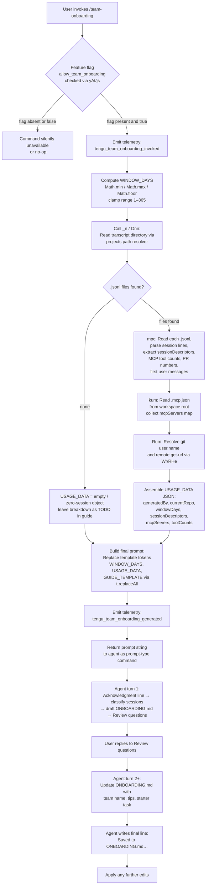

# `/team-onboarding`

> Analysis basis: CC v2.1.198 bundle.js (AST extraction + Claude interpretation)
> Minimum version: v2.1.198

---

## Overview

`/team-onboarding` is a `prompt`-type slash command that analyzes the invoking user's local Claude Code session transcripts over a configurable time window and co-authors a structured `ONBOARDING.md` guide with them. The command reads transcript `.jsonl` files from the local Claude projects directory, derives a work-type breakdown from session descriptors, and sends a 4,539-character system prompt to the agent that drives an interactive, multi-turn authoring loop. The resulting guide is written to `ONBOARDING.md` in the current workspace and is designed to be pasted into Claude Code by new teammates for a guided onboarding tour.

---

## Registration

| Field | Value |
|---|---|
| type | `prompt` |
| name | `team-onboarding` |
| description | `Help teammates ramp on Claude Code with a guide from your usage` |
| isHidden | `false` |
| handler_method | `getPromptForCommand` |
| handler_method_start (loc_byte) | `13601960` |
| handler_method_end (loc_byte) | `13602670` |
| loc_byte | `13601597` |
| loc_byte_end | `13602671` |
| loc_line | `9374` |
| prompt_body.length | `4539` |
| prompt_body.trace | `identifier→l (local→1 ext vars)` |
| arbor_handler.name | `getPromptForCommand` |
| arbor_handler.kind | `Method` |
| arbor_handler.fqn | `claude-2.1.198::getPromptForCommand` |
| arbor_handler.resolution_path | `direct` |
| arbor_handler.n_hits | `2` |
| `handler_method_start` | `13601960` |
| `handler_method_end` | `13602670` |

Analysis basis: CC v2.1.198 bundle.js:+13601597

---

## Input Branching

The handler has more than three distinct logic branches: window-day clamping, transcript scanning (with and without sessions), feature-flag gating, and usage-data assembly. A Mermaid flowchart is used below.



---

## Behavioral Spec

### 1. Feature-Flag Gate

Before any data collection, the handler checks whether the `allow_team_onboarding` feature flag is enabled for the current session context.

```
function checkTeamOnboardingFeatureFlag(sessionContext):
    flagSet = featureFlagResolver(sessionContext, "allow_team_onboarding")
    if not flagSet:
        return COMMAND_UNAVAILABLE
    return PROCEED
```

Analysis basis: CC v2.1.198 bundle.js:+11066858

---

### 2. Window-Day Computation

The handler computes `WINDOW_DAYS` by clamping a raw day count using `Math.min`, `Math.max`, and `Math.floor`. The numeric literals `1` and `365` bound the valid range.

```
function computeWindowDays(rawInput):
    floored = Math.floor(rawInput)
    bounded = Math.max(1, Math.min(365, floored))
    return bounded
```

Maximum window: 365 days (bundle.js:+13602209)
Minimum window: 1 day (bundle.js:+13602206)

Analysis basis: CC v2.1.198 bundle.js:+13602163

---

### 3. Transcript Scanning (mpc / transcriptScanner)

The transcript scanner reads from the local Claude projects directory. It lists the directory asynchronously (`ZIt.readdir`), filters for `.jsonl` files (bundle.js:+13590642), then reads each file in parallel (`Promise.all`, bundle.js:+13590661). The look-back cutoff is 24 hours × 60 minutes per day (literals `24` at +13590527 and `60` at +13590530).

For each transcript file, the scanner:
1. Splits the file content into lines and parses each line as JSONL.
2. Detects session titles, linked PR numbers (via `Cum.exec` at +13591362 and `vum.exec` at +13591418), and first user messages (via `wum.exec` at +13591593).
3. Extracts tool-use counts and MCP invocation counts by scanning for the `"name":"mcp__` prefix string (bundle.js:+13591221) and `"content":[` markers (bundle.js:+13591571).
4. Enforces a soft cap of 10 sessions per file (literal `10`, bundle.js:+13591038).
5. Skips files older than the computed window boundary (timestamp check: `Date.now` at +13590514).

```
function transcriptScanner(projectsDir, windowDays):
    cutoff = Date.now() - windowDays * 24 * 60 * 60 * 1000
    files = await readdir(projectsDir)
    jsonlFiles = files.filter(f => extname(f) == ".jsonl")
    results = await Promise.all(jsonlFiles.map(async f =>
        stat = await stat(join(projectsDir, f))
        if not stat.isFile() or stat.mtimeMs < cutoff:
            return null
        raw = await readFile(join(projectsDir, f))
        return parseTranscriptFile(raw, cutoff)
    ))
    return results.filter(r => r != null)
```

Analysis basis: CC v2.1.198 bundle.js:+13590514

---

### 4. MCP Server Config Reader (kum / mcpConfigReader)

The config reader looks for `.mcp.json` in the workspace root (bundle.js:+13592672) and parses it as JSON (`Gt` / `JSON.parse`). If the file is absent or malformed, it returns an empty map. The `mcpServers` key (bundle.js:+13592728) is extracted from the parsed object.

```
function mcpConfigReader(workspaceRoot):
    path = join(workspaceRoot, ".mcp.json")
    try:
        raw = await readFile(path, "utf8")   // bundle.js:+13592685
        parsed = JSON.parse(raw)
        return parsed.mcpServers ?? {}
    catch:
        return {}
```

Analysis basis: CC v2.1.198 bundle.js:+13592648

---

### 5. Git Identity and Remote Resolver (Rum / Wr / RHe)

The handler shells out to `git` to resolve `user.name` (bundle.js:+13593311) and `remote get-url` (bundle.js:+13593376) for the current repo. The raw output is trimmed and matched against a pattern via `RHe`. The `opr.basename` call (bundle.js:+13593483) extracts the repository name from the remote URL.

```
function resolveGitContext(cwd):
    nameResult = execGit(["config", "user.name"], cwd)
    remoteResult = execGit(["remote", "get-url", "origin"], cwd)
    gitUserName = trim(nameResult.stdout)
    remoteUrl = trim(remoteResult.stdout)
    repoName = basename(normalizeRemoteUrl(remoteUrl))
    return { generatedBy: gitUserName, currentRepo: repoName }
```

Analysis basis: CC v2.1.198 bundle.js:+13593292

---

### 6. Prompt Template Assembly (getPromptForCommand)

The handler assembles the final prompt by substituting three template tokens into the 4,539-character prompt body using `t.replaceAll` (bundle.js:+13602407):

| Token | Substituted value |
|---|---|
| `{{WINDOW_DAYS}}` | Computed window day count (bundle.js:+13602420) |
| `{{USAGE_DATA}}` | JSON-serialised usage data object (bundle.js:+13602495) |
| `{{GUIDE_TEMPLATE}}` | Embedded guide template string (bundle.js:+13602460) |

The `String(...)` call (bundle.js:+13602438) coerces values before substitution. The final prompt is returned as a `text`-type content block (literal `"text"` at +13602654).

```
function getPromptForCommand(context):
    windowDays = computeWindowDays(context.rawDays)
    transcripts = await transcriptScanner(context.projectsDir, windowDays)
    mcpServers = await mcpConfigReader(context.workspaceRoot)
    gitCtx = resolveGitContext(context.cwd)
    usageData = assembleUsageData(transcripts, mcpServers, gitCtx, windowDays)
    prompt = PROMPT_BODY
        .replaceAll("{{WINDOW_DAYS}}", String(windowDays))
        .replaceAll("{{USAGE_DATA}}", JSON.stringify(usageData))
        .replaceAll("{{GUIDE_TEMPLATE}}", GUIDE_TEMPLATE)
    emitTelemetry("tengu_team_onboarding_generated")
    return { type: "text", content: prompt }
```

Analysis basis: CC v2.1.198 bundle.js:+13601960

---

### 7. Agent Turn 1 — Prompt Execution

The agent prompt (4,539 chars) instructs the model to perform the following steps in strict order:

**Step 1 — Immediate acknowledgment.** The very first visible output must be a block-quoted acknowledgment line referencing the `{{WINDOW_DAYS}}` value. The prompt explicitly forbids any extended thinking, tool calls, or classification before this line is emitted. This is framed as a UX requirement: the guide creator should not see a blank screen.

**Step 2 — Work-type classification.** The model reads the `sessionDescriptors` array in the injected `USAGE_DATA` and classifies each session into one of seven task types: `build_feature`, `debug_fix`, `improve_quality`, `analyze_data`, `plan_design`, `prototype`, or `write_docs`. Classification rules include:
- Review sessions map to the reviewed artifact type (e.g. code review → `improve_quality`).
- New categories should only be invented when no existing type applies.
- The top 3–5 categories are selected with rough percentage estimates.
- If sessions are near zero, the breakdown is left as a `TODO` placeholder.
- Display names use title case with spaces (e.g. "Build Feature").

**Step 3 — Data gathering.** The model uses `currentRepo` from `USAGE_DATA`, inspects sibling workspace directories for additional repos, and uses `mcpServers` entries (name and `urlOrigin`) to infer access instructions. The "Team Tips" and "Get Started" guide sections are left as `TODO` placeholders pending the Review questions.

**Step 4 — Guide authoring.** The model writes `ONBOARDING.md` using the injected `{{GUIDE_TEMPLATE}}`. Real numeric values from `USAGE_DATA` are substituted; ASCII bar charts use `█` (filled) and `░` (empty) at 20 characters wide. The `generatedBy` field provides the author name (omitted if missing). An HTML comment at the bottom of the template is preserved verbatim.

**Step 5 — Render and Review.** The guide is rendered inside a fenced code block. A `---` horizontal rule and a `**Review**` heading visually separate the guide from three numbered follow-up questions covering: team name, starter task, and team tips.

Analysis basis: CC v2.1.198 bundle.js:+13601960 – +13602670

---

### 8. Agent Turn 2+ — Revision Loop

After the user answers the Review questions, the agent updates `ONBOARDING.md` with:
- The confirmed or provided team name.
- Any team tips not already in `CLAUDE.md`.
- An optional starter task (ticket or doc link).

The agent then closes with an exact, unnumbered, unparaphrased closing line referencing `ONBOARDING.md`. Further edits submitted by the user are applied to the file without starting a new guide.

```
function handleRevisionTurn(userReply, currentGuide):
    updatedGuide = applyRevisions(currentGuide, userReply)
    writeFile("ONBOARDING.md", updatedGuide)
    print('Saved to `ONBOARDING.md`. Drop it in your team docs and channels...')
    loop:
        nextEdit = awaitUserEdit()
        if nextEdit is null: break
        applyEdits("ONBOARDING.md", nextEdit)
```

Analysis basis: CC v2.1.198 bundle.js:+13601960

---

## State & Side Effects

| Item | Detail |
|---|---|
| Telemetry — invocation | `tengu_team_onboarding_invoked` (bundle.js:+13602220) emitted at command start |
| Telemetry — generation | `tengu_team_onboarding_generated` (bundle.js:+13602539) emitted after prompt assembly |
| Telemetry — prompt dispatch | `tengu_flint_harbor_prompt` (bundle.js:+13601997) emitted by prompt-type command infrastructure |
| Telemetry — feature share | `tengu_flint_harbor_share` (bundle.js:+11066920) emitted via `yAt` / feature flag subsystem |
| Telemetry — feature flag OK | `tengu_feature_ok` (bundle.js:+1039573) emitted when feature flag check passes |
| Telemetry — feature flag fail | `tengu_feature_bad` (bundle.js:+1039640) emitted when feature flag check fails |
| Telemetry — config events | `tengu_config_lock_contention`, `tengu_config_stale_write`, `tengu_config_parse_error`, `tengu_config_auto_repaired`, `tengu_config_auth_loss_prevented`, `tengu_config_fallback_write` emitted by config subsystem during transcript/config reads |
| Telemetry — daemon / bg | `tengu_bg_dispatch_sigkill_escalate`, `tengu_bg_dispatch_low_mem`, `tengu_bg_spare_enable`, `tengu_bg_spare_claim`, `tengu_bg_spare_claim_fail`, `tengu_daemon_config_reload`, `tengu_daemon_control` emitted by background session infrastructure |
| File system reads | Transcript `.jsonl` files under the Claude projects directory; `.mcp.json` in workspace root |
| File system writes | `ONBOARDING.md` written to the current workspace root by the agent |
| Git subprocess | `git config user.name` and `git remote get-url origin` executed via `Wr` / `execFileNoThrow` |
| Feature flag dependency | `allow_team_onboarding` flag must be enabled; checked via `yAt` → `js` subsystem (bundle.js:+11066858) |
| appState changes | Config lock acquisition recorded via `SCt` / `Onn`; no direct UI state mutations observed in depth-2 traversal |
| Sound | <!-- TODO: not found in depth-2 traversal; needs --depth 4 --> |
| Hook registration | <!-- TODO: not found in depth-2 traversal; needs --depth 4 --> |

---

## Version History

| Version | Change |
|---|---|
| v2.1.198 | Initial analysis — command introduced with 4,539-char prompt, feature-flag gate, 1–365 day window, transcript scanner, `.mcp.json` reader, git identity resolver, and multi-turn guide authoring loop |

---

## Common Mistakes

1. **Invoking without the feature flag enabled.** If `allow_team_onboarding` is not set for the account or team plan, the command silently fails the gate check (telemetry: `tengu_feature_bad`). Ensure the flag is active before expecting output.

2. **Running outside a git repository.** The git identity and remote URL resolution steps will fail or return empty strings, which causes the `generatedBy` and `currentRepo` fields to be omitted from the guide. Run the command from the root of a repository with a configured `origin` remote.

3. **No transcript history.** If the local Claude projects directory contains no `.jsonl` files within the selected window, `sessionDescriptors` will be empty and the work-type breakdown will be left as a `TODO` placeholder in the generated guide. This is expected behavior, not an error.

4. **Specifying a window outside 1–365 days.** The handler clamps any raw value to the `[1, 365]` range using `Math.min`/`Math.max`/`Math.floor`. Values of `0` or negative numbers will resolve to `1`; values above `365` will resolve to `365`.

5. **Skipping the Review questions.** The guide intentionally leaves the "Team Tips" and "Get Started" sections as `TODO` after turn 1. These are filled in only after the user answers the three Review questions. Ending the conversation after turn 1 produces an incomplete guide.

6. **Expecting an instant complete guide.** The command is explicitly designed for a multi-turn co-authoring flow. The agent produces a draft in turn 1 and finalizes it after the Review exchange; treating the turn-1 draft as the finished artifact will yield a guide missing the team name, tips, and starter task.

7. **Absent `.mcp.json`.** If no `.mcp.json` exists in the workspace root, the MCP server setup section of the guide will be empty. Teams using MCP servers should ensure the config file is present and committed before running the command.

---

## Appendix — Identifier Mapping

> For bundle debugging only. Identifiers change across versions.

| Identifier | Role |
|---|---|
| `__handler_team-onboarding` | Synthetic BFS entry point for the command handler (not a real bundle symbol) |
| `nt` | Prompt-type command dispatcher / runner |
| `n2t` | Prompt runner sub-helper A |
| `r2t` | Prompt runner sub-helper B |
| `tG` | Telemetry event emitter wrapper |
| `eG` | Core telemetry event builder |
| `Z3` | Telemetry payload assembler |
| `aMn` | Command invocation deduplicator / session tracker |
| `FJr` | Session initializer (creates session ID, emits initial events) |
| `V5e` | Session state writer |
| `z6` | Random hex token generator (uses `crypto.randomBytes`, 32 bytes) |
| `Me` | JSON stringifier wrapper |
| `nGd` | Session metadata emitter |
| `qJr` | Command execution orchestrator |
| `zRi` | Rate-limit / retry helper |
| `Lr` | HTTP client / request executor |
| `E9i` | Response parser |
| `NP` | Request deduplication set checker |
| `Gh` | Error formatter for command execution |
| `Dt` | Timestamped API request builder |
| `V` | Logger / verbose output helper |
| `_n` | Usage data collection entry point (reads transcripts + config) |
| `Onn` | Config-locked transcript and project directory reader |
| `zt` | Config file path resolver |
| `SCt` | Config read-with-lock implementation |
| `Gt` | JSON.parse wrapper |
| `c6` | String prefix stripper |
| `I7o` | Project directory listing helper |
| `v7o` | Path join + existence checker |
| `ACt` | Auth-loss guard for config writes |
| `Dnn` | Timestamp recorder for config operations |
| `Mnn` | Config merge helper |
| `Kfr` | Global config save-with-lock |
| `Pe` | Process exit / teardown helper |
| `OQe` | Exit code registry |
| `Rum` | Usage data assembler (orchestrates transcript scan, MCP config, git context) |
| `ar` | Async runner / task scheduler |
| `sw` | Promise-based task queue |
| `w3` | Projects directory path resolver |
| `sN` | Claude home directory path builder |
| `$S` | Path normalizer |
| `$9u` | Absolute-value path distance calculator |
| `mpc` | Transcript file scanner and session descriptor extractor |
| `xo` | Error code normalizer |
| `Flc` | JSONL line parser and session loader |
| `xe` | Feature flag OK event emitter |
| `Le` | Feature flag bad event emitter |
| `M$` | Feature flag state manager |
| `l8` | Graceful shutdown / process exit coordinator |
| `aI` | Abort controller helper |
| `kum` | `.mcp.json` config file reader |
| `xum` | Workspace sibling repo scanner |
| `Wr` | Shell command executor wrapper (`execFileNoThrow`) |
| `Iwe` | Child process spawner and lifecycle manager |
| `c0s` | Platform-specific shell command builder |
| `bPr` | Spawn options builder A |
| `TPr` | Spawn options builder B |
| `CPr` | Spawn options builder C |
| `Hxs` | Finite-number argument validator for spawn |
| `jMt` | Process output buffering manager |
| `APr` | Reflect-based spawn proxy |
| `Kxs` | Process event listener binder |
| `gxs` | Spawn timeout handler |
| `_xs` | Process kill helper |
| `mxs` | stdout data handler |
| `hxs` | Process kill-on-close handler |
| `Vxs` | Stream completion awaiter |
| `zMt` | Process output size limit enforcer |
| `Wxs` | Pipe setup helper |
| `jxs` | Node.js streams adapter |
| `Axs` | stdout/stderr multiplexer |
| `M5u` | String coercer for process output |
| `Zd` | Execution result formatter |
| `R5u` | Error output formatter |
| `Re` | Shell execution result handler |
| `sr` | Error constructor helper |
| `st` | String coercer |
| `qi` | Network traffic classifier |
| `jvu` | Rolling log buffer manager |
| `$o` | Object assign / shallow merge helper |
| `RHe` | Git output line parser (trims, matches, splits) |
| `Ogn` | Git URL section extractor |
| `yAt` | Feature flag + team-onboarding eligibility checker |
| `js` | Feature flag resolver (checks `IGd`, `CGd` flag maps) |
| `q9i` | Feature flag lookup (resolves against plan/account tier) |
| `rG` | Feature flag value getter |
| `O$` | Auth context descriptor builder |
| `d2t` | Auth type classifier (third_party, custom_base_url, no_auth, enterprise, team, prosumer_oauth) |
| `Tye` | Feature flag string coercer |
| `QS` | Conversation / session context accessor |
| `BMt` | Atomic file write-with-lock (uses temp file + fsync + rename) |
| `Wd` | Filesystem realpath resolver |
| `mn` | Error code normalizer |
| `zws` | File lock acquisition helper |
| `$Mt` | File lock open/read/check implementation |
| `ant` | fsync error classifier (EINVAL, ENOTSUP, EPERM, ENOSYS) |
| `$Dr` | Write queue / lock release helper |
| `eLs` | Object.defineProperty wrapper for lock metadata |
| `TFe` | Transcript time-window filter |
| `b7o` | Session descriptor object builder |
| `HC` | Hex encoding helper |
| `vgm` | UUID generator for session IDs |
| `xn` | Session ID factory |
| `I` | UI scroll / viewport math helper (unrelated to core flow) |
| `R` | HTTP server request router (gateway/auth — unrelated to core flow) |
| `A` | OAuth userinfo fetcher (unrelated to core flow) |