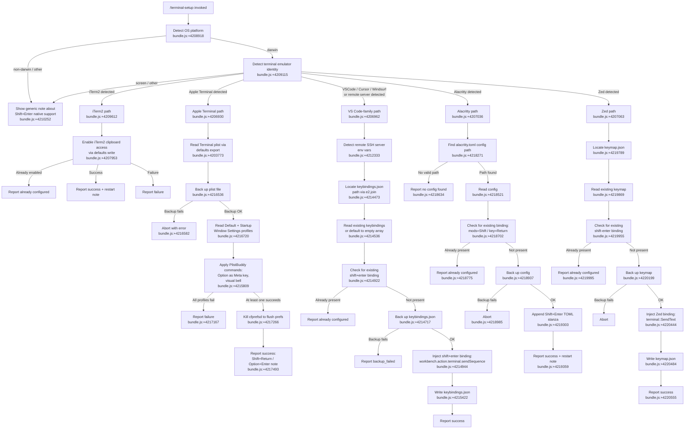

# `/terminal-setup`

> Analysis basis: CC v2.1.198 bundle.js (AST extraction + Claude interpretation)
> Minimum version: v2.1.198

---

## Overview

`/terminal-setup` is a local JSX command that installs the Shift+Enter key binding (and related terminal ergonomics) for the user's current terminal emulator. It detects the active terminal environment at runtime, then applies the appropriate configuration changes — ranging from modifying plist files for Apple Terminal to patching JSON keybinding files for VS Code-family editors, Alacritty, and Zed.

---

## Registration

| Field | Value |
|---|---|
| type | `local-jsx` |
| name | `terminal-setup` |
| description | `Install Shift+Enter key binding for newlines` |
| loc_byte | `12958589` |
| loc_byte_end | `12959221` |
| loc_line | `8853` |
| module_id | `AQi` |
| load_inline | `true` |
| arbor_handler.name | `lrp` |
| arbor_handler.fqn | `claude-2.1.198::lrp` |
| arbor_handler.kind | `AsyncFunction` |
| arbor_handler.resolution_path | `module_id` |
| arbor_handler.n_hits | `1` |

Analysis basis: CC v2.1.198 bundle.js:+12958589 (registration block bytes 12958589–12959221)

---

## Input Branching

The command has 6+ distinct terminal detection branches plus sub-branches per terminal, so a Mermaid flowchart is used.



---

## Behavioral Spec

### Top-Level Handler (`lrp`)

```
async function terminalSetupHandler(context):
    platform = os.platform()                    // bundle.js:+4208918

    if platform == "darwin":
        run iTermClipboardSetup()               // bundle.js:+4209115
        terminalName = detectTerminalName()     // bundle.js:+4209246
        displaySetupResults(terminalName)       // bundle.js:+4209466
    else:
        run vsCodeFamilySetup() if applicable  // bundle.js:+4210394
        print generic native-support note      // bundle.js:+4210252

    render JSX result panel
```

Analysis basis: CC v2.1.198 bundle.js:+4208918

---

### Terminal Detection (`detectTerminalName` — identifier: `lGe`)

```
function detectTerminalName():
    platform = Pre.platform()                   // bundle.js:+4206889

    if platform != "darwin":
        return fallback label

    termProgram = env.TERM_PROGRAM or ""
    terminalAppName = env.TERM_PROGRAM_VERSION / LC_TERMINAL / etc.

    // Check known terminals in order:
    if TERM_PROGRAM includes "Apple_Terminal":  // bundle.js:+4206930
        return "Apple_Terminal"
    if TERM_PROGRAM includes "vscode":          // bundle.js:+4206962
        return "vscode"
    if TERM_PROGRAM includes "cursor":          // bundle.js:+4206986
        return "cursor"
    if TERM_PROGRAM includes "windsurf":        // bundle.js:+4207010
        return "windsurf"
    if TERM_PROGRAM includes "alacritty":       // bundle.js:+4207036
        return "alacritty"
    if TERM_PROGRAM includes "zed":             // bundle.js:+4207063
        return "zed"

    return "your current terminal"             // bundle.js:+4209492
```

Analysis basis: CC v2.1.198 bundle.js:+4206889

---

### iTerm2 Clipboard Setup (`iTermClipboardSetup` — identifier: `SQi`)

```
async function iTermClipboardSetup():
    print dim status line                           // bundle.js:+4207910
    run: defaults read com.googlecode.iterm2        // bundle.js:+4207953
         AllowClipboardAccess                       // bundle.js:+4207999

    if result contains "1" (already enabled):       // bundle.js:+4208074
        report "iTerm2 clipboard access already enabled"
        return

    run: defaults write com.googlecode.iterm2       // bundle.js:+4208162
         AllowClipboardAccess -bool true            // bundle.js:+4208217

    if write fails:                                 // bundle.js:+4208268
        report failure
        return

    report success:                                 // bundle.js:+4208359
        "Enabled 'Applications in terminal may access clipboard' in iTerm2"
        "Restart iTerm2 for this to take effect. Undo: ..."
                                                    // bundle.js:+4208442
    call errorLogger if needed                      // bundle.js:+4208589
```

Analysis basis: CC v2.1.198 bundle.js:+4207910

---

### Apple Terminal Setup (`appleTerminalSetup` — identifier: `urp`)

```
async function appleTerminalSetup():
    // Step 1: export plist
    plistPath = buildPlistPath()                    // Qct, bundle.js:+4203627
    //   -> ~/Library/Preferences/com.apple.Terminal.plist
    //      bundle.js:+4203650,+4203660,+4203674

    run: defaults export com.apple.Terminal <path>  // bundle.js:+4203773,+4203785,+4203794

    // Step 2: stat backup target
    stat plistPath                                  // bundle.js:+4203850

    // Step 3: back up plist
    backupResult = backupFile(plistPath)            // hQi, bundle.js:+4216536

    if backupResult.exitCode != 0:                  // bundle.js:+4216543,+4216547
        throw Error("Failed to create backup of Terminal.app preferences, bailing out")
                                                    // bundle.js:+4216582

    // Step 4: read profiles
    defaultProfile = readProfile("Default Window Settings", plistPath)
                                                    // bundle.js:+4216720
    startupProfile = readProfile("Startup Window Settings", plistPath)
                                                    // bundle.js:+4216897

    if failed to read defaultProfile:               // bundle.js:+4216780
        report "Failed to read default Terminal.app profile"
    if failed to read startupProfile:               // bundle.js:+4216957
        report "Failed to read startup Terminal.app profile"

    // Step 5: apply PlistBuddy commands
    successCount = 0
    for each profile in [defaultProfile, startupProfile]:
        run: /usr/libexec/PlistBuddy -c <cmd>      // bundle.js:+4215809,+4215836
             to set Option-as-Meta and visual bell
        if success: successCount++

    if successCount == 0:                           // bundle.js:+4217167
        report "Failed to enable Option as Meta key or disable audio bell for any Terminal.app profile"
        restoreBackup()
        return

    // Step 6: flush prefs daemon
    run: killall cfprefsd                           // bundle.js:+4217266,+4217277

    // Step 7: report success
    collect result lines:                           // bundle.js:+4217306
        "Configured Terminal.app settings:"
        "- Enabled 'Use Option as Meta key'"        // bundle.js:+4217386
        "- Switched to visual bell"                 // bundle.js:+4217448
    print: "Shift+Return will now enter a newline." // bundle.js:+4217493
    print: "Option+Enter will now enter a newline." // bundle.js:+4217542
    print: "You must restart Terminal.app..."       // bundle.js:+4217627

    if any profile failed:
        report partial failure                      // bundle.js:+4217814
```

Analysis basis: CC v2.1.198 bundle.js:+4216536

---

### VS Code / Cursor / Windsurf Setup (`vsCodeKeybindingSetup` — identifier: `too`)

```
async function vsCodeKeybindingSetup(editorVariant):
    // Detect remote server environment
    isRemote = checkRemoteSSH()                     // bundle.js:+4212333
    //   checks for .vscode-server  bundle.js:+4206419
    //             .cursor-server   bundle.js:+4206449
    //             .windsurf-server bundle.js:+4206479
    //             .devin-server    bundle.js:+4206511

    // Resolve keybindings.json path
    keybindingsPath = path.join(..., "keybindings.json")
                                                    // bundle.js:+4214473

    // Read existing content or use empty array default
    raw = await fs.readFile(keybindingsPath) ?? "[]"
                                                    // bundle.js:+4214536,+4214563

    // Parse JSON
    parsed = parseJSON(raw)                         // bundle.js:+4214604
    if not a valid JSON array:
        report error; return                        // not_json_object bundle.js:+4212562

    // Check existing binding
    existing = parsed.find(entry =>
        entry.key == "shift+enter" &&              // bundle.js:+4214922
        entry.command == "workbench.action.terminal.sendSequence"
    )                                              // bundle.js:+4214944
    if existing:
        report already configured; return          // bundle.js:+4215030

    // Back up
    randomSuffix = crypto.randomBytes(4).toString("hex")
                                                    // bundle.js:+4214654,+4214670,+4214682
    await fs.copyFile(keybindingsPath, backupPath)  // bundle.js:+4214717

    // Inject binding
    newBinding = {
        key: "shift+enter",
        command: "workbench.action.terminal.sendSequence",
        args: { text: "\x1b\r" },                 // bundle.js:+4214996
        when: "terminalFocus"                      // bundle.js:+4215011
    }
    parsed.push(newBinding)

    // Write back
    await fs.writeFile(keybindingsPath, JSON.stringify(parsed, null, 2))
                                                    // bundle.js:+4215422
    report success
```

Analysis basis: CC v2.1.198 bundle.js:+4214473

---

### VS Code GPU Acceleration / Settings (`vsCodeSettingsSetup` — identifier: `E1n`)

```
async function vsCodeSettingsSetup(editorVariant):
    // Checks terminal_setup_gpu_accel feature flag  bundle.js:+4212306
    settingsPath = path.join(..., "settings.json")  // bundle.js:+4211140

    raw = await fs.readFile(settingsPath) ?? "{}"   // bundle.js:+4211167,+4211189
    parsed = parseJSON(raw)                         // bundle.js:+4211261

    if not a JSON object:
        report not_json_object; return              // bundle.js:+4212562

    // Applies relevant VS Code settings (GPU accel, terminal renderer, etc.)
    // Backs up original settings before writing     bundle.js:+4212700,+4213016
    // Reports write_failed or backup_failed on error
    //        bundle.js:+4212906,+4213127
    await fs.writeFile(settingsPath, ...)           // bundle.js:+4213251
    report success or failure
```

Analysis basis: CC v2.1.198 bundle.js:+4212290

---

### Alacritty Setup (`alacrittySetup` — identifier: `drp`)

```
async function alacrittySetup():
    // Locate config: try multiple standard paths
    candidates = [
        path.join(homedir(), ".config", "alacritty", "alacritty.toml"),
                                                    // bundle.js:+4218271,+4218324
        ...
    ]
    // Skip win32 paths                             // bundle.js:+4218385

    validPath = candidates.find(p => fs.existsSync(p))
    if not validPath:                               // bundle.js:+4218628
        report "No valid config path found for Alacritty"
        return

    content = await fs.readFile(validPath)          // bundle.js:+4218521

    // Check existing binding
    if content.includes('mods = "Shift"') &&        // bundle.js:+4218702
       content.includes('key = "Return"'):          // bundle.js:+4218732
        report "Alacritty Shift+Enter key binding already configured"
                                                    // bundle.js:+4218775
        return

    // Back up
    backupPath = validPath + randomSuffix
    try:
        await fs.copyFile(validPath, backupPath)    // bundle.js:+4218937
    catch:
        report "Error backing up existing Alacritty config. Bailing out."
                                                    // bundle.js:+4218985
        return

    // Append TOML stanza
    // If parent dir missing, create it             // bundle.js:+4219133
    await fs.writeFile(validPath, content + newTomlStanza)
                                                    // bundle.js:+4219303

    report "Installed Alacritty Shift+Enter key binding"
                                                    // bundle.js:+4219359
    report "You may need to restart Alacritty for changes to take effect"
                                                    // bundle.js:+4219429

    on error:
        report "Failed to install Alacritty Shift+Enter key binding"
                                                    // bundle.js:+4219654
```

Analysis basis: CC v2.1.198 bundle.js:+4218271

---

### Zed Setup (`zedSetup` — identifier: `prp`)

```
async function zedSetup():
    keymapPath = path.join(homedir(), ..., "keymap.json")
                                                    // bundle.js:+4219789,+4219746

    // Ensure parent directory exists               // bundle.js:+4219814
    await fs.mkdir(path.dirname(keymapPath), { recursive: true })

    raw = await fs.readFile(keymapPath) ?? "[]"    // bundle.js:+4219869
    parsed = JSON.parse(raw)

    // Check for existing shift-enter binding       // bundle.js:+4219955
    if any entry matches "shift-enter":             // bundle.js:+4219944
        report "Zed Shift+Enter key binding already configured"
                                                    // bundle.js:+4219995
        return

    // Back up                                      // bundle.js:+4220151
    try:
        await fs.copyFile(keymapPath, backupPath)
    catch:
        report "Error backing up existing Zed keymap. Bailing out."
                                                    // bundle.js:+4220199
        return

    // Build new binding
    newBinding = {
        context: "Terminal",                       // bundle.js:+4220408
        bindings: {
            "shift-enter": "terminal::SendText"   // bundle.js:+4220444
        }
    }

    // Parse / merge into array                    // bundle.js:+4220352,+4220392
    await fs.writeFile(keymapPath, JSON.stringify(merged, null, 2))
                                                    // bundle.js:+4220484
    report "Installed Zed Shift+Enter key binding" // bundle.js:+4220555

    on error:
        report "Failed to install Zed Shift+Enter key binding"
                                                    // bundle.js:+4220764
```

Analysis basis: CC v2.1.198 bundle.js:+4219789

---

### Backup / Restore Utility (`backupAndRestoreFile` — identifier: `H1n`)

```
async function backupAndRestoreFile(filePath, operation):
    // Resolve backup path                          // bundle.js:+4204110
    backupPath = irp(filePath)                      // irp: bundle.js:+4203503

    if operation == "no_backup":                    // bundle.js:+4204136
        return

    if operation == "import":                       // bundle.js:+4204297
        stat(filePath)                              // bundle.js:+4204199
        // import backup from external path
        run: defaults import ...                    // bundle.js:+4204282
        report result

    if operation == "failed":                       // bundle.js:+4204354
        // log failure and attempt restore

    if operation == "restored":                     // bundle.js:+4204436
        // report restoration success

    on error:
        logError via errorHandler                   // bundle.js:+4204533
```

Analysis basis: CC v2.1.198 bundle.js:+4204110

---

### Exec-File Utility (`execFileWithBackpressure` — identifier: `Dn`)

```
async function execFileWithBackpressure(cmd, args, options):
    // Spawns child process with 10-connection backpressure limit
    // bundle.js:+1152784 (limit: 10)
    // Timeout: 1,000,000 ms                        // bundle.js:+1153394
    // Uses structured write/flush output            // bundle.js:+1153570

    on error event:                                 // bundle.js:+1153829
        log "error"
    on unexpected rejection:                        // bundle.js:+1153933
        log "execFileNoThrow unexpected rejection"
    return { stdout, stderr, exitCode }
```

Analysis basis: CC v2.1.198 bundle.js:+1152784

---

## State & Side Effects

| Item | Detail |
|---|---|
| Telemetry | `tengu_feature_ok` (bundle.js:+1039573) — success path |
| Telemetry | `tengu_feature_bad` (bundle.js:+1039640) — known failure path |
| Telemetry | `tengu_feature_sad` (bundle.js:+1039721) — unexpected failure path |
| Telemetry | `tengu_config_auth_loss_prevented` (bundle.js:+14252278) — config safety guard |
| Telemetry | `tengu_config_lock_contention` (bundle.js:+14255436) — config file lock contention |
| Telemetry | `tengu_config_stale_write` (bundle.js:+14255572) — stale config write detected |
| Telemetry | `tengu_config_parse_error` (bundle.js:+14259169) — config parse error |
| Telemetry | `tengu_config_auto_repaired` (bundle.js:+14255949) — config auto-repaired |
| Telemetry | `tengu_config_fallback_write` (bundle.js:+14255052) — config fallback write |
| Telemetry | `tengu_daemon_control` (bundle.js:+18414881) — daemon lifecycle event |
| File system writes | Writes to `keybindings.json`, `settings.json`, `keymap.json`, `alacritty.toml`, and `com.apple.Terminal.plist` as appropriate for detected terminal |
| File backups | Creates random-suffixed backup copies before each write (using `crypto.randomBytes(4).toString("hex")`) |
| macOS `defaults` | Invokes `defaults export/import/write/read` for Apple Terminal and iTerm2 plist manipulation |
| macOS PlistBuddy | Invokes `/usr/libexec/PlistBuddy -c` to patch Terminal.app plist in place |
| macOS `killall cfprefsd` | Flushes preference daemon after Apple Terminal changes (bundle.js:+4217266) |
| Process event registration | Registers `process.on("exit", ...)` listener in exec-file utility (bundle.js:+217658) |
| appState changes | None detected in depth-2 traversal |
| Sound | None detected |
| Hook registration | None detected |

---

## Version History

| Version | Change |
|---|---|
| v2.1.198 | Initial analysis |

---

## Common Mistakes

1. **Running on a non-macOS system without a supported terminal**: The command is primarily useful on macOS. On other platforms it prints an informational note about terminals that support Shift+Enter natively (iTerm2, WezTerm, Ghostty, Kitty, Warp, Windows Terminal — bundle.js:+4210252) but performs no configuration changes.

2. **Running while Terminal.app is open**: The `killall cfprefsd` step forces a preference-daemon flush. If Terminal.app is open and the user cancels mid-run, the plist may be partially written. The backup mechanism exists to mitigate this, but users should close Terminal.app before running the command.

3. **Expecting Shift+Enter to work immediately in VS Code / Cursor / Windsurf**: The keybinding is written to `keybindings.json`, but VS Code and its forks may require a window reload or restart to pick up the new binding (bundle.js:+4217627).

4. **Multiple Claude instances concurrently**: The config-write subsystem checks for lock contention (`tengu_config_lock_contention`, bundle.js:+14255436) and emits a warning when another Claude instance appears to be running. Running `/terminal-setup` from two sessions simultaneously can cause a stale-write condition.

5. **Remote SSH / server environments**: In VS Code Remote / Cursor Remote / Windsurf Remote contexts, the paths to `keybindings.json` differ from a local install. The command detects `.vscode-server`, `.cursor-server`, `.windsurf-server`, and `.devin-server` markers (bundle.js:+4206419–4206511) and adjusts the path resolution, but users should verify the correct config directory was targeted.

---

## Appendix — Identifier Mapping

> For bundle debugging only. Identifiers change across versions.

| Identifier | Role |
|---|---|
| `lrp` | Main async handler for `/terminal-setup` (arbor_handler) |
| `lGe` | Terminal-name detection function (reads `TERM_PROGRAM` env, checks platform) |
| `b1n` | Per-terminal dispatch router (calls individual setup functions) |
| `urp` | Apple Terminal plist setup orchestrator |
| `hQi` | Apple Terminal plist backup helper |
| `Qct` | Constructs path to `com.apple.Terminal.plist` in `~/Library/Preferences` |
| `Dn` | Generic exec-file-with-backpressure utility |
| `Wr` | Child-process spawn / output handling layer |
| `Pt` | Process queue / concurrency limiter |
| `srp` | File stat helper used before backup |
| `_n` | Config save with lock (global config writer) |
| `xo` | File-system error classifier (ENOENT, EACCES, etc.) |
| `en` | Error code extractor (`.code` property reader) |
| `T` | Terminal/chalk output formatter |
| `Hiu` | Chalk color theme initializer |
| `Me` | JSON serializer wrapper |
| `Oc` | Argument redaction utility (replaces sensitive values with `[REDACTED]`) |
| `YZe` | Terminal column/width detection |
| `biu` | Subprocess runner with timeout (1000 ms soft, 100 ms drain) |
| `Re` | Error logger / error ring-buffer writer |
| `sr` | Error constructor wrapper |
| `st` | String coercion helper |
| `qi` | Network traffic classifier (`essential-traffic`) |
| `jvu` | Ring-buffer shift/push for error log |
| `As` | CLI fatal-error handler (logs `cli_error`, exits process) |
| `uXe` | Console error with red chalk formatting |
| `fI` | Writes error state to file on fatal exit |
| `HQi` | PlistBuddy command runner for Default Window Settings profile |
| `_Qi` | PlistBuddy command runner for Startup Window Settings profile |
| `Jct` | Config read helper (used by backup/restore) |
| `wo` | Chalk color string parser / ANSI color applier |
| `cke` | ANSI/chalk color-name-to-function mapper |
| `UX` | ANSI escape passthrough handler |
| `H1n` | Backup/restore file orchestrator for Terminal.app plist |
| `irp` | Backup path resolver |
| `Dt` | Config record creator with timestamp |
| `too` | VS Code keybindings.json setup function |
| `A1n` | Remote-server environment detector (checks home dir for server subdirs) |
| `gDt` | JSON config parser with `c6` prefix-strip helper |
| `c6` | Strips leading `//` comment prefix from JSON lines |
| `t2` | VS Code-family executable path resolver (uses `pathToFileURL`) |
| `Ww` | VS Code version / hyperlink capability checker |
| `HH` | Hyperlink environment variable checker (`FORCE_HYPERLINK`) |
| `iks` | JSON patch applicator (insert/remove/modify array entries) |
| `fOr` | JSON array insert-at-index helper |
| `Q0s` | JSON AST insertion-index calculator |
| `mOr` | JSON array modification helper |
| `Wgn` | JSON substring extractor for edits |
| `eoo` | VS Code settings.json reader/writer |
| `ioo` | Array-type JSON guard |
| `hOr` | JSON patch applicator variant (for settings.json) |
| `E1n` | VS Code settings.json GPU-accel / terminal settings writer |
| `St` | Feature-flag evaluator |
| `V` | Feature-flag value reader |
| `Pe` | Feature-flag presence checker |
| `OQe` | Feature-flag registry root |
| `drp` | Alacritty TOML config setup function |
| `prp` | Zed keymap.json setup function |
| `Gt` | JSON.parse wrapper |
| `Xct` | Onboarding/project-setup completion handler |
| `Gh` | Onboarding state recorder |
| `uQi` | CLAUDE.md workspace hint builder |
| `zro` | Workspace context path resolver |
| `zt` | File-system path utilities wrapper |
| `Zws` | Config directory locator |
| `_b` | Project config writer |
| `Onn` | Config file writer with lock and backup rotation |
| `sfi` | Config object merger (Object.assign wrapper) |
| `SCt` | Config reader with parse and backup |
| `ACt` | Auth presence validator in config |
| `v7o` | Config backup directory path builder |
| `BMt` | Atomic file write (temp + rename + fsync) |
| `TFe` | Auth token presence check |
| `Dnn` | Timestamp recorder (Date.now) |
| `Mnn` | Config read-with-lock entry point |
| `Kfr` | Project config saver |
| `aoo` | Alternative VS Code-family config reader |
| `crp` | VS Code-family config path resolver |
| `soo` | iTerm2 sub-setup result recorder |
| `roo` | Apple Terminal sub-setup result recorder |
| `ooo` | Alacritty sub-setup result recorder |
| `noo` | Zed sub-setup result recorder |
| `SQi` | iTerm2 clipboard-access setup function |
| `_1n` | Terminal display name formatter |

---

Note: index built via Arbor fallback; some signals (telemetry, literals) may be missing — see arbor-fallback.js.