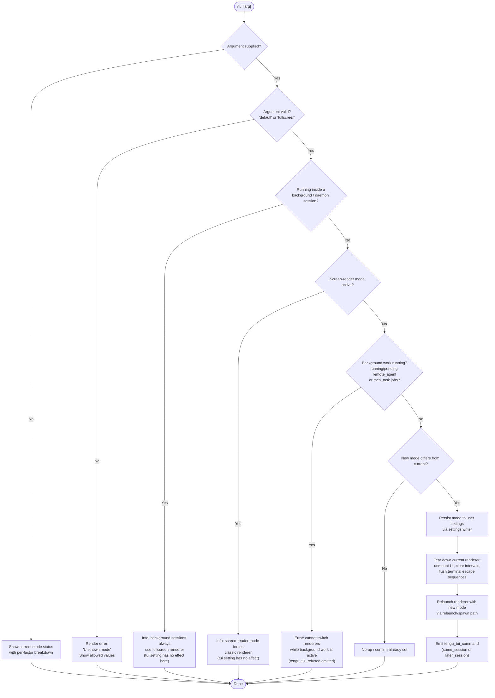

# `/tui`

> Analysis basis: CC v2.1.198 bundle.js (AST extraction + Claude interpretation)
> Minimum version: v2.1.198

---

## Overview

The `/tui` command lets the user switch between the `default` and `fullscreen` terminal UI renderers at runtime, without restarting Claude Code. It validates the requested mode against a set of environment, session, and policy guards, persists the choice to user settings, and—if the switch is safe—tears down the current renderer and rebuilds it with the new mode.

---

## Registration

| Field | Value |
|---|---|
| type | `local-jsx` |
| name | `tui` |
| description | `Set the terminal UI renderer (default \| fullscreen)` |
| argumentHint | `[default\|fullscreen]` |
| module_id | `Ptc` |
| load_inline | `true` |
| loc_byte | `12987061` |
| loc_byte_end | `12987243` |
| loc_line | `8865` |
| arbor_handler.name | `Sem` |
| arbor_handler.fqn | `claude-2.1.198::Sem` |
| arbor_handler.kind | `AsyncFunction` |
| arbor_handler.resolution_path | `module_id` |
| arbor_handler.n_hits | `0` |

Analysis basis: CC v2.1.198 bundle.js:+12987061

---

## Input Branching

The command has more than three distinct branches (no argument, invalid argument, background-session guard, screen-reader guard, background-work guard, and the two valid modes), so a flowchart is required.



---

## Behavioral Spec

### 1. Handler Entry Point (`Sem`)

`Sem` is an `AsyncFunction` resolved via the `module_id` path (`Ptc`) in the Arbor symbol graph.

Analysis basis: CC v2.1.198 bundle.js:+12984648

```
async function tuiCommandHandler(context):
    rawArg = context.args.trim()                        // +12984648

    currentModeInfo = resolveCurrentTuiMode(context)    // Ws +12984673
    validModes      = ["default", "fullscreen"]         // +12984806 ($Wo.includes)

    if rawArg is empty:
        return renderStatusView(context, currentModeInfo)

    if rawArg not in validModes:
        return renderError("Unknown mode — expected 'default' or 'fullscreen'")

    targetMode = rawArg

    // Guard 1 — background / daemon session
    sessionKind = getSessionKind(context)               // li +12984944, gxe +2362267
    if sessionKind in ["daemon", "daemon-worker"]:      // +2362200, +2362214
        return renderInfo(BACKGROUND_SESSION_NOTE)      // +12984958

    // Guard 2 — screen-reader mode
    if isScreenReaderModeActive(context):               // rD +12985154
        return renderInfo(SCREEN_READER_NOTE)           // +12985168

    // Guard 3 — active background tasks
    activeTasks = collectActiveJobs(context)            // Object.values +12985465
    hasBlockingWork = activeTasks.some(task =>
        task.status in ["running", "pending"]           // +12985504, +12985526
        AND task.type in ["remote_agent", "mcp_task"])  // +12985547, +12985574

    if hasBlockingWork:
        emitTelemetry("tengu_tui_refused")              // +12985624
        return renderError(BLOCKED_MESSAGE)             // +12985665

    // Persist
    persistTuiSetting(context, targetMode)              // Lr +12985341

    // Renderer switch
    rendererCycleResult = performRendererSwitch(
        context, targetMode, currentModeInfo)           // wen +12986606

    // Emit outcome telemetry
    sessionLabel = isSameSession(rendererCycleResult)
                   ? "same_session"                     // +12986544
                   : "later_session"                    // +12986559
    emitTelemetry("tengu_tui_command", {                // +12986098
        mode: targetMode,
        session: sessionLabel
    })

    return renderConfirmation(context)                  // Re +12986627
```

---

### 2. Current-Mode Resolution (`resolveCurrentTuiMode` / `Ws`)

Computes the effective TUI mode by evaluating a priority-ordered stack of factors and returning a structured object that includes both the resolved mode and a per-factor explanation (used in the status display).

Analysis basis: CC v2.1.198 bundle.js:+3609461

```
function resolveCurrentTuiMode(context):
    // Factor evaluation order (highest precedence first):

    // bg_forced_on  — background session always forces fullscreen
    if isLocalAgentSession(context):                    // NP, "local-agent" +3609468
        return { mode: "fullscreen", factor: "bg_forced_on" }   // +3610535

    // sr_auto_off   — screen-reader mode suppresses fullscreen
    if isScreenReaderModeActive():                      // rD +3610553
        return { mode: "default", factor: "sr_auto_off" }       // +3610564

    // env_off / env_on — environment variable overrides
    if ENV["CLAUDE_CODE_DISABLE_ALTERNATE_SCREEN"]:     // +12982133
        return { mode: "default", factor: "env_off" }           // +3610593

    if ENV["CLAUDE_CODE_NO_FLICKER"]:                   // +12982108
        return { mode: "default", factor: "env_off" }

    if ENV["CLAUDE_CODE_FORCE_FULLSCREEN_UPSELL"]:      // +12982172
        return { mode: "fullscreen", factor: "env_on" }         // +3610643

    // tmux_cc_auto_off — iTerm2 tmux -CC integration detected
    if isTmuxCCMode():                                  // KZr +3609815 / dre
        emitTelemetry("tengu_pewter_brook")             // +3610114
        return { mode: "default",
                 factor: "tmux_cc_auto_off",            // +3610668
                 message: TMUX_CC_DISABLED_MSG }        // +3609689

    // win_ssh_auto_off — Windows over SSH (ConPTY) detected
    if isWindowsSSH():                                  // KZr, "windows" +3609225
        return { mode: "default",
                 factor: "win_ssh_auto_off",            // +3610702
                 message: WINDOWS_SSH_DISABLED_MSG }    // +3609875

    // settings_on / settings_off — persisted user setting
    persistedMode = readPersistedTuiSetting()           // Lr +3610009
    if persistedMode == "fullscreen":                   // +3610023
        return { mode: "fullscreen", factor: "settings_on" }    // +3610761
    if persistedMode == "default":                      // +3610049
        return { mode: "default", factor: "settings_off" }      // +3610795

    // downsell_on — feature gate / gradual-rollout flag
    if featureGateEnabled("downsell"):
        return { mode: "default", factor: "downsell_on" }       // +3610868

    // gb_on / gb_off — global feature flag bucket
    if globalBucketEnabled():                           // nt +3610835
        return { mode: "fullscreen", factor: "gb_on" }          // +3610933
    else:
        return { mode: "default", factor: "gb_off" }            // +3610941
```

Telemetry `tengu_amber_creek` (+3610207) is emitted when the effective mode is recorded through the `nt` (feature-gate) path.

---

### 3. Renderer Tear-Down and Relaunch (`ehe` / relaunchHandler)

When a mode switch is authorised, the existing renderer is dismantled and a new process is launched via `execve`-style replacement.

Analysis basis: CC v2.1.198 bundle.js:+12979669

```
async function performRendererSwitch(context, targetMode, prevModeInfo):
    // 1. Locate binary path
    binaryPath = resolveBinaryPath()                    // rB +12979669, JXn +9408860

    // 2. Stop scroll / animation intervals
    stopScrollTimer()                                   // MGt +12979837, Lgo +6895188

    // 3. Unmount current Ink/JSX tree
    unmountCurrentUI()                                  // Fje +12979843
        // — writes terminal restore sequences ESC-7 / ESC-8   (+3958028, +3958039)
        // — unmounts Ink instance (e.unmount +6892814)
        // — calls cOn (clearScreen / resetTerminal)   (+6892896)
        // — calls t4n (scroll summary flush)          (+12979849)
        //   emits tengu_scroll_summary                (+6895258)

    // 4. Flush analytics and diagnostics with timeouts
    await Promise.all([
        flushWithTimeout(analyticsFlush,  30000),       // +12979882 "flush timeout (relaunch)"
        flushWithTimeout(cleanupTimeout,   2000),       // +12979939 "cleanup timeout"
        flushWithTimeout(analyticsTimeout, /* analytics flush timeout */ ) // +12980000
    ])                                                  // +12979861

    // Drain diagnostic sinks
    drainDebugSink()                                    // Ltc +12980323
        // — "debug flush timeout (relaunch)"          +12981045
        // — "diag flush timeout (relaunch)"           +12981107
        // — "pre-exit flush timeout (relaunch)"       +12981168

    // 5. Register exit / signal handlers before exec
    registerExitHandlers()                              // FT +12979877, eu, Si
    drainPendingTelemetry()                             // TZe +12979933, sus.drain

    // 6. Remove existing signal listeners and re-register for relaunch
    process.removeAllListeners(["SIGINT","SIGTERM","SIGHUP"])  // +12980396, +12980367-86

    // 7. Build argv for replacement process
    argv = buildArgvForRelaunch(targetMode, context)    // rur +12984924
        // includes: --resume                          +12979815
        //           --add-dir entries                 +12981603
        //           --allow-dangerously-skip-permissions if set  +12981718
        //           --effort                          +12981860
        //           --permission-mode                 +12981877

    // 8. Write relaunch state file via fI               +12980687
    writeRelaunchStateFile(argv)                        // Bae.writeFileSync +203266

    // 9. execve — replace process image
    execve(binaryPath, argv, env)                       // xtc.spawnSync +12980465
        // stdio: inherit                              +12980500
        // On error: process.exit                     +12980714
        //           process.kill(pid, 128+signal)    +12980779
```

---

### 4. Binary-Path Resolution (`rB` → `JXn` / `Yde`)

Locates the installed Claude Code binary to be exec'd during relaunch.

Analysis basis: CC v2.1.198 bundle.js:+9408860

```
function resolveBinaryPath():
    // Primary: ~/.local/share/claude/versions/<n>/bin
    primaryPath = path.join(
        os.homedir(),                                   // h9n +6817925, c0a.homedir
        ".local", "share",                              // +6817967, +6817976
        "claude", "versions",                           // +9408749, +9408758
        currentVersion,                                 // Nf +9408714
        "bin"                                           // +6818047
    )                                                   // boe +9408743

    // Fallback: same directory as current executable
    fallbackPath = path.join(
        path.dirname(currentExecutable),                // Yde +9408886
        "bin"                                           // +6818047
    )

    return primaryPath exists ? primaryPath : fallbackPath
```

---

### 5. Argument Collection for Relaunch (`buildArgvForRelaunch` / `rur`)

Reconstructs the full CLI argument vector that will be passed to the replacement process.

Analysis basis: CC v2.1.198 bundle.js:+12981428

```
function buildArgvForRelaunch(targetMode, context):
    argv = Array.from(baseArgs)                         // +12981428

    // Source classification: cliArg or session         // +12981503, +12981524
    for each addDir in context.additionalDirs:
        argv.push("--add-dir", addDir)                  // +12981603

    if context.allowDangerouslySkipPermissions:
        argv.push("--allow-dangerously-skip-permissions") // +12981718

    if context.effort:
        argv.push("--effort", context.effort)           // +12981860

    if context.permissionMode:
        argv.push("--permission-mode", context.permissionMode) // +12981877

    // Propagate current session flags via W0e / Dt     // +12981662
    // flatMap remaining known flags                     // +12981822

    return argv
```

---

### 6. Session Context Extraction (`Ur` / `Qm`)

Reads app state to retrieve session-level configuration (working directory, tool lists, permission mode, etc.) used both for guards and for relaunch-argv construction.

Analysis basis: CC v2.1.198 bundle.js:+11313870

```
function getSessionContext(context):
    appState = context.getAppState()                    // +11313870

    workingDirectory  = appState.working_directory      // +11313975
    allowedTools      = appState.allowed_tools          // +11314030
    disallowedTools   = appState.disallowed_tools       // +11314085
    avoidPrompts      = appState.avoid_prompts          // +11314146
    permissionMode    = appState.permission_mode        // +11314248
    bypassPermissions = appState.bypassPermissions      // +11314279
    effort            = appState.effort                 // +11314603
    model             = appState.model                  // +11314616
    maxThinkingTokens = appState.max_thinking_tokens    // +11314628
    flagSettings      = appState.flag_settings          // +11314654

    return { workingDirectory, allowedTools, disallowedTools,
             avoidPrompts, permissionMode, bypassPermissions,
             effort, model, maxThinkingTokens, flagSettings }
```

---

### 7. Terminal Capability Detection (`XN`)

Used during mode resolution and the status display to determine what the current terminal environment supports.

Analysis basis: CC v2.1.198 bundle.js:+3681088

```
function detectTerminalCapabilities():
    term = {}

    // Detect specific terminal programs
    if termProgram in ["cursor", "vscode"]:             // +3681832, +3681881
        term.editor = termProgram

    if isJetBrainsIdeTerminal():                        // KN.isJetBrainsIdeTerminal +3681156
        term.ide = "jetbrains"

    // OS detection
    platform = process.platform                         // darwin +3681365, win32 +3681412

    // xterm.js version range check (VSCode/Cursor)
    xtermVersion = parseFloat(ENV["TERM_PROGRAM_VERSION"]) // m7d +3681452
    if not Number.isNaN(xtermVersion):
        // Version thresholds for feature support
        supported = xtermVersion >= 1092000             // +3681957
                    AND xtermVersion < 1105000          // +3681968
        // "xterm.js" capability label                  // +3682001
        term.xtermSupported = supported
        term.xtermVersion = Math.min(xtermVersion, 20) // +3682339

    // ghostty / iTerm version checks                   // +3677860, +3677929
    ghosttyVersion = getTerminalVersion("ghostty")      // q8i.coerce +3677770
    if ghosttyVersion >= "1.2.0":                       // +3677890
        term.ghosttyOk = true
    iTermVersion = getTerminalVersion("iTerm.app")
    if iTermVersion >= "3.6.6":                         // +3677961
        term.iTermOk = true

    // tmux / screen multiplexer detection
    if TERM_PROGRAM contains "tmux":                    // ax +3600548, "tmux" +3600561
        term.tmux = true
    if TERM_PROGRAM contains "screen":                  // +3600634
        term.screen = true

    return term
```

---

## State & Side Effects

| Item | Detail |
|---|---|
| Telemetry — `tengu_tui_command` | Emitted on every successful mode switch; carries `mode` and `same_session`/`later_session` label (bundle.js:+12986098) |
| Telemetry — `tengu_tui_refused` | Emitted when switch is blocked by active background work (bundle.js:+12985624) |
| Telemetry — `tengu_amber_creek` | Emitted when effective mode is resolved through the feature-gate (`nt`) path (bundle.js:+3610207) |
| Telemetry — `tengu_pewter_brook` | Emitted when fullscreen is auto-disabled due to tmux -CC detection (bundle.js:+3610114) |
| Telemetry — `tengu_scroll_summary` | Emitted during renderer tear-down when the scroll timer is flushed (bundle.js:+6895258) |
| Telemetry — `tengu_feature_ok` / `tengu_feature_bad` / `tengu_feature_sad` | Emitted from the feature-gate check path used during mode resolution (bundle.js:+1039573, +1039640, +1039721) |
| Telemetry — `tengu_disable_bypass_permissions_mode` | Emitted if bypass-permissions mode is suppressed by policy or settings during session-context reads (bundle.js:+3461875) |
| Telemetry — `tengu_daemon_control` | Emitted by daemon-control paths reached during background-session guard evaluation (bundle.js:+18414881) |
| Telemetry — `tengu_daemon_config_reload` | Emitted when daemon config is reloaded as part of renderer rebuild (bundle.js:+18392244) |
| Telemetry — `tengu_config_parse_error` | Emitted if the settings file cannot be parsed during mode persistence (bundle.js:+14259169) |
| User settings write | Persisted TUI mode is saved to `~/.claude/settings.json` via the settings writer (`Lr` / `X8`) (bundle.js:+12985341) |
| Process replacement | On successful switch, the Claude Code process image is replaced via `xtc.spawnSync`/`execve` with rebuilt argv (bundle.js:+12980465) |
| Terminal escape sequences | ESC-7 (save cursor) and ESC-8 (restore cursor) are written synchronously before UI unmount (bundle.js:+3958028, +3958039) |
| Ink component unmount | The current JSX/Ink tree is unmounted (`e.unmount`) before relaunch (bundle.js:+6892814) |
| Interval cleanup | Active scroll/animation intervals are cleared via `clearInterval` (`Lgo`) before tear-down (bundle.js:+6895136) |
| Signal handler reset | `SIGINT`, `SIGTERM`, `SIGHUP` listeners are removed and re-registered for the relaunch path (bundle.js:+12980396) |
| Relaunch state file | A state file is written via `Bae.writeFileSync` so the next process can restore session context (bundle.js:+203266) |
| Analytics / diagnostics flush | Multiple timed flush operations are awaited before exec (30 000 ms, 2 000 ms flush windows) (bundle.js:+12979882, +12979939) |
| appState changes | No direct mutation; reads `appState` for session context; mutations occur only via the settings-persistence path |
| Sound | None observed in depth-2 traversal |

---

## Version History

| Version | Change |
|---|---|
| v2.1.198 | Initial analysis |

---

## Common Mistakes

1. **Running `/tui` during active background tasks** — The command will refuse with a message citing `/tasks` as the resolution path. Wait for all `running`/`pending` remote-agent or MCP-task jobs to finish before switching renderers.

2. **Expecting `/tui` to affect background/daemon sessions** — Sessions started with the daemon or daemon-worker mode always use the fullscreen renderer regardless of the persisted setting; the command acknowledges this but does not change behaviour for those sessions.

3. **Expecting `/tui` to work with screen-reader mode enabled** — Screen-reader mode forces the classic (default) renderer. The setting is recorded but has no effect until screen-reader mode is deactivated.

4. **Overlooking environment variable overrides** — `CLAUDE_CODE_DISABLE_ALTERNATE_SCREEN` and `CLAUDE_CODE_NO_FLICKER` take precedence over the persisted setting. If either is set, `/tui fullscreen` will appear to be accepted but the resolved mode will remain `default`.

5. **Assuming the switch is in-place** — A successful mode change replaces the current process image entirely (`execve`-style). Any in-memory state not flushed to disk before the switch will be lost; Claude Code reconstructs session state from the relaunch state file and CLI flags.

6. **Passing an argument other than `default` or `fullscreen`** — The argument is validated against exactly those two strings (case-sensitive). Any other value results in an error; there is no fuzzy matching.

---

## Appendix — Identifier Mapping

> For bundle debugging only. Identifiers change across versions.

| Identifier | Role |
|---|---|
| `Sem` | Main handler (`AsyncFunction`) for `/tui` — validates input, enforces guards, persists setting, triggers relaunch |
| `wen` | Relaunch orchestrator; called by `Sem` to perform renderer switch |
| `ehe` | Core renderer tear-down and process-replacement function |
| `rB` | Binary-path resolver (tries versioned install path then executable directory) |
| `JXn` | Versioned install path builder (`~/.local/share/claude/versions/<v>/bin`) |
| `boe` | Constructs the `~/.local/share/…` portion of the binary path |
| `Yde` | Fallback binary path builder (relative to current executable) |
| `h9n` | Returns `os.homedir()` |
| `Nf` | Retrieves current version string |
| `Ws` | Current TUI mode resolver; evaluates all override factors in priority order |
| `NP` | Checks whether the session is a local-agent (background) session |
| `rD` | Screen-reader mode predicate |
| `zZr` | Helper used in mode-factor evaluation (`st` delegator) |
| `dre` | tmux-CC detection helper (`Q8d` delegator) |
| `KZr` | Windows-SSH / ConPTY detection helper |
| `Lr` | Settings reader/writer for TUI mode persistence (`X8` delegator) |
| `Z8d` | Settings writer wrapper |
| `nt` | Feature-gate evaluation for TUI mode |
| `MGt` | Scroll / animation interval stopper (`Lgo` → `clearInterval`) |
| `Lgo` | Clears the scroll summary interval |
| `Fje` | UI unmounter; writes terminal escape sequences and calls Ink `unmount` |
| `cOn` | Terminal screen reset / clear helper |
| `M6e` | Terminal capability check for alternate-screen support (ghostty, iTerm version gates) |
| `ax` | tmux / screen multiplexer detection in terminal escape path |
| `t4n` | Scroll-summary flush; emits `tengu_scroll_summary` |
| `gRa` | Scroll-summary computation (`Date.now`, `Math.max`, `Math.round`) |
| `FT` | Exit / signal handler registrar |
| `eu` | Process `exit` event handler setup |
| `Si` | Registers signal handler via `sus.register` |
| `TZe` | Drains pending telemetry sink (`sus.drain`) |
| `Bje` | Analytics-flush promise wrapper |
| `UWo` | Working-directory / path helper used during relaunch argv construction |
| `Ltc` | Diagnostic / debug flush orchestrator (debug, diag, pre-exit sinks) |
| `Xln` | Drains `ius` (diagnostics) sink |
| `vtc` | Native-addon / FFI loader (dlopen, execve wrapper) |
| `rur` | Argv builder for relaunch process |
| `a2e` | Argv source classifier (`cliArg` / `session`) |
| `W0e` | Flag propagation helper (`Dt` delegator) |
| `Dt` | Settings-flag deserialiser / propagator |
| `SCt` | Settings file reader with backup/migration logic |
| `qHm` | Settings file watcher and cache manager |
| `Ur` | Session context extractor from app state (working dir, tools, permission mode …) |
| `Mrr` | `working_directory` resolver from app state |
| `Drr` | `disallowed_tools` resolver from app state |
| `dR` | Bypass-permissions guard (`kQr` delegator) |
| `kQr` | Evaluates policy and settings for bypass-permissions mode |
| `Qm` | Secondary app-state reader (effort, model, flag_settings …) |
| `li` | Session-kind detector (`daemon` / `daemon-worker`) |
| `gxe` | Session-kind string resolver |
| `nke` | Full mode-factor status object builder (used for status display) |
| `eo` | Settings persistence layer (reads/writes JSON settings files) |
| `Oh` | Settings-file path resolver |
| `Vwe` | Locates project and user settings files |
| `OHn` | Resolves absolute settings file paths |
| `JGu` | Settings lookup via `st` |
| `m6` | Path-join helper for `.claude/settings.json` |
| `YGu` | Managed-settings path builder |
| `x3` | Settings-source aggregator (policy, flag, user, project, local) |
| `KDt` | WSL-aware path resolver |
| `h1r` | Full settings-load orchestrator |
| `XRs` | Settings merger / conflict resolver |
| `m1r` | Per-source settings loader |
| `Y8` | Settings cache read/write (`Rcs` / `Mcs`) |
| `Rcs` | Cache get (`PAr.get`) |
| `LP` | Deep-clone helper (`structuredClone`) |
| `d1r` | Raw settings file parser (JSON + validation) |
| `Mcs` | Cache set (`PAr.set`) |
| `zRs` | SDK inline settings reader |
| `UHe` | Settings merge helper (`jGu`, `qGu`, `zGu`) |
| `Wnt` | Settings validation and normalisation |
| `Nk` | File-content reader with encoding detection |
| `IHe` | Raw file reader (stat, readFileSync, BOM/encoding detection) |
| `Wd` | Filesystem path resolver with `realpathSync` |
| `Sws` | `statSync` wrapper with directory / file type checks |
| `Khn` | Path depth / traversal guard |
| `BMt` | Atomic file writer (temp-file, fsync, rename pattern) |
| `zws` | Lock-file manager for atomic writes |
| `Kws` | Lock-file cache lookup (`WDr.get`) |
| `$Mt` | Lock-file creator with `fstatSync` / `closeSync` |
| `ywe` | Lock-file write helper |
| `ant` | Extended-attribute / xattr fallback for atomic write |
| `$Dr` | Platform-specific file wait / busy-poll helper |
| `I9u` | `Atomics.wait` wrapper |
| `eLs` | File property descriptor helper |
| `Me` | `JSON.stringify` wrapper |
| `o_` | Settings cache invalidator (`iln.clear`, `PAr.clear`) |
| `Fgn` | gitignore-aware file writer |
| `Pt` | Async-local-storage context accessor |
| `qhn` | Store getter (`Vhn.getStore`) |
| `eOr` | Editor integration helper (`Ec`) |
| `Ugn` | gitignore check orchestrator (`Wr`) |
| `Wr` | `execFileNoThrow` wrapper for external processes |
| `p6u` | `git check-ignore` invoker |
| `q0s` | `git ls-files --error-unmatch` invoker |
| `K0s` | gitignore append helper |
| `St` | Feature-gate check (ok path; `V`, `Pe` delegators) |
| `Pe` | Feature-gate resolver (`OQe`) |
| `OQe` | Feature-gate primitive |
| `X8` | Settings load-from-disk orchestrator with perf tracing |
| `a0` | Settings load entry point |
| `_a` | Memory-usage sampler called at settings load |
| `W5` | `perf_hooks` require wrapper |
| `g1r` | Full disk-load implementation (reads all sources, merges) |
| `Tn` | Post-load telemetry emitter (`settings_load_completed`) |
| `lln` | Settings-load logger |
| `qDt` | Dependency-tracking set updater |
| `aln` | Post-load validation helper |
| `Re` | Error logger / reporter |
| `sr` | Error serialiser |
| `st` | String normaliser / truthy helper |
| `qi` | Log-ring-buffer reader |
| `wSs` | Log entry formatter |
| `jvu` | Log ring-buffer shift/push helper |
| `XN` | Terminal-capability detector (ghostty, iTerm, JetBrains, VSCode/Cursor, xterm.js version) |
| `gBt` | Terminal program name reader |
| `HH` | Terminal version string reader |
| `jeo` | Terminal program version parser |
| `f7d` | Version-string tokeniser |
| `Cy` | Terminal name normaliser |
| `m7d` | xterm.js version range evaluator (`parseFloat`, `Math.min`) |
| `Veo` | xterm.js version lookup |
| `eG` | Render-update emitter |
| `Z3` | JSX render scheduler |
| `X5d` | Render frame compositor |
| `wc` | Ink render-output writer (`mr`) |
| `Fm` | Frame diff helper |
| `EHe` | Log formatter for render output |
| `js` | Product-feedback gate evaluator |
| `q9i` | Feedback feature-flag resolver (`rG`) |
| `rG` | Feature-flag entry-point (`O$`, `p2t`, `Nye`) |
| `O$` | Feature-flag store accessor |
| `p2t` | Feature-flag file reader |
| `Nye` | Feature-flag value parser |
| `Tye` | Feedback gate string normaliser |
| `ul` | Timeout-race utility (`Promise.race` + `clearTimeout`) |
| `fI` | Relaunch state file writer (`Bae.writeFileSync`) |
| `_0e` | `CLAUDE_CODE_NO_FLICKER` / `CLAUDE_CODE_DISABLE_ALTERNATE_SCREEN` environment reader |
| `HOr` | File-modification timestamp recorder (`Vgn.set`, `Date.now`) |
| `I3e` | Settings-path + source aggregator |
| `SXe` | File read with size-limit guard (max 1 048 576 bytes) |
| `rdc` | Directory listing with max-depth calculation |
| `E` | Agent / SDK session controller |
| `A` | Background-agent controller (`FEr`, `UEr`) |
| `lQc` | Daemon heartbeat scheduler (`zce`) |
| `I` | Input event handler (`Math.max`, `Math.floor`, `R.preventDefault`) |
| `d` | Supervisor session manager (start/stop agents, config reload) |