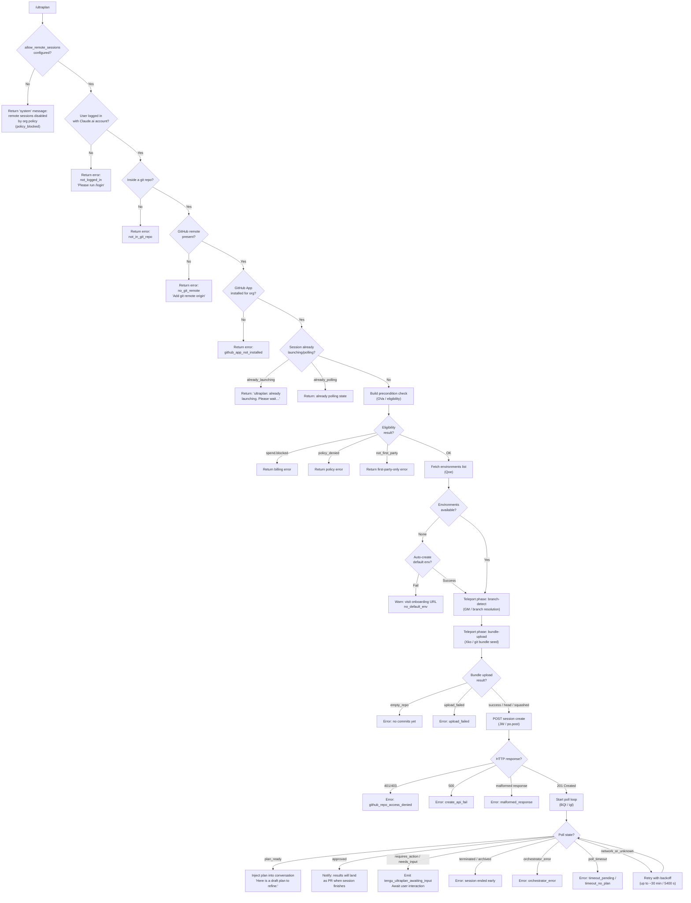

# `/ultraplan`

> Analysis basis: CC v2.1.198 bundle.js (AST extraction + Claude interpretation)
> Minimum version: v2.1.198

---

## Overview

`/ultraplan` launches a cloud-hosted remote session that drafts an editable plan on Claude.ai on the web. The command checks eligibility conditions (login, git presence, GitHub App install, organizational policy, remote-session flag), then teleports the local working tree to a cloud environment, polls for a plan result, and injects the completed plan back into the local CLI conversation as a refinable draft. It is the primary mechanism for delegating planning tasks to Anthropic's cloud agent infrastructure directly from the CLI.

---

## Registration

| Field | Value |
|---|---|
| type | `local-jsx` |
| name | `ultraplan` |
| description | `Draft an editable plan in Claude Code on the web ( … ) · See …` |
| argumentHint | `<prompt>` |
| load\_inline | `true` |
| load\_ident | `SQf` |
| loc\_byte | `12816145` |
| loc\_byte\_end | `12816377` |
| loc\_line | `8640` |
| arbor\_handler.name | `SQf` |
| arbor\_handler.kind | `AsyncFunction` |
| arbor\_handler.fqn | `claude-2.1.198::SQf` |
| arbor\_handler.resolution\_path | `load_ident` |
| arbor\_handler.n\_hits | `1` |
| `loc_byte_end` | `12816377` |
| `arbor_handler.name` | `SQf` |
| `arbor_handler.kind` | `AsyncFunction` |
| `arbor_handler.resolution_path` | `load_ident` |
| `arbor_handler.fqn` | `claude-2.1.198::SQf` |
| `arbor_handler.n_hits` | `1` |

Analysis basis: CC v2.1.198 bundle.js:+12816145

The handler was inlined via a `load:()=>Promise.resolve({call: SQf})` shape (no `module_id`). The Arbor symbol graph resolved it via the `load_ident` path with a single unambiguous hit.

---

## Input Branching

The command has more than three distinct decision paths (eligibility checks → state guard → teleport phases → poll outcomes), so a Mermaid flowchart is used.



Analysis basis: CC v2.1.198 bundle.js:+12814280 (handler entry `SQf`), +12811468 (inner launch function `yen`), +12807257 (poll manager `Mcr`/`BQl`)

---

## Behavioral Spec

### 1. Handler Entry — `ultraplanHandler` (`SQf`)

```
async function ultraplanHandler(commandContext):
    // Check remote sessions are allowed by org config
    if not appState.config["allow_remote_sessions"]:
        return systemMessage(kind="policy_blocked", ...)

    // Check login state
    if not isLoggedIn(commandContext):
        return errorMessage("not_logged_in", "Please run /login ...")

    // Resolve app state snapshot for guard checks
    appState = commandContext.getAppState()

    // Check git presence and GitHub remote
    remoteUrl = resolveGitRemote(appState)   // uor → cor → X$o
    if not inGitRepo:
        return errorMessage("not_in_git_repo")
    if not remoteUrl:
        return errorMessage("no_git_remote", "Cloud agents require a GitHub remote ...")

    // Check GitHub App installation
    if not githubAppInstalled(appState):
        return errorMessage("github_app_not_installed")

    // Guard against concurrent launches
    if launchState == "already_launching":
        return errorMessage("ultraplan: already launching. Please wait ...")
    if launchState == "already_polling":
        return // silently skip

    // Call the core launch function
    result = await launchUltraplan(commandContext, prompt, appState)

    // Update app state on completion
    commandContext.setAppState(updatedState)
```

Analysis basis: CC v2.1.198 bundle.js:+12814280

---

### 2. Git Remote Resolution — `resolveGitRemote` (`uor` → `cor` → `X$o`)

```
function resolveGitRemote(context):
    // cor: scan context for git configuration blocks
    parsed = parseGitSections(context)     // X$o

    for each section in parsed:
        if section.startsWith("remote"):   // e.startsWith
            // extract URL via regex (gi flag, matchAll)
            matches = section.matchAll(remoteUrlPattern)
            if matches found and not alreadySeen(matches):
                remoteUrls.push(normalizeUrl(match))

    // uor: slice and clean the resolved URL
    cleaned = rawUrl.slice(startOffset)
    normalized = cleaned.replace(pattern, "$1$2")  // literal "$1$2"
    return normalized.toLowerCase()
```

Constants:
- Replace pattern produces `"$1$2"` (bundle.js:+11413045)
- Segment limit: `5` tokens (bundle.js:+11413068)
- String chunk size: `1024` (bundle.js:+18286504)

Analysis basis: CC v2.1.198 bundle.js:+12814280 (`SQf→uor`), +11412920 (`uor→cor`), +11412714 (`cor→X$o`)

---

### 3. Eligibility / Precondition Check — `remoteEligibilityCheck` (`OVa`)

```
async function remoteEligibilityCheck(appState):
    // Emit telemetry: tengu_ccr_bundle_seed_enabled
    emit("tengu_ccr_bundle_seed_enabled", {byoc: isByoc})

    // Check first-party provider
    if provider != "firstParty":
        return {status: "policy_denied",
                message: "Cloud sessions are only available on the first-party Anthropic API provider."}

    // Check spend limits (tge → Response.json)
    spendStatus = fetchSpendStatus()
    if spendStatus == "spend.blocked":
        return {status: "billing_error", code: "spend limit reached"}
    if spendStatus == "store_error":
        return {status: "billing_error", code: "spend limit unavailable"}

    // HTTP 429 with x-should-retry header → rate limit billing error
    if httpStatus == 429 and headers["x-should-retry"]:
        return {status: "billing_error"}

    // All checks passed
    return {status: "ok"}
```

Analysis basis: CC v2.1.198 bundle.js:+9497737 (`OVa`), +18191733 (`spend.blocked`), +18191992 (HTTP 429 literal)

---

### 4. Environment Selection — `listEnvironments` (`Qoe`) and `createDefaultEnvironment` (`ygt`)

```
async function listEnvironments(appState):
    // Requires first-party provider
    if not firstParty:
        throw "Remote environments are only available on the first-party Anthropic API provider."

    // Requires Claude.ai OAuth token (not API key)
    if not oauthToken:
        throw "Claude Code web sessions require authentication with a Claude.ai account ..."

    // Fetch org UUID
    orgUuid = getOrgUuid()
    if not orgUuid:
        throw "Unable to get organization UUID"

    // GET /v1/code/sessions or /v1/sessions depending on feature flag
    response = po.get(endpoint, headers={x-organization-uuid: orgUuid})
    // Retry with 15000 ms timeout
    return response.environments

async function createDefaultEnvironment(appState):
    // POST to create "Default" environment
    // name: "Default", runtime: anthropic_cloud
    // Emits: tengu_ccr_bundle_seed_enabled (via OVa)
    return newEnvironment
```

Constants:
- List retry timeout: `15000` ms (bundle.js:+7994319)
- Default environment name: `"Default"` (bundle.js:+7994715)
- BYOC image tag: `"ccr-byoc-2025-07-29"` (bundle.js:+7995471)
- Default workdir: `"/home/user"` (bundle.js:+7995261)
- Python version: `"3.11"` (bundle.js:+7995340), Node version: `"20"` (bundle.js:+7995369)

Analysis basis: CC v2.1.198 bundle.js:+7993681 (`Qoe`), +7994737 (`ygt`)

---

### 5. Teleport / Bundle Upload — `bundleUpload` (`Xko`)

```
async function bundleUpload(sessionParams, appState):
    // Phase marker: "[teleport] phase: bundle-upload"
    logPhase("bundle-upload")

    // Verify git repository has commits
    headRef = git("rev-parse", "--verify", "HEAD")
    if not headRef:
        throw {code: "empty_repo", message: "Repository has no commits — run `git add . && git commit -m \"initial\"` then retry"}

    // Stash uncommitted changes
    stashId = git("stash", "create")

    // Create seed bundle
    bundlePath = tempDir + "/ccr-seed.bundle"
    git("bundle", "create", bundlePath, ...)

    // Attempt full HEAD bundle
    try:
        uploadResult = uploadBundle(bundlePath, sessionParams)
        if uploadResult == "success":
            sourceType = "head"
    except:
        // Fallback to squashed bundle
        sourceType = "fallback_head" or "squashed" or "fallback_squashed"

    // Emit: tengu_ccr_bundle_upload
    emit("tengu_ccr_bundle_upload", {result: sourceType})

    // Clean up temp bundle file (Dyt.unlink)
    fs.unlink(bundlePath)

    return {sourceType, refs: {seed: "refs/seed/stash", root: "refs/seed/root"}}
```

Constants:
- Seed stash ref: `"refs/seed/stash"` (bundle.js:+9461598)
- Seed root ref: `"refs/seed/root"` (bundle.js:+9461616)
- Bundle suffix: `".bundle"` (bundle.js:+9462804)
- Bundle filename: `"_source_seed.bundle"` (bundle.js:+9463100)
- Git commands used: `"for-each-ref"`, `"--count=1"`, `"rev-parse"`, `"--verify"`, `"HEAD"`, `"stash"`, `"create"`, `"update-ref"`, `"-d"`

Analysis basis: CC v2.1.198 bundle.js:+9461468 (`Xko`), +9461790 (telemetry)

---

### 6. Session Creation — `createSession` (`JW`)

```
async function createSession(params, appState):
    // Phase: "[teleport] phase: POST-sent"
    logPhase("POST-sent")

    // Determine API endpoint version
    if featureFlag("v1alpha2"):
        endpoint = "/v1/code/sessions"
    else:
        endpoint = "/v1/sessions"

    // Validate access token
    token = getAccessToken()
    if not token:
        throw {code: "no_access_token",
               message: "Cloud sessions require a claude.ai login. Run /login to authenticate."}

    // Validate org UUID
    orgUuid = getOrgUuid()
    if not orgUuid:
        throw {code: "no_org_uuid",
               message: "Unable to get organization UUID for cloud session creation"}

    // Build payload
    payload = buildSessionPayload(params)   // Qhl → wKe.randomUUID

    // POST
    response = po.post(endpoint, payload, headers={
        "x-organization-uuid": orgUuid,
        "anthropic-beta": betaHeader
    })

    // Handle HTTP error codes
    match response.status:
        500      → throw {code: "create_request_failed"}
        401, 403 → throw {code: "github_repo_access_denied"}
        201      → return response.data.session

    // Validate session id present
    if not response.data.session.id:
        throw {code: "malformed_response",
               message: "Server returned a malformed session response (no session id)"}

    // Emit: tengu_ccr_session_link
    emit("tengu_ccr_session_link", {sessionId, ...})

    return session
```

Constants:
- Endpoint v1: `"/v1/sessions"` (bundle.js:+9478764)
- Endpoint v1alpha2: `"/v1/code/sessions"` (bundle.js:+9478744)
- Header key org: `"x-organization-uuid"` (bundle.js:+9478799)
- Header key beta: `"anthropic-beta"` (bundle.js:+9478837)
- HTTP 201 created: `201` (bundle.js:+9481786)
- HTTP 401/403: `401`/`403` (bundle.js:+9481858, +9481862)
- HTTP 409 conflict: `409` (bundle.js:+9491390)
- Poll retry interval: `10000` ms (bundle.js:+9491101)

Analysis basis: CC v2.1.198 bundle.js:+9478977 (`JW`), +9478733 (version literals)

---

### 7. Core Launch Orchestrator — `launchUltraplan` (`yen`)

```
async function launchUltraplan(context, prompt, appState):
    // Check telemetry / product feedback settings (js → IGd, CGd)
    telemetryAllowed = checkTelemetrySettings(appState)

    // Emit: tengu_ultraplan_launched
    emit("tengu_ultraplan_launched", {source: "slash"})

    // Precondition phase
    eligibility = await remoteEligibilityCheck(appState)   // EQf → Pfe → OVa
    if eligibility.failed:
        return handleEligibilityError(eligibility)

    // Build context snapshot (hQf → mQf / dQf)
    contextBlock = buildContextBlock(prompt)
    // Prepend: "Here is a draft plan to refine:"

    // Launch the session create + teleport pipeline (gQf)
    sessionResult = await runSessionPipeline(contextBlock, appState)

    if sessionResult.error:
        // Emit: tengu_ultraplan_create_failed
        emit("tengu_ultraplan_create_failed", {reason: sessionResult.errorCode})
        return errorMessage(sessionResult.message + ". See --debug for details.")

    if sessionResult == null:
        // Emit: teleport_null
        return errorMessage("teleport_null")

    // Start poll loop (gQf → BQl / igl)
    pollResult = await pollSessionToCompletion(sessionResult.sessionId, appState)
    return pollResult
```

Analysis basis: CC v2.1.198 bundle.js:+12811468 (`yen`), +12813212 (`tengu_ultraplan_launched`), +12811505 (`tengu_ultraplan_create_failed`)

---

### 8. Session Pipeline — `sessionPipeline` (`gQf`)

```
async function sessionPipeline(contextBlock, appState):
    // Record start time
    startTime = Date.now()

    // Emit: tengu_ultraplan_timeout_seconds (5400 s max)
    emit("tengu_ultraplan_timeout_seconds", {seconds: 5400})

    // Retrieve or create conversation state (uQf → nt)
    convState = getOrCreateConvState()

    // Fetch environments
    environments = await listEnvironments(appState)   // Qoe

    // If no environments, attempt auto-create of default
    if environments.empty:
        newEnv = await createDefaultEnvironment(appState)   // ygt
        if newEnv:
            log("[teleportToRemote] Auto-created default cloud env")
            environments = [newEnv]
        else:
            log(level="warn", "Could not create a cloud environment. Set one up at https://claude.ai/code/onboarding?magic=env-setup")
            return {error: "no_default_env"}

    // Phase: branch-detect
    logPhase("[teleport] phase: branch-detect")
    branchInfo = await detectBranch(appState)   // GM

    // Phase: bundle-upload
    logPhase("[teleport] phase: bundle-upload")
    bundleResult = await bundleUpload(params, appState)   // Xko
    emit("tengu_teleport_bundle_mode", {mode: bundleResult.sourceType})
    emit("tengu_teleport_source_decision", {decision: bundleResult.sourceType})

    // Build title for session (XHf → teleport_generate_title)
    title = generateTitle(contextBlock)   // max 75 chars

    // POST create session
    session = await createSession({
        title, branch: branchInfo, bundle: bundleResult, env: selectedEnv
    }, appState)

    // Emit: tengu_ccr_bundle_upload
    emit("tengu_ccr_bundle_upload", {...})

    return {sessionId: session.id, session}
```

Constants:
- Maximum session lifetime: `5400` seconds (bundle.js:+12807033)
- Title max length: `75` characters (bundle.js:+9464929)
- Title template: `"{description}"` → `claude/task` schema (bundle.js:+9464935, +9464971)
- Onboarding URL: `"https://claude.ai/code/onboarding?magic=env-setup"` (bundle.js:+9483219)

Analysis basis: CC v2.1.198 bundle.js:+12807467 (`gQf`), +12807033 (timeout literal)

---

### 9. Poll Loop — `pollSessionToCompletion` (`BQl` / `igl`)

```
async function pollSessionToCompletion(sessionId, appState):
    startTime = Date.now()
    maxDuration = 1800000  // 30 minutes in ms

    loop:
        wait(1000 ms)
        if elapsed > maxDuration:
            emit("tengu_ultraplan_timeout_seconds", ...)
            return {error: "poll_timeout"}

        sessionState = await fetchSessionState(sessionId)   // igl

        match sessionState.status:
            "plan_ready":
                // Emit: tengu_ultraplan_plan_ready
                emit("tengu_ultraplan_plan_ready", {elapsed: Math.round(elapsed/60000)})
                injectPlanIntoConversation(sessionState.result)
                return {success: true, plan: sessionState.result}

            "approved":
                // Emit: tengu_ultraplan_approved
                emit("tengu_ultraplan_approved", {...})
                return {message: "Results will land as a pull request when the cloud session finishes. There is nothing to do here."}

            "requires_action" | "needs_input":
                // Emit: tengu_ultraplan_awaiting_input
                emit("tengu_ultraplan_awaiting_input", {elapsed})
                // surface UI prompt to user

            "completed" | "archived":
                return {done: true}

            "terminated":
                return {error: "session_error"}

            "orchestrator_error":
                return {error: "orchestrator_error"}

            "starting" | "running" | "pending":
                continue loop

            network error:
                // Retry up to retry budget
                if retryBudgetExhausted:
                    return {error: "network_or_unknown",
                            message: "Lost connection to the cloud session after repeated retries — the session may still be running"}
                continue loop
```

Constants:
- Poll interval: `1000` ms (bundle.js:+9503436)
- Max poll duration: `1800000` ms / 30 min (bundle.js:+9503443)
- Elapsed display unit: `60000` ms per minute (bundle.js:+12799166)

Analysis basis: CC v2.1.198 bundle.js:+12797861 (`BQl`), +9503582 (`igl`), +9503436 (poll interval)

---

### 10. Plan Injection — `buildContextBlock` (`hQf`) and Result Handling

```
function buildContextBlock(userPrompt):
    parts = []
    parts.push("Here is a draft plan to refine:")
    parts.push(formatPlanContent(userPrompt))   // mQf → dQf
    return parts.join("\n")

function injectPlanResult(planText, convState):
    // Emit: tengu_ultraplan_prompt_identifier (for deduplication / tracing)
    emit("tengu_ultraplan_prompt_identifier", {id: convState.promptId})

    // Post the plan as an assistant message into the local conversation (QW → po.post)
    postMessage({
        role: "assistant",
        content: planText,
        type: "remote-workflow"
    })

    // Notify Claude via system message:
    // "Refine local plan" with kind="plan"
    addSystemMessage({kind: "plan", label: "Refine local plan"})
```

Analysis basis: CC v2.1.198 bundle.js:+12807333 (`hQf`), +12807340 (`"Here is a draft plan to refine:"`), +12807166 (telemetry `tengu_ultraplan_prompt_identifier`)

---

### 11. GitHub App Preflight — `checkGithubAppInstalled` (`IVe`)

```
async function checkGithubAppInstalled(appState):
    token = getAccessToken()
    if not token:
        log("checkGithubAppInstalled: No access token found, assuming app not installed")
        return false

    orgUuid = getOrgUuid()
    if not orgUuid:
        log("checkGithubAppInstalled: No org UUID found, assuming app not installed")
        return false

    // GET request to verify installation status
    response = po.get(githubInstallEndpoint)

    if response.isAxiosError and response.status == 400:
        return false

    installed = response.data.installed  // "is" / "is not"
    return installed
```

Analysis basis: CC v2.1.198 bundle.js:+7996163 (`IVe`), +7996196, +7996309 (log strings)

---

### 12. Branch Detection — `detectBranch` (`GM`)

```
function detectBranch(appState):
    // Try symbolic-ref for current HEAD branch
    branch = git("symbolic-ref", "--short", "refs/remotes/origin/HEAD")
    if branch:
        return branch.trim()

    // Fallback: check for "main" then "master"
    for candidate in ["main", "master"]:
        exists = git("show-ref", "--quiet", candidate)
        if exists:
            return candidate

    return null
```

Analysis basis: CC v2.1.198 bundle.js:+1180483 (`GM`), +1180525 (git symbolic-ref), +1180663 (`"main"`), +1180670 (`"master"`)

---

## State & Side Effects

| Item | Detail |
|---|---|
| Telemetry: `tengu_ultraplan_launched` | Fired when the command begins execution (bundle.js:+12813212) |
| Telemetry: `tengu_ultraplan_create_failed` | Fired when session creation fails, with `reason` code (bundle.js:+12811505) |
| Telemetry: `tengu_ultraplan_prompt_identifier` | Fired with prompt deduplication ID before plan injection (bundle.js:+12807166) |
| Telemetry: `tengu_ultraplan_timeout_seconds` | Reports configured max timeout at poll start (bundle.js:+12806999) |
| Telemetry: `tengu_ultraplan_awaiting_input` | Fired when cloud session reaches `requires_action`/`needs_input` (bundle.js:+12807643) |
| Telemetry: `tengu_ultraplan_plan_ready` | Fired when cloud session delivers a completed plan (bundle.js:+12807711) |
| Telemetry: `tengu_ultraplan_approved` | Fired when user approves the plan in the cloud session (bundle.js:+12808131) |
| Telemetry: `tengu_ultraplan_failed` | Fired on poll failure / terminal error state (bundle.js:+12809020) |
| Telemetry: `tengu_ccr_bundle_seed_enabled` | Fired during eligibility check with BYOC flag (bundle.js:+7998292) |
| Telemetry: `tengu_ccr_bundle_upload` | Fired after git bundle upload with source type (bundle.js:+9461790) |
| Telemetry: `tengu_teleport_bundle_mode` | Records bundle mode chosen for teleport (bundle.js:+9480634) |
| Telemetry: `tengu_ccr_session_link` | Records created session ID (bundle.js:+9471804) |
| Telemetry: `tengu_teleport_source_decision` | Records which source strategy was chosen (bundle.js:+9487260) |
| Telemetry: `tengu_config_parse_error` | Fired on config file parse failure (bundle.js:+14259169) |
| appState read | `t.getAppState()` — reads `allow_remote_sessions`, login token, org UUID (bundle.js:+12814615) |
| appState write | `t.setAppState()` — updates launch/poll guard state (bundle.js:+12814837) |
| appState guard strings | `"already_polling"` (bundle.js:+12811727), `"already_launching"` (bundle.js:+12811745) |
| Hook registration | `Si → sus.register` — registers task-notification hook (bundle.js:+69675, +12812496) |
| File system | Git bundle written to temp dir then unlinked (`Dyt.unlink`) after upload (bundle.js:+9463745) |
| Config file watch | `QMt → A0s.watchFile` / `i_c.unwatchFile` for live config reload (bundle.js:+1157718) |
| Network calls | `po.post` (session create), `po.get` (env list, GitHub preflight), `po.isCancel`, `po.isAxiosError` |
| Sound | Not observed in depth-2 traversal |
| Process exit | `ye → process.exit` on fatal poll error path (bundle.js:+17535070) |

---

## Version History

| Version | Change |
|---|---|
| v2.1.198 | Initial analysis |

---

## Common Mistakes

1. **Using an API key instead of a Claude.ai account login.** The command requires OAuth authentication via `/login`. API key (`ANTHROPIC_API_KEY`) is explicitly insufficient and produces the `not_logged_in` / API-key-not-sufficient error.

2. **Running outside a git repository.** `/ultraplan` requires a git repo with at least one commit. An empty working directory produces `not_in_git_repo`; a repo with no commits produces the `empty_repo` error with a hint to run `git add . && git commit`.

3. **No GitHub remote configured.** The cloud session seeder requires a `remote.origin.url` pointing to GitHub. Add one with `git remote add origin REPO_URL` before invoking the command.

4. **GitHub App not installed for the organization.** Even with a valid GitHub remote, the GitHub App must be authorized at `https://claude.ai/code`. The `github_app_not_installed` error is returned when the preflight check fails.

5. **Issuing `/ultraplan` while a session is already launching.** The command guards against concurrent launches. A second invocation while the first is in progress returns `"ultraplan: already launching. Please wait for the session to start."` and does nothing.

6. **Organization policy blocking remote sessions.** If `allow_remote_sessions` is disabled by the organization, the command returns a `policy_blocked` system message immediately, without attempting any network call.

7. **Using a non-first-party API provider.** Cloud sessions and remote environments are only available through the Anthropic first-party API. Third-party or custom API base URLs produce `not_first_party` / `policy_denied` errors.

---

## Appendix — Identifier Mapping

> For bundle debugging only. Identifiers change across versions.

| Identifier | Role |
|---|---|
| `SQf` | Main handler (`AsyncFunction`) for `/ultraplan` — Arbor-resolved entry point |
| `uor` | Git remote URL extraction — slices and normalizes raw remote URL |
| `cor` | Git config section parser — feeds into `X$o` |
| `X$o` | Git config block tokenizer — scans sections, runs regex, pushes remote URLs |
| `js` | Telemetry / product-feedback gate — checks `IGd`, `CGd` sets, `allow_product_feedback` |
| `q9i` | Telemetry dispatcher — calls `rG` |
| `rG` | Telemetry record builder — calls `O$`, `p2t`, `Nye` |
| `O$` | Telemetry event formatter — calls `d2t` |
| `p2t` | Telemetry file writer — `readFileSync` + `N0e` + `$a` + `EMn` |
| `Nye` | Telemetry filter — checks `no-telemetry`, `essential-traffic`, `DV` |
| `qi` | Telemetry level wrapper — calls `wSs` |
| `wSs` | Telemetry string builder — calls `st` |
| `st` | String coercion helper |
| `Tye` | Telemetry event emitter — calls `st` |
| `Cse` | Config access helper — reads/validates app config |
| `yen` | Core ultraplan launch orchestrator — coordinates eligibility, session creation, polling |
| `V` | React/UI hook (useState or similar) |
| `Ke` | React/UI hook (useEffect or similar) |
| `OQe` | UI hook implementation |
| `YQl` | State accessor for launch/polling guard |
| `Dcr` | Poll lifecycle manager — wraps `Mcr` |
| `Mcr` | Poll state machine — calls `nt` and `pQf` |
| `nt` | Conversation state manager — reads `BV`, `k0e`, calls `aMn`, `e2t`, `Dt` |
| `pQf` | Poll cleanup helper |
| `EQf` | Session creation and plan result handler |
| `Pfe` | Eligibility check wrapper — calls `OVa` |
| `OVa` | Remote eligibility checker — spend, BYOC, provider, promise.all |
| `ts` | UI render helper — calls `sw`, `Gc` |
| `sw` | Spinner / progress widget |
| `Gc` | UI component |
| `hQf` | Context block builder — assembles plan preamble and prompt |
| `mQf` | Plan content formatter — calls `dQf` |
| `JW` | Session create + teleport pipeline — main teleport function |
| `Pt` | Message post helper — calls `qhn`, `ar` |
| `nG` | Git remote normalizer — lowercase, calls `js`, `rG` |
| `wc` | Provider type checker — returns `"firstParty"` etc. |
| `Nhl` | `--project` flag validator |
| `Fh` | OAuth token refresher — emits `"refreshed"` |
| `mJn` | Access token getter — calls `Ks`, `st`, `aV` |
| `Re` | Error reporter — calls `sr`, `st`, `qi`, `jvu`, `Dte.logError` |
| `F3` | Async retry wrapper — calls `Dt`, `Ks`, `Cw`, `nxe` |
| `Zhl` | Session endpoint selector — `v1alpha2` vs `v1`, calls `Gs`, `fb` |
| `Xko` | Git bundle upload function — teleport seed phase |
| `kt` | Spinner widget caller |
| `Gs` | OAuth URL resolver — local/staging/prod, validates custom URL |
| `T` | Terminal output writer — `o.write`, `o.flush` |
| `Pe` | React component (plan card or similar) — calls `OQe` |
| `BM` | Git config reader — `git config --get remote.origin.url`, calls `Cwe` cache |
| `Qhl` | Session payload builder — `wKe.randomUUID`, `hr`, `olt`, `o3n` |
| `U8t` | Session object validator |
| `Me` | JSON serializer wrapper — `JSON.stringify` |
| `de` | Delay / debounce helper — `k.setTimeout`, `_Tm`, `pe.findIndex` |
| `zko` | Session phase logger |
| `Qko` | Session phase logger |
| `Zko` | Session phase logger |
| `egl` | Environment list processor |
| `$o` | Object merge helper — `Object.assign` |
| `Jhl` | Session link renderer — calls `V`, `Pe`, `Gh`, `_b`, `Dt`, `_n` |
| `vjn` | Source URL validator |
| `XHf` | Title generator for remote session — uses `claude/task` schema, max 75 chars |
| `t_f` | Message filter — `e.filter` |
| `Qoe` | Environment list fetcher — `po.get` |
| `ygt` | Default environment creator — `po.post` |
| `he` | String coercion — `String(...)` |
| `D$` | Conversation state updater — calls `n2t`, `r2t`, `tG`, `Dt`, `S9i` |
| `tm` | GitHub host normalizer — strips `www.`, checks `github.com` |
| `IVe` | GitHub App installation checker — `po.get`, `po.isAxiosError` |
| `GM` | Branch detector — `git symbolic-ref`, `git show-ref` |
| `vs` | HTTP client factory — calls `w6`, `Fo`, `IH` |
| `Ele` | URL protocol validator — checks `https`/`http`, calls `N0s`, `Ent`, `ii` |
| `Z` | Voice recording session manager |
| `ye` | Fatal exit handler — `process.exit` |
| `sr` | Error serializer — `Error`, `String` |
| `fg` | Boolean coercion helper |
| `D_` | Error type discriminator |
| `TE` | Claude.ai base URL resolver — local/staging/prod |
| `Zr` | Module initializer |
| `QGt` | URL path builder — calls `JGt`, `OPp` |
| `_Qf` | Plan type discriminator |
| `Mbe` | Remote agent session monitor — `IU`, `DVe`, `CT`, `igl` |
| `IU` | Session ID generator — `rfm`, `amc.randomBytes` (8 bytes) |
| `DVe` | Session file opener — `hKo`, `Fp`, `Vv.open` |
| `CT` | Session timestamp recorder — `Date.now`, `Fp` |
| `__f` | Session message formatter — `cRo`, `T`, `String` |
| `igl` | Session poll state processor — fetches state, dispatches on status |
| `PR` | Task state store — `w6p`, `C6p`, `HWn`, `zAo`, `L6p`, `x6p` |
| `w6p` | Task started handler — `$mo`, `IT` |
| `C6p` | Task updated handler — `v6p`, `OT`, `IT`, `Ku` |
| `HWn` | App state setter — `MAe.setState` |
| `zAo` | Task state transformer |
| `L6p` | Local workflow handler — `OT`, `Date.now`, `zAo`, `HWn` |
| `x6p` | Task event aggregator — `Object.keys`, `OT`, `Date.now`, `$mo`, `zAo`, `HWn` |
| `gQf` | Session pipeline entry — coordinates env select, bundle upload, create, poll |
| `BQl` | Poll loop — retry budget, timeout, status dispatch |
| `uQf` | Conversation state initializer — calls `nt` |
| `yQf` | Plan UI updater |
| `Rzt` | Session cleanup — `Bqo`, `Ll.unlink`, `xo` |
| `QW` | Plan message poster — `po.post`, `wc`, `T`, `mJn`, `Gs`, `fb`, `Me`, `he` |
| `Si` | Hook registrar — `sus.register` |
| `HQf` | Launch guard checker |
| `Dt` | App config loader — `zt`, `H0`, `A7o`, `SCt` |
| `zt` | File system reference |
| `A7o` | Config schema validator |
| `SCt` | Config file reader — `readFileSync`, `Gt`, `c6`, `en`, `I7o`, `v7o` |
| `Gt` | JSON parser — `JSON.parse` |
| `c6` | Path prefix stripper — `e.startsWith`, `e.slice` |
| `en` | Config serializer |
| `I7o` | Config directory scanner — `readdirStringSync`, `sy.join`, `sy.dirname` |
| `v7o` | Config backup path builder — `sy.join`, `er` |
| `l` | File path helper — calls `Flc` |
| `m` | Config filter — `Array.isArray`, `k.filter` |
| `UEr` | Path normalizer — `startsWith`, `slice`, `replace` |
| `k` | File watcher — `N.watch`, `I.on`, `setInterval`, `clearInterval`, `hSe` |
| `qHm` | Config hot-reloader — `H0`, `QMt`, `zt`, `$a`, `c6`, `A7o`, `yhe`, `Si` |
| `QMt` | File watch registrar — `A0s.watchFile`, `Re` |
| `yhe` | Config change notifier |
| `XTt` | Multi-step preflight — `Promise.all`, `BM`, `D$`, `Ec`, `Pt`, `st`, `tm`, `IVe` |