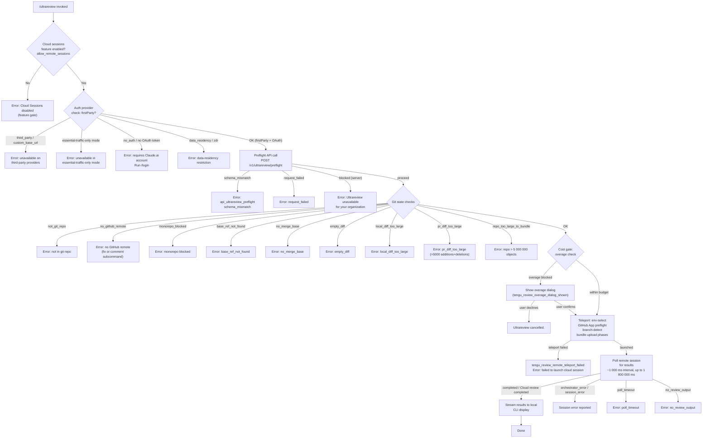

# `/ultrareview`

> Analysis basis: CC v2.1.198 bundle.js (AST extraction + Claude interpretation)
> Minimum version: v2.1.198

---

## Overview

`/ultrareview` launches a cloud-hosted agent session that performs deep bug-finding and verification against the current Git branch. The command executes a multi-stage preflight pipeline (auth, git-state, remote eligibility, cost confirmation) before teleporting the local repository to a remote Claude Code on the web environment and polling for results. Estimated cost is in the range of $10–$20 USD per run (bundle.js:+9751929), with an estimated runtime of approximately 10–20 minutes (bundle.js:+9752021).

---

## Registration

| Field | Value |
|---|---|
| type | `local-jsx` |
| name | `ultrareview` |
| description | "Start a cloud agent that finds and verifies bugs in your branch ( ... , ... USD) · Runs in Claude Code on the web. See ..." |
| loc_byte | `12827564` |
| loc_byte_end | `12827834` |
| loc_line | `8656` |
| module_id | `eZl` |
| load_inline | `true` |
| arbor_handler.name | `OQf` |
| arbor_handler.fqn | `claude-2.1.198::OQf` |
| arbor_handler.kind | `AsyncFunction` |
| arbor_handler.resolution_path | `module_id` |
| arbor_handler.n_hits | `1` |

Analysis basis: CC v2.1.198 bundle.js:+12827564

The handler was resolved via `module_id` → `eZl` → export `OQf` (an `AsyncFunction`). The call graph begins at `OQf` (Arbor name), which is the authoritative entry point; the synthetic `__handler_ultrareview` bookkeeping label is not a real bundle symbol.

---

## Input Branching

The command has more than three distinct branching paths based on auth state, git state, remote eligibility, preflight API response, cost gate, and session outcome.



---

## Behavioral Spec

### 1. Entry Point — Handler (`OQf`)

Analysis basis: CC v2.1.198 bundle.js:+12825041

```
async function ultrareviewHandler(commandArgs, appState):

    # 1a. Feature gate: check allow_remote_sessions setting
    if not featureEnabled("allow_remote_sessions", appState):
        emit error "Cloud sessions disabled"
        return

    # 1b. Auth provider classification (nG → js → d2t)
    providerClass = classifyAuthProvider(appState)
    # providerClass ∈ {firstParty, third_party_provider, custom_base_url,
    #                   no_auth, essential-traffic-only, data_residency, zdr}
    if providerClass != "firstParty":
        emit appropriate blocking error message
        return

    # 1c. Parse subcommand / flags from commandArgs (e → t.replace)
    parsedArgs = parseCommandArgs(commandArgs)
    # Recognises: --fix, --comment flags (YGo → vcr)
    # Recognises /code-review ultra alias (bundle.js:+12786661)

    # 1d. Run /v1/ultrareview/preflight API call (Lcr → Egt)
    preflightResult = await callPreflightAPI("/v1/ultrareview/preflight", appState)
    if preflightResult.status in {schema_mismatch, request_failed, blocked}:
        emit error; telemetry tengu_review_remote_precondition_failed
        return

    # 1e. Git and diff checks (Lcr → BM, tm, Dn, GM, Hy, XWn, OMo, Xhl)
    gitState = await collectGitState(appState)
    if gitState.error:
        emit error; telemetry tengu_review_remote_precondition_failed
        return

    # 1f. Overage / cost gate (OQf → V → UEt)
    if spendLimitExceeded(appState):
        telemetry tengu_review_overage_blocked
        confirmed = await showOverageDialog()
        telemetry tengu_review_overage_dialog_shown
        if not confirmed:
            emit "Ultrareview cancelled."
            return

    # 1g. Teleport to remote environment (OQf → xcr → OQl → JW → Mbe → igl)
    sessionResult = await teleportToRemote(parsedArgs, gitState, appState)
    if sessionResult.error:
        telemetry tengu_review_remote_teleport_failed
        emit "Ultrareview failed to launch the cloud session…"
        return

    # 1h. Poll for results (OQf → PQf → kcr → igl)
    await pollAndStreamResults(sessionResult.sessionId, appState)
    # On --fix flag: apply findings to local working tree (bundle.js:+12824778)
```

Analysis basis: CC v2.1.198 bundle.js:+12825041–12825900

---

### 2. Auth-Provider Classification (`nG` / `js` / `d2t`)

Analysis basis: CC v2.1.198 bundle.js:+3416820

```
function classifyAuthProvider(appState):
    settings = getSettings(appState)

    if settings.telemetryLevel == "essential-traffic":
        return "essential-traffic-only"       # blocked (bundle.js:+12784839)

    providerType = detectProvider(settings)
    # providerType literals:
    #   "firstParty"            (bundle.js:+3415953)
    #   "third_party_provider"  (bundle.js:+3415972)
    #   "custom_base_url"       (bundle.js:+3416031)
    #   "no_auth"               (bundle.js:+3416177)

    if providerType == "no_auth":
        return "no_auth"    # → "Ultrareview requires a Claude.ai account…"

    oauthScopes = getOAuthScopes(settings)
    if "allow_product_feedback" not in oauthScopes:
        return "oauth_no_inference_scope"

    return providerType
```

Analysis basis: CC v2.1.198 bundle.js:+3415909

---

### 3. Git State Collection (`Lcr` → multiple git helpers)

Analysis basis: CC v2.1.198 bundle.js:+12786706

```
async function collectGitState(appState):
    # 3a. Verify inside a git work-tree (Egt: git rev-parse --is-inside-work-tree)
    insideRepo = await gitExec(["rev-parse", "--is-inside-work-tree"])
    if failed: return {error: "not_git_repo"}

    # 3b. Resolve remote URL (BM → git config --get remote.origin.url)
    remoteUrl = await getGitRemoteUrl()
    if not remoteUrl: return {error: "no_github_remote"}

    # Sanitise credentials from URL (Snt → replace "://***@")
    remoteUrl = sanitiseCredentials(remoteUrl)

    # 3c. Normalise URL: strip www., ensure github.com host (tm → rDt)
    normalUrl = normaliseGitUrl(remoteUrl)
    if not normalUrl.includes("github.com"):
        return {error: "no_github_remote"}    # bundle.js:+12787094

    # 3d. Block anthropic/anthropics monorepos (bundle.js:+12787478, +12787515)
    if isAnthropicMonorepo(normalUrl):
        return {error: "monorepo_blocked"}     # bundle.js:+12787589

    # 3e. Fetch PR diff stats via GitHub CLI
    #     gh pr view --repo REPO --json additions,deletions,changedFiles
    #     (bundle.js:+12787904, +12787913)
    prStats = await ghPrView(normalUrl)
    if prStats.additions + prStats.deletions > 5000:   # bundle.js:+12787958
        return {error: "pr_diff_too_large"}             # bundle.js:+12788168

    # 3f. Count git objects (Xhl: git count-objects -v)
    objCount = await gitCountObjects()
    if objCount > 5_000_000:                            # bundle.js:+9458912
        return {error: "repo_too_large_to_bundle"}      # bundle.js:+12788595

    # 3g. Verify base ref exists (git --verify --quiet <ref>) (bundle.js:+12788828)
    baseRefOk = await verifyBaseRef()
    if not baseRefOk: return {error: "base_ref_not_found"} # bundle.js:+12788992

    # 3h. Detect default branch (GM: git symbolic-ref --short refs/remotes/origin/HEAD)
    #     Fallback to "main" then "master" (bundle.js:+1180663, +1180670)
    defaultBranch = await detectDefaultBranch()

    # 3i. Detect current branch (Hy: git branch --abbrev-ref HEAD)
    currentBranch = await detectCurrentBranch()

    # 3j. Find merge base (git merge-base) (bundle.js:+12789244)
    mergeBase = await findMergeBase(currentBranch, defaultBranch)
    if not mergeBase: return {error: "no_merge_base"} # bundle.js:+12789460

    # 3k. Diff shortstat (git diff --shortstat) (bundle.js:+12789777)
    diffStat = await gitDiffShortStat(mergeBase)
    if diffStat is empty: return {error: "empty_diff"}       # bundle.js:+12789943

    # Local diff size guard (bundle.js:+12790263)
    if diffTooLarge(diffStat): return {error: "local_diff_too_large"}

    return {remoteUrl, normalUrl, defaultBranch, currentBranch, mergeBase, diffStat}
```

Analysis basis: CC v2.1.198 bundle.js:+12786706–12790102

---

### 4. Preflight API Call (`OQl`)

Analysis basis: CC v2.1.198 bundle.js:+12784670

```
async function callPreflightAPI(endpoint, appState):
    # endpoint = "/v1/ultrareview/preflight" (bundle.js:+12784745)
    headers = buildHeaders(appState)
    # Includes teleport-org header when applicable (bundle.js:+12784779)

    response = await httpGet(endpoint, headers)

    if response.status == "blocked":                # bundle.js:+12784521
        return {error: "blocked",
                message: "Ultrareview is unavailable for your organization."}
                # bundle.js:+12790862

    if schemaInvalid(response):
        telemetry "tengu_review_remote_precondition_failed"
        return {error: "schema_mismatch"}           # bundle.js:+12785394

    if requestFailed(response):
        telemetry "tengu_review_remote_precondition_failed"
        return {error: "request_failed"}            # bundle.js:+12785555

    if response.status == "proceed":               # bundle.js:+12790644
        return {ok: true, serverPayload: response.data}

    if response.status == "needs-confirm":         # bundle.js:+12791024
        return {ok: true, requiresConfirm: true}

    if response.status == "server":                # bundle.js:+12790825
        return {error: "server"}
```

Analysis basis: CC v2.1.198 bundle.js:+12784670–12785555

---

### 5. Teleport Pipeline (`xcr` → `OQl` → `JW`)

Analysis basis: CC v2.1.198 bundle.js:+12790620

The teleport pipeline proceeds through four named phases logged to the console:

#### Phase: env-select (bundle.js:+9482953)

```
async function envSelect(appState):
    # Fetch available remote environments (Qoe: teleport_environments_list)
    envList = await listRemoteEnvironments(appState)

    if envList.empty:
        # Auto-create default cloud env if none exist (bundle.js:+9483061)
        defaultEnv = await createDefaultEnv("Default", "anthropic_cloud")
        if failed:
            emit "Could not create a cloud environment…"  # bundle.js:+9483219
            return {error: "env_create"}

    selectedEnv = chooseEnvironment(envList)
    if not selectedEnv: return {error: "no_environments"}  # bundle.js:+9484358

    return {selectedEnv}
```

#### Phase: branch-detect (bundle.js:+9484758)

```
async function branchDetect(gitState, parsedArgs):
    if parsedArgs.explicitSourceUrl:
        return {sourceMode: "explicit_source_url"}  # bundle.js:+9484969

    if not gitState.hasGit:
        return {sourceMode: "no_git_at_all"}        # bundle.js:+9484991

    # GitHub App preflight check (IVe: checkGithubAppInstalled)
    #   Requires access token + org UUID (bundle.js:+7996196, +7996309)
    githubPreflightOk = await checkGithubAppInstalled(appState, gitState)
    telemetry githubPreflightOk ? "tengu_ccr_bundle_seed_enabled" : (emit warning)

    # Decide source mode
    if githubPreflightOk and not forceBundleEnv:
        sourceMode = "github"       # bundle.js:+9485768
    else:
        sourceMode = "bundle"       # CCR_FORCE_BUNDLE or app not installed
    return {sourceMode}
```

#### Phase: bundle-upload (bundle.js:+9486350) [when sourceMode == "bundle"]

```
async function bundleUpload(gitState, sessionContext):
    # Xko: teleport_git_bundle_upload
    # Stash uncommitted changes into refs/seed/stash (bundle.js:+9461598)
    stashRef = await gitStashCreate()
    if stashFailed: return {error: "stash_failed"}

    # Create seed bundle file (ccr-seed + .bundle) (bundle.js:+9462793)
    bundlePath = createTempBundle("ccr-seed", ".bundle")

    # Upload bundle via signed URL (bundle.js:+9462804)
    uploadResult = await uploadBundleToSignedUrl(bundlePath)
    telemetry "tengu_ccr_bundle_upload"

    if uploadResult.status == "success":
        return {bundleMode: "head"}             # bundle.js:+9463401
    else:
        return {error: "upload_failed"}         # bundle.js:+9463249
```

#### Phase: POST-sent / session create (bundle.js:+9488468)

```
async function createRemoteSession(env, sourceMode, gitState, parsedArgs, appState):
    # JW orchestrates session creation
    # API endpoint: /v1/code/sessions or /v1/sessions depending on version
    #   (bundle.js:+9478744, +9478764)
    # Headers include x-organization-uuid (bundle.js:+9478799)
    #             and anthropic-beta header (bundle.js:+9478837)

    payload = buildSessionPayload(env, sourceMode, gitState, parsedArgs)
    # payload.type = "ultrareview" (bundle.js:+12792835)
    # payload.source = {mode: sourceMode, bundleRef?, githubRef?}
    # payload.task title generated via XHf (teleport_generate_title)

    response = await httpPost(sessionEndpoint, payload, headers)

    if response.status == 401 or 403:
        return {error: "github_repo_access_denied"}  # bundle.js:+9481912
    if response.status == 201:                        # bundle.js:+9481786
        if not response.data.sessionId:
            return {error: "malformed_response"}      # bundle.js:+9482650
        telemetry "tengu_ccr_session_link"
        telemetry "tengu_teleport_bundle_mode"
        return {sessionId: response.data.sessionId}
```

Analysis basis: CC v2.1.198 bundle.js:+9478709–9491060

---

### 6. Remote Session Polling (`Mbe` → `igl`)

Analysis basis: CC v2.1.198 bundle.js:+9501755

```
async function pollRemoteSession(sessionId, appState):
    pollInterval  = 1_000     ms  # bundle.js:+9503436 (1 000 ms)
    pollTimeoutMs = 1_800_000 ms  # bundle.js:+9503443 (30 minutes)
    startTime = Date.now()

    loop:
        if Date.now() - startTime > pollTimeoutMs:
            return {error: "poll_timeout"}         # bundle.js:+9506250

        sessionState = await fetchSessionState(sessionId)

        match sessionState.status:
            "pending"  | "running" | "starting":
                wait pollInterval; continue

            "completed":
                result = extractReviewResult(sessionState)
                if not result:
                    return {error: "no_review_output"} # bundle.js:+9506265
                emit "Cloud review completed"           # bundle.js:+9506071
                return {ok: true, result}

            "archived":
                return {error: "orchestrator_error"}   # bundle.js:+9506182

            "session_error":
                return {error: "session_error"}        # bundle.js:+9506228

        # Handle hook events from remote agent during poll
        if sessionState.events include "hook_progress":
            streamProgressToTerminal(sessionState.hookProgress)
        if sessionState.events include "hook_response":
            processHookResponse(sessionState.hookResponse)
        if sessionState.events include "SessionStart":
            logSessionStarted()
```

Analysis basis: CC v2.1.198 bundle.js:+9501755–9506944

---

### 7. `--fix` Flag Application

Analysis basis: CC v2.1.198 bundle.js:+12824778

When the user invokes `/ultrareview --fix`, a supplementary instruction is appended to the agent task payload (content starting with "The user passed --fix: when the findings arrive…"). After polling completes successfully, the local handler applies the returned diff/patches to the working tree.

---

### 8. Subcommand: `--comment` / `fix` / `comment` Flags (YGo → vcr)

Analysis basis: CC v2.1.198 bundle.js:+12786569

```
function parseUltrareviewArgs(rawArgs):
    trimmed = rawArgs.trim()
    tokens  = trimmed.split()

    knownSubcommands = {"fix", "comment"}     # bundle.js:+12786576, +12786582
    # Also recognises alias "/code-review ultra" (bundle.js:+12786661)

    flags = {}
    for token in tokens:
        if token == "fix":     flags.fix     = true
        if token == "comment": flags.comment = true

    return flags
```

---

### 9. PR Size Guard (`OMo`)

Analysis basis: CC v2.1.198 bundle.js:+9752142

```
function checkPRSize(additions, deletions):
    total = additions + deletions
    # Hard limit sourced from gh pr view JSON (bundle.js:+12787958)
    if total > 5_000:
        return {blocked: true, reason: "pr_diff_too_large"}
    # Soft warning thresholds (bundle.js:+9752254, +9752288)
    if total > 500:
        warnSlowReview(estimatedMinutes: "~10–20 min")
    return {blocked: false}
```

---

## State & Side Effects

| Item | Detail |
|---|---|
| Telemetry: `tengu_review_remote_precondition_failed` | Fired on any pre-launch blocking condition (auth, git, API) — bundle.js:+12786708 |
| Telemetry: `tengu_review_overage_blocked` | Fired when spend limit is exceeded before showing dialog — bundle.js:+12825296 |
| Telemetry: `tengu_review_overage_dialog_shown` | Fired when overage cost-confirmation dialog is displayed — bundle.js:+12825633 |
| Telemetry: `tengu_review_remote_teleport_failed` | Fired when the teleport/session-create step fails — bundle.js:+12793739 |
| Telemetry: `tengu_review_remote_launched` | Fired on successful remote session launch — bundle.js:+12794415 |
| Telemetry: `tengu_review_bughunter_config` | Fired when bughunter configuration is resolved — bundle.js:+9751812 |
| Telemetry: `tengu_ccr_bundle_max_bytes` | Records the maximum bundle byte size check — bundle.js:+9458294 |
| Telemetry: `tengu_ccr_bundle_seed_enabled` | Fired when seed bundle mode is chosen — bundle.js:+7998692 |
| Telemetry: `tengu_ccr_bundle_upload` | Fired on each bundle upload attempt — bundle.js:+9461790 |
| Telemetry: `tengu_teleport_bundle_mode` | Records which bundle source mode was selected — bundle.js:+9480634 |
| Telemetry: `tengu_ccr_session_link` | Fired when a session ID is successfully returned — bundle.js:+9471804 |
| Telemetry: `tengu_teleport_source_decision` | Records the source decision (github / bundle / empty) — bundle.js:+9487260 |
| Telemetry: `tengu_feature_ok` / `tengu_feature_bad` / `tengu_feature_sad` | General feature flag outcome signals — bundle.js:+1039573, +1039640, +1039721 |
| Telemetry: `tengu_daemon_yield` | Background daemon yields to foreground process — bundle.js:+18397025 |
| Telemetry: `tengu_daemon_control` | Daemon lifecycle control events — bundle.js:+18414881 |
| Telemetry: `tengu_bg_*` | Background worker lifecycle events (low-mem, spare, SIGKILL escalation) |
| File writes | Temporary Git bundle file created at path containing `ccr-seed` + `.bundle` suffix (bundle.js:+9462793, +9462804); `_source_seed.bundle` fallback (bundle.js:+9463100). Cleaned up via `Dyt.unlink` on completion. |
| appState changes | Session link URL stored after successful launch; overage-confirmed flag set in state |
| Network | POST to `/v1/ultrareview/preflight` (bundle.js:+12784745); POST to `/v1/code/sessions` or `/v1/sessions` (bundle.js:+9478744, +9478764); authenticated with OAuth token + `x-organization-uuid` header (bundle.js:+9478799) |
| GitHub CLI | Invokes `gh pr view --repo … --json additions,deletions,changedFiles` (bundle.js:+12787904) with a 5 000 ms timeout (bundle.js:+12787958) |
| Git operations | `rev-parse --is-inside-work-tree`, `config --get remote.origin.url`, `symbolic-ref`, `branch --abbrev-ref HEAD`, `merge-base`, `diff --shortstat`, `count-objects -v`, `stash create`, `update-ref`, `for-each-ref`, `bundle create` |
| Admin settings link | Surfaces `/admin-settings/` URL (bundle.js:+12825418) when org policy blocks the feature |

---

## Version History

| Version | Change |
|---|---|
| v2.1.198 | Initial analysis |

---

## Common Mistakes

1. **Using with a non-Claude.ai auth provider.** The command requires a first-party OAuth session (`/login`). API-key-only setups (`no_auth`, `third_party_provider`, `custom_base_url`) are hard-blocked (bundle.js:+12785022, +12785155).
2. **Running outside a Git repository.** The command runs `git rev-parse --is-inside-work-tree` early; if it fails, the command aborts with `not_git_repo` (bundle.js:+7996049).
3. **No GitHub remote configured.** The remote URL must resolve to `github.com`. SSH or HTTPS remotes pointing elsewhere (GitLab, Bitbucket, bare IPs) will receive `no_github_remote` (bundle.js:+12787094).
4. **Anthropic monorepo.** Repositories whose remote URL contains `anthropics` or `anthropic` as the owner are explicitly blocked with `monorepo_blocked` (bundle.js:+12787589).
5. **PR diff exceeds 5 000 lines.** GitHub CLI is queried for `additions + deletions`; if the total exceeds 5 000, the command aborts before launching the cloud session (bundle.js:+12787958).
6. **Repository exceeds 5 000 000 objects.** The local `git count-objects -v` result is checked; oversized repos are rejected with `repo_too_large_to_bundle` (bundle.js:+9458912).
7. **No commits in repository.** An empty repository (`Repository has no commits yet`) cannot be bundled and causes an early abort (bundle.js:+9461908).
8. **Expecting an instant result.** The cloud agent takes approximately 10–20 minutes (bundle.js:+9752021) and polling runs for up to 30 minutes (1 800 000 ms, bundle.js:+9503443).
9. **Using in essential-traffic-only mode.** Network-restricted environments that set `essential-traffic` telemetry level block the command entirely (bundle.js:+12784839).
10. **Cancelling mid-session.** If the user cancels during polling, the remote session continues running on the cloud but results will not be delivered locally (`Ultrareview cancelled.` — bundle.js:+12825922).

---

## Appendix — Identifier Mapping

> For bundle debugging only. Identifiers change across versions.

| Identifier | Role |
|---|---|
| `OQf` | Main handler for `/ultrareview` (AsyncFunction, Arbor-resolved) |
| `nG` | Auth provider resolver; calls `js` to classify provider type |
| `js` | Provider-type classification function (firstParty / third_party / etc.) |
| `q9i` | Sub-helper within provider classification |
| `rG` | Telemetry-level / scope validator |
| `O$` | Auth settings extractor |
| `d2t` | Provider detail builder (emits firstParty, third_party_provider, etc.) |
| `qi` | Telemetry-consent check helper |
| `wSs` | Telemetry string resolver |
| `Tye` | Auth-scope inference helper |
| `st` | String normalization utility |
| `YGo` | Argument parser (subcommands: fix, comment) |
| `vcr` | Tokenizer for command argument string |
| `FL` | Regex-escape helper used in arg parsing |
| `tge` | Spend/billing gate helper |
| `Lcr` | Git state collector (orchestrates all git sub-checks) |
| `Egt` | Git rev-parse / is-inside-work-tree runner |
| `Pt` | Process-spawner / exec helper |
| `qhn` | Async-local-storage store getter |
| `Wr` | Child-process executor with output capture |
| `Iwe` | Low-level subprocess wrapper (stdin/stdout/stderr) |
| `M5u` | ERR_CHILD_PROCESS_STDIO_MAXBUFFER handler |
| `T` | Output formatter / streamer |
| `Re` | Error logger for subprocess failures |
| `$o` | Object-merge utility |
| `sr` | Error constructor helper |
| `V` | Feature-flag evaluator |
| `Ke` | Feature-check wrapper |
| `BM` | Git remote URL fetcher and cacher |
| `dY` | Remote URL cache lookup |
| `wgn` | Cached-value getter |
| `Snt` | Credential-scrubbing helper (replaces `://***@`) |
| `Ele` | Git URL parser / normaliser |
| `N0s` | URL component splitter |
| `Ent` | Protocol (https/http) detector |
| `ii` | String slice/index utility |
| `tm` | github.com URL normaliser (strip www., canonicalise path) |
| `rDt` | Raw URL transformer |
| `P0s` | URL path slicer |
| `Dn` | Git command runner for PR/branch commands |
| `m` | Diff result filter and formatter |
| `UEr` | Diff output parser |
| `k` | Background worker / file-watcher scheduler |
| `tts` | Scheduled-task executor (writes/unlinks task files) |
| `tsn` | Task cleanup runner |
| `D` | Background daemon writer |
| `hSe` | Path-join helper for daemon socket paths |
| `N` | Background worker sweep / lifecycle manager |
| `I` | Terminal input handler (scroll/resize) |
| `g` | Background session manager (spawn, kill, retire) |
| `Gt` | JSON.parse wrapper |
| `OMo` | PR size guard (additions+deletions threshold check) |
| `uze` | Bughunter config evaluator |
| `nt` | State-store accessor |
| `Xhl` | Repository size checker (git count-objects) |
| `Yhl` | Count-objects runner |
| `zhl` | Object-count state accessor |
| `f` | Platform path normaliser |
| `j8` | Windows-path normaliser |
| `GM` | Default branch detector (symbolic-ref) |
| `FPr` | Cached-branch getter |
| `Hy` | Current branch detector (branch --abbrev-ref HEAD) |
| `UPr` | Cached-current-branch getter |
| `u` | Daemon stop / cleanup helper |
| `xe` | Feature-ok emitter |
| `Pe` | Feature-bad emitter |
| `Le` | Feature-sad emitter |
| `M$` | Message emitter to UI |
| `eG` | UI event builder |
| `V5e` | Transaction sender |
| `UJr` | UUID-generating session emitter |
| `l8` | Process-exit / shutdown coordinator |
| `kye` | Session shutdown caller |
| `$ye` | Timeout-clear helper |
| `Mn` | Timeout/abort race helper |
| `XWn` | Git shortstat diff-size parser (parseInt) |
| `xcr` | Teleport pipeline orchestrator |
| `OQl` | Preflight API caller (/v1/ultrareview/preflight) |
| `qGo` | Preflight response validator |
| `St` | Session-state writer |
| `_1e` | Post-teleport state accessor |
| `UEt` | Overage / spend-limit dialog controller |
| `T0` | Spend-limit state reader |
| `H0e` | Subscription/plan checker |
| `Fc` | Subscription plan resolver |
| `cE` | Auth environment builder |
| `Dt` | Timestamp + metric recorder |
| `Eo` | Subscription type resolver |
| `U3` | Array-includes check helper |
| `lb` | Subscription-tier checker (max, pro, admin, billing, owner) |
| `Di` | Plan-level comparator |
| `e4r` | Plan enum value resolver |
| `Z9r` | Plan rank comparator |
| `aZ` | Cost/time estimate formatter (`$10-$20`, `~10–20 min`) |
| `PQf` | Result-render / display pipeline |
| `kcr` | Result polling + session-status monitor |
| `Pfe` | Remote eligibility checker |
| `OVa` | Background remote eligibility evaluator |
| `w` | Away-summary debounce/rate-limiter |
| `ire` | Rate-limit checker |
| `L` | Away-summary generator |
| `v` | State-accessor for away-summary |
| `w2c` | Message-list tail reader |
| `L2c` | Away-summary message builder |
| `Cse` | CLI output formatter |
| `J_l` | Config accessor for polling |
| `c` | Polling cancellation wrapper |
| `un` | Cancellation token |
| `JW` | Cloud session create + teleport POST orchestrator |
| `wc` | Git process runner |
| `Nhl` | --project flag guard |
| `Fh` | OAuth token refresher |
| `mJn` | Session auth-scope applicator |
| `F3` | Session state recorder |
| `Zhl` | Session endpoint selector (v1alpha2 / v1) |
| `Gs` | OAuth environment resolver (local/staging/prod) |
| `Xko` | Git bundle upload handler (teleport_git_bundle_upload) |
| `kt` | Process environment getter |
| `Qhl` | Session event controller (set_permission_mode, apply_flag_settings) |
| `U8t` | Session payload builder |
| `Me` | JSON.stringify wrapper |
| `de` | Request-timeout controller |
| `zko` | Post-create session initialiser |
| `Qko` | Session event listener setup |
| `Zko` | Session teardown handler |
| `egl` | Session event loop runner |
| `Jhl` | Session link recorder (tengu_ccr_session_link) |
| `vjn` | Session validation helper |
| `XHf` | Task-title generator (teleport_generate_title) |
| `t_f` | Event filter helper |
| `Qoe` | Remote environments lister (teleport_environments_list) |
| `ygt` | Default cloud environment creator (teleport_default_environment_create) |
| `he` | String coercion utility |
| `D$` | Full state-store descriptor |
| `IVe` | GitHub App installed checker (checkGithubAppInstalled) |
| `vs` | HTTP client wrapper |
| `Z` | Voice-mode session controller (incidentally reached in call graph) |
| `ye` | Process-exit on session error |
| `fg` | Boolean coercion helper |
| `D_` | Error display helper |
| `Do` | Feature-check invoker |
| `Mbe` | Remote-agent session poller (top-level) |
| `IU` | Random-bytes ID generator |
| `DVe` | Browser-open / URL launcher |
| `CT` | Pending-state timestamper |
| `__f` | Progress renderer during polling |
| `igl` | Core polling loop (fetch status, handle events, timeout) |
| `Ofe` | CLI output type selector |
| `TE` | Terminal renderer selector |
| `DQf` | Result-list mapper |
| `wcr` | Cancellation signal handler ("Ultrareview cancelled.") |

---

Note: index built via Arbor fallback; some signals (telemetry, literals) may be missing — see arbor-fallback.js.