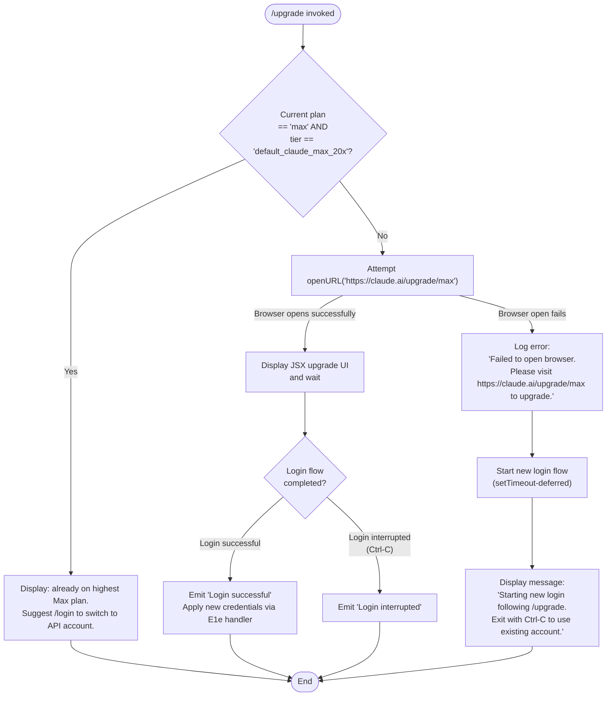

# `/upgrade`

> Analysis basis: CC v2.1.198 bundle.js (AST extraction + Claude interpretation)
> Minimum version: v2.1.198

---

## Overview

The `/upgrade` command guides a user from their current Claude subscription tier toward the **Max** plan, which provides higher rate limits and greater access to Opus models. It first checks whether the user is already on the highest Max tier (`default_claude_max_20x`); if so, it displays an informational message and suggests switching to an API-billed account via `/login`. Otherwise it attempts to open `https://claude.ai/upgrade/max` in the system browser, and if that fails it falls back to initiating a new interactive login flow.

---

## Registration

| Field | Value |
|---|---|
| type | `local-jsx` |
| name | `upgrade` |
| description | `Upgrade to Max for higher rate limits and more Opus` |
| loc_byte | `13303159` |
| loc_byte_end | `13303406` |
| loc_line | `9087` |
| module_id | `O8o` |
| load_inline | `true` |
| arbor_handler.name | `ltn` |
| arbor_handler.fqn | `claude-2.1.198::ltn` |
| arbor_handler.kind | `AsyncFunction` |
| arbor_handler.resolution_path | `module_id` |
| arbor_handler.n_hits | `0` |

Analysis basis: CC v2.1.198 bundle.js:+13303159

---

## Input Branching

Four distinct execution paths exist, requiring a flowchart.



Analysis basis: CC v2.1.198 bundle.js:+13302041, +13302127, +13302271, +13302357, +13302518, +13302557, +13302638, +13302667, +13302809, +13302861, +13302880, +13302931, +13302952

---

## Behavioral Spec

### Top-Level Handler (`ltn`) — Upgrade Entry Point

```
async function upgradeCommandHandler(context):
    authInfo = getAuthenticationInfo(context)          // calls Eo → U3, Ks
    planType = authInfo.planType                       // literal: "max"
    planTier = authInfo.planTier                       // literal: "default_claude_max_20x"

    // Already on highest tier?
    if planType == "max" AND planTier == "default_claude_max_20x":
        displayMessage(
            "You are already on the highest Max subscription plan. " +
            "For additional usage, run /login to switch to an API usage-billed account."
        )
        return

    // Otherwise try browser upgrade
    openResult = await openURLInBrowser("https://claude.ai/upgrade/max")   // calls Lc → TYr → cMi

    if openResult.success:
        // Render JSX upgrade UI; user interacts with claude.ai/upgrade/max
        renderUpgradeUI()                              // calls wac.jsx
        loginResult = await awaitLoginCompletion()    // calls E1e

        if loginResult.status == "success":
            emitMessage("Login successful")
            applyNewCredentials(loginResult)
        else:
            emitMessage("Login interrupted")
    else:
        logError(
            "Failed to open browser. " +
            "Please visit https://claude.ai/upgrade/max to upgrade."
        )
        // Deferred fallback: trigger fresh login flow
        scheduleLoginFlow(delay=0, fn=startLoginFallback)   // calls setTimeout
        displayMessage(
            "Starting new login following /upgrade. " +
            "Exit with Ctrl-C to use existing account."
        )
```

Analysis basis: CC v2.1.198 bundle.js:+13302041, +13302053, +13302127, +13302152, +13302213, +13302271, +13302357, +13302515, +13302518, +13302557, +13302638, +13302667, +13302780, +13302809, +13302861, +13302880, +13302902, +13302931, +13302952

---

### Plan Detection (`Eo` → authentication resolver)

```
function resolveAuthAndPlan(context):
    // Reads current plan from auth state
    planLabel   = readPlanType()       // checks literal "max"
    planTierKey = readPlanTier()       // checks literal "default_claude_max_20x"
    // Also invokes Ks (plan-check helper) and U3 (array membership tester)
    return { planType: planLabel, planTier: planTierKey }
```

Analysis basis: CC v2.1.198 bundle.js:+3135430, +3135451, +3135454

---

### Authentication State Reader (`cE`)

Reads the current session credential type from the app state, supporting the following provider strings: `"gateway"`, `"bedrock"`, `"foundry"`, `"anthropicAws"`, `"mantle"`, `"vertex"`, `"firstParty"`. It also resolves the OAuth profile flag (`"profile-implicit"`) and the auth kind (`"user_oauth"`).

```
function readCredentialState(appState):
    provider = determineProvider(appState)      // calls wd, wc, Qo, dI
    oauthProfile = readOAuthProfile(appState)   // calls pb → I$, aV, oR, Zit, st
    apiKey = resolveAPIKey(appState)            // checks env "ANTHROPIC_API_KEY"

    if not apiKey and not oauthProfile:
        throw Error(
            "ANTHROPIC_API_KEY, ANTHROPIC_AUTH_TOKEN, " +
            "CLAUDE_CODE_OAUTH_TOKEN, or WIF env vars " +
            "(ANTHROPIC_FEDERATION_RULE_ID + ANTHROPIC_ORGANIZATION_ID) required"
        )
    return { provider, oauthProfile, apiKey }
```

Analysis basis: CC v2.1.198 bundle.js:+3113092, +3113113, +3113121, +3113146, +3113199, +3113375, +3113391, +3116026, +3116495

---

### Browser URL Opener (`Lc` → `TYr` → `cMi`)

```
async function openURLInBrowser(url):
    // Validate URL scheme — only "http:" or "https:" are permitted
    if not url.startsWith("http:") and not url.startsWith("https:"):
        throw Error("invalid_url")

    platform = detectPlatform()    // checks "darwin", "linux", "win32"

    if platform == "linux" and DISPLAY env not set:
        return { success: false, reason: "no_display" }

    // Spawn OS opener ("open" on macOS, xdg-open on Linux, start on Windows)
    result = spawnOpener(url)

    match result.error:
        case ENOENT or exitCode == 127:   return { success: false, reason: "opener_missing" }
        case ETIMEDOUT or "timed out":    return { success: false, reason: "timeout" }
        case EACCES or EPERM:             return { success: false, reason: "spawn_error" }
        case nonzero exit:                return { success: false, reason: "nonzero_exit" }
        case None:                        return { success: true }
        default:                          return { success: false, reason: "unknown" }
```

Analysis basis: CC v2.1.198 bundle.js:+3177066, +3177102, +3177152, +3177170, +3177254, +3177313, +3177329, +3177355, +3177392, +3177480, +3177598, +3177603, +3177614, +3177644, +3177685, +3177710, +3177743, +3177777, +3177799, +3177828, +3177884, +3177929

---

### Login Completion Handler (`E1e`)

After the browser opens `https://claude.ai/upgrade/max`, `E1e` drives the post-login credential ingestion:

```
async function awaitAndApplyLogin(context, options):
    // Listen for API key change events from the OAuth callback
    onAPIKeyChange(context)                   // e.onChangeAPIKey
    applyMessageOp(context)                   // e.applyMessageOp

    // Load remote managed settings
    await loadRemoteSettings(context)         // jVe → RQ, wIo, S8n, IIo, FKa

    // Refresh policy limits
    await refreshPolicyLimits(context)        // k7t → l7o, Pfr, Nfr

    // Reload feature flags
    reloadFeatureFlags(context)               // LQn → cMn → _9i, y9i

    // Apply global config state
    applyGlobalConfig(context)                // A4 → RKa, Ugt, Hqp, Sqp, Dt

    // Update appState
    newState = context.getAppState()
    context.setAppState(newState)             // e.setAppState

    // Re-register signal handlers
    registerSignalHandlers(context)           // Si → sus.register

    // Find last assistant message to confirm completion
    lastMsg = findLastAssistantMessage()      // MEt → Jw → e.findLast("assistant")

    return { status: loginSucceeded ? "success" : "interrupted" }
```

Analysis basis: CC v2.1.198 bundle.js:+9774048, +9774067, +9774183, +9774217, +9774224, +9774237, +9774271, +9774301, +9774323, +9774352, +9774355, +9774421, +9774436, +9774473, +9774479, +9774485, +9774518, +9774688, +9774771, +9774861, +9774993, +9775032, +9775135, +9775147, +9775183, +9775218, +9775222, +9775256, +9775262

---

### OAuth Profile Fetcher (`nxe`)

```
async function fetchOAuthProfile(token):
    response = await httpGet(oauthProfileURL, {
        headers: {
            "Content-Type":  "application/json",
            "Cache-Control": "no-cache"
        },
        timeout: 10000      // 10 seconds
    })

    if response is malformed:
        logEvent("oauth_profile_fetch", { error: "malformed_response_body" })
        return null

    if fetch fails (token expired etc.):
        logEvent("oauth_profile_token_failed")
        return null

    return parseProfile(response)
```

Analysis basis: CC v2.1.198 bundle.js:+2178827, +2178881, +2178928, +2178943, +2178962, +2178978, +2178998, +2179011, +2179035, +2179090, +2179096, +2179175

---

### Remote Managed Settings Subsystem (`wIo`)

Called during login completion to pull enterprise-managed settings:

```
async function pullRemoteSettings(context):
    // Compute SHA-256 hash of current settings for cache validation
    currentHash = createHash("sha256").update(settingsJSON).digest("hex")

    fetchResult = await fetchRemoteSettings()   // kqp → HTTP GET

    match fetchResult.status:
        case 304:   // Not Modified
            log("Remote settings: Cache still valid (304 Not Modified)")
            telemetry("remote_managed_settings_pull", { result: "not_modified" })
        case 200:
            if userMustApproveNewSettings():
                showSecurityDialog()            // wKa → V, CKa, E8n.jsx
                // Emits: tengu_managed_settings_security_dialog_shown
                if userAccepted:
                    // tengu_managed_settings_security_dialog_accepted
                    applySettings(fetchResult.body)
                    log("Remote settings: Applied new settings successfully")
                    telemetry(result: "updated")
                else:
                    // tengu_managed_settings_security_dialog_rejected
                    log("Remote settings: User rejected new settings, using cached settings")
        case 404:
            saveEmptySentinel()
            log("Remote settings: Saved empty sentinel (404 response)")
            telemetry(result: "no_content")
        default (error):
            if staleCache available:
                log("Remote settings: Using stale cache after fetch failure")
            else:
                log("Remote settings: Using stale cache after error")
            telemetry("remote_managed_settings_unexpected")
```

Analysis basis: CC v2.1.198 bundle.js:+8086342, +8086393, +8086523, +8086554, +8086562, +8086572, +8086602, +8086629, +8086632, +8086676, +8086727, +8086893, +8087035, +8087142, +8087166, +8087195, +8087348, +8087377, +8087476, +8087582, +8087683, +8087773, +8087822, +8088337

---

### Policy Limits Loader (`k7t` → `Nfr` → `t_c`)

```
async function loadPolicyLimits(context):
    // Cancel any existing watcher
    clearExistingWatcher()

    result = await fetchPolicyLimits()   // t_c → HTTP GET with OAuth token
    // telemetry: tengu_policy_limits_fetch

    match result:
        case in_flight timeout:
            log("Policy limits: Loading promise timed out, resolving anyway")
        case 304:
            log("Policy limits: Cache still valid (304 Not Modified)")
        case success:
            log("Policy limits: Applied new restrictions successfully")
            telemetry(tengu_policy_limits_fetch, { status: "succeeded" })
        case 404:
            log("Policy limits: No restrictions (cached empty)")
        case stale fallback:
            log("Policy limits: Using stale cache after fetch failure")
            telemetry(status: "stale_cache_used")
        case error:
            log("Policy limits: Using stale cache after error")
            telemetry(status: "unexpected_error")
```

Analysis basis: CC v2.1.198 bundle.js:+14229567, +14229573, +14229620, +14229768, +14229805, +14229835, +14233176, +14233219, +14233245, +14233271, +14233284, +14233290, +14233305, +14233321, +14233329, +14233356, +14233382, +14233394, +14233437, +14233474, +14233809, +14233996, +14234064, +14234161, +14234259, +14234380, +14234435, +14234539, +14234572, +14235247, +14235311, +14235344, +14235396, +14235450, +14235456, +14235463, +14235485, +14235496, +14235516, +14235522, +14235524

---

## State & Side Effects

| Item | Detail |
|---|---|
| Telemetry: `tengu_feature_ok` | Fired on successful feature flag check (bundle.js:+1039573) |
| Telemetry: `tengu_feature_bad` | Fired on bad feature flag result (bundle.js:+1039640) |
| Telemetry: `tengu_feature_sad` | Fired on feature flag error (bundle.js:+1039721) |
| Telemetry: `tengu_managed_settings_security_dialog_shown` | Remote settings dialog displayed to user (bundle.js:+8077725) |
| Telemetry: `tengu_managed_settings_security_dialog_accepted` | User approved new managed settings (bundle.js:+8078062) |
| Telemetry: `tengu_managed_settings_security_dialog_rejected` | User rejected new managed settings (bundle.js:+8078221) |
| Telemetry: `tengu_policy_limits_fetch` | Policy limits fetch lifecycle event (bundle.js:+14233476) |
| Telemetry: `tengu_disable_bypass_permissions_mode` | Bypass-permissions mode disabled during upgrade (bundle.js:+14108734) |
| Telemetry: `tengu_auto_mode_config` | Auto-mode configuration event during session re-init (bundle.js:+14106420) |
| Telemetry: `tengu_daemon_config_reload` | Daemon config reloaded following credential change (bundle.js:+18392244) |
| Browser open | Attempts to launch OS default browser at `https://claude.ai/upgrade/max` (bundle.js:+13302518) |
| `setTimeout` fallback | Deferred login flow scheduled with `setTimeout` when browser cannot be opened (bundle.js:+13302357) |
| `appState` changes | `e.getAppState` / `e.setAppState` called to persist new credentials (bundle.js:+9774688, +9774861) |
| Signal handler re-registration | `sus.register` called via `Si` after login completion (bundle.js:+69675) |
| Remote settings refresh | Full `wIo` pull executed post-login (bundle.js:+8088311) |
| Policy limits refresh | `k7t` → `Nfr` → `t_c` fetch cycle executed post-login (bundle.js:+14235516) |
| Feature flag reload | `LQn` → `cMn` → `_9i` / `y9i` refreshes GrowthBook payload (bundle.js:+9774421) |
| Credential storage | Secure storage write attempted via `dfi`; plaintext fallback used if primary fails (bundle.js:+2390523, +2390621, +2390770, +2390873) |
| Account-change bridge log | `"[bridge:repl] Account changed via /login — disconnecting Remote Control session"` logged on account switch (bundle.js:+9774773) |

---

## Version History

| Version | Change |
|---|---|
| v2.1.198 | Initial analysis |

---

## Common Mistakes

1. **Running `/upgrade` when already on the 20× Max tier.** The command detects plan tier `default_claude_max_20x` and immediately prints an informational message rather than opening a browser. There is nothing further to do — use `/login` instead to switch to an API-billed account.
2. **Expecting the browser flow to complete instantly.** The handler opens `https://claude.ai/upgrade/max` and then awaits a callback; if the browser window is closed without completing the OAuth handshake the login is recorded as "interrupted" and no credential change is applied.
3. **Assuming the command works in headless or display-less environments.** On Linux without a `$DISPLAY` variable set, the browser-open step returns `no_display` and the fallback login flow is used instead. Rate limits will not change until the OAuth round-trip completes.
4. **Ignoring the browser-open failure message.** If the OS opener is missing or times out, a `Failed to open browser` message is printed and a text-based login flow begins automatically. Users must follow that flow to completion for the upgrade to take effect.
5. **Not waiting for the full post-login re-init.** After a successful upgrade OAuth callback, the handler re-fetches remote managed settings, policy limits, and feature flags. Interrupting the session (Ctrl-C) before these complete may leave the session in a partially-updated state.

---

## Appendix — Identifier Mapping

> For bundle debugging only. Identifiers change across versions.

| Identifier | Role |
|---|---|
| `ltn` | Top-level async upgrade command handler (entry point) |
| `Eo` | Auth + plan resolver; reads plan type and tier |
| `cE` | Credential state reader; resolves provider and API key |
| `wd` | CLI argument / flag parser |
| `st` | String-to-boolean coercion helper (`"yes"`, `"on"` → true) |
| `aIr` | `--bare` flag handler |
| `pb` | OAuth profile object builder |
| `mTn` | OAuth token initializer |
| `Zit` | Profile implicit mode setter |
| `I$` | Auth-kind discriminator |
| `aV` | OAuth token file descriptor reader |
| `oR` | API key resolver (checks `ANTHROPIC_API_KEY`, `flagSettings`) |
| `U3` | Array membership checker (plan-tier list) |
| `wc` | Provider label mapper (`"gateway"`, `"bedrock"`, etc.) |
| `mr` | Provider type canonicalizer |
| `dI` | Auth method discriminator |
| `Pw` | API authentication driver; throws on missing credentials |
| `JFt` | Auth pre-flight validator |
| `hZe` | VSCode integration check (`"claude-vscode"`) |
| `qOt` | OAuth token file descriptor rewriter |
| `Dt` | Timestamp / request-metadata recorder |
| `d$` | Token slicer (truncates tokens to 20 chars for display) |
| `e$t` | OAuth implicit profile enricher |
| `nxe` | OAuth profile HTTP fetcher (10 000 ms timeout) |
| `Gs` | OAuth URL builder / endpoint resolver |
| `HSs` | Environment-based URL selector |
| `Uvu` | URL environment category classifier |
| `Xni` | OAuth profile parser and validator |
| `St` | HTTP response shape validator |
| `V` | React/JSX element factory |
| `Pe` | React/JSX component base |
| `T` | Terminal output renderer (writes / flushes) |
| `Hiu` | Output stream line formatter |
| `Me` | JSON serializer helper |
| `Oc` | REDACTED-masking formatter (redacts after 2 chars) |
| `YZe` | Output operation builder |
| `biu` | CLI subprocess spawner (1 000 ms initial delay, max 100 items) |
| `o` | Padded column output writer |
| `xe` | Secondary JSX element factory |
| `D_` | OAuth profile token decoder |
| `Re` | Error logger with structured context |
| `sr` | Error factory (wraps with String) |
| `qi` | Traffic-class selector (`"essential-traffic"`, `"no-telemetry"`, `"default"`) |
| `wSs` | Traffic-class string builder |
| `jvu` | Telemetry ring-buffer manager (shift/push) |
| `Lc` | Browser URL opener orchestrator |
| `TYr` | URL validation and opener dispatcher |
| `aBd` | URL scheme validator (`"http:"` / `"https:"`) |
| `cMi` | Platform-specific open command executor (`"open"`, `"linux"`, `"darwin"`) |
| `HH` | macOS `open` command builder |
| `lMi` | Linux `xdg-open` / `jt` dispatcher |
| `cBd` | Browser-open exit-code classifier (ENOENT, ETIMEDOUT, EACCES, etc.) |
| `Dn` | Windows `start` command wrapper |
| `Fc` | Post-login credential applicator (calls `cE` + `Dt`) |
| `E1e` | Full login-completion handler; orchestrates credential + state update |
| `uZe` | Timestamp helper (`Date.now`) |
| `jVe` | Remote settings + policy subsystem bootstrapper |
| `$Ka` | Remote settings pre-check |
| `BVe` | Settings diff detector |
| `Dks` | Settings cache reader |
| `RQ` | Remote settings HTTP client |
| `Tle` | HTTP response unwrapper |
| `ble` | HTTP request builder |
| `h2e` | HTTP header injector |
| `Fm` | Fetch middleware compositor |
| `fu` | HTTP transport factory |
| `QS` | Plan-settings resolver |
| `n$t` | Settings merge helper |
| `S8n` | Settings persistence writer (`gD.notifyChange`) |
| `Pks` | Settings cache writer |
| `IIo` | Remote settings loader with consent-dialog guard |
| `PKa` | Settings consent payload builder |
| `vKa` | Consent timeout guard ("Loading promise timeout deferred") |
| `wIo` | Full remote managed-settings pull cycle |
| `Rwe` | Settings cache validator |
| `TOr` | Cache-freshness checker |
| `Mks` | Settings hash comparator |
| `Njn` | Settings SHA-256 hasher (`rqa.createHash`) |
| `kqp` | Settings HTTP GET executor |
| `Le` | JSX list renderer |
| `xnt` | Settings JSON parser |
| `TIo` | Settings application orchestrator (`Promise.all`) |
| `Ke` | Component key allocator |
| `MKa` | Remote settings change notifier |
| `wKa` | Settings security dialog renderer |
| `LKa` | Settings dialog container (`jc`) |
| `DKa` | Settings file writer (opens, writes 384-byte buffer, datasync, closes) |
| `UKa` | Auth-change settings refresher |
| `FKa` | Background settings poll scheduler |
| `SMn` | Interval-based poller (setInterval / clearInterval) |
| `Mqp` | Settings background poll executor |
| `Si` | Signal handler registrar (`sus.register`) |
| `CQn` | Deep-equality checker for session state (`Bun.deepEquals`) |
| `fTr` | Session state comparator |
| `Hn` | Session-update applicator |
| `UHn` | Session credential updater |
| `x3` | Full session state rebuilder |
| `f` | Process relaunch executor (`execRelaunch`) |
| `j8` | Path normalizer for relaunch (`iN.normalize`, `jt`, `replaceAll("windows")`) |
| `LQn` | Feature-flag reload orchestrator |
| `yln` | GrowthBook client initializer |
| `DV` | Feature flag value resolver |
| `vyl` | Feature flag cache clearer (`JMo.clear`) |
| `wce` | Feature payload writer |
| `h0e` | Feature flag default-value calculator |
| `Iyl` | Feature flag experiment-group resolver |
| `ZMo` | Feature flag overrides applier |
| `cMn` | GrowthBook payload refresher |
| `tG` | GrowthBook client getter |
| `_9i` | Feature payload parser and cache populator |
| `y9i` | Feature value snapshot builder |
| `A4` | Global config state applicator |
| `RKa` | Config reader / merger |
| `$8` | Config presence checker (`d2u.has`) |
| `Ugt` | Config section aggregator |
| `yqp` | Config section reader |
| `_qp` | Config entry filter (`fVt.has`) |
| `Hqp` | BYOC header config builder (`hqp`, `gqp`, `ANTHROPIC_CUSTOM_HEADERS`) |
| `Sqp` | Config entry upper-caser (`Eqp.has`) |
| `mqp` | Remaining config merger |
| `tT` | CA certificate cache clearer |
| `H2e` | Certificate set builder |
| `NMn` | Network config validator |
| `F1r` | CA certificate cache flusher ("Cleared CA certificates cache") |
| `W1r` | mTLS config cache flusher ("Cleared mTLS configuration cache") |
| `oOt` | Proxy agent cache flusher ("Cleared proxy agent cache") |
| `X3e` | Proxy/network settings initializer |
| `qM` | Proxy URL parser |
| `c8s` | Proxy environment variable reader |
| `rV` | Proxy URL hostname/port extractor |
| `k7t` | Policy limits loader orchestrator |
| `l7o` | Policy-limits watcher teardown |
| `u7o` | Watcher clearance helper |
| `Nye` | Policy-limits feature-flag gate |
| `Pfr` | Policy-limits fetch scheduler (`setTimeout`) |
| `O$` | Policy-limits file-path resolver |
| `N0e` | Policy-limits cache path builder (`V9i.join`) |
| `Nfr` | Policy-limits poll cycle manager |
| `t_c` | Policy-limits HTTP fetch + cache writer |
| `n_c` | Policy-limits background poller (`SMn`, `Si`) |
| `y0e` | Session cleanup helper |
| `qce` | Feature-flag teardown (`tG`, `Bat`, `$at.emit`) |
| `Bat` | GrowthBook teardown (clears all caches and intervals) |
| `zJr` | Interval/listener teardown helper |
| `r3t` | Trust-device re-enrollment handler |
| `ITo` | Permission store initializer (`no`, `Zr`) |
| `Zr` | Permission store factory (`z$e`, `sAr`, `yan.call`, `Ean.bind`) |
| `Ean` | Permission store event emitter binder |
| `FPe` | Feature-flag-gated permission checker |
| `nt` | Permission-flag evaluator (checks `k0e`, `BV`, `e2t`) |
| `Hl` | Credential storage driver (`dfi`) |
| `dfi` | Secure + plaintext credential store (read, readAsync, update, delete) |
| `W8t` | Trusted-device enrollment handler |
| `D$` | Permission-policy evaluator |
| `n2t` | Policy allow-list checker |
| `r2t` | Policy deny-list checker |
| `aMn` | Permission-assertion helper (`BJr`, `FJr`, `qJr`) |
| `S9i` | Feature-value-gated permission resolver |
| `EVp` | Permission event emitter setup |
| `ETo` | Consent-dialog gating emitter |
| `r` | CLI output-stream writer (binary, 1 024-byte chunks) |
| `As` | Fatal error handler (`process.exit`, `cli_error`) |
| `n` | Lowercase normalizer |
| `i` | Stream closer (closes `n` and `r`) |
| `jmn` | Trusted-device enrollment payload builder |
| `he` | HTTP error string coercer |
| `wyl` | Session watermark updater |
| `w7t` | Remote-control / bridge session handler |
| `xQn` | Bridge session state reader |
| `KJr` | Bridge permission-mode reader |
| `aVt` | Bridge permission update applicator |
| `$H` | Permission mode state machine (setMode, addRules, replaceRules, removeRules, addDirectories, removeDirectories) |
| `Ur` | CLI subcommand argument resolver |
| `Mrr` | Allowed-tools argument parser (`"allowed_tools"`) |
| `Co` | Tool-list compiler |
| `Drr` | Disallowed-tools argument parser (`"disallowed_tools"`) |
| `dR` | Bypass-permissions mode validator |
| `kQr` | Bypass-permissions gate checker |
| `nDo` | Auto-mode gate notification emitter |
| `L7t` | Session startup orchestrator |
| `x7t` | Full session initializer (model, mode, MCP, supervisor) |
| `CX` | MCP server configuration loader |
| `kzo` | Keyboard-interrupt handler setter |
| `xzo` | Interrupt-signal queue flusher |
| `vs` | Verbose/debug output configurator |
| `fye` | Model compatibility checker (claude-3-*, claude-opus-4-*, etc.) |
| `XNe` | Feature gate for session options (`h6`) |
| `Hnn` | Session pre-flight validator (`Afr`, `Kj`) |
| `d` | Supervisor process manager (start/stop/updateConfig) |
| `Kit` | Model string sanitizer |
| `bee` | MCP tool registration helper |
| `c3` | Context window estimator |
| `DEe` | Permission-mode change emitter (`su`, `"permission_mode_changed"`) |
| `OIe` | Session-options mapper (`Object.entries`, `$H`) |
| `MEt` | Last-message searcher orchestrator |
| `Jw` | Last assistant message finder (`e.findLast("assistant")`) |

Note: index built via Arbor fallback; some signals (telemetry, literals) may be missing — see arbor-fallback.js.