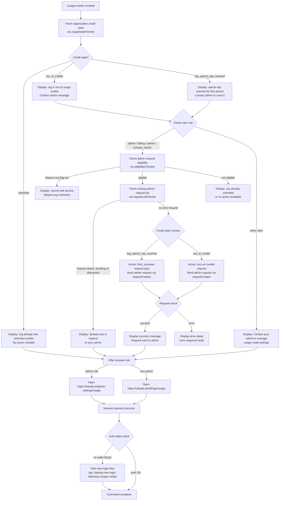

# `/usage-credits`

> Analysis basis: CC v2.1.198 bundle.js (AST extraction + Claude interpretation)
> Minimum version: v2.1.198

---

## Overview

The `/usage-credits` command allows users to configure usage credits when they have reached an API usage limit. It detects the current credit status of the organization, surfaces contextual messages about the limit state, and provides a workflow to either notify an admin or open a browser to manage credit settings — potentially triggering a fresh login flow if required.

---

## Registration

| Field | Value |
|---|---|
| type | `local-jsx` |
| name | `usage-credits` |
| description | `Configure usage credits to keep working when you hit a limit` |
| loc_byte | `9821837` |
| loc_byte_end | `9822047` |
| loc_line | `3847` |
| module_id | `fDo` |
| load_inline | `true` |
| arbor_handler.name | `P7t` |
| arbor_handler.fqn | `claude-2.1.198::P7t` |
| arbor_handler.kind | `AsyncFunction` |
| arbor_handler.resolution_path | `module_id` |
| arbor_handler.n_hits | `0` |

Analysis basis: CC v2.1.198 bundle.js:+9821837

---

## Input Branching

The command traverses multiple distinct states based on the organization's credit configuration and the user's role. Six or more distinct paths exist (unlimited credits, out-of-credits, spend-cap reached, limit-increase eligibility, admin request status, browser open flow), so a Mermaid flowchart is used.



---

## Behavioral Spec

### Main Handler — `usageCreditCommandHandler` (P7t)

Analysis basis: CC v2.1.198 bundle.js:+9820046

```
async function usageCreditCommandHandler(context):
    state = fetchUsageState(context)         // R7t: resolves org credit state
    renderJSX(usageCreditUI, state)          // pDo.jsx renderer

    launch usageCreditUIComponent(context)   // PEt: main interactive component
    trigger loginOrReauthIfNeeded(context)   // E1e: handles auth refresh
    if state requires relaunch:
        log "Starting new login following /usage-credits. Exit with Ctrl-C to use existing account."
    render finalSummaryMessage(context)      // MEt → Jw: locates last assistant message
```

### Usage State Fetcher — `usageStateFetcher` (R7t)

Analysis basis: CC v2.1.198 bundle.js:+9778959

```
function usageStateFetcher(context):
    subscriptionInfo = resolveSubscriptionType(context)   // Di
    // subscription types checked: stripe_subscription, stripe_subscription_contracted,
    //                             apple_subscription, google_play_subscription
    // plan types: "pro", "max", "team", "enterprise"

    emberLatch = initEmberLatch(context)    // nt — telemetry: tengu_ember_latch
    uiStateAdapter = buildUIStateAdapter()  // H0e
    inputConverter = buildInputConverter()  // qi → wSs → st

    return { subscriptionInfo, emberLatch, uiStateAdapter, inputConverter }
```

The "ember latch" (identified at loc_byte 9778983, telemetry event `tengu_ember_latch`) is fired at state initialization, likely recording that the user invoked the credits command.

### Subscription / Auth Type Resolution — `subscriptionResolver` (Di)

Analysis basis: CC v2.1.198 bundle.js:+3136228

```
function subscriptionResolver(context):
    authProfile = getAuthProfile(context)         // e4r
    oauthState  = getOAuthState(context)          // Z9r
    credentialState = resolveCredentials(context) // cE
        // checks: ANTHROPIC_API_KEY, ANTHROPIC_AUTH_TOKEN,
        //         CLAUDE_CODE_OAUTH_TOKEN, WIF env vars
        // profile types: "profile-implicit", "user_oauth"
        // auth mode: "firstParty", "none", "apiKeyHelper"
        // error if missing: "ANTHROPIC_API_KEY, ANTHROPIC_AUTH_TOKEN, ..."
    flagState = getFlagState(context)             // Ks

    return combined subscription state
```

### API Usage Fetch — `apiUsageFetcher` (Rde)

Analysis basis: CC v2.1.198 bundle.js:+5335130

```
async function apiUsageFetcher(authToken):
    // Endpoint: GET /api/oauth/usage
    // Timeout: 5000 ms
    // Headers: { "Content-Type": "application/json" }
    // Auth mode: "no-auth" header variant
    response = httpClient.get("/api/oauth/usage", { timeout: 5000 })

    if response 401:
        attempt token refresh → retry
        // on success, appends " (401→refresh→retry succeeded)" to log
    if response 403 and body contains "OAuth token has been revoked":
        surface token-revoked error
    return parsed usage data
```

Analysis basis: CC v2.1.198 bundle.js:+5335133, +5335297, +5335325, +5335339

### Admin Request Eligibility Check — `eligibilityChecker` (Oyl)

Analysis basis: CC v2.1.198 bundle.js:+9778245

```
async function eligibilityChecker(orgContext):
    // Endpoint: GET /api/oauth/.../api_admin_request_eligibility
    // Checks for "teleport-org" flag → blocks self-service
    // HTTP 500 threshold for error surfacing
    response = httpClient.get("api_admin_request_eligibility")
    if response.teleport_org:
        return { eligible: false, reason: "teleport-org" }
    return { eligible: true, detail: response.detail }
```

Analysis basis: CC v2.1.198 bundle.js:+9778248, +9778396, +9778428, +9778653

### Admin Request List Fetch — `requestListFetcher` (Pyl)

Analysis basis: CC v2.1.198 bundle.js:+9777894

```
async function requestListFetcher(orgUUID):
    // Endpoint: GET /api/oauth/.../api_admin_request_list
    // Returns list with "statuses" array
    response = httpClient.get("api_admin_request_list")
    statuses = response.statuses   // values: "pending", "dismissed"
    return statuses
```

Analysis basis: CC v2.1.198 bundle.js:+9777897, +9778000

### Admin Request Creator — `requestCreator` (Dyl)

Analysis basis: CC v2.1.198 bundle.js:+9777629

```
async function requestCreator(orgUUID, requestType):
    // Endpoint: POST /api/oauth/organizations/:orgUUID/admin_requests
    // requestType: "limit_increase" (spend cap) or turn-on (out_of_credits)
    payload = { type: requestType }
    response = httpClient.post("/api/oauth/organizations/:orgUUID/admin_requests", payload)

    if success:
        if requestType == "limit_increase":
            return "Request sent to your admin to increase your usage credit limit."
        else:
            return "Request sent to your admin to turn on usage credits."
    if error (Axios):
        surface response detail field
```

Analysis basis: CC v2.1.198 bundle.js:+9777632, +9777689, +9780362, +9780428

### Error Handler — `axiosErrorHandler` (Uyl)

Analysis basis: CC v2.1.198 bundle.js:+9778570

```
function axiosErrorHandler(error):
    if po.isAxiosError(error):
        extract HTTP status and body detail
        surface to caller as structured error
    else:
        rethrow
```

HTTP status 429 is also handled in the broader error path (bundle.js:+186553).

### Browser Open — `browserOpener` (Lc → TYr → cMi)

Analysis basis: CC v2.1.198 bundle.js:+3177211

```
async function browserOpener(url):
    validate url starts with "http:" or "https:"
    if invalid: throw { code: "invalid_url" }

    platform = detectPlatform()
    if platform == "darwin":
        exec "open" command
    elif no display (headless):
        return { outcome: "no_display" }
    else:
        exec platform-appropriate open command

    outcome = "browser-opened"
    return outcome
```

Admin users are directed to `https://claude.ai/admin-settings/usage`; non-admin users to `https://claude.ai/settings/usage`.

Analysis basis: CC v2.1.198 bundle.js:+9780729, +9780770, +9780837, +3175910, +3175932, +3177313, +3177355, +3177392

### Login / Reauth Flow — `loginOrReauthHandler` (E1e)

Analysis basis: CC v2.1.198 bundle.js:+9774048

```
async function loginOrReauthHandler(context):
    onChangeAPIKey(context)        // e.onChangeAPIKey
    applyMessageOp(context)        // e.applyMessageOp — "update" op
    timestamp = Date.now()         // uZe
    resolveAuthType(context)       // mr → "gateway", "bedrock", "foundry", etc.
    initConversationLoop(context)  // jVe — starts RQ, S8n, wIo, FKa
    syncFeatureFlags(context)      // CQn → Bun.deepEquals check
    getFromMuCache(context)        // mu.get

    if newAccountLogin:
        Promise.resolve()
        updateHKe()
        execRelaunch(context)      // f.execRelaunch
        // logs: "Starting new login following /usage-credits..."

    setupRemoteSettingsSync()      // LQn → cMn, vyl, wce etc.
    updateAppStateConfig()         // A4 → Ugt, Dt, Hn
    initPolicyLimits()             // k7t → l7o, Pfr, Nfr
    initFeatureFlags()             // qce → tG, Bat
    applySettings(context)         // Fc
    getAppState()                  // e.getAppState
    setAppState()                  // e.setAppState
    initTrustedDevice()            // W8t → FPe, EVp, ETo, Hl
    checkAutoMode()                // w7t → xQn → KJr
    initConversationState()        // Ur → Mrr, Drr, dR
    initModeSettings()             // L7t → x7t
    resolveMessageContext()        // MEt → Jw

    if authFailed:
        emit telemetry "authentication_failed"
        set context.system
```

Analysis basis: CC v2.1.198 bundle.js:+9774048, +9774090, +9774183, +9774323, +9820474, +9775528

### Credit State Messages

The following literal messages are emitted based on credit state:

| State key | User-visible message | loc_byte |
|---|---|---|
| `out_of_credits` | "Your organization is out of usage credits. Contact your admin to add more." | 9779386 |
| `org_spend_cap_reached` | "Your organization's usage credit cap is reached for this period. Contact your admin to raise it." | 9779551 |
| unlimited (already) | "Your organization already has unlimited usage credits. No request needed." | 9779729 |
| no self-service | "Contact your admin to manage usage credit settings." | 9779888 |
| pending request | "You've already sent a usage credit request to your admin." | 9780123 |
| limit increase sent | "Request sent to your admin to increase your usage credit limit." | 9780362 |
| credits turn-on sent | "Request sent to your admin to turn on usage credits." | 9780428 |

Analysis basis: CC v2.1.198 bundle.js:+9779341, +9779386, +9779468, +9779499, +9779551, +9779729, +9779824, +9779888, +9780054, +9780064, +9780123, +9780362, +9780428

---

## State & Side Effects

| Item | Detail |
|---|---|
| Telemetry | `tengu_ember_latch` (bundle.js:+9778983) — fired on usage-credits state init |
| Telemetry | `tengu_config_parse_error` (bundle.js:+14259169) — config read failure |
| Telemetry | `tengu_feature_ok` / `tengu_feature_bad` (bundle.js:+1039573, +1039640) — feature flag resolution |
| Telemetry | `tengu_managed_settings_security_dialog_shown/accepted/rejected` (bundle.js:+8077725, +8078062, +8078221) |
| Telemetry | `tengu_policy_limits_fetch` (bundle.js:+14233476) |
| Telemetry | `tengu_disable_bypass_permissions_mode` (bundle.js:+14108734) |
| Telemetry | `tengu_auto_mode_config` (bundle.js:+14106420) |
| Telemetry | `tengu_daemon_config_reload` (bundle.js:+18392244) |
| Network calls | `GET /api/oauth/usage` (5 s timeout); `GET api_admin_request_eligibility`; `GET api_admin_request_list`; `POST /api/oauth/organizations/:orgUUID/admin_requests` |
| Browser side effect | Opens `https://claude.ai/admin-settings/usage` (admin) or `https://claude.ai/settings/usage` (user) |
| Auth side effect | May trigger a full login/relaunch sequence via `f.execRelaunch` if no valid OAuth token |
| Hook registration | `Si` → `sus.register` (bundle.js:+69675); interval via `SMn` → `setInterval/clearInterval` |
| appState changes | `e.getAppState` / `e.setAppState` called during login handler |
| Feature flags | Synced via `CQn` using `Bun.deepEquals`; `_9i` clears and rebuilds `k0e`, `BV`, `iMn` caches |
| Remote settings | Background poll via `FKa` → `Mqp` → `wIo`; emits "Remote settings: Changed during background poll" (bundle.js:+8089246) |
| Policy limits | Loaded via `k7t` / `t_c` with stale-cache fallback; telemetry `policy_limits_load` |
| Sound | <!-- TODO: not found in depth-2 traversal; needs --depth 4 --> |

---

## Version History

| Version | Change |
|---|---|
| v2.1.198 | Initial analysis |

---

## Common Mistakes

1. **Running the command without an OAuth session**: `/usage-credits` requires an active OAuth token. If run with only `ANTHROPIC_API_KEY` set (no OAuth), the browser and admin-request flows will be unavailable; the handler will surface the "ANTHROPIC_API_KEY, ANTHROPIC_AUTH_TOKEN, CLAUDE_CODE_OAUTH_TOKEN, or WIF env vars required" error (bundle.js:+3116495).

2. **Expecting self-service in teleport-org environments**: Organizations flagged as `teleport-org` cannot use the admin request flow. The eligibility check (bundle.js:+9778396) blocks the request and shows the generic admin-contact message instead.

3. **Dismissing a pending request and re-invoking**: A request in `pending` or `dismissed` status (bundle.js:+9780054, +9780064) blocks a new submission. The command shows "You've already sent a usage credit request" rather than creating a duplicate.

4. **Expecting the command to work on `team` or `enterprise` plan without credits configured**: The subscription type resolver (`Di`) checks for `stripe_subscription`, `stripe_subscription_contracted`, `apple_subscription`, and `google_play_subscription` (bundle.js:+3135981–3136072). Plans without a recognized subscription type may not surface the full credit management flow.

5. **Interrupting the login relaunch mid-flow**: If the command triggers a new login (logged as "Starting new login following /usage-credits. Exit with Ctrl-C to use existing account." at bundle.js:+9820474), interrupting with Ctrl-C abandons the credit configuration without completing it.

---

## Appendix — Identifier Mapping

> For bundle debugging only. Identifiers change across versions.

| Identifier | Role |
|---|---|
| `P7t` | Main async handler for `/usage-credits` command (`usageCreditCommandHandler`) |
| `R7t` | Usage state fetcher — resolves org credit state and plan info |
| `Di` | Subscription / auth type resolver |
| `e4r` | Auth profile getter |
| `Z9r` | OAuth state reader |
| `cE` | Credential state resolver (checks env vars, auth modes) |
| `wd` | Bare-mode / CLI flag parser (reads `--bare`) |
| `pb` | OAuth profile builder (profile-implicit, user_oauth) |
| `wc` | HTTP client wrapper (`mr` → first-party mode) |
| `Pw` | Auth credential dispatcher (ANTHROPIC_API_KEY, apiKeyHelper, none, WIF) |
| `e$t` | Credential state helper (delegates to `Zit`) |
| `Zit` | State object constructor / normalizer |
| `T0` | UI state token (plan tier) |
| `nt` | Ember latch initializer (feature-flag aware state machine) |
| `n2t` | Feature flag name resolver |
| `r2t` | Feature flag value resolver |
| `tG` | GrowthBook experiment trigger |
| `eG` | Experiment group resolver |
| `aMn` | Feature flag cache setter (`BJr`, `k0e`) |
| `FJr` | Experiment event emitter (`GrowthbookExperimentEvent`) |
| `qJr` | Async flag fetch coordinator |
| `Dt` | Config persistence manager (read/write cycle, `SCt`, `qHm`) |
| `zt` | Config path resolver |
| `A7o` | Config directory helper |
| `SCt` | Synchronous config file reader/writer |
| `qHm` | Config file watcher and cache invalidator |
| `H0e` | UI state adapter builder (`Fc`, `Eo`) |
| `Fc` | Subscription state → UI adapter |
| `Eo` | Role-check adapter (`admin`, `billing`, `owner`, `primary_owner`) |
| `U3` | Array-includes role checker |
| `qi` | Input normalizer (delegates to `wSs`) |
| `wSs` | String normalizer for command input |
| `st` | String coercion utility |
| `PEt` | Usage credit interactive UI component |
| `lb` | Shared UI sub-component (role + subscription check) |
| `Rde` | API usage data fetcher (`GET /api/oauth/usage`) |
| `bl` | HTTP base client builder |
| `xe` | JSX element factory (success path) |
| `Le` | JSX element factory (error/alternate path) |
| `Cw` | Role-based content selector |
| `sR` | Axios error handler for usage fetch (401, 403) |
| `h$` | Token refresh cache manager (`P7r` map) |
| `T` | Logger / output writer |
| `Hiu` | Log formatter |
| `Me` | JSON serializer (`JSON.stringify`) |
| `Oc` | Log line formatter (redacts secrets, `[REDACTED]`) |
| `YZe` | Log output pipeline |
| `biu` | Process-level logger with exit handler |
| `o` | Padded column output writer |
| `Oyl` | Admin eligibility checker (`api_admin_request_eligibility`) |
| `Pyl` | Admin request list fetcher (`api_admin_request_list`) |
| `Dyl` | Admin request creator (`api_admin_request_create`) |
| `Uyl` | Axios error wrapper for admin API calls |
| `D_` | Credit state message selector |
| `he` | String coercion helper |
| `Re` | Output message renderer / queue |
| `sr` | Error-to-string converter |
| `jvu` | Message queue manager (`Bmn` shift/push) |
| `Lc` | Browser open orchestrator |
| `TYr` | URL validator and browser launcher |
| `aBd` | URL scheme validator (http/https) |
| `cMi` | Platform-specific open command dispatcher |
| `E1e` | Login / reauth handler (full account setup) |
| `uZe` | Timestamp helper (`Date.now`) |
| `mr` | Auth type resolver (gateway, bedrock, foundry, etc.) |
| `Fm` | Auth mode constant map |
| `jVe` | Conversation loop initializer |
| `$Ka` | Conversation state bootstrap |
| `BVe` | Conversation daemon starter (`Dks`) |
| `Dks` | Daemon process manager |
| `RQ` | Conversation request queue |
| `Tle` | Conversation task scheduler |
| `ble` | Conversation task executor |
| `h2e` | Conversation heartbeat |
| `fu` | Conversation flush helper (`sTn`) |
| `QS` | Queue state reader |
| `n$t` | Queue notification handler |
| `S8n` | Policy settings notifier (`gD.notifyChange`) |
| `Pks` | Policy key serializer |
| `IIo` | Remote settings loader (with consent-dialog timeout) |
| `PKa` | Remote settings payload handler |
| `vKa` | Remote settings timeout handler |
| `wIo` | Remote managed settings puller |
| `Rwe` | Settings change detector |
| `TOr` | Settings task orchestrator |
| `Mks` | Settings cache manager |
| `Njn` | Settings content hash (SHA-256) |
| `kqp` | Settings apply coordinator |
| `xnt` | Settings diff applier |
| `TIo` | Settings persistence writer (Promise.all) |
| `Ke` | React-like context reader (`OQe`) |
| `MKa` | Settings change watcher (`Wwe`) |
| `wKa` | Remote settings security check handler |
| `LKa` | Settings UI dialog launcher (`jc`) |
| `DKa` | Settings file writer (writeFile, datasync, close) |
| `UKa` | Settings apply finalizer (`AK`) |
| `FKa` | Background poll scheduler |
| `SMn` | Interval manager (setInterval / clearInterval) |
| `Mqp` | Poll cycle executor |
| `Si` | Hook registrar (`sus.register`) |
| `CQn` | Feature flag sync checker (`Bun.deepEquals`) |
| `fTr` | Feature flag snapshot fetcher |
| `Hn` | Feature flag hydrator (`UHn`, `x3`) |
| `UHn` | Flag store initializer (`Ecs`, `Scs`) |
| `x3` | Feature flag rule evaluator |
| `f` | Process relaunch wrapper |
| `j8` | Path normalizer for relaunch |
| `LQn` | Remote settings sync orchestrator |
| `yln` | Settings version resolver |
| `DV` | Settings diff validator |
| `vyl` | Settings clear helper (`JMo.clear`) |
| `wce` | Settings write coordinator |
| `h0e` | Settings hash comparator |
| `Iyl` | Settings integrity checker |
| `ZMo` | Settings module cache |
| `cMn` | Feature flag refresh handler (`tG`, `aR`, `$at.emit`) |
| `_9i` | Feature flag cache rebuilder (`k0e`, `iMn`, `BV`) |
| `y9i` | Feature flag payload serializer |
| `A4` | App state configuration updater |
| `RKa` | App state key resolver |
| `$8` | App state has-check helper |
| `Ugt` | Environment variable config merger |
| `yqp` | Environment config reader |
| `_qp` | Config entry filter (`fVt`) |
| `Hqp` | Header config merger |
| `Sqp` | Header entry filter |
| `mqp` | Config merge finalizer |
| `tT` | Flag settings updater (`flagSettings`) |
| `H2e` | Set initializer |
| `NMn` | Network mode resolver |
| `F1r` | CA certificates cache clearer |
| `W1r` | mTLS config cache clearer |
| `oOt` | Proxy agent cache clearer |
| `X3e` | Connection config applier |
| `qM` | Connection mode reader |
| `c8s` | Proxy config builder |
| `rV` | Proxy URL parser |
| `k7t` | Policy limits loader |
| `l7o` | Policy limits watcher setup |
| `u7o` | Policy limits file watcher |
| `Nye` | Policy limits change detector |
| `Pfr` | Policy limits fetch scheduler (setTimeout) |
| `O$` | Policy limits file path resolver (`d2t`) |
| `N0e` | Policy limits path joiner |
| `Nfr` | Policy limits persistent sync manager |
| `t_c` | Policy limits fetch and apply cycle |
| `n_c` | Policy limits background interval manager |
| `y0e` | Policy limits state reader |
| `qce` | Feature flag shutdown handler (`tG`, `Bat`) |
| `Bat` | Feature flag state clearer (multiple map clears) |
| `zJr` | Feature flag interval clearer |
| `r3t` | Trusted device same-account re-login check |
| `ITo` | Trusted device enrollment initiator |
| `Zr` | Trusted device token store (`Uis.set`) |
| `Ean` | Trusted device event binder |
| `FPe` | Trusted device feature gate (`nt`) |
| `Hl` | Secure credential store interface (`dfi`) |
| `dfi` | Credential read/write/delete operations |
| `W8t` | Trusted device enrollment HTTP poster |
| `D$` | Trusted device feature flag checker |
| `S9i` | Feature value getter (`s.getFeatureValue`) |
| `EVp` | Enrollment result validator (`q2`) |
| `ETo` | Enrollment completion finalizer (`zc`) |
| `r` | Data pipe / stdin reader |
| `As` | CLI error exit handler (`process.exit`) |
| `Gs` | OAuth URL builder and validator |
| `HSs` | OAuth base URL resolver |
| `Uvu` | OAuth URL transformer |
| `jmn` | Trusted device enrollment error formatter |
| `wyl` | Post-login state refresher |
| `w7t` | Auto mode eligibility checker |
| `xQn` | Auto mode config resolver |
| `KJr` | Auto mode flag evaluator (`n2t`, `r2t`, `tG`) |
| `aVt` | Auto mode session state updater (`$H`) |
| `$H` | Permission / mode state machine |
| `Ur` | Conversation context resolver (`Mrr`, `Drr`, `dR`) |
| `Mrr` | Message finder (working directory) |
| `Co` | Conversation object accessor |
| `Drr` | Message finder (disallowed tools) |
| `dR` | Bypass permission mode resolver (`kQr`) |
| `kQr` | Permission mode gate (`nt`, `Qo`) |
| `nDo` | Post-login notification dispatcher |
| `L7t` | Mode and model configuration loader |
| `x7t` | Full mode + model init pipeline |
| `CX` | Mode config loader (`lMn`) |
| `kzo` | Model config loader |
| `xzo` | Model fallback resolver (`Qo`) |
| `vs` | Output format resolver (`w6`, `Fo`, `IH`) |
| `fye` | Model capability checker (checks `claude-3-`, opus/sonnet/haiku variants) |
| `XNe` | Model name normalizer (`h6`) |
| `Hnn` | Mode availability gating (`Afr`, `Kj`) |
| `d` | Daemon process controller (start/stop/updateConfig) |
| `Kit` | Model string normalizer |
| `bee` | Conversation mode transition handler |
| `c3` | Conversation config applier |
| `DEe` | Permission mode event emitter (`permission_mode_changed`) |
| `OIe` | MCP tool config mapper |
| `MEt` | Final message context resolver |
| `Jw` | Last assistant message finder (`e.findLast`) |