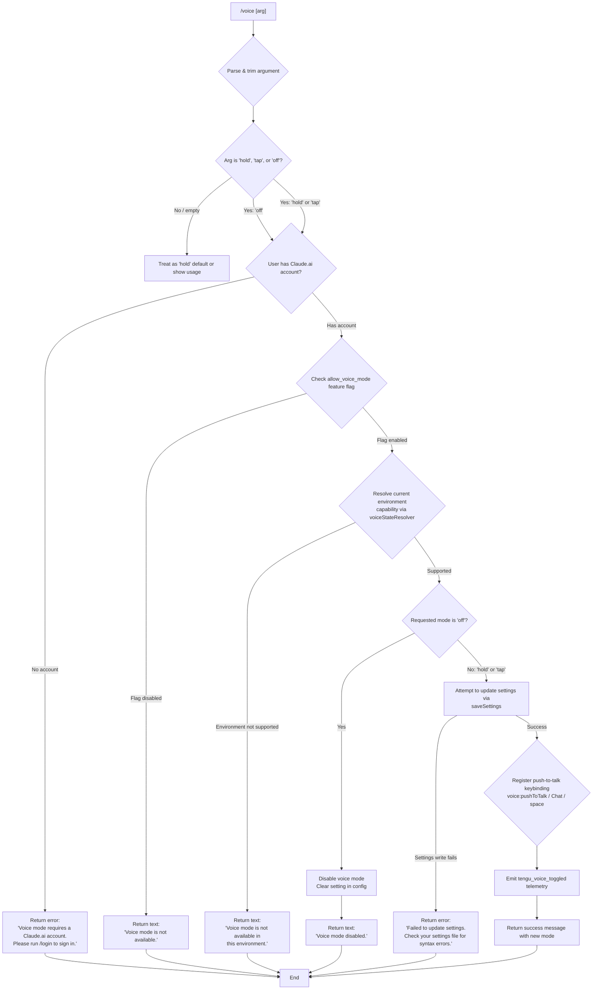

# `/voice`

> Analysis basis: CC v2.1.198 bundle.js (AST extraction + Claude interpretation)
> Minimum version: v2.1.198

---

## Overview

The `/voice` command toggles voice mode in Claude Code, allowing users to switch between `hold`, `tap`, and `off` interaction modes. It validates account eligibility and feature availability before applying the requested mode, then persists the setting and optionally registers a push-to-talk keybinding. The command emits a telemetry event on each successful or failed toggle.

---

## Registration

| Field | Value |
|---|---|
| type | `local` |
| name | `voice` |
| description | `Toggle voice mode` |
| argumentHint | `[hold\|tap\|off]` |
| supportsNonInteractive | `false` |
| isHidden | `null` |
| module_id | `Rdc` |
| load_inline | `true` |
| loc_byte | `13561479` |
| loc_byte_end | `13561721` |
| loc_line | `9230` |
| arbor_handler.name | `Rcm` |
| arbor_handler.fqn | `claude-2.1.198::Rcm` |
| arbor_handler.kind | `AsyncFunction` |
| arbor_handler.resolution_path | `module_id` |
| arbor_handler.n_hits | `1` |

Analysis basis: CC v2.1.198 bundle.js:+13561479

---

## Input Branching

The command has more than three distinct branches based on argument parsing, account state, and feature flags, so a Mermaid flowchart is used.



Analysis basis: CC v2.1.198 bundle.js:+13558879, +13558920, +13559000, +13559099, +13559387, +13559469, +13559525, +13559769

---

## Behavioral Spec

### Argument Normalization

The handler `argumentNormalizer` (bundle identifier: `kcm`) trims whitespace from the raw input argument and lower-cases it before comparison.

```
function argumentNormalizer(rawArg):
    trimmed = rawArg.trim()
    return trimmed.toLowerCase()
```

Valid tokens are `"hold"`, `"tap"`, and `"off"` (bundle.js:+13558796, +13558808, +13558819). Any other value is classified as `"invalid"` (bundle.js:+13558840).

Analysis basis: CC v2.1.198 bundle.js:+13558749, +13558796

---

### Account & Feature Gate Check

`voiceGateChecker` (bundle identifier: `YIt`) is called early in the main handler. It verifies:

1. The user possesses a valid Claude.ai OAuth account. If not, it short-circuits and returns a `text`-type result with the message `"Voice mode requires a Claude.ai account. Please run /login to sign in."` (bundle.js:+13558920).
2. The feature flag `allow_voice_mode` is enabled for the account (bundle.js:+13547746). If the flag is absent or false, the command returns `"Voice mode is not available."` (bundle.js:+13559099).

```
async function voiceGateChecker(context):
    if not context.hasClaudeAiAccount():
        return { type: "text", content: LOGIN_REQUIRED_MESSAGE }
    featureFlags = loadFeatureFlags(context)
    if not featureFlags["allow_voice_mode"]:
        return { type: "text", content: NOT_AVAILABLE_MESSAGE }
    return null   // gate passed
```

Analysis basis: CC v2.1.198 bundle.js:+13547788, +13547746, +13558890, +13558920, +13559099

---

### Voice State Resolution

`voiceStateResolver` (bundle identifier: `nG`) determines the current environment's voice capability. It calls the feature-flag resolver (`js`) and the platform capability check (`rG`). If the environment does not support voice (e.g. non-interactive terminal without audio subsystem), it returns `false` and the command emits `"Voice mode is not available in this environment."` (bundle.js:+13559769).

```
function voiceStateResolver(arg, context):
    flagResult = checkFeatureFlags(context)      // js
    platformCapable = checkPlatformCapability()  // rG
    if not platformCapable:
        return { available: false }
    return { available: true, requestedMode: arg.toLowerCase() }
```

Analysis basis: CC v2.1.198 bundle.js:+13559000, +13416820, +13416841, +13559769

---

### Settings Persistence

When the gate passes and the environment is capable, the main handler calls `settingsWriter` (bundle identifier: `Lr`) to persist the new mode. Settings are written via the standard settings-write pipeline which includes atomic file write with lock acquisition, config re-read validation, and backup creation. The macro write flow is:

```
async function settingsWriter(mode, context):
    currentSettings = loadSettingsFromDisk()    // X8
    if mode == "off":
        newSettings = applyVoiceOff(currentSettings)
    else:
        newSettings = applyVoiceMode(currentSettings, mode)
    ok = saveSettingsWithLock(newSettings)      // Onn / SCt pipeline
    if not ok:
        return { error: SETTINGS_WRITE_FAILED_MESSAGE }
    return { success: true }
```

Failure message: `"Failed to update settings. Check your settings file for syntax errors."` (bundle.js:+13559387).
Disable message: `"Voice mode disabled."` (bundle.js:+13559525).

Analysis basis: CC v2.1.198 bundle.js:+13559137, +13559387, +13559525

---

### Keybinding Registration (hold / tap modes only)

When voice is successfully enabled (mode is `"hold"` or `"tap"`), the command registers a push-to-talk keybinding action. It calls `keybindingRegistrar` (bundle identifier: `pv`) with:

- Action: `"voice:pushToTalk"` (bundle.js:+13560738)
- Context: `"Chat"` (bundle.js:+13560757)
- Key: `"space"` (bundle.js:+13560764)

```
async function keybindingRegistrar(action, context, key):
    if pYi.has(action):
        return  // already registered
    pYi.add(action)
    keybindingConfig = loadKeybindingConfig()   // i3t
    resolved = resolveKeybindingAction(keybindingConfig, action, context, key)  // $On
    if resolved == null:
        emitTelemetry("tengu_keybinding_fallback_used")
    return resolved
```

Analysis basis: CC v2.1.198 bundle.js:+13560735, +13560738, +13560757, +13560764

---

### Microphone Permission Hint (macOS)

On macOS, if microphone access is not granted, the handler surfaces the system path `"System Settings → Privacy & Security → Microphone"` (bundle.js:+13560276) in the returned message so the user knows where to enable access. This string is embedded in the result payload; no programmatic permission request is performed by the CLI.

Analysis basis: CC v2.1.198 bundle.js:+13560276

---

### Telemetry Emission

On each execution path that reaches a definitive outcome (success or availability failure), `tengu_voice_toggled` is emitted (bundle.js:+13559470). The event is fired via `voiceTelemetryEmitter` (bundle identifier: `V` call at +13559468).

```
function emitVoiceToggled(mode, outcome):
    tenguEmit("tengu_voice_toggled", { mode: mode, outcome: outcome })
```

Analysis basis: CC v2.1.198 bundle.js:+13559468, +13559470

---

## State & Side Effects

| Item | Detail |
|---|---|
| Telemetry | `tengu_voice_toggled` (bundle.js:+13559470); `tengu_keybinding_fallback_used` (bundle.js:+4056776); `tengu_custom_keybindings_loaded` (bundle.js:+4047474); `tengu_config_parse_error` (bundle.js:+14259169); `tengu_config_lock_contention` (bundle.js:+14255436); `tengu_config_stale_write` (bundle.js:+14255572); `tengu_config_auto_repaired` (bundle.js:+14255949); `tengu_config_auth_loss_prevented` (bundle.js:+14256279); `tengu_config_fallback_write` (bundle.js:+14255052) |
| Keybinding registration | Registers `voice:pushToTalk` on `space` in `Chat` context when mode is `hold` or `tap` (bundle.js:+13560738) |
| Settings file mutation | Writes updated voice mode to user settings (via atomic lock-guarded write pipeline) |
| Microphone permission hint | Surfaces macOS system path string on permission absence; no programmatic OS API call |
| `allow_voice_mode` flag | Read from account feature flags at runtime; not cached |
| OAuth account check | Requires Claude.ai account (`firstParty` / `user_oauth` auth context) |

---

## Version History

| Version | Change |
|---|---|
| v2.1.198 | Initial analysis |

---

## Common Mistakes

1. **Running `/voice` without a Claude.ai account**: The command will immediately return the login prompt message. Ensure you have run `/login` and authenticated with a Claude.ai account before attempting voice mode.
2. **Supplying an unrecognised argument**: Only `hold`, `tap`, and `off` are valid. Any other string (including blank) is treated as `"invalid"` and may result in a usage error or fallback behaviour.
3. **Expecting voice in non-interactive / CI environments**: The environment capability check will gate voice off when no audio subsystem or interactive terminal is detected, returning `"Voice mode is not available in this environment."`.
4. **Ignoring the microphone permission requirement on macOS**: Even after enabling voice, recording will fail silently unless microphone access is granted in `System Settings → Privacy & Security → Microphone`.
5. **Editing `settings.json` manually while `/voice` is running**: The atomic write pipeline re-reads the file under a lock; a concurrent malformed edit can trigger the parse-error fallback and emit `tengu_config_parse_error`.

---

## Appendix — Identifier Mapping

> For bundle debugging only. Identifiers change across versions.

| Identifier | Role |
|---|---|
| `Rcm` | Main async handler for `/voice` command (arbor_handler) |
| `YIt` | Account and feature-gate checker |
| `Kdr` | Sub-checker called by gate checker (inner validation step) |
| `cE` | Authentication context / credential resolver |
| `wd` | Credential store accessor |
| `pb` | Auth profile builder |
| `wc` | First-party auth classifier |
| `dI` | Auth token dispatcher |
| `Pw` | API key / token validation pipeline |
| `e$t` | Settings field extractor (Zit wrapper) |
| `Zit` | Settings value accessor |
| `QS` | Feature-flag store accessor |
| `Dtn` | Gate result type helper |
| `zdr` | Availability resolver entry point |
| `js` | Feature flag lookup for `allow_voice_mode` |
| `q9i` | Flag value coercer |
| `O$` | Flag data reader |
| `qi` | Essential-traffic network gate |
| `Tye` | Feature flag formatter |
| `rG` | Platform / environment capability checker |
| `nG` | Voice state resolver (argument + platform) |
| `Lr` | Settings persistence entry point |
| `X8` | Settings loader from disk (`loadSettingsFromDisk`) |
| `a0` | Settings path resolver |
| `_a` | Performance mark emitter (memory / perf_hooks) |
| `W5` | `require` wrapper for native modules |
| `g1r` | Core settings-load orchestrator |
| `Tn` | Async settings fetch helper |
| `lln` | Settings lock name generator |
| `qDt` | Flag settings set manager |
| `XRs` | Settings source reader |
| `Vwe` | User settings file locator |
| `Y8` | Settings record builder |
| `zRs` | SDK inline settings injector |
| `x3` | Settings schema validator / merger |
| `ar` | Platform detection helper (wsl etc.) |
| `KDt` | WSL-specific settings handler |
| `aln` | Settings finaliser |
| `Ptn` | Post-load settings transformer |
| `kcm` | Argument normalizer (trim + toLowerCase) |
| `eo` | Settings write orchestrator |
| `Oh` | Settings write path resolver |
| `zt` | Path utility (join/resolve) |
| `h1r` | Settings file write helper |
| `Nk` | Config directory initialiser |
| `IHe` | File read utility with encoding detection |
| `Wd` | Realpath resolver |
| `T` | Terminal output writer |
| `Sws` | File stat and type checker |
| `Khn` | Config path validator |
| `mn` | Error normaliser |
| `HOr` | Timestamp recorder |
| `I3e` | Settings object merger |
| `OHn` | Path resolver for settings directory |
| `BMt` | Atomic file write with fsync |
| `d` | Daemon / supervisor process coordinator |
| `SXe` | File read with size limit (1 MB cap) |
| `rdc` | Column width calculator for display |
| `E` | SDK connection manager |
| `A` | OAuth / user-info client |
| `lQc` | Heartbeat scheduler |
| `I` | Interval-based timer (input handler) |
| `V` | Telemetry emitter |
| `zws` | Atomic write staging helper |
| `Kws` | WDr map getter for staging dir |
| `$Mt` | File open/fstat/close cycle |
| `ywe` | Sandbox exec wrapper |
| `ant` | Extended attribute / xattr helper |
| `$Dr` | SharedArrayBuffer sync helper |
| `I9u` | `Atomics.wait` wrapper |
| `eLs` | `Object.defineProperty` helper |
| `he` | String coercer |
| `Me` | JSON serialiser |
| `o_` | Cache-clear utility |
| `Fgn` | Gitignore rule writer |
| `Pt` | AsyncLocalStorage context reader |
| `qhn` | Store getter helper |
| `eOr` | Gitignore entry checker |
| `Ugn` | Git command runner |
| `Wr` | `execFile` wrapper |
| `p6u` | Home-directory path expander |
| `q0s` | Git ls-files runner |
| `K0s` | Gitignore append helper |
| `m6` | `.claude/settings.json` path builder |
| `xe` | Feature-ok telemetry emitter |
| `Pe` | Telemetry payload builder |
| `OQe` | Telemetry transport |
| `St` | Feature-sad (warning) telemetry emitter |
| `Le` | Feature-bad (error) telemetry emitter |
| `Re` | Structured logger |
| `sr` | Error serialiser |
| `st` | String formatter |
| `jvu` | Log buffer rotator |
| `a` | Spend / billing response handler |
| `tge` | Spend-blocked event builder |
| `l` | Daemon status file writer |
| `Flc` | Daemon status serialiser |
| `Ene` | Status path builder |
| `C_e` | Config field normaliser |
| `Ys` | AsyncLocalStorage store reader |
| `ftn` | `daemon.status.json` path builder |
| `pv` | Keybinding registration entry point |
| `UOn` | Keybinding config loader + registrar |
| `i3t` | Keybinding JSON parser |
| `pro` | Keybinding action router |
| `lq` | Keybinding resolution entry |
| `kc` | Keybinding key normaliser |
| `hEe` | `keybindings.json` path builder |
| `Gt` | JSON parse wrapper |
| `POn` | Keybinding block array validator |
| `ROn` | Keybinding object entries mapper |
| `rYi` | Keybinding load telemetry helper |
| `uro` | Key collision detector |
| `dro` | Keybinding block structure validator |
| `$On` | Platform-specific keybinding resolver |
| `Hro` | Terminal-aware binding selector |
| `gro` | Terminal identifier (`iTerm2` / `Apple_Terminal`) |
| `Y7i` | Keybinding map builder |
| `iro` | Modifier key array builder |
| `Mct` | Keybinding action formatter |
| `Ke` | Keybinding fallback telemetry emitter |
| `oZe` | Locale / language normaliser |
| `Dt` | Config file manager (read/watch) |
| `A7o` | Config access guard |
| `SCt` | Config backup and copy pipeline |
| `c6` | JSON comment stripper |
| `I7o` | Backup directory lister |
| `v7o` | Config backup path builder |
| `m` | Agent filter / array processor |
| `UEr` | String prefix stripper |
| `k` | File watcher manager |
| `qHm` | Config file watcher |
| `QMt` | `watchFile` wrapper |
| `yhe` | Config change debouncer |
| `Si` | Signal / hook registrar |
| `_n` | Global config save-with-lock |
| `Onn` | Config write with backup rotation |
| `sfi` | Config object merger (Object.assign) |
| `uGr` | Config field updater |
| `ACt` | Auth presence validator |
| `v` | Config version field |
| `_` | Session / conversation record builder |
| `g` | Background daemon process manager |
| `h` | File handle holder |
| `vgm` | UUID generator for session IDs |
| `xn` | Conversation ID factory |
| `HC` | History context builder |
| `TFe` | Token field transformer |
| `b7o` | Object entries iterator for config diff |
| `Dnn` | Config dirty timestamp recorder |
| `Mnn` | Config merge-and-save shortcut |
| `Kfr` | Global config fallback writer |

---

Note: index built via Arbor fallback; some signals (telemetry, literals) may be missing — see arbor-fallback.js.