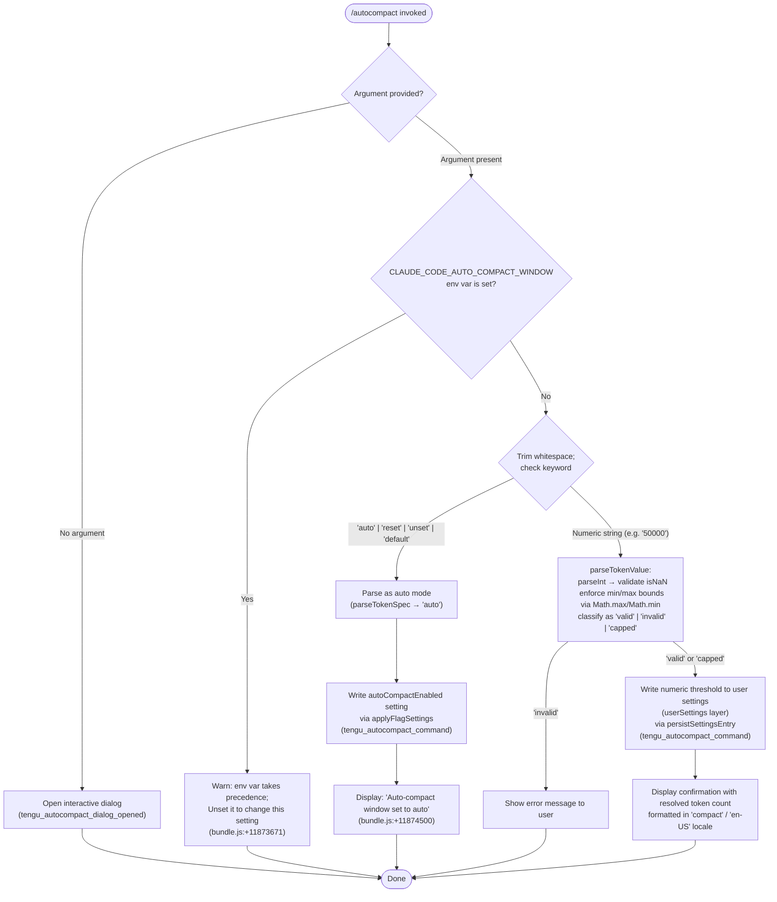

```markdown
---
type: feature-spec
feature: "autocompact"
cc_version: "2.1.199"
updated: "2026-07-03"
tags: ["autocompact", "commands", "slash-commands"]
source: "bundle-analysis"
bundle_verified: true
analysis_basis: "CC v2.1.199 bundle.js (AST extraction + Claude interpretation)"
author: "ryujaeuk <ryujaeuk@gmail.com>"
repository: "https://github.com/MyLittleLuckyDog/cc-gnothi"
license: "AGPL-3.0-only"
---

# `/autocompact`

> Analysis basis: CC v2.1.199 bundle.js (AST extraction + Claude interpretation)
> Minimum version: v2.1.199

---

## Overview

`/autocompact` configures how full the context window must become before Claude Code automatically summarizes (compacts) the conversation. It accepts either the special keyword `auto` (model-default threshold) or an explicit token count, and persists the chosen threshold to user settings. If the environment variable `CLAUDE_CODE_AUTO_COMPACT_WINDOW` is already set, the command warns that the env var takes precedence and no settings write can override it.

---

## Registration

| Field | Value |
|---|---|
| type | `local-jsx` |
| name | `autocompact` |
| description | `Set how full the context gets before auto-summarizing` |
| argumentHint | `[auto\|<tokens>]` |
| isHidden | `false` |
| module_id | `EGl` |
| load_inline | `true` |
| loc_byte | `11879351` |
| loc_byte_end | `11879615` |
| loc_line | `8622` |
| arbor_handler.name | `NWf` |
| arbor_handler.fqn | `claude-2.1.199::NWf` |
| arbor_handler.kind | `AsyncFunction` |
| arbor_handler.resolution_path | `module_id` |
| arbor_handler.n_hits | `1` |

Analysis basis: CC v2.1.199 bundle.js:+11879351

---

## Input Branching

The command has four or more distinct input paths (no argument → open dialog; `auto`/`reset`/`unset`/`default` keywords → set automatic threshold; explicit token integer → set numeric threshold; env-var guard → warn and abort write). A Mermaid flowchart is therefore required.



---

## Behavioral Spec

### Handler Entry Point (`NWf`)

The Arbor-resolved handler `NWf` is an `AsyncFunction` reached via `module_id → EGl`.

```
async function handleAutocompact(args, appState):
    if args is empty or absent:
        emit telemetry("tengu_autocompact_dialog_opened")
        renderJSX dialog via cP.jsx
        return

    emit telemetry("tengu_autocompact_command")
    return await executeAutocompactCore(args, appState)
```

Analysis basis: CC v2.1.199 bundle.js:+11879041, +11879057, +11879074, +11879076, +11879118, +11879133

---

### Core Execution (`KZt`)

```
async function executeAutocompactCore(rawArg, appState):
    arg = rawArg.trim()

    // Guard: env var overrides settings
    if envVarIsSet("CLAUDE_CODE_AUTO_COMPACT_WINDOW"):
        displayWarning("CLAUDE_CODE_AUTO_COMPACT_WINDOW is set and takes precedence. Unset it to change this setting.")
        return

    // Keyword detection
    if arg in ["reset", "unset", "default"]:
        tokenSpec = parseTokenSpec("auto")   // treat as auto mode
    else:
        tokenSpec = parseTokenSpec(arg)      // may return {mode:"auto"} or {tokens:N}

    // Load current settings layers
    settings = await loadSettings(appState)   // calls Qo → Hf → fKu

    // Apply change
    applyFlagSettings(settings, tokenSpec)    // calls Lr → CV

    // Persist to disk
    await persistUserSettings(settings)

    // Render confirmation
    displayConfirmation(tokenSpec)
```

Analysis basis: CC v2.1.199 bundle.js:+11873637, +11873671, +11873773, +11873802, +11873815, +11873828, +11873845, +11874019, +11874115, +11874280, +11874484

---

### Token Specification Parser (`yfo`)

Called from `KZt` via direct call at bundle.js:+11873845 and also used inside the threshold-resolution pipeline (`f4`).

```
function parseTokenSpec(input):
    trimmed = input.trim()

    if trimmed ends with "auto":
        return { mode: "auto" }

    // Try floating-point first, then integer
    floatVal = parseFloat(trimmed)
    intVal   = parseInt(trimmed)          // base 10 implied

    if not Number.isFinite(floatVal):
        return { mode: "invalid" }

    rounded = Math.round(floatVal)

    if rounded < 100:                     // minimum threshold (bundle.js:+5311570)
        return { mode: "invalid" }

    if rounded < 1000:                    // scale guard (bundle.js:+5311534)
        rounded = rounded * 1000

    return { mode: "numeric", tokens: rounded }
```

Analysis basis: CC v2.1.199 bundle.js:+5311399, +5311429, +5311458, +5311476, +5311534, +5311550, +5311570, +5311596, +5311643

---

### Threshold Resolution & Validation Pipeline (`f4` / `ppe` / `hTp`)

The threshold resolution layer (`f4`) determines the effective compact-window value that will actually be used, resolving from multiple sources in priority order.

```
function resolveEffectiveThreshold(appState):
    // Source 1: environment variable (highest priority)
    envVal = getEnv("CLAUDE_CODE_AUTO_COMPACT_WINDOW")   // bundle.js:+5312738
    if envVal is set:
        parsed = validateTokenValue(envVal)
        if parsed.status == "valid":
            return { value: parsed.tokens, source: "env" }  // bundle.js:+5312930

    // Source 2: settings file
    settingsVal = readSetting("autoCompactEnabled")       // bundle.js:+5309224
    if settingsVal is set:
        parsed = validateTokenValue(settingsVal)
        if parsed.status == "valid":
            return { value: parsed.tokens, source: "settings" }  // bundle.js:+5313000

    // Source 3: experiment / clientdata flags
    experimentVal = resolveExperimentFlag()               // bundle.js:+5313195
    if experimentVal present:
        return { value: experimentVal, source: "experiment" }

    // Source 4: model-default fallback
    return { value: "auto", source: "model-default" }    // bundle.js:+5313294
```

```
function validateTokenValue(raw):
    n = parseInt(raw)                // bundle.js:+5309703
    if isNaN(n):
        return { status: "invalid" } // bundle.js:+5309763
    clamped = Math.max(min, Math.min(max, n))
    if clamped != n:
        return { status: "capped", tokens: clamped }  // bundle.js:+5309893
    return { status: "valid", tokens: n }             // bundle.js:+5309688
```

Analysis basis: CC v2.1.199 bundle.js:+5312657, +5312665, +5312672, +5312734, +5312738, +5312856, +5312896, +5313018, +5313106, +5313126, +5313220, +5313232, +5313294, +5313342

---

### Settings Persistence (`Qo` → `Hf` → `fKu`)

```
async function loadSettings(appState):
    // Hf: check in-flight cache (myn.get) to avoid duplicate disk reads
    cached = settingsCache.get(key)
    if cached:
        return await cached

    // fKu: load from disk, ordered by layer:
    //   policySettings  → flagSettings  → userSettings
    //   → projectSettings → localSettings
    promise = loadSettingsFromDisk()     // emits loadSettingsFromDisk_start / _end
    settingsCache.set(key, promise)
    return await promise
```

The `userSettings` layer (bundle.js:+1370707) is the target for writes performed by `/autocompact`. The `policySettings` and `flagSettings` layers are read-only from the command's perspective.

Analysis basis: CC v2.1.199 bundle.js:+1369586, +1369622, +1369644, +1369666, +1369702, +1369757, +1369793, +1369806, +1369825, +1369835, +1370099, +1370707

---

### Flag / Settings Application (`Lr` → `CV` → `applyFlagSettings`)

```
function applyFlagSettings(settings, tokenSpec):
    // CV triggers loadSettingsFromDisk_start / _end span
    // IUr records settings_load_started / settings_load_completed telemetry
    mergedSettings = mergeSettingLayers(settings)

    if tokenSpec.mode == "auto":
        mergedSettings.autoCompactEnabled = true
        mergedSettings.autoCompactWindow  = null   // revert to model default
    else:
        mergedSettings.autoCompactEnabled = true
        mergedSettings.autoCompactWindow  = tokenSpec.tokens

    // Telemetry event emitted by calling scope:
    emit("tengu_autocompact_command")
    persistToDisk(mergedSettings, layer="userSettings")
```

Analysis basis: CC v2.1.199 bundle.js:+11874219, +11874280, +11874318, +11874339, +1366829, +1367133, +1367159, +1367198, +1367202, +1367218, +1367246

---

### Confirmation Display (`Tl` / `ed`)

```
function renderConfirmation(tokenSpec):
    if tokenSpec.mode == "auto":
        print("Auto-compact window set to auto")   // bundle.js:+11874500
    else:
        // Format with Intl.NumberFormat(locale="en-US", notation="compact")
        formatted = formatNumber(tokenSpec.tokens, { locale: "en-US", notation: "compact" })
        // Appends ".0" suffix for whole numbers  (bundle.js:+225204)
        print("Auto-compact window set to " + formatted)
```

Analysis basis: CC v2.1.199 bundle.js:+11874484, +11874500, +225137, +225190, +225204, +227266, +227284

---

### Model / Context Lookup (`io` / `h_`)

The pipeline queries internal model-registry helpers to determine per-model context limits, used when computing the effective "auto" threshold.

- The model-name normalizer (`h_`) lower-cases input, checks for a `"us"` prefix (bundle.js:+2344590), strips region prefix via `slice`, and handles known model name strings including `"claude-fable-5"`, `"claude-mythos-5"`, `"claude-opus-4-*"`, `"claude-sonnet-*"`, `"claude-haiku-*"`, `"claude-3-*"`, and `"application-inference-profile"`.
- Maximum base-10 radix guard in `_Pi`: `10` (bundle.js:+3094695).
- Maximum token ceiling in `yPi`: `1 000 000` (bundle.js:+3094828).
- The `"claude-"` prefix check used for model-family classification: bundle.js:+3095012.

Analysis basis: CC v2.1.199 bundle.js:+2344514, +2344536, +2344555, +2344590, +2344596, +2344644, +2344697, +2344708, +2344763, +2344820, +2344877, +2344934, +2344991, +2345048, +2345137, +2345169, +2345226, +2345287, +2345382, +2345416, +2345475, +2345536, +2345597, +2345656, +2345709, +2345766, +2345859, +2345882, +2345891, +2345902, +2345942, +2345946, +3094487, +3094519, +3094546, +3094643, +3094695, +3094703, +3094758, +3094765, +3094781, +3094815, +3094828, +3094859, +3094879, +3094902, +3094991, +3094994, +3095012, +3095065, +3095092

---

## State & Side Effects

| Item | Detail |
|---|---|
| Telemetry: `tengu_amber_redwood2` | Fired inside `TBn` (threshold-bounds utility); bundle.js:+5309062 |
| Telemetry: `tengu_amber_redwood3` | Fired inside `TBn` (threshold-bounds utility); bundle.js:+5309093 |
| Telemetry: `tengu_autocompact_command` | Fired on every successful non-dialog invocation; bundle.js:+11874282 |
| Telemetry: `tengu_autocompact_dialog_opened` | Fired when command is invoked with no argument and dialog is opened; bundle.js:+11879076 |
| Settings write | `autoCompactEnabled` and/or `autoCompactWindow` keys written to the `userSettings` layer on disk |
| Settings load telemetry | `settings_load_started` (bundle.js:+1354744) and `settings_load_completed` (bundle.js:+1355644) emitted during every settings load cycle |
| Settings span | `loadSettingsFromDisk_start` / `loadSettingsFromDisk_end` tracing span (bundle.js:+1367162, +1367218) |
| JSX dialog | Rendered via `cP.jsx` when no argument is given; bundle.js:+11879133 |
| Env var guard | If `CLAUDE_CODE_AUTO_COMPACT_WINDOW` is present in the environment, a warning is shown and no settings write occurs; bundle.js:+5312738 |
| Hook/event emission | `Qrt.emit` called inside `fKu` settings-persistence path; bundle.js:+1371323 |
| Memory usage sampling | `process.memoryUsage()` called inside `Sa` (settings dedup guard); bundle.js:+228199 |
| appState changes | `autoCompactEnabled` / `autoCompactWindow` fields updated after successful write |
| Sound | None observed in depth-2 traversal |

---

## Version History

| Version | Change |
|---|---|
| v2.1.199 | Initial analysis |

---

## Common Mistakes

1. **Forgetting the env-var lock**: If `CLAUDE_CODE_AUTO_COMPACT_WINDOW` is set in the shell environment, `/autocompact <value>` will warn and silently skip the write. Unset the variable before using the command.
2. **Passing a value below 100**: Token values below `100` are classified as `"invalid"` and rejected. The command requires a minimum threshold of 100 tokens (or the value multiplied by 1 000 if below 1 000).
3. **Expecting the setting to apply immediately to in-flight conversations**: The resolved threshold is read at compaction time; already-open sessions may not pick it up until re-evaluated.
4. **Confusing `reset` / `unset` / `default` with disabling auto-compact**: These keywords switch the mode to `"auto"` (model-determined threshold), not off. To disable auto-compact entirely, a different mechanism is required.
5. **Using a float without awareness of rounding**: The parser rounds floating-point input via `Math.round`, so `50.7k` could resolve differently than expected. Prefer explicit integer token counts.

---

## Appendix — Identifier Mapping

> For bundle debugging only. Identifiers change across versions.

| Identifier | Role |
|---|---|
| `NWf` | Main handler (`AsyncFunction`) for `/autocompact`; Arbor-resolved entry point |
| `KZt` | Core execution function: arg parsing, env-var guard, settings load/write orchestration |
| `f4` | Threshold resolution pipeline: reads env var, settings, experiment flags, model-default |
| `io` | Model-registry lookup helper: maps model name to context-limit metadata |
| `Rst` | Model-registry initializer: iterates `Object.entries` to build model map |
| `h_` | Model-name normalizer: lowercase, prefix strip, alias resolution |
| `P0t` | Model profile classifier (e.g. `"application-inference-profile"` detection) |
| `qu` | Model alias replacement utility |
| `Ty` | Context-limit type resolver |
| `Aw` | Context-limit constant provider |
| `mS` | Token-spec validation orchestrator |
| `_Pi` | Integer token parser: `parseInt` with base-10 radix guard and `isNaN` check |
| `kXr` | Token-spec validator: delegates to `_Pi`, `met`, `yPi` |
| `yPi` | Token-value range enforcer: applies ceiling of 1 000 000, reads model context limit |
| `ppe` | Token value classifier: returns `"valid"` / `"invalid"` / `"capped"` |
| `T` | Output writer / logger utility: handles debug/info levels, flush |
| `hTp` | Settings-value type checker: `Number.isInteger`, `Array.isArray`, `Object.hasOwn` guards |
| `Nv` | Settings-value accessor |
| `YHa` | Nested settings-object walker: `Array.isArray`, `Object.hasOwn` traversal |
| `n` | String normalizer (lowercase) |
| `EPi` | Settings entry reader (`q0` delegate) |
| `SPi` | Settings entry writer (`Mt` delegate) |
| `Efo` | Effective-threshold builder: combines `Nv`, `Hr`, `TBn`, `yfo` |
| `Hr` | Source-priority resolver for threshold |
| `TBn` | Threshold bounds enforcer; emits `tengu_amber_redwood2/3` |
| `yfo` | Token-spec string parser: `trim`, `endsWith("auto")`, `parseFloat`, `parseInt`, `Math.round` |
| `mTp` | Settings-map validator: `Object.hasOwn`, `YHa` |
| `Qo` | Settings-load entry point |
| `Hf` | Settings-load cache manager: `myn.get/set`, deduplication |
| `Qh` | Settings-load pre-processor: `NLe`, `t9` |
| `fKu` | Settings-disk-read implementation: multi-layer load, `Qrt.emit` |
| `r` | Promise/result wrapper (`Ts`) |
| `s` | Pending-set tracker: `r.add`, `i.finally`, `r.delete` |
| `Lr` | Flag-settings applier |
| `CV` | Settings-merge coordinator: `loadSettingsFromDisk_start/end` span |
| `C0` | Settings-merge helper |
| `Sa` | Settings-dedup guard: `Lhs.has/add`, `process.memoryUsage` |
| `IUr` | Settings-load telemetry emitter: `settings_load_started/completed` |
| `t9` | Settings-layer reader: all layer accessors (`ar`, `hBe`, `uCr`, etc.) |
| `vcn` | Settings-post-process utility |
| `V` | App-state accessor |
| `qe` | UI renderer helper (`GZe`) |
| `GZe` | Base JSX render function |
| `Tl` | Confirmation message formatter |
| `ed` | Number formatter: `Intl.NumberFormat` with `"en-US"` / `"compact"` / `".0"` suffix |
| `wdu` | Number-format post-processor |
```

Note: index built via Arbor fallback; some signals (telemetry, literals) may be missing — see arbor-fallback.js.