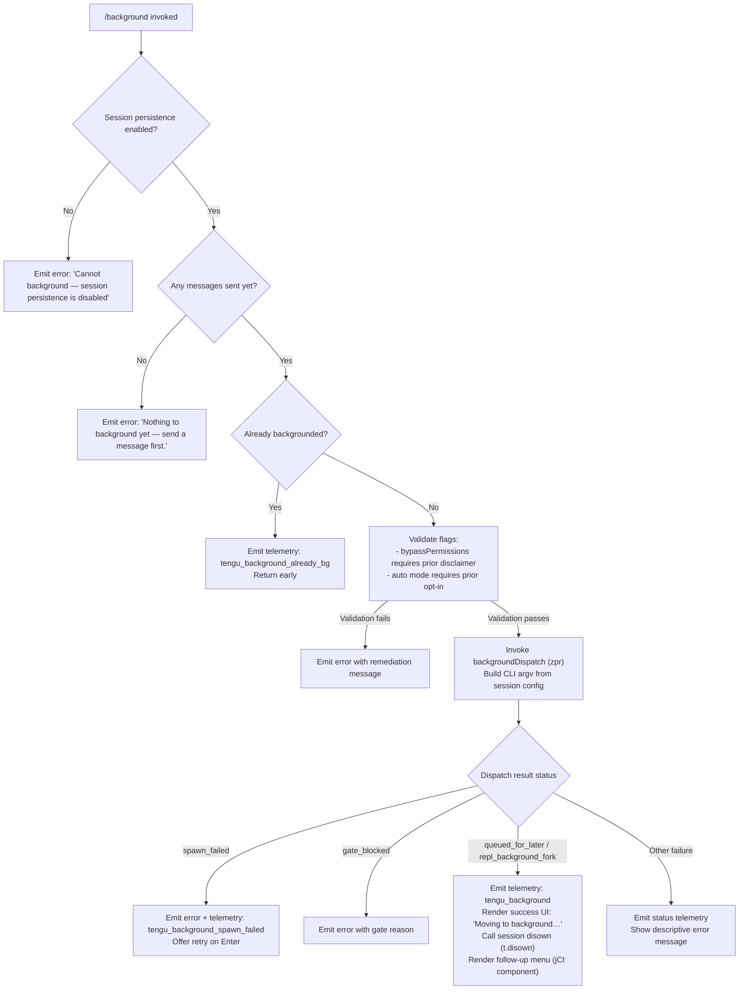

# `/background`

> Analysis basis: CC v2.1.199 bundle.js (AST extraction + Claude interpretation)
> Minimum version: v2.1.199

---

## Overview

`/background` (alias: `/bg`) detaches the current interactive REPL session into a background daemon-managed job, freeing the terminal for other work. It validates that the session is eligible for backgrounding (persistence enabled, at least one message sent), then dispatches the session to the background service and renders a transitional UI that guides the user to relevant follow-up commands.

---

## Registration

| Field | Value |
|---|---|
| type | `local-jsx` |
| name | `background` |
| description | `Send this session to the background and free the terminal` |
| aliases | `["bg"]` |
| argumentHint | `[prompt]` |
| immediate | `null` |
| module_id | `wdc` |
| load_inline | `true` |
| loc_byte | `13727046` |
| loc_byte_end | `13727286` |
| loc_line | `10248` |
| arbor_handler.name | `pdm` |
| arbor_handler.fqn | `claude-2.1.199::pdm` |
| arbor_handler.kind | `AsyncFunction` |
| arbor_handler.resolution_path | `module_id` |
| arbor_handler.n_hits | `0` |

Analysis basis: CC v2.1.199 bundle.js:+13727046

---

## Input Branching

The handler has 4+ distinct branches based on session eligibility and background dispatch outcome.



Analysis basis: CC v2.1.199 bundle.js:+13375841, +13368940, +13369741

---

## Behavioral Spec

### Guard: Persistence and Message Checks

```
async function backgroundCommandHandler(toolContext, sessionContext):
    // Guard 1: persistence must be enabled
    if not sessionContext.persistenceEnabled:
        emit "Cannot background — session persistence is disabled, so the forked job would have nothing to resume."
        return

    // Guard 2: at least one message must exist
    if sessionContext.messageCount == 0:
        emit "Nothing to background yet — send a message first."
        return

    // Guard 3: already backgrounded
    if sessionContext.isAlreadyBackgrounded:
        telemetry.emit("tengu_background_already_bg")
        return
```

Analysis basis: CC v2.1.199 bundle.js:+13375893, +13376097, +13375921, +13375855

### Guard: Permission Mode Checks

```
function validatePermissionFlags(sessionFlags):
    // bypassPermissions cannot be used headlessly until disclaimer accepted interactively
    if sessionFlags.bypassPermissions and not disclaimerAccepted:
        error "--bg with bypassPermissions requires accepting the disclaimer first. Run `claude --dangerously-skip-permissions` once interactively."
        return false

    // auto permission mode requires prior interactive opt-in
    if sessionFlags.permissionMode == "auto" and not autoModeOptedIn:
        error "--bg with auto mode requires opting in first. Run `claude --permission-mode auto` once interactively."
        return false

    return true
```

Analysis basis: CC v2.1.199 bundle.js:+13366311, +13366473

### Background Dispatch (backgroundDispatch / `zpr`)

```
async function backgroundDispatch(sessionConfig, argv):
    // Collect all current sessions
    sessions = Array.from(sessionStore.values())

    // Build child argv from current session's config:
    //   --resume <sessionId>
    //   --fork-session
    //   --reply-on-resume (if prompt provided)
    //   --add-dir <dirs>
    //   --allowed-tools / --disallowed-tools
    //   --model, --effort, --permission-mode
    //   --allowed-tools, --dangerously-skip-permissions (if applicable)
    argv = buildArgv(sessionConfig)

    // Ensure daemon is running (daemonEnsureRunning)
    daemonStatus = await ensureDaemonRunning(timeoutMs=40000)
    if daemonStatus != "up":
        return { status: "daemon_unavailable" }

    // Attempt dispatch with retry (up to 3 attempts, 6000ms ack timeout)
    for attempt in range(3):
        result = await dispatchToBackground(argv, ackTimeoutMs=6000)
        if result.status == "repl_background_fork" or "queued_for_later":
            break
        if result.status in ["stale_short", "short_alive"]:
            // prior session still shutting down
            error "Previous session is still shutting down — try again in a moment"
            break

    return result
```

Analysis basis: CC v2.1.199 bundle.js:+13367944, +13368179, +13368219, +13368231, +13340475, +13340500, +13341370

### Daemon Ensure Running (`daemonEnsureRunning` / `AKo`)

```
async function ensureDaemonRunning(timeoutMs):
    // Check if daemon socket exists and is alive (EALIVE)
    // If stale executable detected → log tengu_bg_daemon_service_stale_exec, fall back to transient spawn
    // If no service installed on linux → prompt: "No background daemon is running. Run 'claude daemon install'..."
    // If cold start → prompt user to install as service ("Install as a service now? [y/N/never, or 'once' just for now] ")
    // Spawn transient daemon with args: run --origin transient --spawned-by <pid>
    // Poll for up status (max timeout 30000ms)
    // If poll fails → tengu_bg_daemon_spawn_failed
    return daemonStatus
```

Analysis basis: CC v2.1.199 bundle.js:+13296104, +13296177, +13296248, +13297212, +13297495, +13297929

### Session Spawn / Claim (`sessionClaim` / `wcs`)

```
async function claimSession(dispatchData):
    // Build claim frame (m7.buildClaimFrame)
    // Connect to daemon socket (fbr.connect)
    // Write claim frame via binary framing (mM: Buffer.from + writeUInt32BE + writeUInt8 + copy)
    // Await acknowledgement on socket
    // On ECONNREFUSED → telemetry tengu_bg_sendclaim_failed
    // On timeout (5000ms) → error "send-claim timeout"
    // On success → proceed to handoff
```

Analysis basis: CC v2.1.199 bundle.js:+18521620, +18521791, +18522269, +18522325, +18521835

### Session Handoff and State Persistence (`managedSession` / `Mcs`)

```
async function managedSessionHandoff(sessionId, sessionData):
    // Write session roster entry
    // Write state.json to session directory
    // Persist pin data (pins.json)
    // If Windows → skip PTY management
    // Retire settled session promises
    // Schedule cleanup timeout (300000ms = 5 min)
    // Record handoff telemetry: tengu_bg_handoff_settle
    // Disown session from current process (t.disown)
    // Write tombstone marker for host
    // On low memory (<threshold MB) → tengu_bg_dispatch_low_mem
```

Analysis basis: CC v2.1.199 bundle.js:+18536346, +18537668, +18538297, +18536659, +18529670, +18537764

### Success UI Render (`MKo` JSX component)

```
function BackgroundSuccessView(props):
    // Display "Moving to background…"
    // Show session context: worktrees, agents count (was/were plural)
    // Render follow-up action menu (jCt):
    //   - "claude agents"        (view agent list)
    //   - "list sessions"
    //   - "open in this terminal"
    //   - "show recent output"
    //   - "stop this session"
    // Apply dim/cyan styling (St.dim, St.cyan)
    // Pad menu item labels to 26 chars
    // Emit telemetry: tengu_background
    // On left_arrow key: call Si (session exit handler)
    // Emit tengu_bg_exit_dialog_background on dialog open
    // Emit prompt_input_exit if user has nothing to background
```

Analysis basis: CC v2.1.199 bundle.js:+13372050, +13371696, +13369741, +13370909, +13370953, +13370987, +13353502

### Forked Session Spawn (`vdc`)

```
async function forkAndSpawnBackgroundSession(sessionId, config):
    // Generate new UUID for background session
    // Create session directory (KCt.mkdir)
    // Write adopt.json (WHt) with session config (max 1,000,000 byte state)
    // Call checkpointAgents on current session
    // Invoke backgroundDispatch (zpr) with forked argv
    // If backgrounded → disown session (t.disown)
    // On failure → record RVn (failure metadata)
```

Analysis basis: CC v2.1.199 bundle.js:+13370135, +13370185, +13370228, +13370251, +13370314, +13370520

### Session Exit / Shutdown (`sessionShutdown` / `Si`)

```
async function sessionShutdown(exitCode):
    // Unmount Ink renderer (U8e: e.unmount)
    // Write terminal restore sequences (ESC-7 / ESC-8)
    // Drain BFS queues (ket: bfs.drain, Hun: Tfs.drain)
    // Run all registered cleanup handlers (BPa: Promise.allSettled, hOa)
    // Await abort signal timeout (AbortSignal.timeout)
    // Emit session_end telemetry
    // Clear timeout, then process.exit(exitCode)
    // On "unreachable" branch → process.kill(pid, signal)
```

Analysis basis: CC v2.1.199 bundle.js:+6913009, +6913303, +6913414, +6913526, +6910665

---

## State & Side Effects

| Item | Detail |
|---|---|
| Telemetry | `tengu_background` (success), `tengu_background_already_bg` (duplicate call), `tengu_background_spawn_failed` (dispatch failure), `tengu_bg_dispatch` (dispatch attempt), `tengu_bg_dispatch_fallback` (fallback path), `tengu_bg_dispatch_rescued`, `tengu_bg_handoff_settle` (session handed off), `tengu_bg_sendclaim_failed` (claim socket error), `tengu_bg_spare_enable`, `tengu_bg_spare_claim`, `tengu_bg_spare_claim_fail`, `tengu_bg_dispatch_low_mem`, `tengu_bg_dispatch_sigkill_escalate`, `tengu_bg_daemon_cold_start_ask`, `tengu_bg_daemon_cold_start_ask_answer`, `tengu_bg_daemon_spawn_failed`, `tengu_bg_daemon_service_stale_exec`, `tengu_bg_daemon_install`, `tengu_bg_daemon_service_poll_fallthrough`, `tengu_bg_low_mem_mb`, `tengu_bg_roster_parse_failed`, `tengu_bg_state_read_transient`, `tengu_bg_exit_dialog_background`, `tengu_daemon_control`, `tengu_daemon_config_reload`, `tengu_amber_anchor`, `tengu_rename_full_session_fork`, `session_end`, `prompt_input_exit` |
| Filesystem writes | `state.json` in session dir, `pins.json`, `adopt.json` (≤1 MB), tombstone file via `Wd.writeFile`/`Wd.unlink`, roster entry via `t.rosterEntry`, session dir created via `KCt.mkdir` |
| Daemon interaction | Connects to daemon control socket (`fbr.connect`), writes binary claim frame, awaits ACK; ensures daemon running (transient spawn if not installed) |
| Process management | `B.kill` with `SIGKILL` escalation after 30s (15s warning threshold); `process.exit(1)` on forced shutdown; `s.unref()` to allow GC of timer handles |
| appState changes | `e.setAppState` called via `utr`; `isBackgrounded` flag set on task state; session disowned via `t.disown` |
| Sound | <!-- TODO: not found in depth-2 traversal; needs --depth 4 --> |
| Hook registration | `process.on("exit", ...)` registered via `ru` for daemon lifecycle cleanup; `bfs.register` for BFS drain hooks |
| UI component | Renders `MKo` JSX component (local-jsx type) with follow-up action menu (5 items) and "(backgrounded)" status suffix |
| Session timeout | Cleanup scheduled at 300,000 ms (5 minutes) after handoff via `setTimeout` |

---

## Version History

| Version | Change |
|---|---|
| v2.1.199 | Initial analysis |

---

## Common Mistakes

1. **Running `/background` before sending any message** — the command checks that at least one message has been exchanged; issuing it on a fresh session produces "Nothing to background yet — send a message first." and exits silently.
2. **Using `/background` with `--dangerously-skip-permissions` without prior interactive acceptance** — the disclaimer must be accepted in an interactive session first; background mode enforces this with a hard error.
3. **Expecting `/background` to work without a daemon** — on Linux systems with no daemon installed, the command will prompt to install one and fall back to a transient spawn; if that transient spawn fails, the command returns an error. Run `claude daemon install` for reliable backgrounding.
4. **Using `--bg` together with `--cloud`** — these are different backends and cannot be combined; the bundle explicitly checks for this combination and errors with a descriptive message.
5. **Calling `/background` when `auto` permission mode is active but not yet opted into interactively** — similar to the bypass-permissions guard, auto mode requires prior interactive opt-in before being used headlessly.
6. **Expecting immediate background transfer** — the command waits for a daemon ACK (up to 6,000 ms per attempt, 3 attempts); if the daemon is starting cold, the total latency can be up to ~40 seconds before the session is handed off.

---

## Appendix — Identifier Mapping

> For bundle debugging only. Identifiers change across versions.

| Identifier | Role |
|---|---|
| `pdm` | Main async handler for `/background` command (Arbor-resolved) |
| `zpr` | Background dispatch orchestrator (builds argv, retries, calls daemon) |
| `MKo` | JSX component rendering the "Moving to background…" UI and follow-up menu |
| `vdc` | Fork-and-spawn background session coordinator |
| `Mcs` | Managed session handoff: writes state, roster, tombstone, schedules cleanup |
| `wcs` | Session claim sender (connects socket, writes binary claim frame) |
| `AKo` | Daemon ensure-running logic (cold start, transient spawn, poll) |
| `tdm` | Background session argv builder (resolves flags → CLI args) |
| `Yee` | Background gate-check / pre-flight validator |
| `udm` | CLI argv parser for background dispatch |
| `Si` | Session shutdown / terminal teardown handler |
| `YIt` | Session rename and fork orchestrator |
| `etm` | Main REPL turn loop entry (calls WR) |
| `WR` | Core agent query runner |
| `utr` | App state update handler (setAppState) |
| `oSc` | Agent query execution core (streaming, tools, fallback) |
| `jCt` | Follow-up action menu renderer (dim/cyan styled, 26-char padded labels) |
| `Ts` | CLI error handler (writes "cli_error" telemetry, calls process.exit) |
| `ru` | Process exit handler registrar (daemon lifecycle) |
| `Ai` | BFS queue registration helper |
| `Ka` | Flush-with-timeout helper (2000 ms flush timeout) |
| `QT` | Daemon control socket helper (reuses `ru`) |
| `DKo` | Daemon lifecycle setup |
| `w8` | Forced shutdown orchestrator (Promise.race, process.exit after 500 ms) |
| `mM` | Binary frame encoder (Buffer: UInt32BE length + UInt8 type + payload copy) |
| `xe` | JSON.stringify wrapper |
| `bQm` | Claim attempt builder (timeout 5000 ms, ECONNREFUSED guard) |
| `TQm` | Low-level socket connect for claim |
| `AQm` | Builds claim frame via `m7.buildClaimFrame` |
| `phe` | Session directory path helper |
| `ven` | Host-managed session directory resolver |
| `Kie` | Daemon directory resolver |
| `Sge` | Spare session directory resolver |
| `Cen` | Auth directory resolver |
| `Ien` | Inner session directory resolver |
| `wen` | Session roster directory resolver |
| `kIe` | PTY-pids path resolver |
| `hFe` | Session file path resolver |
| `_M` | Late-error path descriptor |
| `QVl` | Session state file path builder |
| `wk` | PTY directory path builder |
| `rGo` | PTY socket path resolver |
| `cIt` | PTY session path resolver |
| `mP` | Session metadata path resolver |
| `Ree` | Session roster path builder |
| `Yi` | Session state reader/writer with file locking |
| `op` | Session checkpoint writer |
| `Uf` | Atomic file write helper (randomBytes temp, copyFile, chmod, unlink) |
| `ty` | Session state cache entry deleter |
| `HWe` | Pins file reader (pins.json) |
| `n4t` | Pins file path builder |
| `MR` | Jobs directory path builder |
| `Aup` | Directory roster scanner |
| `aoa` | Directory creation helper |
| `vee` | Bg-roster file reader with remove-on-error |
| `Hge` | Bg-roster file path builder |
| `FVl` | Bg-roster file unlinker |
| `uIt` | Background session state adopter |
| `p5` | Individual background session state reader |
| `Ezf` | Background session state writer |
| `Q` | Session retire-if-settled manager |
| `sCe` | Memory check helper (buc.freemem) |
| `cum` | Low-memory threshold checker |
| `pum` | macOS memory query via FFI (bun:ffi, libSystem.B.dylib) |
| `ot` | Telemetry event emitter |
| `Bl` | Session directory path joiner |
| `Qg` | Active session status checker |
| `tk` | Session "yoe" status evaluator |
| `JRe` | CLI arg token classifier |
| `yup` | CLI arg deduplicator |
| `Gq` | Tool-bearing arg classifier |
| `Adt` | Tool arg expansion helper |
| `FUn` | Tool prefix tester |
| `vI` | Vendor-path normalizer |
| `Vte` | Path normalization entry |
| `Efs` | Path include checker |
| `cvr` | UNC/Win32 path normalizer |
| `Dt` | Async-local-storage context getter |
| `pHn` | Store-based context retrieval |
| `ar` | Context-aware logger (`Aw`) |
| `_nn` | Daemon install inquiry runner |
| `r8` | Daemon ensure-running core |
| `EKo` | Dispatch ack awaiter |
| `Vlr` | Control socket connection manager |
| `_Xe` | Dispatch file path builder |
| `DS` | Low-level IPC socket connector |
| `Ege` | Dispatch state file reader |
| `pdc` | Dispatch post-send poller |
| `udm` | Background argv parser |
| `VCt` | Session flag set builder |
| `s7` | Allowed-tool set builder |
| `sKo` | Cloud flag detector |
| `oKo` | Remote flag detector |
| `cCe` | Tool allow-list appender |
| `Vpr` | Tool restriction builder |
| `Sdc` | Resume flag parser |
| `ddm` | Permission-mode flag parser |
| `qpr` | Session-id flag parser |
| `bdc` | Disallowed-tool flag parser |
| `Adc` | Extra directory flag parser |
| `Tdc` | Effort flag parser |
| `edm` | Windows shell wrapper builder |
| `HHn` | Git-bash path finder |
| `Pke` | Config access guard |
| `Mt` | Config accessor with access-before-allowed guard |
| `Yee` | Gate-check / pre-flight validator for backgrounding |
| `Whe` | Spend-limit HTTP response handler |
| `K2` | Environment/platform context builder |
| `I4e` | Platform detection helper |
| `Ef` | Async-local-storage reader |
| `W0` | Storage store getter |
| `fLd` | Platform resolution entry |
| `mLd` | tmux environment probe via spawnSync |
| `CVn` | Background agent state accessor |
| `bIe` | Detach-request sender |
| `Rvn` | Detach failure recorder |
| `wYa` | In-process detach writer |
| `Mj` | Raw detach frame writer (gee.write) |
| `cge` | Detach result collector |
| `ii` | Daemon-worker type checker |
| `a0e` | Worker identity record |
| `MKo` | Background success JSX view |
| `Ic` | AppState context reader |
| `pso` | AppState context hook |
| `Ub` | App state with memo hook |
| `QR` | Agent queue state manager |
| `oqp` | Agent queue listener setup |
| `lHo` | Agent queue entry deleter |
| `FT` | Task queue processor (findIndex/shift/splice/push) |
| `nqp` | Task queue update processor |
| `rqp` | Task queue key extractor |
| `Nb` | Task notification builder |
| `Yu` | Task queue finalization helper |
| `jjn` | Ebe state setter |
| `EIo` | Task EIO status builder |
| `sqp` | Task queue start handler |
| `iqp` | Task queue resume handler |
| `Si` | Session teardown / exit handler |
| `U8e` | Ink renderer unmount + final write |
| `gU` | Terminal restore helper |
| `L1n` | Terminal output writer with screen restore |
| `xGe` | Terminal screen save/restore (ESC-7/ESC-8 sequences) |
| `TGe` | Terminal geometry helper |
| `Lx` | Screen content replacer (replaceAll) |
| `Dd` | Deferred drain helper |
| `G_o` | Pre-exit terminal write helper |
| `ejt` | Binary path stat helper |
| `L3` | Logger factory |
| `zt` | Path stat helper |
| `zgi` | Terminal escape builder |
| `W_o` | Hard exit handler (process.exit / process.kill) |
| `ket` | BFS drain awaiter |
| `BPa` | Cleanup runner (Promise.allSettled) |
| `hOa` | MCP cleanup runner (Promise.allSettled) |
| `zkt` | Startup profiling reporter |
| `lLr` | Profiling checkpoint aggregator |
| `Fhs` | Profiling mark recorder |
| `Dhs` | Profiling report writer |
| `Nhs` | Startup perf path builder |
| `fwe` | Profiling file writer (writeFileSync) |
| `xhs` | Profiling entry formatter |
| `o6` | Node perf_hooks require wrapper |
| `Uhs` | Profiling output path builder |
| `b5n` | Scroll summary state snapshot |
| `oOa` | Scroll summary reader |
| `rOa` | Scroll summary aggregator |
| `tOa` | Scroll summary timer |
| `zs` | Fullscreen mode manager |
| `oO` | Fullscreen capability checker |
| `hD` | Feature flag enablement checker |
| `nno` | Terminal type detector |
| `Wre` | Fullscreen event dispatcher |
| `tno` | Fullscreen Boolean normalizer |
| `Lr` | Fullscreen mode resolver |
| `tYd` | Fullscreen telemetry emitter |
| `o0t` | Session zero-state checker |
| `I6` | Cleanup promise aggregator |
| `$8e` | Deferred cleanup resolver |
| `y5n` | Background cleanup helper |
| `cPt` | Terminal cursor helper |
| `OHe` | Output handle helper |
| `Hun` | Tfs drain awaiter |
| `Efe` | Agent registry state builder |
| `Va` | Agent identity accessor |
| `BT` | Agent config accessor |
| `hqt` | Agent hook accessor |
| `$Ht` | Agent status summary builder |
| `CYa` | Object.values agent lister |
| `bvo` | Agent card renderer |
| `QC` | Aw-based renderer |
| `pXp` | Scheduled-task next-run calculator |
| `ZO` | Cron schedule parser |
| `kU` | Cron token lexer |
| `Npt` | Next-run date calculator |
| `ha` | Time duration formatter |
| `La` | String width-aware truncator |
| `sn` | Bun stringWidth wrapper |
| `Os` | String visual-width calculator |
| `vo` | Agent view filter |
| `FHt` | Agent summary line builder |
| `Bn` | Agent count formatter |
| `jHt` | Agent task getter |
| `Fqe` | Agent CVn state getter |
| `vdc` | Background session fork coordinator |
| `vVn` | Multi-agent session state updater |
| `Lvo` | BT state reader |
| `xvo` | Va state reader |
| `kvo` | hqt state reader |
| `Ivo` | Session rate-limit debouncer |
| `dR` | Rate-limit debounce timer |
| `Eqt` | Rate-limit event emitter |
| `Cvo` | Session directory realpath resolver |
| `UT` | Session working-dir resolver |
| `qc` | Path canonicalizer |
| `vvo` | Session content-hash builder |
| `JK` | Session key path builder |
| `_A` | Session removal helper |
| `Rqe` | Session state update dispatcher |
| `_Vn` | Session state updater |
| `E4` | Session store entry updater |
| `lY` | Session type set membership checker |
| `Fa` | HTML entity replacer |
| `os` | Aw/qc pair helper |
| `WHt` | Session adopt.json reader and validator |
| `EXp` | Session adopt schema resolver |
| `DYa` | Session adopt schema builder |
| `MYa` | Session adopt schema inner builder |
| `QK` | Session config path builder |
| `SXp` | Adopt session index finder |
| `RVn` | Background failure recorder |
| `jCt` | Follow-up menu renderer (dim/cyan, 26-char pad) |

---

Note: index built via Arbor fallback; some signals (telemetry, literals) may be missing — see arbor-fallback.js.