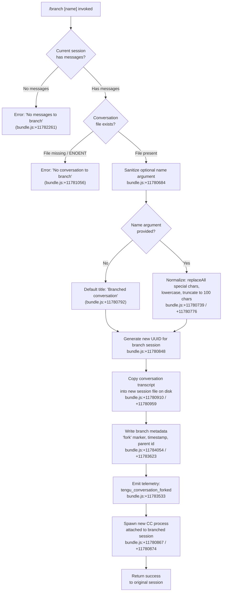

# `/branch`

> Analysis basis: CC v2.1.199 bundle.js (AST extraction + Claude interpretation)
> Minimum version: v2.1.199

---

## Overview

The `/branch` command forks the current conversation at its present point, creating a new independent conversation session that inherits the history up to that moment. It copies the existing conversation transcript into a fresh session file on disk, then spawns a new foreground Claude Code process attached to that branched conversation. An optional `[name]` argument sets the title of the branched session.

---

## Registration

| Field | Value |
|---|---|
| type | `local-jsx` |
| name | `branch` |
| description | `Create a branch of the current conversation at this point` |
| argumentHint | `[name]` |
| module_id | `S4o` |
| load_inline | `true` |
| loc_byte | `13205953` |
| loc_byte_end | `13206130` |
| loc_line | `9839` |
| arbor_handler.name | `J6f` |
| arbor_handler.fqn | `claude-2.1.199::J6f` |
| arbor_handler.kind | `AsyncFunction` |
| arbor_handler.resolution_path | `module_id` |
| arbor_handler.n_hits | `0` |

Analysis basis: CC v2.1.199 bundle.js:+13205953

---

## Input Branching

The command has four distinct logical paths based on the state of the current conversation and whether an optional branch name was supplied.



---

## Behavioral Spec

### Top-level Handler (`J6f`)

The Arbor-resolved handler `J6f` is an `AsyncFunction` reached via `module_id → S4o`. It delegates the branching workflow to an inner orchestrator (`R5l`).

Analysis basis: CC v2.1.199 bundle.js:+11784337

```
async function branchCommandHandler(context):
    result = await branchOrchestrator(context)
    return result
```

### Input Normalization (`x5l`)

Before any file I/O, the raw argument string is sanitized.

Analysis basis: CC v2.1.199 bundle.js:+11780684

```
function normalizeBranchName(rawArg):
    // Strip or replace characters not safe for filenames
    cleaned = rawArg.replace(UNSAFE_CHARS_REGEX, "")
    // Lowercase for consistency
    cleaned = cleaned.toLowerCase()
    // Truncate to maximum of 100 characters
    if cleaned.length > 100:
        cleaned = cleaned.slice(0, 100)
    return cleaned
```

Maximum branch name length: 100 characters (bundle.js:+11780776)

### Conversation Existence Check (`k5l` early guard)

The handler checks whether the current session has any messages before attempting to copy.

Analysis basis: CC v2.1.199 bundle.js:+11781050 / +11782261

```
function guardConversationExists(messages, sessionFilePath):
    if messages is empty or length == 0:
        throw UserError("No messages to branch")

    try:
        fileHandle = openFile(sessionFilePath, "open")
    catch ENOENT:
        throw UserError("No conversation to branch")

    return fileHandle
```

Error string "No conversation to branch": bundle.js:+11781056
Error string "No messages to branch": bundle.js:+11782261

### Branch Session Creation (`k5l` main body)

This is the core file-duplication routine.

Analysis basis: CC v2.1.199 bundle.js:+11780848

```
async function createBranchSession(sourceMessages, branchName, parentSessionId):
    newSessionId  = crypto.randomUUID()
    sessionTitle  = branchName if branchName else "Branched conversation"

    // Ensure destination directory exists
    await fs.mkdir(destinationDir, { recursive: true })

    // Stream source conversation file to new location
    readStream  = fs.createReadStream(sourceFilePath, { encoding: "utf8", highWaterMark: 448 })
    writeStream = fs.createWriteStream(destinationFilePath)

    // Relay data through readline interface to allow per-line processing
    lineInterface = readline.createInterface({ input: readStream })
    transformedLines = lineInterface.lines.map(line => applyContentReplacements(line))

    // Write transformed content to destination
    for line in transformedLines:
        writeStream.write(line)

    await streamFinished(writeStream)

    // Attach fork metadata
    forkRecord = {
        type:      "fork",
        sessionId: newSessionId,
        parentId:  parentSessionId,
        title:     sessionTitle,
        timestamp: new Date().toISOString()
    }

    return { newSessionId, forkRecord }
```

Buffer high-water mark: 448 bytes (bundle.js:+11780941)
Encoding: `utf8` (bundle.js:+11780992)
Open mode: `open` (bundle.js:+11781018)

### Content Replacement Pass (`Z3e`)

During the stream copy, message content is reprocessed to update internal references.

Analysis basis: CC v2.1.199 bundle.js:+11780684 / +1094370

```
function transformMessageLine(rawLine):
    // Preserve user-role messages (role == "user") unchanged in structure
    if message.role == "user":
        // tool_result content blocks are kept verbatim
        if content.type == "tool_result":
            return content
        if content.type == "text":
            // Sanitize control characters
            text = text.replaceAll(CONTROL_CHAR_PATTERN, "")
    // Validate against pattern; slice to 200-char cap for certain fields
    if VALIDATION_REGEX.test(field):
        field = field.slice(0, 200)
    return processedLine
```

Text field slice cap: 200 characters (bundle.js:+1094813)
Analysis basis: CC v2.1.199 bundle.js:+1094572 / +1094622 / +1094780 / +1094819

### Metadata Persistence and Roster Update (`Rj`, `CYe`)

After the session file is written, two sub-routines update persistent metadata stores.

Analysis basis: CC v2.1.199 bundle.js:+11783500 / +11783518

```
async function persistBranchMetadata(newSessionId, title, parentId):
    // Write custom-title entry via sessionRenameWriter (Rj)
    await sessionRenameWriter({
        sessionId: newSessionId,
        title:     title,
        type:      "custom-title"
    })
    emitTelemetry("tengu_session_renamed")

    // Write agent-name entry via agentNameWriter (CYe)
    await agentNameWriter({
        sessionId: newSessionId,
        type:      "agent-name"
    })
    emitTelemetry("tengu_agent_name_set")
```

Metadata key `"custom-title"`: bundle.js:+13865755
Metadata key `"agent-name"`: bundle.js:+13870683

### Git Worktree Detection (`X6f`, `Eee`, `gTe`)

Before spawning the child process, the handler optionally detects the active git worktree so the branched session inherits the correct working directory.

Analysis basis: CC v2.1.199 bundle.js:+11783469 / +11782931

```
async function detectWorktree(cwd):
    result = await exec("git", ["worktree", "list", "--porcelain"], { cwd })
    emitTelemetry("tengu_worktree_detection")
    lines = result.stdout.split("\n")
    for line in lines:
        if line.startsWith("worktree "):
            path = line.slice(9)   // "worktree ".length == 9
            ...
    return resolvedWorktreePath
```

Literal `"worktree "` prefix: bundle.js:+9465648
Slice offset 9: bundle.js:+9465682
`--porcelain` flag: bundle.js:+9465447

### Process Spawn (`k5l`, calls `kt`, `cH`, `ar`)

After all files are written, the branched session is opened by spawning a new Claude Code process.

Analysis basis: CC v2.1.199 bundle.js:+11780867

```
async function spawnBranchedSession(newSessionId, worktreePath):
    // Initialise session state objects
    sessionState    = initSessionState(newSessionId)      // kt
    channelHandle   = openChannel(newSessionId)           // cH
    agentRef        = createAgentReference(newSessionId)  // ar

    // Spawn the CC daemon/foreground process
    process = daemonSpawn({
        sessionId:   newSessionId,
        cwd:         worktreePath,
        mode:        "auto",
        bufferSize:  384
    })
    emitTelemetry("tengu_conversation_forked")
    return process
```

Spawn buffer size: 384 bytes (bundle.js:+11781151)
Mode constant `"auto"`: bundle.js:+11783487
`"fork"` marker written to session record: bundle.js:+11784054

### Error Handling (`ke`, `sr`)

All I/O errors are routed through a structured error handler that logs and optionally surfaces a user-facing message.

Analysis basis: CC v2.1.199 bundle.js:+11781091

```
function handleBranchError(err):
    code = extractErrorCode(err)    // sr → String(err.code)
    if code == "ENOENT":
        logError("No conversation to branch")
    else:
        logError("Unknown error occurred")
    pushToErrorQueue(err)           // knt.push
    logErrorToSystem(err)           // fne.logError
```

Error string `"Unknown error occurred"`: bundle.js:+11784221

---

## State & Side Effects

| Item | Detail |
|---|---|
| Telemetry | `tengu_conversation_forked` (bundle.js:+11783533), `tengu_session_renamed` (bundle.js:+13865847), `tengu_agent_name_set` (bundle.js:+13870781), `tengu_worktree_detection` (bundle.js:+9465529), `tengu_feature_ok` (bundle.js:+1039941), `tengu_feature_bad` (bundle.js:+1040008) |
| Disk writes | New session transcript file streamed from source; fork metadata record appended; `custom-title` and `agent-name` entries written to metadata store |
| Process spawn | A new Claude Code foreground process is launched attached to the branched session ID |
| Hook registration | `process.on("exit", …)` registered inside the `ru` initialisation path (bundle.js:+13827589) |
| appState changes | New session UUID registered in the active sessions map; parent session continues running unchanged |
| Sound | None observed in depth-2 traversal |
| Error queue | Errors pushed to `knt` ring-buffer; last N errors retained via `ahn.shift` / `ahn.push` pattern (bundle.js:+875141 / +875153) |

---

## Version History

| Version | Change |
|---|---|
| v2.1.199 | Initial analysis |

---

## Common Mistakes

1. **Running `/branch` with no prior conversation turns** — the command aborts immediately with "No messages to branch" (bundle.js:+11782261). At least one message exchange must exist before branching.
2. **Providing a branch name with special characters or excessive length** — the name is silently truncated to 100 characters and stripped of unsafe characters (bundle.js:+11780776). The displayed title may differ from what was typed.
3. **Running `/branch` when the session file has been externally deleted** — the ENOENT guard fires and surfaces "No conversation to branch" rather than a generic I/O error (bundle.js:+11781056).
4. **Expecting the original session to be paused** — the branch spawns a completely independent process; both the parent and the child run concurrently.
5. **Assuming the branch inherits unsaved in-memory tool state** — only the persisted transcript is copied; any in-flight tool results not yet written to disk will not appear in the branched session.

---

## Appendix — Identifier Mapping

> For bundle debugging only. Identifiers change across versions.

| Identifier | Role |
|---|---|
| `J6f` | Top-level async handler for `/branch` (arbor-resolved entry point) |
| `R5l` | Branch orchestrator — coordinates all sub-steps |
| `k5l` | Core branch session creation routine (file copy, spawn) |
| `x5l` | Branch name normalization / input sanitization |
| `Z3e` | Per-line content transformation during transcript copy |
| `X6f` | Git worktree detection wrapper |
| `Eee` | Worktree listing executor |
| `gTe` | Git porcelain output parser |
| `Rj` | Session rename / custom-title metadata writer |
| `CYe` | Agent-name metadata writer |
| `kj` | Low-level metadata append-file helper |
| `K2` | Session state initialiser |
| `ig` | Session registration helper |
| `ru` | Process lifecycle registration (exit handler) |
| `Ai` | BFS/process register call |
| `oi` | String index/slice utility |
| `Cde` | Post-copy roster update orchestrator |
| `Uy` | Session basename resolver |
| `LX` | Path lookup helper used by `Uy` |
| `ix` | Regex-escape utility for string replacement |
| `kt` | Session state factory |
| `ar` | Agent reference factory |
| `$v` | Conversation store writer |
| `Lg` | Conversation log path resolver |
| `L3` | Log path component builder |
| `ML` | Message list writer |
| `pn` | Promise node / async continuation helper |
| `rn` | Rejection / error normaliser |
| `ke` | Structured error handler |
| `sr` | Error code extractor |
| `at` | String coercion utility |
| `Pi` | Error classification router |
| `KTs` | Error type tagger |
| `Gku` | Error ring-buffer manager |
| `phe` | Path helper / home-dir resolver |
| `ven` | Session directory path builder |
| `Kie` | Daemon directory resolver |
| `Sge` | Session metadata path builder |
| `we` | UI event emitter |
| `V` | Void / no-op or value extractor |
| `Pe` | UI component updater |
| `GZe` | Global event emitter base |
| `On` | Graceful shutdown / abort helper |
| `Le` | Layout event emitter |
| `sCe` | Memory pressure monitor |
| `cum` | Low-memory check aggregator |
| `ot` | System metrics collector |
| `pum` | macOS memory query via FFI |
| `T` | Terminal output writer |
| `HWe` | Pinned-jobs state file reader |
| `n4t` | Job state path resolver |
| `MR` | Job directory resolver |
| `Wt` | JSON safe-parse helper |
| `Aup` | Directory job scanner |
| `aoa` | Job directory creator |
| `Ff` | File filter / exclusion checker |
| `Q` | Background worker registry |
| `vee` | Worker state-file reader |
| `Hge` | Worker path resolver |
| `FVl` | Worker state-file unlinker |
| `wcs` | Background session claim sender |
| `aQo` | Session claim file writer |
| `Cen` | Auth token path resolver |
| `Ien` | Session inner path resolver |
| `ge` | String coercion / format helper |
| `bQm` | Claim send timeout manager |
| `TQm` | IPC connect-and-send helper |
| `AQm` | Claim frame builder |
| `_d` | Rejection descriptor builder |
| `mM` | Binary frame encoder (IPC protocol) |
| `xe` | JSON stringify wrapper |
| `Mcs` | Background session lifecycle manager |
| `Bl` | Job path builder |
| `mr` | Session state classifier |
| `Zf` | State "nonconforming" tagger |
| `qe` | State tag resolver |
| `Yi` | Worker job state machine |
| `Zio` | Periodic state sync |
| `Qg` | Active-job tracker |
| `tk` | Job activation checker |
| `JRe` | Roster entry parser |
| `yup` | Roster sub-entry parser |
| `op` | Job output path resolver |
| `Uf` | Atomic file write helper |
| `ty` | Transient state cleaner |
| `uIt` | Worker session initialiser |
| `p5` | Worker session file reader |
| `Ezf` | Worker session file writer |
| `wen` | Session ident path resolver |
| `kIe` | PTY-pids path resolver |
| `hFe` | PTY path resolver |
| `_M` | Late-join metadata reader |
| `QVl` | Session metadata file reader |
| `wk` | PTY session path builder |
| `rGo` | PTY socket path builder |
| `cIt` | PTY identity path resolver |
| `mP` | Session metadata path builder (alt) |
| `Ree` | Session roster entry reader |
| `g` | Generic data transformer |
| `Y` | Disposable resource wrapper |
| `K` | Rate-limit event dispatcher |
| `csc` | Rate-limit classifier |
| `k$` | Spend-cap checker |
| `O` | Request queue enqueuer |
| `m` | Message pipeline filter |
| `qAr` | Message prefix stripper |
| `k` | Background worker task runner / watcher |
| `Eos` | Scheduled task executor |
| `pWc` | Scheduler lock/log helper |
| `ol` | Log path builder |
| `Qne` | Task result notifier |
| `mWc` | Scheduler file writer |
| `yos` | Scheduler log tagger |
| `gWc` | Scheduler state reader |
| `vin` | Scheduler file path builder |
| `AT` | Process signal sender |
| `jI` | Drain signal helper |
| `Lin` | Scheduler lock releaser |
| `D` | Daemon yield writer |
| `rAe` | Log path builder (alt) |
| `N` | Background worker sweep / watcher |
| `Z` | Worker voice / grace-clock manager |
| `Tuc` | Background retire trigger |
| `Bn` | Background sweep callback |
| `re` | Worker retire-if-settled helper |
| `vpr` | Attach-upgrade trigger |
| `se` | Worker respawn helper |
| `I` | Input event handler |
| `R` | HTTP request router |
| `b` | Auth userinfo fetcher |
| `Hj` | Process handle checker |
| `E` | MCP connection batch processor |
| `VQe` | MCP connection score ranker |
| `yYc` | MCP key scorer |
| `H` | Process kill-all helper |
| `ig` | Session init (duplicate row — same role as above) |
| `ih` | Cache invalidation helper |
| `u` | Sort comparator for session list |
| `$_c` | Context file collector / `.claude` scanner |
| `PJe` | Context file binary packer |

---

Note: index built via Arbor fallback; some signals (telemetry, literals) may be missing — see arbor-fallback.js.