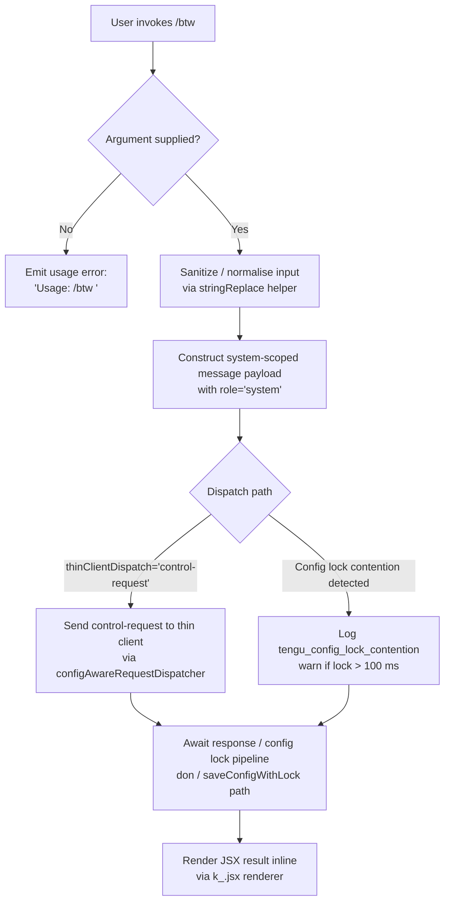

# `/btw`

> Analysis basis: CC v2.1.199 bundle.js (AST extraction + Claude interpretation)
> Minimum version: v2.1.199

---

## Overview

The `/btw` ("by the way") command allows the user to pose a quick side question to the agent without disrupting the flow of the primary conversation. It operates as an `immediate` local-jsx command that dispatches a `control-request` to the thin client, injecting the question as a system-scoped message rather than a regular user turn. The handler (`iGf`) validates that the user has supplied a question argument, constructs a system-level query payload, and renders the result inline via JSX without waiting for a full agentic turn.

---

## Registration

| Field | Value |
|---|---|
| type | `local-jsx` |
| name | `btw` |
| description | Ask a quick side question without interrupting the main conversation |
| argumentHint | `<question>` |
| immediate | `true` |
| thinClientDispatch | `control-request` |
| module_id | `O5l` |
| load_inline | `true` |
| loc_byte | `11791666` |
| loc_byte_end | `11791905` |
| loc_line | `8510` |
| arbor_handler.name | `iGf` |
| arbor_handler.fqn | `claude-2.1.199::iGf` |
| arbor_handler.kind | `AsyncFunction` |
| arbor_handler.resolution_path | `module_id` |
| arbor_handler.n_hits | `0` |

Analysis basis: CC v2.1.199 bundle.js:+11791666

---

## Input Branching

The handler has 3 distinct branches based on argument presence and system message routing:



Analysis basis: CC v2.1.199 bundle.js:+11791261 (usage literal), +11791302 (system role literal), +11791331 (dispatch call), +11791377 (JSX render)

---

## Behavioral Spec

### 1. Argument Validation

```
async function btwCommandHandler(context, args):
    question = args.trim()
    if question is empty:
        return renderInlineError("Usage: /btw <your question>")
    proceed to sanitizeAndDispatch(context, question)
```

The string literal `"Usage: /btw <your question>"` is present verbatim in the bundle at `+11791263`. If the argument is absent or blank the handler short-circuits with this usage message and does not dispatch any request.

Analysis basis: CC v2.1.199 bundle.js:+11791261–11791263

### 2. Input Sanitisation

```
function sanitiseInput(rawText):
    result = stringReplaceHelper(rawText)   // calls t.replace internally
    return result
```

The `stringReplaceHelper` function (`e`, called from `iGf` at `+11791261`) delegates to `t.replace` (`+18149542`) to normalise the raw argument string before it is embedded in the payload.

Analysis basis: CC v2.1.199 bundle.js:+11791261, +18149542

### 3. System-Scoped Payload Construction

```
function buildPayload(sanitisedQuestion):
    payload = {
        role: "system",           // literal at +11791302
        content: sanitisedQuestion
    }
    return payload
```

The role `"system"` (bundle literal at `+11791302`) ensures the side question is injected as a system message, not a user turn, preserving conversational context.

Analysis basis: CC v2.1.199 bundle.js:+11791302

### 4. Control-Request Dispatch (`configAwareRequestDispatcher` / `Hn`)

```
async function configAwareRequestDispatcher(payload, context):
    sessionRecord = buildSessionRecord(context)     // Hbc: stamps Date.now()
    environment   = resolveEnvironment(context)     // oon: Object.entries scan
    pendingSlot   = acquireOrResolvePendingSlot()   // Ygr: qgr map + f7 map
    vitalState    = readVitalState()                // vy
    configSnapshot = await loadThinModelConfig()    // YTm path
    mergedPayload  = Object.assign({}, payload, configSnapshot)
    response       = await Promise.resolve(dispatchControlRequest(mergedPayload))
    return response
```

`Hn` (the dispatcher, called from `iGf` at `+11791331`) orchestrates session stamping, environment resolution, a pending-slot map, and config merging before forwarding the `control-request`.

Analysis basis: CC v2.1.199 bundle.js:+11791331, +14380400–14380568

### 5. Pending-Slot / Request-Dedup Logic (`pendingSlotResolver` / `Ygr`)

```
function pendingSlotResolver(key):
    if qgr_map.has(key):
        return Promise.resolve(qgr_map.get(key))    // +14379765–14379777
    slot = f7_map.get(key) ?? createNewSlot(key)
    f7_map.set(key, slot)                           // +14379795
    slot.then(result =>
        qgr_map.set(key, result)                    // +14380009
        f7_map.delete(key)                          // +14379917
    )
    return slot
```

This deduplicates concurrent `/btw` dispatches by key. If a pending promise already exists in `f7_map` it is reused; once resolved the result is cached in `qgr_map`.

Analysis basis: CC v2.1.199 bundle.js:+14379765–14380019

### 6. Config-Write Pipeline (`saveConfigWithLock` / `don`)

When the dispatch path touches persistent config (e.g. updating session state), it enters a lock-guarded write cycle:

```
async function saveConfigWithLock(configObject):
    lockDir = path.dirname(configPath)
    await fs.mkdir(lockDir, { recursive: true })    // +14384573
    lockAcquiredAt = Date.now()                     // +14384614
    elapsed = Date.now() - lockAcquiredAt
    if elapsed > 100:                               // threshold at +14384752
        log("error", "Lock acquisition took longer than expected…")
        emit("tengu_config_lock_contention")        // +14384847

    // Re-read config under lock
    try:
        diskConfig = await fs.stat(configPath)      // +14384929
    catch ENOENT:                                   // +14385115
        diskConfig = null

    if diskConfig has parse error:
        log("saveConfigWithLock: re-read hit a parse error; auto-repairing…")
        emit("tengu_config_auto_repaired")          // +14385384

    if diskConfig is missing auth that cache has:
        log("saveConfigWithLock: re-read config is missing auth…")
        emit("tengu_config_auth_loss_prevented")    // +14386054
        return  // refuse write to protect ~/.claude.json

    // Rotate backups (max 5)                       // +14386501
    backupFiles = fs.readdir(backupDir)
    backupFiles
        .filter(f => f.startsWith(".backup."))      // +14386360
        .sort()
        .slice(5)                                   // keep newest 5
        .forEach(old => fs.unlink(old))             // +14386640

    await atomicWriteFile(configPath, configObject) // Zle path
    emit("tengu_config_stale_write") if stale       // +14384985
```

Analysis basis: CC v2.1.199 bundle.js:+14384540–14386854

### 7. Atomic File Write (`atomicFileWriter` / `Zle`)

```
async function atomicFileWriter(targetPath, content):
    tempPath = targetPath + "." + randomBytes(6).toString("hex")  // +1116528, +1116556
    fd = await fs.open(tempPath, flags)            // +1116057
    await fd.writeFile(content)                    // +1117082
    await fd.chmod(originalPermissions)            // +1117143
    await fd.sync()                                // +1117288
    await fd.close()                               // +1117406
    await fs.rename(tempPath, targetPath)          // +1117680
    if rename fails with EACCES:                   // +1117850
        log("writeFileAndFlush: in-place fallback write failed; content preserved at temp path")
        emit("tengu_config_fallback_write")        // +14384448
```

Uses a random 6-byte hex suffix for the temp file to avoid collisions between concurrent Claude instances.

Analysis basis: CC v2.1.199 bundle.js:+1116528–1118722

### 8. Global-Config Save Guard (`globalConfigSaveGuard` / `Jgr`)

```
async function globalConfigSaveGuard(globalConfig):
    currentDisk = await readDiskConfig()           // Zgr path
    if currentDisk is missing auth that cache has:
        log("saveGlobalConfig fallback: re-read config is missing auth…")
        // literal at +14381321
        return  // refuse write
    label = classify(globalConfig)                 // one of:
        // "unknown" | "local" | "migrated" | "native"
        // "installed" | "disabled" | "enabled"
        // "no_permissions" | "global" | "not_configured"
    emit("save_global")                            // literal at +14381507
    await atomicWriteFile(globalConfigPath, globalConfig)
```

Analysis basis: CC v2.1.199 bundle.js:+14381321–14381944

### 9. JSX Render

```
function renderBtwResult(responseData):
    return k_.jsx(InlineResponseComponent, { data: responseData })
```

`iGf` calls `k_.jsx` at `+11791377` to render the side-question response inline in the terminal UI without replacing the active conversation view.

Analysis basis: CC v2.1.199 bundle.js:+11791377

---

## State & Side Effects

| Item | Detail |
|---|---|
| Telemetry: `tengu_config_lock_contention` | Fired when config lock acquisition exceeds 100 ms (`+14384847`) |
| Telemetry: `tengu_config_stale_write` | Fired when a stale config write is detected (`+14384985`) |
| Telemetry: `tengu_config_parse_error` | Fired when a config file fails to parse on disk re-read (`+14389460`) |
| Telemetry: `tengu_config_auto_repaired` | Fired when the config is auto-repaired from the cached copy under lock (`+14385384`) |
| Telemetry: `tengu_config_auth_loss_prevented` | Fired when a write is refused to protect auth fields (`+14386054`) |
| Telemetry: `tengu_config_fallback_write` | Fired when the atomic rename fails and an in-place fallback write is attempted (`+14384448`) |
| Config backup rotation | Keeps at most 5 `.backup.*` files in the backup directory; older ones are unlinked (`+14386501`) |
| Pending-slot dedup map | `f7_map` and `qgr_map` track in-flight and completed side-question requests in memory |
| Session record timestamp | `Hbc` stamps `Date.now()` into the session record (`+14380354`) |
| JSX side-effect | Renders inline response component via `k_.jsx`; does not replace primary conversation view (`+11791377`) |
| File I/O | `saveConfigWithLock` may write to `~/.claude.json` with atomic rename; writes are guarded against auth-loss regression (GH #3117) |
| thinClientDispatch | Sends a `control-request` signal to the thin client layer; does not post a normal user message to the model |

---

## Version History

| Version | Change |
|---|---|
| v2.1.199 | Initial analysis |

---

## Common Mistakes

1. **Omitting the argument** — invoking `/btw` with no text after it will always produce the usage error `"Usage: /btw <your question>"` and will not dispatch any request. The `<question>` argument is mandatory.
2. **Expecting a full conversational turn** — `/btw` is `immediate` and dispatches a `control-request`, not a standard user message. The agent does not see it as a regular turn; it is a system-level side channel. Do not use it for questions that depend on or should alter conversational context.
3. **Assuming blocking behaviour** — because `immediate: true` is set, the command does not queue behind other pending turns. However, the underlying config-write pipeline is lock-guarded and may briefly contend if another Claude instance is running simultaneously (see `tengu_config_lock_contention`).
4. **Confusing response scope** — the reply is rendered inline as a JSX component and is not appended to the conversation transcript. Downstream references to "what `/btw` said" may not be visible to the model in future turns.
5. **Config corruption risk** — the handler touches `saveConfigWithLock` as part of session-state persistence. Forcibly killing the process during this window may leave a temporary file (`.backup.<hex>`) on disk; this is expected and cleaned up on the next invocation.

---

## Appendix — Identifier Mapping

> For bundle debugging only. Identifiers change across versions.

| Identifier | Role |
|---|---|
| `iGf` | Main `/btw` command handler (AsyncFunction); entry point resolved via `module_id` → `O5l` |
| `e` | Input sanitisation helper; delegates to `t.replace` |
| `Hn` | Config-aware request dispatcher; orchestrates session record, environment, pending-slot, and control-request dispatch |
| `BJo` | Sub-helper called at dispatch entry (`+14380400`) — likely request builder |
| `Hbc` | Session-record builder; stamps `Date.now()` and calls `ite` |
| `ite` | Session-record field formatter / initialiser |
| `oon` | Environment resolver; scans entries via `Object.entries` and delegates to `Wgr` |
| `Wgr` | Environment-entries sub-scanner; uses `Object.entries` |
| `Ygr` | Pending-slot resolver; manages `qgr_map` and `f7_map` dedup maps |
| `WJo` | Slot-creation helper; calls `vy`, `zt`, `f7.get`, `Wa`, `b$`, `GJo`, `hae` |
| `zt` | Likely async/await runtime helper (promise unwrapper) |
| `b$` | String prefix checker; uses `e.startsWith` and `e.slice` |
| `GJo` | Slot-resolution finaliser |
| `hae` | Post-resolution hook inside slot creation |
| `YTm` | Thin-client model config loader; drives `don`, `oon`, `con`, `lon`, `T`, `che`, `f7.get`, `V`, `Jgr` |
| `don` | Core `saveConfigWithLock` implementation; handles lock, stat, backup rotation, atomic write |
| `wh` | Lock acquisition helper; calls `vhi` and `Object.assign` |
| `T` | Log / output writer; formats and flushes messages via `o.write` / `o.flush` |
| `V` | Likely structured-output / result wrapper |
| `rn` | JSON parse / config deserialiser helper |
| `Zgr` | Config file reader (`readConfigFromDisk`); handles backup copy, `r.readFile`, `FJo`, `VJo`, `r.copyFile`, `setImmediate` |
| `che` | Config cache accessor |
| `xe` | JSON serialiser wrapper; delegates to `JSON.stringify` |
| `VJo` | Backup-path builder; uses `Hy.join` and `tr` |
| `v` | Blurred/focused window-state handler; checks `"blurred"` / `"focused"` literals |
| `E` | MCP / SDK connection manager; handles `"connected"` / `"failed"` states via `Promise.all` |
| `L` | Away-summary generator; checks rate limits, draft input, background work, recap presence |
| `Zle` | Atomic file writer; uses random hex temp path, `chmod`, `sync`, `rename`, fallback on `EACCES` |
| `a` | Spend-limit / billing guard; checks `spend.blocked`, `billing_error`, HTTP 429 |
| `con` | Config-state classifier; maps config fields to `"unknown"` / `"local"` / `"native"` / … labels |
| `ZTm` | Timestamp helper for config classification; stamps `Date.now()` |
| `lon` | Config-read + vital-state merge helper; calls `Zgr` and `vy` |
| `Jgr` | Global-config save guard; refuses writes that would erase auth (GH #3117) |
| `Pe` | Post-save hook / cleanup; calls `GZe` |

---

Note: index built via Arbor fallback; some signals (telemetry, literals) may be missing — see arbor-fallback.js.